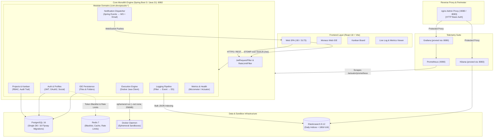

<div align="center">

# DevOps Suite

### The Unified Developer Productivity & Observability Platform

A production-grade, monolithic engineering workspace combining **secure sandboxed code execution**, **real-time Kanban project tracking**, **centralized Elasticsearch log intelligence**, **Prometheus/Grafana telemetry**, and a **cloud-persisted web IDE** into a single cohesive platform.

[](https://openjdk.org/)
[](https://spring.io/projects/spring-boot)
[](https://react.dev/)
[](https://www.docker.com/)
[](https://www.postgresql.org/)
[](https://redis.io/)
[](https://www.elastic.co/)
[](LICENSE)

[Architecture](#system-architecture) •
[Core Capabilities](#core-capabilities) •
[Cloud Deployment](#cloud-deployment) •
[Tech Stack](#technology-stack) •
[Quick Start](#quick-start) •
[Service Port Map](#service-port-map) •
[API Overview](#api--websocket-contracts) •
[Documentation](#documentation-index)

</div>

---

## Problem & Motivation

Modern engineering teams suffer from tool fragmentation. Developers constantly switch between disjointed apps: a REPL or online judge to test code, a task board for sprints, detached log viewers for debugging, and isolated dashboards for system metrics. Data, credentials, and context never travel together.

**DevOps Suite** consolidates these mission-critical developer workflows into an authenticated, production-grade workspace:
- **Write and safely execute code** in hardened, ephemeral Docker containers without leaving the browser.
- **Manage agile projects** with drag-and-drop Kanban boards with live WebSocket updates.
- **Debug live applications** with enriched HTTP request logs streamed in real time and indexed into Elasticsearch.
- **Observe system telemetry** via Spring Actuator, Prometheus metrics, and pre-provisioned Grafana dashboards.

---

## System Architecture

DevOps Suite is intentionally engineered as an **optimized modular monolith** — maximizing developer velocity, enforcing transactional data integrity, and simplifying deployment without the overhead of microservices or external message brokers.



---

## Core Capabilities

| Feature | Engineering Implementation |
|---|---|
| 🛡️ **Zero-Trust Security & Auth** | Stateless JWT authentication (1h access, 7d refresh) with Redis token revocation on logout. Native integration for **Google OAuth2** and **GitHub OAuth2**. Token-based password recovery via email. Role-Based Access Control (**`OWNER > ADMIN > MEMBER > VIEWER`**). |
| 🐳 **Docker-Sandboxed Code Runner** | Ephemeral, non-root Docker execution engine supporting **Java 21**, **Python 3.12**, **Node.js 24**, and **C++ (g++ 15)**. Enforces strict constraints: `--network=none`, read-only root filesystem, 256MB memory ceiling, 1 CPU core cap, and 30-second hard kill switches. |
| 📋 **Live Kanban Project Manager** | Agile boards with customizable columns, WIP limits, task reordering, duplication, and granular change auditing (`task_audit_history` with JSONB snapshots). Real-time diffs broadcasted over WebSocket (`/topic/tasks/{projectId}`). |
| 💻 **Project-Scoped Web IDE** | In-browser IDE powered by Monaco Editor with file tree persistence in PostgreSQL (`ide_files`). Supports multi-tab editing, language auto-detection, execution integration, and live HTML output previews. |
| 🔍 **Elasticsearch Logging Pipeline** | Non-blocking HTTP request logging (`RequestLoggingFilter` → Spring Event → `ElasticsearchLogService`). Structured documents indexed into rolling daily indices (`devopssuite-logs-*`) with correlation IDs (`traceId`, `userId`, `projectId`) and automated 180-day Index Lifecycle Management (ILM). |
| 📊 **Full-Stack Observability** | Micrometer/Prometheus instrumentation scraping JVM memory, garbage collection, and HTTP request metrics. Nginx reverse proxy securing Grafana dashboards (`:8080`) and Kibana explorers (`:8083`) behind HTTP Basic Auth. |
| 🔔 **Dual-Channel Notification Engine** | In-app WebSocket toast alerts coupled with Spring Mail HTML notifications. Configurable per-user, per-event preferences grid (`V14` Flyway schema). |
| 👥 **Social Profiles & Activity Heatmaps** | GitHub-style sparse activity heatmaps (365 days of execution metrics), avatar upload/crop pipeline, profile view counters, and asymmetric user follow graph (`user_follows`). |

---

## Cloud Deployment

DevOps Suite was successfully deployed and verified on **Microsoft Azure** utilizing the **Azure for Students free subscription credits**:
- **Host Infrastructure:** Ubuntu Linux Virtual Machine running the multi-container Docker Compose production stack.
- **Continuous Integration & Delivery:** Fully automated **GitHub Actions CI/CD** pipeline building and deploying directly to Azure on push.
- **Cloud Observability & Alerting:** Monitored with **Azure Monitor Metrics**, VM availability alerts, and **Action Groups** for automated incident notifications.

> 📸 **Deployment Evidence & Architecture:** For complete visual proof of deployment, Azure portal overview, CI/CD run logs, and Azure Monitor telemetry, see the **[Azure Deployment Guide & Screenshots](docs/azure-deployment.md#-deployment-verification--evidence)**.

---

## Technology Stack

```
DevOps Suite
├── Backend
│   ├── Language & Runtime : Java 21 (OpenJDK), Eclipse Temurin JRE
│   ├── Framework          : Spring Boot 3.x, Spring Security, Spring Data JPA
│   ├── Real-Time          : Spring WebSocket (STOMP over SockJS)
│   ├── Database Migration : Flyway (16 Versioned Migrations)
│   ├── Sandboxing Client  : Docker Java Client (docker-java)
│   └── Metrics & Audit    : Spring Boot Actuator, Micrometer, Prometheus
├── Frontend
│   ├── Architecture       : React 18 SPA (JavaScript / JSX)
│   ├── Build Tool & Dev   : Vite, PostCSS, ESLint
│   ├── Styling            : Tailwind CSS, Dark/Light Themes
│   ├── Code Editor        : Monaco Editor (@monaco-editor/react)
│   ├── Real-Time Client   : StompJs, SockJS-Client
│   └── Data Visualization : Recharts
└── Infrastructure & DevOps
    ├── Orchestration      : Docker Compose (Multi-stage builds)
    ├── Primary Database   : PostgreSQL 16 Alpine
    ├── Cache & Rate Limit : Redis 7 Alpine
    ├── Search & Analytics : Elasticsearch 8.12, Kibana 8.12
    ├── Reverse Proxy      : Nginx Alpine (Admin Basic Auth Proxy)
    └── CI / CD            : GitHub Actions Automated Build & Test
```

---

## Quick Start

### Prerequisites
- **[Docker Desktop](https://www.docker.com/products/docker-desktop/)** (version 24+ recommended)
- **Git**

> *Note: Java 21, Maven 3.9+, and Node.js 24+ are only required if running outside Docker for native debugging.*

---

### 1. Clone & Configure

```bash
# Clone the repository
git clone https://github.com/123suraj-sky/DevOps-Suite.git
cd DevOps-Suite

# Initialize environment configuration
cp .env.example .env
```

Review `.env` and set your credentials. Minimal variables:
```env
DB_PASSWORD=password
JWT_SECRET=your-secure-random-256-bit-hmac-sha256-secret-key-min-32-chars
ADMIN_PASSWORD=admin-secure-pass
```

---

### 2. Launch Full Infrastructure Stack (Recommended)

Start the entire platform (monolith backend, React frontend via nginx, PostgreSQL, Redis, Elasticsearch, Kibana, Prometheus, Grafana):

```bash
docker-compose up -d
```

> **First Run Note:** Maven downloads dependencies and builds the optimized Alpine JRE image (~2–3 min). Subsequent starts utilize cached Docker layers.

---

### 3. Alternative: Local Frontend Hot-Reload Development

If actively developing frontend components with instant Vite HMR:

```bash
# 1. Start all infrastructure and backend in Docker
docker-compose up -d postgres redis elasticsearch kibana prometheus grafana backend

# 2. Start the local frontend Vite dev server
cd frontend
npm install
npm run dev
```

*Frontend will run locally at `http://localhost:5173` targeting backend API at `http://localhost:8082`.*

---

## Service Port Map

| Component | Host Port | Internal Port | Access Method | Credentials / Security |
|---|---|---|---|---|
| **Frontend Web App** | `:80` | `80` | `http://localhost:80` | Public Web SPA |
| **Frontend Dev (Vite)** | `:5173` | `5173` | `http://localhost:5173` | Local development server |
| **Backend REST API** | `:8082` | `8081` | `http://localhost:8082/api` | JWT Bearer Authentication |
| **WebSocket Broker** | `:8082` | `8081` | `ws://localhost:8082/ws` | STOMP CONNECT Handshake |
| **Grafana Dashboards** | `:8080` | `3000` | `http://localhost:8080` | Nginx Proxy (HTTP Basic Auth) |
| **Kibana Log Explorer** | `:8083` | `5601` | `http://localhost:8083` | Nginx Proxy (HTTP Basic Auth) |
| **Prometheus Scraper** | `:9090` | `9090` | `http://localhost:9090` | Raw Metrics (Scrape target) |
| **PostgreSQL Database**| — | `5432` | Internal Docker Network | Secured within container network |
| **Redis Cache** | — | `6379` | Internal Docker Network | Secured within container network |
| **Elasticsearch** | — | `9200` | Internal Docker Network | Secured within container network |

---

## API & WebSocket Contracts

### Primary REST Routes (`/api/*`)

```
POST   /api/auth/register                 # User registration with password validation
POST   /api/auth/login                    # JWT issuance (access + refresh)
POST   /api/auth/google                   # Google OAuth2 exchange
POST   /api/auth/github                   # GitHub OAuth2 authorization exchange
POST   /api/auth/logout                   # Revokes token into Redis blacklist
GET    /api/auth/me                       # Authenticated user profile
PUT    /api/auth/me                       # Update profile details
POST   /api/auth/me/avatar                # Multipart avatar image upload

GET    /api/projects                      # List accessible projects (paginated)
POST   /api/projects                      # Create project (auto-provisions default board)
GET    /api/projects/{id}/boards          # Retrieve project Kanban boards
POST   /api/v1/tasks                      # Create task (supports /api/tasks & /api/v1/tasks)
PATCH  /api/v1/tasks/{id}/status          # Transition task status (TODO, IN_PROGRESS, DONE)
POST   /api/v1/tasks/{id}/duplicate       # Duplicate task in column
GET    /api/v1/tasks/{id}/history         # Task audit trail (JSONB snapshots)

POST   /api/code-execution/run            # Sandboxed code execution (Python, JS, Java, C++)
GET    /api/code-execution/{id}           # Poll async execution status / stdout / exit code
GET    /api/code-execution/history        # User execution logs
GET    /api/code-execution/activity       # 365-day sparse activity heatmap

GET    /api/ide/files?projectId={id}      # Fetch project file tree hierarchy
POST   /api/ide/files                     # Create virtual file / directory
PUT    /api/ide/files/{id}                # Update file content or rename path
DELETE /api/ide/files/{id}                # Delete file or directory recursively

GET    /api/admin/users                   # Admin overview & active users (ROLE_ADMIN)
GET    /api/admin/users/{id}/tasks        # Cross-project task audit for user
GET    /api/admin/users/{id}/logs         # Elasticsearch logs filtered by user

GET    /api/metrics/dashboard?range=1h    # System metrics (throughput, latency, health)
GET    /api/logs/search?projectId={id}    # Elasticsearch log search & query
GET    /actuator/health                   # Liveness probe (public)
GET    /actuator/prometheus               # Prometheus scraper endpoint (public)
```

### Real-Time WebSocket Channels (`/ws`)

Connect with STOMP client over SockJS. JWT token validated on CONNECT frame:

| Topic | Direction | Content Payload | Description |
|---|---|---|---|
| `/topic/tasks/{projectId}` | Server → Client | `TaskEvent` | Real-time Kanban diffs (`CREATED`, `UPDATED`, `STATUS_CHANGED`, `MOVED`, `DELETED`) |
| `/topic/logs/{projectId}` | Server → Client | `LogEvent` | Live HTTP request access log streaming per project |
| `/topic/notifications/{userId}` | Server → Client | `NotificationResponse` | Personal alerts (assignments, mentions, run failures) |

---

## Repository Structure

```
DevOps Suite/
├── backend/                             # Spring Boot 3 Monolith (Java 21)
│   ├── src/main/java/com/devopssuite/
│   │   ├── auth/                        # Security, OAuth2, Profiles & Social Follow
│   │   ├── admin/                       # User management & cross-project auditing
│   │   ├── project/                     # Projects, Boards, Columns, Tasks, Audit History
│   │   ├── execution/                   # Docker Java client sandbox runner
│   │   ├── ide/                         # Virtual file tree database persistence
│   │   ├── logging/                     # Request logging filter & Elasticsearch pipeline
│   │   ├── metrics/                     # Actuator instrumentation & Dashboard controller
│   │   ├── notification/                # Spring Events dispatcher (WS + Email)
│   │   ├── security/                    # JwtRequestFilter, RateLimitFilter, RBAC configs
│   │   └── config/                      # WebSocket, Redis, DataSeeder configurations
│   └── src/main/resources/
│       ├── application.yml              # Central Spring Boot configuration
│       └── db/migration/                # 16 Flyway migration scripts (V1 through V16)
├── frontend/                            # React 18 SPA (Vite + Tailwind CSS)
│   ├── src/
│   │   ├── api/                         # Domain Axios client modules (13 files)
│   │   ├── assets/                      # Imported SVG icon catalog (NN_name.svg convention)
│   │   ├── components/                  # Layout, modals, Kanban board, editor panels
│   │   ├── context/                     # Auth, WebSocket, Theme, IDE, Project Contexts
│   │   ├── pages/                       # 17 Route-level pages (IDE, Board, Dashboards)
│   │   └── utils/                       # Date formatters, token handlers
├── config/                              # Infrastructure config
│   ├── nginx/nginx.conf                 # Admin proxy configuration (Basic Auth)
│   ├── kibana/init-kibana.sh            # Auto-provisioning for Kibana data views & dashboards
│   └── prometheus/prometheus.yml        # Metrics scraping definitions
├── docker-compose.yml                   # Production-like multi-container topology
├── .env.example                         # Environment blueprint & secret definitions
└── docs/                                # Detailed architectural documentation
```

---

## Documentation Index

For in-depth architectural and implementation specifications:

- **[System Architecture (HLD)](docs/02-architecture-hld.md)** — Architectural design, sequences, and component interactions.
- **[Database Design & Schema](docs/03-database-design.md)** — Consolidated PostgreSQL ERD, indexing strategy, and V1–V16 migration catalog.
- **[REST & WebSocket API Design](docs/04-api-design.md)** — Exhaustive API request/response specifications and error models.
- **[Detailed Class Design (LLD)](docs/05-lld-detailed-design.md)** — Class contracts, service methods, and Spring Event mappings.
- **[Security Architecture](docs/06-security-design.md)** — JWT lifecycle, OAuth2 integration, and Docker sandbox isolation mechanics.
- **[Observability & Monitoring](docs/09-monitoring-observability.md)** — Structured logging schema, ILM retention, and Prometheus metrics.
- **[Configuration Guide](docs/15-configuration-guide.md)** — Comprehensive guide for all 27 environment variables.

---

## License

This project is licensed under the MIT License — see the [LICENSE](LICENSE) file for details.
