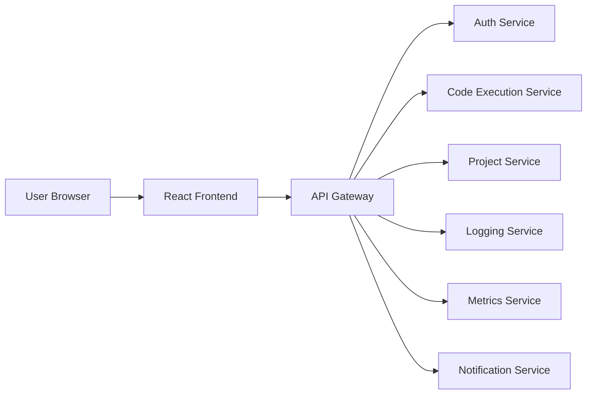
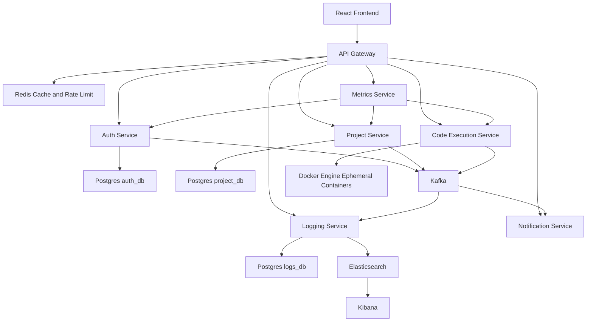
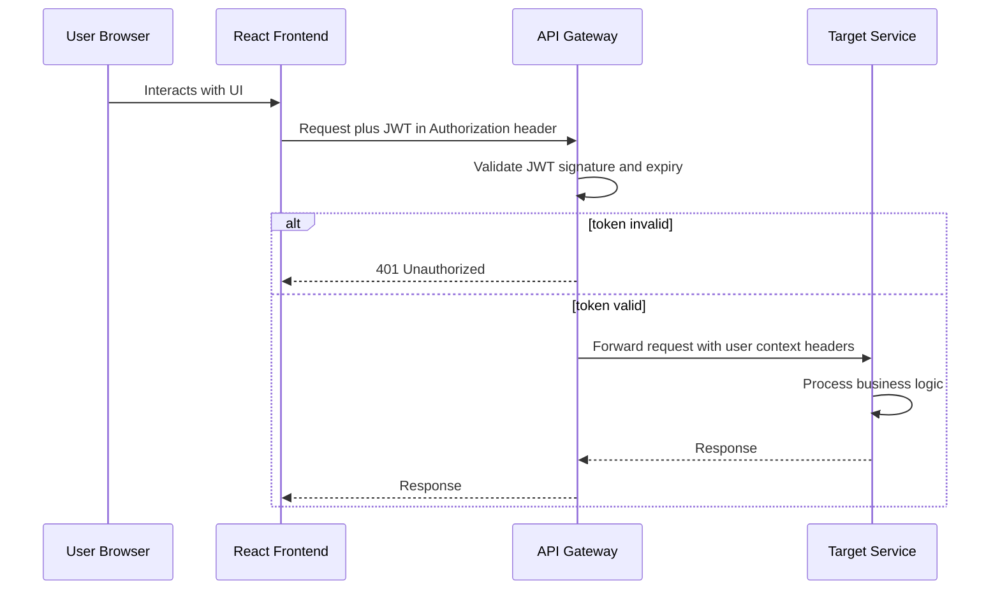
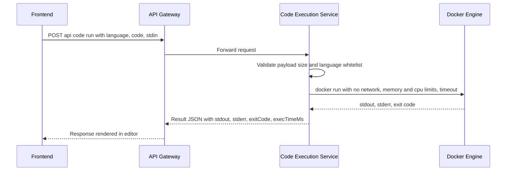
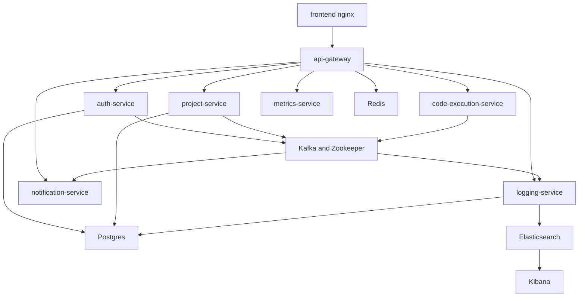

# High-Level Design (HLD) - DevOps Suite

## 1. Overview
The system is a set of independently deployable Spring Boot microservices fronted by a single API Gateway, with a React frontend (Monaco Editor, Kanban drag-drop), PostgreSQL per service, Redis for caching and rate-limiting, Kafka plus Elasticsearch/Kibana for logging, WebSocket (STOMP over SockJS) for real-time log streaming and notifications, and Zipkin for distributed tracing.

## 2. System Context Diagram

## 3. Component Architecture

## 4. Request Flow: Authenticated API Call

## 5. Request Flow: Code Execution

## 6. Deployment View - Local Docker Compose

## 7. Cross-Cutting Concerns
- Security: JWT validated at the gateway; each service trusts gateway-forwarded identity headers within the internal network, services are not directly internet-exposed. WebSocket connections authenticated via JWT query param during STOMP CONNECT.
- Observability: Actuator health endpoints and structured JSON logs from day one; metrics scraped by metrics-service.
- Distributed Tracing: Spring Cloud Sleuth + Zipkin for trace propagation across all services; 10% sampling rate; trace IDs in log output.
- Resilience: Resilience4j circuit breakers on gateway-to-service calls; retries with backoff for transient failures; rate limiter per service.
- Real-time: WebSocket (STOMP over SockJS) endpoints at /ws/logs for log streaming and /ws/notifications for live notifications.
- Scalability: Stateless services; horizontal scaling behind the gateway; database-per-service to avoid coupling.
- CI/CD: Multi-stage Docker builds reducing image size; GitHub Actions for automated build, test, and deploy.

## 8. Key Design Decisions

| Decision | Rationale |
|---|---|
| Database-per-service | Preserves microservice independence, avoids shared-schema coupling |
| Gateway does JWT validation | Single choke point for auth, simplifies downstream services |
| Docker-based sandboxing for code execution | Strong isolation, no network, resource caps prevent abuse |
| Kafka introduced only in Phase 4 | Avoids premature complexity, REST is enough for MVP |
| Redis for gateway rate limiting | Fast, standard pattern with Spring Cloud Gateway |
## 9. WebSocket and Real-Time Architecture

- **Protocol:** STOMP over SockJS for browser compatibility
- **Authentication:** JWT token passed as query param during STOMP CONNECT frame
- **Topics:** /topic/logs, /topic/notifications
- **Frontend:** @stomp/stompjs + SockJS client

## 10. Multi-Stage Docker Build Strategy

Build stage uses Maven plus JDK. Runtime stage uses JRE-only Alpine.
Result: smaller images, faster pulls, reduced attack surface.

## 11. Frontend Architecture

- React 18 plus TypeScript SPA with React Router
- Monaco Editor for code writing with syntax highlighting
- react-beautiful-dnd for Kanban board drag-and-drop
- SockJS plus STOMP for WebSocket client
- Recharts for metrics dashboard visualizations
- React Context plus JWT for auth state management

## Kafka Topic Design

All inter-service communication goes through Apache Kafka.

### Topics

- auth-events (3 partitions, 7 day retention) - auth-service produces, notification-service consumes
- project-events (3 partitions, 7 day retention) - project-service produces, notification and logging consume
- task-events (5 partitions, 7 day retention) - project-service produces, notification and logging consume
- log-events (5 partitions, 3 day retention) - all services produce, logging-service consumes
- notification-events (3 partitions, 7 day retention) - project and code-exec produce, notification consumes
- metric-events (3 partitions, 1 day retention) - all services produce, metrics-service consumes
- code-execution-events (3 partitions, 7 day retention) - code-exec produces, notification and logging consume

### Naming Convention

- Pattern: {domain}-events
- Key: Entity UUID for ordering guarantees
- Value: JSON-serialized event DTO

### Consumer Groups

- Each microservice uses its service name as consumer group ID
- Manual acknowledgment for at-least-once delivery
- Dead letter topic for failed messages

## Redis Data Structures

Redis provides distributed caching and session management.

### Key Patterns

- user:{userId} (Hash, 30min TTL) - User profile cache
- user:email:{email} (String, 30min TTL) - Email-to-ID lookup
- session:{sessionId} (Hash, 24h TTL) - Active session data
- jwt:blacklist:{token} (String, token TTL) - Revoked JWT tokens
- project:{projectId} (Hash, 15min TTL) - Project metadata cache
- project:{projectId}:members (Set, 15min TTL) - Member ID set
- task:{taskId} (Hash, 10min TTL) - Task details cache
- rate:api:{userId}:{endpoint} (String, 1min TTL) - Rate limiting counter
- websocket:session:{sessionId} (String, session duration) - WebSocket tracking

### Cache Strategy

- Cache-aside pattern for read-heavy entities (users, projects, tasks)
- Write-through for session data and rate limiting
- Event-driven invalidation via Kafka consumers
- Graceful degradation: cache misses fall back to database
