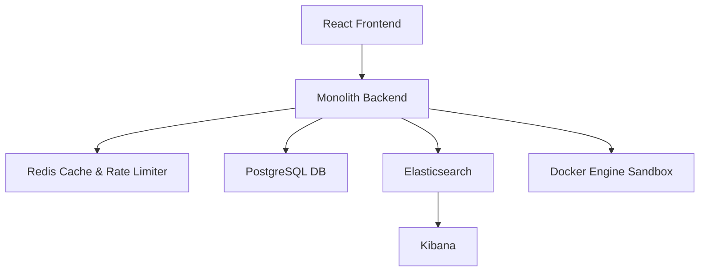
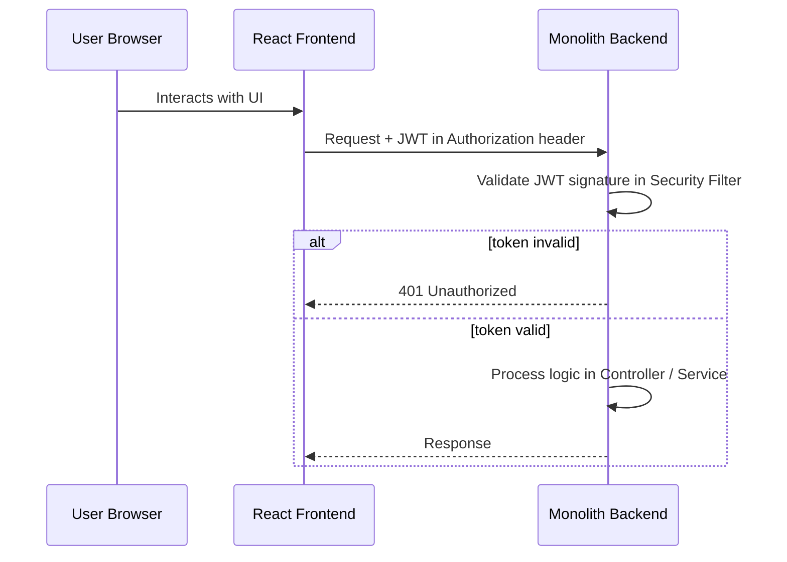
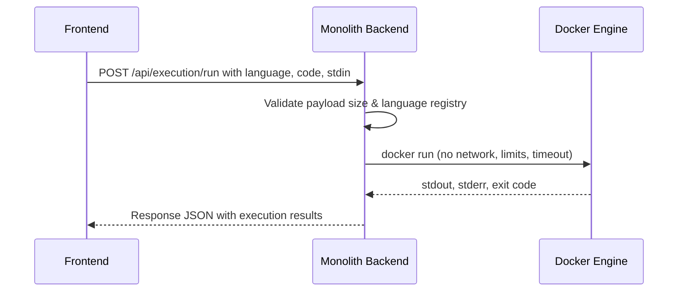
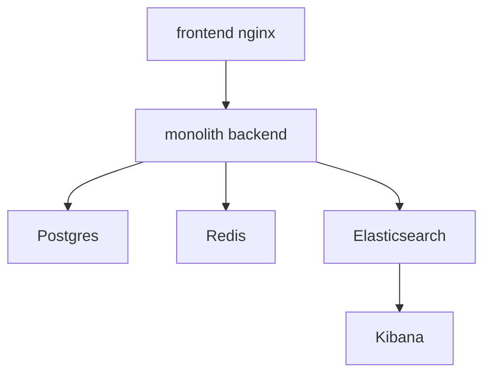

# High-Level Design (HLD) - DevOps Suite

## 1. Overview
The DevOps Suite system is built as a monolithic Spring Boot backend application exposing REST and WebSocket endpoints on port `8081`, integrated with a React frontend SPA. The monolith manages authentication, project tracking, and docker-based sandboxed code execution, using a consolidated PostgreSQL database instance, Redis for caching and rate-limiting, and an Elasticsearch-based pipeline for logs and observability.

## 2. System Context Diagram

```mermaid
flowchart LR
    User[User Browser] --> FE[React Frontend]
    FE --> MONO[Monolith Backend (Port 8081)]
```

## 3. Component Architecture

```mermaid
flowchart TB
    FE[React Frontend]
    MONO[Monolith Backend]
    REDIS[Redis Cache & Rate Limiter]
    PG[PostgreSQL DB]
    ES[Elasticsearch]
    KIB[Kibana]
    DOCKER[Docker Engine Sandbox]

    FE --> MONO
    MONO --> REDIS
    MONO --> PG
    MONO --> DOCKER
    MONO --> ES
    ES --> KIB
```

## 4. Request Flow: Authenticated API Call

```mermaid
sequenceDiagram
    participant U as User Browser
    participant FE as React Frontend
    participant MN as Monolith Backend
    
    U->>FE: Interacts with UI
    FE->>MN: Request + JWT in Authorization header
    MN->>MN: Validate JWT signature in Security Filter
    alt token invalid
        MN-->>FE: 401 Unauthorized
    else token valid
        MN->>MN: Process logic in Controller / Service
        MN-->>FE: Response
    end
```

## 5. Request Flow: Code Execution

```mermaid
sequenceDiagram
    participant FE as Frontend
    participant MN as Monolith Backend
    participant D as Docker Engine

    FE->>MN: POST /api/execution/run with language, code, stdin
    MN->>MN: Validate payload size & language registry
    MN->>D: docker run (no network, limits, timeout)
    D-->>MN: stdout, stderr, exit code
    MN-->>FE: Response JSON with execution results
```

## 6. Deployment View - Local Docker Compose

```mermaid
flowchart TB
    FE[frontend nginx]
    MN[monolith backend]
    PG[Postgres]
    RD[Redis]
    ESK[Elasticsearch]
    KB[Kibana]

    FE --> MN
    MN --> PG
    MN --> RD
    MN --> ESK
    ESK --> KB
```

## 7. Cross-Cutting Concerns
- **Security:** Spring Security filters JWT tokens from the Authorization header. If present and valid, it establishes the security context. Direct CORS support is handled within the monolith's security config.
- **Observability:** Prometheus scrapes metrics from the monolith's `/actuator/prometheus` endpoint. Structured logs are written to files and ingested into Elasticsearch.
- **Resilience:** Built-in Spring validation, rate limiting counters in Redis, and standard retry templates for transient dependencies.
- **Real-time:** WebSocket endpoints at `/ws` using STOMP over SockJS directly on the monolith server.
- **Scalability:** The backend is stateless, enabling horizontal scaling behind a standard load balancer.

## 8. Key Design Decisions

| Decision | Rationale |
|---|---|
| Monolithic Database | Avoids data fragmentation, simplifies database transactions and migrations, enables referential integrity across modules |
| In-Memory Security Filter | Centralized security and routing directly within the JVM, reducing gateway latency overhead |
| Docker Sandboxing | Ensures strong isolation of user-submitted code snippets, with no network access and strict memory/CPU caps |
| Redis Cache | Fast key-value access for rate limiting and cache-aside read optimizations |

## 9. WebSocket and Real-Time Architecture

- **Protocol:** STOMP over SockJS for browser compatibility.
- **Authentication:** JWT token passed in the header or query parameters during connection handshake.
- **Topics:** `/topic/logs` and `/topic/notifications/{userId}`.

## 10. Multi-Stage Docker Build Strategy
The production Dockerfile compiles the code inside a Maven-capable JDK container and copies the resulting jar to a lightweight JRE base image to minimize size and attack surface.

## 11. Frontend Architecture
- React 18 + TypeScript SPA.
- Monaco Editor for writing code.
- react-beautiful-dnd for drag-and-drop Kanban updates.
- SockJS/STOMP client for real-time WebSocket messaging.
- Axios client configured to target `http://localhost:8081/api` by default.

## 12. Redis Data Structures

### Key Patterns
- `user:{userId}` (Hash, 30min TTL) - User profile cache
- `jwt:blacklist:{token}` (String, token TTL) - Revoked JWT tokens
- `project:{projectId}` (Hash, 15min TTL) - Project metadata cache
- `rate:api:{userId}:{endpoint}` (String, 1min TTL) - Rate limiting counter

### Cache Strategy
- Cache-aside pattern for read-heavy entities (users, projects, tasks).
- Invalidation on write/update actions directly in the service layers.
- Graceful fallback to database on cache misses.
