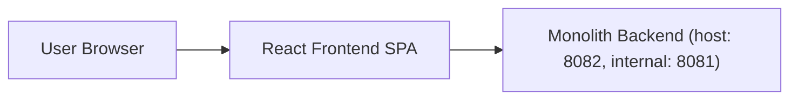
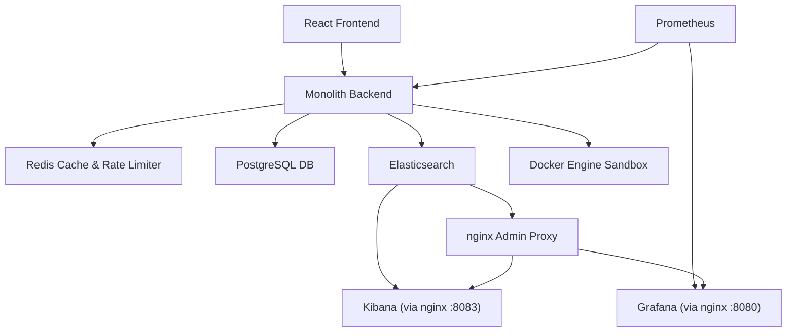
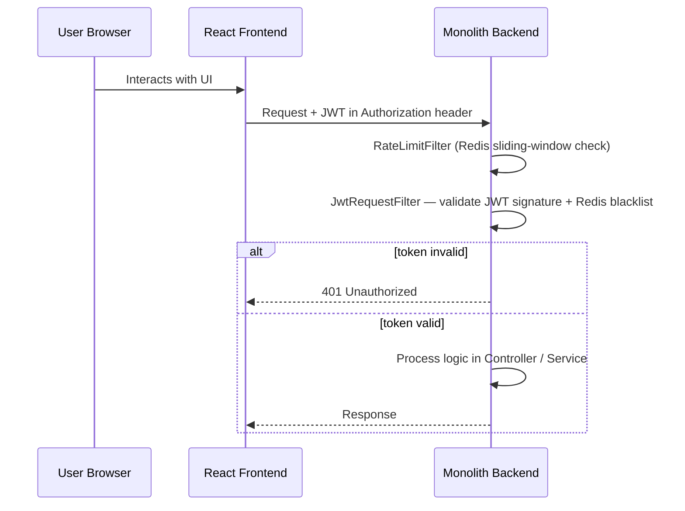
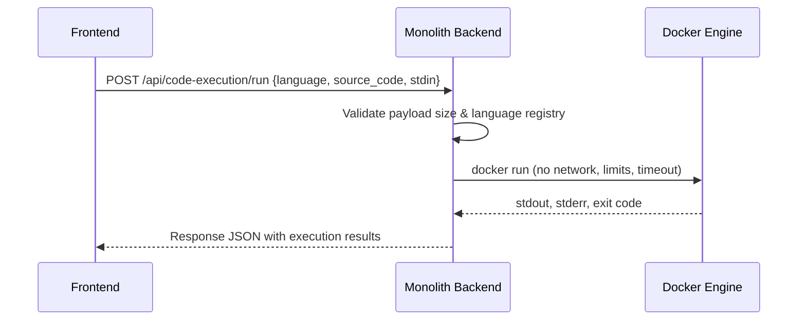
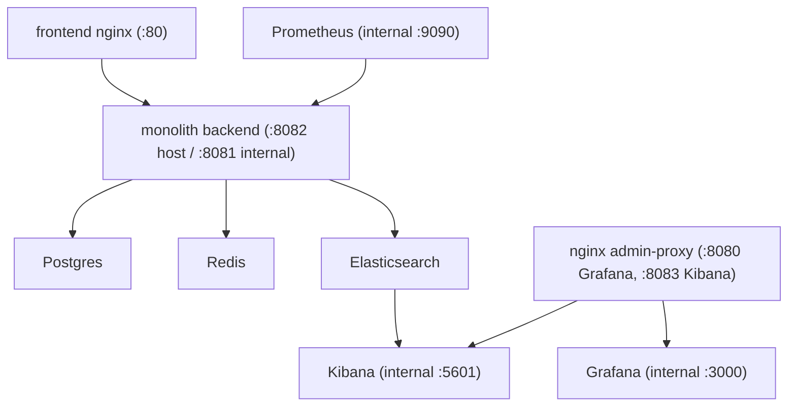

# High-Level Design (HLD) - DevOps Suite

## 1. Overview
The DevOps Suite system is built as a monolithic Spring Boot backend application exposing REST and WebSocket endpoints on internal port `8081` (host-mapped to `8082` via Docker). It integrates with a React 18 SPA frontend, managing authentication, project tracking, and Docker-based sandboxed code execution, using a consolidated PostgreSQL database, Redis for caching and rate-limiting, and an Elasticsearch-based pipeline for logs and observability.

## 2. System Context Diagram

```mermaid
flowchart LR
    User[User Browser] --> FE[React Frontend SPA]
    FE --> MONO["Monolith Backend (host: 8082, internal: 8081)"]
```

## 3. Component Architecture

```mermaid
flowchart TB
    FE[React Frontend]
    MONO[Monolith Backend]
    REDIS[Redis Cache & Rate Limiter]
    PG[PostgreSQL DB]
    ES[Elasticsearch]
    KIB["Kibana (via nginx :8083)"]
    DOCKER[Docker Engine Sandbox]
    PROM[Prometheus]
    GRAF["Grafana (via nginx :8080)"]
    NGINX[nginx Admin Proxy]

    FE --> MONO
    MONO --> REDIS
    MONO --> PG
    MONO --> DOCKER
    MONO --> ES
    ES --> KIB
    ES --> NGINX
    PROM --> MONO
    PROM --> GRAF
    NGINX --> GRAF
    NGINX --> KIB
```

## 4. Request Flow: Authenticated API Call

```mermaid
sequenceDiagram
    participant U as User Browser
    participant FE as React Frontend
    participant MN as Monolith Backend
    
    U->>FE: Interacts with UI
    FE->>MN: Request + JWT in Authorization header
    MN->>MN: RateLimitFilter (Redis sliding-window check)
    MN->>MN: JwtRequestFilter — validate JWT signature + Redis blacklist
    alt token invalid
        MN-->>FE: 401 Unauthorized
    else token valid
        MN->>MN: Process logic in Controller / Service
        MN-->>FE: Response
    end
```

## 5. Request Flow: Code Execution

```mermaid
sequenceDiagram
    participant FE as Frontend
    participant MN as Monolith Backend
    participant D as Docker Engine

    FE->>MN: POST /api/code-execution/run {language, source_code, stdin}
    MN->>MN: Validate payload size & language registry
    MN->>D: docker run (no network, limits, timeout)
    D-->>MN: stdout, stderr, exit code
    MN-->>FE: Response JSON with execution results
```

## 6. Deployment View - Local Docker Compose

```mermaid
flowchart TB
    FE["frontend nginx (:80)"]
    MN["monolith backend (:8082 host / :8081 internal)"]
    PG[Postgres]
    RD[Redis]
    ESK[Elasticsearch]
    KB["Kibana (internal :5601)"]
    PROM["Prometheus (internal :9090)"]
    GRAF["Grafana (internal :3000)"]
    NGINX["nginx admin-proxy (:8080 Grafana, :8083 Kibana)"]

    FE --> MN
    MN --> PG
    MN --> RD
    MN --> ESK
    ESK --> KB
    PROM --> MN
    NGINX --> GRAF
    NGINX --> KB
```

## 7. Cross-Cutting Concerns
- **Security:** Spring Security filters JWT tokens from the Authorization header. `RateLimitFilter` (Redis sliding window) runs before `JwtRequestFilter`. STOMP connections are authenticated via `StompAuthChannelInterceptor`.
- **Observability:** Prometheus scrapes metrics from the monolith's `/actuator/prometheus` endpoint. Structured logs are written to Elasticsearch via the `RequestLoggingFilter` → Spring Event → `ElasticsearchLogService` pipeline.
- **Resilience:** Built-in Spring validation, rate limiting counters in Redis (`RATE_LIMIT_API_MAX`, `RATE_LIMIT_AUTH_MAX`, `RATE_LIMIT_EXECUTION_MAX`), and standard retry templates for transient dependencies.
- **Real-time:** WebSocket endpoints at `/ws` using STOMP over SockJS directly on the monolith server.
- **Scalability:** The backend is stateless (JWT + Redis), enabling horizontal scaling behind a standard load balancer.

## 8. Key Design Decisions

| Decision | Rationale |
|---|---|
| Monolithic Database | Avoids data fragmentation, simplifies database transactions and migrations, enables referential integrity across modules |
| In-Memory Security Filter | Centralized security and routing directly within the JVM, reducing gateway latency overhead |
| Docker Sandboxing | Ensures strong isolation of user-submitted code snippets, with no network access and strict memory/CPU caps |
| Redis Cache | Fast key-value access for rate limiting and cache-aside read optimizations |
| Spring Events (not Kafka) | Internal async event dispatching without Kafka/Zookeeper infrastructure overhead |

## 9. WebSocket and Real-Time Architecture

- **Protocol:** STOMP over SockJS for browser compatibility.
- **Authentication:** JWT token validated in STOMP CONNECT frame by `StompAuthChannelInterceptor`.
- **Topics:**
  - `/topic/logs/{projectId}` — real-time HTTP request log streaming
  - `/topic/notifications/{userId}` — in-app notifications (task assigned, member added, etc.)
  - `/topic/tasks/{projectId}` — live Kanban task updates (CREATED/UPDATED/STATUS_CHANGED/MOVED/DELETED)

## 10. Multi-Stage Docker Build Strategy
The production Dockerfile compiles the code inside a Maven-capable JDK container and copies the resulting JAR to a lightweight JRE Alpine base image to minimize size and attack surface.

## 11. Frontend Architecture
- React 18 + **JavaScript (JSX)** SPA — **not TypeScript**.
- Vite build tool; Tailwind CSS for styling.
- Monaco Editor for writing code.
- SockJS/STOMP client for real-time WebSocket messaging.
- Axios client configured to target `http://localhost:8082` (Docker) or `http://localhost:8081` (local dev) via `VITE_API_URL` environment variable.

## 12. Redis Data Structures

### Key Patterns
- `user:{userId}` (JSON, 30min TTL) - User profile cache
- `jwt:blacklist:{token}` (String, token TTL) - Revoked JWT tokens
- `project:{projectId}` (JSON, 15min TTL) - Project metadata cache
- `rate:auth:{ip}` / `rate:exec:{userId}` / `rate:api:{userId}` (String, 60s TTL) - Rate limiting counters
- `metrics:active_users` (Sorted Set, scored by timestamp ms) - Recently active user tracking

### Cache Strategy
- Cache-aside pattern for read-heavy entities (users, projects).
- Invalidation on write/update actions directly in the service layers.
- Graceful fallback to database on cache misses.
