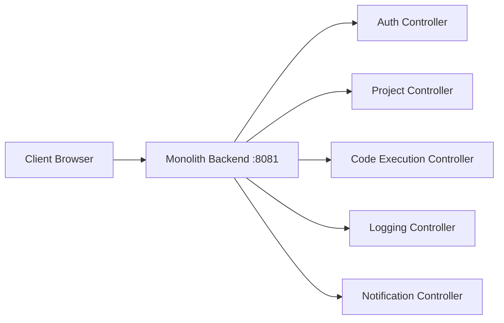

# API Design & Contracts - DevOps Suite

## 1. Overview
The DevOps Suite monolithic backend application exposes all endpoints on port `8081`. Every API route is prefixed with `/api` (or directly matched in respective modules) and authentication is secured using JWT Bearer tokens in the `Authorization` header.

---

## 2. Monolith Endpoint Routing



---

## 3. Auth API Route Mappings
Base path: `/api/auth` or `/auth`

### 3.1 Register User
- **POST** `/api/auth/register`
- **Request Body:**
  ```json
  {
      "email": "user@example.com",
      "password": "securePass123!",
      "display_name": "John Doe"
  }
  ```
- **Response (201):**
  ```json
  {
      "status": "success",
      "message": "User registered successfully",
      "data": {
          "user_id": "uuid",
          "email": "user@example.com",
          "display_name": "John Doe"
      }
  }
  ```

### 3.2 Login
- **POST** `/api/auth/login`
- **Request Body:**
  ```json
  {
      "email": "user@example.com",
      "password": "securePass123!"
  }
  ```
- **Response (200):**
  ```json
  {
      "status": "success",
      "message": "Login successful",
      "data": {
          "access_token": "eyJhbG...",
          "refresh_token": "dGhpcyBp...",
          "expires_in": 3600,
          "token_type": "Bearer"
      }
  }
  ```

### 3.3 Get Current User
- **GET** `/api/auth/me`
- **Response (200):**
  ```json
  {
      "status": "success",
      "message": "User profile fetched successfully",
      "data": {
          "user_id": "uuid",
          "email": "user@example.com",
          "display_name": "John Doe",
          "roles": ["ROLE_MEMBER"]
      }
  }
  ```

---

## 4. Project Management API Route Mappings
Base path: `/api/v1/projects` or `/projects`

### 4.1 Create Project
- **POST** `/api/v1/projects`
- **Request Body:**
  ```json
  {
      "name": "My Project",
      "description": "A sample project"
  }
  ```
- **Response (201):**
  ```json
  {
      "message": "Project created successfully",
      "data": {
          "id": "uuid",
          "name": "My Project",
          "ownerId": "uuid",
          "status": "ACTIVE"
      }
  }
  ```

### 4.2 List Projects
- **GET** `/api/v1/projects?page=0&size=10`
- **Response (200):**
  ```json
  {
      "message": "Projects fetched successfully",
      "data": {
          "projects": [...],
          "total": 1,
          "page": 0,
          "size": 10
      }
  }
  ```

---

## 5. Code Execution API Route Mappings
Base path: `/api/execution`

### 5.1 Execute Code
- **POST** `/api/execution/run`
- **Request Body:**
  ```json
  {
      "language": "python",
      "source_code": "print('Hello World')",
      "stdin": ""
  }
  ```
- **Response (200):**
  ```json
  {
      "stdout": "Hello World\n",
      "stderr": "",
      "exitCode": 0,
      "execTimeMs": 45
  }
  ```

---

## 6. Notifications API Route Mappings
Base path: `/api/notifications`

- **GET** `/api/notifications` - Get paginated user notifications.
- **GET** `/api/notifications/unread-count` - Get unread count.
- **PUT** `/api/notifications/{notificationId}/read` - Mark specific notification as read.
- **PUT** `/api/notifications/read-all` - Mark all notifications as read.
- **DELETE** `/api/notifications/{notificationId}` - Delete notification.

---

## 7. WebSocket STOMP Endpoints
- **WebSocket URL:** `ws://localhost:8081/ws` (or SockJS fallback `http://localhost:8081/ws`)
- **Subscribe Destinations:**
  - `/topic/notifications/{userId}`: User notifications
  - `/topic/logs/{projectId}`: Real-time project log streaming
  - `/topic/tasks/{projectId}`: Real-time Kanban task movements

---

## 8. Common Error Responses
```json
{
    "status": "error",
    "message": "Error details description",
    "timestamp": "2026-01-01T00:00:00Z"
}
```
