# Low-Level Design (LLD) - DevOps Suite

## 1. Overview

Detailed class diagrams, service internals, data flow, and state machines for each microservice. All diagrams use Mermaid syntax.

---

## 2. Auth Service - Detailed Design

### 2.1 Class Diagram

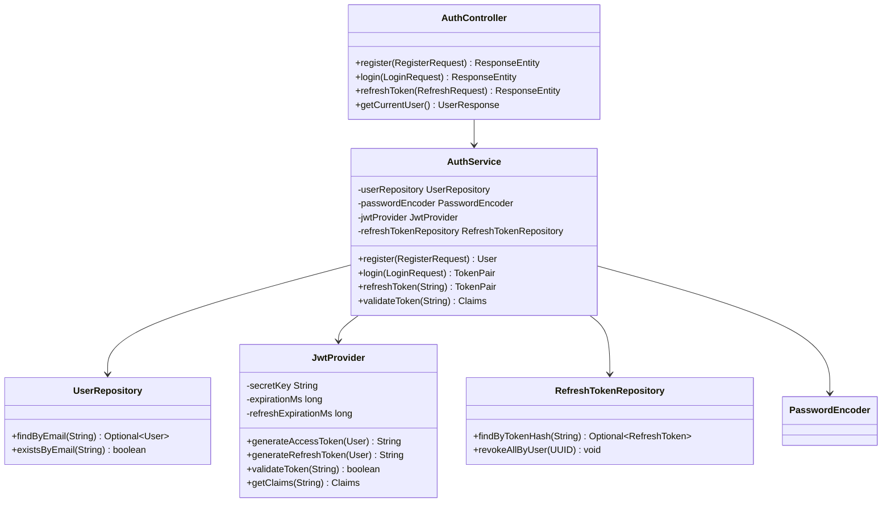

### 2.2 Authentication Flow

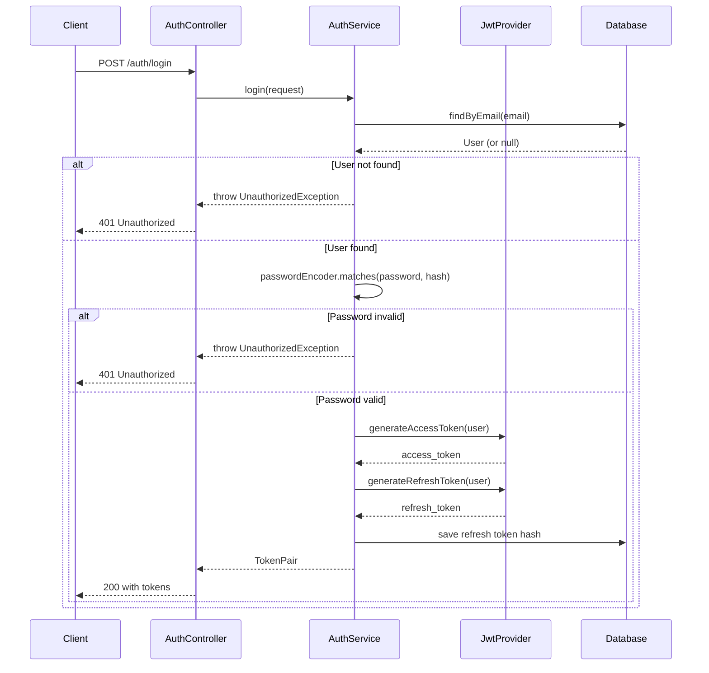

### 2.3 Token Validation Flow

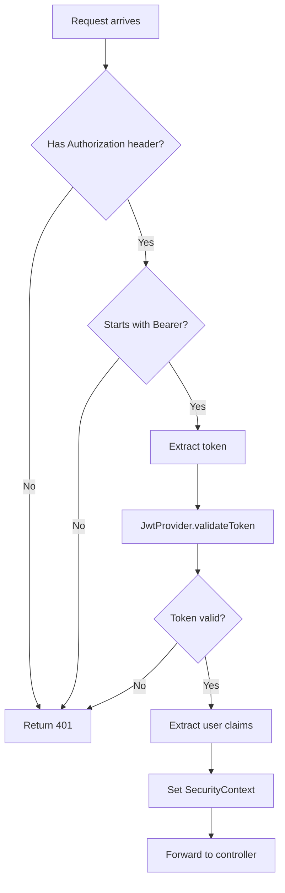

---

## 3. Project Management Service - Detailed Design

### 3.1 Class Diagram

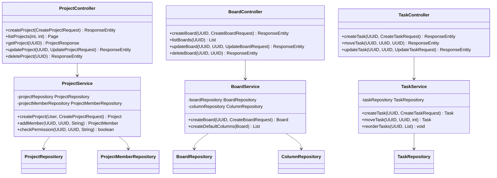

### 3.2 Task State Machine

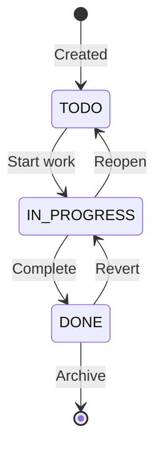

### 3.3 Project Membership Flow

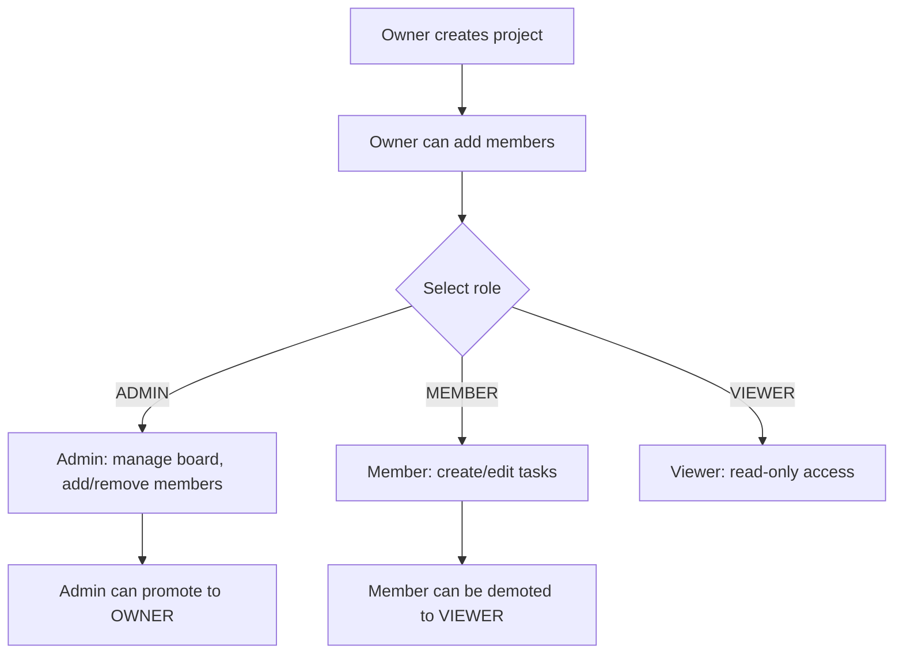

---

## 4. Code Execution Service - Detailed Design

### 4.1 Class Diagram

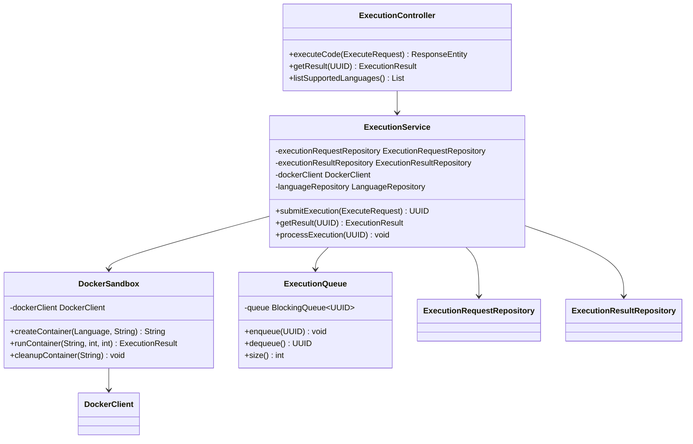

### 4.2 Execution Flow

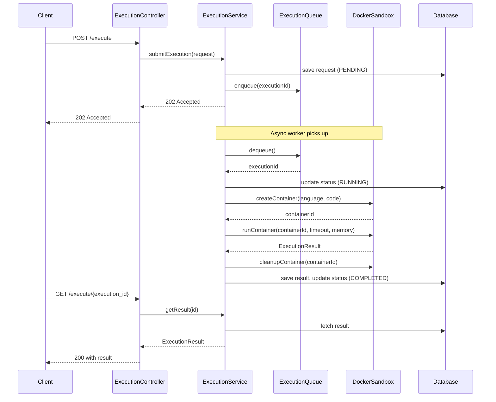

### 4.3 Sandbox Security Model

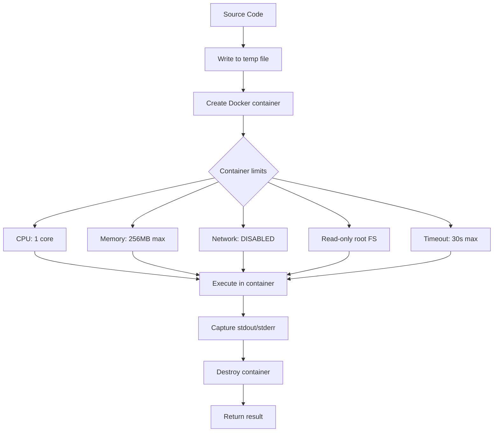

---

## 5. Logging Service - Detailed Design

### 5.1 Class Diagram

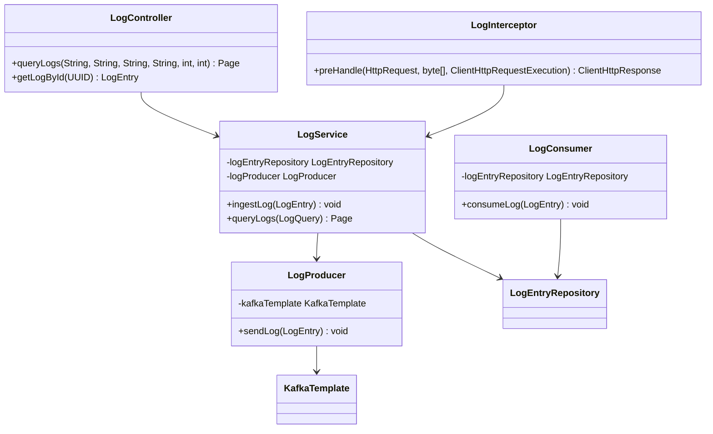

### 5.2 Log Ingestion Pipeline

```mermaid
flowchart LR
    A[HTTP Request] --> B[LogInterceptor]
    B --> C[Capture: method, path, status, duration, user, IP]
    C --> D[LogService.ingestLog]
    D --> E{Async?}
    E -->|Yes| F[Kafka Topic: logs]
    E -->|No| G[Direct DB write]
    F --> H[LogConsumer]
    H --> I[PostgreSQL]
    G --> I
    I --> J[Elasticsearch sync (batch)]
    J --> K[Kibana Dashboard]
```

---

## 6. Metrics Service - Detailed Design

### 6.1 Class Diagram

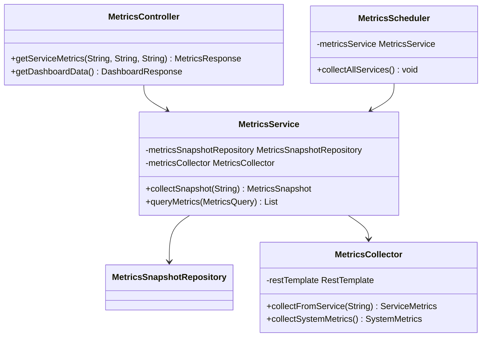

### 6.2 Metrics Collection Flow

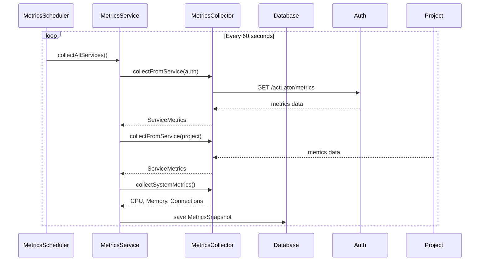

---

## 7. API Gateway - Detailed Design

### 7.1 Routing Configuration

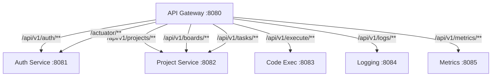

### 7.2 Gateway Filter Chain

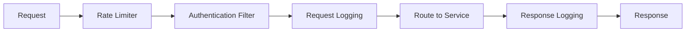

---

## 8. Error Handling Strategy

- Controller Advice: Global @ControllerAdvice catches all exceptions
- Exception Hierarchy: ApiException base class with code, message, httpStatus
- Validation: @Valid with MethodArgumentNotValidException handler
- Fallback: Circuit breaker returns cached response or error message

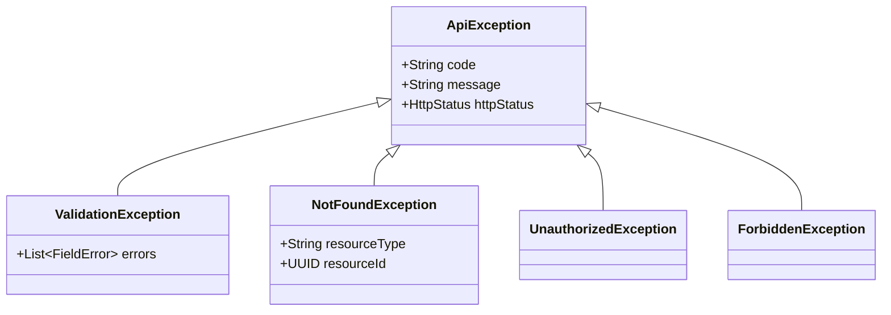

---

## 9. Notification Service

### 9.1 Notification Flow

Kafka events trigger notification creation and WebSocket delivery.

- Project Service publishes TaskAssignedEvent to Kafka
- NotificationConsumer receives and delegates to NotificationService
- NotificationService saves to DB and broadcasts via WebSocket
- EmailService sends email asynchronously

### 9.2 Entity Table

- id UUID PK
- user_id UUID FK auth_user
- type VARCHAR NOTIFICATION_TYPE
- title VARCHAR 255
- message TEXT
- is_read BOOLEAN DEFAULT FALSE
- reference_id UUID nullable
- reference_type VARCHAR nullable
- created_at TIMESTAMP DEFAULT NOW

### 9.3 API Endpoints

- GET /api/notifications - List notifications paginated
- GET /api/notifications/unread-count - Get unread count
- PUT /api/notifications/id/read - Mark as read
- PUT /api/notifications/read-all - Mark all as read

### 9.4 Kafka Consumer Groups

- notification-task-consumer: notifications.tasks
- notification-error-consumer: notifications.errors
- notification-threshold-consumer: metrics.thresholds
---

## 10. WebSocket Real-Time Components

### 10.1 WebSocket Configuration

- EnableWebSocketMessageBroker annotation on config class
- SimpleBrokerConfigurer: enable /topic destination prefix
- ApplicationDestinationPrefixes: /app
- StompEndpointRegistry: /ws endpoint with SockJS fallback
- CORS: setAllowedOriginPatterns for all origins

### 10.2 Log Streaming Flow

1. Frontend sends STOMP CONNECT with JWT in query param
2. Gateway verifies JWT and upgrades to WebSocket
3. Logging Service subscribes to Kafka logs topic
4. Each new log event is broadcast to /topic/logs via STOMP
5. Frontend receives and renders in real-time log viewer

### 10.3 Notification Streaming Flow

1. NotificationService saves event to database
2. Broadcasts to /topic/notifications/{userId}
3. Frontend displays toast notification in real-time

### 10.4 Frontend WebSocket Client

- Use @stomp/stompjs Client class
- SockJS factory for browser compatibility
- Connect with JWT authorization header
- Subscribe to /topic/logs for log streaming
- Subscribe to /topic/notifications for alerts
---

## 11. Kafka Event-Driven Pipeline

### 11.1 Topic Design

| Topic | Producer | Consumer | Message Type |
|-------|----------|----------|--------------|
| logs.info | Logging Service | Elasticsearch Sync | LogEntry |
| logs.error | Any Service | Notification Service | LogEntry |
| metrics.snapshots | Metrics Service | Metrics Aggregator | MetricsSnapshot |
| notifications.tasks | Project Service | Notification Service | TaskAssignedEvent |
| notifications.errors | Code Exec Service | Notification Service | ExecutionFailedEvent |
| code.exec.events | Code Exec Service | Logging Service | ExecEvent |

### 11.2 Event Flow

- Producers: Auth, Project, CodeExec, Logging services
- Kafka broker receives and stores events by topic
- Consumers subscribe to relevant topics
- Notification Consumer aggregates and delivers via WebSocket
- Metrics Consumer aggregates for dashboard
- Logging Consumer syncs to Elasticsearch for search

### 11.3 Producer Configuration

- KafkaTemplate for sending messages
- Partition key by userId for ordering
- acks=all for durability
- Retry with backoff on transient failures

### 11.4 Consumer Configuration

- GroupId per service per topic
- Manual acknowledgment for at-least-once delivery
- Dead letter queue for failed messages
- Max poll interval and batch size tuning

---

## 12. Distributed Tracing with Zipkin and Sleuth

### 12.1 Configuration

- spring-sleuth sampler probability: 0.1 (10% sampling)
- spring-zipkin base-url: http://zipkin:9411
- spring-zipkin sender type: web
- Trace IDs propagated in log output for correlation

### 12.2 Trace Propagation

1. Frontend sends request with trace-id header
2. Gateway creates span and forwards to Auth Service
3. Auth Service creates child span and forwards to Project Service
4. Each service sends span data to Zipkin
5. Zipkin correlates all spans and shows full request timeline

### 12.3 Zipkin Dashboard Features

- Service dependency graph
- Trace timeline for each request
- Latency analysis per service hop
- Error rate correlation
---

## 13. Circuit Breaker with Resilience4j

### 13.1 Configuration

- slidingWindowSize: 10 calls
- failureRateThreshold: 50 percent
- waitDurationInOpenState: 10 seconds
- permittedNumberOfCallsInHalfOpenState: 3
- retry maxAttempts: 3 with 500ms waitDuration

### 13.2 Circuit Breaker States

1. Closed: Normal operation, calls pass through
2. Open: Failure rate exceeds threshold, calls are rejected
3. HalfOpen: Wait duration expires, test calls are allowed
   - If test calls succeed: transition to Closed
   - If test calls fail: transition back to Open

### 13.3 Service Mesh Integration

- Gateway: circuit breaker on each service route
- Service-to-service: circuit breaker on Feign/RestTemplate calls
- Fallback methods return cached data or default responses
- Metrics exposed via Actuator for monitoring

---

## 14. Analytics Dashboard Components

### 14.1 Metrics Aggregation

- Request count per service per minute
- Average response time per endpoint
- Error rate per service
- Active user count
- Task completion rate
- Code execution success rate

### 14.2 Health Page

- Service status indicators: green/yellow/red
- Database connection status
- Kafka broker status
- Redis connection status
- Docker daemon status for code execution
- Uptime per service

### 14.3 Dashboard Tech Stack

- Recharts for line and bar charts
- Gauge components for real-time metrics
- WebSocket connection for live updates
- Date range picker for historical analysis

## 10. Logging Service - Detailed Design

### 10.1 Class Diagram

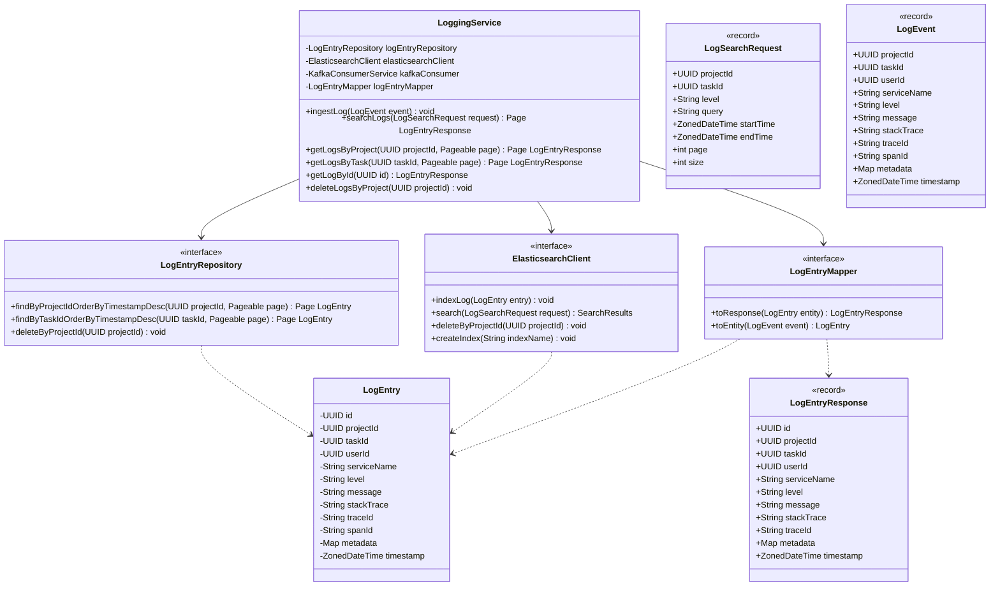

### 10.2 Dual-Write Strategy

Logs are stored in both PostgreSQL (for structured queries and retention) and Elasticsearch (for full-text search and Kibana dashboards).

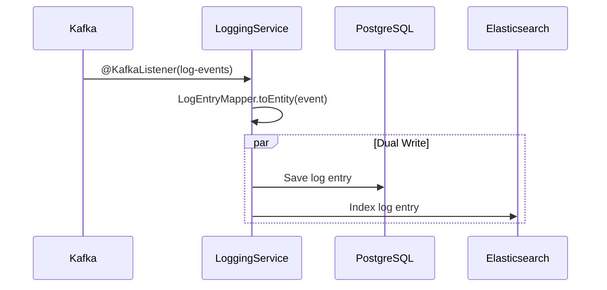

### 10.3 Elasticsearch Index Mapping

```json
{
  "mappings": {
    "properties": {
      "id": { "type": "keyword" },
      "projectId": { "type": "keyword" },
      "taskId": { "type": "keyword" },
      "userId": { "type": "keyword" },
      "serviceName": { "type": "keyword" },
      "level": { "type": "keyword" },
      "message": { "type": "text", "analyzer": "standard" },
      "stackTrace": { "type": "text" },
      "traceId": { "type": "keyword" },
      "metadata": { "type": "object", "enabled": false },
      "timestamp": { "type": "date" }
    }
  }
}
```
## 11. Metrics Service - Detailed Design

### 11.1 Class Diagram

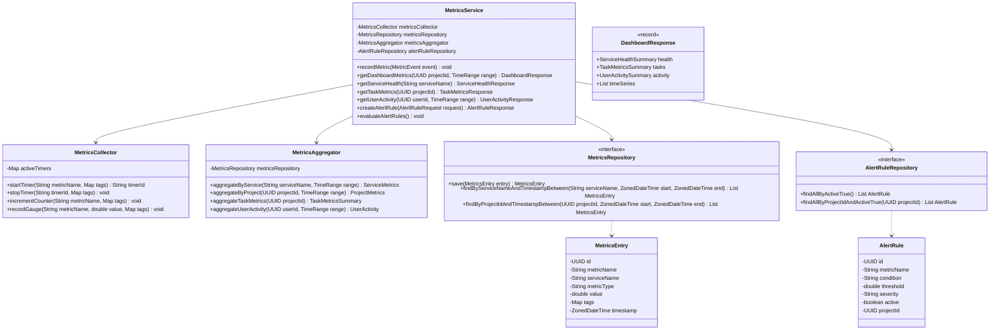

### 11.2 Metric Types

| Type | Description | Example |
|---|---|---|
| COUNTER | Monotonically increasing count | api.requests.total |
| GAUGE | Point-in-time value | jvm.memory.used |
| TIMER | Duration measurement | api.request.duration |
| HISTOGRAM | Distribution of values | code.execution.duration |

### 11.3 Alert Conditions

| Condition | Description |
|---|---|
| GREATER_THAN | Trigger when value exceeds threshold |
| LESS_THAN | Trigger when value drops below threshold |
| EQUALS | Trigger when value equals threshold |
| PERCENTAGE_CHANGE | Trigger when change exceeds threshold percentage |
## 12. WebSocket and STOMP Configuration

### 12.1 WebSocket Config Class

```java
@Configuration
@EnableWebSocketMessageBroker
public class WebSocketConfig implements WebSocketMessageBrokerConfigurer {

    @Value("${app.jwt.secret}")
    private String jwtSecret;

    @Override
    public void configureMessageBroker(MessageBrokerRegistry config) {
        config.enableSimpleBroker("/topic");
        config.setApplicationDestinationPrefixes("/app");
        config.setUserDestinationPrefix("/user");
    }

    @Override
    public void registerStompEndpoints(StompEndpointRegistry registry) {
        registry.addEndpoint("/ws")
                .setAllowedOriginPatterns("*")
                .withSockJS();
    }

    @Override
    public void configureClientInboundChannel(ChannelRegistration registration) {
        registration.interceptors(new JwtChannelInterceptor(jwtSecret));
    }
}
```

### 12.2 JWT Channel Interceptor

```java
@Component
public class JwtChannelInterceptor implements ChannelInterceptor {

    private final JwtTokenProvider tokenProvider;

    public JwtChannelInterceptor(JwtTokenProvider tokenProvider) {
        this.tokenProvider = tokenProvider;
    }

    @Override
    public Message<?> preSend(Message<?> message, MessageChannel channel) {
        StompHeaderAccessor accessor = MessageHeaderAccessor
                .getAccessor(message, StompHeaderAccessor.class);

        if (accessor != null && StompCommand.CONNECT.equals(accessor.getCommand())) {
            String token = accessor.getFirstNativeHeader("Authorization");
            if (token != null && token.startsWith("Bearer ")) {
                token = token.substring(7);
                if (tokenProvider.validateToken(token)) {
                    UserDetails userDetails = tokenProvider.getUserDetails(token);
                    UsernamePasswordAuthenticationToken auth =
                        new UsernamePasswordAuthenticationToken(
                            userDetails, null, userDetails.getAuthorities());
                    accessor.setUser(auth);
                }
            }
        }
        return message;
    }
}
```

### 12.3 Topic Mapping

| Topic | Purpose | Payload |
|---|---|---|
| /topic/logs/{projectId} | Real-time log streaming | LogEntryResponse |
| /topic/notifications/{userId} | User notifications | NotificationResponse |
| /topic/tasks/{projectId} | Task updates | TaskUpdateEvent |
| /topic/execution/{taskId} | Execution status | ExecutionStatusEvent |

### 12.4 Frontend Connection

```javascript
import SockJS from 'sockjs-client';
import { Client } from '@stomp/stompjs';

const client = new Client({
  webSocketFactory: () => new SockJS("/ws"),
  connectHeaders: { Authorization: `Bearer ${token}` },
  onConnect: () => {
    client.subscribe(`/topic/notifications/${userId}`, (msg) => {
      const notification = JSON.parse(msg.body);
      handleNotification(notification);
    });
    client.subscribe(`/topic/logs/${projectId}`, (msg) => {
      const logEntry = JSON.parse(msg.body);
      appendLog(logEntry);
    });
  },
  reconnectDelay: 5000,
});
client.activate();
```

## 13. Kafka Integration Layer

### 13.1 Topic Design

| Topic | Partitions | Replication | Retention | Producers | Consumers |
|---|---|---|---|---|---|
| auth-events | 3 | 1 | 7 days | auth-service | notification-service |
| project-events | 3 | 1 | 7 days | project-service | notification, logging |
| task-events | 5 | 1 | 7 days | project-service | notification, logging |
| log-events | 5 | 1 | 3 days | all services | logging-service |
| notification-events | 3 | 1 | 7 days | project, code-exec | notification-service |
| metric-events | 3 | 1 | 1 day | all services | metrics-service |
| code-execution-events | 3 | 1 | 7 days | code-exec-service | notification, logging |

### 13.2 Kafka Configuration

```yaml
spring:
  kafka:
    bootstrap-servers: kafka:9092
    producer:
      key-serializer: org.apache.kafka.common.serialization.StringSerializer
      value-serializer: org.springframework.kafka.support.serializer.JsonSerializer
      acks: all
      retries: 3
    consumer:
      group-id: ${spring.application.name}
      auto-offset-reset: earliest
      enable-auto-commit: false
      key-deserializer: org.apache.kafka.common.serialization.StringDeserializer
      value-deserializer: org.springframework.kafka.support.serializer.JsonDeserializer
      properties:
        spring.json.trusted.packages: "com.devopssuite.*"
    listener:
      ack-mode: manual_immediate
      concurrency: 3
```

### 13.3 Event DTOs

```java
public interface Event {
    String getEventType();
    ZonedDateTime getTimestamp();
}

public record UserRegisteredEvent(
    UUID userId, String email, String username, ZonedDateTime timestamp
) implements Event {
    public String getEventType() { return "USER_REGISTERED"; }
}

public record ProjectCreatedEvent(
    UUID projectId, String projectName, UUID createdBy, ZonedDateTime timestamp
) implements Event {
    public String getEventType() { return "PROJECT_CREATED"; }
}

public record ProjectMemberAddedEvent(
    UUID projectId, UUID userId, String role, UUID addedBy, ZonedDateTime timestamp
) implements Event {
    public String getEventType() { return "PROJECT_MEMBER_ADDED"; }
}

public record TaskCreatedEvent(
    UUID projectId, UUID taskId, String taskTitle, UUID createdBy, ZonedDateTime timestamp
) implements Event {
    public String getEventType() { return "TASK_CREATED"; }
}

public record TaskStatusChangedEvent(
    UUID projectId, UUID taskId, String taskTitle,
    String oldStatus, String newStatus, UUID changedBy, ZonedDateTime timestamp
) implements Event {
    public String getEventType() { return "TASK_STATUS_CHANGED"; }
}

public record CodeExecutionCompletedEvent(
    UUID projectId, UUID taskId, UUID executionId,
    String language, String status, long durationMs, UUID executedBy, ZonedDateTime timestamp
) implements Event {
    public String getEventType() { return "CODE_EXECUTION_COMPLETED"; }
}
```

### 13.4 Kafka Producer Pattern

```java
@Service
@Slf4j
public class KafkaProducerService {

    private final KafkaTemplate<String, Event> kafkaTemplate;

    public KafkaProducerService(KafkaTemplate<String, Event> kafkaTemplate) {
        this.kafkaTemplate = kafkaTemplate;
    }

    @Async
    public CompletableFuture<SendResult<String, Event>> sendEvent(
            String topic, String key, Event event) {
        return kafkaTemplate.send(topic, key, event)
            .completable()
            .whenComplete((result, ex) -> {
                if (ex != null) {
                    log.error("Failed to send event {} to topic {}",
                        event.getEventType(), topic, ex);
                } else {
                    log.debug("Event {} sent to topic {} partition {} offset {}",
                        event.getEventType(), topic,
                        result.getRecordMetadata().partition(),
                        result.getRecordMetadata().offset());
                }
            });
    }
}
```

### 13.5 Kafka Consumer Pattern

```java
@Service
@Slf4j
public class KafkaConsumerService {

    @KafkaListener(topics = "log-events", groupId = "logging-service")
    public void handleLogEvent(
            ConsumerRecord<String, LogEvent> record,
            Acknowledgment ack) {
        try {
            log.debug("Received log event: {}", record.value());
            loggingService.ingestLog(record.value());
            ack.acknowledge();
        } catch (Exception e) {
            log.error("Failed to process log event from partition {} offset {}",
                record.partition(), record.offset(), e);
        }
    }

    @KafkaListener(topics = "notification-events", groupId = "notification-service")
    public void handleNotificationEvent(
            ConsumerRecord<String, NotificationEvent> record,
            Acknowledgment ack) {
        try {
            notificationService.handleEvent(record.value());
            ack.acknowledge();
        } catch (Exception e) {
            log.error("Failed to process notification event", e);
        }
    }
}
```
