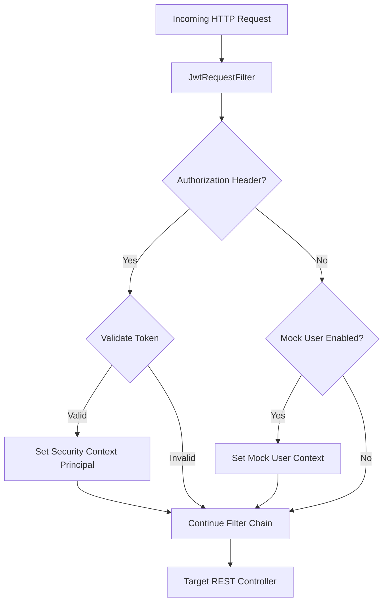
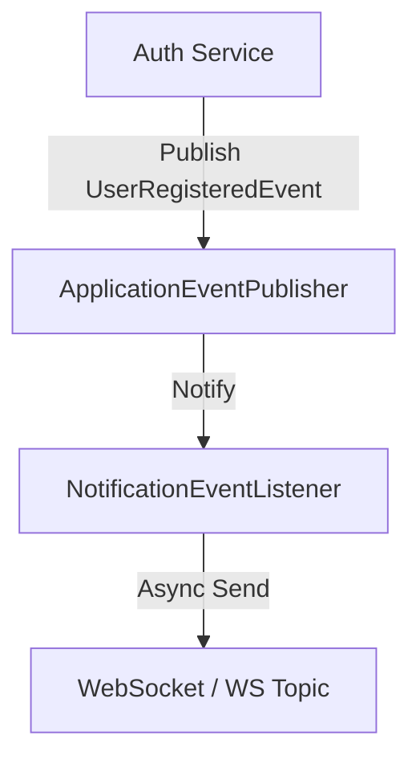

# Low-Level Design (LLD) - DevOps Suite

## 1. Overview
The DevOps Suite monolithic backend is structured under the base package `com.devopssuite.monolith`. The application runs as a single Spring Boot processes on port `8081`. 

### Packaging Structure
- `com.devopssuite.monolith.security` - Security configuration, JWT request filters, and JWT helper classes.
- `com.devopssuite.monolith.auth` - Registration, login, and profile management controllers, services, repositories, and JPA entities.
- `com.devopssuite.monolith.project` - Kanban boards, task tracking, and project membership controllers, services, repositories, and JPA entities.
- `com.devopssuite.monolith.execution` - Sandboxed docker-based code execution registry and runners.
- `com.devopssuite.monolith.logging` - Request logging and log indexing pipeline.
- `com.devopssuite.monolith.metrics` - Application Actuator/Prometheus scrapers and metrics handlers.
- `com.devopssuite.monolith.notification` - Internal notification dispatching via Spring Events.

---

## 2. Request Security & Filtering

Every API request is intercepted by `JwtRequestFilter` before reaching the controllers. Spring Security enforces authentication based on the context.

```mermaid
flowchart TD
    Req[Incoming HTTP Request] --> Filter[JwtRequestFilter]
    Filter --> HasToken{Authorization Header?}
    HasToken -->|Yes| Validate{Validate Token}
    HasToken -->|No| CheckMock{Mock User Enabled?}
    
    Validate -->|Valid| SetAuth[Set Security Context Principal]
    Validate -->|Invalid| Chain[Continue Filter Chain]
    
    CheckMock -->|Yes| SetMock[Set Mock User Context]
    CheckMock -->|No| Chain
    
    SetAuth --> Chain
    SetMock --> Chain
    Chain --> Controller[Target REST Controller]
```

---

## 3. Auth Domain Module

### Classes
- `AuthController`: Handles `/auth/register`, `/auth/login`, and `/auth/me`.
- `AuthService`: Implements password hashing, user registration, token generation, and current profile lookup.
- `UserRepository` / `RoleRepository`: JPA repositories for `User` and `Role` entities.

---

## 4. Project Domain Module

### Classes
- `ProjectController`: Exposes endpoints to create, update, delete, and list projects, boards, columns, and members.
- `TaskController`: Handles task CRUD and movement/reordering.
- `ProjectService`: Manages business rules, roles assignment, board initialization, and columns creation.
- `TaskService`: Enforces WIP limits on columns and updates sorting indices.

---

## 5. Sandboxed Code Execution Module

```mermaid
flowchart LR
    Request[Run Code Request] --> Validation[Verify Whitelist / Size]
    Validation --> Sandbox[DockerSandbox]
    Sandbox --> Create[Create Ephemeral Container]
    Create --> Start[Start Container without Network]
    Start --> Wait[Wait for Timeout Limit]
    Wait --> Extract[Extract stdout / stderr / exit code]
    Extract --> Destroy[Delete Container]
    Destroy --> Result[Return Result DTO]
```

---

## 6. Internal Event Pipeline (Replacing Kafka)
Instead of Kafka, the monolith utilizes Spring's internal `ApplicationEventPublisher` to run decoupled actions (e.g. notifications and logging updates) in an asynchronous manner.

```mermaid
flowchart TD
    Auth[Auth Service] -->|Publish UserRegisteredEvent| Publisher[ApplicationEventPublisher]
    Publisher -->|Notify| Listener[NotificationEventListener]
    Listener -->|Async Send| WebSocket[WebSocket / WS Topic]
```

---

## 7. WebSocket STOMP Configurations
WebSockets are configured in `com.devopssuite.monolith.config.WebSocketConfig` using STOMP over SockJS.
- **WebSocket Endpoint:** `/ws`
- **Destinations:**
  - `/topic/notifications/{userId}` - Direct in-app toast updates.
  - `/topic/logs/{projectId}` - Real-time tailing of project logs.
  - `/topic/tasks/{projectId}` - Live update of task columns card changes.
