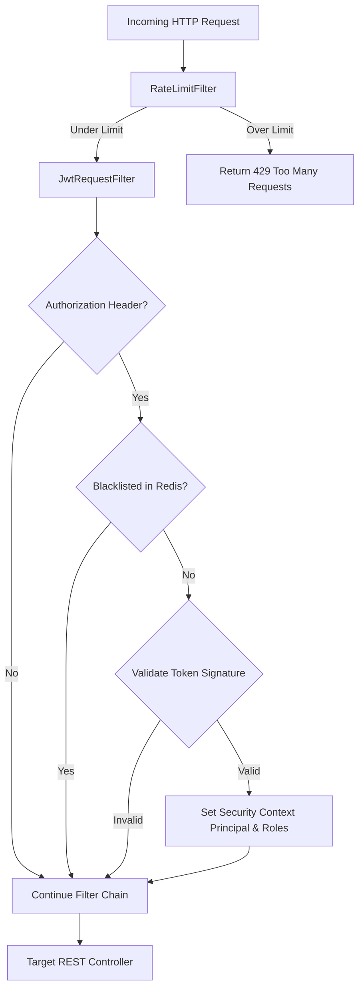
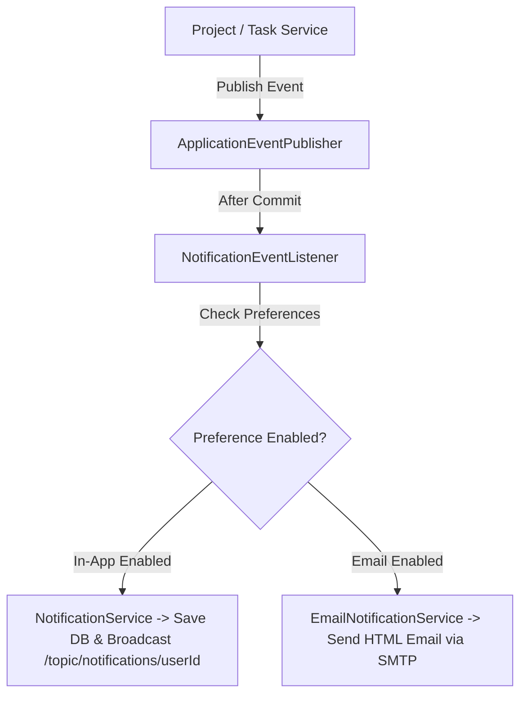

# Low-Level Design (LLD) - DevOps Suite

## 1. Overview
The DevOps Suite monolithic backend is structured under the base package `com.devopssuite`. The application runs internally on port `8081` and is host-exposed at port `8082` via Docker Compose.

### Packaging Structure
- `com.devopssuite.security` — Security configuration (`SecurityConfig`), `JwtRequestFilter`, `RateLimitFilter`, and `JwtUtils`.
- `com.devopssuite.auth` — Registration, login, Google/GitHub OAuth2, password reset, profile management, and user relationship/admin controllers, services, repositories, and JPA entities.
- `com.devopssuite.project` — Kanban boards, columns, task tracking, audit history, and project membership controllers, services, repositories, and JPA entities.
- `com.devopssuite.execution` — Sandboxed Docker-based code execution queue, workers, and runner.
- `com.devopssuite.ide` — IDE virtual file system persistence and project workspace management.
- `com.devopssuite.logging` — HTTP request logging filter and Elasticsearch indexing/search pipeline.
- `com.devopssuite.metrics` — System health checks, admin metrics dashboard, member summary, and Prometheus scrapers.
- `com.devopssuite.notification` — Internal notification dispatching via Spring Events, STOMP WebSocket push, and SMTP email delivery.

---

## 2. Request Security & Filtering

Every API request is intercepted by `RateLimitFilter` and `JwtRequestFilter` before reaching the controllers. Spring Security enforces authentication and role-based permissions based on the security context.

```mermaid
flowchart TD
    Req[Incoming HTTP Request] --> Rate[RateLimitFilter]
    Rate -->|Under Limit| Filter[JwtRequestFilter]
    Rate -->|Over Limit| Limit429[Return 429 Too Many Requests]
    Filter --> HasToken{Authorization Header?}
    HasToken -->|Yes| CheckBlacklist{Blacklisted in Redis?}
    HasToken -->|No| Chain[Continue Filter Chain]
    
    CheckBlacklist -->|Yes| Chain
    CheckBlacklist -->|No| Validate{Validate Token Signature}
    Validate -->|Valid| SetAuth[Set Security Context Principal & Roles]
    Validate -->|Invalid| Chain
    
    SetAuth --> Chain
    Chain --> Controller[Target REST Controller]
```

---

## 3. Auth & User Domain Module

### Classes & Responsibilities
- `AuthController`: Handles `/auth/register`, `/auth/login`, `/auth/refresh`, `/auth/logout`, `/auth/google`, `/auth/github`, `/auth/me`, `/auth/me/avatar`, `/auth/forgot-password`, and `/auth/reset-password` (both `/auth` and `/api/auth` prefixes supported).
- `UserController`: Public user profiles (`GET /api/users/{id}`), user follow/unfollow actions, followers/following queries, and view count tracking.
- `AdminUserController`: Administrative user overview, cross-project user tasks, and user log search (`/api/admin/users/**`).
- `AuthService`: Implements password hashing (BCrypt cost 12), user registration, token generation/refresh, token revocation via Redis blacklist, Google token verification, GitHub OAuth2 exchange, avatar updates, and password reset workflows.
- `AvatarStorageService`: Handles avatar image storage on the Docker volume and file cleanup.
- `UserRepository`, `RoleRepository`, `UserFollowRepository`, `PasswordResetTokenRepository`: Data access repositories.

---

## 4. Project & Kanban Domain Module

### Classes & Responsibilities
- `ProjectController`: Exposes endpoints to create, read, update, and delete projects, boards, columns, and manage project members and roles (`/api/projects` and `/api/v1/projects`).
- `TaskController`: Handles task CRUD, status updates, task duplication, and task audit history retrieval (`/api/tasks`, `/api/boards/{boardId}/tasks`).
- `ProjectService`: Manages business rules, project ownership, RBAC permissions, default board and column creation, and membership changes.
- `TaskService`: Enforces WIP limits on columns, updates task sort orders and statuses, records audit history in `task_audit_history`, publishes Spring notification events, and broadcasts real-time updates over `/topic/tasks/{projectId}`.

---

## 5. Sandboxed Code Execution & IDE Modules

### Code Execution

```mermaid
flowchart LR
    Request[POST /api/code-execution/run] --> Service[ExecutionService Queue]
    Service --> Worker[ExecutionQueueWorker]
    Worker --> Sandbox[DockerSandbox]
    Sandbox --> Create[Create Ephemeral Container]
    Create --> Start[Start Container without Network]
    Start --> Wait[Wait for Timeout Limit]
    Wait --> Extract[Extract stdout / stderr / exit code]
    Extract --> Destroy[Delete Container & Cleanup Directory]
    Destroy --> Result[Persist ExecutionResult]
    Result --> LogStream[Publish LogEvent & WebSocket]
```

- `ExecutionController`: Enqueues code runs (`POST /api/code-execution/run`), polls results (`GET /api/code-execution/{id}`), fetches execution history, and serves execution activity heatmaps.
- `ExecutionQueueWorker`: Multi-threaded background queue worker consuming execution jobs and coordinating sandbox runs.
- `DockerSandbox`: Creates ephemeral, isolated Docker containers with `--network none`, memory swap limits, read-only root filesystems, 1 CPU core allocation, and execution timeouts. Supports Python 3.12, Node.js 24, Java 21, and C++ (g++ 15). Supports both classic single-file mode and multi-file IDE mode.
- `IdeFileController` & `IdeFileService`: Full virtual file system management per project (`/api/ide/files`), managing file tree metadata, contents, languages, and directory hierarchies.

---

## 6. Internal Event Pipeline & Notifications

Instead of Kafka, the monolith utilizes Spring's internal `ApplicationEventPublisher` with asynchronous `@TransactionalEventListener(phase = AFTER_COMMIT)` handlers.

```mermaid
flowchart TD
    Domain[Project / Task Service] -->|Publish Event| Publisher[ApplicationEventPublisher]
    Publisher -->|After Commit| Listener[NotificationEventListener]
    Listener -->|Check Preferences| Prefs{Preference Enabled?}
    Prefs -->|In-App Enabled| InApp[NotificationService -> Save DB & Broadcast /topic/notifications/userId]
    Prefs -->|Email Enabled| Email[EmailNotificationService -> Send HTML Email via SMTP]
```

### Supported Notification Triggers
- `TaskAssignedEvent` (`TASK_ASSIGNED`)
- `TaskReassignedEvent` (`TASK_REASSIGNED`)
- `TaskCompletedEvent` (`TASK_COMPLETED`)
- `ExecutionFailedEvent` (`EXECUTION_FAILED`)
- `MemberAddedEvent` (`PROJECT_JOINED`)
- `MemberRoleChangedEvent` (`ROLE_CHANGED`)
- `MemberRemovedEvent` (`PROJECT_REMOVED`)

---

## 7. WebSocket STOMP Configurations

WebSockets are configured in `com.devopssuite.config.WebSocketConfig` using STOMP over SockJS.
- **WebSocket Endpoint:** `/ws`
- **Authentication:** Validated during STOMP `CONNECT` via `StompAuthChannelInterceptor` using the `Authorization: Bearer <token>` native header and Redis token blacklist.
- **Destinations:**
  - `/topic/notifications/{userId}` — Direct in-app toast updates.
  - `/topic/logs/{projectId}` — Real-time tailing of project request and execution logs.
  - `/topic/tasks/{projectId}` — Live Kanban board task updates (CREATED, UPDATED, STATUS_CHANGED, DELETED).
