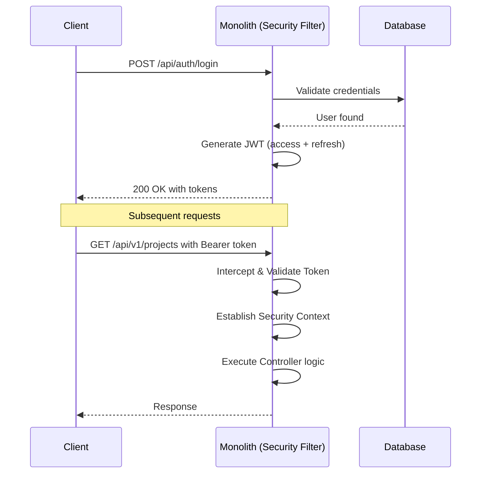
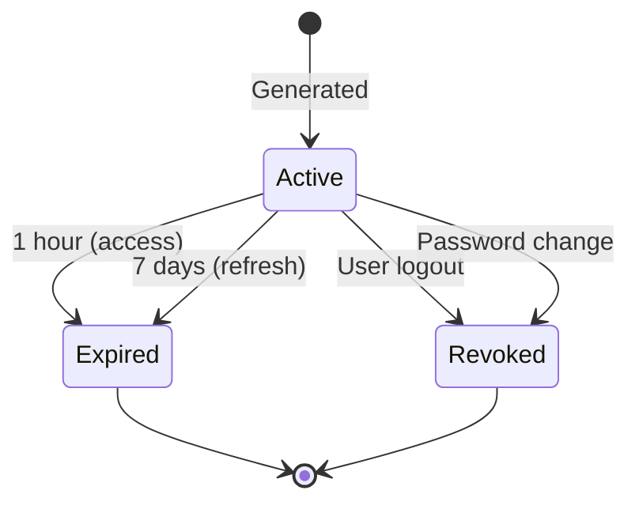
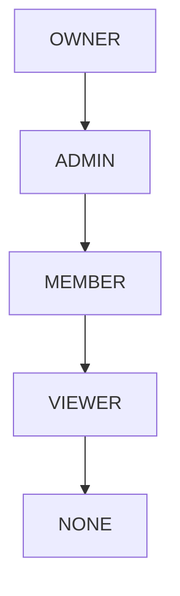
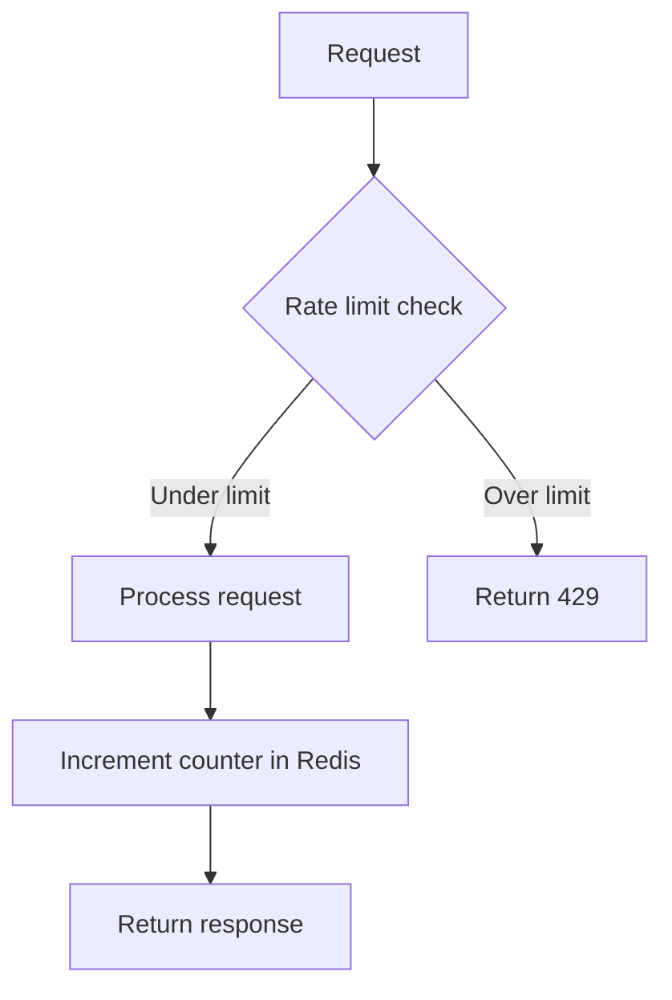
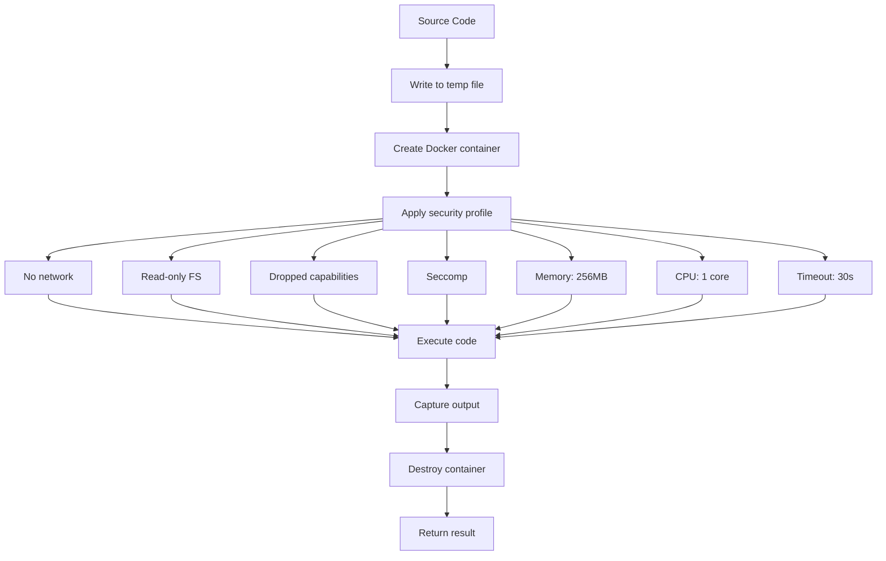

# Security Design - DevOps Suite

## 1. Overview
Multi-layer security: transport, authentication, authorization, input validation, and runtime sandboxing are managed within the monolithic Spring Boot application.

---

## 2. Authentication Flow

---

## 3. JWT Token Lifecycle

---

## 4. Role-Based Access Control (RBAC)

### Role Hierarchy

### Permission Matrix

| Action | OWNER | ADMIN | MEMBER | VIEWER |
|---|---|---|---|---|
| View project | Yes | Yes | Yes | Yes |
| Create task | Yes | Yes | Yes | No |
| Edit task | Yes | Yes | Yes | No |
| Delete task | Yes | Yes | Own only | No |
| Manage columns | Yes | Yes | No | No |
| Add/remove members | Yes | Yes | No | No |
| Delete project | Yes | No | No | No |

---

## 5. Password Policy

| Requirement | Rule |
|---|---|
| Minimum length | 8 characters |
| Complexity | 1 upper, 1 lower, 1 digit, 1 special |
| Hash algorithm | BCrypt (cost 12) |

---

## 6. API Security - Rate Limiting

---

## 7. Code Execution Sandbox

---

## 8. Secrets Management
- All secrets are loaded from environment variables (e.g. `JWT_SECRET`, `DB_PASSWORD`, `GOOGLE_CLIENT_ID`).
- Safe fallback defaults are configured for development.

---

## 9. Security Headers
- `Strict-Transport-Security`: Enforces HTTPS.
- `X-Content-Type-Options`: nosniff.
- `X-Frame-Options`: DENY to prevent clickjacking.
- `Content-Security-Policy`: default-src 'self'.

---

## 10. Audit Logging
- Auth attempts, CRUD actions, and code executions are logged synchronously or asynchronously to the logging database and indexed to Elasticsearch.
