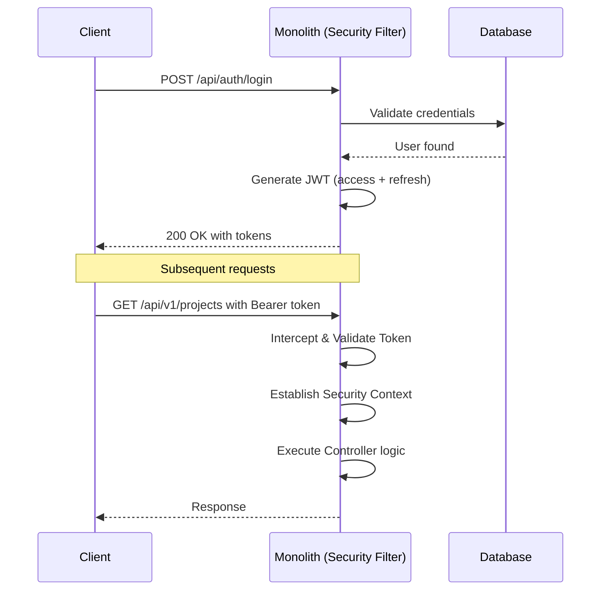
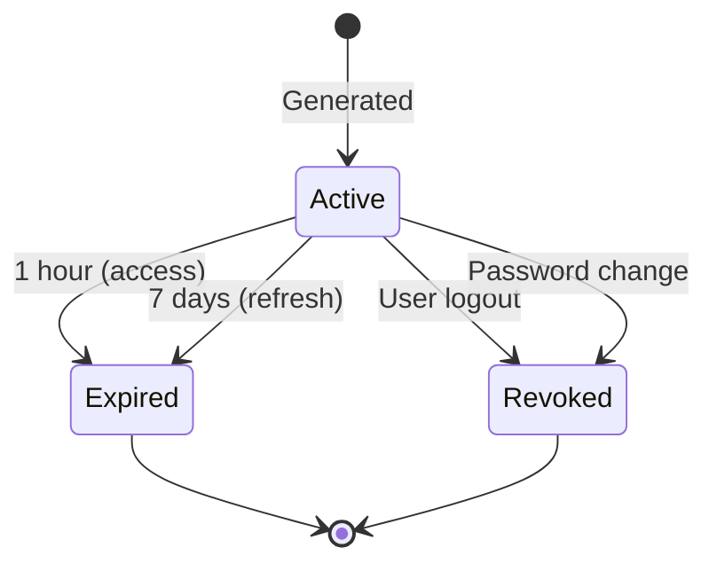
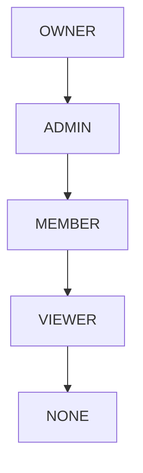
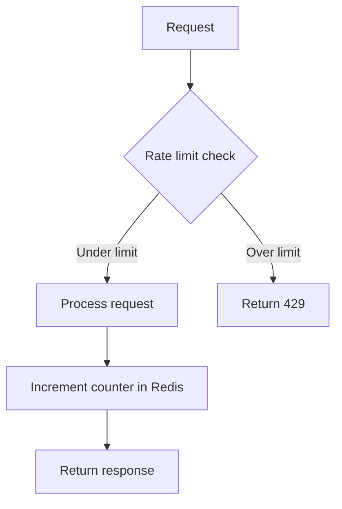
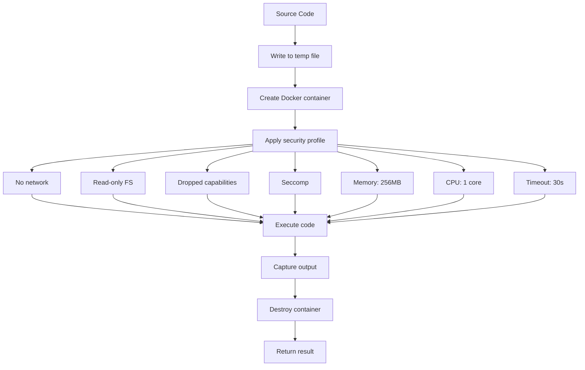

# Security Design - DevOps Suite

## 1. Overview
Multi-layer security: transport, authentication, authorization, input validation, and runtime sandboxing are managed within the monolithic Spring Boot application.

---

## 2. Authentication Flow

---

## 3. JWT Token Lifecycle

---

## 4. Role-Based Access Control (RBAC)

### Role Hierarchy

### Permission Matrix

| Action | OWNER | ADMIN | MEMBER | VIEWER |
|---|---|---|---|---|
| View project | Yes | Yes | Yes | Yes |
| Create task | Yes | Yes | Yes | No |
| Edit task | Yes | Yes | Yes | No |
| Delete task | Yes | Yes | Own only | No |
| Manage columns | Yes | Yes | No | No |
| Add/remove members | Yes | Yes | No | No |
| Delete project | Yes | No | No | No |
| **View Admin Dashboard** (`/`) | Yes | Yes | No — sees User Dashboard instead | No — sees User Dashboard instead |
| **View User Dashboard** (`/`) | Yes (also sees Admin view) | Yes (also sees Admin view) | Yes | Yes |
| **View Metrics page** (`/metrics`) | Yes | Yes | No — redirected to `/` | No — redirected to `/` |
| **Call `GET /api/metrics/dashboard`** | Yes | Yes | No — `403 Forbidden` | No — `403 Forbidden` |
| **Call `GET /api/metrics/user-summary`** | Yes | Yes | Yes (own data) | Yes (own data) |
| **Call `GET /actuator/*`** (except `/health`) | Yes | Yes | No — `403 Forbidden` | No — `403 Forbidden` |
| **Call `GET /actuator/health`** | Yes | Yes | Yes (public) | Yes (public) |

> **Rule:** System-wide infrastructure data (service health, request throughput/latency, platform-wide task counts) is restricted to `ROLE_ADMIN`. Regular members only ever see data scoped to their own activity.

---

## 5. Password Policy

| Requirement | Rule |
|---|---|
| Minimum length | 8 characters |
| Complexity | 1 upper, 1 lower, 1 digit, 1 special |
| Hash algorithm | BCrypt (cost 12) |

---

## 6. API Security - Rate Limiting

---

## 7. Code Execution Sandbox

---

## 8. Secrets Management
- All secrets are loaded from environment variables (e.g. `JWT_SECRET`, `DB_PASSWORD`, `GOOGLE_CLIENT_ID`).
- Safe fallback defaults are configured for development.

---

## 9. Security Headers
- `Strict-Transport-Security`: Enforces HTTPS.
- `X-Content-Type-Options`: nosniff.
- `X-Frame-Options`: DENY to prevent clickjacking.
- `Content-Security-Policy`: default-src 'self'.

---

## 10. Audit Logging
- Auth attempts, CRUD actions, and code executions are logged synchronously or asynchronously to the logging database and indexed to Elasticsearch.

---

## 11. Dashboard & Metrics Access Control

### 11.1 Backend enforcement

The Spring Security configuration applies the following rules for metrics-related endpoints:

| URL Pattern | Required Authority | Fallback |
|---|---|---|
| `/actuator/health` | None (permitAll) | — |
| `/actuator/**` | `ROLE_ADMIN` | `403 Forbidden` |
| `GET /api/metrics/dashboard` | `ROLE_ADMIN` | `403 Forbidden` |
| `GET /api/metrics/user-summary` | Any authenticated user | `401 Unauthorized` if no token |

These rules are enforced in `SecurityConfig` via `.requestMatchers(...).hasRole("ADMIN")` **before** any controller logic runs — no service-layer checks are needed for the access decision, but the `MetricsService` still scopes user-summary queries by the authenticated user's ID as a defence-in-depth measure.

### 11.2 Frontend enforcement

Two route guard components are used:

- `ProtectedRoute` — already exists; redirects unauthenticated users to `/login`.
- `AdminRoute` (new) — wraps `ProtectedRoute`; additionally checks `isAdmin` from `AuthContext`. If the user is authenticated but not admin, redirects to `/`.

The "Metrics" item in the `Sidebar` is conditionally rendered only when `isAdmin === true`, so non-admin users never see the link — the route guard is a defence-in-depth measure, not the primary UI gate.

`DashboardPage` internally checks `isAdmin` and renders either `<AdminDashboard />` or `<UserDashboard />` — no separate route is needed.
