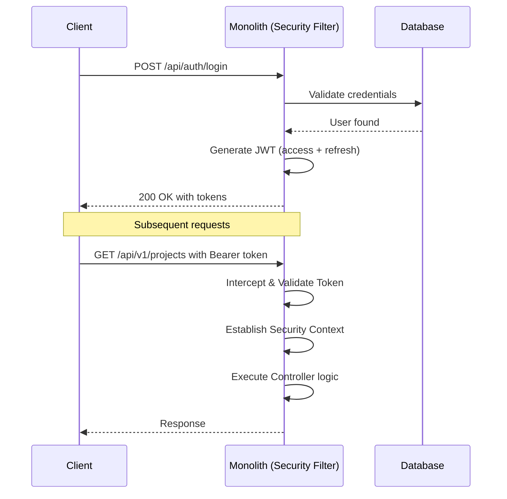
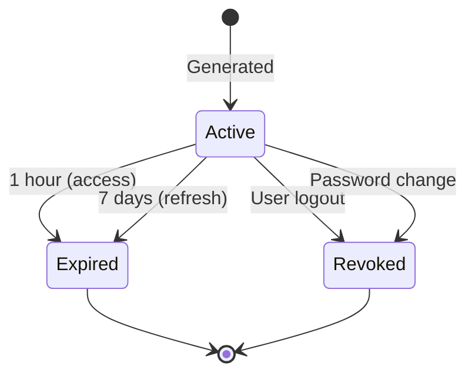
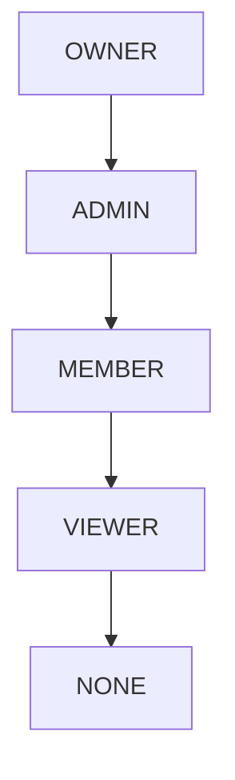
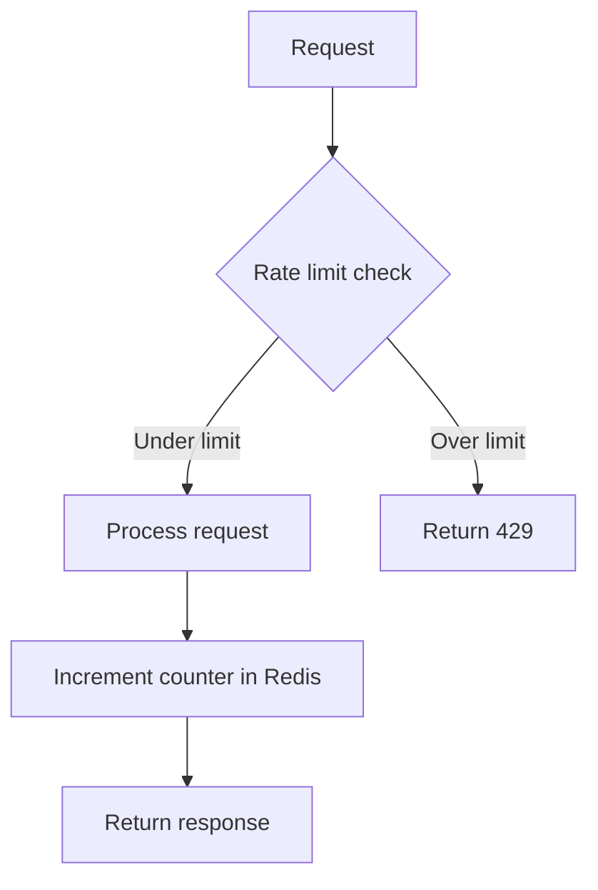
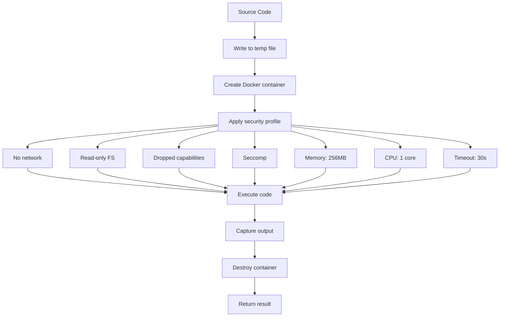

# Security Design - DevOps Suite

## 1. Overview

Multi-layer security: transport, authentication, authorization, input validation, and runtime sandboxing are managed within the monolithic Spring Boot application.

Supported authentication methods:
- **Local credentials** — email + BCrypt-hashed password
- **Google OAuth2** — via Spring OAuth2 Resource Server
- **GitHub OAuth2** — OAuth2 social login, handled by `GitHubCallbackPage` on the frontend with token exchange via backend

All authenticated sessions use **JWT tokens** (access: 1h, refresh: 7d). Tokens are blacklisted on logout via Redis.

---

## 2. Authentication Flow

```mermaid
sequenceDiagram
    participant C as Client
    participant MN as Monolith (Security Filter)
    participant DB as Database

    C->>MN: POST /api/auth/login
    MN->>DB: Validate credentials
    DB-->>MN: User found
    MN->>MN: Generate JWT (access + refresh)
    MN-->>C: 200 OK with tokens

    Note over C,MN: Subsequent requests
    C->>MN: GET /api/v1/projects with Bearer token
    MN->>MN: Intercept & Validate Token
    MN->>MN: Establish Security Context
    MN->>MN: Execute Controller logic
    MN-->>C: Response
```

---

## 3. JWT Token Lifecycle

```mermaid
stateDiagram-v2
    [*] --> Active : Generated
    Active --> Expired : 1 hour (access)
    Active --> Expired : 7 days (refresh)
    Active --> Revoked : User logout
    Active --> Revoked : Password change
    Expired --> [*]
    Revoked --> [*]
```

---

## 4. Role-Based Access Control (RBAC)

### Role Hierarchy

```mermaid
flowchart TD
    OWNER --> ADMIN
    ADMIN --> MEMBER
    MEMBER --> VIEWER
    VIEWER --> NONE
```

### Permission Matrix

| Action | OWNER | ADMIN | MEMBER | VIEWER |
|---|---|---|---|---|
| View project | Yes | Yes | Yes | Yes |
| Create task | Yes | Yes | Yes | No |
| Edit task | Yes | Yes | Yes | No |
| Delete task | Yes | Yes | Own only | No |
| Manage columns | Yes | Yes | No | No |
| Add/remove members | Yes | Yes | No | No |
| Delete project | Yes | No | No | No |
| **View Admin Dashboard** (`/`) | Yes | Yes | No — sees User Dashboard instead | No — sees User Dashboard instead |
| **View User Dashboard** (`/`) | Yes (also sees Admin view) | Yes (also sees Admin view) | Yes | Yes |
| **View Metrics page** (`/metrics`) | Yes | Yes | No — redirected to `/` | No — redirected to `/` |
| **Call `GET /api/metrics/dashboard`** | Yes | Yes | No — `403 Forbidden` | No — `403 Forbidden` |
| **Call `GET /api/metrics/user-summary`** | Yes | Yes | Yes (own data) | Yes (own data) |
| **Call `GET /actuator/*`** (except `/health`) | Yes | Yes | No — `403 Forbidden` | No — `403 Forbidden` |
| **Call `GET /actuator/health`** | Yes | Yes | Yes (public) | Yes (public) |

> **Rule:** System-wide infrastructure data (service health, request throughput/latency, platform-wide task counts) is restricted to `ROLE_ADMIN`. Regular members only ever see data scoped to their own activity.

---

## 5. Password Policy

| Requirement | Rule |
|---|---|
| Minimum length | 8 characters |
| Complexity | 1 upper, 1 lower, 1 digit, 1 special |
| Hash algorithm | BCrypt (cost 12) |

---

## 6. API Security — Rate Limiting

Redis sliding-window rate limiting is implemented in `RateLimitFilter`. Returns `429 Too Many Requests` when exceeded.

```mermaid
flowchart TD
    A[Request] --> B{Rate limit check}
    B -->|Under limit| C[Process request]
    B -->|Over limit| D[Return 429]
    C --> E[Increment counter in Redis]
    E --> F[Return response]
```

### Default Limits (per 60-second sliding window)

| Scope | Env Variable | Default |
|---|---|---|
| Code execution endpoints | `RATE_LIMIT_EXECUTION_MAX` | 10 requests |
| Auth endpoints (login/register) | `RATE_LIMIT_AUTH_MAX` | 20 requests |
| General API | `RATE_LIMIT_API_MAX` | 300 requests |

All limits are configurable via `.env` / environment variables.

---

## 7. Code Execution Sandbox

```mermaid
flowchart TD
    A[Source Code] --> B[Write to temp file]
    B --> C[Create Docker container]
    C --> D[Apply security profile]
    D --> E[No network]
    D --> F[Read-only FS]
    D --> G[Dropped capabilities]
    D --> H[Seccomp]
    D --> I[Memory: 256MB]
    D --> J[CPU: 1 core]
    D --> K[Timeout: 30s]
    E --> L[Execute code]
    F --> L
    G --> L
    H --> L
    I --> L
    J --> L
    K --> L
    L --> M[Capture output]
    M --> N[Destroy container]
    N --> O[Return result]
```

---

## 8. Secrets Management

All secrets are loaded from environment variables via the `.env` file. Never hardcoded in source.

| Variable | Purpose |
|---|---|
| `JWT_SECRET` | JWT signing key (HS256) |
| `DB_PASSWORD` | PostgreSQL password |
| `GOOGLE_CLIENT_ID` / `GOOGLE_CLIENT_SECRET` | Google OAuth2 |
| `GITHUB_CLIENT_ID` / `GITHUB_CLIENT_SECRET` | GitHub OAuth2 |
| `ADMIN_PASSWORD` | nginx Basic Auth for Grafana/Kibana |
| `MAIL_HOST`, `MAIL_USERNAME`, `MAIL_PASSWORD` | SMTP for email notifications |
| `ADMIN_SEED_EMAIL` / `ADMIN_SEED_PASSWORD` | Default admin account seeded on startup |

> [!CAUTION] `ADMIN_SEED_EMAIL`/`ADMIN_SEED_PASSWORD` default to `admin@admin.com`/`admin` for dev. **Always override in production** before deploying.

---

## 9. Security Headers
- `Strict-Transport-Security`: Enforces HTTPS.
- `X-Content-Type-Options`: nosniff.
- `X-Frame-Options`: DENY to prevent clickjacking.
- `Content-Security-Policy`: default-src 'self'.

---

## 10. Audit Logging
- Auth attempts, CRUD actions, and code executions are logged synchronously or asynchronously to the logging database and indexed to Elasticsearch.

---

## 11. Dashboard & Metrics Access Control

### 11.1 Backend enforcement

The Spring Security configuration applies the following rules for metrics-related endpoints:

| URL Pattern | Required Authority | Fallback |
|---|---|---|
| `/actuator/health` | None (permitAll) | — |
| `/actuator/**` | `ROLE_ADMIN` | `403 Forbidden` |
| `GET /api/metrics/dashboard` | `ROLE_ADMIN` | `403 Forbidden` |
| `GET /api/metrics/user-summary` | Any authenticated user | `401 Unauthorized` if no token |

These rules are enforced in `SecurityConfig` via `.requestMatchers(...).hasRole("ADMIN")` **before** any controller logic runs — no service-layer checks are needed for the access decision, but the `MetricsService` still scopes user-summary queries by the authenticated user's ID as a defence-in-depth measure.

### 11.2 Frontend enforcement

Two route guard components are used:

- `ProtectedRoute` — already exists; redirects unauthenticated users to `/login`.
- `AdminRoute` (new) — wraps `ProtectedRoute`; additionally checks `isAdmin` from `AuthContext`. If the user is authenticated but not admin, redirects to `/`.

The "Metrics" item in the `Sidebar` is conditionally rendered only when `isAdmin === true`, so non-admin users never see the link — the route guard is a defence-in-depth measure, not the primary UI gate.

`DashboardPage` internally checks `isAdmin` and renders either `<AdminDashboard />` or `<UserDashboard />` — no separate route is needed.

---

## 12. WebSocket Authentication

WebSocket connections (STOMP over SockJS) are authenticated via JWT on the CONNECT frame.

**Flow:**
1. Frontend sends STOMP CONNECT with `Authorization: Bearer <token>` in headers
2. `StompAuthChannelInterceptor` (in `com.devopssuite.notification.security`) intercepts every STOMP CONNECT command
3. JWT is validated for signature validity + Redis blacklist check
4. If invalid → connection is rejected with a STOMP ERROR frame
5. If valid → security context is set for the WebSocket session

**Topics and required auth:**
| Topic | Auth Required |
|---|---|
| `/topic/notifications/{userId}` | Authenticated user |
| `/topic/tasks/{projectId}` | Authenticated project member |
| `/topic/logs/{projectId}` | Authenticated project member |

---

## 13. Password Reset Security

The forgot-password / reset-password flow uses time-limited tokens:
1. `POST /api/auth/forgot-password` — generates a UUID token, stores in `password_reset_tokens` table with 24h expiry, sends email link
2. `POST /api/auth/reset-password` — validates token not expired and not used, updates password hash, marks token as used
3. Old tokens are never reusable — `used = true` is set immediately on consumption

Email links contain the token in the URL: `{FRONTEND_URL}/reset-password?token={uuid}`
