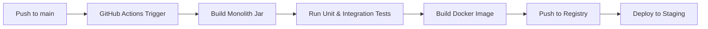
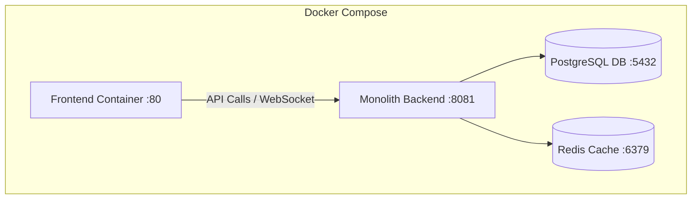

# Deployment & DevOps - DevOps Suite

## 1. Overview
The DevOps Suite application deployment is simplified from a multi-service model to a single monolithic Spring Boot backend container and a React frontend SPA container.

---

## 2. CI/CD Pipeline Flow



---

## 3. Container Architecture



---

## 4. Environment Strategy
- **Development:** Local Docker Compose for middleware (Postgres, Redis), hot-reloading monolith and React app on localhost.
- **Testing:** Ephemeral docker-compose in GitHub actions, executing backend tests.
- **Staging / Production:** Multi-container deployment utilizing Docker Compose or Kubernetes, mounting volumes for PG data and Elasticsearch logs.

---

## 5. Dockerfile Configurations

### Monolithic Spring Boot Dockerfile
```dockerfile
# Build Stage
FROM maven:3.9-eclipse-temurin-21 AS builder
WORKDIR /app
COPY pom.xml .
RUN mvn dependency:go-offline -B
COPY src/ src/
RUN mvn package -DskipTests

# Runtime Stage
FROM eclipse-temurin:21-jre-alpine
RUN addgroup -S appgroup && adduser -S appuser -G appgroup
WORKDIR /app
COPY --from=builder /app/target/*.jar app.jar
USER appuser
EXPOSE 8081
ENTRYPOINT java -jar app.jar
```

### Frontend Dockerfile
```dockerfile
FROM node:24-alpine AS builder
WORKDIR /app
COPY package.json package-lock.json ./
RUN npm ci
COPY . .
RUN npm run build

FROM nginx:alpine
COPY --from=builder /app/dist /usr/share/nginx/html
COPY nginx.conf /etc/nginx/conf.d/default.conf
EXPOSE 80
```

---

## 6. Nginx Fronting Configuration
```nginx
server {
    listen 80;
    server_name localhost;
    root /usr/share/nginx/html;
    index index.html;

    location / {
        try_files $uri $uri/ /index.html;
    }

    location /api/ {
        proxy_pass http://backend-monolith:8081;
        proxy_set_header Host $host;
        proxy_set_header X-Real-IP $remote_addr;
        proxy_set_header X-Forwarded-For $proxy_add_x_forwarded_for;
    }

    location /ws/ {
        proxy_pass http://backend-monolith:8081;
        proxy_http_version 1.1;
        proxy_set_header Upgrade $http_upgrade;
        proxy_set_header Connection upgrade;
        proxy_read_timeout 86400;
    }
}
```
