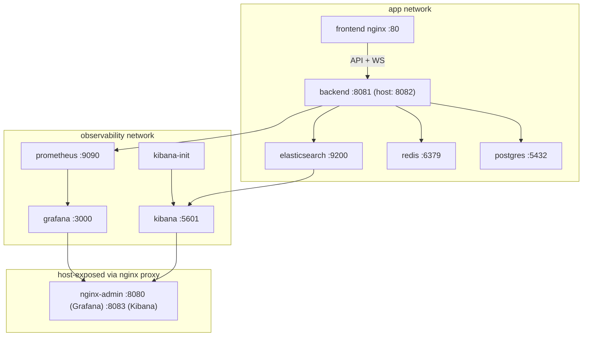

# Deployment & DevOps — DevOps Suite

## 1. Overview

The DevOps Suite uses a full Docker Compose stack for both local development and production-like deployment. The backend compiles inside Docker (multi-stage build), the frontend is served by nginx inside Docker, and all observability tools (Elasticsearch, Kibana, Prometheus, Grafana) are containerized behind an nginx admin proxy.

---

## 2. CI/CD Pipeline

### GitHub Actions Workflow
File: `.github/workflows/deploy.yml`


```mermaid
flowchart LR
    A[Push to main] --> B[GitHub Actions Trigger]
    B --> C[Checkout + Setup Java 21]
    C --> D[Maven Cache .m2]
    D --> E[mvn clean compile]
    E --> F[mvn test]
    F --> G[Build Docker Image]
    G --> H[Push to Registry]
    H --> I[Deploy to Server]
```

The workflow:
1. Checks out code
2. Sets up Java 21 with Maven dependency caching
3. Compiles and runs unit tests (JaCoCo coverage)
4. Builds Docker images for backend and frontend
5. Pushes to container registry
6. Deploys to the target server

---

## 3. Container Architecture (Docker Compose)


```mermaid
flowchart TD
    subgraph "app network"
        FE["frontend nginx :80"]
        MONO["backend :8081 (host: 8082)"]
        PG["postgres :5432"]
        Redis["redis :6379"]
        ES["elasticsearch :9200"]
    end

    subgraph "observability network"
        PROM["prometheus :9090"]
        GRAF["grafana :3000"]
        KIB["kibana :5601"]
        KBINIT["kibana-init"]
    end

    subgraph "host-exposed via nginx proxy"
        NGINX_ADMIN["nginx-admin :8080 (Grafana) :8083 (Kibana)"]
    end

    FE -->|API + WS| MONO
    MONO --> PG
    MONO --> Redis
    MONO --> ES
    ES --> KIB
    MONO --> PROM
    PROM --> GRAF
    GRAF --> NGINX_ADMIN
    KIB --> NGINX_ADMIN
    KBINIT --> KIB
```

---

## 4. Service Port Map

| Service | Internal Port | Host Port | Notes |
|---|---|---|---|
| Frontend (nginx) | 80 | 80 | React SPA |
| Backend (Spring Boot) | 8081 | **8082** | REST API + WebSocket |
| Grafana | 3000 | — | via nginx proxy |
| Kibana | 5601 | — | via nginx proxy |
| nginx admin proxy | — | 8080 (Grafana), 8083 (Kibana) | Basic Auth protected |
| Prometheus | 9090 | 9090 | Direct access |
| PostgreSQL | 5432 | — | Internal only |
| Redis | 6379 | — | Internal only |
| Elasticsearch | 9200 | — | Internal only |

> **Dev frontend:** When running the frontend locally via `npm run dev`, it runs on port `5173`. Set `VITE_API_URL=http://localhost:8082` to target the Dockerized backend.

---

## 5. Dockerfile Configurations

### Backend — Multi-Stage Build (`backend/Dockerfile`)
```dockerfile
# Build Stage
FROM maven:3.9-eclipse-temurin-21 AS builder
WORKDIR /app
COPY pom.xml .
RUN mvn dependency:go-offline -B
COPY src/ src/
RUN mvn package -DskipTests

# Runtime Stage
FROM eclipse-temurin:21-jre-alpine
RUN addgroup -S appgroup && adduser -S appuser -G appgroup
WORKDIR /app
COPY --from=builder /app/target/*.jar app.jar
USER appuser
EXPOSE 8081
ENTRYPOINT ["java", "-jar", "app.jar"]
```

### Frontend — Multi-Stage Build (`frontend/Dockerfile`)
```dockerfile
FROM node:24-alpine AS builder
WORKDIR /app
COPY package.json package-lock.json ./
RUN npm ci
COPY . .
RUN npm run build

FROM nginx:alpine
COPY --from=builder /app/dist /usr/share/nginx/html
COPY nginx.conf /etc/nginx/conf.d/default.conf
EXPOSE 80
```

### C++ Sandbox Image (`Dockerfile.cpp-sandbox`)
Custom Docker image for C++ code execution with g++ installed.

---

## 6. Nginx Frontend Configuration

The frontend nginx container proxies all `/api/` and `/ws/` requests to the backend, enabling the SPA to function with a single origin:

```nginx
server {
    listen 80;
    server_name localhost;
    root /usr/share/nginx/html;
    index index.html;

    location / {
        try_files $uri $uri/ /index.html;
    }

    location /api/ {
        proxy_pass http://backend:8081;
        proxy_set_header Host $host;
        proxy_set_header X-Real-IP $remote_addr;
        proxy_set_header X-Forwarded-For $proxy_add_x_forwarded_for;
    }

    location /ws/ {
        proxy_pass http://backend:8081;
        proxy_http_version 1.1;
        proxy_set_header Upgrade $http_upgrade;
        proxy_set_header Connection "upgrade";
        proxy_read_timeout 86400;
    }
}
```

---

## 7. Environment Strategy

| Environment | Backend | Frontend | Database |
|---|---|---|---|
| **Local Dev** | Docker (`docker-compose up -d backend`) | `npm run dev` (port 5173) | Docker Postgres |
| **Full Docker** | Docker (port 8082) | Docker nginx (port 80) | Docker Postgres |
| **Production** | Docker Compose or cloud deployment | Docker nginx | External DB recommended (Neon/RDS) |

---

## 8. Starting the Stack

### Quick Start (Backend + Frontend Dockerized)
```bash
# Copy and configure environment
cp .env.example .env
# Edit .env with your values

# Start everything
docker-compose up -d

# Backend at :8082, Frontend at :80
# Grafana at :8080, Kibana at :8083
```

### Development Mode (Frontend local)
```bash
# Start infra + backend
docker-compose up -d postgres redis backend elasticsearch kibana prometheus

# Run frontend locally
cd frontend && npm install && npm run dev
# → http://localhost:5173 (set VITE_API_URL=http://localhost:8082)
```

### After Backend Code Changes
```bash
docker-compose up -d --build backend
```

---

## 9. Volumes

| Volume | Purpose |
|---|---|
| `postgres_data` | PostgreSQL data persistence |
| `redis_data` | Redis data persistence |
| `elasticsearch_data` | Elasticsearch indices |
| `grafana_data` | Grafana dashboards/config persistence |
| `./sandbox-temp` | Bind-mount for Docker-in-Docker sandbox temp files |
| `/var/run/docker.sock` | Docker socket for code execution sandbox |

---

## 10. Stopping & Resetting

```bash
docker-compose down          # Stop all containers (data preserved)
docker-compose down -v       # Stop + wipe all volumes (fresh start)
```
