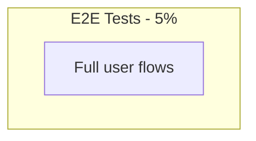
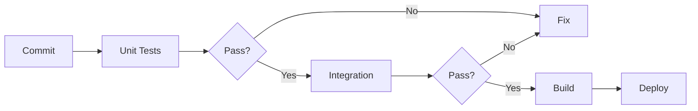

# Testing Strategy - DevOps Suite
## 1. Overview
Multi-layered testing following the test pyramid.
---
## 2. Test Pyramid

## 3. Unit Testing
Java: JUnit 5 + Mockito. Coverage: >= 80%.
---
## 4. Integration Testing
Testcontainers for DB, Kafka, Docker sandbox.
---
## 5. E2E Testing
Cypress or Playwright. REST Assured for API.
---
## 6. Performance Testing
k6 or Gatling. P95 < 500ms API, < 5s code.
---
## 7. Test Pipeline

---
## 8. Test Data
Ephemeral: mock, Testcontainers, synthetic.

---

## 9. Frontend Testing Strategy

### 9.1 Unit Testing
- Framework: Jest + React Testing Library
- Component rendering tests for all major components
- Mock API calls with MSW (Mock Service Worker)
- Snapshot testing for UI component consistency
- Coverage target: 80 percent for components and hooks

### 9.2 Component Testing
- Monaco Editor: Syntax highlighting, code input/output, language switching
- Kanban Board: Drag-and-drop between columns, task creation, assignment
- Log Viewer: Real-time log rendering, filtering, pause/resume
- Metrics Dashboard: Chart rendering with mock data, date range selection
- Auth Flow: Login, register, token refresh, protected route redirects
- Notification Toast: WebSocket message rendering, dismiss, mark-as-read

### 9.3 Integration Testing
- Cypress or Playwright for E2E browser tests
- Full user journey: login, create project, create task, assign, execute code
- WebSocket connection and real-time log streaming
- Kanban drag-and-drop state persistence
- Responsive design testing on multiple viewports

### 9.4 Accessibility Testing
- WCAG 2.1 AA compliance
- Keyboard navigation for all interactive elements
- Screen reader compatibility with ARIA labels
- Color contrast ratio checks

---

## 10. WebSocket Testing Strategy

### 10.1 Unit Testing
- Mock WebSocket connection with STOMP frame simulation
- Test message handler functions with various payload types
- Test reconnection logic with exponential backoff
- Test JWT authentication during STOMP CONNECT frame

### 10.2 Integration Testing
- Testcontainers with embedded STOMP broker
- Verify STOMP CONNECT with valid JWT succeeds
- Verify STOMP CONNECT with invalid JWT fails
- Verify log events broadcast to /topic/logs subscribers
- Verify notification events broadcast to /topic/notifications/{userId}
- Test multiple concurrent WebSocket connections
- Test WebSocket disconnection and reconnection

### 10.3 Load Testing
- Simulate 100 concurrent WebSocket connections
- Measure message delivery latency under load
- Verify no message loss during sustained streaming
- Test memory usage with many active connections

---

## 11. Kafka Testing Strategy

### 11.1 Unit Testing
- Mock KafkaTemplate for producer tests
- Mock consumer listener for message processing tests
- Test event serialization and deserialization
- Test error handling in consumer methods

### 11.2 Integration Testing
- Testcontainers with Kafka container
- Test producer publishes correct event to correct topic
- Test consumer receives and processes messages from subscribed topics
- Test consumer group rebalancing
- Test dead letter queue for failed messages
- Test idempotent consumer processing

### 11.3 End-to-End Testing
- Publish event from one service and verify consumer in another receives it
- Verify notification event flows: Project Service -> Kafka -> Notification Consumer -> WebSocket -> Frontend
- Verify log event flows: Any Service -> Kafka -> Logging Consumer -> Elasticsearch
- Test event ordering within a partition
- Test message TTL and retention policies
