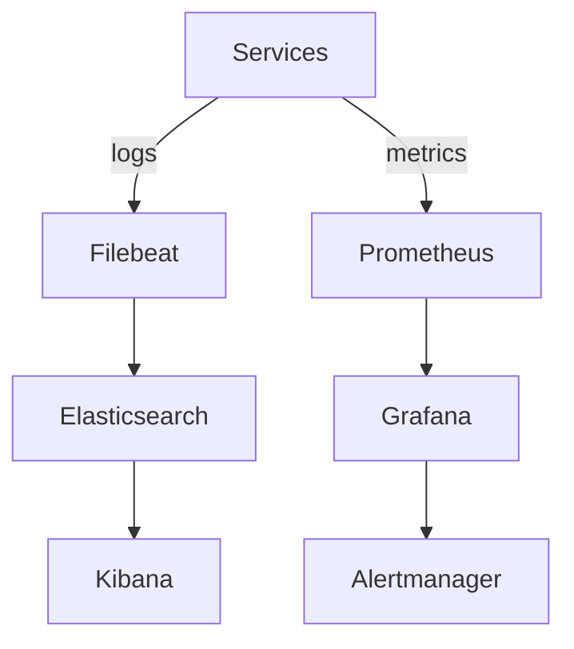

# Monitoring and Observability - DevOps Suite
## 1. Overview
Stack: Prometheus, Grafana, ES, Kibana, OTel.
---
## 2. Architecture

---
## 3. Logging
Structured JSON. Levels: DEBUG, INFO, WARN, ERROR.
Retention: Dev 7d, Stage 30d, Prod 90d.
---
## 4. Metrics
RED method: Rate, Errors, Duration. Business metrics.
---
## 5. Tracing
OpenTelemetry, 10% sampling, traceparent header.
---
## 6. Alerting
Critical: PagerDuty. Warning: Slack.
---
## 7. Dashboards
Service overview + Business dashboard.
---
## 8. Incident Response
Ack 5m, assess 15m, mitigate 30m, PM 24h.

## 9. Distributed Tracing with Zipkin and Sleuth

### 9.1 Architecture

- Spring Cloud Sleuth automatically creates trace and span IDs for all requests
- Traces propagated across service calls via HTTP headers (traceparent)
- Zipkin server collects and stores trace data from all services
- 10 percent sampling rate to balance visibility and performance

### 9.2 Configuration Per Service

- spring-sleuth-sampler-probability: 0.1
- spring-zipkin-base-url: http://zipkin:9411
- spring-zipkin-sender-type: web
- Trace IDs included in all structured log entries

### 9.3 Zipkin Dashboard Usage

- Search traces by service, duration, status, and tags
- View service dependency graph from trace data
- Analyze latency breakdown per service hop
- Identify slow endpoints and bottleneck services
- Compare trace timelines for error vs success requests

### 9.4 Trace Correlation in Logs

- Each log entry includes trace-id and span-id fields
- Filter logs by trace-id to see full request flow across services
- Correlate errors in logs with trace timeline in Zipkin

---

## 10. Resilience4j Metrics and Monitoring

### 10.1 Metrics Exposed

- Circuit breaker state (closed/open/half-open) as gauge metric
- Circuit breaker failure rate and success rate counters
- Circuit breaker not-permitted calls counter
- Retry attempts counter and success/failure rates
- Rate limiter available permissions gauge
- Rate limiter rejected calls counter
- Bulkhead available permissions and wait duration

### 10.2 Grafana Dashboard

- Circuit breaker state timeline per service
- Failure rate trends with threshold lines
- Retry success vs failure rate
- Rate limiter utilization over time
- Correlation between circuit breaker trips and error rate

### 10.3 Alert Rules

- Critical: Circuit breaker open for more than 5 minutes
- Warning: Failure rate exceeds 40 percent for 2 minutes
- Warning: Retry rate exceeds 20 percent of total requests
- Info: Rate limiter rejecting more than 5 percent of requests

---

## 11. Analytics Dashboard

### 11.1 Metrics Aggregation

- Request count per service per minute
- Average and p95 response time per endpoint
- Error rate per service and per endpoint
- Active user count from auth-service logs
- Task completion rate from project-service events
- Code execution success and failure rate from code-exec-service

### 11.2 Dashboard Components

- Real-time line charts for request rate and error rate
- Bar charts for service comparison metrics
- Gauge components for current system health score
- Heatmap for response time distribution
- Date range picker for historical analysis

### 11.3 Tech Stack

- Recharts for React-based chart components
- WebSocket connection for live metric updates
- Prometheus query API for data retrieval
- Aggregated metrics stored in metrics-service database

---

## 12. Health Page

### 12.1 Service Status Monitoring

- Green: Service healthy, responding within normal latency
- Yellow: Service degraded, elevated error rate or latency
- Red: Service down or circuit breaker open

### 12.2 Infrastructure Status

- PostgreSQL: Connection pool health, active connections, query latency
- Redis: Connection status, memory usage, hit rate
- Kafka: Broker status, topic lag, consumer group lag
- Docker: Daemon status, container count, resource usage

### 12.3 Health Check Endpoints

- Each service exposes /actuator/health via Spring Boot Actuator
- Custom health indicators for database, Kafka, Redis connections
- Aggregated health status at API Gateway /health endpoint
- Health page polls every 30 seconds and updates status indicators

### 12.4 Incident History

- Log of all status changes with timestamps
- Duration of each incident tracked
- Resolution notes field for post-mortem documentation
- Export incident history as CSV for reporting

---

## 13. OpenTelemetry Integration

### 13.1 Current Setup

- OTel agent for auto-instrumentation of HTTP calls
- OTel traces exported to Zipkin backend
- OTel metrics exported to Prometheus backend

### 13.2 Future Enhancements

- OTel Collector as centralized export pipeline
- OTel logs for unified log/trace/metrics correlation
- OTel auto-instrumentation for Kafka producer and consumer
