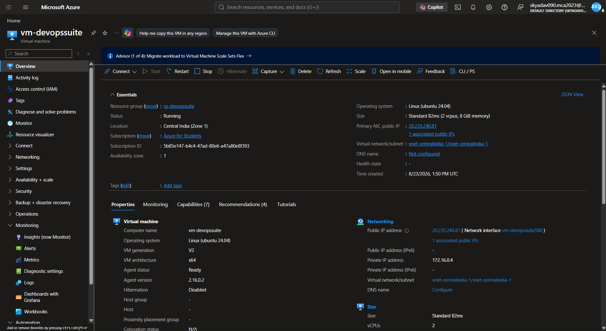
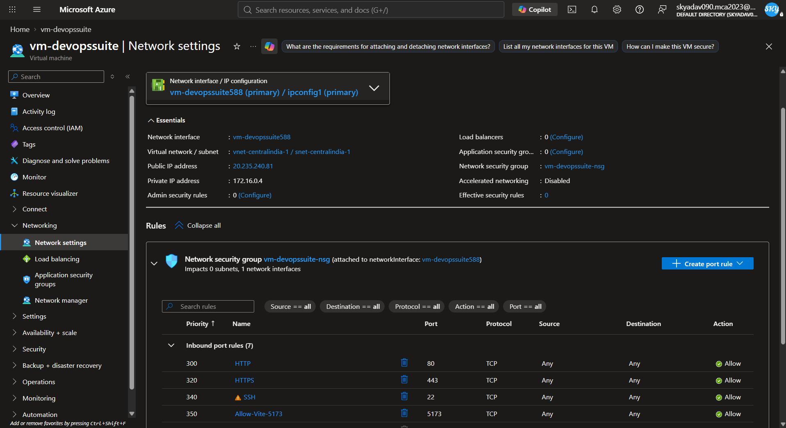
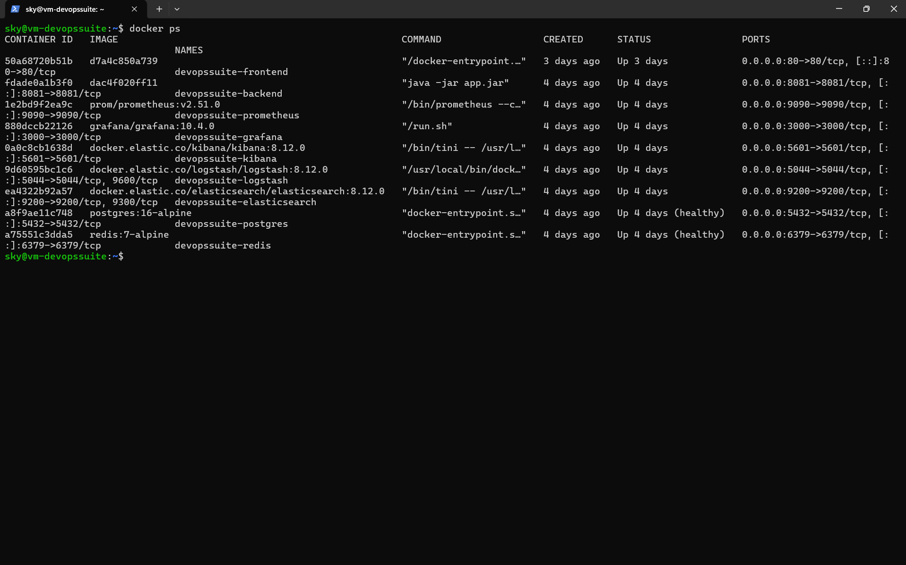
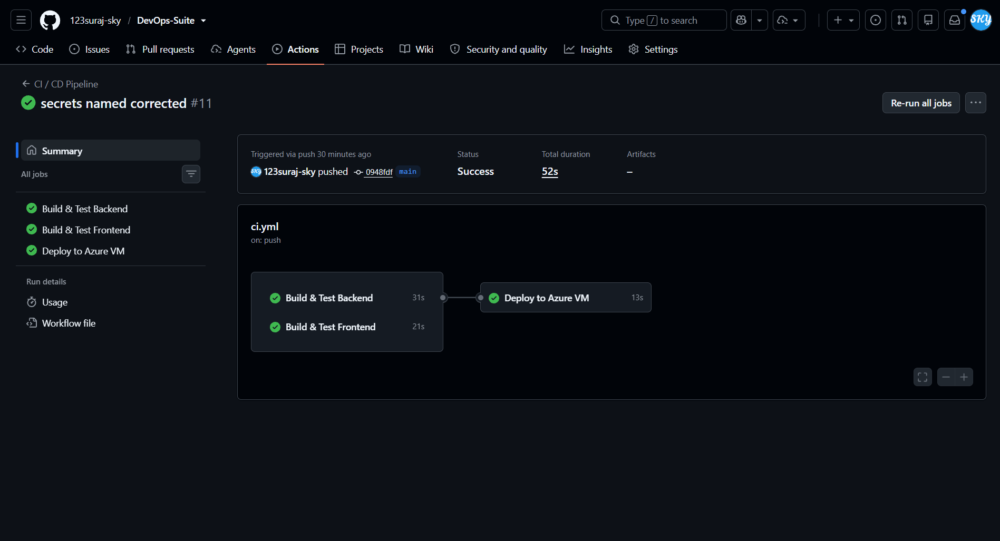
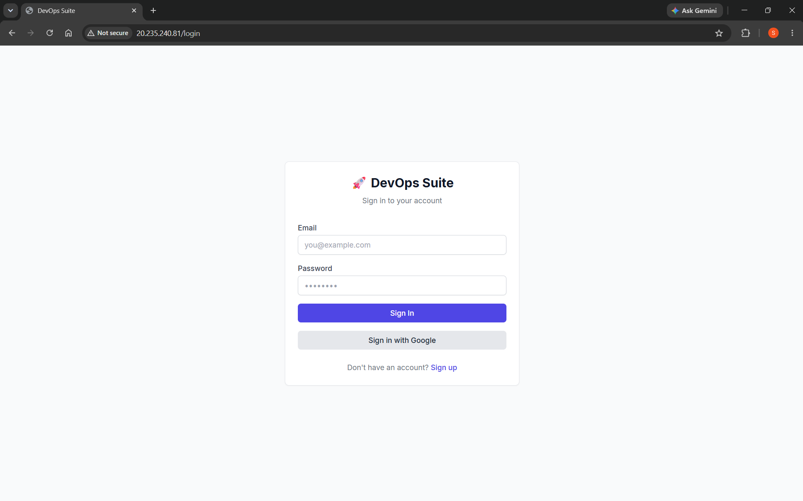
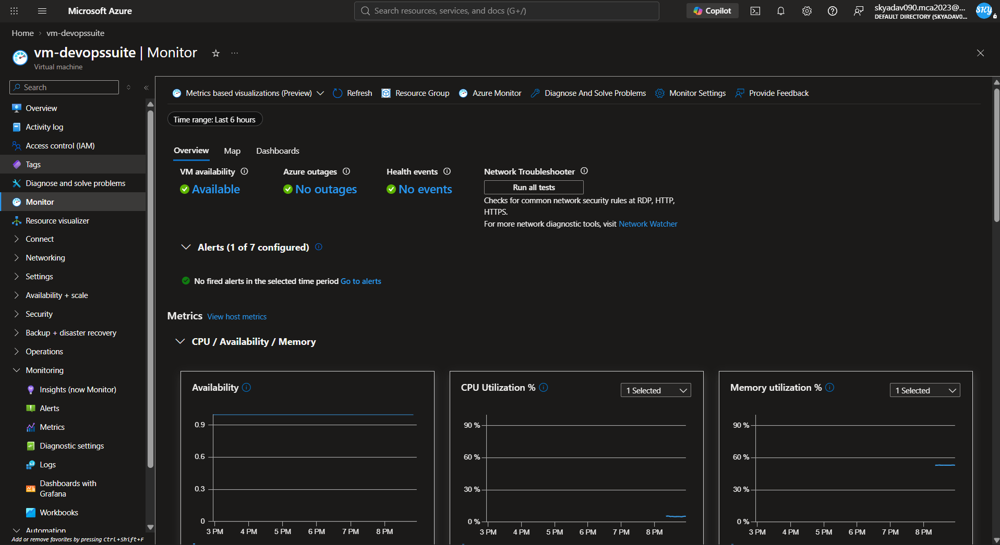
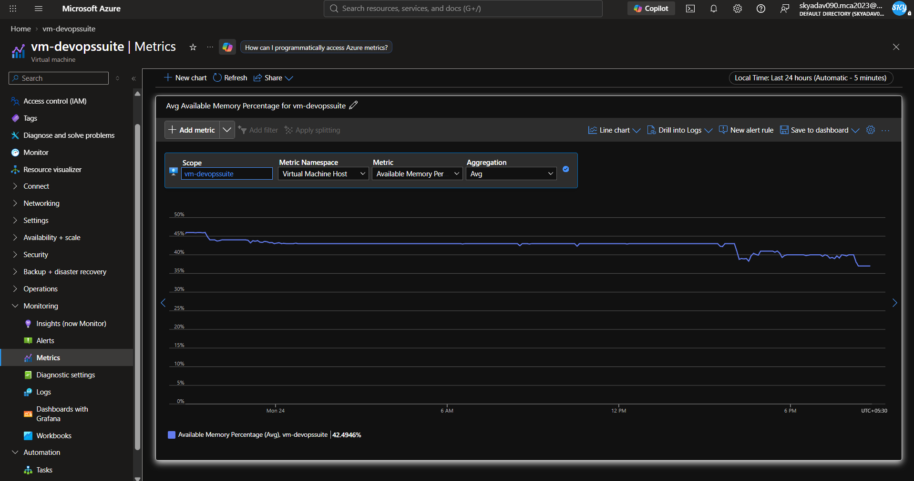
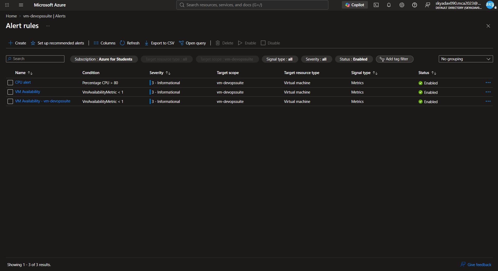
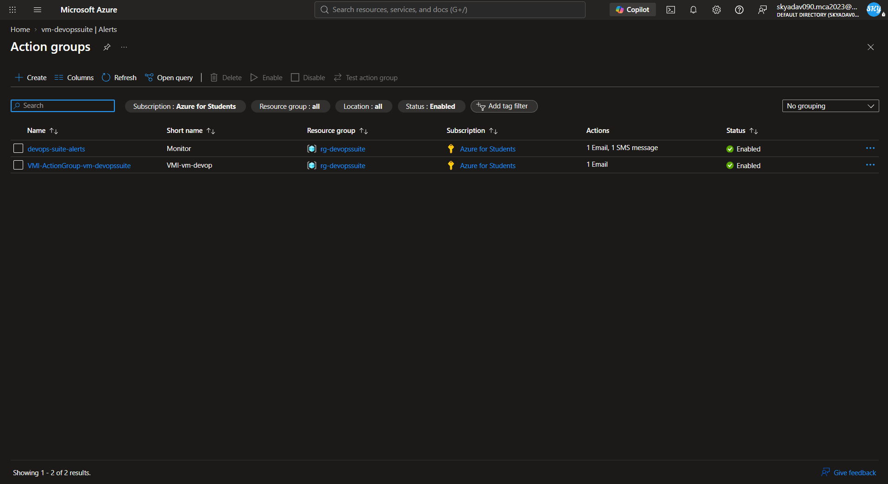

# Azure Deployment — DevOps Suite

DevOps Suite was deployed live to Microsoft Azure using **Azure for Students free subscription credits**. The full multi-container stack was hosted on a single **Azure Virtual Machine** (`Standard_B2ms`, Ubuntu 22.04 LTS) using Docker Compose, which preserved the Docker socket sandbox required for code execution out-of-the-box.

This document describes exactly what was done.

---

## Deployment Overview

| Property | Value |
| :--- | :--- |
| Cloud Provider | Microsoft Azure (Azure for Students) |
| VM SKU | `Standard_B2ms` — 2 vCPUs, 8 GB RAM |
| OS Image | Ubuntu Server 22.04 LTS — x64 Gen2 |
| Orchestration | Docker Compose (single-VM, all services) |
| CI/CD | GitHub Actions (`deploy.yml`) — build, test, push, deploy on merge to `main` |
| Monitoring | Azure Monitor — metric alerts, action groups (email + SMS) |

---

## Step 1: Create the Azure Virtual Machine

The VM was created via the Azure Portal:

1. Navigated to **Virtual Machines** → **Create → Azure Virtual Machine**.
2. Configuration used:
   - **Resource Group:** `rg-devopssuite` (created new)
   - **VM Name:** `vm-devopssuite`
   - **Region:** East US
   - **Image:** Ubuntu Server 22.04 LTS — x64 Gen2
   - **Size:** `Standard_B2ms` (2 vCPUs, 8 GB RAM) — chosen to comfortably run the ELK stack alongside Prometheus + Grafana
   - **Authentication:** SSH public key
3. **Inbound Port Rules** set to allow:
   - `SSH (22)` — for remote access
   - `HTTP (80)` — frontend nginx
   - `HTTPS (443)` — SSL termination
   - Additional ports opened in the Network Security Group for internal proxies

---

## Step 2: Install Docker and Docker Compose on the VM

After SSH-ing into the VM:

```bash
ssh -i /path/to/key.pem azureuser@<VM_PUBLIC_IP>
```

Docker CE and Docker Compose were installed:

```bash
# Update package index
sudo apt-get update -y

# Install prerequisites
sudo apt-get install -y apt-transport-https ca-certificates curl software-properties-common

# Add Docker's official GPG key
curl -fsSL https://download.docker.com/linux/ubuntu/gpg | sudo gpg --dearmor -o /usr/share/keyrings/docker-archive-keyring.gpg

# Add Docker repository
echo "deb [arch=$(dpkg --print-architecture) signed-by=/usr/share/keyrings/docker-archive-keyring.gpg] https://download.docker.com/linux/ubuntu $(lsb_release -cs) stable" | sudo tee /etc/apt/sources.list.d/docker.list > /dev/null

# Install Docker CE
sudo apt-get update -y
sudo apt-get install -y docker-ce docker-ce-cli containerd.io

# Install Docker Compose
sudo curl -L "https://github.com/docker/compose/releases/latest/download/docker-compose-$(uname -s)-$(uname -m)" -o /usr/local/bin/docker-compose
sudo chmod +x /usr/local/bin/docker-compose

# Allow running Docker without sudo
sudo usermod -aG docker $USER
newgrp docker
```

---

## Step 3: Clone the Repository and Configure Environment

The repository was cloned onto the VM:

```bash
git clone <REPO_URL> devops-suite
```

The `.env` file was created from `.env.example` and populated with production values:
- A strong random `DB_PASSWORD`
- A 32-byte `JWT_SECRET` generated via `openssl rand -hex 32`
- Google and GitHub OAuth2 credentials
- SMTP settings for email notifications
- `ADMIN_PASSWORD` for the nginx Basic Auth proxy (Grafana + Kibana)

---

## Step 4: Start the Full Application Stack

The complete multi-container stack was brought up in detached mode:

```bash
docker-compose up -d --build
```

This started all services defined in `docker-compose.yml`:

| Container | Role |
| :--- | :--- |
| `frontend` | React SPA built by Vite, served by nginx on port 80 |
| `backend` | Spring Boot monolith on internal port 8081 (host-mapped 8082) |
| `postgres` | PostgreSQL database with Flyway-managed schema |
| `redis` | Session/token blacklist and rate-limiting cache |
| `elasticsearch` | Log storage and full-text search |
| `kibana` | Log explorer (proxied via nginx on port 8083) |
| `prometheus` | Metrics scraping from Spring Actuator |
| `grafana` | Metrics dashboards (proxied via nginx on port 8080) |
| `nginx` | Admin proxy for Grafana + Kibana with HTTP Basic Auth |

---

## Step 5: CI/CD via GitHub Actions

The `.github/workflows/deploy.yml` pipeline was configured to run on every push to `main`:

1. **Build** — compiles the Spring Boot backend with Maven
2. **Test** — runs unit tests
3. **Docker Build + Push** — builds and pushes updated images
4. **Deploy** — SSH-es into the Azure VM and runs `docker-compose up -d --build` to roll out the new version

This gave fully automated deployments without manual SSH intervention for every change.

---

## Step 6: Azure Monitor — Alerting and Telemetry

Azure Monitor was configured to track VM health and dispatch automated incident alerts:

```
Azure VM (Host)
   │
   ▼
Azure Monitor
   ├── Metrics Telemetry ──────────► CPU & Memory utilization tracking
   ├── VM Health Monitoring ──────► Availability & heartbeat checks
   ├── Metric Alert Rules ─────────► Thresholds (CPU > 80%, VM Unavailable)
   └── Action Groups ──────────────► Email & SMS incident dispatcher
```

---

## Azure Deployment in Action

> **Student Azure Deployment:**  
> The DevOps Suite platform was deployed live to Microsoft Azure using **Azure for Students free subscription credits**, verifying real-world cloud deployment, CI/CD pipeline automation, and production monitoring.

### 1. Azure Virtual Machine & Network Topology

The production multi-container Docker Compose stack was hosted on an Ubuntu Linux Virtual Machine in Azure with custom Virtual Network security rules.

| Azure VM Overview | Network Security Group & Port Rules |
|:---:|:---:|
|  |  |
| *Azure Portal showing active VM instance details, public IP, and resource sizing.* | *Inbound security rules configuring HTTP (80), HTTPS (443), SSH (22), and proxy ports.* |

---

### 2. Live Docker Containers on Azure CLI

Verification of the live multi-container stack running on the Azure VM via SSH terminal:


*`docker ps` output on the Azure VM verifying active containers: frontend nginx, Spring Boot backend monolith, PostgreSQL, Redis, Elasticsearch, Kibana, Prometheus, and Grafana.*

---

### 3. Automated GitHub Actions CI/CD Pipeline

The GitHub Actions workflow (`.github/workflows/deploy.yml`) automates building the monolithic backend, running unit tests, building Docker images, and deploying to the Azure VM upon every push to `main`.

| GitHub Actions CI/CD Run | Application Deployment (Live Login) |
|:---:|:---:|
|  |  |
| *Green build & automated deployment pipeline via GitHub Actions.* | *DevOps Suite authenticated login interface served from the Azure VM.* |

---

### 4. Azure Monitor, Telemetry & Incident Alert Rules

Production telemetry was configured via **Azure Monitor** to track infrastructure performance and dispatch automated alerts:

| Azure Monitor Overview | CPU & Memory Performance Metrics |
|:---:|:---:|
|  |  |
| *Azure Monitor centralized dashboard reporting healthy VM status.* | *Live CPU percentage and memory metrics scraped over time.* |

| Metric Alert Rules Configuration | Action Groups Notification Dispatcher |
|:---:|:---:|
|  |  |
| *Configured alert conditions for high CPU usage and VM downtime.* | *Action Group targets routing automated alert emails and SMS.* |
