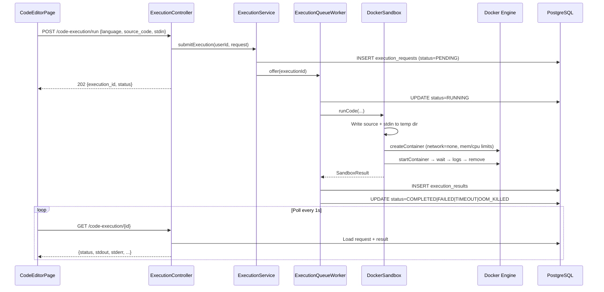
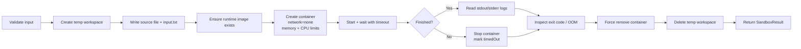

# Task: Complete Code Execution Sandbox

> **Status:** 🟢 Completed (Verified)  
> **Completed on:** 2026-08-29  
> **Owner module:** `com.devopssuite.execution`  
> **References:** `docs/05-lld-detailed-design.md` §5, `docs/04-api-design.md` §4, `docs/06-security-design.md` §7  
> **Prerequisite:** Docker Desktop running; backend container must have access to the Docker socket.

---

## 1. Goal

Deliver a **fully working, end-to-end code execution sandbox** where an authenticated user can:

1. Submit source code (Python, JavaScript, Java, C++) via REST.
2. Have the backend run it inside an **ephemeral, isolated Docker container** (no network, resource limits, timeout).
3. Poll for stdout, stderr, exit code, timing, timeout, and OOM status.
4. See results in the **Code Editor** page (`/projects/:id/code`).

When this task is done, a smoke test of `print("hello")` in Python must return `"hello\n"` with exit code `0` when the stack is running via `docker compose up`.

---

## 2. Problem Statement

The code execution module has **scaffolding in place** — entities, repositories, controller, async queue worker, and a `DockerSandbox` class — but several integration gaps prevent reliable execution, especially when the backend runs **inside Docker** (the default deployment path).

The original implementation was written for a **microservices layout** (`code-execution-service/`) and was partially migrated to the monolith without fixing Docker bind-mount paths, API path alignment, or terminal status semantics.

---

## 3. Current Implementation Inventory

### 3.1 Backend files (exist)

| File | Role |
|---|---|
| `execution/controller/ExecutionController.java` | REST endpoints — submit + poll |
| `execution/service/ExecutionService.java` | Validates language, persists request, enqueues job |
| `execution/service/ExecutionQueueWorker.java` | Background worker pool (4 threads), calls sandbox |
| `execution/sandbox/DockerSandbox.java` | Creates temp files, spins container, captures output |
| `execution/config/DockerConfig.java` | `DockerClient` bean (npipe on Windows, unix socket elsewhere) |
| `execution/dto/ExecutionDto.java` | Request/response DTOs with snake_case JSON aliases |
| `execution/model/` | `ExecutionRequest`, `ExecutionResult`, `Language` JPA entities |
| `execution/repository/` | JPA repositories for requests, results, languages |

### 3.2 Database (Flyway — done)

| Migration | Content |
|---|---|
| `V1__initial_schema.sql` | `languages`, `execution_requests`, `execution_results` tables; seeds `python`, `javascript` |
| `V2__add_java_cpp_languages.sql` | Seeds `java` (`eclipse-temurin:21-jdk-alpine`), `cpp` (`gcc:13-alpine`) |

### 3.3 Frontend (exist)

| File | Role |
|---|---|
| `frontend/src/api/codeExecutionApi.js` | `execute`, `getStatus`, `getHistory` API calls |
| `frontend/src/pages/CodeEditor/CodeEditorPage.jsx` | Monaco editor, language selector, polling, output panel |

### 3.4 Infrastructure (partial)

| Item | Status |
|---|---|
| Docker socket mount in `docker-compose.yml` | ✅ `/var/run/docker.sock:/var/run/docker.sock` |
| Shared temp volume for sandbox bind mounts | ❌ Missing |
| `DOCKER_HOST_TEMP_DIR` in `.env.example` | ✅ Documented but not wired in Compose |
| Runtime images pre-pulled | ❌ Pulled on first run (acceptable) |

---

## 4. Architecture (Target)



### Sandbox container lifecycle



---

## 5. Known Gaps & Bugs (Must Fix)

### 🔴 Critical — blocks execution in Docker Compose

| # | Issue | Location | Impact |
|---|---|---|---|
| C1 | **Stale temp directory path** uses microservice layout `backend/code-execution-service/temp/run_{id}` | `DockerSandbox.java:60` | Temp dir may not exist or bind-mount path is wrong inside container |
| C2 | **Bind-mount path mismatch** — files written inside backend container; sandbox containers need a **host-visible path** | `DockerSandbox.java:118-131` | Sandbox container starts with empty `/app` — code never runs |
| C3 | **No shared volume** between backend container and Docker daemon for temp files | `docker-compose.yml` | Required fix for C2 when backend runs in Docker |
| C4 | **`hostTempDir` logic is incomplete** — rewrites bind path but does not write files to that location | `DockerSandbox.java:119-122` | Even if env var is set, source files stay in wrong directory |

**Recommended fix for C1–C4:**

1. Change temp base to a single configurable path, e.g. `/tmp/devopssuite-sandbox` (inside container).
2. Add Compose volume:
   ```yaml
   volumes:
     - sandbox_temp:/tmp/devopssuite-sandbox
     - /var/run/docker.sock:/var/run/docker.sock
   ```
3. Set `DOCKER_HOST_TEMP_DIR` to the **host path** of that named volume, **or** use a bind mount:
   ```yaml
   - ./sandbox-temp:/tmp/devopssuite-sandbox
   ```
   with `DOCKER_HOST_TEMP_DIR=./sandbox-temp` (absolute path on host).
4. Write source files **and** bind using the same directory the Docker daemon can see.

### 🟡 High — functional correctness

| # | Issue | Location | Impact |
|---|---|---|---|
| H1 | Initial status is `PENDING`, docs/frontend expect `QUEUED` | `ExecutionService.java:50` | Confusing polling UX; docs mismatch |
| H2 | Timeout/OOM still saved as `COMPLETED` | `ExecutionQueueWorker.java:97-98` | Should set `TIMEOUT` or `OOM_KILLED` per API spec |
| H3 | `memoryUsedKb` always `0` | `ExecutionQueueWorker.java:90` | Dashboard/history show blank memory |
| H4 | **No `/code-execution/history` endpoint** | Frontend `codeExecutionApi.js:14` | User dashboard history calls will 404 |
| H5 | **API path mismatch for nginx deployment** — frontend uses `/api/code-execution/*` but controller maps `/code-execution` and `/api/v1/code-execution` | Controller + nginx | Broken when `VITE_API_URL=/api` (Docker frontend on port 80) |
| H6 | Language aliases missing — docs allow `python3`, `node`, `c++` | `ExecutionService.java:37` | Lookup fails for alias names |
| H7 | No source code size validation | Service layer | DoS via huge payloads |
| H8 | `docker.pool-size` in `application.yml` not used — worker hardcodes 4 threads | `ExecutionQueueWorker.java:35` | Config ignored |

### 🟢 Medium — security & polish (in scope if time permits)

| # | Issue | Location | Notes |
|---|---|---|---|
| M1 | Read-only filesystem not enforced on sandbox container | `DockerSandbox.java` | Security doc §7 specifies read-only FS |
| M2 | No seccomp / dropped capabilities | `DockerSandbox.java` | Nice-to-have hardening |
| M3 | No dedicated `ExecutionExceptionHandler` | — | IllegalArgumentException returns generic 500 |
| M4 | No rate limiting on execution endpoint | Security / Redis | FR-9 applies to REST endpoints |
| M5 | No unit/integration tests for execution module | `backend/src/test/` | Zero test files today |
| M6 | Backend Dockerfile runs as non-root `appuser` | `backend/Dockerfile:22` | Must ensure temp dir is writable by `appuser` |

---

## 6. API Contract (Canonical)

Align implementation and docs to **one** path set. Recommended:

| Method | Path | Auth | Description |
|---|---|---|---|
| `POST` | `/api/code-execution/run` | ✅ JWT | Submit code (also accept legacy `/code-execution/run` during transition) |
| `GET` | `/api/code-execution/{id}` | ✅ JWT | Poll result |
| `GET` | `/api/code-execution/history` | ✅ JWT | Paginated user execution history |

> **Note:** Match the frontend + nginx proxy convention (`/api/` prefix). Update `ExecutionController` `@RequestMapping` accordingly.

### POST request body

```json
{
  "language": "python",
  "source_code": "print('Hello World')",
  "stdin": "",
  "max_time_ms": 5000,
  "max_memory_mb": 256
}
```

Supports camelCase aliases via existing `@JsonAlias` on DTOs.

### POST response (202 Accepted)

```json
{
  "status": "success",
  "message": "Execution request accepted",
  "data": {
    "execution_id": "uuid",
    "status": "QUEUED"
  }
}
```

### GET response (terminal states)

```json
{
  "status": "success",
  "data": {
    "execution_id": "uuid",
    "status": "COMPLETED",
    "stdout": "Hello World\n",
    "stderr": "",
    "exit_code": 0,
    "execution_time_ms": 342,
    "memory_used_kb": 8192,
    "timed_out": false,
    "oom_killed": false
  }
}
```

### Status enum (normalize everywhere)

| Status | When |
|---|---|
| `QUEUED` | Request persisted, waiting for worker |
| `RUNNING` | Worker picked up, container starting |
| `COMPLETED` | Finished; check `exit_code` for user code errors |
| `FAILED` | Engine/infrastructure failure |
| `TIMEOUT` | Exceeded `max_time_ms` |
| `OOM_KILLED` | Exceeded memory limit |

User code that throws or exits non-zero → still `COMPLETED` with `exit_code != 0` (LeetCode-style semantics).

---

## 7. Supported Languages

| Key(s) | Docker image | Source file | Run command |
|---|---|---|---|
| `python`, `python3` | `python:3.12-alpine` | `code.py` | `python3 /app/code.py < /app/input.txt` |
| `javascript`, `node` | `node:24-alpine` | `code.js` | `node /app/code.js < /app/input.txt` |
| `java` | `eclipse-temurin:21-jdk-alpine` | `Main.java` | `javac /app/Main.java && java -cp /app Main < /app/input.txt` |
| `cpp`, `c++` | `gcc:13-alpine` | `code.cpp` | `g++ -O3 /app/code.cpp -o /app/program && /app/program < /app/input.txt` |

Limits (defaults from DB):

| Language | Max time | Max memory |
|---|---|---|
| python, javascript | 5000 ms | 256 MB |
| java, cpp | 10000 ms | 512 / 256 MB |

Sandbox hard limits (always applied in `DockerSandbox`):

- **Network:** `none`
- **CPU:** 1 core (`nanoCPUs = 1_000_000_000`)
- **Memory + swap:** equal (no swap escape)
- **Timeout:** from request or language default

---

## 8. Implementation Plan (Step-by-Step)

### Phase A — Fix Docker sandbox path (unblocks everything)

- [ ] **A1.** Add config property `docker.sandbox-temp-dir` (default `/tmp/devopssuite-sandbox`) in `application.yml`.
- [ ] **A2.** Refactor `DockerSandbox` to use configured temp dir instead of `backend/code-execution-service/temp/`.
- [ ] **A3.** Fix bind-mount logic: write files to the path that the Docker daemon resolves on the host.
- [ ] **A4.** Update `docker-compose.yml`:
  - Add bind mount `./sandbox-temp:/tmp/devopssuite-sandbox`
  - Set env `DOCKER_HOST_TEMP_DIR` to the absolute host path (or document that operators must set it)
  - Add `sandbox-temp/` to `.gitignore`
- [ ] **A5.** Ensure `DockerConfig` uses `unix:///var/run/docker.sock` when running inside Linux container (already the case when `os.name` is Linux).
- [ ] **A6.** Ensure temp dir is created with correct permissions for `appuser` in Dockerfile (e.g. `RUN mkdir -p /tmp/devopssuite-sandbox && chown appuser:appgroup ...` before `USER appuser`).

### Phase B — API alignment

- [ ] **B1.** Update `ExecutionController` base path to `/api/code-execution` (keep old paths as aliases temporarily if needed).
- [ ] **B2.** Change initial status from `PENDING` → `QUEUED` in `ExecutionService`.
- [ ] **B3.** Map language aliases in service layer (`python3` → `python`, `node` → `javascript`, `c++` → `cpp`).
- [ ] **B4.** Add input validation:
  - Max source code length (e.g. 64 KB)
  - Max stdin length (e.g. 16 KB)
  - Reject disabled languages
  - Clamp `max_time_ms` / `max_memory_mb` to language ceiling
- [ ] **B5.** Add `ExecutionExceptionHandler` returning 400 for bad language/payload, 404 for unknown execution ID.

### Phase C — Worker correctness

- [ ] **C1.** Set terminal status based on sandbox result:
  ```java
  if (sandboxResult.timedOut) status = "TIMEOUT";
  else if (sandboxResult.oomKilled) status = "OOM_KILLED";
  else if (sandboxResult.exitCode != 0 && sandboxResult.stderr.startsWith("System error:")) status = "FAILED";
  else status = "COMPLETED";
  ```
- [ ] **C2.** Wire `docker.pool-size` from `application.yml` to worker thread count (replace hardcoded `4`).
- [ ] **C3.** Optionally read memory from container inspect stats (or leave `memoryUsedKb` null until implemented — document decision).

### Phase D — History endpoint

- [ ] **D1.** Add `GET /api/code-execution/history?page=&size=` to `ExecutionController`.
- [ ] **D2.** Implement in `ExecutionService` — return current user's recent executions (join request + result + language name).
- [ ] **D3.** Verify `UserDashboard` / metrics user-summary consumes the same data shape (or reuse existing metrics endpoint if already populated).

### Phase E — Frontend verification

- [ ] **E1.** Confirm `VITE_API_URL` is `http://localhost:8081` for local dev (direct to backend, no `/api` prefix) **or** update paths if using `/api` prefix consistently.
- [ ] **E2.** Handle all terminal statuses in `CodeEditorPage` polling (`TIMEOUT`, `OOM_KILLED`, not just `COMPLETED`/`FAILED`).
- [ ] **E3.** Show `RUNNING` / `QUEUED` state in output panel while polling.

### Phase F — Security hardening (recommended)

- [ ] **F1.** Add read-only root FS on sandbox container: `.withReadonlyRootfs(true)` with tmpfs for `/tmp` if compilers need it.
- [ ] **F2.** Add Redis rate limit for `POST /api/code-execution/run` (e.g. 10 req/min per user).
- [ ] **F3.** Audit log execution events (user id, language, duration, status) via existing logging pipeline.

### Phase G — Tests

- [ ] **G1.** Unit test: `ExecutionService` language validation and alias mapping.
- [ ] **G2.** Unit test: status resolution logic in worker (mock `DockerSandbox`).
- [ ] **G3.** Integration test (optional, requires Docker): submit Python hello-world, poll until terminal, assert stdout.
- [ ] **G4.** Manual smoke test checklist (Section 10).

### Phase H — Documentation sync

- [ ] **H1.** Update `docs/04-api-design.md` §4 paths to `/api/code-execution/*`.
- [ ] **H2.** Update `docs/dev-guide/backend-status.md` execution section with accurate status.
- [ ] **H3.** Mark task complete in `.agents/TASKS.md` and `.agents/MEMORY.md`.

---

## 9. File Change Checklist

| File | Action |
|---|---|
| `execution/sandbox/DockerSandbox.java` | Fix temp path, bind mount, optional read-only FS |
| `execution/config/DockerConfig.java` | Optional: read `DOCKER_HOST` env for custom socket |
| `execution/config/ExecutionProperties.java` | **New** — `@ConfigurationProperties` for pool size, temp dir, max code size |
| `execution/service/ExecutionService.java` | QUEUED status, aliases, validation, history query |
| `execution/service/ExecutionQueueWorker.java` | Terminal status logic, configurable pool size |
| `execution/controller/ExecutionController.java` | Path alignment, history endpoint |
| `execution/controller/ExecutionExceptionHandler.java` | **New** — 400/404 responses |
| `backend/src/main/resources/application.yml` | `docker.sandbox-temp-dir`, document properties |
| `backend/Dockerfile` | Create writable sandbox temp dir for `appuser` |
| `docker-compose.yml` | Sandbox temp volume + env vars |
| `.env.example` | Document `DOCKER_HOST_TEMP_DIR` with Compose example |
| `.gitignore` | Add `sandbox-temp/` |
| `frontend/src/pages/CodeEditor/CodeEditorPage.jsx` | Handle all terminal statuses |
| `docs/04-api-design.md` | Sync API paths and status enum |

---

## 10. Manual Test Checklist

Run with:

```bash
docker compose up -d postgres redis backend
cd frontend && npm run dev
```

Ensure Docker Desktop is running.

### 10.1 Python smoke test

1. Log in at `http://localhost:5173`.
2. Open Code Editor for any project.
3. Select **Python 3**, code: `print("hello")`, empty stdin.
4. Click **Run Code**.
5. **Expected:** stdout `hello\n`, exit code `0`, status `COMPLETED`, time < 10s.

### 10.2 Stdin test

Code:

```python
import sys
print(sys.stdin.read().strip())
```

Stdin: `world`

**Expected:** stdout `world\n`.

### 10.3 Timeout test

Code:

```python
import time
time.sleep(30)
```

With `max_time_ms: 5000`.

**Expected:** status `TIMEOUT`, `timed_out: true`.

### 10.4 Java compile-and-run

Use default `Main.java` template.

**Expected:** `Hello from DevOps Suite!` on stdout.

### 10.5 JavaScript

```javascript
console.log("Hello from DevOps Suite!");
```

**Expected:** stdout matches template.

### 10.6 C++

Use default template.

**Expected:** `Hello from DevOps Suite!` on stdout.

### 10.7 Error handling

Code: `print(undefined_variable)` (Python).

**Expected:** status `COMPLETED`, non-zero exit code, stderr contains `NameError`.

### 10.8 Auth guard

`curl -X POST http://localhost:8081/api/code-execution/run` without token.

**Expected:** `401 Unauthorized`.

### 10.9 Docker failure mode

Stop Docker Desktop, submit run.

**Expected:** status `FAILED`, stderr explains sandbox unavailable (not a silent hang).

---

## 11. Acceptance Criteria

This task is **done** when all of the following are true:

- [ ] Python, JavaScript, Java, and C++ hello-world programs execute successfully via the UI.
- [ ] Backend running in Docker Compose can create sandbox containers and read their output.
- [ ] API paths work for both local dev (`localhost:8081`) and nginx-proxied frontend (`/api/` prefix).
- [ ] Status lifecycle uses `QUEUED → RUNNING → COMPLETED|FAILED|TIMEOUT|OOM_KILLED`.
- [ ] Execution history endpoint returns data (or frontend updated to use an existing metrics endpoint — document which).
- [ ] Temp workspace is always cleaned up (no orphaned dirs after 10 runs).
- [ ] Sandbox containers are always removed (verify with `docker ps -a` after tests).
- [ ] At least one unit test covers `ExecutionService` validation.
- [ ] Manual test checklist (Section 10) passes.

---

## 12. Out of Scope (This Task)

- Adding new languages (Go, Rust) — stretch goal in `TASKS.md`
- WebSocket push for execution completion (polling is sufficient for MVP)
- Kubernetes deployment of sandbox workers
- Parallel execution per user beyond configured pool size

---

## 13. Environment Variables

| Variable | Default | Purpose |
|---|---|---|
| `DOCKER_HOST_TEMP_DIR` | _(empty)_ | Host path for sandbox bind mounts when backend runs in Docker |
| `docker.sandbox-temp-dir` | `/tmp/devopssuite-sandbox` | In-container path for writing source files |
| `docker.pool-size` | `10` | Max concurrent sandbox worker threads |
| `docker.timeout` | `300000` | Global timeout ceiling (ms) — enforce upper bound in validation |

---

## 14. Risk Notes

| Risk | Mitigation |
|---|---|
| Docker-in-Docker bind mounts are OS-specific | Use documented `./sandbox-temp` bind mount for local dev; test on Windows (Docker Desktop) and Linux |
| First run pulls large images (Java, GCC) | Document required images; optional `docker compose` init service to pre-pull |
| Malicious code in sandbox | Network disabled + memory/CPU limits; never mount Docker socket into sandbox containers |
| Alpine musl vs glibc for some languages | Current images are Alpine-based; switch to `-slim` Debian if compatibility issues arise |

---

## 15. Quick Reference — Existing Code Entry Points

```
Submit:  ExecutionController.execute()     → ExecutionService.submitExecution()
Worker:  ExecutionQueueWorker.processRequest() → DockerSandbox.runCode()
Poll:    ExecutionController.getResult()   → ExecutionService.getResult()
```

Language lookup: `LanguageRepository.findByNameIgnoreCase(name)` — extend for aliases.

Docker client bean: `DockerConfig.dockerClient()` — socket at `/var/run/docker.sock` inside backend container.
