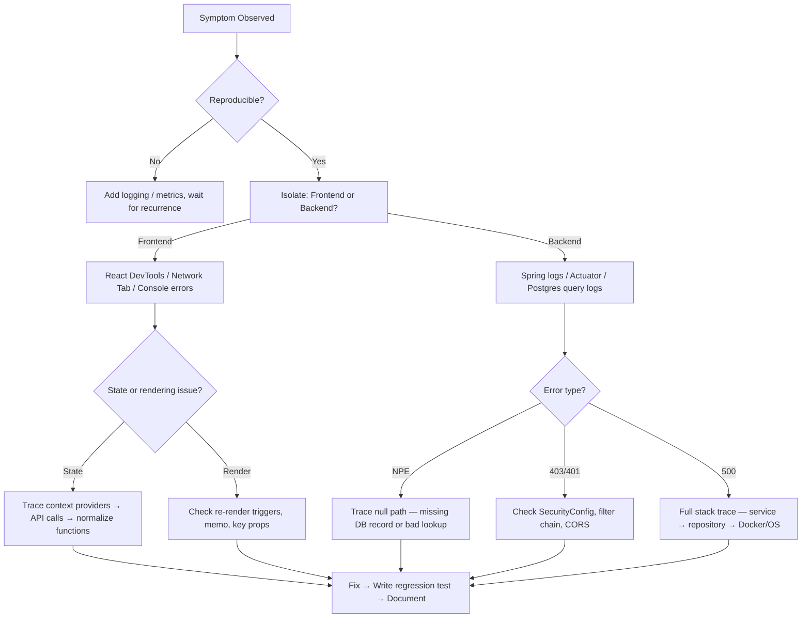
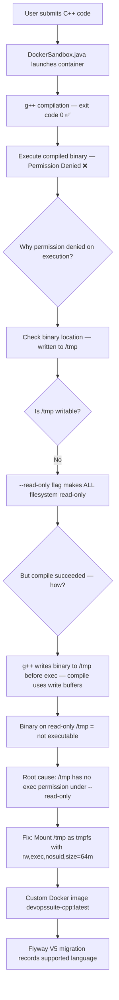
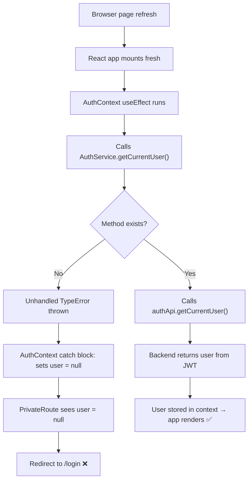
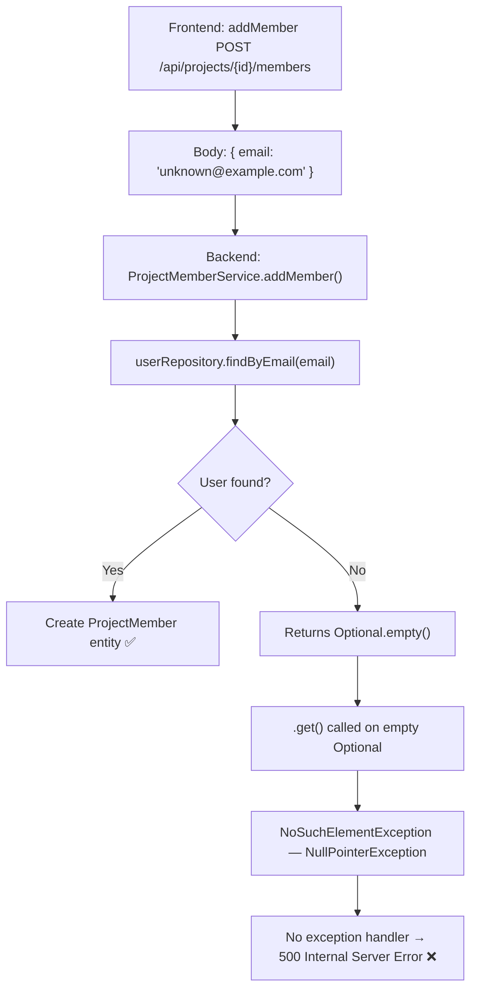
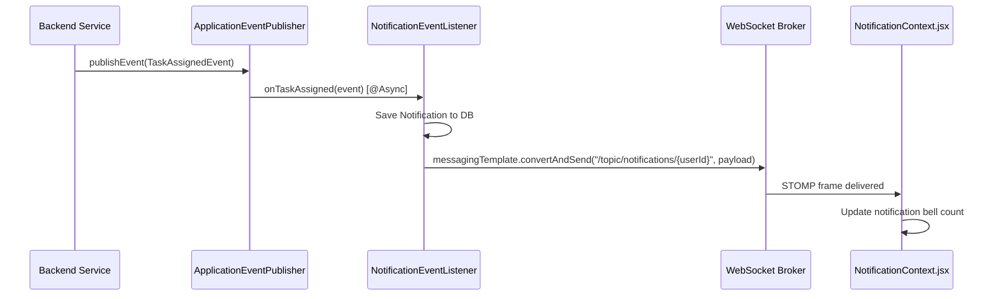
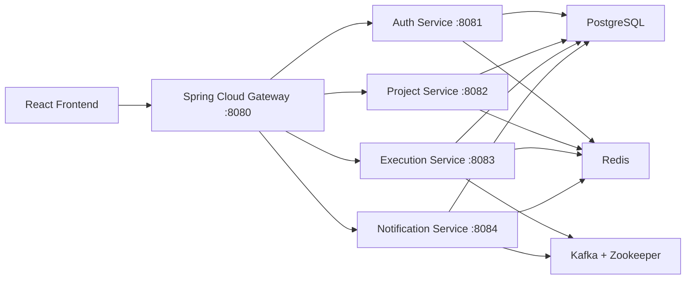
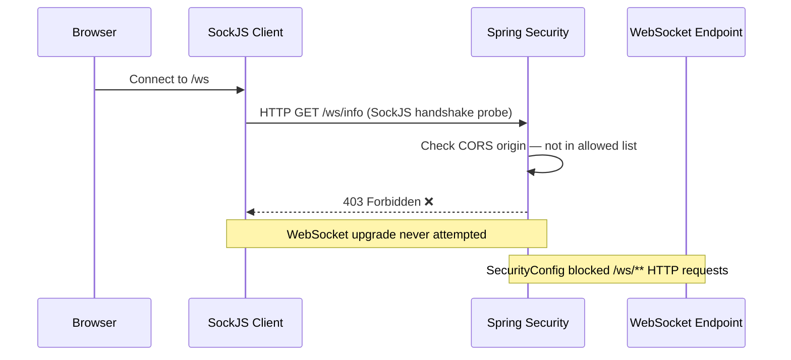
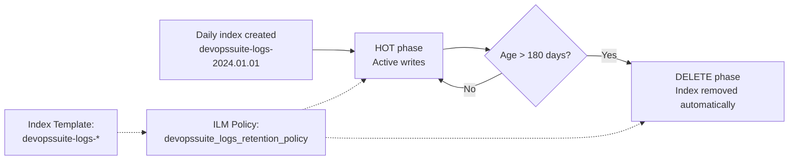
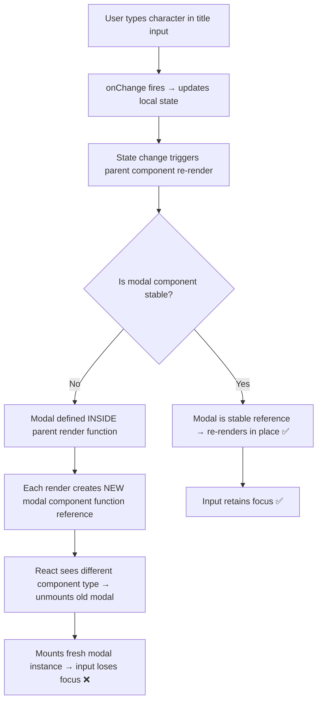

# DevOps Suite — Real Bugs, Architectural Challenges & Solutions

> **Interview Knowledge Base | Module: 01-project-overview**
> This document covers the **real debugging and architectural challenges** encountered during the DevOps Suite project.
> These are among the most compelling interview talking points — they demonstrate problem-solving depth, not just feature delivery.

---

## Table of Contents

1. [C++ Execution in Read-Only Docker Container](#challenge-1-c-execution-in-read-only-docker-container)
2. [Page Reload Login Redirect Bug](#challenge-2-page-reload-login-redirect-bug)
3. [Add Member by Email / 500 Error](#challenge-3-add-member-by-email--unregistered-user-500-error)
4. [Real-Time Notifications Never Delivered — snake_case Bug](#challenge-4-real-time-notifications-never-delivered--snake_case-bug)
5. [Architecture Pivot — Microservices → Monolith](#challenge-5-architecture-pivot--microservices--monolith)
6. [WebSocket STOMP 403 / CORS Failure](#challenge-6-websocket-stomp-403--cors-failure)
7. [Elasticsearch Log Accumulation / Disk Growth](#challenge-7-elasticsearch-log-accumulation--disk-growth)
8. [Task Modal Input Focus Loss](#challenge-8-task-modal-input-focus-loss)
9. [Quick Reference](#quick-reference)

---

## Debugging Mindset Overview

Before diving into individual challenges, here is the general debugging philosophy applied throughout this project:



---

## Challenge 1: C++ Execution in Read-Only Docker Container

> **Severity:** 🔴 Advanced | **Category:** Infrastructure / Docker / Code Execution

### Background

The code execution sandbox runs user code inside ephemeral Docker containers with strict security flags:

```
--network=none --read-only --memory=256m --cpus=1
```

Python, JavaScript, and Java all worked fine. C++ did not.

---

### Interview Q&A

#### Q1 🟢 What languages does your code execution sandbox support?

**A:** The sandbox supports Python, JavaScript, Java, and C++. Each runs inside an ephemeral Docker container launched by `DockerSandbox.java`. The containers are isolated with `--network=none` (no internet access), `--read-only` (immutable filesystem), `--memory=256m`, `--cpus=1`, and a 30-second execution timeout enforced via `ExecutionQueueWorker.java`.

---

#### Q2 🔴 What was the hardest debugging challenge in this project?

**A:** Without doubt, the C++ execution failure in the read-only sandbox. Here is the full story:

**Symptom:** When a user submitted C++ code, the compile step succeeded — `g++` returned exit code 0 — but the execution step returned *Permission Denied* and the code never ran.

**Investigation path:**



**Root Cause:** The `--read-only` flag in Docker makes the **entire** container filesystem read-only, including `/tmp`. The `g++` compiler writes the compiled binary to `/tmp` by default. Even though the compilation succeeded (the write to `/tmp` succeeded via kernel buffer), the resulting binary file lacked the `exec` permission because `/tmp` was mounted read-only.

**Fix — Three-part solution:**

1. **Custom Docker image** (`devopssuite-cpp:latest`): Built a dedicated image for C++ with `g++` pre-installed and the correct base OS libraries.

2. **tmpfs mount for `/tmp`**: In `DockerSandbox.java`, the container launch command was updated to add:
   ```java
   "--mount", "type=tmpfs,destination=/tmp,tmpfs-options=rw,exec,nosuid,size=64m"
   ```
   This mounts `/tmp` as an in-memory tmpfs filesystem that is **writable and executable** while the rest of the container remains `--read-only`.

3. **Flyway V5 migration**: Added a database migration to record `cpp` as a supported language in the `execution_languages` table so the frontend language selector and backend validator both recognized C++.

**The key insight:** `--read-only` does not mean "the container can't write at all" — tmpfs mounts are explicitly excluded and can have their own permissions. This is a standard Docker pattern for secure sandboxes.

---

#### Q3 🔴 Why not just remove `--read-only` for C++?

**A:** That would defeat the entire security purpose of the sandbox. The `--read-only` flag prevents malicious code from:
- Persisting files that survive container teardown
- Modifying container binaries to escalate privilege
- Writing to shared mounts

Removing it would open the door to container escape vectors. The targeted tmpfs mount for `/tmp` is the correct surgical fix — it gives the compiler exactly what it needs (a writable, executable scratch space) without compromising the overall security model.

---

#### Q4 ⚫ What other security constraints does your Docker sandbox enforce, and why?

**A:**

| Flag | Purpose |
|---|---|
| `--network=none` | Prevents code from making external HTTP calls, exfiltrating data, or mining crypto |
| `--read-only` | Prevents filesystem persistence and binary tampering |
| `--memory=256m` | Prevents memory exhaustion / DoS on the host |
| `--cpus=1` | Limits CPU consumption — prevents fork bombs from hogging the host |
| 30s timeout | Enforced by `ExecutionQueueWorker.java` via `Future.get(30, TimeUnit.SECONDS)` — prevents infinite loops |
| Ephemeral container | Container is removed (`--rm`) after execution — no state leaks between runs |
| Custom images | Pre-built images per language prevent runtime package installation |

Together these form a **defense-in-depth** model: even if one layer fails, others contain the damage.

---

#### Lessons Learned

- Always test security flags (especially `--read-only`) with **every supported runtime**, not just the first one that works.
- "Compilation succeeds" ≠ "execution will succeed" — the two steps have different filesystem requirements.
- tmpfs is the standard Docker pattern for giving read-only containers a writable scratch space.
- Custom Docker images per language give you full control over the execution environment without relying on `apt-get` at runtime.

---

## Challenge 2: Page Reload Login Redirect Bug

> **Severity:** 🟡 Intermediate | **Category:** Frontend / State Management / Auth

### Background

Authentication in the DevOps Suite frontend is managed by `AuthContext.jsx`, which initializes by checking whether a logged-in user session exists. A subtle missing method caused every page refresh to silently log out the user.

---

### Interview Q&A

#### Q1 🟢 How does your frontend manage authentication state?

**A:** Authentication is managed centrally in `AuthContext.jsx`. On mount, it calls `AuthService.getCurrentUser()` to check if a valid session exists (JWT stored in localStorage/cookie). If the call succeeds, the user is stored in context state and the app renders normally. If it fails or returns null, the context marks the user as unauthenticated and route guards redirect to `/login`. All protected routes consume `AuthContext` via the `useAuth()` hook.

---

#### Q2 🟡 Tell me about a subtle state management bug you had to debug.

**A:** The page reload redirect bug was a classic "works when I navigate but breaks on refresh" issue.

**Symptom:** Every time the user refreshed the browser, they were silently redirected to `/login` — even if they had just logged in seconds before. Navigation within the app worked perfectly.

**Debugging process:**



**Root Cause:** `AuthService.getCurrentUser()` was referenced in `AuthContext.jsx` but the method body was never implemented in `AuthService.js`. The function either didn't exist or had an empty body. When called on page load, it threw a `TypeError` (or returned `undefined`), which the `AuthContext` initialization `try/catch` block caught, treated as "not authenticated," and set `user = null`.

**Why navigation worked:** Client-side navigation (React Router `<Link>` or `navigate()`) doesn't re-mount the app — `AuthContext` is already initialized with the correct user from the initial login. Only a full browser reload triggers the `useEffect` initialization again.

**Fix:** Implemented `AuthService.getCurrentUser()` to call `authApi.getCurrentUser()`, which sends a `GET /api/auth/me` request with the stored JWT. The backend (`JwtRequestFilter.java`) validates the token and returns the user details. The response is normalized and stored in context.

```javascript
// AuthService.js — the missing implementation
getCurrentUser: async () => {
  try {
    const response = await authApi.getCurrentUser(); // GET /api/auth/me
    return response.data;
  } catch (error) {
    return null; // token expired or invalid — user logs in again
  }
}
```

---

#### Q3 🟡 How would you prevent this class of bug — calling a method that doesn't exist — in the future?

**A:** Several strategies:

1. **TypeScript:** Defining interface contracts for service objects means the compiler catches missing methods at build time, not at runtime in production.
2. **Unit tests for context initialization:** A test that mocks `AuthService.getCurrentUser()` to return a user and verifies the context state would catch a missing method immediately.
3. **Integration/E2E tests:** A Cypress or Playwright test that logs in, refreshes the page, and asserts the user is still authenticated — this is the exact scenario that was failing.
4. **Linting rules:** ESLint with appropriate plugins can catch referenced-but-undefined identifiers in many cases.

The deeper lesson: **test the refresh/mount lifecycle explicitly**. It behaves differently from SPA navigation and is a common source of auth bugs.

---

#### Lessons Learned

- Always test page reload, not just navigation, when validating authentication flows.
- Auth context initialization errors should be surfaced visibly (console.error at minimum) so they don't silently log out users.
- The "works when navigating" pattern is a strong signal that the issue is in the **mount lifecycle**, not the business logic.

---

## Challenge 3: Add Member by Email / Unregistered User 500 Error

> **Severity:** 🟡 Intermediate | **Category:** Backend Error Handling / UX Design

### Background

Project owners can add team members to their projects. The intended UX was to add members by email address. The backend blew up when the email didn't exist in the database.

---

### Interview Q&A

#### Q1 🟢 How does your project membership system work?

**A:** Projects have a `ProjectMember` entity linking `Project` and `User` with an RBAC role (`OWNER`, `ADMIN`, `MEMBER`, `VIEWER`). Owners and admins can add members via the project settings UI. The backend resolves the user by the provided identifier, creates the `ProjectMember` record, and fires a `PROJECT_JOINED` notification event.

---

#### Q2 🟡 How did you handle UX for inviting people who aren't on the platform yet?

**A:** This evolved from a bug. The original backend only accepted a `userId` (UUID) to add a member. The frontend sent an email address for usability reasons (users know emails, not UUIDs). Here is what happened:

**Symptom:** HTTP 500 Internal Server Error when adding a member by email that wasn't registered.

**Root Cause Trace:**



**Backend Fix:** Added explicit email-based user resolution with a proper `404 Not Found` response:

```java
// ProjectMemberService.java
public ProjectMemberResponse addMemberByEmail(Long projectId, String email) {
    User user = userRepository.findByEmail(email)
        .orElseThrow(() -> new ResourceNotFoundException(
            "No registered user found with email: " + email
        ));
    // ... create ProjectMember
}
```

The `ResourceNotFoundException` is handled by a `@ControllerAdvice` `GlobalExceptionHandler` that returns `404` with a structured error body.

**Frontend UX Fix:** The frontend catches the `404` and shows an **invitation modal** instead of a generic error:

```
"This email address is not registered on DevOps Suite.
Would you like to send them an invitation?"
[Send Invitation Email] [Cancel]
```

The "Send Invitation Email" button opens the user's mail client with a `mailto:` link pre-filled with an invitation message and the platform URL. This is a pragmatic solution for a portfolio project — a production system would use a backend-sent invitation email with a token.

---

#### Q3 🔴 What would a production-grade email invitation flow look like?

**A:** In a production system:

1. `POST /api/projects/{id}/invite` with `{ email: "..." }` — backend creates a pending `ProjectInvitation` record with a signed UUID token and expiry (e.g., 7 days).
2. Backend sends an email via SES/SendGrid with a link: `https://app.devopssuite.com/invite/accept?token=<uuid>`.
3. If the user isn't registered, the link takes them to a sign-up page that pre-fills their email.
4. On accept, the invitation is validated (token not expired, project still exists), the `ProjectMember` record is created, and the invitation is marked accepted.
5. The invitation email uses a Thymeleaf or Freemarker template.

For the portfolio project, the `mailto:` approach demonstrates understanding of the UX problem without needing an SMTP server.

---

#### Q4 🟡 What is a `@ControllerAdvice` and how did it factor into this bug?

**A:** `@ControllerAdvice` is a Spring annotation that defines a class whose `@ExceptionHandler` methods apply **globally** across all controllers. Without it, uncaught exceptions bubble up as 500 errors with a Spring default error body. With it, you can map specific exception types to HTTP responses:

```java
@ControllerAdvice
public class GlobalExceptionHandler {

    @ExceptionHandler(ResourceNotFoundException.class)
    public ResponseEntity<ErrorResponse> handleNotFound(ResourceNotFoundException ex) {
        return ResponseEntity.status(404).body(new ErrorResponse(ex.getMessage()));
    }
}
```

The bug existed because the original code called `.get()` on an empty `Optional` — throwing `NoSuchElementException` — and there was no handler for it, so Spring defaulted to 500. The fix added both the proper `orElseThrow()` with a semantic exception type AND the global handler for it.

---

#### Lessons Learned

- Never call `.get()` on an `Optional` without a guard — always use `orElseThrow()` with a meaningful exception.
- 500 errors from missing records are always a backend bug — the correct status is 404.
- UX design for "user not found" should degrade gracefully into an invitation flow, not just show an error.
- `@ControllerAdvice` is essential — add it early in a project so all future service exceptions map to correct HTTP responses.

---

## Challenge 4: Real-Time Notifications Never Delivered — snake_case Bug

> **Severity:** 🔴 Advanced | **Category:** Frontend/Backend Contract / WebSocket / Serialization

### Background

One of the most subtle bugs in the project. The entire notification pipeline — STOMP subscription, Spring event publishing, WebSocket delivery — was working correctly. Notifications were saved to the database. But they **never appeared in the UI**. The root cause was a single field name mismatch.

---

### Interview Q&A

#### Q1 🟢 How do real-time notifications work in your system?

**A:** The notification pipeline has several stages:



The frontend `NotificationContext.jsx` subscribes to `/topic/notifications/{userId}` on mount. When a STOMP message arrives, it updates the notification count and adds it to the notifications list.

---

#### Q2 🔴 Have you faced issues with API contract mismatches between frontend and backend?

**A:** Yes — this was the most insidious bug in the entire project. Everything in the pipeline worked, but notifications never arrived in the UI.

**Symptom:** Task assignment notifications appeared in the `notifications` database table. `NotificationEventListener.java` was triggered and called `messagingTemplate.convertAndSend()`. The WebSocket broker received the message. But the browser UI never updated — the bell icon stayed at zero.

**Debugging process:**



```mermaid
flowchart TD
    A["Notification saved to DB ✅"] --> B["NotificationEventListener.java fires ✅"]
    B --> C["messagingTemplate.convertAndSend called ✅"]
    C --> D{"STOMP message delivered to browser?"}
    D -- Check browser WS frames --> E["Frame delivered to browser ✅"]
    E --> F{"NotificationContext subscription active?"}
    F -- Check useEffect --> G["stompClient.subscribe('/topic/notifications/{userId}')"]
    G --> H{"What is userId here?"}
    H --> I["user?.userId from AuthContext"]
    I --> J{"Is user.userId defined?"}
    J -- Console log --> K["user.userId = undefined ❌"]
    K --> L{"Where does user come from?"}
    L --> M["AuthContext → authApi.getCurrentUser() → normalizeUser()"]
    M --> N["normalizeUser() maps API response fields"]
    N --> O{"What does API return?"}
    O -- Network tab --> P["Response: { user_id: 'abc-123', ... }"]
    P --> Q{"Does normalizeUser() map user_id → userId?"}
    Q -- Code inspection --> R["normalizeUser() maps only camelCase fields ❌"]
    R --> S["user.userId = undefined → topic = '/topic/notifications/undefined'"]
    S --> T["STOMP subscribed to wrong topic — messages never arrive ❌"]
    T --> U["Fix: userId: user.userId ?? user.user_id ?? null in normalizeUser()"]
```

**Root Cause — Three-layer mismatch:**

1. **Backend `AuthDto.UserResponse`** had `@JsonProperty("user_id")` on the `userId` field → serialized as `user_id` in JSON.
2. **`normalizeUser()` in `authApi.js`** mapped the API response to a frontend user object but didn't account for `user_id` — it expected `userId` (camelCase).
3. **`NotificationContext.jsx`** used `user?.userId` to build the subscription topic. Because `userId` was `undefined`, the subscription was either never registered or registered to `/topic/notifications/undefined`.

**Fix — Single line in `authApi.js`:**

```javascript
// authApi.js — normalizeUser()
const normalizeUser = (user) => ({
  ...user,
  userId: user.userId ?? user.user_id ?? null,  // ← the fix
  // ... other field mappings
});
```

**Why it was so hard to find:**
- The subscription silently registered to the wrong topic — no error thrown.
- The DB had correct records — looked like delivery was working.
- The WebSocket frame was delivered — the broker was fine.
- The failure was entirely in the topic string construction, which depended on a single undefined field.

---

#### Q3 ⚫ How would you prevent this class of API contract mismatch at scale?

**A:** Several approaches:

| Approach | Description | Tradeoff |
|---|---|---|
| **TypeScript + generated types** | Generate TypeScript interfaces from OpenAPI spec | Catches mismatches at compile time |
| **OpenAPI/Swagger contract tests** | Consumer-driven contract tests (Pact) | Tests the actual serialization |
| **Consistent naming convention** | Remove `@JsonProperty` snake_case overrides; use `spring.jackson.property-naming-strategy=CAMEL_CASE` globally | Simpler but requires API versioning discipline |
| **Normalization tests** | Unit tests for `normalizeUser()` covering both `user_id` and `userId` shapes | Catches the exact bug that occurred |
| **Logging on subscription** | Log the exact topic string when subscribing in `NotificationContext` | Makes silent wrong-topic bugs visible immediately |

In this project, the pragmatic fix was the `??` fallback in `normalizeUser()`. In production, I'd add contract tests and enforce a consistent casing strategy server-wide.

---

#### Q4 🟡 What STOMP topics does your system use?

**A:** Three topics:

| Topic Pattern | Purpose | Publisher |
|---|---|---|
| `/topic/notifications/{userId}` | Personal notifications (task assigned, role changed, etc.) | `NotificationEventListener.java` |
| `/topic/logs/{projectId}` | Real-time code execution log streaming | `ExecutionService.java` |
| `/topic/tasks/{projectId}` | Kanban board task state changes | Task service layer |

The `StompAuthChannelInterceptor.java` validates the JWT on the CONNECT frame before any subscription is allowed.

---

#### Lessons Learned

- Always log the **exact topic string** used for STOMP subscriptions — silent wrong-topic subscriptions are invisible.
- `??` (nullish coalescing) fallbacks in normalization functions are defensive but mask API contract drift.
- The real fix is **consistency**: either always camelCase from the backend or always snake_case on the frontend — never mix.
- When debugging "feature X doesn't work" and logs show it worked at every layer, the bug is almost always in **the glue code between layers** — normalization, mapping, or transformation functions.

---

## Challenge 5: Architecture Pivot — Microservices → Monolith

> **Severity:** ⚫ Expert | **Category:** Architecture / Engineering Trade-offs

### Background

The project began with a microservices architecture. It was abandoned in favor of a monolith. This is arguably the **most important talking point** for senior-level interviews.

---

### Interview Q&A

#### Q1 🟢 Is your backend a microservices or monolith architecture?

**A:** It's a **monolith** — a single Spring Boot 3.x application under the `com.devopssuite` package, running on port 8082. All features (auth, projects, tasks, code execution, notifications, IDE) are co-located in one deployable JAR. This was a deliberate decision made after an architecture pivot mid-project.

---

#### Q2 ⚫ Have you ever made a major architectural pivot mid-project? What drove it?

**A:** Yes — from microservices to a monolith. Here is the full story:

**Original architecture:**



**Problems encountered:**

| Problem | Impact |
|---|---|
| `docker-compose up` took **5+ minutes** | Killed the inner dev loop — every code change required waiting |
| Kafka + Zookeeper needed 3-4 GB RAM minimum | Exceeded laptop RAM; other apps couldn't run alongside |
| Constant port conflicts between services | Lost 30-60 min per session to `port already in use` errors |
| Inter-service HTTP calls needed service discovery | Added Spring Cloud Eureka as another component |
| Each service had its own Spring Security config | JWT validation duplicated across 4 services |
| Cross-service transactions were impossible | Data consistency required distributed transaction patterns (Saga) |
| Debugging required tailing 4 log streams simultaneously | Made simple bugs take 4× longer to track down |

**Decision to pivot:** After ~3 weeks, the overhead of the distributed system was consuming more time than feature development. For a **portfolio project** demonstrating developer productivity tooling, the irony of an unproductive dev environment was untenable.

**Pivot approach:**
1. Merged all service source trees into a single Maven module under `com.devopssuite`
2. Replaced Kafka `@KafkaListener` event consumers with Spring `ApplicationEventPublisher` + `@EventListener` (`@Async`)
3. Removed Spring Cloud Gateway — frontend calls go directly to backend at `:8082`
4. Removed Eureka service discovery
5. Unified `SecurityConfig.java` for the entire application

**Result:**
- `docker-compose up` time: 5+ min → **~45 seconds**
- RAM footprint: 4-6 GB → **~1.5 GB**
- Zero port conflicts
- Single log stream
- Full ACID transactions across all domain operations

---

#### Q3 🔴 What did you lose by moving to a monolith? Was it worth it?

**A:** Trade-offs honestly assessed:

**Lost:**
- Independent deployability of services (e.g., scaling execution service separately)
- Fault isolation (one bug in any module can crash everything)
- Technology heterogeneity (all modules must use the same Spring Boot version)
- Kafka's durability guarantees — events can be lost if the process crashes between publish and listener

**Gained:**
- Drastically faster development velocity
- Simpler mental model — one codebase, one config, one log stream
- In-process Spring Events are synchronous-first (with `@Async` for non-critical paths) — simpler reasoning
- Full ACID transactions across domain boundaries
- Easier debugging

**Was it worth it?** Yes — unequivocally for a portfolio project of this scale. The microservices architecture is appropriate when:
- Teams are large enough to own individual services independently
- Services genuinely need to scale at different rates
- Release cadences differ between domains
- The operational maturity (monitoring, service mesh, CI/CD per service) is already in place

None of those conditions applied here. The monolith is not a compromise — it's the **correct architecture** for this scale. Sam Newman (author of *Building Microservices*) and Martin Fowler both advocate starting with a monolith and extracting services only when specific pain points emerge ("MonolithFirst" pattern).

---

#### Q4 🟡 How did you replace Kafka with Spring Events? What are the trade-offs?

**A:**

**Kafka pattern (original):**
```java
// NotificationService.java
kafkaTemplate.send("task-assigned-topic", new TaskAssignedEvent(taskId, assigneeId));

// NotificationConsumer.java
@KafkaListener(topics = "task-assigned-topic")
public void handleTaskAssigned(TaskAssignedEvent event) { ... }
```

**Spring Events pattern (current):**
```java
// TaskService.java
applicationEventPublisher.publishEvent(new TaskAssignedEvent(this, taskId, assigneeId));

// NotificationEventListener.java
@EventListener
@Async
public void handleTaskAssigned(TaskAssignedEvent event) {
    // Save notification to DB
    // Send via STOMP WebSocket
}
```

**Trade-off table:**

| Aspect | Kafka | Spring ApplicationEventPublisher |
|---|---|---|
| Durability | Messages survive process restart | Lost if process crashes between publish and listener |
| Decoupling | Full decoupling (different processes) | In-process — same JVM |
| Overhead | Broker + Zookeeper + 3+ GB RAM | Zero — in-process method call |
| Ordering | Partition-level ordering guaranteed | No ordering guarantee (with @Async) |
| Replay | Consumer can replay from offset | No replay capability |
| Latency | Broker round-trip (~ms) | Sub-millisecond |
| Complexity | High | Low |

For a portfolio project where notification durability is acceptable to lose on process restart, Spring Events is the pragmatic choice.

---

#### Lessons Learned

- Microservices are not inherently superior to monoliths — they're appropriate at a specific scale and team size.
- The "MonolithFirst" pattern is industry-endorsed: start simple, extract only when you have concrete pain points.
- `ApplicationEventPublisher` is a powerful, zero-overhead alternative to a message broker for in-process async operations.
- Dev experience is a legitimate architectural constraint — a system you can't run locally is a system you can't develop on.

---

## Challenge 6: WebSocket STOMP 403 / CORS Failure

> **Severity:** 🔴 Advanced | **Category:** Security / WebSocket / Spring Security

### Background

STOMP over SockJS is the real-time transport for notifications, task updates, and log streaming. Getting Spring Security to cooperate with WebSocket upgrades required specific configuration.

---

### Interview Q&A

#### Q1 🟢 What technology do you use for real-time features?

**A:** STOMP (Simple Text Oriented Messaging Protocol) over SockJS, configured in `WebSocketConfig.java`. SockJS provides a WebSocket abstraction with automatic fallback to HTTP long-polling when WebSocket isn't available. The STOMP broker relay uses Spring's in-memory simple broker. Authentication on the WebSocket channel is enforced by `StompAuthChannelInterceptor.java`, which validates the JWT on the `CONNECT` command frame.

---

#### Q2 🔴 How did you handle CORS for WebSocket connections?

**A:** This was a multi-part problem because SockJS CORS is different from standard HTTP CORS.

**Symptom:** STOMP connections failed with `403 Forbidden`. The browser console showed the error during the SockJS **HTTP polling** phase — before the WebSocket upgrade even happened.

**Root Cause:**



SockJS performs **HTTP requests** to `/ws/info` and `/ws/{server-id}/{session-id}/xhr_streaming` before upgrading to a WebSocket. These HTTP requests go through the **normal Spring Security filter chain** and are subject to CORS policy.

**Two separate fixes were required:**

**Fix 1 — `WebSocketConfig.java`:** Configure SockJS to allow the frontend origin:
```java
@Configuration
@EnableWebSocketMessageBroker
public class WebSocketConfig implements WebSocketMessageBrokerConfigurer {

    @Override
    public void registerStompEndpoints(StompEndpointRegistry registry) {
        registry.addEndpoint("/ws")
                .setAllowedOriginPatterns(
                    "http://localhost:5173",    // local dev
                    "http://localhost:3000",
                    "http://frontend"           // Docker service name
                )
                .withSockJS();
    }
}
```

**Fix 2 — `SecurityConfig.java`:** Permit the SockJS HTTP handshake paths so Spring Security doesn't block them:
```java
.authorizeHttpRequests(auth -> auth
    .requestMatchers("/ws/**").permitAll()  // SockJS HTTP transport paths
    .requestMatchers("/api/auth/**").permitAll()
    // ... other permitted paths
    .anyRequest().authenticated()
)
```

Note: Permitting `/ws/**` at the HTTP level is safe because actual subscription authorization is enforced at the STOMP channel level by `StompAuthChannelInterceptor.java` — which checks the JWT on every `CONNECT` frame.

---

#### Q3 🔴 Why is it safe to `permitAll()` on `/ws/**` in Spring Security?

**A:** Defense-in-depth applies here:

1. **HTTP level (`/ws/**` permitted):** The browser can reach the SockJS handshake endpoint without a session cookie. This is necessary because the WebSocket protocol doesn't allow custom headers (including `Authorization`) on the initial upgrade request.

2. **STOMP level (`StompAuthChannelInterceptor`):** Once the WebSocket connection is established, the **first STOMP frame** must be a `CONNECT` frame carrying the JWT in the `Authorization` header (or STOMP `login`/`passcode`). `StompAuthChannelInterceptor.java` validates this JWT. If invalid or missing, the STOMP connection is rejected with an `ERROR` frame.

3. **Topic/destination level:** Subscriptions to `/topic/notifications/{userId}` are validated to ensure the subscriber's JWT userId matches the topic's `{userId}` — preventing user A from subscribing to user B's notification stream.

So the HTTP `permitAll()` only bypasses the HTTP session check — it doesn't bypass authentication. The STOMP layer enforces it instead.

---

#### Q4 🟡 What is the difference between STOMP and WebSocket?

**A:**

| Aspect | WebSocket | STOMP |
|---|---|---|
| Level | Transport protocol | Messaging protocol on top of WebSocket |
| Messages | Raw bytes/text frames | Structured frames: CONNECT, SUBSCRIBE, SEND, MESSAGE |
| Topics | No concept — single bidirectional stream | Named destinations (e.g., `/topic/notifications/{userId}`) |
| Broker | No broker — app code handles all routing | In-memory or external broker (RabbitMQ, ActiveMQ) routes messages |
| Pub/Sub | Manual implementation required | Built-in publish/subscribe semantics |

STOMP is to WebSocket what HTTP is to TCP — it adds structure and semantics.

---

#### Lessons Learned

- SockJS is not a pure WebSocket — its HTTP fallback transports go through Spring Security's HTTP filter chain.
- Always configure both `setAllowedOriginPatterns` in `WebSocketConfig` AND `permitAll` for `/ws/**` in `SecurityConfig`.
- Permitting WebSocket paths at HTTP level is safe when STOMP-level auth is enforced by a channel interceptor.
- Test WebSocket connections from a Docker container, not just `localhost` — Docker service names (e.g., `frontend`) need to be in the allowed origins list.

---

## Challenge 7: Elasticsearch Log Accumulation / Disk Growth

> **Severity:** 🟡 Intermediate | **Category:** Operations / Elasticsearch / ILM

### Background

The observability stack writes code execution logs and application logs to Elasticsearch with daily indices (`devopssuite-logs-yyyy.MM.dd`). Without a retention policy, these indices grew indefinitely.

---

### Interview Q&A

#### Q1 🟢 How do you store application logs in your system?

**A:** Logs are stored in Elasticsearch via `ElasticsearchLogService.java`. The service writes structured log documents to daily indices named `devopssuite-logs-yyyy.MM.dd`. Code execution outputs (stdout/stderr from Docker containers) are captured by `ExecutionService.java` and indexed for the project's log viewer. The Logs page (`LogsPage.jsx`) queries Elasticsearch to display and filter logs in real time.

---

#### Q2 🟡 How do you handle operational concerns like log retention in your system?

**A:** Initially, no retention policy was configured — a classic "works in dev, breaks in production" oversight.

**Symptom:** Elasticsearch disk usage grew without bound. After a few weeks of running, the disk was filling with old daily indices that would never be queried.

**Root Cause:** Elasticsearch creates new daily indices automatically but has no built-in TTL for index deletion. Without explicit cleanup, indices accumulate forever.

**Solution — Index Lifecycle Management (ILM):**



**Implementation — provisioned via `init-kibana.sh`:**

```bash
# Step 1: Create ILM policy
curl -X PUT "http://elasticsearch:9200/_ilm/policy/devopssuite_logs_retention_policy" \
  -H "Content-Type: application/json" -d '{
  "policy": {
    "phases": {
      "hot": {
        "actions": {
          "rollover": {
            "max_age": "1d",
            "max_size": "5gb"
          }
        }
      },
      "delete": {
        "min_age": "180d",
        "actions": {
          "delete": {}
        }
      }
    }
  }
}'

# Step 2: Create index template to auto-apply the policy
curl -X PUT "http://elasticsearch:9200/_index_template/devopssuite-logs-template" \
  -H "Content-Type: application/json" -d '{
  "index_patterns": ["devopssuite-logs-*"],
  "template": {
    "settings": {
      "lifecycle.name": "devopssuite_logs_retention_policy"
    }
  }
}'
```

**Why `init-kibana.sh`?** Elasticsearch and the ILM policy need to exist before the application starts writing logs. The init script runs as a Docker `healthcheck`-gated startup step to ensure the policy is applied before any log writes occur.

---

#### Q3 🔴 Why 180 days? How would you choose a retention period in production?

**A:** 180 days was chosen as a reasonable default for a portfolio project. In production, the retention period is driven by:

| Factor | Consideration |
|---|---|
| **Compliance requirements** | GDPR, HIPAA, SOC2 may mandate minimum retention (often 90-365 days) |
| **Incident response needs** | "How far back do we typically need to investigate incidents?" (usually 30-90 days) |
| **Disk cost** | Elasticsearch storage is expensive at scale — calculate cost per GB/day |
| **Query patterns** | Logs older than 30 days are rarely queried — move to cold/frozen tier first |
| **Business requirements** | Audit logs may need 7-year retention; debug logs may only need 7 days |

A production ILM policy would typically have more phases:
- **Hot (0-7 days):** Active writes, high-performance SSD
- **Warm (7-30 days):** Read-only, standard SSD, force-merge segments
- **Cold (30-90 days):** Compressed, slower storage
- **Delete (180d+):** Remove

---

#### Q4 🟡 How does Kibana fit into your observability stack?

**A:** Kibana provides the UI layer over Elasticsearch. In the DevOps Suite stack:

- Kibana is exposed at `:8083` (via nginx reverse proxy with HTTP Basic Auth)
- It visualizes `devopssuite-logs-*` indices for ad-hoc log exploration
- The application's own `LogsPage.jsx` also queries Elasticsearch directly via backend REST endpoints, providing a native in-app log viewer

The nginx proxy (`admin` network) adds HTTP Basic Auth in front of both Kibana (`:8083`) and Grafana (`:8080`) to prevent unauthenticated access to the observability tooling.

---

#### Lessons Learned

- Always provision ILM policies as part of infrastructure setup (e.g., `init-kibana.sh`) — not as a post-launch afterthought.
- Daily index patterns (`devopssuite-logs-yyyy.MM.dd`) are easy to understand but require explicit deletion automation.
- Elasticsearch can fill disks silently — add a disk usage alert in Grafana.
- `init-kibana.sh` should be idempotent — re-running it should not fail if the policy already exists (use `PUT` not `POST`).

---

## Challenge 8: Task Modal Input Focus Loss

> **Severity:** 🟡 Intermediate | **Category:** React Rendering / Performance / UX

### Background

The Kanban board (`TasksPage.jsx`) allows users to create and edit tasks via a modal dialog with title and description inputs. A rendering bug made the inputs nearly unusable.

---

### Interview Q&A

#### Q1 🟢 How is your Kanban board implemented?

**A:** The Kanban board is in `TasksPage.jsx`. It displays tasks in columns by status (TODO, IN_PROGRESS, REVIEW, DONE). Task creation and editing happens in a modal component. Real-time updates to the board (other users moving tasks) arrive via STOMP at `/topic/tasks/{projectId}`. The board supports drag-and-drop for status changes.

---

#### Q2 🟡 Have you encountered React rendering performance issues?

**A:** Yes — the task modal input focus bug. Classic React re-render trap.

**Symptom:** When typing in the task title input inside the creation/edit modal, the cursor jumped out of the input after **every single keystroke**. Typing "Hello" required 5 separate clicks to re-focus the input.

**Root Cause:**



**Root Cause Detail:** The `TaskModal` component was defined **inside** the `TasksPage` render function (a common beginner mistake):

```jsx
// ❌ WRONG — modal re-defined on every render
function TasksPage() {
  const TaskModal = () => <div>...</div>; // new function ref every render!
  return <TaskModal />;
}
```

Every time `TasksPage` re-rendered (which happened on every keystroke because the title state lived there), React saw `TaskModal` as a **different component type** (new function reference) and unmounted/remounted it, destroying the DOM input and its focus.

**Fix — Three changes:**

1. **Extract `TaskModal` to a top-level component** (outside `TasksPage`):
   ```jsx
   // ✅ CORRECT — stable component reference
   const TaskModal = ({ title, onTitleChange, ... }) => <div>...</div>;

   function TasksPage() {
     return <TaskModal title={title} onTitleChange={setTitle} />;
   }
   ```

2. **Lift input state up** to `TasksPage` (controlled inputs) to prevent the modal's internal state from causing its own re-renders.

3. **Prevent unnecessary parent re-renders** using `React.memo` on child components where appropriate and ensuring state updates are granular (only the input value, not the whole tasks array).

---

#### Q3 🔴 How would you diagnose React re-render issues in a production application?

**A:** Debugging toolkit:

| Tool | Use Case |
|---|---|
| **React DevTools Profiler** | Records render timings, shows which components re-rendered and why |
| **React DevTools "Highlight updates"** | Visually flashes components when they re-render — input flashing = re-render |
| **`console.count('ComponentName render')`** | Quick count of how many times a component renders |
| **`why-did-you-render` library** | Logs to console exactly which prop/state change caused a re-render |
| **`React.memo()`** | Memoizes functional components — skips re-render if props unchanged |
| **`useCallback()`** | Stabilizes function references passed as props |
| **`useMemo()`** | Stabilizes computed values |

For the focus bug specifically, **React DevTools "Highlight updates"** would have immediately shown the entire modal flashing on every keystroke — the visual signal that something was unmounting/remounting.

---

#### Q4 🟡 What is the difference between a component re-rendering and a component remounting?

**A:**

| Event | What Happens | Effect on Inputs |
|---|---|---|
| **Re-render** | React calls the component function again, produces new VDOM, diffs and patches DOM | Input stays in DOM — focus preserved |
| **Unmount + Remount** | React removes the DOM subtree and creates a new one | Input destroyed and recreated — focus lost, state reset |

Re-renders are cheap and expected. Unmount/remount cycles are expensive and usually indicate a bug (component key changes, or component type changes as in this bug). The key insight is: React uses **component type identity** to decide whether to remount. If the type (function reference) changes, React remounts. If it's the same type, React re-renders in place.

This is also why you should **never define components inside other components** — every render of the parent produces a new function reference for the inner component, causing React to treat it as a different component type.

---

#### Lessons Learned

- **Never define React components inside other components.** Define them at the module's top level.
- "Cursor jumping out of input" is almost always a re-mount issue caused by unstable component references.
- React DevTools Profiler and "Highlight updates" should be the first tools reached for any rendering complaint.
- `React.memo` and `useCallback` are tools for optimization — first fix structural issues (like inner component definitions), then optimize.

---

## Quick Reference

> The most important facts to commit to memory for interviews.

### Challenges Summary Table

| # | Challenge | Severity | Root Cause (One Line) | Fix (One Line) |
|---|---|---|---|---|
| 1 | C++ Permission Denied | 🔴 | `--read-only` made `/tmp` non-executable | tmpfs mount for `/tmp` with `rw,exec` |
| 2 | Page Reload Logout | 🟡 | `AuthService.getCurrentUser()` not implemented | Implemented the missing method |
| 3 | Add Member 500 Error | 🟡 | `.get()` on empty Optional → NPE → 500 | `orElseThrow(ResourceNotFoundException)` + 404 handler |
| 4 | Notifications Never Delivered | 🔴 | `user_id` not mapped to `userId` in `normalizeUser()` | `userId: user.userId ?? user.user_id ?? null` |
| 5 | Microservices → Monolith | ⚫ | Kafka/Gateway overhead killed dev velocity | Merged to monolith, replaced Kafka with `ApplicationEventPublisher` |
| 6 | WebSocket 403 CORS | 🔴 | SockJS HTTP transport blocked by Spring Security | `permitAll` on `/ws/**` + `setAllowedOriginPatterns` |
| 7 | Elasticsearch Disk Growth | 🟡 | No ILM policy — indices accumulated forever | ILM policy `devopssuite_logs_retention_policy` with 180-day delete |
| 8 | Input Focus Loss | 🟡 | `TaskModal` defined inside parent → remount on every keystroke | Extracted to top-level component |

---

### Key Design Principles Demonstrated

1. **Defense-in-depth security:** Docker flags + STOMP channel auth + topic-level auth
2. **Right-sizing architecture:** Monolith over microservices at portfolio scale
3. **Graceful degradation UX:** Mailto invitation modal when user not registered
4. **Operational readiness:** ILM policies provisioned at startup, not as an afterthought
5. **Defensive normalization:** `??` fallback in `normalizeUser()` for API contract drift
6. **React structural correctness:** Components defined at module level, never inline

---

### Interview Story Templates

**"Tell me about the hardest bug you've fixed"**
→ Challenge 1 (C++ read-only) or Challenge 4 (snake_case notification bug)

**"Tell me about an architecture decision you made and why"**
→ Challenge 5 (Microservices → Monolith pivot)

**"Tell me about a time you improved system reliability/operations"**
→ Challenge 7 (Elasticsearch ILM) or Challenge 6 (WebSocket CORS)

**"Tell me about a React performance issue"**
→ Challenge 8 (Input focus loss / component remount)

**"How do you handle errors and edge cases?"**
→ Challenge 3 (404 vs 500, invitation UX) or Challenge 2 (auth initialization)
