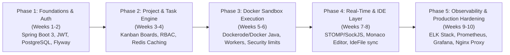
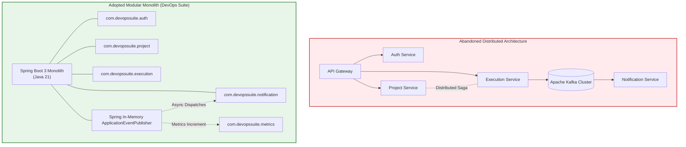
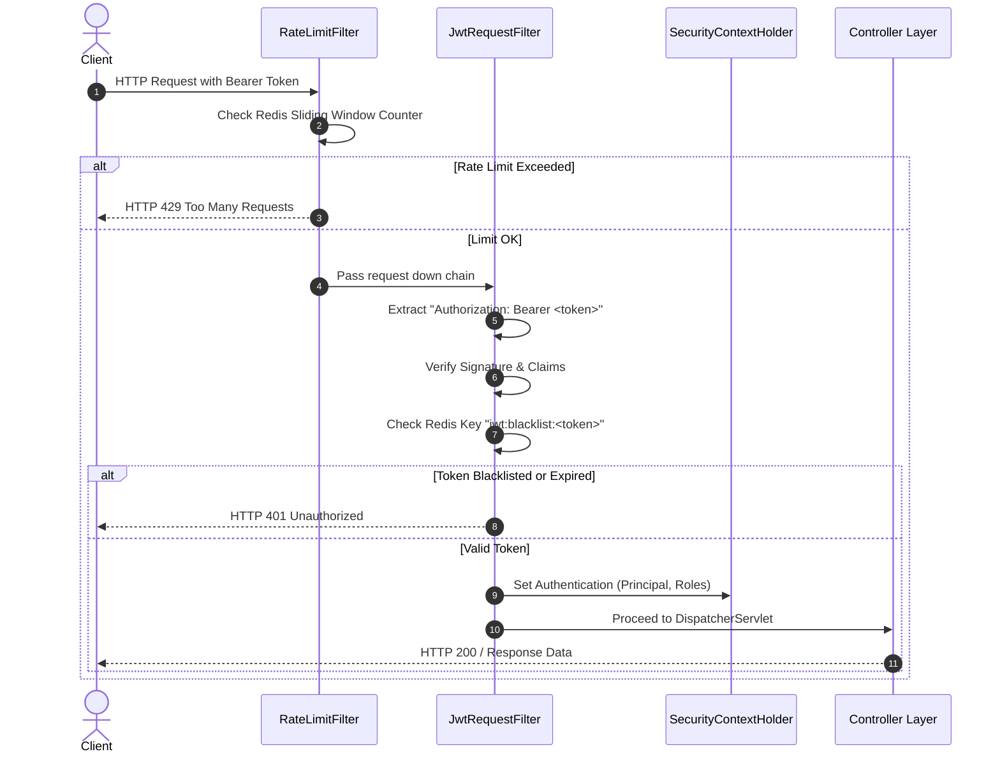
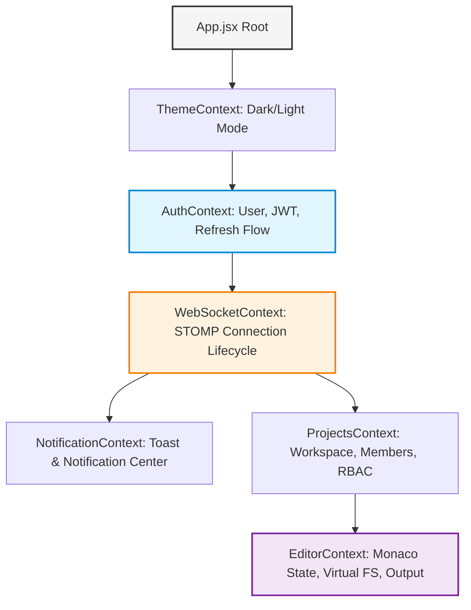
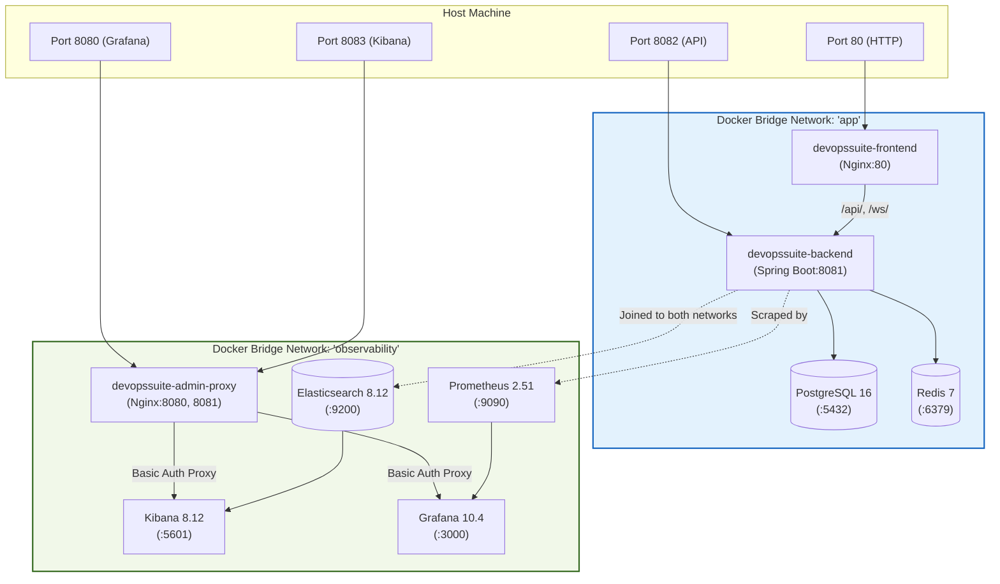
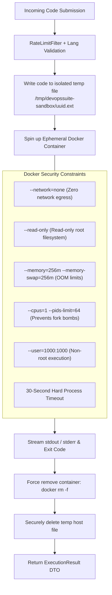
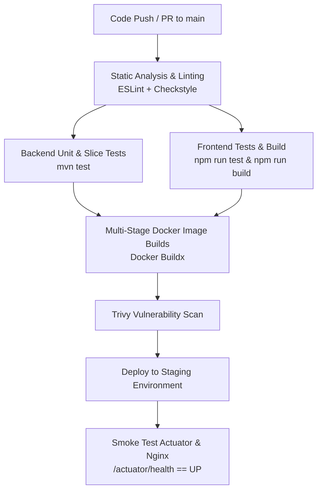

# Building DevOps Suite: Architectural Journey & Engineering Implementation

DevOps Suite was conceived and engineered as an end-to-end, enterprise-grade developer productivity platform. It unites interactive multi-language code execution inside hardened Docker sandboxes, real-time Kanban task management, full-text structured log querying, Monaco-powered browser IDE workspace persistence, and deep Prometheus/Grafana observability into a cohesive developer control plane.

This document serves as the comprehensive engineering design record and interview briefing on **how the system was planned, constructed, evolved, and hardened from scratch**.

---

## 1. Development Timeline & Methodology

### 1.1 Planning, Design, and Phased Execution

The platform was built following an iterative, test-driven approach divided into five distinct phases, balancing rapid validation of core technical risks (such as Docker daemon socket orchestration and real-time state synchronization) with progressive hardening and observability.



| Phase | Milestone Focus | Technical Deliverables & Decisions |
| :--- | :--- | :--- |
| **Phase 1: Core Foundation & Auth** | Identity, Database Lifecycle, Base API | • Initialized Spring Boot 3 monolith on Java 21 with Maven (`com.devopssuite`).<br>• Established Flyway migrations (`V1__initial_schema.sql` to `V6`).<br>• Implemented dual JWT tokens (1-hour access, 7-day refresh) with BCrypt hashing.<br>• Added OAuth2 social login (Google & GitHub) and Redis JWT blacklist for stateless revocation. |
| **Phase 2: Project Management & RBAC** | Collaborative Workspaces, Task Management | • Implemented project management with 4-tier hierarchical RBAC (`OWNER > ADMIN > MEMBER > VIEWER`).<br>• Built Kanban state engine (Backlog, Todo, In Progress, Done) with task assignments and audit histories (`V10`, `V11`).<br>• Integrated Redis cache-aside for projects and user profiles with automated cache invalidation on mutation. |
| **Phase 3: Sandboxed Code Execution** | Secure Multi-Language Remote Execution | • Designed [`DockerSandbox.java`](file:///d:/Projects/DevOps%20Suite/backend/src/main/java/com/devopssuite/execution/DockerSandbox.java) communicating over the Docker host socket.<br>• Hardened execution with ephemeral containers: `--network=none`, `--read-only`, `--memory=256m`, `--cpus=1`, non-root execution, 30s timeout.<br>• Supported 4 language runtimes: Python 3, Node.js 20, Java 21 (Temurin), and custom C++ (`g++:latest` via dedicated builder).<br>• Asynchronous execution decoupling via [`ExecutionQueueWorker.java`](file:///d:/Projects/DevOps%20Suite/backend/src/main/java/com/devopssuite/execution/ExecutionQueueWorker.java). |
| **Phase 4: Real-Time Sync & Monaco IDE** | Interactive Developer Workspace | • Integrated STOMP over SockJS over WebSockets with authentication channel interceptor [`StompAuthChannelInterceptor.java`](file:///d:/Projects/DevOps%20Suite/backend/src/main/java/com/devopssuite/security/StompAuthChannelInterceptor.java).<br>• Subscriptions for personal notifications, live project build/execution logs, and task movements.<br>• Integrated Microsoft Monaco Editor in React 18 frontend with virtual file persistence (`IdeFile` PostgreSQL entity). |
| **Phase 5: Observability & Production Deployment** | Telemetry, Log Shipping, Reverse Proxies | • Implemented structured Elasticsearch log indexing (`devopssuite-logs-yyyy.MM.dd`) with 180-day ILM retention.<br>• Custom Micrometer Prometheus metrics (`devopssuite_code_executions_total`, `devopssuite_active_users`, etc.).<br>• Dual bridge Docker networks (`app` and `observability`) isolating internal data stores from public access.<br>• Nginx reverse proxy with HTTP Basic Auth protecting Grafana (:8080) and Kibana (:8083). |

---

### 1.2 Architectural Evolution: The Deliberate Pivot from Microservices + Kafka to a Modular Monolith

During initial planning, the architecture was blueprinted as a distributed microservice system comprising four independent services (Auth Service, Project Service, Sandbox Runner Service, Notification Service) coupled asynchronously via Apache Kafka.

#### Why the Microservice + Kafka Approach Was Rejected
1. **Excessive Operational Cognitive Load:** Managing Zookeeper/KRaft, 4 distinct microservice deployables, distributed tracing (Jaeger/Zipkin), and distributed transactions (Saga pattern for project workspace provisioning) introduced severe complexity for a small engineering team without delivering tangible scaling advantages.
2. **Network Latency & Failure Modes:** Remote code execution feedback required sub-second responsiveness. Hopping across HTTP gateway -> Auth -> Queue -> Worker -> Kafka -> Notification Service added 150-300ms of overhead and several network partition points.
3. **Data Consistency Friction:** Project memberships and execution authorization require real-time validation against the user's role. In a microservices architecture, this demanded either eventual consistency (stale permission windows) or chatty inter-service RPC calls (OpenFeign/gRPC).

#### The Pivot: Modular Monolith + Spring ApplicationEventPublisher + Redis
The architecture deliberately pivoted to a high-cohesion, low-coupling **Spring Boot 3 Modular Monolith**:
- **Internal Async Event Bus:** Replaced Kafka with Spring's native `ApplicationEventPublisher` and `@Async` `@EventListener` components (e.g., [`NotificationEventListener.java`](file:///d:/Projects/DevOps%20Suite/backend/src/main/java/com/devopssuite/notification/NotificationEventListener.java)). Events are dispatched in-memory across bounded contexts with zero network serialization overhead.
- **Shared State with Transactional Integrity:** Relational operations (e.g., deleting a project, revoking member roles, cascading task reassignments) execute within ACID PostgreSQL database transactions (`@Transactional`), eliminating distributed 2PC or compensation sagas.
- **Redis as Ephemeral State & Rate Limiter:** Instead of Kafka partitions for rate throttling, Redis is leveraged for sliding-window rate limiting, token blacklists, and cache-aside storage.



---

## 2. Backend Construction

The backend is built with **Java 21** and **Spring Boot 3.x**, packaged cleanly under `com.devopssuite`. It uses standard domain-driven layered modularity: controllers, services, repositories, domain entities, and data transfer objects (DTOs).

### 2.1 Backend Package Architecture

```
com.devopssuite/
├── DevOpsSuiteApplication.java          # Application bootstrap & async/scheduling config
├── auth/                                # Authentication, JWT token management, OAuth2
│   ├── controller/                      # AuthController (register, login, refresh, oauth)
│   ├── entity/                          # User, PasswordResetToken, Role
│   ├── repository/                      # UserRepository, PasswordResetTokenRepository
│   └── service/                         # AuthService, CustomOAuth2UserService, TokenService
├── config/                              # Cross-cutting configurations (Redis, WebSockets, Async)
│   ├── RedisConfig.java                 # RedisConnectionFactory, RedisTemplate, Jackson serializers
│   ├── WebSocketConfig.java             # STOMP broker registration, endpoint mappings
│   └── AsyncConfig.java                 # ThreadPoolTaskExecutor for async event handling
├── execution/                           # Sandboxed multi-language remote execution engine
│   ├── DockerSandbox.java               # Low-level Docker client/CLI process orchestrator
│   ├── ExecutionQueueWorker.java        # Thread-safe execution scheduling and worker queue
│   ├── ExecutionService.java            # High-level request validator and orchestration
│   └── entity/                          # ExecutionRequest, ExecutionResult, Language enum
├── ide/                                 # Monaco-backed virtual filesystem persistence
│   ├── controller/                      # IdeFileController
│   ├── entity/                          # IdeFile (hierarchical path, content, project scoping)
│   └── service/                         # IdeFileService
├── logging/                             # Observability and Elasticsearch audit logging
│   ├── ElasticsearchLogService.java     # Bulk document shipping to elasticsearch:9200
│   └── entity/                          # LogEntry, LogQueryFilter
├── metrics/                             # Prometheus Micrometer metrics registries
│   └── AppMetrics.java                  # Custom business counters, gauges, and timers
├── notification/                        # Real-time alerting and user preferences
│   ├── NotificationEventListener.java   # @Async @EventListener for application events
│   ├── entity/                          # Notification, NotificationPreference, NotificationType
│   └── service/                         # NotificationService (persists & pushes via SimpMessagingTemplate)
├── project/                             # Collaborative workspaces, Kanban, and RBAC
│   ├── controller/                      # ProjectController, TaskController
│   ├── entity/                          # Project, ProjectMember, Task, TaskAuditHistory
│   └── service/                         # ProjectService, TaskService, ProjectRoleGuard
└── security/                            # Spring Security 6 filter chain and authorization
    ├── SecurityConfig.java              # HttpSecurity filter chain, CORS, route access rules
    ├── JwtRequestFilter.java            # Bearer token validation and SecurityContext injection
    ├── RateLimitFilter.java             # Sliding-window Redis rate limiter filter
    └── StompAuthChannelInterceptor.java # WebSocket CONNECT handshake token verification
```

---

### 2.2 Security Layer: Defense in Depth

The application implements a multi-tier security filter chain configured in [`SecurityConfig.java`](file:///d:/Projects/DevOps%20Suite/backend/src/main/java/com/devopssuite/security/SecurityConfig.java).



#### Key Filter Components:
1. **[`RateLimitFilter.java`](file:///d:/Projects/DevOps%20Suite/backend/src/main/java/com/devopssuite/security/RateLimitFilter.java):**
   - Intercepts requests before authentication to shield backend threads and downstream databases from volumetric denial-of-service.
   - Evaluates three distinct Redis-backed sliding-window buckets using keys formatted as `rate:{tier}:{identity}:{bucket}`:
     - **Auth Endpoints (`/api/auth/**`):** 20 requests/minute per client IP to prevent brute-force attacks.
     - **Code Execution (`/api/execution/**`):** 10 requests/minute per user ID to prevent container pool exhaustion.
     - **General API (`/api/**`):** 300 requests/minute per authenticated user (or IP fallback).
   - Increments the custom metric `devopssuite_rate_limit_blocked_total` when requests exceed thresholds.

2. **[`JwtRequestFilter.java`](file:///d:/Projects/DevOps%20Suite/backend/src/main/java/com/devopssuite/security/JwtRequestFilter.java):**
   - Extracts the `Bearer` token from the `Authorization` header.
   - Parses cryptographic claims using the configured HMAC-SHA256 secret.
   - Performs a fast O(1) existence check against Redis for revoked tokens: `jwt:blacklist:{token}`.
   - Hydrates `UsernamePasswordAuthenticationToken` and populates `SecurityContextHolder.getContext().setAuthentication(...)`.

3. **[`StompAuthChannelInterceptor.java`](file:///d:/Projects/DevOps%20Suite/backend/src/main/java/com/devopssuite/security/StompAuthChannelInterceptor.java):**
   - Secures WebSocket upgrades where traditional HTTP header authorization cannot persist.
   - Intercepts STOMP `CONNECT` frames, extracts the access token from the STOMP header payload (`X-Auth-Token` or `passcode`), validates claims, verifies against the Redis blacklist, and associates the authenticated `Principal` with the WebSocket session attributes.

---

### 2.3 Database Schema Evolution (16 Flyway Migrations)

Rather than relying on Hibernate's error-prone `ddl-auto=update`, the relational schema is maintained strictly through 16 incremental, version-controlled Flyway SQL migrations.

| Migration Version | File Name | Purpose & Architectural Significance |
| :--- | :--- | :--- |
| **V1** | `V1__initial_schema.sql` | Baseline relational schema: `users`, `projects`, `project_members`, `tasks`, `execution_requests`. Primary keys, foreign key constraints, and cascade delete rules. |
| **V2** | `V2__add_java_cpp_languages.sql` | Extended execution runtime check constraints to permit `JAVA` and `CPP` language types alongside `PYTHON` and `JAVASCRIPT`. |
| **V3** | `V3__add_notifications_table.sql` | Created `notifications` table (`id`, `user_id`, `type`, `title`, `message`, `read`, `created_at`) with index on `user_id` and `read` status. |
| **V4** | `V4__add_reset_tokens_table.sql` | Introduced `password_reset_tokens` table supporting hashed ephemeral tokens with 15-minute expiration timestamps. |
| **V5** | `V5__fix_cpp_docker_image.sql` | Corrected reference from Docker Hub registry to the locally built `devopssuite-cpp:latest` sandbox container image. |
| **V6** | `V6__add_gender_to_users.sql` | Added optional user demographic profile fields for user profile customization. |
| **V7** | `V7__ide_files.sql` | Created `ide_files` entity table (`id`, `project_id`, `file_name`, `path`, `content`, `file_type`, `updated_at`) supporting in-browser workspace state. |
| **V8** | `V8__execution_request_file_id.sql` | Linked execution audit entries directly to originating `ide_files(id)` via nullable foreign key. |
| **V9** | `V9__change_task_priority_to_text.sql` | Converted restrictive enum priority representation to flexible `VARCHAR(20)` with application-level validation (`LOW`, `MEDIUM`, `HIGH`, `URGENT`). |
| **V10** | `V10__add_task_audit_fields.sql` | Added `created_by`, `updated_by`, and completion timestamps to `tasks` for SLA tracking. |
| **V11** | `V11__add_task_audit_history.sql` | Created dedicated `task_audit_history` ledger capturing field changes, previous values, new values, and actor IDs for enterprise compliance. |
| **V12** | `V12__avatar_url_to_text.sql` | Migrated avatar image paths from `VARCHAR(255)` to `TEXT` to accommodate base64 data URLs. |
| **V13** | `V13__avatar_url_to_varchar.sql` | Refactored storage strategy: migrated from heavy inline base64 database strings to structured file-store URLs (`VARCHAR(512)`), storing image binaries on the `avatar_uploads` volume. |
| **V14** | `V14__notification_preferences.sql` | Created `notification_preferences` table with boolean flags per event type to allow users to toggle email vs in-app alerts. |
| **V15** | `V15__user_follows_and_profile_view_count.sql` | Social and collaborative enhancements: user following relationships and profile view counters. |
| **V16** | `V16__add_project_id_to_execution_requests.sql` | Added `project_id` foreign key index to `execution_requests` to enable project-scoped execution history and auditing. |

---

## 3. Frontend Construction

The frontend is a single-page application (SPA) built with **React 18**, bundled with **Vite**, and styled with **Tailwind CSS**.

### 3.1 Context-Driven State Management (No Redux)

Instead of introducing heavyweight Redux or Zustand boilerplate, the application implements a clean, reactive **Context Layer** composed of 6 purpose-built React contexts:



1. **[`ThemeContext.jsx`](file:///d:/Projects/DevOps%20Suite/frontend/src/context/ThemeContext.jsx):**
   - Manages light/dark mode preference, syncing state to browser `localStorage` and toggling the `dark` class on the root `<html>` element for Tailwind CSS variables.
2. **[`AuthContext.jsx`](file:///d:/Projects/DevOps%20Suite/frontend/src/context/AuthContext.jsx):**
   - Stores current user entity, access token, and refresh token in secure memory and storage.
   - Provides `login()`, `logout()`, and Axios request/response interceptors that silently refresh expired access tokens upon receiving HTTP 401 before retrying failed requests.
3. **[`WebSocketContext.jsx`](file:///d:/Projects/DevOps%20Suite/frontend/src/context/WebSocketContext.jsx):**
   - Encapsulates `@stomp/stompjs` client lifecycle over SockJS.
   - Automatically establishes connection when `AuthContext` provides a valid token.
   - Implements exponential backoff auto-reconnect and provides helper methods `subscribe(destination, callback)` and `send(destination, body)`.
4. **[`NotificationContext.jsx`](file:///d:/Projects/DevOps%20Suite/frontend/src/context/NotificationContext.jsx):**
   - Subscribes via `WebSocketContext` to `/topic/notifications/{userId}`.
   - Converts inbound push events into ephemeral toast notifications and increments the unread badge counter in the top navigation bar.
5. **[`ProjectsContext.jsx`](file:///d:/Projects/DevOps%20Suite/frontend/src/context/ProjectsContext.jsx):**
   - Manages project selection, project listings, member roles (`OWNER`, `ADMIN`, `MEMBER`, `VIEWER`), and Kanban board state.
   - Listens to `/topic/tasks/{projectId}` for live multi-user task moves and status transitions.
6. **[`EditorContext.jsx`](file:///d:/Projects/DevOps%20Suite/frontend/src/context/EditorContext.jsx):**
   - Holds the Monaco Editor active buffer, current file tab, language mode, dirty-state indicators, terminal execution outputs, and compilation error markers.
   - Synchronizes file tree modifications back to PostgreSQL via the `ide_files` API.

---

### 3.2 Monaco Editor & WebSocket STOMP Integration

The Monaco Editor integration (`@monaco-editor/react`) provides a VS Code-grade coding experience directly in the browser:
- **IntelliSense and Syntax Highlighting:** Dynamically configured for Python, JavaScript, Java, and C++.
- **Terminal Execution Streaming:** When the user hits **Run Code**, `EditorContext` submits an execution payload. Rather than blocking on HTTP polling, the backend immediately returns an execution ID and streams stdout/stderr chunks and exit statuses over `/topic/logs/{projectId}` or direct WebSocket response frames.
- **Safety Interceptors:** The frontend validates file sizes before submission, preventing browser crashes from massive inputs.

---

## 4. Infrastructure & DevOps Setup

The entire DevOps Suite ecosystem runs cleanly via Docker Compose using production-grade isolation patterns.



### 4.1 Multi-Stage Dockerfiles

Both frontend and backend utilize multi-stage builds to maximize security and minimize container image footprint.

#### Backend Dockerfile (`eclipse-temurin:21-jre-alpine` runtime)
```dockerfile
# Stage 1: Build
FROM maven:3.9-eclipse-temurin-21 AS builder
WORKDIR /app
COPY pom.xml .
RUN mvn dependency:go-offline -q
COPY src ./src
RUN mvn package -DskipTests -q

# Stage 2: Runtime
FROM eclipse-temurin:21-jre-alpine
WORKDIR /app
RUN addgroup -S appgroup && adduser -S appuser -G appgroup
RUN mkdir -p /tmp/devopssuite-sandbox && chown appuser:appgroup /tmp/devopssuite-sandbox
USER appuser
COPY --from=builder /app/target/backend-1.0.0-SNAPSHOT.jar app.jar
EXPOSE 8081
ENTRYPOINT ["java", "-jar", "app.jar"]
```
*Benefits:* The heavy JDK, Maven binaries, and build artifacts are discarded, dropping final image size from >850MB to ~220MB. The container executes under an unprivileged user (`appuser`).

#### Frontend Dockerfile (`nginx:alpine` runtime)
```dockerfile
# Stage 1: Build
FROM node:24-alpine AS builder
WORKDIR /app
COPY package.json package-lock.json ./
RUN CYPRESS_INSTALL_BINARY=0 npm install --legacy-peer-deps
COPY . .
RUN VITE_API_URL="" VITE_WS_URL="" npm run build

# Stage 2: Runtime
FROM nginx:alpine
COPY --from=builder /app/dist /usr/share/nginx/html
COPY nginx.conf /etc/nginx/conf.d/default.conf
EXPOSE 80
CMD ["nginx", "-g", "daemon off;"]
```
*Benefits:* Node runtime and npm package caches are excluded. Static HTML/JS/CSS assets are served directly by Nginx at native wire speed.

---

### 4.2 Network Segmentation: `app` vs `observability`

Security is enforced at the Docker network level via two independent bridge networks:
1. **`app` Network:**
   - Connects `frontend`, `backend`, `postgres`, and `redis`.
   - Protects the database and cache: PostgreSQL (:5432) and Redis (:6379) expose no host ports whatsoever and can only be reached by the backend container.
2. **`observability` Network:**
   - Connects `backend`, `elasticsearch`, `kibana`, `prometheus`, `grafana`, and `admin-proxy`.
   - The backend is multi-homed (attached to both `app` and `observability`), allowing it to ship logs to Elasticsearch and expose `/actuator/prometheus` to Prometheus.
3. **`admin-proxy` Gateway:**
   - Grafana (:3000), Kibana (:5601), Prometheus (:9090), and Elasticsearch (:9200) expose **no raw host ports**.
   - Host port `8080` routes through `admin-proxy` to Grafana.
   - Host port `8083` routes through `admin-proxy` to Kibana.
   - An ephemeral init container ([`htpasswd-init`](file:///d:/Projects/DevOps%20Suite/docker-compose.yml#L259-L269)) generates a cryptographic `.htpasswd` file at startup, enforcing HTTP Basic Authentication before allowing any traffic through to the dashboards.

---

## 5. Comprehensive Interview Q&A

### Question 1: "Why did you build this project and what problem does it solve?"
#### 🟢 Basic
**Interviewer:** "What was the motivation behind DevOps Suite, and what core developer pain point does it solve?"

**Candidate Answer:**
"DevOps Suite was built to eliminate the fragmented developer workflow experienced across modern software engineering teams. Typically, developers must juggle multiple disparate tools: Jira or Trello for Kanban task tracking, an external sandbox like LeetCode or JSFiddle for testing quick code snippets, Kibana or CloudWatch for querying runtime application logs, and Grafana for system health telemetry.

DevOps Suite integrates all these core workflows into a unified, self-hosted developer control plane:
1. **Cloud IDE & Remote Execution:** Developers can write and test code in Python, JavaScript, Java, or C++ directly in the browser with Monaco Editor, executing it in isolated, resource-constrained Docker containers.
2. **Real-Time Project Workspaces:** Teams manage tasks via collaborative Kanban boards with role-based access control, receiving instant live updates when tasks are reassigned or completed.
3. **Integrated Observability:** Logs and performance metrics are indexed and visualized within the same platform, giving developers end-to-end visibility from code authoring to system execution telemetry."

---

### Question 2: "Walk me through how you structured the backend from scratch."
#### 🟡 Intermediate
**Interviewer:** "How did you structure the Spring Boot backend architecture, and how do you enforce separation of concerns across modules?"

**Candidate Answer:**
"The backend is structured as a modular monolith in Java 21 using Spring Boot 3, packaged under `com.devopssuite`. Rather than organizing code by layer alone (e.g., placing all controllers in one generic package and all services in another), we organized the application by **domain bounded contexts**: `auth`, `project`, `execution`, `ide`, `notification`, `logging`, `metrics`, and `security`.

Within each domain package, standard layered architecture is maintained:
- **Controller layer:** Exposes RESTful endpoints, handles HTTP parameter binding, and delegates to services.
- **Service layer:** Encapsulates business logic, transactional boundaries (`@Transactional`), and event publishing.
- **Repository layer:** Extends Spring Data JPA `JpaRepository` for data access.
- **Entity layer:** Defines relational models mapped to PostgreSQL tables.

Cross-cutting concerns are strictly decoupled:
- **Security:** Handled centrally by [`SecurityConfig`](file:///d:/Projects/DevOps%20Suite/backend/src/main/java/com/devopssuite/security/SecurityConfig.java), [`JwtRequestFilter`](file:///d:/Projects/DevOps%20Suite/backend/src/main/java/com/devopssuite/security/JwtRequestFilter.java), and [`RateLimitFilter`](file:///d:/Projects/DevOps%20Suite/backend/src/main/java/com/devopssuite/security/RateLimitFilter.java).
- **Inter-module Communication:** Modules do not directly inject other domain services if it violates bounded context independence; instead, they publish in-memory domain events via Spring's `ApplicationEventPublisher`. For instance, when a task is updated in the `project` module, it publishes a `TaskEvent`, which the `notification` module's [`NotificationEventListener`](file:///d:/Projects/DevOps%20Suite/backend/src/main/java/com/devopssuite/notification/NotificationEventListener.java) consumes asynchronously using `@Async` to create database notification records and broadcast them over WebSockets."

#### Follow-up Question:
**Interviewer:** "Why use an in-memory event publisher instead of a message broker like RabbitMQ or Kafka?"

**Candidate Answer:**
"For our deployment profile, Spring's internal event bus provides asynchronous, non-blocking decoupling without the operational tax of maintaining a separate messaging cluster. Because the notification dispatch is non-critical to the task transaction, if an alert fails, the core task change is already committed. If we later need horizontal multi-node scaling where events must reach WebSocket subscribers on other nodes, we can swap the internal publisher for a Redis Pub/Sub topic without changing the domain service APIs."

---

### Question 3: "How did you manage database evolution as new features were added?"
#### 🟡 Intermediate
**Interviewer:** "How did you handle database schema changes across the 16 migrations without data loss or downtime?"

**Candidate Answer:**
"We used **Flyway** for deterministic, version-controlled database migrations located under `src/main/resources/db/migration`, completely disabling Hibernate's `ddl-auto` (`ddl-auto=validate` in production).

Our migration history illustrates how real-world schema requirements evolved:
1. **Incremental Feature Additions:** 
   - `V1__initial_schema.sql` established the core tables (`users`, `projects`, `tasks`, `execution_requests`).
   - `V3__add_notifications_table.sql` added the alert system.
   - `V7__ide_files.sql` introduced virtual filesystem persistence for the in-browser IDE.
2. **Schema Refactoring & Data Preservation:**
   - In `V9__change_task_priority_to_text.sql`, we transitioned task priority from a restrictive PostgreSQL `ENUM` to a `VARCHAR(20)`. The migration used an explicit `ALTER TABLE tasks ALTER COLUMN priority TYPE VARCHAR(20) USING priority::text;` to guarantee zero data loss.
   - In `V12` and `V13`, we managed avatar storage evolution. `V12` initially widened `avatar_url` to `TEXT` to allow base64 strings. However, storing large base64 payloads inflated PostgreSQL row sizes and bloated page buffers. In `V13`, we refactored the design to store uploaded avatars on disk (`avatar_uploads` volume) and converted `avatar_url` back to a clean `VARCHAR(512)` path.
3. **Auditing & Enterprise Compliance:**
   - `V10` added SLA audit fields (`created_by`, `updated_by`), and `V11__add_task_audit_history.sql` introduced a dedicated audit ledger table that logs every state change, old value, new value, and modifying user ID."

---

### Question 4: "How did you design the frontend state management without Redux?"
#### 🔴 Advanced
**Interviewer:** "Most enterprise React SPAs use Redux, MobX, or Zustand. Why did you choose React Context, and how do you prevent unnecessary re-renders?"

**Candidate Answer:**
"We deliberately chose a segmented **React Context Architecture** over Redux to avoid excessive action/reducer boilerplate while maintaining strict separation of concerns.

The critical flaw in many React Context implementations is creating a single monolithic 'GlobalAppContext', where updating a single property (like a notification badge) re-renders the entire component tree. We avoided this by splitting state into 6 specialized, independent contexts:
1. `ThemeContext` (dark/light mode styling)
2. `AuthContext` (tokens and session state)
3. `WebSocketContext` (STOMP connection handle)
4. `NotificationContext` (transient alerts and unread lists)
5. `ProjectsContext` (workspace metadata and active Kanban boards)
6. `EditorContext` (active code buffer, file tabs, compilation outputs)

**Performance Optimization Techniques:**
- **Context Segregation:** Typing in Monaco Editor modifies state inside `EditorContext`. Because `ProjectsContext` and `NotificationContext` are separate providers, typing never triggers re-renders on the Kanban board or navigation header.
- **Selective Consumption:** Components only consume the exact context hook they need (e.g., `useWebSocket()` or `useAuth()`).
- **Memoized Callbacks & Values:** Context value objects are memoized using `useMemo()`, and dispatcher functions are stabilized using `useCallback()`, ensuring consumers only re-render when underlying domain primitives change."

---

### Question 5: "How did you secure and sandbox the remote code execution engine?"
#### 🔴 Advanced
**Interviewer:** "Running arbitrary user-submitted code is inherently dangerous. How does `DockerSandbox.java` prevent host breakout, fork bombs, and network abuse?"

**Candidate Answer:**
"The code execution engine implements multi-layered isolation following the principle of least privilege, managed by [`DockerSandbox.java`](file:///d:/Projects/DevOps%20Suite/backend/src/main/java/com/devopssuite/execution/DockerSandbox.java):



1. **Ephemeral Lifecycle:** Every execution runs inside a brand new, single-use container that is immediately terminated and removed (`--rm`) upon completion or timeout.
2. **Network Isolation:** Configured with `--network=none`. The container has no network interfaces other than loopback, preventing SSRF, port scanning, botnet participation, or reverse shells.
3. **Filesystem Lockdown:** The container's root filesystem is mounted `--read-only`. User code cannot write to system binaries, download tools, or alter OS libraries. The single file being executed is mounted read-only into an isolated directory.
4. **Resource Constraints:**
   - Memory is capped at `--memory=256m` with swap restricted (`--memory-swap=256m`) to prevent swapping to host disk.
   - CPU quota is restricted to `--cpus=1`.
   - Process fork bomb defense: Process limits (`--pids-limit=64`) prevent processes from spawning infinite child threads.
5. **Execution Timeout:** A watchdog thread forcefully terminates the container if execution exceeds 30 seconds.
6. **Non-Root Execution:** Code runs under an unprivileged user ID (`--user=1000:1000`). Even if a zero-day kernel exploit were attempted, root host privileges cannot be inherited."

---

### Question 6: "How did you automate the observability stack provisioning?"
#### ⚫ Expert
**Interviewer:** "In production, spinning up Elasticsearch, Kibana, Prometheus, and Grafana usually requires manual index pattern creation and dashboard imports. How did you fully automate this?"

**Candidate Answer:**
"We engineered **zero-touch infrastructure provisioning** directly into the `docker-compose.yml` lifecycle using volume mounts, declarative configuration files, and self-terminating init containers:

1. **Automated Kibana Data Views (`kibana-init`):**
   - Kibana normally requires a user to manually create an 'Index Pattern' before logs can be viewed.
   - We created a dedicated, one-shot service: `kibana-init` using `curlimages/curl`. It waits for Kibana's `/api/status` endpoint to report healthy (`condition: service_healthy`), then executes [`init-kibana.sh`](file:///d:/Projects/DevOps%20Suite/config/kibana/init-kibana.sh) via a cURL POST request to Kibana's Saved Objects API (`/api/saved_objects/data-view/devopssuite-logs`), automatically binding the `devopssuite-logs-*` index pattern.
2. **Declarative Grafana Provisioning:**
   - Grafana's datasources and dashboards are auto-provisioned on startup via YAML descriptors mounted to `/etc/grafana/provisioning/`.
   - `datasource.yml` automatically defines Prometheus (`http://prometheus:9090`) as the default data source.
   - `dashboards.yml` automatically reads two pre-built JSON dashboards from `/var/lib/grafana/dashboards/`:
     - **DevOps Suite Application Metrics:** Visualizes `devopssuite_code_executions_total`, active user gauges, Redis cache hit/miss ratios, and rate limit blocks.
     - **JVM & System Health:** Visualizes heap usage, garbage collection pause times, and HikariCP connection pool saturation.
3. **Automated Credential Generation (`htpasswd-init`):**
   - The Nginx admin proxy protects Kibana and Grafana with HTTP Basic Auth.
   - Rather than checking hardcoded password files into Git, an init container running `httpd:2.4-alpine` runs `htpasswd -cb /etc/nginx/conf.d/.htpasswd "$ADMIN_USER" "$ADMIN_PASSWORD"` on a shared Docker volume (`htpasswd_vol`), dynamically generating credentials from environment variables."

---

## 6. Development Workflow & CI/CD Pipeline

The project uses GitHub Actions (`.github/workflows/deploy.yml`) to enforce code hygiene, automated testing, and container deployment.



### Key CI/CD Principles Enforced:
1. **Failing Fast on Dependency Vulnerabilities:** Backend and frontend dependencies are validated against CVE databases during build stages.
2. **Deterministic Artifact Bundling:** The frontend build injects empty base URLs (`VITE_API_URL=""`) during production Docker builds so all network requests route via relative `/api/` paths through Nginx, making the container image portable across any domain or IP without rebuilding.
3. **Safe Database Migrations:** Flyway runs automatically on backend container startup. In the event of a migration script failure, Flyway halts application initialization, preserving database consistency and preventing broken schemas from serving traffic.

---

## 7. Quick Reference: Engineering Architecture Facts

| Architectural Dimension | Implementation Details |
| :--- | :--- |
| **Backend Runtime & Framework** | Java 21 LTS, Spring Boot 3.x, Maven, package `com.devopssuite` |
| **Frontend Framework & Tooling** | React 18, Vite, JavaScript (JSX), Tailwind CSS, Monaco Editor (`@monaco-editor/react`) |
| **Database & Migrations** | PostgreSQL 16, single database `devopssuite`, 16 Flyway migrations (`V1` to `V16`) |
| **Cache & Throttling Layer** | Redis 7 standalone: JWT blacklist, sliding-window rate limiting, cache-aside entity caching |
| **Real-time Engine** | STOMP over SockJS; Topics: `/topic/notifications/{userId}`, `/topic/logs/{projectId}`, `/topic/tasks/{projectId}` |
| **Code Execution Sandbox** | Ephemeral Docker containers: `--network=none`, `--read-only`, `--memory=256m`, `--cpus=1`, `--pids-limit=64`, 30s timeout |
| **Execution Languages Supported** | Python 3, Node.js 20 (JS), Java 21 (Temurin), C++ (`devopssuite-cpp:latest`) |
| **Authentication & Tokens** | Dual JWT (1h access, 7d refresh), Redis revocation blacklist, Google & GitHub OAuth2, BCrypt passwords |
| **Role-Based Access Control** | Hierarchical 4-tier model: `OWNER` > `ADMIN` > `MEMBER` > `VIEWER` |
| **Port Mapping Strategy** | • Frontend: 80 (HTTP)<br>• Backend internal: 8081, Host: 8082<br>• Grafana: 8080 (via Nginx Basic Auth)<br>• Kibana: 8083 (via Nginx Basic Auth)<br>• PostgreSQL/Redis/Prometheus/Elasticsearch: Internal only (no host ports) |
| **Observability Telemetry** | Micrometer -> Prometheus `/actuator/prometheus` -> Grafana (2 auto-provisioned dashboards); Elasticsearch daily indices (`devopssuite-logs-yyyy.MM.dd`) |
| **Internal Event Bus** | Spring native `ApplicationEventPublisher` with `@Async` `@EventListener` (No Kafka complexity) |
| **Custom Metrics Exposed** | `devopssuite_code_executions_total`, `devopssuite_task_operations_total`, `devopssuite_active_users`, `devopssuite_cache_hits_total`, `devopssuite_cache_misses_total`, `devopssuite_rate_limit_blocked_total` |
