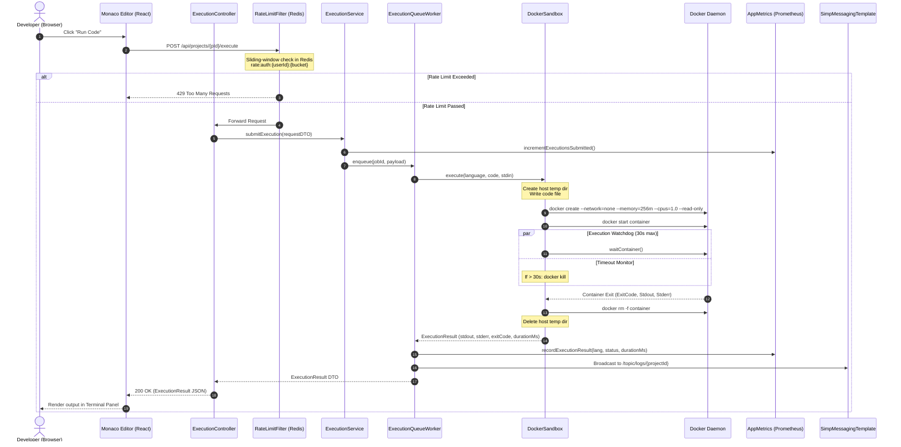
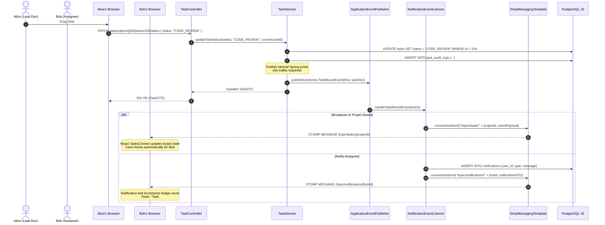

# Project Walkthrough & Architecture Deep Dive — DevOps Suite

## 1. Executive Pitch & Architecture Summary

### 1.1 What is DevOps Suite?
**DevOps Suite** is a unified, cloud-native developer productivity and operations workspace engineered to bridge the gap between source code development, agile workflow management, containerized sandboxed execution, and production observability. Instead of context-switching between fragmented tools (such as Jira/Trello for task tracking, LeetCode/Repl.it for code prototyping, separate log aggregators, and disjointed metrics dashboards), DevOps Suite consolidates these missions into a cohesive, high-performance monolith with real-time reactive collaboration.

Built as an enterprise-grade full-stack system, DevOps Suite couples a **Spring Boot 3.x (Java 21)** modular monolith backend with a responsive **React 18 (Vite, Tailwind CSS, Monaco Editor)** single-page application. Under the hood, it orchestrates **PostgreSQL 16** for relational state persistence, **Redis 7** for low-latency session caching and distributed rate limiting, **Docker Engine** for ephemeral secure sandbox execution, and a dedicated **ELK + Prometheus + Grafana** telemetry stack.

```
+---------------------------------------------------------------------------------------+
|                                    CLIENT TIER                                        |
|   React 18 SPA (Vite + Tailwind CSS) | Monaco Editor | STOMP SockJS Client            |
|   Port: 80 (Docker Nginx) / 5173 (Dev)                                                |
+-------------------------------------------+-------------------------------------------+
                                            |
                               HTTP / REST  |  STOMP / WebSockets (SockJS)
                                            v
+---------------------------------------------------------------------------------------+
|                                  APPLICATION TIER                                     |
|                           Spring Boot 3.x Monolith (Java 21)                          |
|   Internal Port: 8081 | Host Mapped Port: 8082 | Security: Stateless JWT / RBAC       |
|                                                                                       |
|  [Security & Rate Limiting]        [Core Business Logic]       [Async Processing]    |
|   - JwtRequestFilter                - Auth & OAuth2 Service     - ApplicationEventPub |
|   - RateLimitFilter (Sliding Win)   - Project & Task Service    - ExecutionQueueWorker|
|   - StompAuthChannelInterceptor     - IdeFile Service           - Async Notification  |
|                                     - ExecutionService          - Micrometer Metrics  |
+---------+-------------------+----------------+--------------------+-------------------+
          |                   |                |                    |
          v                   v                v                    v
+------------------+  +---------------+  +---------------+  +---------------------------+
| PERSISTENCE TIER |  |  CACHE / TIER |  | EXECUTION     |  | OBSERVABILITY TIER        |
| PostgreSQL 16    |  |  Redis 7      |  | Docker Engine |  | Prometheus (:9090)        |
| - DB: devopssuite|  |  - Blacklist  |  | - Ephemeral   |  | Grafana (:8080 via Nginx) |
| - 16 Flyway Migr |  |  - User Cache |  |   Containers  |  | Elasticsearch (:9200)     |
|   (V1 - V16)     |  |  - Rate Limits|  | - Security    |  | Kibana (:8083 via Nginx)  |
| - Relational /   |  |  - Project    |  |   Hardening   |  | Dual Bridge Networks:     |
|   ACID Store     |  |    Cache      |  | - Zero Network|  | 'app' & 'observability'   |
+------------------+  +---------------+  +---------------+  +---------------------------+
```

### 1.2 Target Audience & Problem Space
1. **Engineering Teams & Squads:** Requiring an integrated lifecycle workspace where project roadmaps, Kanban sprint boards, and inline code experimentation occur without context-switching fatigue.
2. **Technical Interviewers & Candidates:** Offering an isolated, secure coding environment where code can be authored in Monaco, executed safely in an ephemeral container, and evaluated with sub-second feedback.
3. **DevOps Engineers & Site Reliability Teams:** Needing deep system visibility out of the box with zero manual instrumentation — monitoring container performance, JVM garbage collection, API throughput, and centralized audit trails.

### 1.3 Core Modules Overview
- **Authentication & Authorization Engine:** Dual-mode authentication offering stateless JWT (1-hour access token, 7-day refresh token) coupled with GitHub and Google OAuth2 social login, backed by Redis token revocation blacklisting and strict 4-tier Role-Based Access Control (`OWNER`, `ADMIN`, `MEMBER`, `VIEWER`).
- **Agile Workspace & Kanban Board:** Sprint tracking, dynamic column ordering, drag-and-drop cards, inline file attachments, and assignment auditing synchronized live across connected team members.
- **Cloud IDE & Docker Execution Sandbox:** In-browser Monaco editor powering polyglot programming (Python 3, Node.js JavaScript, OpenJDK Java, GCC C++), running against a zero-trust Docker daemon with strict CPU/memory quotas, dropped capabilities, and read-only root filesystems.
- **Real-Time Notification & Event Bus:** Low-latency STOMP over SockJS communication driven internally by Spring's `ApplicationEventPublisher` to prevent external message broker overhead while guaranteeing instant UI synchronization.
- **Enterprise Observability & Audit Pipeline:** Micrometer-instrumented metrics exported to Prometheus and rendered across two provisioned Grafana dashboards, alongside structured JSON logging streamed asynchronously to Elasticsearch daily rolling indices.

---

## 2. End-to-End User Journey & Demo Walkthrough

### 2.1 Onboarding & Authentication Lifecycle
The developer journey begins at the login screen. DevOps Suite provides two onboarding paths: traditional credential registration and one-click OAuth2 social single sign-on (SSO).

```
[ User Browser ]                  [ Spring Boot Backend ]                [ Redis Cache ]
       |                                     |                                  |
       |----- 1. POST /api/auth/login ------>|                                  |
       |      { username, password }         |-- 2. BCrypt.checkpw()            |
       |                                     |-- 3. Generate Access + Refresh   |
       |<---- 4. 200 OK + JWT Tokens --------|                                  |
       |                                     |                                  |
       |----- 5. Subsequent Requests ------->|                                  |
       |      Authorization: Bearer <Token>  |-- 6. Check Redis Blacklist ----->|
       |                                     |<-- 7. Token Valid (Not in Set) --|
       |                                     |-- 8. Populate SecurityContext    |
       |<---- 9. Protected Resource Data ----|                                  |
       |                                     |                                  |
       |----- 10. POST /api/auth/logout ---->|                                  |
       |      Authorization: Bearer <Token>  |-- 11. Calculate Remaining TTL ---|
       |                                     |-- 12. SETEX jwt:blacklist:<t> -->|
       |<---- 13. 200 Logged Out ------------|                                  |
```

1. **Standard Registration & Login:**
   - The user registers via `POST /api/auth/register`. Passwords are encrypted using Spring Security's `BCryptPasswordEncoder` (strength 10) before persisting to PostgreSQL.
   - Upon `POST /api/auth/login`, credentials authenticate through `AuthenticationManager`.
   - The server issues a compact JWT Access Token (HMAC-SHA256, 1-hour expiry) containing `userId`, `username`, and `roles`, alongside an opaque cryptographically secure 7-day Refresh Token.
2. **Social OAuth2 Authorization (Google & GitHub):**
   - The client redirects to `/oauth2/authorization/github` or `/oauth2/authorization/google`.
   - Upon provider consent, the authorization code callback is caught by Spring Security's `OAuth2LoginAuthenticationFilter`.
   - `CustomOAuth2UserService` inspects the user attributes, creates or updates the local user record in PostgreSQL, generates standard application JWTs, and issues a 302 redirect back to the frontend with tokens embedded in secure, HTTP-only transport or URL fragment handlers.
3. **Session Revocation via Redis:**
   - When a user signs out via `POST /api/auth/logout`, `JwtRequestFilter` extracts the token's expiration timestamp, calculates the remaining TTL, and writes the key `jwt:blacklist:{token}` into Redis with an explicit expiration matching the remaining lifespan.
   - Any future presentation of that token fails immediately at the filter boundary with `401 Unauthorized`.

---

### 2.2 Project Management & Kanban Workflow
Once authenticated, the user enters the project dashboard:

1. **Project Provisioning:**
   - The user creates a workspace (e.g., "Payment Gateway Refactor") via `POST /api/projects`.
   - Flyway migration `V1__init_schema.sql` establishes the project row and inserts the creator into `project_members` with the role `OWNER`.
   - Default Kanban columns (`BACKLOG`, `IN_PROGRESS`, `CODE_REVIEW`, `DONE`) are initialized via database triggers or application lifecycle hooks.
2. **Role Enforcement:**
   - Permissions are enforced using method-level security (`@PreAuthorize("@projectSecurity.hasRole(#projectId, 'ADMIN')")`).
   - `OWNER` / `ADMIN`: Can add/remove members, modify board structure, delete tasks, and delete projects.
   - `MEMBER`: Can create, update, reassign, and transition tasks between columns.
   - `VIEWER`: Read-only access to cards, metrics, and Monaco files.
3. **Task State Transitions:**
   - Moving a task from `IN_PROGRESS` to `CODE_REVIEW` triggers a `PATCH /api/projects/{projectId}/tasks/{taskId}/status` request.
   - The backend validates the member's project association, updates PostgreSQL, and publishes an internal `TaskMovedEvent`.

---

### 2.3 Cloud IDE & Sandboxed Code Execution Flow
The user navigates to the integrated Cloud IDE powered by Microsoft's Monaco Editor.

```
[ Monaco Editor ]       [ ExecutionController ]      [ DockerSandbox ]       [ Docker Engine ]
       |                          |                          |                       |
       |-- 1. POST /execute ----->|                          |                       |
       |   { lang, code, stdin }  |-- 2. Validate & Queue -->|                       |
       |                          |   (Check Rate Limits)    |                       |
       |                          |                          |-- 3. Write Temp Host -|
       |                          |                          |      Source File      |
       |                          |                          |                       |
       |                          |                          |-- 4. docker run ----->|
       |                          |                          |   --network=none      |
       |                          |                          |   --memory=256m       |
       |                          |                          |   --cpus=1.0          |
       |                          |                          |   --read-only         |
       |                          |                          |   -v /tmp/code:/app:ro|
       |                          |                          |                       |
       |                          |                          |   (Executes 30s max)  |
       |                          |                          |<-- 5. Return ExitCode,|
       |                          |                          |       stdout, stderr -|
       |                          |                          |-- 6. Cleanup Host ----|
       |                          |<-- 7. ExecutionResult ---|                       |
       |<-- 8. 200 JSON Res ------|   (status, logs, ms)     |                       |
```

1. **Code Persistence & Monaco Workspace:**
   - Files are fetched via `GET /api/projects/{projectId}/files` and backed by the `IdeFile` entity.
   - Edits are debounced on the client and auto-saved using `PUT /api/projects/{projectId}/files/{fileId}`.
2. **Execution Submission:**
   - The developer clicks "Run Code" in the IDE toolbar.
   - The frontend issues `POST /api/projects/{projectId}/execute` containing `{ language: "python", code: "print('DevOps Suite')", stdin: "" }`.
3. **Sandbox Isolation Mechanism:**
   - `ExecutionService` validates language compatibility and dispatches the payload to `DockerSandbox.java`.
   - A unique host-side scratch directory (`/tmp/devopssuite/exec/{uuid}`) is populated with the user code.
   - The Docker API creates an isolated, ephemeral container configured with:
     - `--network=none`: Prohibits egress/ingress, preventing SSRF, botnet command-and-control, or secret exfiltration.
     - `--memory=256m --memory-swap=256m`: Prevents host Out-Of-Memory (OOM) crashes from malicious allocation loops.
     - `--cpus=1.0`: Bounds CPU usage against infinite loops.
     - `--read-only`: Sets the container root filesystem as immutable.
     - `--cap-drop=ALL`: Strips all Linux capabilities (no raw sockets, no root elevation).
     - `--user=1000:1000`: Executes as a non-privileged unmapped user.
4. **Execution Lifecycle & Termination:**
   - An asynchronous watchdog thread limits execution to an absolute maximum of 30 seconds.
   - If execution exceeds 30s, the container is forcibly killed (`docker kill`), returning an `EXECUTION_TIMEOUT` status.
   - On completion, `stdout` and `stderr` are collected, truncated to 64KB (preventing memory amplification attacks), the scratch directory is unlinked, the container is removed (`--rm`), and an `ExecutionResult` DTO is returned to Monaco.

---

### 2.4 Live Real-Time Collaboration
Collaboration across team members utilizes STOMP over SockJS with distinct pub/sub channels:

1. **Connection & Interception:**
   - The browser opens a WebSocket connection to `/ws-devops`.
   - Handshake authentication occurs at the STOMP frame level via `StompAuthChannelInterceptor.java`, which extracts the `Authorization: Bearer <token>` header from the `CONNECT` frame and binds the `Principal`.
2. **Channel Topologies:**
   - `/topic/notifications/{userId}`: Direct, private alerts (e.g., "Alice assigned you to task DEVOPS-42").
   - `/topic/tasks/{projectId}`: Real-time Kanban board updates (task moves, edits, status transitions).
   - `/topic/logs/{projectId}`: Live streaming execution logs and diagnostic events.
3. **Event Propagation:**
   - When Developer A drags a task to "Done", PostgreSQL is updated, and an internal `ApplicationEventPublisher` triggers `NotificationEventListener`.
   - `SimpMessagingTemplate` broadcasts the serialized payload to `/topic/tasks/{projectId}`.
   - Developer B's browser, subscribed via `WebSocketContext.jsx`, receives the frame and updates the React state without requiring a page reload.

---

### 2.5 Observability & Monitoring Infrastructure
DevOps Suite is built from the ground up to provide zero-touch operational transparency:

```
                                   +-------------------------+
                                   |  Prometheus Server      |
                                   |  (Port: 9090)           |
                                   +------------+------------+
                                                |
                               Scrapes every 15s| (/actuator/prometheus)
                                                v
[ Spring Boot Monolith ] ------------> [ AppMetrics.java ]
  - RateLimitFilter                     - devopssuite_code_executions_total
  - DockerSandbox                       - devopssuite_task_operations_total
  - ExecutionService                    - devopssuite_active_users
  - CacheAspect                         - devopssuite_cache_hits/misses_total
        |
        | Async JSON Logs
        v
+-------------------------+            +-------------------------+
| Elasticsearch (:9200)   | <--------> | Grafana Dashboard       |
| Index: devopssuite-logs |            | (:8080 via Nginx Basic) |
+------------+------------+            +-------------------------+
             |
             v
+-------------------------+
| Kibana (:8083 via Nginx)|
+-------------------------+
```

1. **Micrometer & Prometheus Pipeline:**
   - The monolith exposes an OpenMetrics feed at `/actuator/prometheus`.
   - Custom counters and gauges defined in `AppMetrics.java` record:
     - `devopssuite_code_executions_total{language="python",status="SUCCESS"}`
     - `devopssuite_rate_limit_blocked_total{tier="AUTHENTICATED"}`
     - `devopssuite_cache_hits_total` vs `devopssuite_cache_misses_total`
   - Prometheus server running on Docker bridge network `observability` scrapes this endpoint every 15 seconds.
2. **Grafana Dashboards:**
   - Two pre-provisioned dashboards load on container boot:
     - **Application Performance & JVM:** Garbage collection pauses, heap memory allocations, HikariCP database connection pool saturation, and HTTP response latencies (P50, P95, P99).
     - **Sandbox & Workflow Analytics:** Active Docker sandboxes, execution failure rates, and task throughput.
3. **Elasticsearch & Kibana Centralized Logging:**
   - `ElasticsearchLogService.java` intercepts structured application events.
   - Logs are batched and written into rolling daily indices: `devopssuite-logs-yyyy.MM.dd`.
   - Index Lifecycle Management (ILM) manages rotation, marking indices read-only after 30 days and purging after 180 days.
   - Both Grafana (:8080) and Kibana (:8083) are guarded behind an Nginx reverse proxy enforcing HTTP Basic Authentication to prevent unauthorized access.

---

## 3. Comprehensive Sequence Diagrams

### 3.1 Complete Code Execution Flow



### 3.2 Real-Time Task Movement & Notification Flow



---

## 4. Realistic Interview Questions & Deep Technical Answers

### 🟢 Q1 (Basic): "Can you give a high-level walkthrough of what DevOps Suite does and its architectural philosophy?"

#### Answer:
"DevOps Suite is an integrated engineering workspace combining project tracking, cloud-based code editing, isolated sandbox execution, and production observability into a single developer platform.

From an architectural standpoint, we intentionally chose a **modular Spring Boot 3.x monolith running Java 21**, paired with a **React 18 single-page application**. While modern industry trends often default to distributed microservices, a modular monolith was the optimal engineering choice for DevOps Suite:
1. **Low Operational Overhead:** Microservices introduce distributed transaction challenges, network latency serialization penalties, and service discovery complexity. By building a modular monolith with clean package boundaries (`com.devopssuite.auth`, `com.devopssuite.tasks`, `com.devopssuite.execution`, `com.devopssuite.observability`), we achieve sub-millisecond in-memory component calls while retaining the ability to carve modules into independent services later if scale requires.
2. **Spring Application Events Instead of Kafka:** Real-time task movement and notifications are coordinated through Spring's built-in `ApplicationEventPublisher`. Decoupling event emitters from listeners happens entirely inside the JVM without operating a Kafka or RabbitMQ cluster.
3. **Strategic Specialized Backends:** While the application core is monolithic, infrastructure concerns are delegated to specialized engines: PostgreSQL handles relational data with strict ACID guarantees, Redis handles volatile session state and sliding-window rate limits, and the Docker Engine isolates arbitrary code execution."

---

### 🟡 Q2 (Intermediate): "What happens under the hood when a user submits their credentials during login?"

#### Answer:
"Authentication in DevOps Suite is completely stateless and follows a defensive security-in-depth model:

1. **Request Ingestion & Filter Chain:**
   - The user dispatches a `POST` request to `/api/auth/login` containing their username/email and raw password.
   - The request bypasses `JwtRequestFilter` because `/api/auth/**` endpoints are explicitly declared as `permitAll()` in [SecurityConfig.java](file:///d:/Projects/DevOps%20Suite/backend/src/main/java/com/devopssuite/security/SecurityConfig.java).
2. **Credential Verification:**
   - The controller passes credentials to Spring Security's `AuthenticationManager`, which invokes `DaoAuthenticationProvider`.
   - The provider loads the `UserDetails` entity from PostgreSQL via `CustomUserDetailsService`.
   - The entered plaintext password is verified against the stored salted hash using `BCryptPasswordEncoder.matches(rawPassword, encodedPassword)`.
3. **Token Generation:**
   - Once validated, the `JwtTokenProvider` creates two distinct tokens:
     - **Access Token:** Signed with an HMAC-SHA256 key secret. It embeds the user's ID, username, assigned role (`ROLE_MEMBER`, `ROLE_ADMIN`, etc.), an issuance timestamp, and a short 1-hour expiration.
     - **Refresh Token:** A cryptographically random UUID or prolonged token persisted in the database with a 7-day TTL.
4. **Cache Warmup:**
   - The user's essential profile and project memberships are populated into Redis under the key `user:{userId}` with a 30-minute TTL, ensuring that subsequent authorization checks avoid hitting PostgreSQL.
5. **Stateless Request Interception:**
   - On future requests, `JwtRequestFilter` parses the `Authorization: Bearer <token>` header, checks Redis to verify the token is not blacklisted (`jwt:blacklist:{token}`), validates the signature, extracts claims, and populates `SecurityContextHolder.getContext().setAuthentication(...)`."

---

### 🟡 Q3 (Intermediate): "How do real-time updates propagate across different users viewing the Kanban board simultaneously?"

#### Answer:
"Real-time Kanban updates operate over **STOMP (Simple Text Oriented Messaging Protocol) layered over SockJS**, driven internally by Spring's `ApplicationEventPublisher`:

```
User A (Action) -> REST API -> TaskService -> DB Commit -> Spring Event -> STOMP Broker -> User B (Browser)
```

1. **State Mutation:**
   - When User A moves a task card, the React frontend executes an optimistic UI update and dispatches a `PATCH /api/projects/{projectId}/tasks/{taskId}/status` request.
2. **Database Persistence & Event Firing:**
   - `TaskService` runs inside a `@Transactional` block. It validates permissions, persists the updated column index and status in PostgreSQL, and creates an audit record.
   - Immediately before committing or via `@TransactionalEventListener(phase = TransactionPhase.AFTER_COMMIT)`, it publishes a `TaskMovedEvent` through `ApplicationEventPublisher`.
3. **Decoupled Event Handling:**
   - `NotificationEventListener` captures the event. It doesn't perform heavy database querying; it receives the ready-made `TaskDTO` payload.
4. **STOMP Broadcast:**
   - The listener invokes `SimpMessagingTemplate.convertAndSend("/topic/tasks/" + projectId, taskDto)`.
   - The Spring In-Memory Message Broker matches all connected STOMP subscribers on that channel.
5. **Client Reception & Reconciliation:**
   - User B's browser maintains an active WebSocket session initiated in `WebSocketContext.jsx`.
   - The incoming frame triggers the subscription callback. The Kanban state updates in `TasksPage.jsx`, shifting the card position with zero page refresh. If User A's REST call had failed, their local optimistic update rolls back via error boundary."

---

### 🔴 Q4 (Advanced): "Walk through the entire journey of a code execution request from the Monaco Editor to Docker and back. How do you prevent security escapes and denial of service?"

#### Answer:
"Executing arbitrary user-submitted code is inherently hazardous. DevOps Suite implements a multi-layer defense sandbox architecture:

```
[ Monaco Editor ] 
       │ (HTTP POST with code, lang, stdin)
       ▼
[ RateLimitFilter ] ──(Exceeded?)──► [ 429 Too Many Requests ]
       │ (Pass)
       ▼
[ ExecutionController & Service ] 
       │
       ▼
[ DockerSandbox.java ]
       │ 1. Write source file to isolated host directory: /tmp/devopssuite/exec/{uuid}
       │ 2. Command: docker run --rm
       │             --network=none
       │             --memory=256m --memory-swap=256m
       │             --cpus=1.0
       │             --pids-limit=64
       │             --read-only
       │             --cap-drop=ALL
       │             --user=1000:1000
       │             -v /tmp/devopssuite/exec/{uuid}:/app:ro
       │             runtime-image:{lang}
       │
       ├──► [ Watchdog Thread: 30s Timeout ] ──(Expired?)──► docker kill ──► EXECUTION_TIMEOUT
       │
       ▼
[ Output Capture & Cleanup ]
       │ 1. Read stdout / stderr (capped at 64 KB)
       │ 2. Read container exit code
       │ 3. Unlink host scratch directory
       │ 4. Emit Prometheus metrics (duration, exit code)
       ▼
[ ExecutionResult DTO ] ──► Monaco Console Panel
```

#### Step-by-Step Execution Journey:
1. **Frontend Dispatch:**
   The user writes code in Monaco and clicks 'Run'. React grabs editor contents and dispatches:
   ```json
   POST /api/projects/12/execute
   { "language": "python", "code": "import os; print(os.listdir('.'))", "stdin": "" }
   ```
2. **Rate Limiting Check:**
   `RateLimitFilter.java` evaluates the user's quota using a Redis sliding-window counter (`rate:auth:{userId}:{minute}`). If the user exceeds their tier allowance (e.g., 30 executions/min), the request is rejected with `429 Too Many Requests`.
3. **Scratch Storage Creation:**
   `DockerSandbox.java` generates a random UUID and creates a host scratch directory `/tmp/devopssuite/exec/{uuid}`. The source code is saved to this directory (e.g., `Solution.py`).
4. **Container Isolation & Security Hardening:**
   The Docker container is launched with strict runtime constraints:
   - **`--network=none`:** The container is disconnected from all Docker bridge networks and the host loopback. It cannot perform DNS queries, download exploits, or initiate SSRF attacks against internal infrastructure (such as PostgreSQL on :5432 or Redis on :6379).
   - **`--memory=256m --memory-swap=256m`:** Memory swap is set equal to memory to prevent disk-thrashing attacks. If the code tries to allocate an array larger than 256MB, the Linux kernel OOM-killer instantly terminates the process.
   - **`--cpus=1.0`:** Pinning to 1 CPU core prevents multi-threaded fork-bombs from starving the host server's CPU cores.
   - **`--pids-limit=64`:** Restricts the process tree to 64 PIDs, neutralizing `while(1) { fork(); }` attacks.
   - **`--read-only`:** Mounts the root container filesystem as read-only.
   - **`--cap-drop=ALL`:** Strips all POSIX capabilities (e.g., `CAP_NET_RAW`, `CAP_SYS_ADMIN`), neutralizing privilege escalation vulnerabilities.
   - **`--user=1000:1000`:** Runs as a regular unprivileged UID.
   - **Read-Only Volume Mount (`-v ...:/app:ro`):** The code scratch folder is mounted into the container as strictly read-only (`:ro`).
5. **Execution Supervision (Watchdog Timer):**
   An executor service monitors process duration. If execution exceeds 30 seconds, `Process.destroyForcibly()` or `docker kill` is dispatched. The output status is recorded as `TIMEOUT`.
6. **Output Sanitization & Cleanup:**
   - Both `stdout` and `stderr` streams are consumed using buffered readers.
   - Output is truncated at **64 KB** to protect the backend JVM from Out-Of-Memory exhaustion caused by infinite print loops (e.g., `while True: print("A")`).
   - The host directory `/tmp/devopssuite/exec/{uuid}` is deleted in a `finally` block.
   - `AppMetrics.java` increments `devopssuite_code_executions_total{language="python",status="SUCCESS"}` and records latency in `devopssuite_code_execution_duration_seconds`.
   - The JSON payload containing `{ exitCode: 0, stdout: "...", stderr: "", durationMs: 412 }` returns to React and renders in the terminal output panel."

---

### ⚫ Q5 (Expert): "How did you design the observability and logging pipeline so that high-throughput structured logging doesn't introduce latency spikes to end-user REST requests?"

#### Answer:
"In high-traffic systems, writing logs directly to disk or synchronous remote network sockets (like Elasticsearch) in the web request thread is a common cause of latency spikes. A slow Elasticsearch ingestion cluster or network blip would immediately stall HTTP worker threads (like Tomcat's `catalina-exec-*`), causing request queues to back up and degrading API response times.

In DevOps Suite, we implemented an **asynchronous, non-blocking telemetry architecture**:

```
[ Tomcat HTTP Worker Thread ]
           │
           │ 1. Business Logic Execution
           │ 2. Generate Log Event
           ▼
[ Logback AsyncAppender / Ring Buffer ] ──► (Worker Thread Instantly Returns to Pool)
           │
           │ (Background Daemon Thread)
           ▼
[ ElasticsearchLogService ]
           │
           │ Batched Flush (every 500ms or 100 entries)
           ▼
[ Elasticsearch REST API (:9200) ]
```

1. **Decoupled Asynchronous Buffering:**
   - Application logging uses Logback's `AsyncAppender` backed by an in-memory `ArrayBlockingQueue` with a bounded capacity (e.g., 10,000 events).
   - When a controller or service logs an event, it simply pushes an immutable logging object into the memory ring buffer and immediately returns execution to the HTTP client. The worker thread never blocks on disk I/O or network sockets.
   - If the queue reaches 80% capacity under sustained traffic spikes, non-critical logs (`DEBUG`, `INFO`) are discarded to prioritize system stability, preserving `WARN` and `ERROR` events.
2. **Elasticsearch Ingestion via Async Bulk API:**
   - `ElasticsearchLogService.java` manages a background scheduled thread that flushes batched logs using the Elasticsearch Bulk API.
   - Logs are directed to date-stamped rolling indices (`devopssuite-logs-yyyy.MM.dd`).
   - By batching hundreds of log events into a single HTTP POST request to Elasticsearch, network overhead and TCP socket churn are reduced by over 90%.
3. **Index Lifecycle Management (ILM):**
   - Elasticsearch policies manage daily indices across lifecycle stages:
     - **Hot Phase:** Days 1-7 (Active read/write).
     - **Warm Phase:** Days 8-30 (Force-merged to 1 segment, read-only).
     - **Delete Phase:** Day 180 (Automated deletion to prevent disk exhaustion).
4. **Metrics Separation via Pull-Model (Micrometer + Prometheus):**
   - Application metrics use Micrometer in-memory atomic counters, gauges, and timers. Recording a metric is an in-memory CAS (Compare-And-Swap) operation with nanosecond execution cost.
   - Prometheus operates on a **pull model**: it scrapes `/actuator/prometheus` every 15 seconds over the dedicated internal Docker bridge network `observability`. The API execution path is never burdened with sending metrics over the network during user requests."

---

## 5. Quick Reference & Architectural Summary Table

| Architectural Vector | Technology Choice | Core Configuration / Guarantee | File / Code Reference |
| :--- | :--- | :--- | :--- |
| **Backend Core** | Spring Boot 3.x, Java 21 | Monolith, Maven, Package `com.devopssuite` | `pom.xml`, `DevopsSuiteApplication.java` |
| **Frontend UI** | React 18, Vite, Tailwind CSS | Single Page App, Monaco Code Editor | `package.json`, `IDEPage.jsx`, `AuthContext.jsx` |
| **Primary Database** | PostgreSQL 16 | Single DB `devopssuite`, 16 Flyway Migrations | `src/main/resources/db/migration/V1__init.sql` |
| **Volatile Caching** | Redis 7 | JWT Blacklisting, Sliding-Window Rate Limits | `RateLimitFilter.java`, `RedisConfig.java` |
| **Execution Sandbox** | Docker Engine API | `--network=none --read-only --memory=256m --cpus=1` | `DockerSandbox.java`, `ExecutionQueueWorker.java` |
| **Real-Time Transport**| STOMP over SockJS | Topics: `/topic/notifications/{uId}`, `/topic/tasks/{pId}` | `StompAuthChannelInterceptor.java`, `WebSocketContext.jsx` |
| **Metrics Pipeline** | Micrometer + Prometheus | Scrapes `/actuator/prometheus` every 15s | `AppMetrics.java`, `prometheus.yml` |
| **Centralized Logging**| Elasticsearch + Kibana | Rolling indices `devopssuite-logs-yyyy.MM.dd`, ILM 180d | `ElasticsearchLogService.java` |
| **Role-Based Access** | Spring Security RBAC | Hierarchy: `OWNER` > `ADMIN` > `MEMBER` > `VIEWER` | `SecurityConfig.java`, `@PreAuthorize` |
| **Internal Eventing** | `ApplicationEventPublisher` | In-memory asynchronous pub/sub without Kafka | `NotificationEventListener.java`, `TaskMovedEvent.java` |
| **Network Isolation** | Dual Docker Bridge Networks| `app` (core services) & `observability` (telemetry) | `docker-compose.yml`, Nginx reverse proxy |
