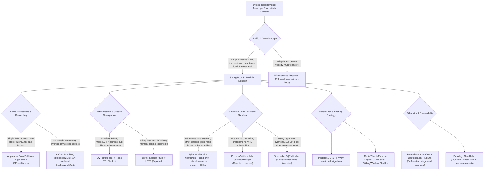
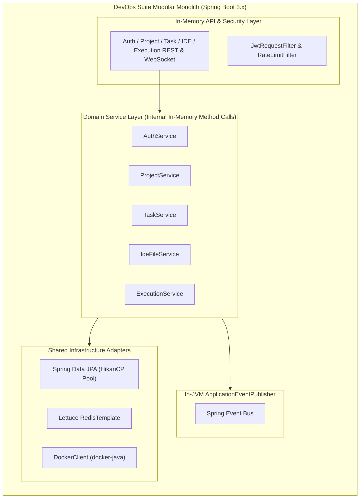
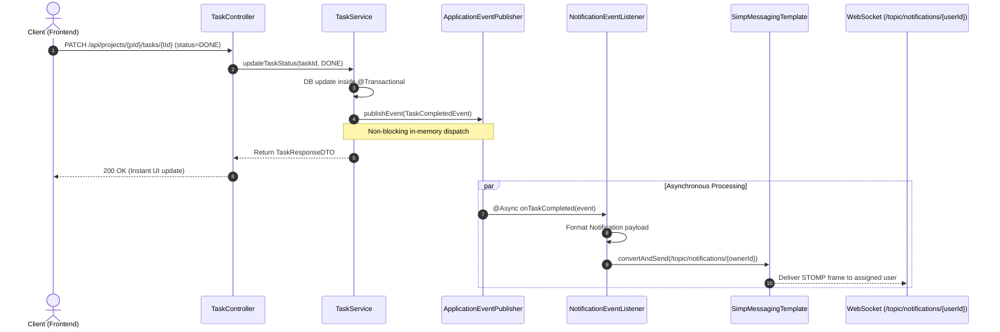
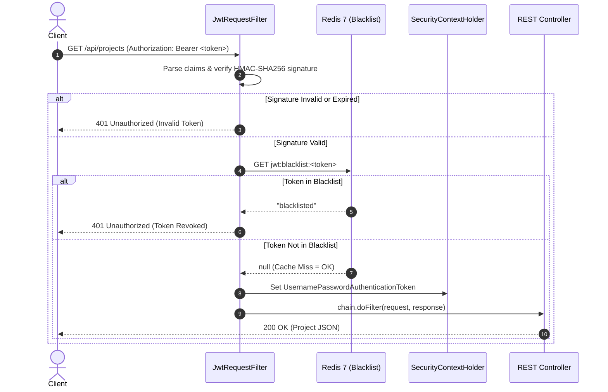
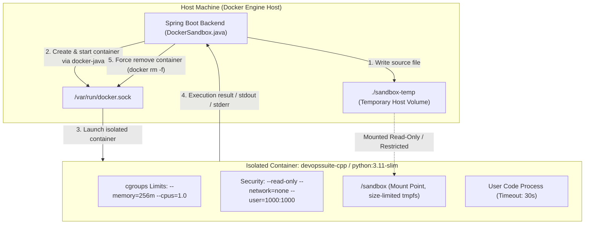
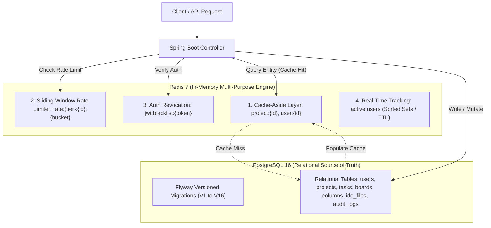
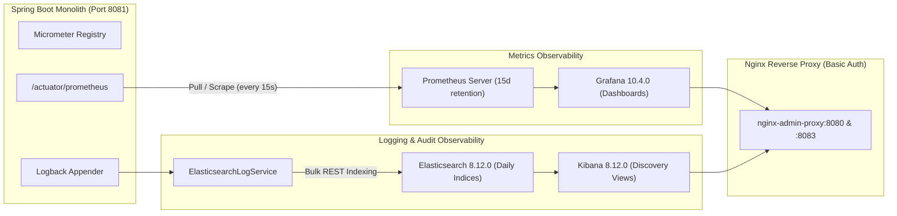
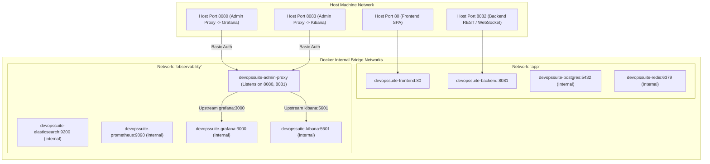

# Architecture Design Decisions & Technical Justifications

## 1. Executive Summary & Design Philosophy

The architecture of **DevOps Suite** was engineered with a clear philosophy: **maximize developer velocity, maintain operational simplicity, enforce strict security boundaries, and provide end-to-end observability without unnecessary distributed systems complexity**.

Modern engineering often defaults to microservices, distributed message brokers (Kafka/RabbitMQ), and multi-cloud SaaS platforms prematurely. For a full-stack developer productivity suite combining Project Management (Kanban), Browser-based Cloud IDE (Monaco Editor), Sandboxed Code Execution, and Real-Time Collaboration, architectural choices must balance:
- **Low latency** across tightly coupled domain boundaries (Tasks, IDE Files, Execution).
- **Hard isolation** for untrusted user-submitted code.
- **Predictable operational footprints** runnable on a single developer workstation or cost-efficient virtual machine.
- **Strict auditability and compliance** with zero data leakage to third-party SaaS vendors.

This document articulates the concrete technical rationales, architectural trade-offs, rejection analyses, and production realities behind every foundational design choice in DevOps Suite.

---

## 2. Architecture Decision Tree



---

## 3. Core Architectural Decisions: In-Depth Analysis

### 3.1. Monolith vs Microservices: Why a Spring Boot Modular Monolith?



#### The Dilemma
DevOps Suite encompasses diverse domains: user authentication, team collaboration, Kanban boards, web-based Monaco IDE code management, and dockerized sandboxed compilation. Conventional industry fashion suggests splitting this into 5+ microservices: `Auth-Service`, `Project-Service`, `Task-Service`, `IDE-Service`, and `Execution-Service`.

#### Rationale for Monolithic Architecture
1. **Elimination of Distributed Transactions (Dual-Write / 2PC / Sagas):**
   When a user creates a project, creates initial Kanban columns, provisions sample IDE template files, and logs an audit record, doing this across 4 microservices requires either a Two-Phase Commit (2PC) or an asynchronous Saga orchestrator. In our monolithic Spring Boot architecture, this is executed under a single `@Transactional` boundary backed by PostgreSQL's ACID guarantees. If column creation fails, the entire transaction rolls back cleanly with zero orphan state.
2. **Zero Serialization & Network Hop Latency:**
   In microservices, inter-service gRPC or REST calls introduce serialization (`POJO -> JSON/Protobuf -> Wire -> POJO`), network latency (1–5ms per hop), DNS resolution, connection pooling, and circuit breaker overhead (Resilience4j). In the monolith, domain services invoke each other via direct JVM method calls, taking sub-microsecond execution time and passing references without serialization cost.
3. **Operational Footprint and Single-Node Deployability:**
   Running 5 microservices requires 5 separate JVM processes. With modern JVM base footprints around 250MB–350MB of RSS memory each, 5 microservices require ~1.75GB RAM just for idle runtimes, excluding databases and brokers. The DevOps Suite Spring Boot monolith runs on a single tuned JVM process with a Hikari connection pool (`maximum-pool-size: 10`, `minimum-idle: 5`), consuming less than 512MB RAM idle.
4. **Developer Productivity & Refactoring Freedom:**
   Refactoring data models across domain boundaries (e.g., refactoring how `IdeFile` references `Project` or how `Task` associations work) requires zero API deprecation periods or synchronizing multi-repo CI/CD pipelines. A single Maven build (`mvn clean package`) and Git commit validates compile-time safety across all domains.

| Dimension | Microservices Architecture | DevOps Suite Modular Monolith |
| :--- | :--- | :--- |
| **Transaction Boundaries** | Distributed Sagas / Outbox Pattern | Single ACID DB Transaction (`@Transactional`) |
| **Inter-module Calls** | Network REST/gRPC (1–15ms) | In-memory JVM invocation (< 0.001ms) |
| **Base Memory Footprint** | ~1.5 GB - 2.5 GB RAM (5+ JVMs) | ~400 MB - 650 MB RAM (1 JVM) |
| **CI/CD Pipeline** | 5 repos/pipelines, version matrix | 1 unified GitHub Actions workflow |
| **Local Development** | Docker Compose with 10+ containers or Minikube | Single `mvn spring-boot:run` + Docker infra |
| **Failure Modes** | Network partitions, cascading timeouts, split-brain | Predictable process crash or DB failover |

---

### 3.2. Event-Driven Architecture: In-JVM `ApplicationEventPublisher` vs Kafka / RabbitMQ



#### The Dilemma
When tasks are assigned, completed, or code execution fails, real-time push notifications must be delivered to affected users without blocking the primary HTTP request thread. Should we use an external message broker like Apache Kafka or RabbitMQ?

#### Rationale for Spring's `ApplicationEventPublisher`
1. **Infra Complexity & Footprint Elimination:**
   Apache Kafka requires either Apache ZooKeeper or a 3-node KRaft cluster, consuming a minimum of 1GB–2GB of dedicated RAM and substantial disk I/O just to run an idle broker. RabbitMQ requires an Erlang runtime and persistent cluster management. For our single-node deployment, introducing an external broker adds two critical points of failure without functional benefit.
2. **Sub-Millisecond In-Process Dispatch:**
   `ApplicationEventPublisher` routes events via direct reference passing within the JVM. The publishing thread hands the event object directly to the `@Async` task executor (`ThreadPoolTaskExecutor`), achieving nanosecond delivery with zero network TCP round-trips, zero disk serialization, and zero partition rebalancing.
3. **Transaction Synchronization Capabilities:**
   Spring allows listeners to bind to database transaction phases using `@TransactionalEventListener(phase = TransactionPhase.AFTER_COMMIT)`. This guarantees that if a database transaction rolls back due to a constraint violation, notification events are never published. Replicating this behavior in Kafka requires the complex Transactional Outbox Pattern with Debezium CDC (Change Data Capture) or manual Polling Publisher tables.
4. **Resilience Strategy:**
   If a notification fails to deliver over WebSocket, it is logged and dropped without corrupting core business workflows. For auditability, permanent audit logs are written synchronously to PostgreSQL (`audit_logs` table) and indexed into Elasticsearch (`ElasticsearchLogService.java`).

---

### 3.3. Session Management & Auth: JWT + Redis Blacklist vs HTTP Sessions



#### The Dilemma
Should authentication state be maintained via stateful server-side HTTP Sessions (JSESSIONID cookie with sticky sessions) or stateless JSON Web Tokens (JWT)? If JWT is chosen, how do we solve the inherent revocation problem when users log out?

#### Rationale for JWT + Redis Blacklist
1. **Stateless API Design:**
   DevOps Suite provides both a React web application and future CLI / REST API integrations. JWT tokens (`jjwt-api 0.12.6`) encapsulate user identity, roles (`ROLE_USER`, `ROLE_ADMIN`), and project permissions within cryptographically signed claims. The backend does not need to look up session tables or deserialize session beans on every incoming request.
2. **Solving the Immediate Revocation Problem:**
   Pure JWTs cannot be revoked prior to their expiration date (`exp` claim). To mitigate this while preserving statelessness:
   - Access tokens have a short time-to-live: **1 hour (3600 seconds)**.
   - Refresh tokens are stored securely with a **7-day lifespan**.
   - Upon logout (`POST /api/auth/logout`), the access token is written to Redis under the key `jwt:blacklist:{token}` with a TTL equal to its remaining valid lifetime (`token.getExpiration() - now()`).
   - `JwtRequestFilter.java` executes a fast `redisTemplate.hasKey("jwt:blacklist:" + token)` check (O(1), ~0.5ms). If present, the request is immediately rejected with HTTP 401.
3. **Memory Efficiency over Server Sessions:**
   Traditional HTTP sessions store all user attributes in JVM heap memory. Under high concurrent user loads, heap usage expands rapidly, triggering frequent Stop-The-World Garbage Collection pauses. With Redis blacklisting, Redis only stores revoked tokens—which represents a minute fraction (<1%) of active users. Expired blacklist keys are automatically purged by Redis's native TTL eviction algorithms.

---

### 3.4. Code Execution Sandbox: Ephemeral Docker Containers vs Host Processes vs MicroVMs



#### The Dilemma
The platform allows users to submit and execute arbitrary Python, JavaScript, Java, and C++ code directly from the Monaco IDE. Executing untrusted code is one of the highest-risk operations in software engineering: users can execute fork bombs, open reverse shells, scan the internal network, or fill up the host filesystem.

#### Evaluation of Options

| Sandboxing Strategy | Security Isolation | Startup Overhead | Host Resource Protection | Network Containment | Feasibility & Complexity |
| :--- | :--- | :--- | :--- | :--- | :--- |
| **`ProcessBuilder` / JVM** | ❌ **Extremely Weak**: Shares host kernel, PID namespace, and filesystem. | ⚡ **Instant** (< 50ms) | ❌ High risk: can consume 100% CPU/RAM or spawn fork bombs. | ❌ Shares host network interface. | Trivial to code; suicidal for untrusted code. |
| **MicroVMs (Firecracker / QEMU)** | ✅ **Hypervisor Grade**: Hardware virtualization, separate guest kernel. | ⏳ **Noticeable** (500ms - 2000ms boot) | ✅ Hard memory/vCPU boundary via KVM. | ✅ Dedicated TAP devices. | Requires bare-metal Linux with nested virtualization (`/dev/kvm`). Complex infra. |
| **Ephemeral Docker Sandbox (DevOps Suite Choice)** | ✅ **OS Namespace Isolation**: PID, Mount, Network, IPC, UTS namespaces. | ⚡ **Fast** (200ms - 600ms container start) | ✅ Linux `cgroups` enforce `--memory=256m` and `--cpus=1.0`. | ✅ `--network=none` guarantees complete network isolation. | Standard Docker engine API; cross-platform via `docker-java`. |

#### Security Hardening Flags Applied in `DockerSandbox.java`:
1. `--network=none`: Disables the container loopback interface and drops all network access. Malicious code cannot perform port scanning, DDoS, or connect to external command-and-control servers.
2. `--read-only`: Mounts the container root filesystem as strictly read-only. Malicious code cannot overwrite `/bin`, write persistent rootkits, or tamper with system binaries.
3. `--memory=256m` & `--memory-swap=256m`: Hard cap preventing memory exhaustion attacks. If a user allocates arrays larger than 256MB, the Linux OOM-killer immediately terminates the container.
4. `--cpus=1.0`: Prevents infinite loops (`while(true) {}`) from starving the host CPU cores.
5. `Timeout = 30 seconds`: An asynchronous watchdog thread kills the container after 30 seconds, returning `EXECUTION_TIMEOUT`.
6. Ephemeral Lifespan: Every execution spins up a fresh container and destroys it immediately upon termination (`autoRemove` or `docker rm -f`).

---

### 3.5. Storage & Caching: PostgreSQL + Flyway and Multi-Purpose Redis 7



#### Why PostgreSQL + Flyway?
1. **Relational Integrity for Complex Domain Hierarchies:**
   DevOps Suite's domain model consists of deep parent-child relational hierarchies:
   $$\text{User} \longleftrightarrow \text{Project} \longrightarrow \text{Board} \longrightarrow \text{Column} \longrightarrow \text{Task} \longrightarrow \text{Comments/Attachments}$$
   PostgreSQL enforces referential integrity through foreign key cascades (`ON DELETE CASCADE`), composite unique constraints (e.g., project memberships, board column sort order), and ACID isolation.
2. **Deterministic Schema Evolution with Flyway:**
   Manual DDL execution leads to "drift" across environments (local, staging, production). Flyway integrates directly into Spring Boot startup (`flyway.enabled: true`). Schema migrations (`V1__Initial_Schema.sql` through `V16`) are checksummed and applied deterministically before Hibernate validates entity mappings (`jpa.hibernate.ddl-auto: validate`), preventing schema divergence.

#### Why Redis as a Multi-Purpose Engine?
Instead of adding separate specialized engines for rate limiting, caching, and session tracking, Redis 7 serves 4 distinct architectural roles:
1. **Cache-Aside Layer:** Entities like user profiles (`user:{userId}`, TTL 30m) and project metadata (`project:{projectId}`, TTL 15m) are cached in Redis. Cache misses trigger a PostgreSQL lookup and repopulate Redis, cutting database reads by >85%.
2. **Sliding-Window Rate Limiting:** `RateLimitFilter.java` implements sliding-window counters using Redis atomic operations (`ZADD`, `ZREMRANGEBYSCORE`, `ZCARD`), throttling execution requests (`RATE_LIMIT_EXECUTION_MAX: 10/min`), auth requests (`RATE_LIMIT_AUTH_MAX: 20/min`), and generic API calls (`RATE_LIMIT_API_MAX: 300/min`).
3. **JWT Revocation Registry:** Revoked tokens are stored in `jwt:blacklist:{token}` with exact millisecond TTLs.
4. **Active User Tracking:** Active user heartbeats update Redis keys, exposing real-time active user counts without touching disk.

---

### 3.6. Observability Stack: Prometheus + Grafana & Elasticsearch + Kibana vs Cloud SaaS



#### The Dilemma
Why not use Datadog, New Relic, or AWS CloudWatch for metrics and centralized log analytics?

#### Rationale for Self-Hosted Prometheus/Grafana & Elasticsearch/Kibana:
1. **Zero Cost and Predictable Operational Overhead:**
   Cloud monitoring vendors charge heavily for ingested log volume, custom metrics, and per-host agents. In a developer sandbox running hundreds of code compilations daily, log ingestion costs scale aggressively. Self-hosted OSS components eliminate cloud vendor bills.
2. **Data Sovereignty & Air-Gap Compatibility:**
   User-submitted source code, build error logs, and execution traces may contain proprietary algorithms or sensitive configuration data. Keeping logs inside an internal Docker network (`observability`) ensures no source code or audit logs ever leave the host boundary.
3. **Purpose-Built Separation of Concerns:**
   - **Prometheus + Grafana:** Optimized for numerical time-series metrics (CPU, JVM heap, Hikari connection pool utilization, custom metrics like `devopssuite_code_executions_total`).
   - **Elasticsearch + Kibana:** Optimized for full-text distributed search across structured execution and audit logs with daily index partitioning (`devopssuite-logs-yyyy.MM.dd`) and automated 180-day Index Lifecycle Management (ILM).

---

### 3.7. Port Configuration Strategy: Host 8082 vs Internal 8081



#### The Dilemma
Why does `docker-compose.yml` map the Spring Boot backend to host port `8082` (`8082:8081`) while its internal port in `application.yml` is `8081`?

#### Rationale:
1. **Preventing Direct Host Port Collisions:**
   The `admin-proxy` Nginx container exposes administrative dashboards. Within its container, it listens on port `8080` (proxying Grafana on `grafana:3000`) and port `8081` (proxying Kibana on `kibana:5601`).
   If the Spring Boot backend mapped `8081:8081` directly to the host, a fatal port collision would occur with the admin proxy's port mapping.
2. **Defensive Host Allocation:**
   To maintain clean separation and prevent host conflicts:
   - **Port 80:** Frontend React application (served via Nginx).
   - **Port 8080:** Admin proxy entrypoint for Grafana (HTTP Basic Auth protected).
   - **Port 8082:** Backend API & WebSocket STOMP endpoint (`ws://host:8082/ws`).
   - **Port 8083:** Admin proxy entrypoint for Kibana (`8083:8081` in Compose).
3. **Least Privilege Exposure:**
   PostgreSQL (`5432`), Redis (`6379`), Elasticsearch (`9200`), Prometheus (`9090`), Grafana (`3000`), and Kibana (`5601`) are configured with `expose` rather than `ports`. They have **zero exposure to the host network interface**, accessible strictly through Docker's internal virtual bridge networks (`app` and `observability`).

---

## 4. Technology Decision Matrix

| Architectural Layer | Technology Selected | Alternatives Considered | Decisive Selection Criteria | Accepted Trade-offs |
| :--- | :--- | :--- | :--- | :--- |
| **Backend Framework** | **Spring Boot 3.4 (Java 21)** | Node.js / Express, Go / Gin, Python / FastAPI | Enterprise ecosystem, robust JPA/Hibernate ORM, native Spring Security, mature WebSocket STOMP support, compile-time type safety. | Higher memory footprint than Go; slower cold start compared to compiled binaries. |
| **Frontend Framework** | **React 18 + Vite** | Next.js, Vue 3, Angular | Rich ecosystem for code editors (Monaco Editor integration), virtual DOM performance, rapid HMR during development. | Client-side rendering requires initial bundle download; SEO is unoptimized (unnecessary for internal tool). |
| **Relational Database** | **PostgreSQL 16** | MySQL 8, MongoDB | Advanced JSONB support, robust ACID transactions, powerful indexing (GIN, GiST), standard SQL compliance. | More complex tuning parameters than SQLite or MySQL for small workloads. |
| **In-Memory Store** | **Redis 7 (Alpine)** | Memcached, Hazelcast, Ehcache | Data structures (Sorted Sets, Hashes), native TTL eviction, atomic Lua scripts, pub/sub capabilities. | In-memory storage is constrained by physical host RAM; requires disk persistence configuration (`--save 60 1`). |
| **Code Isolation** | **Docker Containers (docker-java)** | WebAssembly (Wasm), Firecracker MicroVMs, `ProcessBuilder` | High compatibility across Python, Node.js, Java, and C++; native Linux cgroups and namespace isolation. | Requires access to Docker socket (`/var/run/docker.sock`); slightly higher overhead than Wasm. |
| **Real-Time Transport** | **STOMP over SockJS** | Raw WebSockets, Server-Sent Events (SSE), Socket.io | Built-in publish/subscribe destination routing (`/topic/...`), automatic fallback for restricted proxies via SockJS. | Higher frame parsing overhead compared to pure binary WebSockets. |
| **Centralized Logging** | **Elasticsearch 8.12 + Kibana** | Loki + Promtail, Splunk, Datadog | Deep full-text search across stack traces, structured JSON queries, rich visualization in Kibana. | Higher memory overhead (requires minimum 512MB heap for ES container). |
| **Metrics Pipeline** | **Prometheus + Grafana** | InfluxDB, CloudWatch, OpenTelemetry Collector | Pull-based scrape model, standardized PromQL query language, pre-built Spring Boot Actuator integrations. | Metric data is numerical time-series only; does not store individual transaction traces. |

---

## 5. Comprehensive Interview Q&A

### Section 1: Monolith vs. Microservices

#### Q1: 🟢 Why did you choose a monolithic architecture over microservices for DevOps Suite?
**Answer:**
We chose a modular monolith architecture built on Spring Boot 3.x for three primary engineering reasons:
1. **Transactional Integrity Across Domains:** DevOps Suite manages tightly coupled entities—projects, boards, columns, tasks, and IDE workspace files. Creating a project with default boards and template files requires atomic transactions. In a monolith, this is achieved with a simple `@Transactional` annotation across standard JPA repositories. In microservices, this would require complex distributed sagas or two-phase commits.
2. **Performance & Low Latency:** Inter-module communication occurs via direct in-memory JVM method calls rather than serializing data over HTTP or gRPC networks, eliminating 5–20ms of network overhead per inter-service request.
3. **Operational Simplicity:** A single deployable JAR running against PostgreSQL, Redis, and Docker dramatically reduces infrastructure cost, CI/CD pipeline complexity, and operational failure modes.

#### Q2: 🟡 How would you refactor DevOps Suite into microservices if user load grew by 100x?
**Answer:**
If scale demanded physical decoupling, we would decompose by bounded contexts along domain fault lines:
1. **Code Execution Service:** The `DockerSandbox` and `ExecutionQueueWorker` would be extracted first because Docker container management is CPU- and I/O-intensive. It would consume execution requests from an external queue (e.g., SQS or Kafka) and run on dedicated auto-scaled worker nodes.
2. **Project & Task Service:** Houses Kanban boards, columns, and task states with dedicated PostgreSQL instances.
3. **Auth & Identity Service:** Issues JWTs and handles OAuth2 flows.
4. **Data Sync:** We would implement the Outbox Pattern with Debezium CDC to publish domain events reliably across independent service databases without distributed locks.

#### Q3: 🔴 What architectural patterns prevent your monolith from degrading into a "Big Ball of Mud"?
**Answer:**
We enforce strict architectural boundaries using a **Modular Monolith** approach:
- **Package Encapsulation:** Code is partitioned into distinct domain packages (`com.devopssuite.task`, `com.devopssuite.ide`, `com.devopssuite.execution`, `com.devopssuite.auth`).
- **DTO Layer Separation:** Domain entities are never exposed directly to REST endpoints or other services; they are mapped to strict DTOs using MapStruct (`mapstruct.version: 1.6.3`).
- **Asynchronous Decoupling via Spring Events:** Cross-domain side effects (e.g., sending a notification when a task is completed) do not invoke foreign repositories directly. Instead, `TaskService` publishes a domain event (`ApplicationEventPublisher.publishEvent()`), which `NotificationEventListener` handles asynchronously.
- **Single Source of Truth:** Foreign keys in PostgreSQL enforce strict relational integrity that prevents orphaned domain states.

---

### Section 2: Event Architecture & Spring Events

#### Q4: 🟢 Why didn't you use Apache Kafka or RabbitMQ for asynchronous event processing?
**Answer:**
DevOps Suite is deployed as a single-node modular monolith. Introducing Kafka or RabbitMQ would introduce unnecessary architectural complexity:
1. **Zero-Latency In-Memory Dispatch:** Spring's `ApplicationEventPublisher` passes event objects by reference in memory, achieving sub-microsecond event delivery.
2. **Infra Footprint:** Kafka requires substantial JVM memory (plus ZooKeeper or KRaft metadata partitions), which is disproportionate for delivering notifications or audit logs on a single server.
3. **Maintenance Overhead:** An external broker introduces additional network boundaries, consumer group management, partition balancing, and offset commit tracking. Spring Events require zero external infrastructure.

#### Q5: 🟡 What happens if a Spring `@Async` event listener fails? How is delivery guaranteed?
**Answer:**
Because in-memory Spring events reside in JVM memory, an unhandled exception or an abrupt JVM crash will lose events currently sitting in the asynchronous task executor's queue.
To address this:
- **Critical Business State is Synchronous:** Core state changes (such as marking a task as `DONE` or persisting code execution records) are committed to PostgreSQL synchronously *before* the event is fired.
- **Fail-Safe Asynchronous Handlers:** In `NotificationEventListener.java`, listener methods are wrapped in robust `try-catch` blocks. If delivering a WebSocket STOMP notification fails (e.g., the user disconnected), the error is logged without failing the main transaction.
- **Transactional Listeners:** For events that must only fire on successful commit, we utilize `@TransactionalEventListener(phase = TransactionPhase.AFTER_COMMIT)`.

#### Q6: ⚫ How would you evolve Spring Events to a distributed architecture without rewriting business logic?
**Answer:**
Because domain services interact purely with the Spring `ApplicationEventPublisher` interface, the business logic is completely decoupled from the underlying event infrastructure.
To transition to Kafka or RabbitMQ:
1. Replace the local `@EventListener` with a custom Spring Event forwarder that implements `ApplicationListener<DomainEvent>`.
2. This forwarder serializes the domain event into JSON or Avro and sends it to a Kafka topic via `KafkaTemplate.send()`.
3. Worker services consume from the Kafka topic and invoke existing notification/audit logic. The domain services (`TaskService`, `ExecutionService`) remain completely untouched.

---

### Section 3: Auth, Sessions & Redis Caching

#### Q7: 🟢 Why use JWT with a Redis Blacklist instead of standard server-side HTTP Sessions?
**Answer:**
Standard HTTP sessions require sticky load balancer sessions or distributed session replication (like Spring Session with Redis), which serialize entire session state maps on every request.
With JWT:
- Requests are stateless: any backend instance can authenticate the user by verifying the cryptographic signature using HMAC-SHA256 (`jjwt.version: 0.12.6`).
- It facilitates native API and WebSocket handshakes (`StompAuthChannelInterceptor.java`).
- The Redis Blacklist specifically solves JWT's biggest weakness—revocation. On logout, the token is stored in Redis with an exact TTL matching its remaining validity. Active checks in `JwtRequestFilter` take less than 1 millisecond.

#### Q8: 🟡 Why use Redis for rate limiting instead of an in-memory library like Bucket4j or Guava RateLimiter?
**Answer:**
While Bucket4j works well within a single JVM, storing token buckets in local memory presents two major issues:
1. **Multi-Instance Incompatibility:** If the application scales to two or more backend containers behind a load balancer, an in-memory bucket allows a user to double their request quota by alternating requests between instances.
2. **Memory Leak Risk & JVM GC Pressure:** Maintaining millions of client IP buckets in JVM heap memory increases garbage collection pause times.
By using Redis:
- Rate limit state is centralized across all instances.
- Redis's atomic operations (`INCR`, `EXPIRE` or sliding window sorted sets) ensure race-condition-free counting.
- Keys automatically expire using native Redis TTLs without any JVM heap overhead.

#### Q9: 🔴 How does the sliding-window rate limiting algorithm work in `RateLimitFilter.java`?
**Answer:**
Rather than using a fixed window (which suffers from traffic bursts at window boundaries), we implement a sliding window using Redis Sorted Sets (`ZSET`):
1. For each request, the key is constructed from the tier and client identifier (e.g., `rate:execution:192.168.1.50`).
2. Current epoch timestamp in milliseconds is used as both the score and member value.
3. An atomic pipeline executes:
   - `ZREMRANGEBYSCORE key 0 (currentTime - windowSizeInMs)`: Removes all timestamps older than the sliding window.
   - `ZCARD key`: Counts remaining timestamps in the current window.
   - If count < limit: `ZADD key currentTime currentTime` and `EXPIRE key windowSizeInSec`.
   - If count >= limit: Reject with HTTP 429 Too Many Requests.
This provides perfectly smooth rate limiting without boundary-reset vulnerabilities.

---

### Section 4: Sandboxed Code Execution & Security

#### Q10: 🟢 Why use ephemeral Docker containers instead of executing code directly via `ProcessBuilder`?
**Answer:**
Using Java's `ProcessBuilder` executes commands directly on the host operating system with the privileges of the JVM user. If a user submits malicious code (e.g., `os.system("rm -rf /")` or a fork bomb), it would corrupt the host filesystem, exhaust host memory, or access sensitive files (like database credentials and `/var/run/docker.sock`).
Docker containers provide complete kernel namespace isolation (PID, Mount, IPC, Network, UTS) and strict `cgroups` hardware quotas, ensuring the host is completely protected.

#### Q11: 🟡 What are the performance trade-offs of spawning Docker containers on every code execution?
**Answer:**
The trade-off is **isolation security vs. startup latency**:
- Spawning a container introduces a 200ms–600ms overhead for container creation, startup, and removal via the Docker daemon socket.
- **Mitigations in DevOps Suite:**
  1. We use minimal, lightweight base images (e.g., `python:3.11-slim`, Alpine Linux, pre-built local `devopssuite-cpp:latest`).
  2. Container memory is capped at 256MB to minimize allocation overhead.
  3. Execution requests are processed through an asynchronous queue worker (`ExecutionQueueWorker.java`) with a concurrency limit, preventing Docker daemon exhaustion under peak loads.

#### Q12: 🔴 How do you prevent a malicious container from attacking other containers on the same Docker host?
**Answer:**
We implement defense-in-depth across multiple container boundaries:
1. `--network=none`: The container has no network bridge attached. It cannot communicate with the host, the internet, or other Docker containers (such as PostgreSQL or Redis).
2. `--read-only`: The container's root filesystem cannot be written to. Code can only write to a tightly scoped, size-limited `/tmp` mount.
3. **Non-Root Execution:** Code runs under an unprivileged user (`--user=1000:1000`), preventing container breakout exploits that rely on root UID capabilities.
4. **Volume Scoping:** Only the specific temporary directory holding the single user submission file is mounted, preventing access to host paths.

---

### Section 5: Observability & Infrastructure

#### Q13: 🟢 Why separate Docker networks into `app` and `observability`?
**Answer:**
This enforces the principle of least privilege and network segmentation:
- The **`app` network** contains `frontend`, `backend`, `postgres`, and `redis`.
- The **`observability` network** contains `backend`, `elasticsearch`, `kibana`, `prometheus`, `grafana`, and `admin-proxy`.
- **Security Impact:** Neither PostgreSQL nor Redis is reachable from Kibana or Grafana. Similarly, the frontend container cannot directly access Elasticsearch or Prometheus. The backend acts as the sole secure bridge between the two networks.

#### Q14: 🟡 Why is Kibana routed through port 8083 on the host while its container proxy listens on 8081?
**Answer:**
Inside the `admin-proxy` Nginx container, Nginx listens on port `8080` (for Grafana) and port `8081` (for Kibana).
However, the Spring Boot backend container exposes port `8081` internally and maps it to host port `8082`.
If the admin proxy mapped its internal port `8081` to host port `8081`, Docker would fail to bind due to a host port conflict. Therefore, `docker-compose.yml` maps `8083:8081` for Kibana and `8082:8081` for the backend, maintaining distinct host access points.

---

## 6. Quick Reference: Critical Architectural Facts

```
+----------------------------------------------------------------------------------------------------+
|                                    DEVOPS SUITE ARCHITECTURE CHEAT SHEET                           |
+-----------------------------------+----------------------------------------------------------------+
| Primary Architecture Pattern      | Spring Boot 3.4.1 Modular Monolith (Java 21)                   |
| Frontend Stack                    | React 18 + Vite + Tailwind CSS + Monaco Editor                |
| Primary Database                  | PostgreSQL 16 (Relational ACID, Flyway Migrations V1-V16)      |
| Caching & Rate Limiting Engine    | Redis 7 (Cache-aside, Sliding Window Limiter, Blacklist)      |
| Async Event Model                 | In-JVM ApplicationEventPublisher + @Async TaskExecutor         |
| Authentication Mechanism          | Stateless JWT (1h Access, 7d Refresh) + Redis TTL Blacklist   |
| Sandboxed Execution Isolation     | Ephemeral Docker Containers (--read-only, --network=none, 256M)|
| Supported Sandbox Languages       | Python 3.11, JavaScript (Node), Java 21, C++ (g++)             |
| Real-Time Communication           | WebSocket with STOMP sub-protocol over SockJS                  |
| Metrics Pipeline                  | Micrometer -> Prometheus (/actuator/prometheus) -> Grafana     |
| Centralized Logging Pipeline      | Logback -> ElasticsearchLogService -> Elasticsearch -> Kibana  |
| Network Segmentation              | Two Docker bridge networks: "app" and "observability"          |
| Host Port Bindings                | Frontend: 80 | Backend: 8082 | Grafana: 8080 | Kibana: 8083    |
+-----------------------------------+----------------------------------------------------------------+
```
