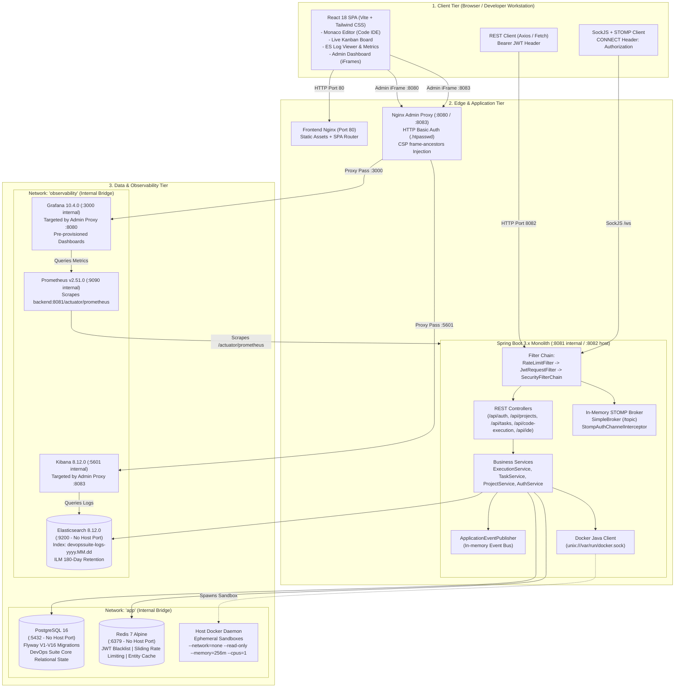
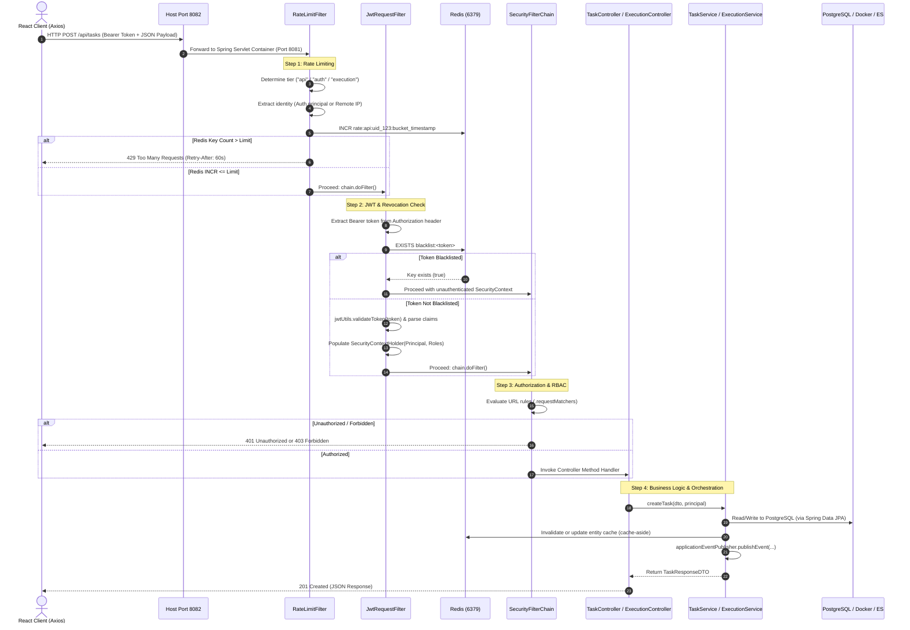
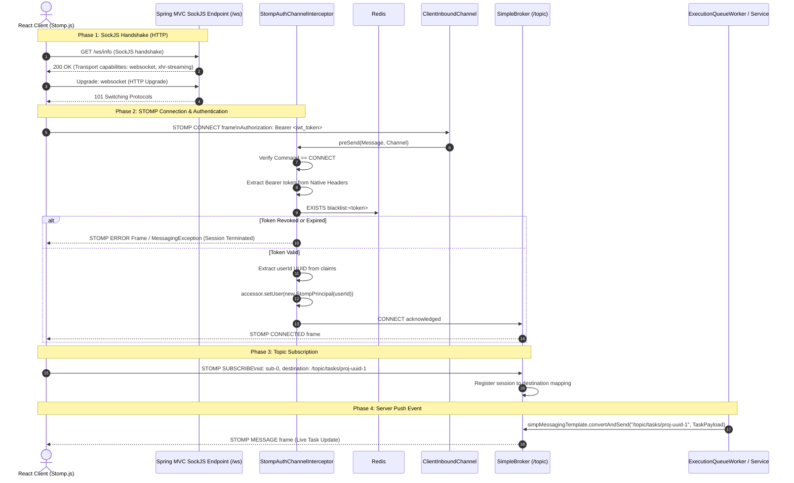
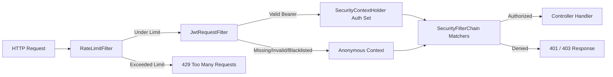
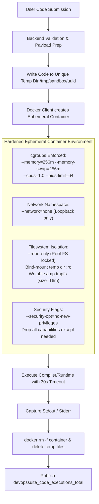

# System Design & Architecture Deep Dive — DevOps Suite

An exhaustive technical guide and interview preparation reference for the end-to-end architecture, network topology, request lifecycle, real-time message brokering, and operational boundaries of the **DevOps Suite** platform.

---

## 1. High-Level System Architecture

DevOps Suite is engineered as a robust, production-ready, full-stack developer productivity platform. The architecture balances developer ergonomics, strict isolation, and high observability by adopting a **modular Spring Boot monolith** paired with a **React 18 Single Page Application (SPA)**, containerized sandboxes, dual network bridges, and dedicated persistence/observability clusters.

### 3-Tier Architecture Overview



---

### Component Responsibilities & Technology Matrix

| Component | Technology | Network Scope | Exposed Host Port | Core Architectural Responsibility |
| :--- | :--- | :--- | :--- | :--- |
| **Frontend** | React 18, Vite, Tailwind CSS, Monaco Editor | `app` | `80:80` (prod Nginx) / `5173` (dev) | Client UI, Monaco code workspace, real-time Kanban, SockJS STOMP client, embedded Grafana/Kibana iframes. |
| **Backend Monolith** | Spring Boot 3.x, Java 21, Maven | `app` & `observability` | `8082:8081` | Single backend runtime handling REST APIs, WebSocket broker, Docker orchestration, auth, logging, and metrics. |
| **PostgreSQL** | PostgreSQL 16 Alpine | `app` | **None** (`expose: 5432`) | ACID relational storage. Stores users, projects, project members, tasks, and `IdeFile` virtual file systems. Schema managed via 16 Flyway migrations (`V1`–`V16`). |
| **Redis** | Redis 7 Alpine | `app` | **None** (`expose: 6379`) | High-speed in-memory store. Handles JWT invalidation blacklist (`blacklist:<token>`), sliding-window rate limit counters (`rate:<tier>:<identity>:<bucket>`), and entity caching (`user:<id>`, `project:<id>`). |
| **Docker Engine** | Docker Host Daemon via Socket | Local Host Mount | `/var/run/docker.sock` | Executes untrusted code inside hardened, ephemeral containers. Strict constraints: `--network=none`, `--read-only`, `--memory=256m`, `--cpus=1`, 30s timeout. |
| **Elasticsearch** | Elasticsearch 8.12.0 | `observability` | **None** (`expose: 9200`) | Distributed structured log store. Ingests execution logs and audit records into daily indices (`devopssuite-logs-yyyy.MM.dd`) with 180-day ILM retention. |
| **Kibana** | Kibana 8.12.0 | `observability` | **None** (`expose: 5601`) | Log discovery and visualization UI. Provisioned with default Data Views via `kibana-init`. Accessible only via Admin Proxy. |
| **Prometheus** | Prometheus v2.51.0 | `observability` | **None** (`expose: 9090`) | TSDB pulling application metrics from `http://backend:8081/actuator/prometheus` on a 15-second scrape interval. 15-day storage retention. |
| **Grafana** | Grafana 10.4.0 | `observability` | **None** (`expose: 3000`) | Metrics dashboard engine. Provisioned with 2 automated dashboards (JVM/System + Application Metrics). Configured with `GF_SECURITY_ALLOW_EMBEDDING=true`. |
| **Nginx Admin Proxy**| Nginx 1.27 Alpine | `observability` | `8080:8080`, `8083:8081` | Edge security gateway for monitoring. Enforces HTTP Basic Auth (`.htpasswd`), strips upstream `X-Frame-Options`, and injects strict CSP `frame-ancestors` headers. |

---

## 2. Deep Dive into the Request Lifecycle

Understanding how data traverses the system from the browser down to raw storage or the Linux kernel is essential for troubleshooting performance regressions, security bypasses, and concurrency bottlenecks.

### 2.1 HTTP REST Request Processing Pipeline

When an HTTP client executes a mutating or query request (e.g., `POST /api/tasks` or `POST /api/code-execution/run`):



#### Detailed Step Breakdown:
1. **Host Ingress**: The host receives the request on port `8082` and forwards it across the `app` Docker bridge network to internal container port `8081`.
2. **`RateLimitFilter` Execution**:
   - Classifies the request into one of three tiers based on URI prefix:
     - **Execution Tier** (`/api/code-execution/**`): 10 req/min.
     - **Auth Tier** (`/api/auth/**`): 20 req/min.
     - **API Tier** (all other application traffic): 300 req/min.
   - Computes time bucket: `bucket = currentTimeMillis / 1000 / windowSeconds`.
   - Generates Redis key: `rate:<tier>:<identity>:<bucket>`.
   - Atomic `INCR` operation. If count equals 1, sets an expiry TTL (`windowSeconds + 5s`).
   - If count exceeds the limit, immediately writes a JSON 429 response, increments the Prometheus counter `devopssuite_rate_limit_blocked_total`, and aborts downstream filter processing.
   - **Fail-Open Strategy**: Any Redis connectivity exception is caught and logged at debug level, allowing the request to proceed rather than halting system operations during Redis maintenance.
3. **`JwtRequestFilter` Execution**:
   - Inspects the `Authorization` header for a `Bearer <token>` string.
   - Queries Redis for token revocation: `redisTemplate.hasKey("blacklist:" + token)`. If blacklisted, skips authentication context Population.
   - Validates HMAC signature, token expiration, and issuer via `JwtUtils`.
   - Extracts subject UUID and roles (e.g., `ROLE_ADMIN`, `ROLE_MEMBER`).
   - Injects a `UsernamePasswordAuthenticationToken` into the thread-local `SecurityContextHolder`.
4. **`SecurityFilterChain` Evaluation**:
   - Disables CSRF (stateless API model using bearer tokens).
   - Enforces endpoint permissions (e.g., `/actuator/prometheus` is permitAll; `/actuator/**` requires `ROLE_ADMIN`).
5. **Controller & Service Layer**:
   - Spring MVC maps the payload via Jackson `ObjectMapper`.
   - Business service executes validation and transactional persistence (`@Transactional`).
   - Publishes domain events to the internal `ApplicationEventPublisher`.

---

### 2.2 Real-time STOMP / WebSocket Flow

DevOps Suite uses STOMP over SockJS to stream live Kanban task state, Docker stdout/stderr logs, and in-app toast notifications.



#### Why Authenticate at the STOMP Layer Instead of the HTTP Layer?
During the initial SockJS handshake (`GET /ws/info` and subsequent WebSocket upgrade), standard web browsers **do not allow custom HTTP Authorization headers** to be set on native WebSocket constructor calls.
- Consequently, `/ws/**` is set to `.permitAll()` in `SecurityConfig.java`.
- Security is strictly applied at the application protocol layer inside `StompAuthChannelInterceptor.java`.
- The interceptor intercepts the inbound `CONNECT` frame, extracts `Authorization: Bearer <token>` from the STOMP native headers, verifies the Redis blacklist and token expiry, and sets a custom `StompPrincipal(userId)`.
- If authentication fails, a `MessagingException` is thrown, instantly tearing down the TCP socket.

---

## 3. Network Topology & Security Boundaries

DevOps Suite enforces a multi-layered defense-in-depth model utilizing container network namespaces, proxying, and strict credential isolation.

```
       ======================= HOST OS BOUNDARY =======================
       |                                                              |
       |   [Port 80]              [Port 8082]       [Port 8080 / 8083]|
       |       |                       |                    |         |
=======|=======|=======================|====================|=========|=======
       |       v                       v                    v         |
       |  +----------+         +---------------+    +---------------+ |
       |  | frontend |         |    backend    |    |  admin-proxy  | |
       |  | (nginx)  |         | (Spring Boot) |    |    (nginx)    | |
       |  +----+-----+         +-------+-------+    +-------+-------+ |
       |       |                       |                    |         |
       | ======|=======================|====================|======== |
       |       |     BRIDGE NETWORK: 'app'                  |         |
       |       |                                            |         |
       |       +-----------> [postgres:5432]                |         |
       |       |             (NO HOST PORT)                 |         |
       |       |                                            |         |
       |       +-----------> [redis:6379]                   |         |
       |       |             (NO HOST PORT)                 |         |
       |       |                                            |         |
       |       v                                            |         |
       |  [backend:8081] <----------------------------------+         |
       |                                                              |
       | ============================================================ |
       |             BRIDGE NETWORK: 'observability'                  |
       |                                                              |
       |  [backend:8081] -----------------------------------+         |
       |       |                                            |         |
       |       +-----------> [elasticsearch:9200]           |         |
       |       |             (NO HOST PORT)                 |         |
       |       |                   ^                        |         |
       |       |                   |                        v         |
       |       |             [kibana:5601] <-------- [admin-proxy:8081|
       |       |             (NO HOST PORT)         (mapped to 8083)  |
       |       |                                                      |
       |       +-----------> [prometheus:9090]                        |
       |                     (NO HOST PORT)                           |
       |                           ^                                  |
       |                           |                                  |
       |                     [grafana:3000] <------- [admin-proxy:8080|
       |                     (NO HOST PORT)         (mapped to 8080)  |
       ================================================================
```

### 3.1 Network Isolation: `app` vs `observability`

Docker Compose defines two isolated user-defined bridge networks:

1. **The `app` Network**:
   - **Members**: `frontend`, `backend`, `postgres`, `redis`.
   - **Purpose**: Carries user-facing web traffic, business logic execution, database queries, and session/cache lookups.
   - **Zero-Trust Rule**: The core database (`postgres`) and cache (`redis`) expose ports **only inside this bridge network**. Neither has a `ports:` mapping to the host operating system. An attacker on the external network cannot initiate a raw TCP connection to Redis (preventing unauthorized memory scraping) or PostgreSQL (preventing credential brute-forcing).

2. **The `observability` Network**:
   - **Members**: `backend`, `elasticsearch`, `kibana`, `kibana-init`, `prometheus`, `grafana`, `admin-proxy`.
   - **Purpose**: Dedicated to metrics harvesting, log ingestion, query execution, and monitoring dashboards.
   - **Bridge Isolation**: The `frontend`, `postgres`, and `redis` containers have no network interfaces on the `observability` network. If an attacker breaches the frontend web server, they have zero routing capability to Elasticsearch, Kibana, or Prometheus.

3. **Backend as the Dual-Homed Bridge**:
   - The `backend` container is the **only core application service attached to both networks**.
   - It acts as an application-layer proxy: it writes logs to Elasticsearch and exports metrics to Prometheus via the `observability` network, while reading/writing transactional data from Postgres/Redis on the `app` network.

---

### 3.2 The Nginx Admin Proxy Gateway

The observability engines (Grafana and Kibana) contain sensitive operational data, cluster topology details, and internal execution logs. Exposing their native web ports (3000 and 5601) directly to the internet is a severe vulnerability.

DevOps Suite deploys an **Nginx Admin Proxy** (`admin-proxy`) with specific architectural controls:

- **Host Port Mapping**:
  - `8080:8080` $\rightarrow$ Proxies to Grafana internal port `3000`.
  - `8083:8081` $\rightarrow$ Proxies to Kibana internal port `5601` (host port `8083` is chosen to avoid collision with internal backend `8081` or host `8082`).
- **HTTP Basic Authentication**:
  - Both `/` endpoints enforce `auth_basic "DevOps Suite — Admin Access Required"`.
  - Passwords are encrypted using Apache `htpasswd` inside a shared volume (`htpasswd_vol`) generated by a one-shot container `htpasswd-init`.
- **IFrame Embedding Security (`CSP` and `X-Frame-Options`)**:
  - The React frontend provides an embedded Admin Dashboard (`AdminDashboard.jsx`) allowing administrators to view Kibana logs and Grafana dashboards without leaving the SPA.
  - Native Grafana and Kibana servers emit `X-Frame-Options: DENY` by default.
  - The Admin Proxy explicitly hides upstream `X-Frame-Options` headers:
    ```nginx
    proxy_hide_header X-Frame-Options;
    add_header Content-Security-Policy "frame-ancestors 'self' http://localhost http://localhost:80 http://localhost:5173" always;
    ```
  - This allows framing *exclusively* from trusted frontend origins while completely protecting against third-party Clickjacking attacks.

---

## 4. Deep-Dive Interview Questions & Answers

### 🟢 Basic Concepts

#### Q1: "Describe the overall system architecture of DevOps Suite."
> **Interviewer Focus:** Broad architectural awareness, component identification, and technology choices.

**Answer:**
DevOps Suite is structured as a **3-tier, full-stack developer productivity platform**:

1. **Client Tier**: A modern Single Page Application built with **React 18**, **Vite**, and **Tailwind CSS**. It incorporates the **Monaco Editor** for browser-based code editing, an interactive Kanban board for task tracking, and embedded telemetry dashboards for administrators.
2. **Application Tier**: A modular **Spring Boot 3.x monolith** running on **Java 21**. It unifies RESTful domain APIs, a STOMP-over-SockJS WebSocket message broker for real-time notifications and log streaming, an internal `ApplicationEventPublisher` event bus, and a Docker daemon orchestration client.
3. **Data & Observability Tier**:
   - **PostgreSQL 16**: Primary relational store for users, projects, tasks, and file entities, version-controlled across 16 Flyway migrations.
   - **Redis 7**: Provides token blacklisting for immediate JWT revocation, sliding-window rate limiting, and entity caching.
   - **Elasticsearch 8 & Kibana 8**: Daily indexed log aggregation (`devopssuite-logs-*`) with full-text search.
   - **Prometheus & Grafana**: Pull-based metric aggregation (JVM, container stats, custom business counters) and pre-provisioned telemetry dashboards.
   - **Docker Daemon Sandbox**: Ephemeral container execution environment for executing untrusted user code in Python, JavaScript, Java, and C++.

Traffic is segmented using two internal Docker bridge networks (`app` and `observability`), with an Nginx Admin Proxy guarding telemetry endpoints via HTTP Basic Auth.

---

#### Q2: "What is the difference between an ephemeral Docker sandbox and a standard long-running container service in this architecture?"
> **Interviewer Focus:** Docker lifecycle, security boundaries, and operational knowledge.

**Answer:**
- **Standard Long-Running Containers**: Services like `backend`, `postgres`, and `redis` are provisioned at boot via Docker Compose. They run continuously with persistent volume mounts (`postgres_data`, `redis_data`), communicate across shared Docker networks via internal DNS names, and have restart policies like `restart: unless-stopped`.
- **Ephemeral Docker Sandboxes**: Spawned on-demand by the backend (`DockerSandbox.java`) via the Docker API socket (`/var/run/docker.sock`) exclusively to execute a single user code submission. 
  - They exist for a maximum of 30 seconds.
  - They are created with `--network=none` (no network interfaces except loopback), `--read-only` (read-only root filesystem), `--memory=256m`, and `--cpus=1`.
  - Once compilation/execution completes, stdout/stderr is captured, the container is forcibly stopped and pruned (`docker rm -f`), and temporary compilation files on the host are wiped.

---

### 🟡 Intermediate Concepts

#### Q3: "Walk me through how an incoming HTTP request travels through your security and filter chain."
> **Interviewer Focus:** Servlet filter ordering, Spring Security configuration, and fail-open/fail-closed semantics.

**Answer:**
In `SecurityConfig.java`, filters are registered in a deliberate sequence:
`RateLimitFilter` $\rightarrow$ `JwtRequestFilter` $\rightarrow$ `UsernamePasswordAuthenticationFilter` $\rightarrow$ Endpoint.



1. **`RateLimitFilter` (First Line of Defense)**:
   - Evaluates the URI to categorize into a tier: `execution` (10 req/min), `auth` (20 req/min), or `api` (300 req/min).
   - Identifies the requester using the authenticated user ID (if already established) or client IP (inspecting `X-Forwarded-For`).
   - Increments a Redis counter key: `rate:<tier>:<identity>:<bucket>`.
   - If the counter exceeds the threshold, it writes a `429 Too Many Requests` response with a `Retry-After: 60` header and records the `devopssuite_rate_limit_blocked_total` metric. Downstream filters are bypassed.
   - Redis communication errors trigger a **fail-open** fallback so user traffic is not disrupted by cache degradation.
2. **`JwtRequestFilter` (Authentication)**:
   - Parses the `Authorization: Bearer <token>` header.
   - Queries Redis: `hasKey("blacklist:" + token)`. If blacklisted (e.g., user clicked logout), authentication is rejected.
   - If valid, unpacks JWT claims (user ID subject, comma-separated roles) and sets a `UsernamePasswordAuthenticationToken` in Spring's thread-local `SecurityContextHolder`.
3. **`SecurityFilterChain` (Authorization & RBAC)**:
   - Matches URL patterns against assigned roles: `/actuator/prometheus` and `/auth/**` are `permitAll()`; `/actuator/**` and `/api/metrics/dashboard` require `ROLE_ADMIN`.
   - If authorization passes, the request reaches the target `@RestController`.

---

#### Q4: "Why did you isolate your containers across two Docker bridge networks instead of using a single default network?"
> **Interviewer Focus:** Network security, blast radius containment, and infrastructure architecture.

**Answer:**
Using a single flat network creates unnecessary security exposure. If any container running on a bridge network is compromised, an attacker can scan, discover, and access any other container on that same bridge using Docker's internal DNS resolver.

We established two distinct bridge networks:
1. **`app` Network**: Contains `frontend`, `backend`, `postgres`, and `redis`.
2. **`observability` Network**: Contains `backend`, `elasticsearch`, `kibana`, `prometheus`, `grafana`, and `admin-proxy`.

**Architectural Advantages:**
- **Blast Radius Reduction**: If the public-facing `frontend` Nginx instance suffers a remote code execution (RCE) exploit, the attacker is confined to the `app` network. They cannot access Elasticsearch, Kibana, Prometheus, or the Admin Proxy because the frontend container has no virtual network interface or routing path to the `observability` network.
- **Protection of Core Telemetry**: Elasticsearch runs with `xpack.security.enabled=false` inside the cluster to maximize throughput and minimize overhead in our single-node setup. By isolating it strictly to the `observability` network without host port mappings, external actors cannot interact with port 9200.
- **Controlled Ingress**: The `backend` acts as a controlled gateway bridging both domains, pulling from data stores while pushing telemetry outward.

---

### 🔴 Advanced Architectural Scenarios

#### Q5: "How does the platform handle WebSocket authentication, and why is standard HTTP Authorization header handling insufficient for STOMP over SockJS?"
> **Interviewer Focus:** WebSocket protocol nuances, W3C WebSocket API limitations, STOMP framing, and Spring messaging pipelines.

**Answer:**
The standard browser `WebSocket` constructor (`new WebSocket(url)`) does not allow JavaScript clients to send arbitrary HTTP headers (such as `Authorization: Bearer <jwt>`) during the initial HTTP upgrade handshake. Furthermore, SockJS uses HTTP emulation transports (like XHR streaming or polling) where header customization varies.

**The Solution:**
1. **Permissive Handshake**: In `SecurityConfig.java`, the initial HTTP SockJS handshake route `/ws/**` is set to `.permitAll()`. This allows the initial HTTP `101 Switching Protocols` handshake to succeed without an HTTP auth header.
2. **STOMP Protocol-Level Authentication**:
   - Authentication is deferred to the STOMP connection frame. The frontend client sends the JWT inside the STOMP `CONNECT` frame:
     ```stomp
     CONNECT
     accept-version:1.2,1.1,1.0
     heart-beat:10000,10000
     Authorization:Bearer eyJhbGciOi...
     ```
   - In `WebSocketConfig.java`, we attach a custom `StompAuthChannelInterceptor` to the `ClientInboundChannel`.
   - The interceptor intercepts the `CONNECT` frame:
     - Extracts the bearer token from native headers.
     - Performs a Redis lookup (`blacklist:<token>`) to prevent revoked tokens from connecting.
     - Validates the token signature and expiration via `JwtUtils`.
     - Sets a custom `StompPrincipal(userId)` on the session accessor:
       ```java
       accessor.setUser(new StompPrincipal(userId));
       ```
3. **Session-Bound Routing**: Once authenticated, subsequent frames (`SUBSCRIBE`, `SEND`) inherit this authenticated principal, allowing Spring's `SimpMessagingTemplate` to securely target specific users via `/topic/notifications/{userId}` without passing tokens on every frame.

---

#### Q6: "Explain the end-to-end design of your Docker code execution engine. How do you prevent resource exhaustion, malicious code escapes, and network snooping?"
> **Interviewer Focus:** OS-level isolation, Linux namespaces, cgroups, resource limits, and attack vector mitigation.

**Answer:**
The code execution engine (`DockerSandbox.java`) allows users to run arbitrary Python, JavaScript, Java, and C++ code. Because untrusted user code could attempt fork bombs, cryptomining, disk wiping, or host network reconnaissance, execution is strictly sandboxed.



**Security and Isolation Controls:**
1. **Network Disconnection (`--network=none`)**: The sandbox container has no access to the `app` or `observability` networks or the host network. It cannot initiate outbound HTTP calls, perform port scans, or reach Postgres/Redis.
2. **Resource Throttling (`cgroups`)**:
   - Memory is capped at `256m` with swap capped at `256m` to avoid host OOM kernel panics.
   - CPU quota is restricted to `1.0` core to prevent denial-of-service to adjacent containers.
   - PIDs limit is clamped to prevent fork bombs (`:(){ :|:& };:`).
3. **Filesystem Lockdown**:
   - Container root filesystem is mounted `--read-only`.
   - The user's source code directory is mounted read-only into the sandbox.
   - A tiny, in-memory `tmpfs` is mounted at `/tmp` (e.g., 16 MB) strictly for compiler scratch files.
4. **Execution Timeouts**: A Java `CompletableFuture` / watchdog enforces a strict 30-second execution deadline. If exceeded, the container process is terminated (`docker kill`) and a timeout status is logged to Elasticsearch.
5. **No Local Privilege Escalation**: Run with `--security-opt=no-new-privileges` to prevent setuid binary exploits.

---

### ⚫ Expert & Whiteboard Scenarios

#### Q7: "If you were to draw this on a whiteboard during a system design interview, what architectural trade-offs would you emphasize?"
> **Interviewer Focus:** Technical self-awareness, pragmatic engineering, trade-off evaluation, and scaling foresight.

**Answer:**
When presenting this architecture on a whiteboard, I focus on four deliberate trade-offs:

1. **Modular Monolith vs. Microservices**:
   - *Decision*: We built DevOps Suite as a modular Spring Boot monolith rather than splitting it into Auth, Tasks, Code Execution, and Logging microservices.
   - *Rationale*: At our target scale, a modular monolith drastically simplifies transaction boundaries, avoids distributed tracing complexity, eliminates network hop latency between services, and allows deployment on a single cloud VM.
   - *Pragmatic Boundary*: We achieved decoupling internally using Spring's `ApplicationEventPublisher`. For example, when a task is completed, `TaskService` publishes a `TaskCompletedEvent`. `NotificationEventListener` processes this event asynchronously without tight coupling.

2. **In-Memory STOMP SimpleBroker vs. External Message Broker (RabbitMQ/Kafka)**:
   - *Decision*: We utilized Spring's built-in in-memory `SimpleBroker` for `/topic` routing instead of running RabbitMQ or Kafka.
   - *Rationale*: Eliminates operational overhead and memory footprint.
   - *Trade-off*: An in-memory broker prevents horizontal scaling across multiple backend nodes, as STOMP sessions are tied to a single JVM's memory. In our scale-up roadmap, switching to RabbitMQ as a full STOMP relay requires changing just one line in `WebSocketConfig.java` (`enableStompBrokerRelay`).

3. **Synchronous Docker CLI/Socket Invocation vs. Async Job Queues**:
   - *Decision*: The backend leverages an internal worker queue (`ExecutionQueueWorker.java`) talking directly to the host Docker daemon.
   - *Trade-off*: Heavy execution submissions consume backend CPU and thread pool slots. In a massive multi-tenant environment, code execution should be offloaded via an async queue (e.g., AWS SQS or Redis Streams) to dedicated, autoscale worker nodes running microVMs (like AWS Firecracker).

4. **Elasticsearch Single-Node vs. Managed Cloud Cluster**:
   - *Decision*: Self-hosted single-node container with `xpack.security.enabled=false`.
   - *Mitigation*: Placed entirely behind an internal network bridge and guarded externally by the Nginx Admin Proxy with Basic Auth and CSP restrictions.

---

#### Q8: "How does the system ensure zero data loss and auditability when user code fails or generates excessive logs?"
> **Interviewer Focus:** Reliability, log streaming backpressure, structured data ingestion, and Elasticsearch ILM policies.

**Answer:**
The platform handles code execution output through a dual-channel architecture:
1. **Ephemeral Buffer & STOMP Streaming**: During container execution, stdout and stderr streams are read via Docker Java client frames. Chunks are buffered and sent in real time across the STOMP destination `/topic/logs/{projectId}` so the browser's terminal viewer updates interactively.
2. **Structured Elasticsearch Storage**:
   - Once execution terminates, the entire execution record (exit code, runtime duration, status, memory consumption, and combined stdout/stderr) is structured into a JSON document by `ElasticsearchLogService.java`.
   - The document is indexed into a date-partitioned index pattern: `devopssuite-logs-yyyy.MM.dd`.
   - **Index Lifecycle Management (ILM)**: Daily indices automatically transition from hot to warm storage, with an automated 180-day deletion policy.
   - If Elasticsearch is temporarily unreachable, execution results are still persisted in PostgreSQL under the task/run audit tables, ensuring persistent auditability.

---

## 5. Summary & Quick Reference Table

| Architectural Dimension | DevOps Suite Implementation | Key File / Configuration Reference |
| :--- | :--- | :--- |
| **Backend Runtime** | Spring Boot 3.x, Java 21, Maven | [`backend/pom.xml`](file:///d:/Projects/DevOps%20Suite/backend/pom.xml) |
| **Frontend Framework** | React 18, Vite, Tailwind CSS, Monaco Editor | [`frontend/package.json`](file:///d:/Projects/DevOps%20Suite/frontend/package.json) |
| **Ingress & External Ports**| `80` (Frontend), `8082` (Backend API), `8080` (Grafana), `8083` (Kibana) | [`docker-compose.yml`](file:///d:/Projects/DevOps%20Suite/docker-compose.yml#L9-L40) |
| **Internal Service Ports** | `8081` (Backend), `5432` (PG), `6379` (Redis), `9200` (ES), `9090` (Prom) | [`docker-compose.yml`](file:///d:/Projects/DevOps%20Suite/docker-compose.yml#L90-L205) |
| **Network Bridges** | `app` (Core Application) & `observability` (Telemetry) | [`docker-compose.yml`](file:///d:/Projects/DevOps%20Suite/docker-compose.yml#L271-L279) |
| **Relational Storage** | PostgreSQL 16 Alpine, 16 Flyway Migrations | `backend/src/main/resources/db/migration/` |
| **Caching & Rate Limiting**| Redis 7 Alpine (Sliding Window & Blacklisting) | [`RateLimitFilter.java`](file:///d:/Projects/DevOps%20Suite/backend/src/main/java/com/devopssuite/security/RateLimitFilter.java) |
| **Authentication** | Stateless JWT (HMAC-SHA256), OAuth2 (Google/GitHub) | [`JwtRequestFilter.java`](file:///d:/Projects/DevOps%20Suite/backend/src/main/java/com/devopssuite/security/JwtRequestFilter.java) |
| **WebSocket Security** | STOMP CONNECT Native Header Interceptor | [`StompAuthChannelInterceptor.java`](file:///d:/Projects/DevOps%20Suite/backend/src/main/java/com/devopssuite/notification/security/StompAuthChannelInterceptor.java) |
| **Admin Gateway** | Nginx Reverse Proxy + HTTP Basic Auth + Frame Ancestor CSP | [`config/nginx/nginx-admin.conf`](file:///d:/Projects/DevOps%20Suite/config/nginx/nginx-admin.conf) |
| **Code Sandboxing** | Ephemeral Docker containers, `--network=none`, 256MB RAM, 1 CPU | `backend/src/main/java/com/devopssuite/execution/DockerSandbox.java` |
| **Log Management** | Elasticsearch 8.12.0 (`devopssuite-logs-yyyy.MM.dd`), 180d retention | `backend/src/main/java/com/devopssuite/logging/ElasticsearchLogService.java` |
| **Metrics Collection** | Prometheus v2.51.0 scrapes `/actuator/prometheus` (15s interval) | `config/prometheus/prometheus.yml` |
