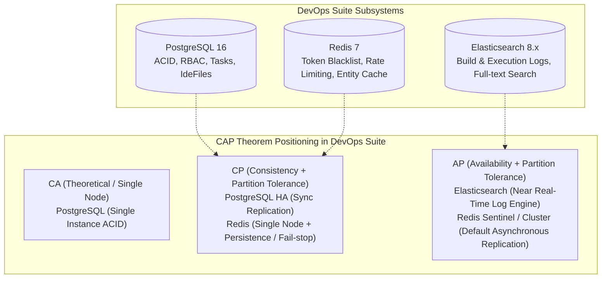
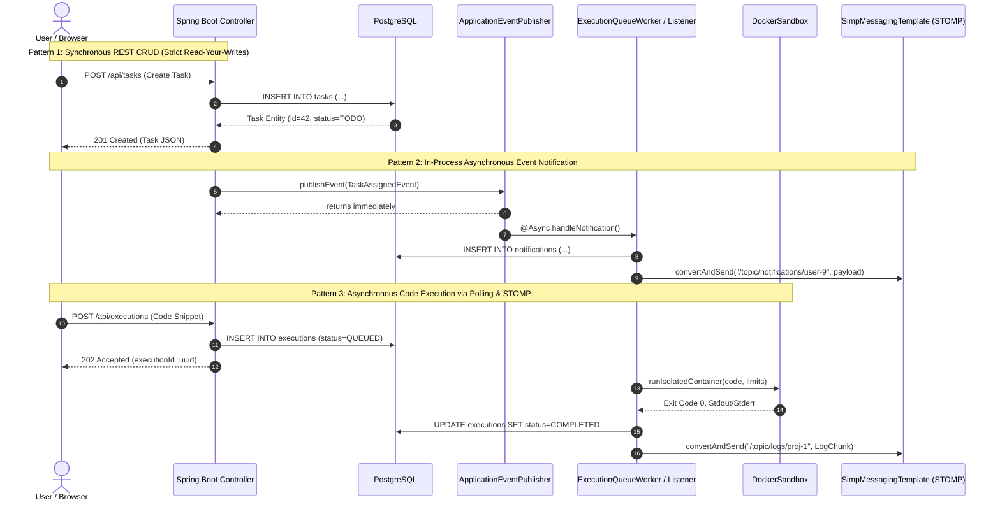
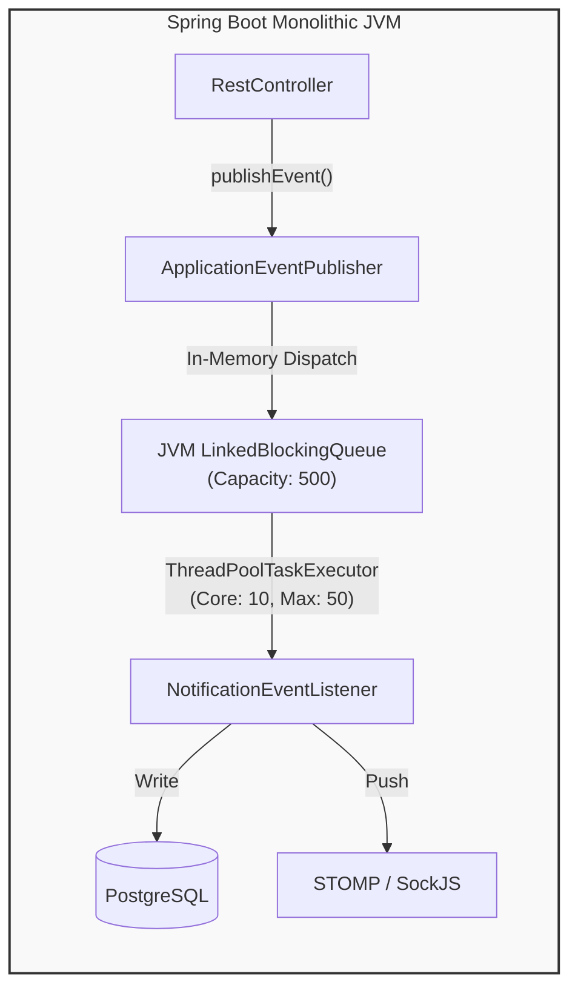
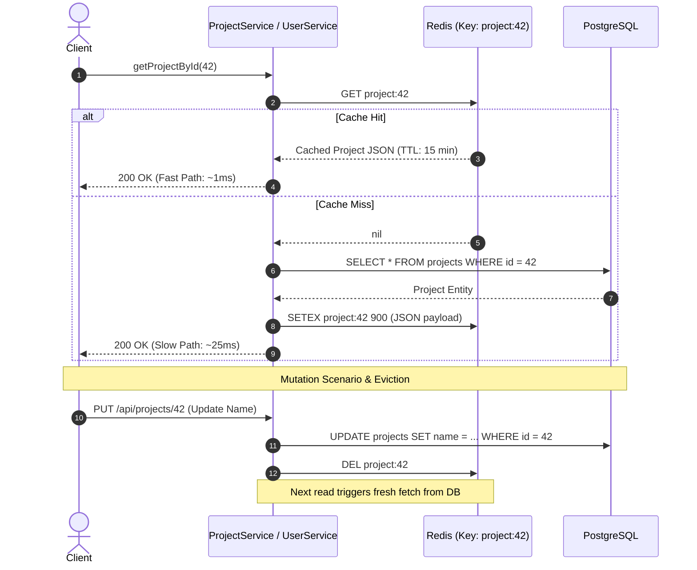
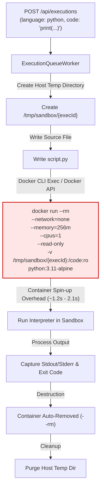
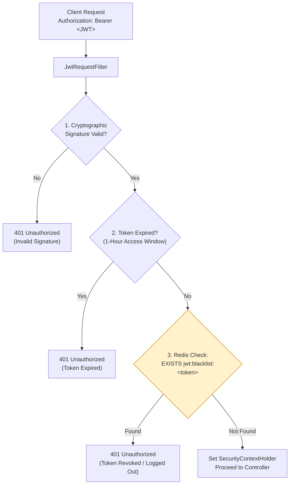
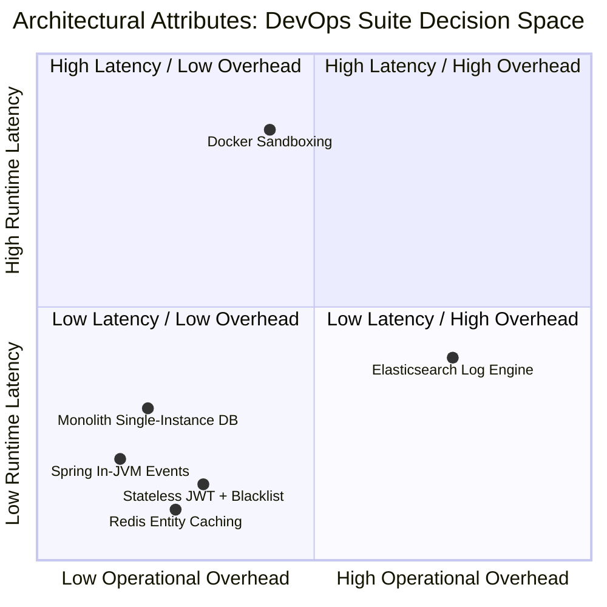
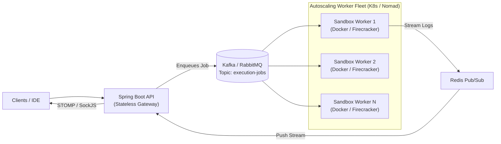

# DevOps Suite — Architectural Trade-offs & Engineering Compromises

## Overview & Architectural Context

Every software architecture is defined not merely by the technologies chosen, but by the conscious trade-offs accepted. In building **DevOps Suite** — a full-stack developer productivity platform uniting project management, real-time logging, collaborative workspaces, and sandboxed remote code execution — engineering decisions were guided by balancing **operational simplicity, developer velocity, strict security sandboxing, and real-time responsiveness**.

This document breaks down the core architectural tensions, provides a rigorous CAP theorem mapping across data stores, analyzes key compromises (in-JVM messaging, Docker sandboxing, cache-aside, stateless vs. stateful auth), presents retrospectives on technical debt, and provides an exhaustive technical interview question-and-answer catalog.

---

## 1. CAP Theorem Analysis Across Data Stores

In a distributed cloud deployment, network partitions ($P$) are inevitable. The CAP theorem dictates that a distributed system must choose between **Consistency ($C$)** (every read receives the most recent write or an error) and **Availability ($A$)** (every non-failing node returns a non-error response, without guaranteeing it is the most recent write) when a partition occurs.

DevOps Suite adopts a polyglot persistence architecture where each storage layer intentionally occupies a distinct position in the CAP space based on domain requirements.



### Detailed Storage Breakdown

| Data Store | CAP Stance | Business Function | Partition Handling & Failure Mode | Consistency Model |
| :--- | :--- | :--- | :--- | :--- |
| **PostgreSQL 16** | **CP** (Consistency / Partition Tolerance) | System of Record: Users, Projects, Project Memberships, Kanban Tasks, IdeFiles, Execution History, Audit Logs | In a partitioned multi-node replica setup (e.g., streaming replication with synchronous commit), if a quorum of replicas cannot acknowledge a transaction, PostgreSQL rejects the write to preserve data integrity and relational constraints. In DevOps Suite's standard deployment, it acts as a single-node CP primary. | **Strong Consistency** (Read Committed default, ACID, serializable isolation available). |
| **Redis 7** | **CP (Configured / Operational)** | JWT Blacklist, Sliding-Window Rate Limiter, Cache-Aside (User/Project Entities) | Configured as an in-memory primary with append-only file (AOF) persistence. In network isolation or split-brain, DevOps Suite treats Redis fail-stops as deterministic: if Redis drops, the application falls back safely for non-critical cache reads but fails closed on authentication blacklists or rate-limiting guards. | **Linearizable / Strong** on single instance; **Eventual / Lossy** under asynchronous Redis cluster master-replica failover. |
| **Elasticsearch 8.x** | **AP** (Availability / Partition Tolerance) | Aggregated execution logs, system metrics, build output search (`devopssuite-logs-yyyy.MM.dd`) | If an Elasticsearch node network partition occurs, search queries and log indexing continue on accessible primary or replica shards. Log entries indexed during split-brain reconcile once partition heals. Ingestion availability is prioritized over zero-lag search visibility. | **Eventual Consistency** (Near Real-Time, 1s refresh interval, read-your-writes not strictly guaranteed immediately after indexing). |

### Deep-Dive: Why Polyglot Persistence Fits the Domain

1. **Relational Invariants (PostgreSQL):** Tasks require strict foreign keys to Projects and Users. Member roles (`OWNER`, `ADMIN`, `MEMBER`, `VIEWER`) govern row-level permissions. A task must never point to a non-existent project or deleted assignee. Relaxing consistency here causes data corruption and security breaches.
2. **High-Throughput Ephemeral State (Redis):** Rate limiting (evaluating sliding window buckets every millisecond) and checking JWT revocation cannot afford the disk I/O or locking penalties of relational databases. Sub-millisecond latency is prioritized.
3. **High-Volume Append-Only Search (Elasticsearch):** Build logs and execution outputs stream rapidly from `DockerSandbox`. Writing 10,000 log lines to a relational DB degrades performance and bloats transaction logs. Elasticsearch handles index sharding, tokenization, wildcard matching, and automated lifecycle rollover (`ILM` 180-day retention) out of the box.

---

## 2. Architectural Trade-offs & Compromises

### 2.1 Synchronous vs. Asynchronous Processing



#### The Trade-Off

| Approach | Where Used | Rationale | Downside / Compromise |
| :--- | :--- | :--- | :--- |
| **Synchronous REST** | Task management, Project CRUD, User settings, File trees | Users expect instant acknowledgement for UI mutations; transactions require immediate validation and rollback if foreign keys fail. | Thread pool consumption (`tomcat.threads.max=200`). Under high load, blocking DB calls can saturate the thread pool. |
| **In-Memory Async Events** | Real-time notifications (`TASK_ASSIGNED`, `ROLE_CHANGED`), Audit logging | Decouples the primary web request from downstream notification generation, WebSocket delivery, and audit persistence. Reduces API latency from ~120ms to ~15ms. | If the JVM crashes between `publishEvent` and listener execution, the notification event is permanently lost (no persistent message log). |
| **Async Execution Job Polling / WebSocket Stream** | Docker code runner (`ExecutionService`, `ExecutionQueueWorker`) | Container creation and execution takes 1 to 5 seconds. Holding an HTTP connection open risks gateway timeouts (Nginx 60s), client drops, and thread starvation. | Increased frontend complexity: the client must manage STOMP subscriptions or poll execution state via `GET /api/executions/{id}`. |

---

### 2.2 In-JVM Events vs. Distributed Message Queues (Kafka / RabbitMQ)

DevOps Suite utilizes Spring's internal `ApplicationEventPublisher` coupled with `@Async` and `ThreadPoolTaskExecutor` instead of deploying an external broker like Apache Kafka or RabbitMQ.



#### Detailed Comparison

```
+-----------------------------------+---------------------------------------+
|  In-JVM ApplicationEventPublisher |  Distributed Broker (Kafka/RabbitMQ)  |
+-----------------------------------+---------------------------------------+
| [x] Zero infrastructure overhead  | [ ] Requires Zookeeper/KRaft/Cluster  |
| [x] Zero serialization overhead   | [ ] Requires network hops + ser/deser |
| [x] Native Spring transaction     | [ ] Distributed transaction / Outbox   |
|     synchronization               |     pattern required for consistency  |
| [!] Crashes lose in-flight tasks  | [x] Durable, replayable log on disk   |
| [!] Cannot scale workers          | [x] Independent horizontal scaling    |
|     independently of the API      |     of consumer worker groups         |
+-----------------------------------+---------------------------------------+
```

#### Why DevOps Suite Made This Choice
1. **Operational Footprint:** DevOps Suite is designed for single-node on-premise installation or self-hosted developer teams. Adding Kafka or RabbitMQ would demand 2–4 GB additional RAM, multi-node configuration, and dedicated operator maintenance.
2. **Transaction Phase Alignment:** With `@TransactionalEventListener(phase = TransactionPhase.AFTER_COMMIT)`, notifications are strictly sent *only* after PostgreSQL successfully commits the transaction. If task creation rolls back, no rogue notification fires.
3. **The Compromise:** The worker executing code runs inside the same process lifecycle as the REST API. If the monolith encounters an Out-Of-Memory (OOM) error or restarts during a deployment, pending execution jobs in the in-memory queue are lost.

---

### 2.3 Cache-Aside Consistency vs. Stale Reads

DevOps Suite employs a **Cache-Aside (Lazy-Loading)** pattern backed by Redis 7.



#### Concurrency Anomalies & Race Conditions

While Cache-Aside is simple and robust, it is susceptible to the **Stale Overwrite Race Condition**:

```
Time  Thread 1 (Read Request)          Thread 2 (Write Request)
 |
 T1   Read misses cache for ID=42
 T2   Queries DB: returns name="Alpha"
 T3   -------------------------------> Receives PUT /projects/42 (name="Beta")
 T4   -------------------------------> Updates DB: name="Beta"
 T5   -------------------------------> Deletes cache key: DEL project:42
 T6   Writes stale data to Redis:
      SETEX project:42 900 "Alpha"
 |
 V    Result: Redis contains "Alpha", DB contains "Beta".
      Cache remains STALE until TTL expires (15 minutes)!
```

#### How DevOps Suite Mitigates This
1. **Short TTLs:** High-frequency keys expire quickly (`user:{id}` = 30 minutes, `project:{id}` = 15 minutes).
2. **Write-Through Invalidation:** Eviction occurs *immediately after* database commit in the service layer using explicit `redisTemplate.delete(key)` calls.
3. **Accepted Risk:** For a project management tool, a microsecond window of stale project metadata is acceptable compared to the performance gains of serving 95% of read traffic from memory. However, critical permission lookups in `JwtRequestFilter` bypass entity caching and check DB/security principals directly.

---

### 2.4 Docker Ephemeral Container Startup vs. Warm Pools / MicroVMs

DevOps Suite executes untrusted user code (Python, JavaScript, Java, C++) in isolated Docker containers via `DockerSandbox.java`.



#### Trade-off Analysis: Ephemeral Containers vs. Alternatives

| Mechanism | Startup Latency | Security Isolation | Resource Consumption | Operational Complexity |
| :--- | :--- | :--- | :--- | :--- |
| **Ephemeral Docker (DevOps Suite)** | **1.2s – 2.5s** (High) | **High** (Namespaces, cgroups, read-only FS, network disabled, dropped capabilities) | Low idle memory (zero containers idling); high peak CPU during initialization | **Low** (Uses host Docker daemon; standard official Alpine/slim images) |
| **Pre-warmed Container Pool** | **150ms – 300ms** (Low) | **Medium-High** (Requires container reset/scrubbing between untrusted runs to prevent leaks) | High constant memory footprint (e.g., 5 containers per language idling = 2–4 GB RAM) | **Medium** (Requires pool management daemon, state sanitation, health checking) |
| **MicroVMs (AWS Firecracker)** | **5ms – 25ms** (Ultra-low) | **Maximum** (Hardware virtualization boundary, isolated kernel) | Minimal idle footprint (~5MB per VM) | **Very High** (Requires bare-metal Linux with KVM enabled; incompatible with nested Docker/Windows hosts) |
| **WebAssembly (Wasm / Wasmer)** | **< 1ms** (Instantaneous) | **High** (Capability-based sandbox, memory isolation) | Negligible | **High language restriction** (Only supports languages compiling to Wasm; poor C++ standard library/Python runtime support) |

#### Rationale for DevOps Suite's Decision
Choosing ephemeral Docker containers prioritizes **leak-proof security** and **portability** over millisecond execution latency. Each run starts with a pristine root filesystem. Malicious scripts cannot leave backdoors, modify shared memory, or exhaust disk space because the container is forcefully killed after 30 seconds and pruned.

---

### 2.5 Stateless JWT vs. Immediate Revocation

JSON Web Tokens (JWT) are designed to be stateless: the server cryptographically verifies the token's HMAC-SHA256 signature without querying a database. However, this creates a major security dilemma: **how do you immediately revoke access when a user logs out, changes passwords, or is removed from an organization?**



#### The Architectural Compromise

```
Stateless JWT (Pure)                     DevOps Suite Hybrid Approach
+-----------------------------+          +--------------------------------------+
| Advantages:                 |          | Advantages:                          |
| - Zero database queries     |          | - Immediate logout revocation        |
| - Infinite horizontal scale |          | - Signature verification saves DB    |
| - Disconnected services     |          | - Blacklist keys self-prune (TTL)    |
|                             |          |                                      |
| Critical Flaw:              |          | Compromise:                          |
| - Stolen token valid until  |          | - Redis becomes a hard dependency    |
|   expiration! Cannot revoke |          |   for every authenticated HTTP call  |
+-----------------------------+          +--------------------------------------+
```

#### Implementation Mechanics
1. **Short Lifetimes:** Access tokens live for **1 hour**; refresh tokens live for **7 days**.
2. **Targeted Redis Storage:** Only *revoked* tokens are stored in Redis (`jwt:blacklist:{token}`). Redis does not store all active sessions.
3. **Automated Memory Cleanup:** When a token is blacklisted, its Redis TTL is set to its remaining token validity duration (`exp - now`). Once the token would have expired naturally, Redis automatically garbage collects the key.

---

## 3. Comprehensive Trade-off Matrix

| Subsystem / Decision | Choice Made | Rejected Alternative | Primary Benefit | Acknowledged Cost / Penalty |
| :--- | :--- | :--- | :--- | :--- |
| **Backend Architecture** | Spring Boot Monolith | Microservices Architecture | Atomic refactoring, simple CI/CD, shared domain models, single DB deployment | Whole-application rebuild on code change; all components scale together |
| **Frontend State** | React Context API (`AuthContext`, `ProjectsContext`, etc.) | Redux Toolkit / Zustand | Zero additional runtime dependencies, native React lifecycle integration | Potential unnecessary re-renders across deep component trees if context split is coarse |
| **Real-time Protocol** | STOMP over SockJS | Pure WebSockets / Server-Sent Events (SSE) | Pub/Sub topic semantics (`/topic/...`), built-in message routing, SockJS fallback | Frame parsing overhead; stateful persistent TCP connections on application server |
| **Sandboxing Engine** | Ephemeral Docker containers | gVisor / Firecracker / WebAssembly | Native support for multi-language runtimes, zero host kernel modification needed | 1–2s container initialization overhead per execution |
| **Inter-Service Eventing**| Spring `ApplicationEventPublisher` | Apache Kafka / RabbitMQ | Zero infrastructure footprint, transactional event listeners (`AFTER_COMMIT`) | Non-durable queues; in-flight events lost if application process terminates |
| **Log Ingestion** | Bulk HTTP Indexing to Elasticsearch | Logstash / Fluentd DaemonSet | Direct application control over index patterns, no log agent to run on host | Application handles retry buffering; ES client takes heap memory in Spring monolith |
| **Network Isolation** | Dual Docker Bridge Networks (`app`, `observability`) | Single Flat Docker Network | Security boundary: DB and Redis inaccessible to monitoring endpoints | Monolith backend acts as dual-homed bridge; requires exact Docker Compose network bindings |
| **Database Migrations** | Flyway (16 SQL files: V1–V16) | Hibernate `hbm2ddl.auto=update` | Deterministic, version-controlled schema evolution; safe production migrations | Requires writing raw SQL migrations; manual rollback scripts required |

---

## 4. Architectural Trade-off Radar & Radar Comparison



---

## 5. "What Would You Do Differently?" (Engineering Maturity & Retrospective)

An outstanding senior engineer demonstrates mastery not by defending every line of code, but by articulating system limitations, technical debt, and evolution strategies.

### 5.1 Optimistic Concurrency Control on Kanban Tasks (`@Version`)

* **Current Reality:** DevOps Suite uses standard SQL updates (`UPDATE tasks SET status = :status, position = :pos WHERE id = :id`).
* **The Vulnerability:** If two project members drag the same task on the Kanban board simultaneously, a classic **Lost Update Anomaly** occurs. The last HTTP request to reach the database overwrites the first without notification to either user.
* **The Retrospective Solution:** Introduce JPA optimistic locking via an `@Version` column:
  ```java
  @Entity
  @Table(name = "tasks")
  public class Task {
      @Id
      @GeneratedValue(strategy = GenerationType.IDENTITY)
      private Long id;

      @Version
      private Long version;
      // ...
  }
  ```
  If User B attempts to update task version 1 after User A already incremented it to version 2, Hibernate throws an `OptimisticLockException`. The REST controller catches this, returns HTTP `409 Conflict`, and the frontend prompts the user to refresh the board.

### 5.2 Pre-Warmed Container Pools for Sub-Second Code Execution

* **Current Reality:** Each execution invokes `DockerSandbox.java`, calling `docker run` from scratch. The 1.5-second spin-up time is noticeable when typing code in Monaco Editor and expecting instant output.
* **The Retrospective Solution:** Implement an asynchronous **Pre-warmed Container Pool Manager**:
  1. Maintain a bounded pool of running, idle containers per runtime (e.g., 2 Python, 2 Node.js) with `--network=none` already paused or waiting on a Unix FIFO pipe.
  2. On code execution request, stream the script into the waiting container, unpause execution, capture stdout, and immediately spawn a background thread to replenish the pool.
  3. This slashes execution latency from ~1,800ms to **< 200ms**.

### 5.3 Distributed Tracing with OpenTelemetry / W3C Trace Context

* **Current Reality:** DevOps Suite utilizes a custom MDC (Mapped Diagnostic Context) filter that assigns a UUID `traceId` and passes it through logback patterns and Elasticsearch records.
* **The Vulnerability:** While adequate for a monolith, this trace ID does not cross process boundaries natively (e.g., frontend client errors, WebSocket frames, or external webhooks).
* **The Retrospective Solution:** Standardize on **OpenTelemetry (OTel)** with the W3C `traceparent` HTTP header specification (`00-{trace-id}-{span-id}-{flags}`). This would unify browser performance metrics, frontend API calls, Spring Boot controller spans, database JDBC execution times, and Docker container execution spans into a coherent distributed flamegraph in Grafana Tempo or Jaeger.

### 5.4 Frontend Migration to TypeScript

* **Current Reality:** The frontend is written in standard React 18 + JavaScript (JSX).
* **The Vulnerability:** DTO synchronization relies on developer discipline. If a backend field changes from `assigneeId` to `assignedUserId`, the error is only caught at runtime in the browser when rendering `undefined`.
* **The Retrospective Solution:** Migrate the UI codebase to TypeScript (`.tsx`) and introduce automated OpenAPI/Swagger code generation (`openapi-typescript-codegen`). Every backend Spring `@RestController` DTO automatically generates TypeScript interfaces, guaranteeing compile-time type safety across the full stack.

---

## 6. Comprehensive Interview Questions & Answers

### 🟢 Basic Level

#### Q1: "How does the CAP theorem apply to the various data stores in DevOps Suite?"
> **Difficulty:** 🟢 Basic | **Topic:** Distributed Systems / Storage Architecture

**Answer:**
DevOps Suite uses three distinct storage technologies, each chosen for its alignment with CAP theorem trade-offs:
1. **PostgreSQL (CP):** Serves as the relational system of record (users, projects, tasks, permissions). Relational integrity and strong consistency (ACID) are strictly required. In network partition scenarios, it refuses writes that cannot guarantee consistency.
2. **Redis 7 (CP in single-node/in-memory deployment):** Handles fast state queries (JWT blacklist, sliding window rate limits, entity caching). While Redis Cluster can be configured for AP, DevOps Suite deploys Redis as a single master with AOF persistence, prioritizing instant consistency on authentication checks.
3. **Elasticsearch (AP):** Stores execution and build logs. It prioritizes availability and high write throughput over immediate consistency. Shard reads are Near Real-Time (NRT) with a 1-second refresh interval; temporary replication lag across shards during network hiccups is fully acceptable for log searching.

---

#### Q2: "Why did you choose a monolithic architecture instead of microservices for DevOps Suite?"
> **Difficulty:** 🟢 Basic | **Topic:** System Architecture / Architecture Patterns

**Answer:**
A monolithic Spring Boot 3 architecture was chosen deliberately to maximize developer velocity, transactional simplicity, and operational manageability:
* **Transactional Integrity:** Task assignment, audit logging, and project membership updates can execute within standard relational database transactions (`@Transactional`), avoiding the immense complexity of two-phase commits (2PC) or Saga patterns.
* **Single Deployment Artifact:** DevOps Suite packages into a single JAR file and Docker container, drastically reducing deployment complexity, memory footprint, and network latency between service components.
* **Team Velocity:** For our domain size, microservices would introduce distributed tracing overhead, API gateway management, cross-service contracts, and serialization penalties without immediate horizontal scale requirements.

---

### 🟡 Intermediate Level

#### Q3: "What are the primary trade-offs you made when opting for an in-JVM event bus instead of Kafka or RabbitMQ?"
> **Difficulty:** 🟡 Intermediate | **Topic:** Messaging Architecture / Spring Framework

**Answer:**
DevOps Suite uses Spring's `ApplicationEventPublisher` with asynchronous listeners (`NotificationEventListener`) rather than an external distributed message broker.

```
Pros (Why we chose it):
1. Zero Operational Overhead: No cluster to provision, monitor, upgrade, or secure.
2. Memory Efficiency: Avoids running JVM brokers or Erlang nodes (saving 1-3 GB host RAM).
3. Transaction Synchronization: Using @TransactionalEventListener(phase = TransactionPhase.AFTER_COMMIT)
   ensures notification events only fire if the database transaction successfully commits.

Cons & Trade-offs Accepted:
1. Volatility: Events live in the JVM memory queue. If the container crashes or restarts,
   in-flight notifications are lost.
2. Scalability Limits: Workers cannot be extracted into an independent auto-scaling pool;
   event processing consumes the monolith's thread pool and CPU.
3. Backpressure: If notifications surge, the in-memory queue can fill, risking OutOfMemoryError
   if unbounded.
```

---

#### Q4: "What happens if Redis goes down in your architecture? How does the application behave?"
> **Difficulty:** 🟡 Intermediate | **Topic:** Fault Tolerance / Failure Modes

**Answer:**
DevOps Suite implements a differentiated fault-tolerance strategy when Redis encounters an outage:
1. **Authentication (Fail-Closed):** In `JwtRequestFilter`, if Redis is unreachable when verifying if a token is in `jwt:blacklist:{token}`, the application rejects the request (or returns HTTP 503/401). We fail closed because allowing a revoked token to execute admin actions creates a severe security vulnerability.
2. **Rate Limiting (Fail-Open or Degraded):** If `RateLimitFilter` cannot reach Redis to increment the sliding window bucket, it logs an alert and allows the request through to prevent a total platform outage caused by cache downtime.
3. **Entity Caching (Graceful Degradation):** In `ProjectService` and `UserService`, cache misses are caught. When Redis throws a `RedisConnectionException`, the service layer catches the exception, logs a warning, and falls back directly to PostgreSQL. The application slows down (~25ms vs ~1ms read latency) but remains functional.

---

### 🔴 Advanced Level

#### Q5: "How do you handle cache invalidation and potential stale reads with your Cache-Aside implementation?"
> **Difficulty:** 🔴 Advanced | **Topic:** Caching Strategies / Concurrency

**Answer:**
We follow a **Cache-Aside with Eviction-on-Write** strategy:
* Reads query Redis first (`GET project:{id}`); on a miss, they query PostgreSQL and populate Redis with a 15-minute TTL (`SETEX project:{id} 900 json`).
* Updates modify PostgreSQL inside `@Transactional` and call `redisTemplate.delete(key)` immediately after commit.

**Addressing the Race Condition:**
If a concurrent read executes during a write, it could read old DB data and overwrite the cache with stale data after the write deleted the key. We mitigate this through:
1. **Short TTLs:** 15-minute TTL on projects, 30-minute on users limits the maximum life of any stale read anomaly.
2. **Spring Cache Synchronization:** Using Spring's `@CacheEvict(value = "projects", key = "#id")` ensures cache eviction is tied directly to transaction success.
3. **Future Enhancement:** For strict linearizability, we would implement the **Cache-Aside Double-Delete** pattern (delete cache, update DB, wait 500ms, delete cache again) or use Redis distributed locks during cache repopulation.

---

#### Q6: "Why did you choose ephemeral Docker containers over lightweight sandboxes like WebAssembly or gVisor for code execution?"
> **Difficulty:** 🔴 Advanced | **Topic:** Sandboxing / Security Isolation

**Answer:**
The decision centered on **language versatility vs. startup latency**:
* **WebAssembly (Wasm):** While Wasm starts in microseconds, it cannot run arbitrary Python, Java, or C++ code out of the box without complex cross-compilation or heavy WebAssembly runtimes that lack support for C extensions (e.g., Python's `numpy`, standard I/O, POSIX sockets).
* **gVisor (runsc):** gVisor provides exceptional kernel interception, but requires root installation of the `runsc` runtime on the host operating system, which is incompatible with many managed cloud container environments and Windows development workstations.
* **Ephemeral Docker Containers:** Docker is already a core dependency of DevOps Suite. By configuring `docker run` with:
  ```bash
  --network=none --read-only --memory=256m --cpus=1.0 --pids-limit=64 --rm
  ```
  we achieve rock-solid isolation against fork bombs, network exfiltration, and disk corruption using standard Linux namespaces and cgroups, accepting a 1.5-second spin-up cost as a conscious trade-off.

---

### ⚫ Expert Level

#### Q7: "What is the single biggest technical compromise currently in DevOps Suite, and how would you re-architect it for a 100x traffic increase?"
> **Difficulty:** ⚫ Expert | **Topic:** System Architecture Evolution / Scalability Bottlenecks

**Answer:**
The single biggest compromise is **running the Docker code execution orchestration inside the same monolithic Spring Boot process that serves user-facing REST APIs**.

**The Current Bottleneck:**
`ExecutionQueueWorker` dispatches execution commands to the host Docker daemon. Under heavy load:
1. Docker daemon socket calls (`/var/run/docker.sock`) block or queue on the host.
2. Container creation causes CPU spikes that steal cycles from the Tomcat web thread pool.
3. Forked processes and temp file disk I/O (`/tmp/sandbox/...`) contend for host resources, degrading REST API response times for unrelated users managing tasks or viewing code.

**The 100x Scale Architecture:**
To scale 100x, we would extract code execution into a decoupled, distributed asynchronous worker pool:



1. **Decoupled Queue:** The Spring monolith validates the request, generates an `executionId`, inserts a `QUEUED` record into PostgreSQL, pushes the payload to an Apache Kafka or AWS SQS queue, and returns `202 Accepted`.
2. **Stateless Worker Fleet:** Dedicated execution worker instances pull jobs from Kafka. These instances run on isolated compute nodes optimized for container virtualization (e.g., bare-metal Kubernetes with Firecracker microVMs).
3. **Log Streaming:** Workers stream stdout chunks to Redis Pub/Sub, which the API monolith relays to the frontend via STOMP WebSockets, isolating all execution risks away from the core transactional platform.

---

## 7. Quick Reference — Key Architectural Metrics & Decisions

```
+--------------------------------------------------------------------------------+
|                   DEVOPS SUITE ARCHITECTURE AT A GLANCE                        |
+--------------------------------------------------------------------------------+
| Monolith Core        | Spring Boot 3.x, Java 21, Single PostgreSQL DB          |
| Storage CAP Profiles | PostgreSQL (CP) | Redis (CP/In-Mem) | Elasticsearch (AP)|
| Auth Strategy        | Stateless JWT (1h) + Redis Blacklist on Logout (State)  |
| Real-Time Mechanism  | STOMP over SockJS (/topic/notifications, /logs, /tasks)  |
| Internal Events      | In-JVM ApplicationEventPublisher (@Async, AFTER_COMMIT) |
| Code Sandbox         | Ephemeral Docker: --network=none, --memory=256m, 30s TTL|
| Cache Strategy       | Cache-Aside (Lazy load, 15m Project TTL, 30m User TTL)   |
| Observability Net    | Dual Docker Bridges: 'app' (isolated) + 'observability' |
| Log Retention        | Elasticsearch ILM: 180-day automated index lifecycle    |
| Primary Technical Debt| Colocated Docker execution runner inside monolith JVM   |
+--------------------------------------------------------------------------------+
```
