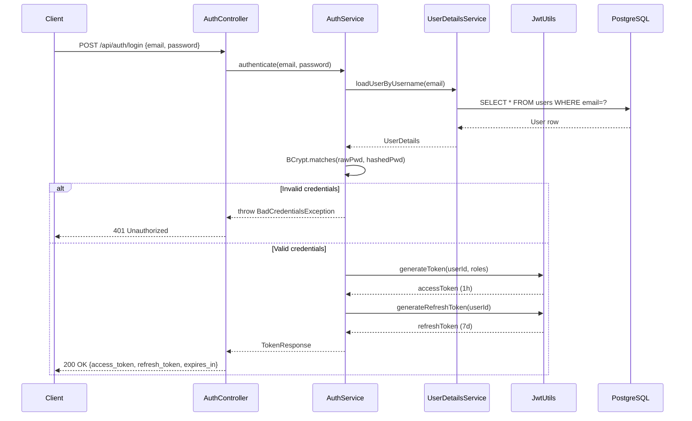
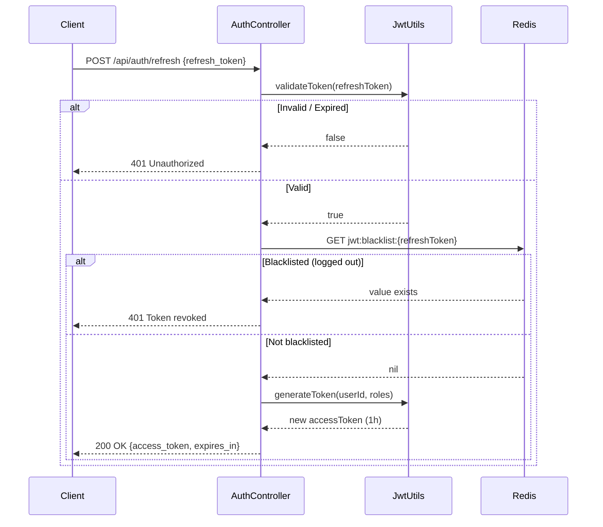
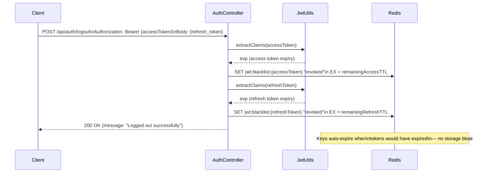
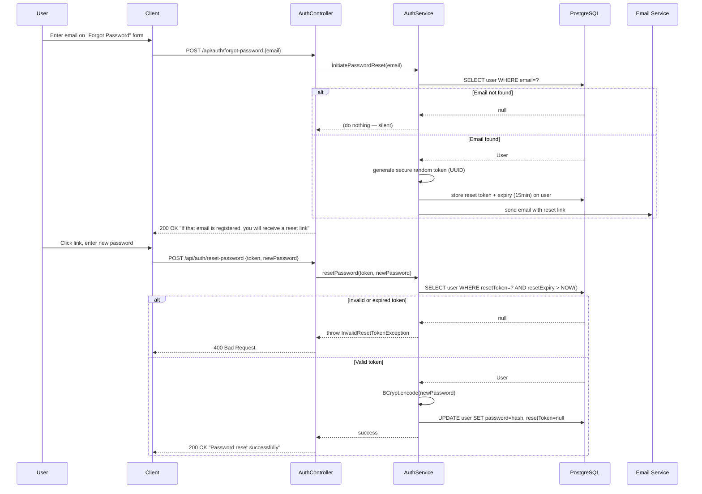

# Authentication, JWT & Session Management — Interview Q&A

> **File:** `interview/03-backend/auth-and-jwt.md`
> **Project:** DevOps Suite — Spring Boot 3.x / Java 21 / PostgreSQL / Redis 7
> **Difficulty Scale:** 🟢 Basic | 🟡 Intermediate | 🔴 Advanced | ⚫ Expert

---

## Overview

DevOps Suite implements a **stateless JWT-based authentication** system with Redis-backed token blacklisting, BCrypt password hashing, OAuth2 social login (Google + GitHub), and a sliding-window refresh-token strategy. This document covers every layer from user registration through logout, attack mitigations, and everything an interviewer might probe.

---

## Table of Contents

1. [Registration Flow](#1-registration-flow)
2. [Login & Token Issuance](#2-login--token-issuance)
3. [Request Authentication — JwtRequestFilter](#3-request-authentication--jwtrequestfilter)
4. [Token Refresh](#4-token-refresh)
5. [Logout & Redis Blacklisting](#5-logout--redis-blacklisting)
6. [Password Reset](#6-password-reset)
7. [OAuth2 Social Login](#7-oauth2-social-login)
8. [Security Attack Scenarios](#8-security-attack-scenarios)
9. [Quick Reference](#9-quick-reference)

---

## 1. Registration Flow

### Architecture at a Glance

```
POST /api/auth/register
        │
        ▼
  Input Validation
  (email format, password complexity)
        │
        ▼
  Check Duplicate Email ──► 409 Conflict
        │
        ▼
  BCrypt hash (cost 12)
        │
        ▼
  Persist User entity
        │
        ▼
  201 Created + {userId, email}
```

---

### Q1 🟢 What does the `POST /api/auth/register` endpoint accept and return?

**Answer:**

The endpoint accepts a JSON request body with the following fields:

```json
{
  "email": "user@example.com",
  "password": "SecureP@ss1!",
  "firstName": "Jane",
  "lastName": "Doe"
}
```

**Validation rules applied (Bean Validation / `@Valid`):**
| Field | Constraint |
|-------|-----------|
| `email` | `@Email`, `@NotBlank` — RFC-5322 format |
| `password` | `@NotBlank`, minimum 8 characters, must contain uppercase, lowercase, digit, special char |
| `firstName` | `@NotBlank`, max 50 chars |
| `lastName` | `@NotBlank`, max 50 chars |

**Success response (HTTP 201):**
```json
{
  "userId": "a3f2c1d0-...",
  "email": "user@example.com",
  "message": "User registered successfully"
}
```

The raw password is **never** persisted — only the BCrypt hash.

---

### Q2 🟢 Why does DevOps Suite use BCrypt with cost factor 12?

**Answer:**

BCrypt is an adaptive, intentionally slow hashing algorithm designed for passwords. The **cost factor (work factor)** determines the number of iterations: `2^cost` rounds.

| Cost | Approx. time (modern CPU) | Use case |
|------|--------------------------|----------|
| 10   | ~100ms                   | Legacy systems |
| 12   | ~400ms                   | **DevOps Suite** — good default |
| 14   | ~1.5s                    | High-security environments |

**Why 12 specifically?**
- Fast enough for a normal user login (sub-second UX)
- Slow enough to make offline brute-force attacks infeasible (400ms per attempt means ~2.5 attempts/second per thread)
- BCrypt is future-proof — cost can be increased without invalidating existing hashes

```java
// Spring Security's PasswordEncoder bean (SecurityConfig.java)
@Bean
public PasswordEncoder passwordEncoder() {
    return new BCryptPasswordEncoder(12);
}
```

The `BCryptPasswordEncoder` automatically embeds the salt and cost factor in the stored hash string (e.g., `$2a$12$...`), so no separate salt column is needed.

---

### Q3 🟡 What happens if a user tries to register with an already-existing email?

**Answer:**

The service layer checks for duplicate emails before persisting:

```java
// AuthService.java (pseudocode)
if (userRepository.existsByEmail(request.getEmail())) {
    throw new EmailAlreadyExistsException("Email already registered");
}
```

This results in **HTTP 409 Conflict** with a body like:
```json
{
  "status": 409,
  "error": "Conflict",
  "message": "Email address is already registered"
}
```

> [!NOTE]
> A 409 explicitly tells the client the email exists, which technically aids **user enumeration**. Some security-sensitive systems return 200/201 regardless, sending a "check your email" message. DevOps Suite accepts this trade-off for UX clarity on the registration screen (login/registration is not the primary attack surface — rate limiting protects against bulk enumeration).

---

### Q4 🟡 What is `DataSeeder.java` and why does it exist?

**Answer:**

`DataSeeder.java` implements `CommandLineRunner` and runs once at application startup in the **dev profile**. It creates a default admin account if none exists:

```java
@Component
@Profile("dev")
public class DataSeeder implements CommandLineRunner {
    @Override
    public void run(String... args) {
        if (!userRepository.existsByEmail("admin@devopssuite.com")) {
            User admin = new User();
            admin.setEmail("admin@devopssuite.com");
            admin.setPassword(passwordEncoder.encode("admin"));
            admin.setRole(Role.OWNER);
            userRepository.save(admin);
        }
    }
}
```

**Why it exists:** Eliminates the need for manual setup in development/demo environments. The `@Profile("dev")` annotation ensures it **never runs in production** — the prod profile must be explicitly set to suppress seed data.

> [!CAUTION]
> Never include `DataSeeder` in production builds. The credentials `admin/admin` are trivially guessable. The `@Profile("dev")` guard is the only thing preventing a critical security breach.

---

## 2. Login & Token Issuance

### Login Flow Sequence Diagram



---

### Q5 🟢 What does `POST /api/auth/login` return on success?

**Answer:**

```json
{
  "access_token": "eyJhbGciOiJIUzI1NiJ9...",
  "refresh_token": "eyJhbGciOiJIUzI1NiJ9...",
  "token_type": "Bearer",
  "expires_in": 3600
}
```

| Field | Value |
|-------|-------|
| `access_token` | Short-lived JWT (1 hour / 3,600,000 ms) |
| `refresh_token` | Long-lived JWT (7 days / 604,800,000 ms) |
| `token_type` | Always `"Bearer"` |
| `expires_in` | Seconds until access token expires (3600) |

Both values are configured as environment variables:
```env
JWT_EXPIRATION_MS=3600000
REFRESH_TOKEN_EXPIRATION_MS=604800000
JWT_SECRET=<256-bit-random-secret>
```

---

### Q6 🟡 What claims are in the JWT payload and why?

**Answer:**

```json
{
  "sub": "a3f2c1d0-1234-5678-abcd-ef1234567890",
  "roles": ["ROLE_MEMBER"],
  "iat": 1711900000,
  "exp": 1711903600
}
```

| Claim | Value | Purpose |
|-------|-------|---------|
| `sub` | UUID (userId) | Subject — identifies the authenticated user without exposing PII |
| `roles` | `List<String>` | Used by Spring Security for authorization decisions without a DB call |
| `iat` | Unix epoch | Issued-at — used to verify token age |
| `exp` | Unix epoch | Expiry — `JwtUtils.validateToken()` checks this |

**Why UUID as `sub` instead of email?**
- Email can change (user profile update)
- UUID is immutable and opaque
- Prevents PII leakage if a JWT is logged or inspected

**Why embed `roles` in the token?**
- Avoids a DB round-trip per request to check authorization
- Trade-off: role changes don't take effect until the access token expires (1h max lag) — acceptable for this use case

---

### Q7 🟡 Walk through `JwtUtils.java` — how are tokens generated and validated?

**Answer:**

DevOps Suite uses the **JJWT** (Java JWT) library.

```java
// JwtUtils.java — key methods

public String generateToken(String userId, List<String> roles) {
    return Jwts.builder()
        .setSubject(userId)
        .claim("roles", roles)
        .setIssuedAt(new Date())
        .setExpiration(new Date(System.currentTimeMillis() + jwtExpirationMs))
        .signWith(getSigningKey(), SignatureAlgorithm.HS256)
        .compact();
}

public boolean validateToken(String token) {
    try {
        Jwts.parserBuilder()
            .setSigningKey(getSigningKey())
            .build()
            .parseClaimsJws(token);   // throws if invalid/expired
        return true;
    } catch (JwtException | IllegalArgumentException e) {
        return false;
    }
}

public Claims extractClaims(String token) {
    return Jwts.parserBuilder()
        .setSigningKey(getSigningKey())
        .build()
        .parseClaimsJws(token)
        .getBody();
}

private Key getSigningKey() {
    byte[] keyBytes = Decoders.BASE64.decode(jwtSecret);
    return Keys.hmacShaKeyFor(keyBytes);
}
```

**Algorithm:** HMAC-SHA256 (`HS256`) — symmetric, uses the same secret for signing and verification. Suitable for a monolith where only one service signs and validates.

**`validateToken()` catches:**
- `ExpiredJwtException` — token past `exp`
- `UnsupportedJwtException` — wrong format
- `MalformedJwtException` — tampered structure
- `SignatureException` — signature mismatch
- `IllegalArgumentException` — null/empty token

---

### Q8 🔴 Why is HMAC-SHA256 used instead of RS256? What are the trade-offs?

**Answer:**

| Aspect | HS256 (HMAC-SHA256) | RS256 (RSA-SHA256) |
|--------|--------------------|--------------------|
| Key type | Shared secret (symmetric) | Public/private key pair (asymmetric) |
| Verification | Requires the same secret | Any holder of the public key |
| Best for | **Monolith** — single issuer and verifier | Microservices — multiple services verify without the secret |
| Key rotation | Update single `JWT_SECRET` env var | Rotate key pair, distribute new public key (e.g., JWKS endpoint) |
| Performance | Faster (HMAC is cheap) | Slower (RSA math) |

**DevOps Suite choice rationale:** It's a **monolith** — only one service issues and validates tokens. HS256 is simpler, faster, and perfectly secure when the secret is strong (≥256-bit random) and kept confidential. RS256 would add complexity with no benefit.

**Follow-up:** *If we moved to microservices, what would you change?*
→ Switch to RS256, expose a `/jwks.json` endpoint with the public key. Each microservice fetches the public key at startup and verifies tokens locally without calling the auth service.

---

## 3. Request Authentication — JwtRequestFilter

### Q9 🟢 What is `JwtRequestFilter` and where does it sit in the request pipeline?

**Answer:**

`JwtRequestFilter` extends `OncePerRequestFilter` — a Spring Security filter that runs **exactly once per request** (prevents double-execution in forward/include chains).

**Position in filter chain:** It is inserted before `UsernamePasswordAuthenticationFilter` via `SecurityConfig`:
```java
http.addFilterBefore(jwtRequestFilter, UsernamePasswordAuthenticationFilter.class);
```

**Responsibility:** Intercept every HTTP request, extract and validate the JWT, and populate the `SecurityContextHolder` so downstream code knows who the caller is.

---

### Q10 🟡 Walk through the `JwtRequestFilter.doFilterInternal()` logic step by step.

**Answer:**

```java
@Override
protected void doFilterInternal(HttpServletRequest request,
                                HttpServletResponse response,
                                FilterChain chain)
        throws ServletException, IOException {

    // 1. Extract Authorization header
    String authHeader = request.getHeader("Authorization");

    // 2. Check format: must start with "Bearer "
    if (authHeader == null || !authHeader.startsWith("Bearer ")) {
        chain.doFilter(request, response);  // pass through (public endpoint or missing token)
        return;
    }

    // 3. Strip "Bearer " prefix
    String token = authHeader.substring(7);

    // 4. Validate signature + expiry via JwtUtils
    if (!jwtUtils.validateToken(token)) {
        response.sendError(HttpServletResponse.SC_UNAUTHORIZED, "Invalid or expired token");
        return;
    }

    // 5. Check Redis blacklist (logout/revocation)
    String blacklistKey = "jwt:blacklist:" + token;
    if (Boolean.TRUE.equals(redisTemplate.hasKey(blacklistKey))) {
        response.sendError(HttpServletResponse.SC_UNAUTHORIZED, "Token has been revoked");
        return;
    }

    // 6. Extract claims
    Claims claims = jwtUtils.extractClaims(token);
    String userId = claims.getSubject();
    List<String> roles = claims.get("roles", List.class);

    // 7. Build Spring Security authentication object
    List<GrantedAuthority> authorities = roles.stream()
        .map(SimpleGrantedAuthority::new)
        .collect(Collectors.toList());

    UsernamePasswordAuthenticationToken authentication =
        new UsernamePasswordAuthenticationToken(userId, null, authorities);
    authentication.setDetails(new WebAuthenticationDetailsSource().buildDetails(request));

    // 8. Store in SecurityContextHolder
    SecurityContextHolder.getContext().setAuthentication(authentication);

    // 9. Continue filter chain
    chain.doFilter(request, response);
}
```

**Key steps summary:**
1. Extract `Authorization` header
2. Verify `Bearer ` prefix
3. Validate JWT (signature + expiry)
4. Check Redis blacklist
5. Parse claims (userId, roles)
6. Set `SecurityContextHolder` authentication
7. Continue chain

---

### Q11 🟡 Which endpoints are excluded from JWT filtering?

**Answer:**

`SecurityConfig.java` defines a **permit list** — paths that bypass authentication:

```java
http.authorizeHttpRequests(auth -> auth
    .requestMatchers(
        "/api/auth/register",
        "/api/auth/login",
        "/api/auth/refresh",
        "/api/auth/forgot-password",
        "/api/auth/reset-password",
        "/api/auth/google",
        "/api/auth/github",
        "/actuator/health",
        "/actuator/prometheus",
        "/ws/**"           // WebSocket handshake (authenticated via STOMP interceptor)
    ).permitAll()
    .anyRequest().authenticated()
);
```

`JwtRequestFilter` also has a corresponding `shouldNotFilter()` override for efficiency:
```java
@Override
protected boolean shouldNotFilter(HttpServletRequest request) {
    String path = request.getServletPath();
    return path.startsWith("/api/auth/") || path.startsWith("/actuator/health");
}
```

> [!NOTE]
> The WebSocket upgrade path (`/ws/**`) is permitted here because STOMP-level authentication is handled separately by `StompAuthChannelInterceptor`, which validates the JWT sent in the STOMP `CONNECT` frame.

---

### Q12 🔴 Why use `OncePerRequestFilter` instead of a standard `Filter` or `HandlerInterceptor`?

**Answer:**

| Option | Layer | Pros | Cons |
|--------|-------|------|------|
| `javax.servlet.Filter` | Servlet container | Simple | Can execute multiple times in forward/include chains |
| `OncePerRequestFilter` | Spring Security | **Guaranteed single execution**, integrates with Spring's filter chain ordering | Slightly more boilerplate |
| `HandlerInterceptor` | Spring MVC | Access to handler metadata | Runs **after** servlet filters — too late for security |

`OncePerRequestFilter` is the **correct choice** for security filters because:
1. It guarantees the filter body runs exactly once regardless of internal forwards
2. It integrates natively with Spring Security's ordered filter chain
3. It provides `shouldNotFilter()` for clean path exclusion logic

---

## 4. Token Refresh

### Token Refresh Sequence Diagram



---

### Q13 🟡 How does token refresh work in DevOps Suite?

**Answer:**

**Endpoint:** `POST /api/auth/refresh`

**Request body:**
```json
{
  "refresh_token": "eyJhbGciOiJIUzI1NiJ9..."
}
```

**Process:**
1. Validate the refresh token (signature + expiry) via `JwtUtils.validateToken()`
2. Check Redis blacklist — a logged-out refresh token must not issue new access tokens
3. Extract `userId` and `roles` from refresh token claims
4. Generate a **new access token** only (the refresh token itself is not rotated)
5. Return:

```json
{
  "access_token": "eyJhbGciOiJIUzI1NiJ9...<new>",
  "expires_in": 3600
}
```

**Design decision — why not rotate the refresh token?**
- Simpler implementation and fewer edge cases (e.g., concurrent refresh attempts)
- The refresh token is long-lived (7d) and protected by HTTPS
- Rotation would require storing the latest valid refresh token server-side, undermining statelessness

---

### Q14 🔴 What is refresh token rotation and why might you implement it?

**Answer:**

**Refresh token rotation** means issuing a **new refresh token** each time one is used, and immediately invalidating the old one.

**Benefits:**
- If a refresh token is stolen, it can only be used **once** — the legitimate client's next refresh attempt fails (old token is invalidated), alerting the system to a potential compromise
- Enables automatic revocation detection ("token reuse detection")

**Implementation sketch:**
```java
// On refresh:
// 1. Validate old refresh token
// 2. Blacklist old refresh token in Redis
// 3. Issue new access token + new refresh token
// 4. Return both to client
```

**Why DevOps Suite doesn't implement it currently:**
- Adds complexity (client must atomically update stored refresh token)
- Concurrent requests can cause legitimate token invalidation
- The 7-day window + HTTPS + blacklisting provides sufficient security for this use case

> [!TIP]
> For a production security-critical application, refresh token rotation with reuse detection (family invalidation) is recommended per OAuth 2.0 Security Best Current Practice (RFC 9700).

---

## 5. Logout & Redis Blacklisting

### Logout Sequence Diagram



---

### Q15 🟡 How does logout work with Redis blacklisting?

**Answer:**

**Endpoint:** `POST /api/auth/logout`

**Request:**
- `Authorization: Bearer <accessToken>` (header)
- Body: `{ "refresh_token": "<refreshToken>" }`

**Process:**
```java
// AuthService.java
public void logout(String accessToken, String refreshToken) {
    // 1. Blacklist access token with its remaining lifetime as TTL
    long accessRemaining = jwtUtils.getExpirationMs(accessToken) - System.currentTimeMillis();
    if (accessRemaining > 0) {
        redisTemplate.opsForValue().set(
            "jwt:blacklist:" + accessToken,
            "revoked",
            accessRemaining, TimeUnit.MILLISECONDS
        );
    }

    // 2. Blacklist refresh token with its remaining lifetime as TTL
    long refreshRemaining = jwtUtils.getExpirationMs(refreshToken) - System.currentTimeMillis();
    if (refreshRemaining > 0) {
        redisTemplate.opsForValue().set(
            "jwt:blacklist:" + refreshToken,
            "revoked",
            refreshRemaining, TimeUnit.MILLISECONDS
        );
    }
}
```

**Redis key pattern:** `jwt:blacklist:{token}`

**Why set TTL = remaining token lifetime?**
- After the token's `exp` time, `JwtUtils.validateToken()` would already reject it
- No need to store it in Redis beyond that point
- **Redis keys auto-expire** → zero storage bloat accumulation

---

### Q16 🔴 Why must BOTH the access token AND the refresh token be blacklisted on logout?

**Answer:**

If only the **access token** is blacklisted:
- An attacker who has stolen the refresh token can call `POST /api/auth/refresh` to obtain a brand-new access token that is **not** blacklisted
- The user's logout is effectively bypassed

If only the **refresh token** is blacklisted:
- The access token (still valid for up to 1 hour) can be used directly
- `JwtRequestFilter` would accept it until it naturally expires

**Both must be blacklisted** to guarantee immediate session termination. The access token blacklist covers the window until its 1-hour expiry; the refresh token blacklist prevents re-issuance for up to 7 days.

```
Timeline after logout:
t=0    → Logout → both tokens blacklisted in Redis
t=1h   → Access token Redis key expires (would have expired anyway)
t=7d   → Refresh token Redis key expires (would have expired anyway)
```

---

### Q17 ⚫ What are the scalability implications of JWT blacklisting in Redis?

**Answer:**

**Storage analysis:**
- A JWT token is ~200-400 bytes
- At 100,000 concurrent active users, each with one refresh token blacklisted on logout: ~40 MB worst case
- Redis easily handles this in memory

**Performance:**
- `Redis GET` is O(1), sub-millisecond — negligible overhead per request
- No DB query needed for blacklist check

**Failure modes:**
- If Redis is **unavailable**, `JwtRequestFilter` must decide: fail-open (accept tokens without checking blacklist) vs. fail-closed (reject all authenticated requests)
- DevOps Suite should configure a **circuit breaker** around the Redis blacklist check and decide on the fail mode based on security requirements

**Alternative approaches:**
| Approach | Pro | Con |
|----------|-----|-----|
| Redis blacklist | Fast, simple | Memory overhead; Redis is a dependency |
| Short TTL only (no blacklist) | Truly stateless | Can't revoke tokens before expiry |
| Opaque tokens + DB session | Full revocation | DB round-trip per request |
| Token versioning in DB | Revoke by bumping version | One DB read per request |

> [!TIP]
> Token versioning is an elegant middle ground: store a `tokenVersion` integer on the `User` entity. Embed it as a JWT claim. On each request, compare the claim value with the DB value — a mismatch means the token is invalidated. Logout just increments the version. Adds one DB read but eliminates the Redis dependency for blacklisting.

---

## 6. Password Reset

### Password Reset Flow



---

### Q18 🟡 Why does the forgot-password endpoint return the same response regardless of whether the email exists?

**Answer:**

The response is always:
```
"If that email is registered, you will receive a reset link."
```

This is a **user enumeration prevention** measure. If the API returned different responses:
- `404 Not Found` — "that email is not registered"
- `200 OK` — "reset email sent"

An attacker could use the endpoint to determine which emails are in the system — a **user enumeration attack**. This could:
1. Confirm whether a target person has an account
2. Build a list of valid emails for phishing or credential stuffing

By returning an **identical 200 response** for both found and not-found cases, the API reveals nothing about account existence.

**Rate limiting** is also applied to this endpoint to prevent automated scanning.

---

### Q19 🟡 How is the password reset token secured?

**Answer:**

| Property | Implementation |
|----------|---------------|
| **Generation** | Cryptographically secure random UUID (`UUID.randomUUID()`) or `SecureRandom` bytes, Base64-encoded |
| **Storage** | Hashed (SHA-256) in the `password_reset_tokens` table alongside the user ID and expiry timestamp |
| **Expiry** | 15 minutes from generation |
| **One-time use** | Token is deleted from DB immediately after successful password reset |
| **Transmission** | Sent via email as a URL parameter over HTTPS only |

**Why hash the reset token in the DB?**
- If the DB is compromised, attackers cannot use the stored values directly (they'd need the raw token from the email)
- Same principle as password hashing — never store secrets in plaintext

---

## 7. OAuth2 Social Login

> [!NOTE]
> Full OAuth2 implementation details are covered in `04-oauth2.md`. This section focuses on how OAuth2 integrates with the JWT auth system.

### Q20 🟡 How does Google OAuth2 login work in DevOps Suite?

**Answer:**

**Endpoint:** `POST /api/auth/google`

**Flow:**
```
1. Client obtains Google id_token via Google Sign-In SDK
2. Client sends id_token to DevOps Suite backend
3. Backend validates id_token against Google's public keys
4. Extract email + profile from token claims
5. Find or create User entity
6. Issue DevOps Suite JWT (same structure as regular login)
7. Return {access_token, refresh_token, expires_in}
```

```java
// AuthService.java
public TokenResponse googleLogin(String idToken) {
    GoogleIdToken.Payload payload = googleTokenVerifier.verify(idToken);
    String email = payload.getEmail();
    String googleSub = payload.getSubject();

    User user = userRepository.findByEmail(email)
        .orElseGet(() -> createOAuthUser(email, payload.get("name"), "GOOGLE", googleSub));

    return generateTokenResponse(user);
}
```

**Why validate the id_token server-side?**
- The client-side Google SDK only proves the user authenticated to Google
- Backend validation (against Google's JWKS endpoint) proves the token was issued for **this application** (audience check) and is unexpired

---

### Q21 🟡 How does GitHub OAuth2 differ from Google OAuth2?

**Answer:**

| Aspect | Google OAuth2 | GitHub OAuth2 |
|--------|--------------|---------------|
| Client sends | `id_token` (JWT) | Authorization `code` |
| Backend step 1 | Validate JWT against Google JWKS | Exchange `code` for access token via GitHub API |
| Backend step 2 | Parse claims from JWT | Call `GET /user` with access token to fetch profile |
| Email field | Directly in token payload | May require separate `GET /user/emails` call (if not public) |

**GitHub flow:**
```
1. User clicks "Login with GitHub" → redirect to GitHub OAuth authorize URL
2. GitHub redirects to callback with ?code=...
3. Client sends code to POST /api/auth/github
4. Backend: POST https://github.com/login/oauth/access_token
5. Backend: GET https://api.github.com/user (with GitHub access token)
6. Extract GitHub user ID + email → find/create DevOps Suite user
7. Issue DevOps Suite JWT
```

---

## 8. Security Attack Scenarios

### Q22 🔴 How does DevOps Suite prevent the "JWT none algorithm" attack?

**Answer:**

The **none algorithm attack** exploits JWT libraries that accept tokens with `"alg": "none"` in the header — meaning no signature is required. An attacker can craft a JWT with arbitrary claims and strip the signature.

**Example attack token:**
```
Header: {"alg": "none", "typ": "JWT"}
Payload: {"sub": "admin-uuid", "roles": ["ROLE_ADMIN"]}
Signature: (empty)
```

**DevOps Suite mitigation:**

In `JwtUtils.java`, the parser is constructed with an **explicit signing key**:
```java
Jwts.parserBuilder()
    .setSigningKey(getSigningKey())   // ← requires valid HS256 signature
    .build()
    .parseClaimsJws(token);           // parseClaimsJws, NOT parseClaimsJwt
```

- `parseClaimsJws()` (with 's' for signed) **rejects unsigned tokens** — it throws `UnsupportedJwtException` for tokens without a valid signature
- `parseClaimsJwt()` (without 's') would accept unsigned tokens — this is the vulnerable variant
- JJWT 0.11+ does not allow `alg: none` when a signing key is set

---

### Q23 🔴 How are timing attacks on password comparison mitigated?

**Answer:**

A **timing attack** on authentication exploits the fact that string comparison (`==`) short-circuits — it returns false at the first mismatched character. An attacker can measure response time differences to guess passwords character by character.

**BCrypt mitigates this because:**
1. `BCryptPasswordEncoder.matches()` uses a **constant-time comparison** internally (comparing the full hash byte array, not short-circuiting)
2. The main time cost is the BCrypt hashing of the candidate password (cost factor 12 = ~400ms) — this completely dwarfs any timing difference from string comparison
3. A wrong password takes the same ~400ms as a correct one

```java
// Spring Security BCryptPasswordEncoder.matches() — constant time
passwordEncoder.matches(rawPassword, storedHash)
// Internally: runs BCrypt on rawPassword, then does constant-time byte comparison
```

---

### Q24 🟡 Why is CSRF protection not needed for JWT-based APIs?

**Answer:**

**CSRF (Cross-Site Request Forgery)** attacks work because browsers automatically send cookies with cross-origin requests. A malicious site can trigger requests to the victim's authenticated session.

**JWT APIs are CSRF-immune because:**
- JWTs are stored in `localStorage` or `sessionStorage` (not cookies)
- Browsers do **not** automatically include `Authorization: Bearer ...` headers in cross-origin requests
- The attacker's malicious page has no way to read the victim's JWT from a different origin (Same-Origin Policy)
- Without the JWT in the `Authorization` header, the request is treated as unauthenticated

```java
// SecurityConfig.java
http.csrf(csrf -> csrf.disable());
// ✅ Safe to disable because we use JWT in Authorization header, not cookies
```

> [!WARNING]
> If you ever store JWTs in **HttpOnly cookies** instead of localStorage, CSRF protection becomes necessary again. Never disable CSRF without confirming token storage strategy.

---

### Q25 🔴 How does DevOps Suite handle token theft and replay attacks?

**Answer:**

**Token theft scenario:** An attacker intercepts or steals a valid JWT.

**Mitigations in DevOps Suite:**

| Threat | Mitigation |
|--------|-----------|
| Token in transit | HTTPS enforced — tokens never transmitted in plaintext |
| Access token theft | Short TTL (1h) — stolen tokens auto-expire quickly |
| Refresh token theft | Blacklisted on logout; requires re-authentication if detected |
| Replay after logout | Redis blacklist checked on every request |
| XSS stealing from localStorage | Content Security Policy headers; input sanitization |

**Replay attack (using a captured valid token):**
- If token is not yet expired + not blacklisted → attacker succeeds (inherent JWT trade-off)
- Mitigation: keep access TTL short (1h), log suspicious concurrent usage patterns (anomaly detection)

**What would fully prevent replay?**
- Binding tokens to client IP or User-Agent (but breaks legitimate mobile users on cellular)
- DPoP (Demonstrating Proof-of-Possession) — cryptographic proof that only the holder of a private key can use the token (OAuth 2.0 RFC 9449) — not currently implemented

---

### Q26 ⚫ If a user's account is compromised and you need to invalidate ALL their tokens immediately, how would you do it in the current architecture?

**Answer:**

**Current architecture limitation:** JWTs are stateless — there's no central registry of "all active tokens for user X."

**Option 1: User-level blacklist key in Redis**
```java
// On "force logout all sessions":
redisTemplate.opsForValue().set(
    "jwt:user:invalidate:" + userId,
    String.valueOf(System.currentTimeMillis()),
    7, TimeUnit.DAYS   // max refresh token lifetime
);

// In JwtRequestFilter, add check:
String invalidateKey = "jwt:user:invalidate:" + userId;
String invalidateTime = redisTemplate.opsForValue().get(invalidateKey);
if (invalidateTime != null) {
    long tokenIat = claims.getIssuedAt().getTime();
    if (tokenIat < Long.parseLong(invalidateTime)) {
        // Token was issued before the invalidation event → reject
        response.sendError(401, "Session invalidated");
        return;
    }
}
```
This invalidates **all tokens issued before the invalidation timestamp** with a single Redis key.

**Option 2: Token version on User entity**
```java
// User entity has tokenVersion: int
// JWT claim embeds tokenVersion at issue time
// On force-logout: UPDATE users SET token_version = token_version + 1
// JwtRequestFilter: if claim.tokenVersion != user.tokenVersion → reject
// Requires one DB read per request (or Redis cache of tokenVersion)
```

**Option 3: Short-lived access tokens only (15min)**
- Without a blacklist, the maximum breach window is 15 minutes
- Combined with immediate refresh token blacklisting, risk is minimal

**Best practice:** Implement **Option 2 (token versioning)** with Redis caching of the version number — one Redis read per request for revocation + no per-token storage overhead.

---

## 9. Quick Reference

### Key Configuration Values

| Parameter | Value | Purpose |
|-----------|-------|---------|
| `JWT_EXPIRATION_MS` | `3600000` (1 hour) | Access token lifetime |
| `REFRESH_TOKEN_EXPIRATION_MS` | `604800000` (7 days) | Refresh token lifetime |
| `JWT_SECRET` | 256-bit Base64 random | HMAC-SHA256 signing key |
| BCrypt cost | `12` | Password hashing rounds |
| Reset token TTL | 15 minutes | Password reset link validity |

### Auth Endpoints Summary

| Endpoint | Method | Auth Required | Description |
|----------|--------|--------------|-------------|
| `/api/auth/register` | POST | No | Create new account |
| `/api/auth/login` | POST | No | Issue access + refresh tokens |
| `/api/auth/refresh` | POST | No (refresh token) | Issue new access token |
| `/api/auth/logout` | POST | Yes (access token) | Blacklist both tokens |
| `/api/auth/forgot-password` | POST | No | Initiate password reset |
| `/api/auth/reset-password` | POST | No (reset token) | Set new password |
| `/api/auth/google` | POST | No (id_token) | Google OAuth2 login |
| `/api/auth/github` | POST | No (auth code) | GitHub OAuth2 login |

### JWT Payload Structure

```json
{
  "sub": "<userId UUID>",
  "roles": ["ROLE_MEMBER"],
  "iat": 1711900000,
  "exp": 1711903600
}
```

### Redis Keys for Auth

| Key Pattern | TTL | Purpose |
|-------------|-----|---------|
| `jwt:blacklist:{token}` | Remaining token lifetime | Revoked access/refresh tokens |

### Security Mitigations Cheat Sheet

| Attack | Mitigation |
|--------|-----------|
| JWT none algorithm | `parseClaimsJws()` + explicit signing key |
| Timing attack | BCrypt constant-time compare |
| CSRF | N/A — JWT in Authorization header (not cookies) |
| Token theft | HTTPS + short TTL (1h) |
| Replay after logout | Redis blacklist on every request |
| User enumeration (forgot-password) | Generic 200 response always |
| Brute force | Rate limiting (`RateLimitFilter.java`) |

### Key Classes

| Class | File | Role |
|-------|------|------|
| `JwtUtils` | `security/JwtUtils.java` | Token generation, validation, claim extraction |
| `JwtRequestFilter` | `security/JwtRequestFilter.java` | Per-request JWT validation + blacklist check |
| `SecurityConfig` | `config/SecurityConfig.java` | Filter chain, CORS, CSRF, permit list |
| `AuthService` | `service/AuthService.java` | Login, register, logout, refresh business logic |
| `DataSeeder` | `config/DataSeeder.java` | Dev-only admin user bootstrap |

---

*Next:* [`04-oauth2.md`](./04-oauth2.md) — Deep dive into Google and GitHub OAuth2 flows, token verification, and user provisioning.
