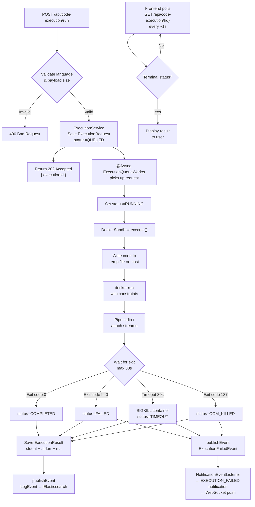
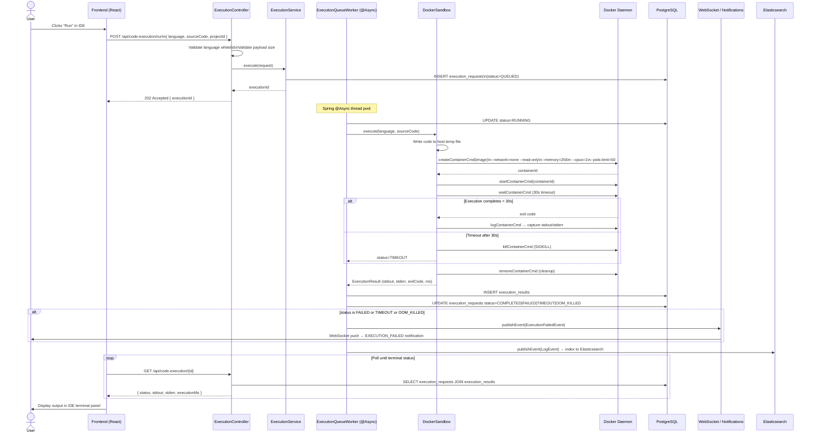
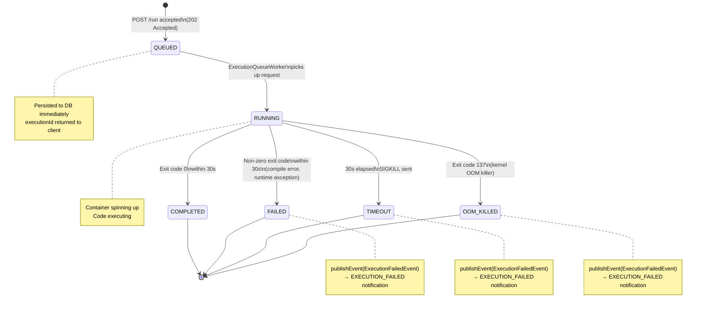

# Code Execution Sandbox — Interview Knowledge Base

> **Feature Area:** Sandboxed code execution via Docker containers  
> **Relevant Files:** `DockerSandbox.java`, `ExecutionService.java`, `ExecutionQueueWorker.java`, `ExecutionController.java`  
> **Difficulty Range:** 🟢 Basic → ⚫ Expert

---

## Table of Contents

1. [Architecture Overview](#1-architecture-overview)
2. [End-to-End Execution Flow](#2-end-to-end-execution-flow)
3. [Security Constraints Per Container](#3-security-constraints-per-container)
4. [Language-Specific Details](#4-language-specific-details)
5. [Execution Status Machine](#5-execution-status-machine)
6. [Execution History & Rate Limiting](#6-execution-history--rate-limiting)
7. [Interview Q&A](#7-interview-qa)
8. [Quick Reference](#8-quick-reference)

---

## 1. Architecture Overview

The code execution sandbox is one of the most security-critical subsystems in DevOps Suite. It allows users to write, submit, and run code in Python, JavaScript, Java, and C++ — all without ever touching the host OS directly. Every execution happens inside an ephemeral, heavily constrained Docker container that is created fresh and destroyed after the run.

### 1.1 Key Source Files

| File | Responsibility |
|------|---------------|
| `ExecutionController.java` | REST endpoints — validates input, delegates to `ExecutionService`, returns `202 Accepted` immediately |
| `ExecutionService.java` | Persists `ExecutionRequest`, triggers async execution, provides history/activity queries |
| `ExecutionQueueWorker.java` | `@Async` Spring component — dequeues requests, calls `DockerSandbox`, persists results |
| `DockerSandbox.java` | Core sandbox logic — uses Docker Java client to spin up containers with security constraints |

### 1.2 Domain Entities

#### `ExecutionRequest` → `execution_requests` table (added in Flyway V16)

```
id             UUID          PK
project_id     UUID          FK → projects (added V16)
user_id        UUID          FK → users
language       VARCHAR       PYTHON | JAVASCRIPT | JAVA | CPP
source_code    TEXT
status         VARCHAR       QUEUED | RUNNING | COMPLETED | FAILED | TIMEOUT | OOM_KILLED
created_at     TIMESTAMP
updated_at     TIMESTAMP
```

> [!NOTE]
> The `project_id` foreign key was added in **Flyway V16** — it was not in the original schema. This ties every execution to a project, enabling project-scoped execution history and activity heatmaps.

#### `ExecutionResult` → `execution_results` table

```
id              UUID     PK
request_id      UUID     FK → execution_requests (one-to-one)
stdout          TEXT
stderr          TEXT
exit_code       INTEGER
execution_ms    BIGINT   Wall-clock time in milliseconds
created_at      TIMESTAMP
```

### 1.3 Language Enum

```java
public enum Language {
    PYTHON,       // python:3.12-alpine
    JAVASCRIPT,   // node:24-alpine
    JAVA,         // eclipse-temurin:21-alpine (two-step: javac → java)
    CPP           // devopssuite-cpp:latest (custom image with g++ 15)
}
```

### 1.4 Docker Java Client

The project uses the **`com.github.docker-java`** library to interact with the Docker daemon programmatically. This means no shell-out to `docker` CLI — instead, a type-safe Java API constructs container configs, starts containers, and streams logs.

```xml
<!-- pom.xml -->
<dependency>
    <groupId>com.github.docker-java</groupId>
    <artifactId>docker-java-core</artifactId>
</dependency>
<dependency>
    <groupId>com.github.docker-java</groupId>
    <artifactId>docker-java-transport-httpclient5</artifactId>
</dependency>
```

Key API calls used in `DockerSandbox.java`:

| API Call | Purpose |
|----------|---------|
| `dockerClient.createContainerCmd(image)` | Build container configuration |
| `.withHostConfig(hostConfig)` | Apply memory/CPU/network constraints |
| `dockerClient.startContainerCmd(id).exec()` | Start the container |
| `dockerClient.waitContainerCmd(id).exec(callback)` | Block until container exits |
| `dockerClient.logContainerCmd(id)` | Stream stdout/stderr |
| `dockerClient.removeContainerCmd(id).exec()` | Clean up container |

---

## 2. End-to-End Execution Flow

### 2.1 High-Level Flowchart



### 2.2 Detailed Sequence Diagram



### 2.3 Step-by-Step Breakdown

#### Step 1 — HTTP Entry Point (`ExecutionController`)

```
POST /api/code-execution/run
Authorization: Bearer <JWT>
Content-Type: application/json

{
  "language": "PYTHON",
  "sourceCode": "print('Hello, World!')",
  "projectId": "uuid-here"
}
```

**Validations performed:**
- Language must be one of `PYTHON | JAVASCRIPT | JAVA | CPP` (whitelist, not user-supplied string)
- Source code payload capped at a maximum size (prevents memory exhaustion from enormous blobs)
- JWT authentication required (via `JwtRequestFilter`)
- Rate limit applied (10 executions/min per user via Redis sliding window)

#### Step 2 — Async Handoff (`ExecutionService`)

`ExecutionService` **immediately** persists the `ExecutionRequest` with `status=QUEUED`, then triggers the async worker. The controller returns `202 Accepted` with the `executionId` — the client never waits for actual execution.

#### Step 3 — Queue Worker (`ExecutionQueueWorker`)

Annotated with `@Async`, this component runs on a Spring-managed thread pool (separate from the HTTP thread pool). It:
1. Updates status to `RUNNING`
2. Calls `DockerSandbox.execute(language, sourceCode)`
3. Persists the result
4. Updates final status
5. Fires application events

#### Step 4 — Docker Sandbox (`DockerSandbox`)

The most complex component. Full detail in sections below.

---

## 3. Security Constraints Per Container

Every container is created with a hardened `HostConfig`. These constraints are non-negotiable and are enforced at the Docker daemon level — user code cannot override them.

### 3.1 Constraint Table

| Constraint | Docker Flag | Value | Purpose |
|-----------|------------|-------|---------|
| Network isolation | `--network=none` | none | Zero internet access — cannot exfiltrate data or C2 |
| Read-only filesystem | `--read-only` | true | Cannot write to container layers — prevents persistence |
| Memory cap | `--memory` | 256 MB | OOM kill if exceeded — prevents host memory starvation |
| CPU cap | `--cpus` | 1.0 | Cannot monopolize CPU cores |
| PID limit | `--pids-limit` | 50 | Prevents fork bombs |
| /tmp mount | tmpfs | `rw,exec,nosuid,size=64m` | Writable scratch space for compilers |
| Execution timeout | SIGKILL | 30 seconds | Terminates infinite loops |
| User | `--user` | non-root | Reduces container escape blast radius |

### 3.2 Why Each Constraint Matters

#### `--network=none`
Without this, a malicious script could:
- Make outbound HTTP requests to attacker-controlled servers
- Port-scan internal services (Redis, PostgreSQL)
- Exfiltrate environment variables or secrets
- Mine cryptocurrency

#### `--read-only`
The container's root filesystem is mounted read-only. The container runtime creates an overlay filesystem where the writable layer is absent. This means:
- Cannot install packages at runtime (`pip install`, `npm install`)
- Cannot write backdoors to the filesystem
- Cannot tamper with the base image binaries

#### `/tmp` as tmpfs
Since `--read-only` blocks all writes, compiled languages need somewhere to write their output binary. A `tmpfs` (RAM-backed) mount at `/tmp` is provided with:
- `rw` — writable
- `exec` — execute bit enabled (critical for C++ and Java `.class` files)
- `nosuid` — prevents setuid escalation
- `size=64m` — bounded to 64 MB so it can't exhaust host RAM

> [!CAUTION]
> The `exec` flag on tmpfs is deliberate but controlled risk — it only allows execution of files that the user's code wrote into `/tmp`, and those files are destroyed with the container.

#### `--memory=256m` and OOM Kill
When a process inside the container exceeds 256 MB of RAM, the Linux kernel OOM killer terminates it. Docker reports this as **exit code 137** (`SIGKILL` = 9, 128+9=137). `DockerSandbox` detects this and maps it to `OOM_KILLED` status.

#### `--pids-limit=50` — Fork Bomb Prevention
A fork bomb (`:(){ :|:& };:` in bash) rapidly spawns processes exponentially. With `--pids-limit=50`, the container can have at most 50 PIDs total. When the limit is hit, `fork()` returns `EAGAIN` and new processes cannot be created. The existing ones continue but the bomb is contained.

#### 30-Second SIGKILL Timeout
`DockerSandbox` uses a `Future` or timed wait on the container wait callback. If the container hasn't exited within 30 seconds, Docker sends `SIGKILL` directly to the container's main process (PID 1 in the container), and the container is force-stopped. This handles:
- Infinite loops: `while True: pass`
- Blocking I/O: `input()` with no stdin
- Sleeping: `time.sleep(99999)`

#### Non-Root User
Containers run as a non-root user (UID != 0). This limits the blast radius if a container escape vulnerability exists in the Docker runtime — the attacker would land as an unprivileged user on the host.

### 3.3 Container Lifecycle

```
Host temp file written → Container created → Container started
       → Code executes → Container exits (or killed)
              → Logs captured → Container removed
                     → Temp file deleted
```

Every container is **ephemeral** — created and destroyed per execution. No state persists between runs.

---

## 4. Language-Specific Details

### 4.1 Language Support Matrix

| Language | Docker Image | Execution Strategy | Compile Step | Notes |
|----------|-------------|-------------------|-------------|-------|
| Python 3.12 | `python:3.12-alpine` | Direct interpret | None | Fastest startup |
| JavaScript | `node:24-alpine` | Direct interpret via `node` | None | Node.js 24 LTS |
| Java 21 | `eclipse-temurin:21-alpine` | Compile → run | `javac Main.java` → `java Main` | Two-step process |
| C++ | `devopssuite-cpp:latest` | Compile → run | `g++ -o /tmp/a.out main.cpp` → `/tmp/a.out` | **Custom image required** |

### 4.2 Python

```bash
# Docker command equivalent
docker run --rm \
  --network=none --read-only \
  --memory=256m --cpus=1 --pids-limit=50 \
  --tmpfs /tmp:rw,exec,nosuid,size=64m \
  python:3.12-alpine \
  python /tmp/main.py
```

- **Alpine base** keeps image size small (~50 MB)
- Code file is bind-mounted or written via stdin pipe
- Startup time: ~300–500 ms

### 4.3 JavaScript (Node.js)

```bash
docker run --rm \
  --network=none --read-only \
  --memory=256m --cpus=1 --pids-limit=50 \
  --tmpfs /tmp:rw,exec,nosuid,size=64m \
  node:24-alpine \
  node /tmp/main.js
```

- Node.js 24 (current LTS)
- Alpine base
- No `npm install` possible at runtime (network disabled, filesystem read-only)

### 4.4 Java — Two-Step Execution

Java requires compilation before execution. `DockerSandbox` handles this in a single container lifecycle:

```bash
docker run --rm \
  --network=none --read-only \
  --memory=256m --cpus=1 --pids-limit=50 \
  --tmpfs /tmp:rw,exec,nosuid,size=64m \
  eclipse-temurin:21-alpine \
  sh -c "javac /tmp/Main.java && java -cp /tmp Main"
```

**Key considerations:**
- The user's class must be named `Main` (enforced or wrapped by the service)
- `.class` files are written to `/tmp` (tmpfs, exec-enabled)
- JVM startup adds latency (~500–800 ms)
- The combined compile+run timeout still fits within the 30s window

### 4.5 C++ — The Custom Image Story

C++ has a **special case** that required building a custom Docker image. Here's why:

#### The Problem
```bash
# Attempt with standard gcc image
docker run --read-only --tmpfs /tmp:rw,exec,nosuid,size=64m \
  gcc:latest \
  sh -c "g++ -o /tmp/a.out main.cpp && /tmp/a.out"
```

`g++` writes **intermediate temp files** during compilation (`.s` assembly files, `.o` object files) to system directories like `/tmp/cc*.s`. With `--read-only`, those directories are inaccessible. While `/tmp` is a writable tmpfs, the standard `gcc` image's `/usr/lib/gcc/.../specs` files and compiler driver expected to use **specific system paths** that were read-only.

> [!IMPORTANT]
> The `exec` flag on `/tmp` is necessary but not sufficient — the GCC compiler driver itself writes temporary files to paths outside `/tmp` unless explicitly configured. This caused compilation failures with `--read-only`.

#### The Solution: Custom Image `devopssuite-cpp:latest`

A custom Dockerfile was created that:
1. Starts from `gcc:15-alpine` (or similar base with g++ 15)
2. Configures `TMPDIR=/tmp` and compiler specs to use `/tmp` for all temp files
3. Optionally pre-configures compiler flags for the sandbox environment

```dockerfile
FROM gcc:15-alpine
# Force all compiler temp files to /tmp
ENV TMPDIR=/tmp
# Pre-configure for sandbox execution
RUN echo "Sandbox-ready C++ image"
```

This means compilation works correctly even with `--read-only` because:
- `/tmp` (tmpfs) is writable with exec permission
- The compiler is configured to only use `/tmp` for intermediates
- The output binary at `/tmp/a.out` is executable

```bash
# Final C++ execution
docker run --rm \
  --network=none --read-only \
  --memory=256m --cpus=1 --pids-limit=50 \
  --tmpfs /tmp:rw,exec,nosuid,size=64m \
  devopssuite-cpp:latest \
  sh -c "g++ -o /tmp/a.out /tmp/main.cpp && /tmp/a.out"
```

---

## 5. Execution Status Machine

### 5.1 State Diagram



### 5.2 Terminal Status Mapping

| Exit Code | Status | Cause |
|-----------|--------|-------|
| `0` | `COMPLETED` | Successful execution |
| `1`, `2`, non-zero (≠137) | `FAILED` | Runtime error, compile error, or unhandled exception |
| `137` | `OOM_KILLED` | Memory limit exceeded (128 + SIGKILL signal 9) |
| N/A (Docker killed) | `TIMEOUT` | 30-second wall-clock timeout |

### 5.3 Failure Notification Flow

When execution ends in `FAILED`, `TIMEOUT`, or `OOM_KILLED`:

```
ExecutionQueueWorker
    └── applicationEventPublisher.publishEvent(new ExecutionFailedEvent(userId, projectId, executionId))
            └── NotificationEventListener.onExecutionFailed()
                    └── Creates Notification(type=EXECUTION_FAILED)
                    └── Saves to DB
                    └── SimpMessagingTemplate.convertAndSend(
                            "/topic/notifications/" + userId,
                            notificationDTO
                        )
                            └── Frontend WebSocket receives push
                            └── Bell icon shows red badge
```

---

## 6. Execution History & Rate Limiting

### 6.1 History Endpoint

```
GET /api/code-execution/history?page=0&size=20
Authorization: Bearer <JWT>
```

Returns paginated list of the authenticated user's past executions (across all projects), ordered by `created_at DESC`. Each record includes:
- `executionId`, `language`, `status`
- `createdAt`, `executionMs`
- Truncated `stdout`/`stderr` (full result fetched via `GET /api/code-execution/{id}`)

### 6.2 Activity Heatmap Endpoint

```
GET /api/code-execution/activity?days=365
Authorization: Bearer <JWT>
```

Returns daily execution counts for the past N days, used to render a GitHub-style contribution heatmap on the IDE page:

```json
[
  { "date": "2025-01-01", "count": 3 },
  { "date": "2025-01-02", "count": 12 },
  ...
]
```

This is a SQL aggregate query:
```sql
SELECT DATE(created_at) as date, COUNT(*) as count
FROM execution_requests
WHERE user_id = :userId
  AND created_at >= NOW() - INTERVAL ':days days'
GROUP BY DATE(created_at)
ORDER BY date ASC
```

### 6.3 Rate Limiting

Execution submissions are rate-limited separately from the global API rate limit:

| Parameter | Value |
|-----------|-------|
| Limit | 10 executions per minute |
| Window type | Sliding window (Redis) |
| Redis key pattern | `rate:execution:{userId}:{bucketTimestamp}` |
| Config env var | `RATE_LIMIT_EXECUTION_MAX` |
| Response when exceeded | `429 Too Many Requests` |

The sliding window implementation uses Redis sorted sets or counters with expiry. Each execution attempt increments a counter; if it exceeds `RATE_LIMIT_EXECUTION_MAX` within the rolling 60-second window, the request is rejected before touching the database.

> [!TIP]
> The rate limit is per-user (by `userId`), not per-IP. This ensures authenticated users are individually throttled regardless of shared IPs (e.g., users behind a corporate NAT).

---

## 7. Interview Q&A

---

### Section A: Core Security & Architecture

---

#### Q1 🟢 How do you safely execute untrusted user code?

**Answer:**

The system uses Docker containers as an isolation boundary. When a user submits code, it runs inside an ephemeral container with the following protection layers:

**1. Network Isolation (`--network=none`)**  
The container has no network interfaces beyond loopback. It cannot make outbound connections, access internal services (PostgreSQL, Redis), or receive inbound connections.

**2. Filesystem Immutability (`--read-only`)**  
The container's filesystem is read-only. Only a `/tmp` tmpfs is writable, and it's bounded to 64 MB. Code cannot install packages, write persistent files, or tamper with the base image.

**3. Resource Limits**  
- `--memory=256m`: Container is OOM-killed if it consumes >256 MB RAM
- `--cpus=1`: Hard CPU limit prevents starvation of other executions
- `--pids-limit=50`: Fork bomb prevention
- 30-second timeout: Infinite loops are terminated via `SIGKILL`

**4. Non-Root Execution**  
The code runs as a non-root user inside the container, limiting blast radius if a container escape occurs.

**5. Language Whitelist**  
Only pre-approved language values (`PYTHON`, `JAVASCRIPT`, `JAVA`, `CPP`) are accepted. The language determines which Docker image is used — users cannot specify arbitrary images or commands.

**6. Ephemeral Containers**  
Each execution gets a fresh container. There is no shared state between executions, even from the same user.

---

#### Q2 🟡 What's the difference between a container and a VM for isolation? Why use a container here?

**Answer:**

| Property | Virtual Machine | Docker Container |
|----------|----------------|-----------------|
| Isolation unit | Full OS + kernel | Process namespace isolation |
| Startup time | 10–60 seconds | 300 ms – 2 seconds |
| Memory overhead | 256 MB – 1 GB per VM | ~5–20 MB overhead |
| Kernel | Separate kernel per VM | Shared host kernel |
| Security boundary | Hardware-level (hypervisor) | Namespace + cgroup level |
| Escape risk | Near-zero (Type 1 hypervisor) | Non-zero (kernel vulnerabilities) |

**Why containers for this project:**
- **Startup speed**: User code runs in <2 seconds total; VMs would add 30+ seconds just to boot
- **Density**: Can run hundreds of concurrent executions on a single host; VMs would be far heavier
- **Trade-off accepted**: The kernel is shared, so a kernel exploit could theoretically escape. This risk is mitigated by non-root execution, read-only filesystem, and seccomp profiles

**What makes containers "safe enough":**
- The security constraints (`--network=none`, `--read-only`, `--pids-limit`) drastically reduce the attack surface
- `--cap-drop=ALL` can be added to drop all Linux capabilities
- seccomp profiles can block dangerous syscalls (`ptrace`, `mount`, etc.)

**Follow-up:** *In a production system with higher security requirements (e.g., running code from anonymous users), you'd use gVisor (user-space kernel) or Firecracker (microVMs) instead.*

---

#### Q3 🟡 How do you prevent a fork bomb inside a container?

**Answer:**

A fork bomb rapidly creates processes exponentially (e.g., `:(){ :|:& };:` in bash, or `while True: os.fork()` in Python) until the system runs out of PIDs, causing a denial of service.

**The fix:** `--pids-limit=50`

This sets a cgroup-level PID limit on the container. When the number of PIDs in the container reaches 50:
- `fork()` and `clone()` system calls return `EAGAIN`
- New processes cannot be created
- The existing process(es) continue running but the exponential growth is stopped

The container is then subject to the 30-second timeout, after which `SIGKILL` cleans it up.

**Why 50?**  
- Python interpreter + stdlib: ~5–10 PIDs
- Java JVM: ~20–30 threads/PIDs
- Leaves headroom for compile step in Java/C++
- Still prevents runaway process creation

---

#### Q4 🟡 What happens if code tries to access the network?

**Answer:**

With `--network=none`, Docker creates the container with **no network interfaces** except loopback (`127.0.0.1`). Any attempt to establish outbound connections fails immediately at the syscall level.

**What happens in practice:**

```python
import socket
s = socket.socket()
s.connect(("8.8.8.8", 80))  # Raises: [Errno 101] Network is unreachable
```

The code receives a `Network is unreachable` (ERRNO 101) error. From the user's perspective, they see this in `stderr` and the execution status will be `FAILED` (non-zero exit code) or the code handles the exception itself.

**What cannot be accessed:**
- Public internet
- Internal services (PostgreSQL at its internal Docker network IP, Redis, other containers)
- The host machine
- Other containers on the `app` or `observability` Docker networks

This is enforced at the kernel networking level — there is no network route to anywhere, so no firewall rules are even needed.

---

#### Q5 🔴 Why is execution async instead of synchronous?

**Answer:**

Synchronous execution would mean the HTTP thread blocks waiting for the container to finish (up to 30 seconds). This is catastrophic for scalability:

**Problems with synchronous execution:**

| Problem | Impact |
|---------|--------|
| HTTP thread held for 30s | Thread pool exhausted with ~50–100 concurrent executions |
| Tomcat default thread pool: 200 threads | 200 concurrent executions = server dead |
| Client timeout | Load balancers typically timeout at 30–60s; compilations + execution can hit this |
| Backpressure lost | No way to queue requests — each either succeeds or fails immediately |

**Benefits of async execution:**

1. **Immediate response (202 Accepted)**: HTTP thread is freed in milliseconds. The server can handle thousands of submissions with the same thread pool.

2. **Decoupled queue**: `ExecutionQueueWorker` on `@Async` thread pool handles actual work. This pool can be sized independently from the HTTP thread pool.

3. **Survivability**: If the worker crashes on one execution, others are unaffected. The request persists in DB as `QUEUED` and can be retried.

4. **Backpressure**: If the async pool is saturated, requests queue up in DB rather than dropping. You can add more workers without changing the HTTP layer.

5. **Client polling**: The frontend polls every ~1 second using `GET /api/code-execution/{id}`. This is a cheap read from PostgreSQL (or Redis cache). The client stays responsive throughout.

**Follow-up:** *"Why not WebSockets for push instead of polling?"* — The execution can take up to 30s. WebSocket push is added **on failure** (via `ExecutionFailedEvent`), but for the happy path, the result is simply polled. Polling every second for up to 30s = 30 requests, which is perfectly acceptable and simpler than maintaining a long-lived push connection per execution.

---

### Section B: Implementation Details

---

#### Q6 🟡 How do you distinguish TIMEOUT from a bug in the code?

**Answer:**

The differentiation happens in `DockerSandbox.java` based on **how the container stopped**, not just the exit code:

**TIMEOUT detection:**
```java
// Pseudo-code
boolean finished = waitResult.awaitCompletion(30, TimeUnit.SECONDS);
if (!finished) {
    dockerClient.killContainerCmd(containerId).withSignal("KILL").exec();
    return ExecutionOutcome.TIMEOUT;
}
```
If the `awaitCompletion` call times out (returns `false`), we know the container was still running at the 30-second mark. We send `SIGKILL` and record `TIMEOUT`.

**FAILED detection (exit code ≠ 0, ≠ 137):**
The container exited on its own within 30 seconds with a non-zero exit code. This indicates a runtime error (Python `Exception`, Java `Exception`, compile failure, etc.).

**OOM_KILLED detection (exit code 137):**
```java
int exitCode = getContainerExitCode(containerId);
if (exitCode == 137) {
    return ExecutionOutcome.OOM_KILLED;
}
```
Linux OOM killer sends `SIGKILL` (signal 9) to the process. Exit code = 128 + 9 = **137**. Docker propagates this as the container's exit code.

**Summary table:**

| Condition | Detection Method | Status |
|-----------|-----------------|--------|
| awaitCompletion times out at 30s | Timeout flag from Docker wait | `TIMEOUT` |
| Container exits, code = 0 | Exit code check | `COMPLETED` |
| Container exits, code = 137 | Exit code check | `OOM_KILLED` |
| Container exits, code ≠ 0 ≠ 137 | Exit code check | `FAILED` |

---

#### Q7 🔴 How did you solve the C++ binary execution problem?

**Answer:**

This was a real debugging challenge. The issue arose from combining two constraints: `--read-only` filesystem and the way GCC works internally.

**Root Cause:**

When GCC compiles C++ code, it's not a single process. The GCC "driver" (`g++`) invokes multiple sub-programs:
1. The preprocessor (`cc1plus`)
2. The assembler (`as`)
3. The linker (`ld`)

These sub-programs write **temporary intermediate files** to directories configured in GCC's spec files (typically `/tmp/cc*.s`, `/tmp/cc*.o`). However, some GCC builds reference directories that don't exist in the container or are on the read-only layer.

Additionally, with `--read-only`, any directory that GCC tries to write to (outside of explicitly mounted tmpfs) fails with `EROFS (Read-only file system)`.

**Why the standard gcc image failed:**

The standard `gcc:latest` image has certain hardcoded paths in its compiler specs. When the `/tmp` tmpfs was mounted at `/tmp`, the assembly step tried writing to a path that didn't resolve cleanly through the tmpfs mount, causing compilation to fail with:
```
cc1plus: error: /tmp/ccXXXXXX: No such file or directory
```
or
```
as: cannot open output file /tmp/ccXXXXXX.s: Read-only file system
```

**The Solution — Custom Image `devopssuite-cpp:latest`:**

A custom Dockerfile was built that:

```dockerfile
FROM gcc:15-alpine
# Explicitly set all GCC temp directories to /tmp
ENV TMPDIR=/tmp
ENV TEMP=/tmp
ENV TMP=/tmp
# Verify g++ version
RUN g++ --version
```

Additionally, the execution command explicitly passes `-pipe` to GCC to reduce temp file usage and `-o /tmp/a.out` to ensure the binary lands in the tmpfs:

```bash
g++ -pipe -o /tmp/a.out /tmp/main.cpp && /tmp/a.out
```

The `-pipe` flag tells GCC to use pipes between compilation stages instead of temporary files, eliminating most intermediate file writes.

**Result:** C++ compilation and execution now works reliably in the read-only sandbox environment.

---

#### Q8 🟡 How does the frontend know when execution is complete?

**Answer:**

The frontend uses **polling** — it calls `GET /api/code-execution/{id}` approximately every 1 second until it receives a terminal status.

**Frontend flow (in `IDEPage.jsx`):**
```javascript
// After receiving executionId from POST /run
const pollExecution = async (executionId) => {
  const interval = setInterval(async () => {
    const result = await api.get(`/code-execution/${executionId}`);
    const { status } = result.data;

    if (['COMPLETED', 'FAILED', 'TIMEOUT', 'OOM_KILLED'].includes(status)) {
      clearInterval(interval);
      setExecutionResult(result.data);
    }
  }, 1000);

  // Safety: clear after 35s regardless
  setTimeout(() => clearInterval(interval), 35000);
};
```

**Why polling instead of WebSocket push for results?**
- Simple and reliable — no connection management
- The IDE already has a WebSocket connection for notifications; mixing execution result delivery through it adds complexity
- 30 polls × 1 GET = 30 lightweight DB reads, perfectly acceptable
- WebSocket **is** used for the failure case — if execution fails, the user gets a WebSocket push notification via `/topic/notifications/{userId}`, providing an instant UX signal even before the poll cycle

**Backend query for polling:**
```sql
SELECT er.*, ers.stdout, ers.stderr, ers.exit_code, ers.execution_ms
FROM execution_requests er
LEFT JOIN execution_results ers ON ers.request_id = er.id
WHERE er.id = :executionId AND er.user_id = :userId
```

---

### Section C: Advanced & Expert

---

#### Q9 🔴 What is OOM Kill and how does Docker trigger it?

**Answer:**

**OOM Kill** (Out-Of-Memory Kill) is a Linux kernel mechanism that terminates processes when the system or a cgroup runs out of memory.

**How it works with Docker:**

1. Docker sets a **cgroup memory limit** (`--memory=256m`) for the container
2. The Linux kernel's cgroup subsystem tracks memory usage of all processes in the cgroup
3. When a process inside the container tries to allocate memory beyond 256 MB, the kernel's OOM killer is invoked
4. The kernel selects the process with the highest "badness score" (typically the biggest memory consumer) and sends it `SIGKILL` (signal 9)
5. The container's main process exits with code `128 + 9 = 137`

**In DockerSandbox.java:**
```java
int exitCode = inspectContainerCmd(containerId).exec().getState().getExitCodeLong();
if (exitCode == 137) {
    return ExecutionOutcome.builder()
        .status(ExecutionStatus.OOM_KILLED)
        .stderr("Execution killed: memory limit (256 MB) exceeded")
        .build();
}
```

**Example code that triggers OOM:**
```python
# This will be OOM-killed
data = []
while True:
    data.append("x" * 1024 * 1024)  # Allocate 1MB per iteration
```

**Why 256 MB?**
- Sufficient for most code execution tasks (sorting 10M elements, string manipulation, basic algorithms)
- Prevents a single execution from consuming host RAM that other containers need
- Java JVM minimum heap starts at ~64 MB; 256 MB gives reasonable headroom

> [!NOTE]
> The OOM killer may sometimes kill a different process than the one causing the issue (e.g., a JVM helper thread). Exit code 137 reliably indicates memory exhaustion regardless.

---

#### Q10 ⚫ How would you scale this to 10,000 concurrent executions?

**Answer:**

The current architecture is a **single-host monolith** with `@Async` workers. At 10,000 concurrent executions, several bottlenecks emerge:

**Current Bottlenecks:**

| Component | Current Limit | Bottleneck |
|-----------|--------------|-----------|
| Docker on single host | ~100–200 containers | CPU/RAM exhaustion |
| `@Async` thread pool | Configurable, ~50–100 | Thread exhaustion |
| PostgreSQL | Single instance | Write contention on `execution_requests` |
| `ExecutionQueueWorker` | In-process, single node | No distributed coordination |

**Scaling Architecture for 10K Concurrent Executions:**

**Phase 1: Distributed Queue**
Replace `@Async` in-process triggering with a **distributed message queue** (Kafka or RabbitMQ):

```
ExecutionService → Kafka topic (execution-requests)
                     ↓
              ExecutionWorker pool (horizontally scaled)
                     ↓
              DockerSandbox (per worker)
```

Workers become independent microservices. You can scale them independently.

**Phase 2: Horizontal Worker Scaling**
Run multiple `ExecutionWorker` instances, each on a dedicated node:
- Each worker node has Docker installed
- Workers pull from Kafka partition
- 50 workers × 200 containers each = 10,000 concurrent executions

**Phase 3: Kubernetes + Node Pools**
Use Kubernetes with dedicated node pools for execution:
- `execution-pool` nodes: high CPU, lots of RAM, Docker/containerd
- Auto-scale node pool based on queue depth
- Each pod runs one `ExecutionWorker` with access to the host Docker socket (or use Kubernetes Jobs)

**Phase 4: Container Orchestration Alternatives**
- **Kubernetes Jobs**: Submit each execution as a K8s Job instead of managing Docker directly
- **AWS Fargate**: Submit container execution to serverless container platform — no server management
- **Firecracker microVMs**: For stronger isolation, use Firecracker (AWS Lambda's runtime) instead of Docker containers

**Phase 5: Result Delivery at Scale**
- Replace polling with **WebSocket push** for results (eliminate 10K × 30 polls/sec = 300K RPS on polling endpoint)
- Or use **Server-Sent Events (SSE)** for lightweight one-way push
- Cache execution results in Redis for fast retrieval during polling period

**Phase 6: Rate Limiting & Fairness**
- Implement per-user and per-organization execution quotas
- Priority queues: OWNER/ADMIN submissions get lower latency than VIEWER
- Burst allowance + sustained rate limiting

**Summary Architecture at Scale:**
```
Load Balancer
    → API Servers (n instances)
        → Kafka (execution-requests topic, N partitions)
            → Execution Worker Fleet (K8s node pool, auto-scaled)
                → Docker / Firecracker containers
                    → Results → Kafka (execution-results topic)
                        → Result Processor → DB + Redis
                            → WebSocket Push → Frontend
```

---

#### Q11 🔴 How do you handle the Java class name requirement?

**Answer:**

Java is uniquely restrictive: the public class name **must match the filename** (`Main.java` must contain `public class Main`). The `DockerSandbox` handles this by:

1. **Always writing the code to `Main.java`** regardless of what the user named their class
2. **Wrapping** the user's code if it doesn't contain a class declaration (for simple snippets)
3. **Enforcing** that users submit valid Java with a `Main` class for full programs

The compile command is:
```bash
javac /tmp/Main.java -d /tmp && java -cp /tmp Main
```

If the user's code has compilation errors, `javac` exits non-zero, and the stderr is captured and shown to the user as a `FAILED` execution with the compiler error message.

---

#### Q12 🔴 What happens to the Docker container if the JVM crashes in a Java execution?

**Answer:**

If the JVM itself crashes (JVM bug, native crash, stack overflow causing JVM abort), the container's main process terminates abnormally with a non-zero exit code. This is handled identically to any other `FAILED` status:

- Exit code is non-zero (typically 1 or a crash-specific code like 134 for SIGABRT)
- If exit code is not 0 and not 137, status = `FAILED`
- stderr will contain JVM crash output (hs_err_pid*.log contents), though with `--read-only` the JVM crash dump cannot be written to disk — it goes to stderr instead

The container is still cleaned up via `removeContainerCmd`. No zombie containers accumulate.

---

#### Q13 🟡 How do you prevent one user's execution from impacting another's?

**Answer:**

**Process-level isolation:** Each execution gets its own container (separate Linux namespaces: PID, network, mount, UTS, IPC). Processes in different containers cannot see or signal each other.

**Resource isolation via cgroups:**
- `--memory=256m`: Container A using 250 MB doesn't affect Container B's allocation
- `--cpus=1`: Container A cannot steal CPU cycles from Container B beyond its 1-CPU share

**Network isolation:** `--network=none` means containers cannot communicate with each other even if they wanted to.

**Filesystem isolation:** Each container has its own overlay filesystem and its own `/tmp` tmpfs. Container A cannot read Container B's files.

**Temporal isolation:** Containers are ephemeral and destroyed immediately after use. No shared state persists.

---

#### Q14 🟡 What observability do you have over code executions?

**Answer:**

**Prometheus Custom Metrics (`AppMetrics.java`):**
```
devopssuite_code_executions_total{language, status}
```
This counter is incremented after every execution. Grafana can graph:
- Execution volume by language
- Failure rate by language (FAILED/TIMEOUT/OOM_KILLED vs COMPLETED)
- OOM kill frequency

**Elasticsearch Logging:**
After every execution, `ExecutionQueueWorker` publishes a `LogEvent` which `ElasticsearchLogService` indexes to `devopssuite-logs-yyyy.MM.dd`:
```json
{
  "timestamp": "2025-01-15T10:30:00Z",
  "level": "INFO",
  "event": "CODE_EXECUTION",
  "executionId": "uuid",
  "userId": "uuid",
  "projectId": "uuid",
  "language": "PYTHON",
  "status": "COMPLETED",
  "executionMs": 342,
  "exitCode": 0
}
```

Kibana can query: "Show all executions that took >10 seconds", "Show all OOM kills in the last 24h".

**Execution History API:** Users can view their own execution history via `GET /api/code-execution/history`. Admins can potentially query across users.

**Activity Heatmap:** `GET /api/code-execution/activity?days=365` powers the GitHub-style contribution heatmap on the IDE page, giving users a visual of their coding activity.

---

#### Q15 ⚫ How would you add streaming output (show stdout as it's produced, not all at once)?

**Answer:**

Currently, `DockerSandbox` captures stdout/stderr **after** the container exits (or via `logContainerCmd` which buffers). For streaming output:

**Solution: Docker Log Streaming + WebSocket Push**

1. **Change `logContainerCmd` to stream mode:**
```java
dockerClient.logContainerCmd(containerId)
    .withFollowStream(true)  // Stream, don't wait for completion
    .withStdOut(true)
    .withStdErr(true)
    .exec(new ResultCallback.Adapter<Frame>() {
        @Override
        public void onNext(Frame frame) {
            String line = new String(frame.getPayload());
            // Push to WebSocket
            messagingTemplate.convertAndSend(
                "/topic/logs/" + projectId,
                new StreamChunk(executionId, line, frame.getStreamType())
            );
        }
    });
```

2. **Frontend subscribes to `/topic/logs/{projectId}`** (already existing WebSocket topic!) and appends output lines to the terminal as they arrive.

3. **Backend still captures full output** for persistence in `execution_results.stdout`.

**Challenges:**
- Must handle partial lines (frame boundaries don't align with `\n`)
- Buffer overflow if user spams output (`print("x" * 1MB)` in a loop)
- Need to distinguish between multiple concurrent executions on the same project's log topic
- WebSocket backpressure: slow client can't keep up with fast-outputting container

**Rate limiting output:** Cap the number of bytes forwarded per second (e.g., 64 KB/s) and truncate with a warning message.

---

## 8. Quick Reference

### Most Important Facts to Remember

| Topic | Key Detail |
|-------|-----------|
| Async pattern | `POST /run` → `202 Accepted` immediately; `@Async ExecutionQueueWorker` does actual work |
| Container constraints | `--network=none --read-only --memory=256m --cpus=1 --pids-limit=50` + 30s SIGKILL |
| /tmp mount | `tmpfs:rw,exec,nosuid,size=64m` — writable scratch space for compilers |
| OOM detection | Exit code **137** = `SIGKILL` from kernel OOM killer = `OOM_KILLED` status |
| Timeout detection | Docker `awaitCompletion(30s)` returns false → SIGKILL → `TIMEOUT` status |
| C++ special case | Custom `devopssuite-cpp:latest` image with `TMPDIR=/tmp` + `-pipe` flag to avoid read-only filesystem issues |
| Java two-step | `javac /tmp/Main.java -d /tmp && java -cp /tmp Main` inside single container |
| Images | Python: `python:3.12-alpine`, JS: `node:24-alpine`, Java: `eclipse-temurin:21-alpine`, C++: `devopssuite-cpp:latest` |
| Status machine | `QUEUED → RUNNING → COMPLETED \| FAILED \| TIMEOUT \| OOM_KILLED` |
| Failure notifications | `FAILED`/`TIMEOUT`/`OOM_KILLED` → `ExecutionFailedEvent` → `EXECUTION_FAILED` notification → WebSocket push |
| Rate limit | 10 executions/min per user (Redis sliding window), env: `RATE_LIMIT_EXECUTION_MAX` |
| History endpoint | `GET /api/code-execution/history?page=0&size=20` |
| Activity heatmap | `GET /api/code-execution/activity?days=365` → daily execution counts |
| Prometheus metric | `devopssuite_code_executions_total{language, status}` |
| Docker Java client | `com.github.docker-java` — programmatic API, no shell-out to `docker` CLI |
| DB tables | `execution_requests` (with `project_id` added V16) + `execution_results` |
| Fork bomb defense | `--pids-limit=50` — cgroup-level PID limit, `fork()` returns `EAGAIN` at limit |

### Status → Exit Code Reference

```
COMPLETED   → exit code 0
FAILED      → exit code 1, 2, or other non-zero (≠ 137)
OOM_KILLED  → exit code 137 (128 + SIGKILL 9)
TIMEOUT     → awaitCompletion() timeout (30s), SIGKILL sent by DockerSandbox
```

### Security Layers (Defense in Depth)

```
Layer 1: Authentication (JWT required to submit)
Layer 2: Rate limiting (10/min per user, Redis)
Layer 3: Input validation (language whitelist, payload size cap)
Layer 4: --network=none (no internet or internal network access)
Layer 5: --read-only (immutable filesystem)
Layer 6: --memory=256m (OOM kill on memory abuse)
Layer 7: --cpus=1 (CPU isolation)
Layer 8: --pids-limit=50 (fork bomb prevention)
Layer 9: 30s SIGKILL timeout (infinite loop termination)
Layer 10: Non-root user (container escape blast radius reduction)
Layer 11: Ephemeral containers (no state persistence)
```

---

*Part of the DevOps Suite Interview Knowledge Base — `03-backend/code-execution-sandbox.md`*
