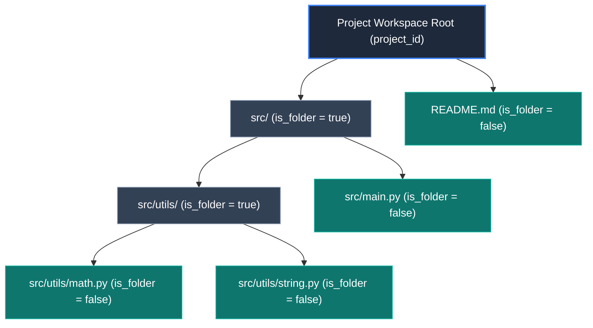
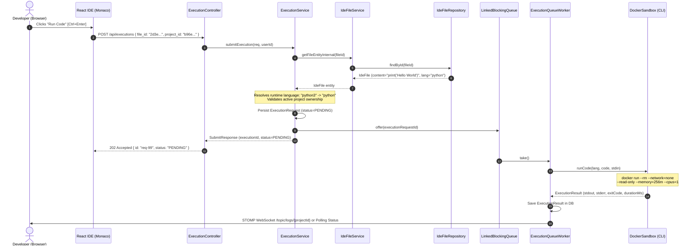
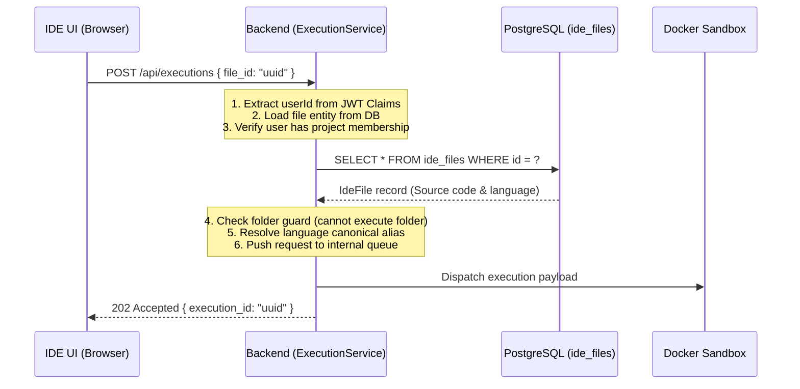

# IDE Module & Virtual Filesystem Architecture — Deep Dive & Interview Guide

The **IDE Module** in DevOps Suite provides an in-browser cloud development experience powered by Microsoft's Monaco Editor (the core editor behind VS Code). It delivers project-scoped virtual file hierarchies, lazy-loaded file persistence, atomic CRUD operations, auto-inferencing language tooling, and direct execution bridging into isolated Docker sandboxes.

Unlike traditional desktop IDEs that rely on a physical local filesystem, DevOps Suite abstracts file hierarchies into a relational persistence model inside PostgreSQL. This architecture guarantees strict project isolation, instant cross-device availability, fine-grained access control, and low-latency network payloads through a metadata/content separation pattern.

---

## 1. Architectural Overview & System Design

```
+--------------------------------------------------------------------------------------------------+
|                                           CLIENT TIER                                            |
|   React 18 SPA | Monaco Editor (VS Code core) | EditorContext.jsx | File Tree Explorer Component |
+--------------------------------------------------------------------------------------------------+
          |                                                                    |
          | 1. GET /api/ide/files?projectId={id} (Fast metadata)               | 4. POST /api/executions
          | 2. GET /api/ide/files/{id} (Lazy load content)                     |    { file_id, language }
          | 3. PUT /api/ide/files/{id} (Debounced auto-save)                   |
          v                                                                    v
+--------------------------------------------------------------------------------------------------+
|                                    APPLICATION TIER (SPRING BOOT)                                |
|                                                                                                  |
|   +-----------------------+      +-----------------------+      +----------------------------+   |
|   |   IdeFileController   | ---> |     IdeFileService    | ---> |      ExecutionService      |   |
|   +-----------------------+      +-----------------------+      +----------------------------+   |
|              |                               |                                |                  |
|              | SecurityContext               | Project & Member Auth          | Queue Worker     |
|              v                               v                                v                  |
|   +-----------------------+      +-----------------------+      +----------------------------+   |
|   |   JwtRequestFilter    |      |   IdeFileRepository   |      | Ephemeral Docker Sandbox   |   |
|   +-----------------------+      +-----------------------+      +----------------------------+   |
+----------------------------------------------|---------------------------------------------------+
                                               v
+--------------------------------------------------------------------------------------------------+
|                                         PERSISTENCE TIER                                         |
|                                PostgreSQL 16 ("ide_files" table)                                 |
|         Composite Index (project_id, path) | Cascade Deletes | Ancestor Tree Resolution          |
+--------------------------------------------------------------------------------------------------+
```

### 1.1 Core Design Pillars

1. **Virtual Filesystem in RDBMS:** Instead of provisioning persistent network volumes (EFS/NFS) or mounting host directories per user, file tree nodes are modeled as rows in the relational `ide_files` table.
2. **Metadata & Content Decoupling:** Browsing large repository trees transfers zero file body bytes. The file tree renders in single-digit milliseconds via `FileListItem`, while full text contents (`FileDetail`) are fetched on-demand when an editor tab is opened.
3. **Ancestor Invariant Guarantee:** Path creation (e.g., `src/components/buttons/PrimaryButton.jsx`) automatically verifies and backfills intermediate virtual folder records (`src`, `src/components`, `src/components/buttons`), preventing orphaned leaf nodes.
4. **Zero-Copy Execution Bridging:** The execution engine resolves source code directly from `IdeFile` records by primary key (`fileId`), avoiding redundant client round-trips while enforcing server-side project authorization.

---

## 2. Relational Schema & Entity Modeling

The database schema is defined in Flyway migration [`V7__ide_files.sql`](file:///d:/Projects/DevOps%20Suite/backend/src/main/resources/db/migration/V7__ide_files.sql) and mapped via JPA entity [`IdeFile.java`](file:///d:/Projects/DevOps%20Suite/backend/src/main/java/com/devopssuite/ide/model/IdeFile.java).

### 2.1 Flyway DDL Schema

```sql
CREATE TABLE IF NOT EXISTS ide_files (
    id          UUID        PRIMARY KEY DEFAULT gen_random_uuid(),
    project_id  UUID        NOT NULL REFERENCES projects(id)  ON DELETE CASCADE,
    user_id     UUID        NOT NULL REFERENCES users(id)     ON DELETE CASCADE,
    path        TEXT        NOT NULL,           -- relative path: "src/utils.py"
    name        TEXT        NOT NULL,           -- filename: "utils.py"
    content     TEXT        NOT NULL DEFAULT '',
    language    TEXT        NOT NULL DEFAULT 'plaintext',
    is_folder   BOOLEAN     NOT NULL DEFAULT FALSE,
    created_at  TIMESTAMPTZ NOT NULL DEFAULT now(),
    updated_at  TIMESTAMPTZ NOT NULL DEFAULT now(),

    -- Unique path invariant per project workspace
    CONSTRAINT uq_ide_file_path UNIQUE (project_id, path)
);

CREATE INDEX IF NOT EXISTS idx_ide_files_project   ON ide_files(project_id);
CREATE INDEX IF NOT EXISTS idx_ide_files_user       ON ide_files(user_id);
CREATE INDEX IF NOT EXISTS idx_ide_files_proj_path  ON ide_files(project_id, path);
```

### 2.2 JPA Entity Mapping

```java
@Entity
@Table(
    name = "ide_files",
    uniqueConstraints = @UniqueConstraint(
        name = "uq_ide_file_path",
        columnNames = {"project_id", "path"}
    )
)
@Getter
@Setter
@NoArgsConstructor
@AllArgsConstructor
@Builder
public class IdeFile {

    @Id
    @GeneratedValue(strategy = GenerationType.UUID)
    private UUID id;

    @Column(name = "project_id", nullable = false)
    private UUID projectId;

    @Column(name = "user_id", nullable = false)
    private UUID userId;

    @Column(nullable = false, columnDefinition = "TEXT")
    private String path;

    @Column(nullable = false, columnDefinition = "TEXT")
    private String name;

    @Column(nullable = false, columnDefinition = "TEXT")
    @Builder.Default
    private String content = "";

    @Column(nullable = false)
    @Builder.Default
    private String language = "plaintext";

    @Column(name = "is_folder", nullable = false)
    @Builder.Default
    private boolean isFolder = false;

    @Column(name = "created_at", nullable = false, updatable = false)
    private Instant createdAt;

    @UpdateTimestamp
    @Column(name = "updated_at", nullable = false)
    private Instant updatedAt;

    @PrePersist
    protected void onCreate() {
        createdAt = Instant.now();
        if (updatedAt == null) updatedAt = createdAt;
    }
}
```

### 2.3 Data Integrity & Indexing Strategy

| Column | Type | Constraints & Defaults | Performance / Architectural Rationale |
| :--- | :--- | :--- | :--- |
| `id` | `UUID` | `PRIMARY KEY, DEFAULT gen_random_uuid()` | Prevents sequential ID scanning; unguessable token for direct editor tab binding. |
| `project_id` | `UUID` | `NOT NULL, FK -> projects(id) ON DELETE CASCADE` | Enforces multitenant data isolation. Cascade cleans up entire workspace on project deletion. |
| `user_id` | `UUID` | `NOT NULL, FK -> users(id) ON DELETE CASCADE` | Tracks authorship for audit logging and granular deletion authorization. |
| `path` | `TEXT` | `NOT NULL` | Canonical POSIX path relative to workspace root (e.g., `src/core/App.java`). Normalized without leading/trailing slashes. |
| `name` | `TEXT` | `NOT NULL` | File/folder display label extracted from `path`. Eliminates string parsing on file-tree rendering queries. |
| `content` | `TEXT` | `NOT NULL, DEFAULT ''` | File text stored directly in database. For folder nodes, content is strictly empty (`""`). |
| `language` | `TEXT` | `NOT NULL, DEFAULT 'plaintext'` | Monaco language identifier (e.g., `python`, `javascript`, `cpp`, `java`). Auto-inferred on creation. |
| `is_folder` | `BOOLEAN`| `NOT NULL, DEFAULT FALSE` | Discriminated node flag allowing the client file tree to organize containers vs editor files. |
| `uq_ide_file_path`| `UNIQUE`| `(project_id, path)` | Enforces POSIX filesystem semantics: duplicate file or directory paths within the same project are rejected at DB level. |
| `idx_ide_files_proj_path`| `INDEX`| `(project_id, path)` | B-Tree index optimized for `LIKE 'prefix/%'` queries during folder cascade deletes and moves. |

---

## 3. Virtual Filesystem Hierarchy & Algorithmics

A major engineering challenge in modeling a virtual filesystem inside a flat relational table is maintaining path consistency, handling tree traversals, and ensuring folder hierarchy integrity without traditional disk inodes.



### 3.1 Path Normalization Rules

User input paths can contain irregular formatting (leading slashes, consecutive slashes, trailing slashes, or whitespace). [`IdeFileService.normalisePath()`](file:///d:/Projects/DevOps%20Suite/backend/src/main/java/com/devopssuite/ide/service/IdeFileService.java#L322-L327) cleans every input using POSIX rules:

```java
static String normalisePath(String raw) {
    return raw.strip()
              .replaceAll("^/+", "")      // Strip leading slashes: "/src/main.py" -> "src/main.py"
              .replaceAll("/+$", "")      // Strip trailing slashes: "src/utils/"  -> "src/utils"
              .replaceAll("/{2,}", "/");  // Collapse redundant slashes: "src///a//b" -> "src/a/b"
}
```

### 3.2 Ancestor Folder Auto-Creation Algorithm

When a developer creates a deeply nested file (e.g. `src/components/ui/Button.jsx`) or imports a project, ancestor folders may not exist yet. To prevent broken UI tree hierarchies, [`IdeFileService.ensureAncestorFolders()`](file:///d:/Projects/DevOps%20Suite/backend/src/main/java/com/devopssuite/ide/service/IdeFileService.java#L140-L167) iteratively parses the path segments and creates intermediate folder rows in the current transaction:

```java
private void ensureAncestorFolders(UUID projectId, UUID userId, String normPath) {
    String[] parts = normPath.split("/");
    if (parts.length <= 1) return; // Top-level file has no ancestors

    StringBuilder current = new StringBuilder();
    // Traverse all directory segments except the leaf file/directory
    for (int i = 0; i < parts.length - 1; i++) {
        if (current.length() > 0) current.append('/');
        current.append(parts[i]);
        String ancestorPath = current.toString();

        if (!fileRepository.existsByProjectIdAndPath(projectId, ancestorPath)) {
            String folderName = parts[i];
            IdeFile folder = IdeFile.builder()
                    .projectId(projectId)
                    .userId(userId)
                    .path(ancestorPath)
                    .name(folderName)
                    .content("")
                    .language("plaintext")
                    .isFolder(true)
                    .build();
            fileRepository.save(folder);
            log.info("Auto-created missing ancestor folder '{}' in project {}", ancestorPath, projectId);
        }
    }
}
```

### 3.3 Cascading Folder Deletion Mechanics

When a folder node is deleted (e.g., `DELETE /api/ide/files/{id}` where `path = "src/utils"`), all nested children must be deleted atomically. 

Because path entries are stored hierarchically with slash separators, all descendant files and subdirectories match the path prefix `src/utils/`.

In [`IdeFileRepository.java`](file:///d:/Projects/DevOps%20Suite/backend/src/main/java/com/devopssuite/ide/repository/IdeFileRepository.java#L30-L34):
```java
@Modifying
@Query("DELETE FROM IdeFile f WHERE f.projectId = :projectId AND f.path LIKE :prefix%")
void deleteByProjectIdAndPathStartingWith(
        @Param("projectId") UUID projectId,
        @Param("prefix") String prefix);
```

And executed within [`IdeFileService.deleteFile()`](file:///d:/Projects/DevOps%20Suite/backend/src/main/java/com/devopssuite/ide/service/IdeFileService.java#L214-L228):
```java
@Transactional
public void deleteFile(UUID fileId, UUID requestingUserId) {
    IdeFile file = loadFile(fileId);
    assertDeleteAccess(file, requestingUserId);

    if (file.isFolder()) {
        String prefix = file.getPath() + "/";
        fileRepository.deleteByProjectIdAndPathStartingWith(file.getProjectId(), prefix);
        log.info("Cascaded delete of children under folder '{}'", file.getPath());
    }

    fileRepository.delete(file);
    log.info("Deleted IDE {} '{}' (id={})",
            file.isFolder() ? "folder" : "file", file.getPath(), file.getId());
}
```

> [!IMPORTANT]
> The trailing slash (`prefix = file.getPath() + "/"`) is critical. Without the trailing slash, deleting a folder named `src/util` would inadvertently delete a sibling folder or file named `src/utilities` or `src/utility.py` due to wildcard matching.

### 3.4 Language Auto-Resolution Mapping

Monaco Editor requires specific syntax highlighting identifiers. When a file is created or renamed without an explicit language payload, [`IdeFileService`](file:///d:/Projects/DevOps%20Suite/backend/src/main/java/com/devopssuite/ide/service/IdeFileService.java#L40-L67) resolves the file extension to a Monaco-compatible token:

| Extension | Monaco Language ID | Target Sandbox Runtime |
| :--- | :--- | :--- |
| `.py` | `python` | Python 3.11 Runtime |
| `.js`, `.mjs`, `.cjs`, `.jsx` | `javascript` | Node.js 20 LTS Engine |
| `.ts`, `.tsx` | `typescript` | TypeScript / Node.js Engine |
| `.java` | `java` | OpenJDK 21 Compiler (`javac`) |
| `.cpp`, `.cc`, `.cxx`, `.h` | `cpp` | GCC 13 Compiler (`g++`) |
| `.c` | `c` | GCC 13 Compiler (`gcc`) |
| `.go` | `go` | Golang Runtime |
| `.rs` | `rust` | Rust Compiler (`rustc`) |
| `.sh`, `.bash` | `shell` | Bash Shell |
| `.json`, `.yaml`, `.xml` | `json`, `yaml`, `xml` | Configuration Parsers |
| `.md`, `.txt` | `markdown`, `plaintext` | Plain text / Documentation |

---

## 4. REST API Specification & Flow Mechanics

The REST layer is orchestrated by [`IdeFileController.java`](file:///d:/Projects/DevOps%20Suite/backend/src/main/java/com/devopssuite/ide/controller/IdeFileController.java) mounted at `/api/ide/files`.

```
====================================================================================================
HTTP METHOD   ENDPOINT                     PURPOSE                     PAYLOAD / RESPONSE
====================================================================================================
GET           /api/ide/files?projectId={id} List file tree metadata     Response: List<FileListItem>
GET           /api/ide/files/{id}          Fetch file content (tab)    Response: FileDetail
POST          /api/ide/files               Create file or directory    Body: CreateRequest -> FileDetail
PUT           /api/ide/files/{id}          Update text / rename / move Body: UpdateRequest -> FileDetail
DELETE        /api/ide/files/{id}          Delete file or tree         Response: ApiResponse<Void>
====================================================================================================
```

### 4.1 Endpoints Deep Dive

#### 1. File Tree Metadata Listing: `GET /api/ide/files?projectId={uuid}`
Designed specifically for frontend tree rendering. It queries `findByProjectIdOrderByIsFolderDescPathAsc` which orders folders first, followed by files alphabetically.

**Optimized Response Payload (`FileListItem`):**
```json
{
  "status": "success",
  "message": "Files retrieved",
  "data": [
    {
      "id": "7b0fa523-92f5-4dc2-8ce9-0d3f669a8b11",
      "project_id": "b96e1a41-32a1-4209-a78b-967f67d264e1",
      "path": "src",
      "name": "src",
      "language": "plaintext",
      "is_folder": true,
      "created_at": "2026-09-30T10:00:00Z",
      "updated_at": "2026-09-30T10:00:00Z"
    },
    {
      "id": "2d3e4f5a-8b1c-4e2d-9a3f-123456789abc",
      "project_id": "b96e1a41-32a1-4209-a78b-967f67d264e1",
      "path": "src/main.py",
      "name": "main.py",
      "language": "python",
      "is_folder": false,
      "created_at": "2026-09-30T10:01:00Z",
      "updated_at": "2026-09-30T10:05:00Z"
    }
  ]
}
```
*(Notice `content` is completely omitted, keeping the network packet tiny).*

#### 2. Lazy Content Retrieval: `GET /api/ide/files/{id}`
Fired when a user clicks a file node in the sidebar tree. It returns the complete file record including source text.

**Detail Response Payload (`FileDetail`):**
```json
{
  "status": "success",
  "message": "File retrieved",
  "data": {
    "id": "2d3e4f5a-8b1c-4e2d-9a3f-123456789abc",
    "project_id": "b96e1a41-32a1-4209-a78b-967f67d264e1",
    "user_id": "e4b10b03-5147-4977-bf3f-fc04efd0d12e",
    "path": "src/main.py",
    "name": "main.py",
    "content": "def calculate_factorial(n):\n    if n <= 1:\n        return 1\n    return n * calculate_factorial(n - 1)\n\nprint(calculate_factorial(5))\n",
    "language": "python",
    "is_folder": false,
    "created_at": "2026-09-30T10:01:00Z",
    "updated_at": "2026-09-30T10:05:00Z"
  }
}
```

#### 3. Create File / Folder: `POST /api/ide/files`
Creates a new node. If intermediate directories do not exist, they are generated automatically.
```json
{
  "project_id": "b96e1a41-32a1-4209-a78b-967f67d264e1",
  "path": "src/helpers/string_utils.py",
  "content": "def capitalize_words(text):\n    return text.title()",
  "is_folder": false
}
```

#### 4. Update File Content / Rename: `PUT /api/ide/files/{id}`
Allows partial updates. Supports autosaving content or renaming/moving files in the virtual tree:
```json
{
  "content": "def capitalize_words(text):\n    return ' '.join(word.capitalize() for word in text.split())"
}
```
Or for moving/renaming:
```json
{
  "path": "src/utils/text_formatters.py"
}
```

---

## 5. Security & Access Control Model

DevOps Suite implements a 2-tier security boundary for all IDE operations:

```
                      Client Request + JWT Token
                                  |
                                  v
                    [JwtRequestFilter Validation]
                                  |
                                  v
                 SecurityContextHolder.getPrincipal()
                                  |
                                  v
              +---------------------------------------+
              |          Project Access Gate          |
              |   project.ownerId == userId OR        |
              |   memberRepository.exists(proj, user) |
              +---------------------------------------+
                     |                         |
               (Read / Write)              (Delete)
                     |                         |
                     v                         v
           [Allowed for Members]     +--------------------+
                                     | Delete Access Gate |
                                     | file.userId == user|
                                     |        OR          |
                                     | proj.ownerId == user
                                     +--------------------+
```

### 5.1 Project-Level Read/Write Access

To view or write files in an IDE workspace, a user must be authenticated and maintain an active relationship with the target project:
```java
private void assertProjectAccess(UUID projectId, UUID userId) {
    Project project = projectRepository.findById(projectId)
            .orElseThrow(() -> new NoSuchElementException("Project not found: " + projectId));

    if (project.getOwnerId().equals(userId)) return;                     // Project Owner: Allowed
    if (memberRepository.existsByProjectIdAndUserId(projectId, userId)) return; // Project Member: Allowed

    throw new SecurityException("Access denied to project: " + projectId);
}
```

### 5.2 Granular File Deletion Privileges

While any project member can edit files collaboratively, **deletion** has stricter restrictions to avoid accidental or malicious data loss:
- The **author** of the file (`file.userId == requestingUserId`) can delete their own files.
- The **project owner** (`project.ownerId == requestingUserId`) has administrative override and can delete any file or folder in the project.
- Regular members cannot delete files created by other team members.

```java
private void assertDeleteAccess(IdeFile file, UUID userId) {
    if (file.getUserId().equals(userId)) return; // File creator

    Project project = projectRepository.findById(file.getProjectId())
            .orElseThrow(() -> new NoSuchElementException("Project not found: " + file.getProjectId()));
    if (project.getOwnerId().equals(userId)) return; // Project owner override

    throw new SecurityException("Access denied: cannot delete file " + file.getId());
}
```

---

## 6. Code Execution Integration & Bridging

A key capability of the platform is running code written in the virtual IDE directly inside a secure Docker container. 

The IDE editor seamlessly bridges with [`ExecutionService.java`](file:///d:/Projects/DevOps%20Suite/backend/src/main/java/com/devopssuite/execution/service/ExecutionService.java) without forcing the browser to serialize large file strings across redundant network boundaries.

### 6.1 Bridging Sequence Diagram



### 6.2 Internal Entity Resolution in ExecutionService

Inside [`ExecutionService.submitExecution()`](file:///d:/Projects/DevOps%20Suite/backend/src/main/java/com/devopssuite/execution/service/ExecutionService.java#L63-L80):
```java
if (request.getFileId() != null) {
    // ── IDE mode: load the file directly from PostgreSQL ────────────────
    IdeFile targetFile = ideFileService.getFileEntityInternal(request.getFileId());

    if (targetFile.isFolder()) {
        throw new IllegalArgumentException("Cannot execute a folder entry.");
    }

    resolvedSourceCode   = targetFile.getContent();
    resolvedFileId       = targetFile.getId();
    resolvedProjectId    = targetFile.getProjectId();

    // Use request override or fallback to stored language
    String rawLang = (request.getLanguage() != null && !request.getLanguage().isBlank())
            ? request.getLanguage().trim().toLowerCase()
            : targetFile.getLanguage().trim().toLowerCase();
    resolvedLanguageName = LANGUAGE_ALIASES.getOrDefault(rawLang, rawLang);
}
```

**Why This Bridge Pattern is Superior:**
1. **Bandwidth Optimization:** The frontend only sends `{ file_id: "uuid" }` rather than uploading megabytes of buffer code over HTTP.
2. **Tamper Prevention:** The source code executed is the exact representation stored in the authoritative database state.
3. **Audit Trail:** The `execution_requests` table stores a foreign key reference to `file_id`, enabling execution history tracking per file over time.

---

## 7. Frontend Integration & State Architecture

In the React frontend (`EditorContext.jsx` and `IDEPage.jsx`), file operations interact with Monaco Editor via structured state workflows:

```
[File Tree Component]
        | (Click File Node)
        v
[openFile(fileId)]
   ├── Check if already in openTabs[]
   └── If not cached, fetch: GET /api/ide/files/{id}
        └── Set activeTab, set Monaco Model:
            monaco.editor.createModel(file.content, file.language)
        |
        v
[Monaco onDidChangeContent]
   └── Trigger local state dirty flag (unsaved dot indicator)
   └── Debounce timer (800ms)
        └── Trigger auto-save: PUT /api/ide/files/{id} { content }
```

### 7.1 Tree Construction Algorithm

Because the backend returns a flat array of nodes sorted as folders-first then path-alphabetical (`findByProjectIdOrderByIsFolderDescPathAsc`), the client builds the nested visual tree in $O(N)$ time:

```javascript
function buildTreeFromFlatList(flatFiles) {
  const root = { name: "root", isFolder: true, children: {} };

  flatFiles.forEach(file => {
    const segments = file.path.split("/");
    let current = root;

    segments.forEach((segment, index) => {
      const isLast = index === segments.length - 1;
      if (!current.children[segment]) {
        current.children[segment] = {
          name: segment,
          isFolder: isLast ? file.is_folder : true,
          fileData: isLast ? file : null,
          children: {}
        };
      }
      current = current.children[segment];
    });
  });

  return root;
}
```

---

## 8. Comprehensive Interview Q&A

### Section 8.1: Architecture & Modeling

#### Q1: How do you model and store a virtual filesystem in a relational database like PostgreSQL? 🟢 Basic
**Answer:**
We represent filesystem nodes using a single table named `ide_files`. Rather than maintaining a complex recursive adjacency-list model (where each row points to a `parent_id`), we use a **canonical materialized path pattern** stored in the `path` column (e.g., `src/components/Header.jsx`):
1. **Discriminated Types:** Each entry has an `is_folder` boolean flag. Files hold text content and language identifiers, while folder rows maintain empty content and serve as directory markers.
2. **Project Scoping:** Every node belongs to a `project_id`.
3. **Unique Constraint:** We enforce POSIX uniqueness through `CONSTRAINT uq_ide_file_path UNIQUE (project_id, path)`. No two entries in the same project can share a relative path.
4. **Fast Queries:** With a composite B-tree index on `(project_id, path)`, tree navigation, existence checks, and prefix deletions (`path LIKE 'src/components/%'`) execute with index scans.

---

#### Q2: Why did you separate metadata retrieval (`FileListItem`) from content retrieval (`FileDetail`)? 🟡 Intermediate
**Answer:**
This is an intentional performance and network optimization pattern:
- **Tree Rendering Speed:** To render an IDE project tree, the frontend needs the node hierarchy, names, paths, and folder flags. A project may have hundreds of files. If each file contained 50 KB of code, a simple file tree refresh would transmit 5–25 MB of JSON data over the wire, blocking the UI thread and consuming database I/O.
- **Lazy Loading (Tab-on-demand):** By exposing `GET /api/ide/files?projectId={uuid}` returning `FileListItem` (which explicitly ignores the `content` column via Jackson DTO mapping), the tree payload drops to a few kilobytes and renders in under 15ms.
- **Bandwidth Reduction:** Source code is only retrieved via `GET /api/ide/files/{id}` when the user actually clicks a file tab to edit it in Monaco.

---

#### Q3: What are the trade-offs of storing file contents directly in PostgreSQL `TEXT` columns vs using Object Storage (Amazon S3 / MinIO)? 🔴 Advanced
**Answer:**
This is a classic database vs blob-storage architectural trade-off:

| Dimension | PostgreSQL `ide_files.content (TEXT)` (DevOps Suite Approach) | Object Storage (AWS S3 / MinIO) |
| :--- | :--- | :--- |
| **Transactional Integrity (ACID)** | **Superior:** File creation, ancestor folder generation, and project state update participate in a single atomic DB transaction (`@Transactional`). | **Weak:** S3 updates cannot participate in PostgreSQL two-phase commits. Risk of orphan objects or DB records pointing to missing S3 keys. |
| **Complexity & Operational Cost** | **Zero Extra Infrastructure:** Reuses existing PostgreSQL database and Flyway migrations; no S3 bucket policies, IAM credentials, or network hops. | **High:** Requires managing S3 buckets, presigned URLs, network gateways, and handling eventual consistency or upload timeouts. |
| **Concurrent File Deletion** | **Atomic:** Deleting a folder cascades and removes 1,000 files in a single SQL statement (`DELETE WHERE path LIKE 'dir/%'`). | **Slow:** S3 requires individual or batch deletion API calls, which can fail halfway, causing consistency drifts. |
| **Storage Engine Overhead** | **TOAST (The Oversized-Attribute Storage Technique):** Postgres automatically compresses and stores strings > 2KB out-of-line in separate TOAST tables. | **Optimal:** S3 is purpose-built for arbitrary blob sizes at low cost per gigabyte. |
| **Max Scale Suitability** | Ideal for source code files (< 2 MB per file, typical repos < 100 MB). Not suited for gigabyte binaries/videos. | Ideal for massive files, multi-gigabyte media, or millions of unstructured binary artifacts. |

**Verdict:** For developer source code in an IDE workspace, PostgreSQL `TEXT` with TOAST provides immediate consistency, zero-latency access, transaction safety, and simple operational maintenance.

---

### Section 8.2: Concurrency, Integrity & Security

#### Q4: How do you handle concurrent edits or save conflicts in the IDE? 🔴 Advanced
**Answer:**
In the current implementation, DevOps Suite uses a **Last-Write-Wins (LWW)** model combined with client-side debouncing (800ms) on Monaco editor keystrokes. 

However, in an enterprise interview scenario, you should explain both what exists and how to evolve it to prevent lost updates:

1. **Optimistic Locking via Entity Versioning:**
   - Add a `@Version private Long version;` column to `IdeFile`.
   - When the frontend opens a tab, it receives `version: 3`.
   - When sending `PUT /api/ide/files/{id}`, the client transmits the version.
   - If another user saved changes in the interim, the DB version is `4`. Hibernate detects the mismatch and throws `OptimisticLockException`, returning an HTTP `409 Conflict`.
   - The frontend prompts the user with a diff view (Monaco's built-in `createDiffEditor`) allowing them to merge changes.

2. **Real-Time Collaborative Editing (OT / CRDT):**
   - For real-time Google Docs / VS Code Live Share capability, replace direct REST `PUT` updates with a WebSocket channel over STOMP (`/topic/ide/{fileId}`).
   - Employ Conflict-free Replicated Data Types (**CRDTs**, e.g., Yjs or Automerge) to merge character insertions and deletions without central lock contention.

---

#### Q5: How does the IDE prevent directory traversal attacks and enforce path sanitization? 🟡 Intermediate
**Answer:**
Directory traversal attacks occur when malicious paths (e.g., `../../etc/passwd` or `src/../../../secret.txt`) escape their intended container.
DevOps Suite prevents this at three distinct boundaries:
1. **Virtual Scope:** The files are not stored on the host server filesystem; they exist only as string keys inside PostgreSQL. A path like `../../etc/passwd` cannot access the host OS disk.
2. **Regex Normalization:** [`IdeFileService.normalisePath()`](file:///d:/Projects/DevOps%20Suite/backend/src/main/java/com/devopssuite/ide/service/IdeFileService.java#L322-L327) strips leading and trailing slashes and collapses redundant separators (`replaceAll("/{2,}", "/")`).
3. **Execution Sandbox Isolation:** When the code is executed, it runs inside an ephemeral Docker container with `--read-only`, zero host mounts, and dropped Linux capabilities.

---

#### Q6: Walk through the exact algorithm for recursive folder deletion. Why is it vulnerable to subtle prefix bugs, and how did you prevent them? ⚫ Expert
**Answer:**
Folder deletion must clean up all nested sub-paths. In SQL, this is performed by finding all rows where `path` starts with the folder's path prefix.

**The Subtle Prefix Bug:**
Suppose a project contains the following entries:
- Folder A: `src/test`
- File B: `src/test/AppTest.java`
- File C: `src/test_helpers.py` (a sibling file)
- Folder D: `src/testing/` (a sibling folder)

If you execute:
```sql
DELETE FROM ide_files 
WHERE project_id = :pId AND path LIKE 'src/test%';
```
The query matches:
- `src/test` (Folder A)
- `src/test/AppTest.java` (File B)
- **`src/test_helpers.py` (File C — UNINTENTIONALLY DELETED!)**
- **`src/testing/foo.py` (Folder D children — UNINTENTIONALLY DELETED!)**

**The Solution:**
In [`IdeFileService.deleteFile()`](file:///d:/Projects/DevOps%20Suite/backend/src/main/java/com/devopssuite/ide/service/IdeFileService.java#L218-L224), we explicitly append a trailing slash `/` to the prefix before executing the bulk delete:
```java
if (file.isFolder()) {
    String prefix = file.getPath() + "/"; // e.g. "src/test/"
    fileRepository.deleteByProjectIdAndPathStartingWith(file.getProjectId(), prefix);
}
fileRepository.delete(file); // Deletes "src/test" folder entry itself
```
Because the SQL parameter is `src/test/%`, `src/test_helpers.py` and `src/testing` do **not** match the pattern, preserving adjacent directories.

---

### Section 8.3: Execution & Integration

#### Q7: How does the IDE interface communicate with the backend code execution sandbox without code leakage or replay attacks? 🔴 Advanced
**Answer:**
Instead of having the browser submit raw code snippets across the wire when executing an existing workspace file, DevOps Suite uses an **indirect execution reference pattern**:



1. **Authorization Verification:** The backend loads `IdeFile` and verifies that the `userId` in the JWT is an owner or active member of the `projectId`.
2. **Authoritative Code Source:** The execution worker reads the code directly from PostgreSQL, preventing client-side code manipulation or injection attacks during execution submission.
3. **Auditability:** The execution record in `execution_requests` references the originating `file_id`, enabling performance benchmarks across historical edits.

---

#### Q8: What happens if a user submits a folder ID for code execution? 🟢 Basic
**Answer:**
Inside [`ExecutionService.submitExecution()`](file:///d:/Projects/DevOps%20Suite/backend/src/main/java/com/devopssuite/execution/service/ExecutionService.java#L67-L69), an explicit validation check is performed:
```java
if (targetFile.isFolder()) {
    throw new IllegalArgumentException("Cannot execute a folder entry.");
}
```
Folders have empty content (`""`) and are directory markers. The API immediately rejects the request with HTTP `400 Bad Request`, preventing unnecessary worker queue jobs or Docker container spawns.

---

#### Q9: How does the ancestor auto-creation mechanism behave if two concurrent threads try to create files in the same new subfolder? ⚫ Expert
**Answer:**
Consider two concurrent requests:
- Thread A creates: `src/utils/math.py`
- Thread B creates: `src/utils/string.py`

Both threads see that `src` and `src/utils` do not exist.
1. Thread A and B both attempt to insert `src` and `src/utils`.
2. One thread successfully commits the folder row.
3. The second thread attempts to insert the same `(project_id, path)` and triggers a PostgreSQL unique constraint violation:
   ```
   ERROR: duplicate key value violates unique constraint "uq_ide_file_path"
   Detail: Key (project_id, path)=(b96e..., src/utils) already exists.
   ```
4. **Resolution Strategy:**
   - In Spring Boot, this throws a `DataIntegrityViolationException`.
   - To make this fully idempotent under high concurrency, we can use PostgreSQL's `INSERT ... ON CONFLICT (project_id, path) DO NOTHING`, or catch `DataIntegrityViolationException` within `ensureAncestorFolders()` and gracefully treat the folder as successfully initialized.

---

#### Q10: How would you scale the virtual filesystem to support importing full Git repositories (e.g., 5,000 files)? ⚫ Expert
**Answer:**
If a user imports an entire Git repository, standard row-by-row JPA `.save()` calls would trigger 5,000 individual SQL `INSERT` statements and 5,000 round-trips to PostgreSQL, causing high latency.

To scale the IDE module for repository-scale imports:
1. **Batch Inserts via Spring Data JPA / JDBC Batching:**
   - Configure `spring.jpa.properties.hibernate.jdbc.batch_size=100`.
   - Use `JdbcTemplate.batchUpdate()` to insert files and ancestor folders in chunks of 500 rows per round-trip.
2. **Pre-computed Ancestor Graph in Memory:**
   - Extract and deduplicate all directory paths in Java before hitting the database:
     ```java
     Set<String> folderPaths = extractAllParentPaths(incomingFilePaths);
     ```
   - Insert all unique folder rows in a single batch, followed by file rows in a second batch.
3. **Database Compression (TOAST Configuration):**
   - PostgreSQL TOAST stores attributes larger than 2KB out of line. We can enable `lz4` compression on the `content` column (`ALTER TABLE ide_files ALTER COLUMN content SET COMPRESSION lz4;`) for faster decompression speed during active code browsing.
4. **Git Tree Offloading:**
   - For massive enterprise repositories (> 50,000 files), store the Git commit tree as packfiles in object storage (S3) or a dedicated bare Git bare-repository volume, indexing only file paths in PostgreSQL and streaming file blobs on demand via JGit or libgit2.

---

## 9. Quick Reference & Cheat Sheet

```
+--------------------------------------------------------------------------------------------------+
|                                  IDE MODULE ARCHITECTURE CHEAT SHEET                             |
+--------------------------------------------------------------------------------------------------+
| Component                | Implementation / File Path                                            |
|--------------------------|-----------------------------------------------------------------------|
| Database Table           | `ide_files` (PostgreSQL 16, Flyway migration V7__ide_files.sql)       |
| Primary Key Constraint   | `UUID PRIMARY KEY DEFAULT gen_random_uuid()`                          |
| Natural Key Constraint   | `CONSTRAINT uq_ide_file_path UNIQUE (project_id, path)`               |
| Fast Range Index         | `CREATE INDEX idx_ide_files_proj_path ON ide_files(project_id, path)` |
| JPA Entity               | `com.devopssuite.ide.model.IdeFile`                                   |
| Repository               | `com.devopssuite.ide.repository.IdeFileRepository`                   |
| Service Layer            | `com.devopssuite.ide.service.IdeFileService`                         |
| REST Controller          | `com.devopssuite.ide.controller.IdeFileController`                   |
| REST Base Path           | `/api/ide/files`                                                      |
| DTO Package              | `com.devopssuite.ide.dto.IdeFileDto.*`                                |
| Execution Bridge         | `ExecutionService.submitExecution()` accepts `fileId` -> resolves     |
|                          | source code from DB entity without client payload transfer            |
| Monitored Editor         | Microsoft Monaco Editor (VS Code browser engine)                      |
| Debounced Autosave       | 800ms debounce timer on Monaco `onDidChangeModelContent`               |
| Folder Cascade Logic     | `DELETE FROM ide_files WHERE project_id = ? AND path LIKE ? + '/%'`   |
| Ancestor Backfill        | Automatically creates intermediate folders if missing on save         |
| Access Control Model     | Read/Write: Project Owner or active Project Member                    |
|                          | Delete: File Author or Project Owner override                          |
+--------------------------------------------------------------------------------------------------+
```
