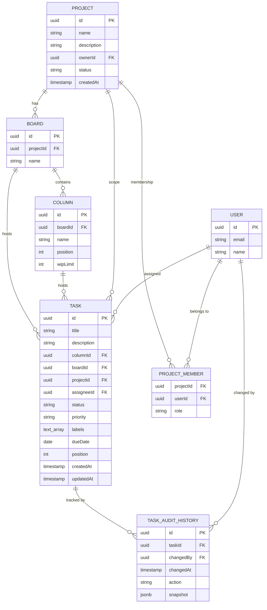
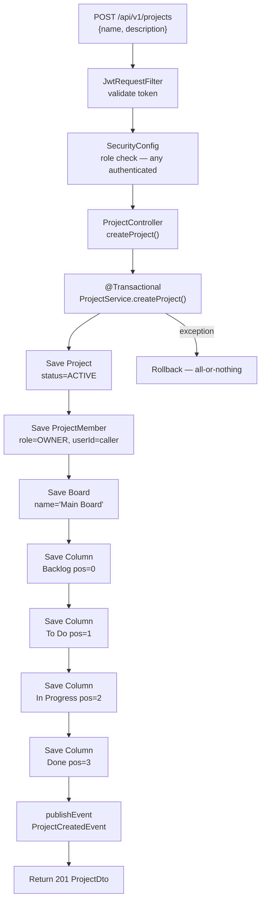
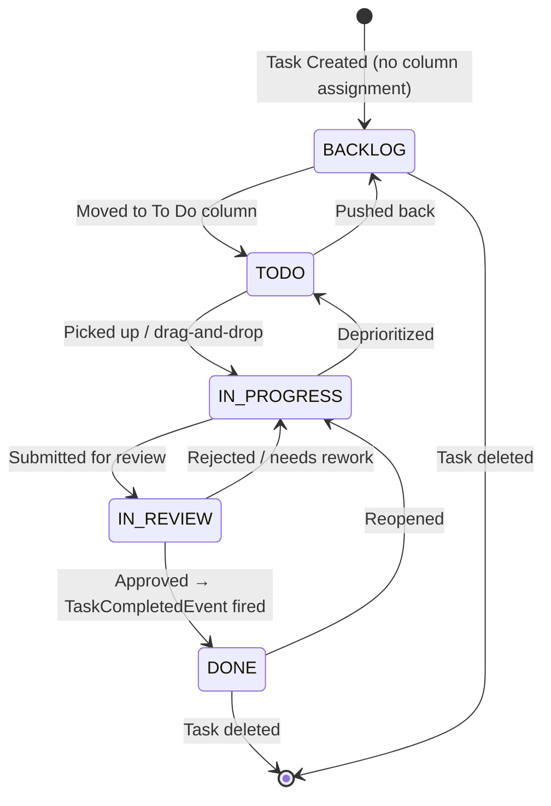
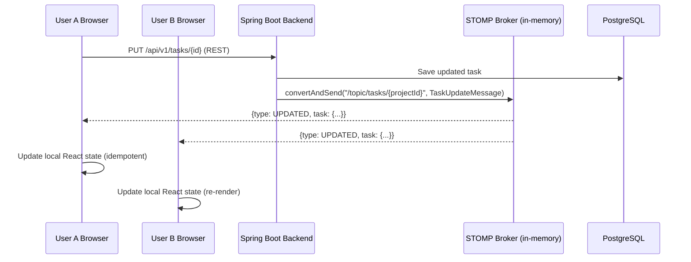
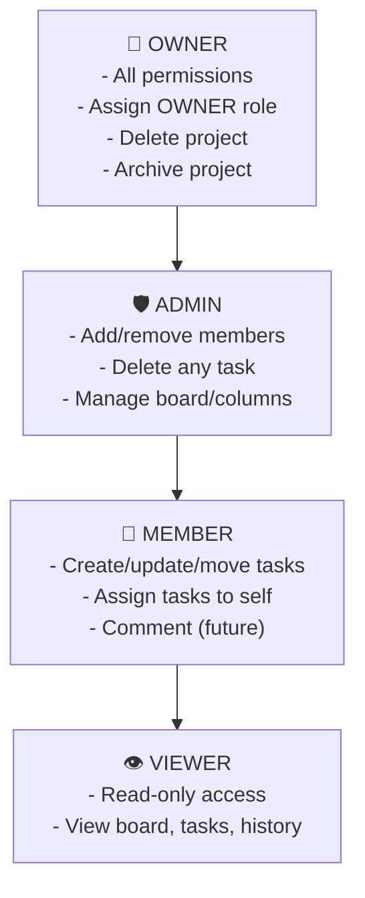
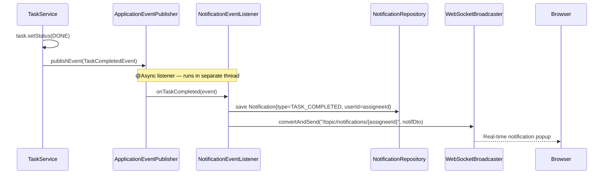
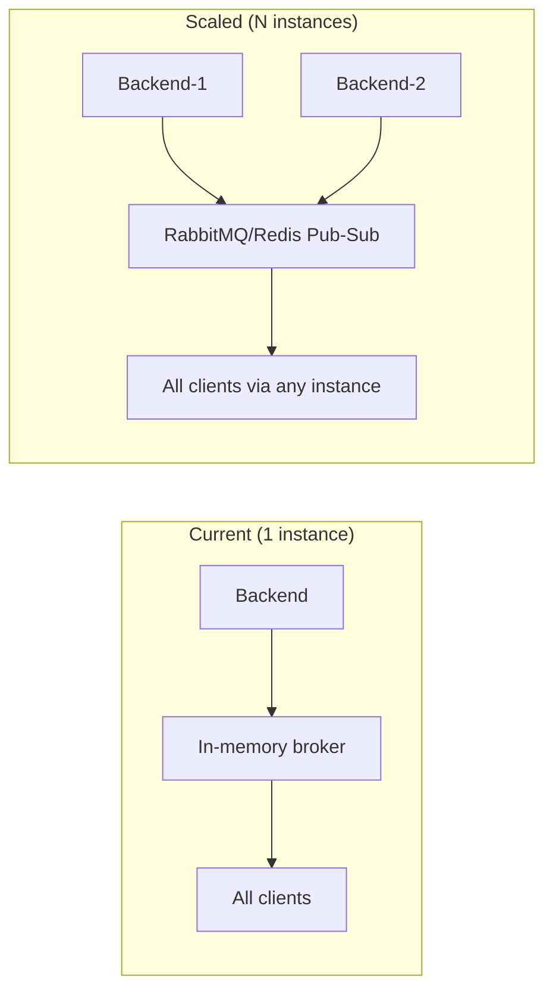

# Kanban & Project Management Module — Interview Knowledge Base

> **Module scope:** Everything related to Projects, Boards, Columns, Tasks, Members, and Audit History in the DevOps Suite platform. This is the core productivity feature of the application and one of the richest areas for interview discussion.

---

## Table of Contents

1. [Domain Model & Entities](#1-domain-model--entities)
2. [Project Creation Flow](#2-project-creation-flow)
3. [Task Lifecycle](#3-task-lifecycle)
4. [Real-Time Kanban Updates](#4-real-time-kanban-updates)
5. [Member Management & RBAC](#5-member-management--rbac)
6. [API Contract Summary](#6-api-contract-summary)
7. [Interview Q&A](#7-interview-qa)
8. [Quick Reference](#8-quick-reference)

---

## 1. Domain Model & Entities

### 1.1 Entity Descriptions

| Entity | Table | Key Fields | Notes |
|--------|-------|-----------|-------|
| `Project` | `projects` | `id (UUID)`, `name`, `description`, `ownerId`, `status` | Status: `ACTIVE` / `ARCHIVED` |
| `Board` | `boards` | `id`, `projectId`, `name` | One default board per project at creation |
| `Column` | `columns` | `id`, `boardId`, `name`, `position`, `wipLimit` | WIP limit = 0 means unlimited |
| `Task` | `tasks` | `id`, `title`, `description`, `columnId`, `boardId`, `projectId`, `assigneeId`, `status`, `priority`, `labels`, `dueDate`, `position` | `labels` stored as `text[]` in PostgreSQL |
| `ProjectMember` | `project_members` | `projectId`, `userId`, `role` | Composite PK `(projectId, userId)` |
| `TaskAuditHistory` | `task_audit_history` | `id`, `taskId`, `changedBy`, `changedAt`, `action`, `snapshot` | `snapshot` is `jsonb` column — full task state |

### 1.2 Enumerations

```java
// Task status — maps directly to Kanban column stage
public enum TaskStatus {
    BACKLOG, TODO, IN_PROGRESS, IN_REVIEW, DONE
}

// Task priority
public enum TaskPriority {
    LOW, MEDIUM, HIGH
}

// Project status
public enum ProjectStatus {
    ACTIVE, ARCHIVED
}

// Audit action types
public enum AuditAction {
    CREATED, UPDATED, STATUS_CHANGED, MOVED, DELETED, DUPLICATED
}

// Member roles (hierarchical)
public enum ProjectRole {
    VIEWER, MEMBER, ADMIN, OWNER   // ordinal used for >= comparisons
}
```

### 1.3 Entity Relationship Diagram



### 1.4 Flyway Migrations Relevant to This Module

| Migration | Description |
|-----------|-------------|
| `V3__create_projects.sql` | `projects` table with UUID PK and status enum |
| `V4__create_boards_columns.sql` | `boards` + `columns` with `position` and `wip_limit` |
| `V5__create_tasks.sql` | `tasks` table with `labels text[]`, `position`, foreign keys |
| `V6__create_project_members.sql` | Composite PK, role enum |
| `V7__create_task_audit_history.sql` | `snapshot jsonb`, index on `(taskId, changedAt DESC)` |

---

## 2. Project Creation Flow

### 2.1 What Happens on POST /api/v1/projects

A single `@Transactional` service method orchestrates all setup steps atomically:

```java
@Service
@Transactional
public class ProjectService {

    public ProjectDto createProject(CreateProjectRequest request, UUID creatorId) {
        // Step 1: Create the Project entity
        Project project = new Project();
        project.setId(UUID.randomUUID());
        project.setName(request.getName());
        project.setDescription(request.getDescription());
        project.setOwnerId(creatorId);
        project.setStatus(ProjectStatus.ACTIVE);
        project.setCreatedAt(Instant.now());
        project = projectRepository.save(project);

        // Step 2: Add creator as OWNER ProjectMember
        ProjectMember ownerMember = new ProjectMember();
        ownerMember.setProjectId(project.getId());
        ownerMember.setUserId(creatorId);
        ownerMember.setRole(ProjectRole.OWNER);
        projectMemberRepository.save(ownerMember);

        // Step 3: Create the default Board
        Board defaultBoard = new Board();
        defaultBoard.setId(UUID.randomUUID());
        defaultBoard.setProjectId(project.getId());
        defaultBoard.setName("Main Board");
        defaultBoard = boardRepository.save(defaultBoard);

        // Step 4: Create 4 default Columns
        String[] defaultColumns = {"Backlog", "To Do", "In Progress", "Done"};
        for (int i = 0; i < defaultColumns.length; i++) {
            Column col = new Column();
            col.setId(UUID.randomUUID());
            col.setBoardId(defaultBoard.getId());
            col.setName(defaultColumns[i]);
            col.setPosition(i);
            col.setWipLimit(0); // 0 = unlimited
            columnRepository.save(col);
        }

        // Step 5: Publish application event (async notification)
        eventPublisher.publishEvent(new ProjectCreatedEvent(project));

        return projectMapper.toDto(project);
    }
}
```

### 2.2 Creation Flow Diagram



> [!IMPORTANT]
> The entire setup is inside a single `@Transactional` boundary. If column creation fails, the project, board, and membership are all rolled back — the user sees a clean 500 error with no orphaned data.

---

## 3. Task Lifecycle

### 3.1 Task State Machine



### 3.2 Create Task — POST /api/v1/boards/{boardId}/tasks

```java
@Transactional
public TaskDto createTask(UUID boardId, CreateTaskRequest req, UUID callerId) {
    // 1. Validate board exists and caller is a project member
    Board board = boardRepository.findById(boardId)
        .orElseThrow(() -> new ResourceNotFoundException("Board not found"));
    projectMemberService.requireRole(board.getProjectId(), callerId, ProjectRole.MEMBER);

    // 2. Validate column belongs to this board
    Column column = columnRepository.findById(req.getColumnId())
        .orElseThrow(() -> new ResourceNotFoundException("Column not found"));
    if (!column.getBoardId().equals(boardId)) {
        throw new BadRequestException("Column does not belong to this board");
    }

    // 3. Calculate position (append to bottom of column)
    int maxPosition = taskRepository.findMaxPositionInColumn(column.getId())
        .orElse(-1);

    // 4. Build and save task
    Task task = taskMapper.fromRequest(req);
    task.setId(UUID.randomUUID());
    task.setBoardId(boardId);
    task.setProjectId(board.getProjectId());
    task.setPosition(maxPosition + 1);
    task.setCreatedAt(Instant.now());
    task = taskRepository.save(task);

    // 5. Publish assignment event if assignee provided
    if (req.getAssigneeId() != null) {
        eventPublisher.publishEvent(new TaskAssignedEvent(task, callerId));
    }

    // 6. Write audit history entry
    auditService.record(task.getId(), callerId, AuditAction.CREATED, task);

    // 7. Broadcast WebSocket update
    webSocketBroadcaster.broadcastTaskUpdate(board.getProjectId(),
        TaskUpdateMessage.created(task));

    return taskMapper.toDto(task);
}
```

### 3.3 Update Task — PUT /api/v1/tasks/{taskId}

- Load existing task → diff all mutable fields
- Save only changed fields (JPA dirty checking handles this)
- If `assigneeId` changed → publish `TaskAssignedEvent` (or `TaskReassignedEvent` if was previously assigned)
- Record `UPDATED` audit entry with full JSON snapshot
- Broadcast `UPDATED` WebSocket message to `/topic/tasks/{projectId}`

### 3.4 Status Change — PATCH /api/v1/tasks/{taskId}/status

```java
@Transactional
public TaskDto changeStatus(UUID taskId, TaskStatus newStatus, UUID callerId) {
    Task task = loadAndAuthorize(taskId, callerId, ProjectRole.MEMBER);
    TaskStatus oldStatus = task.getStatus();

    task.setStatus(newStatus);
    task.setUpdatedAt(Instant.now());
    taskRepository.save(task);

    // Fire completion event
    if (newStatus == TaskStatus.DONE) {
        eventPublisher.publishEvent(new TaskCompletedEvent(task, callerId));
    }

    auditService.record(taskId, callerId, AuditAction.STATUS_CHANGED, task);
    webSocketBroadcaster.broadcastTaskUpdate(task.getProjectId(),
        TaskUpdateMessage.statusChanged(task, oldStatus, newStatus));

    return taskMapper.toDto(task);
}
```

### 3.5 Reorder Tasks — PUT /api/v1/boards/{boardId}/tasks/reorder

Handles drag-and-drop reordering — moves a task within a column or across columns:

```java
@Transactional
public void reorderTasks(UUID boardId, ReorderRequest req, UUID callerId) {
    // req contains: List<{taskId, columnId, position}>
    projectMemberService.requireRole(getBoardProjectId(boardId),
        callerId, ProjectRole.MEMBER);

    for (TaskPositionUpdate update : req.getUpdates()) {
        Task task = taskRepository.findById(update.getTaskId())
            .orElseThrow();
        // Update columnId if moved across columns
        boolean movedColumn = !task.getColumnId().equals(update.getColumnId());
        task.setColumnId(update.getColumnId());
        task.setPosition(update.getPosition());
        task.setUpdatedAt(Instant.now());

        if (movedColumn) {
            // Sync status to match destination column name convention
            Column dest = columnRepository.findById(update.getColumnId()).orElseThrow();
            task.setStatus(columnToStatus(dest.getName()));
            auditService.record(task.getId(), callerId, AuditAction.MOVED, task);
        }
        taskRepository.save(task);
    }

    // Single WebSocket broadcast for the whole batch
    webSocketBroadcaster.broadcastTaskUpdate(getBoardProjectId(boardId),
        TaskUpdateMessage.reordered(req.getUpdates()));
}
```

> [!TIP]
> The entire reorder is a single `@Transactional` method so partial failures don't corrupt column ordering. The frontend sends the **complete new ordering** of all affected tasks, not just the moved one.

### 3.6 Duplicate Task — POST /api/v1/tasks/{taskId}/duplicate

```java
@Transactional
public TaskDto duplicateTask(UUID taskId, UUID callerId) {
    Task original = loadAndAuthorize(taskId, callerId, ProjectRole.MEMBER);

    Task copy = new Task();
    copy.setId(UUID.randomUUID());
    copy.setTitle("Copy of " + original.getTitle());
    copy.setDescription(original.getDescription());
    copy.setColumnId(original.getColumnId());
    copy.setBoardId(original.getBoardId());
    copy.setProjectId(original.getProjectId());
    copy.setPriority(original.getPriority());
    copy.setLabels(new ArrayList<>(original.getLabels()));
    copy.setDueDate(original.getDueDate());
    copy.setAssigneeId(null); // intentionally clear assignee
    copy.setStatus(original.getStatus());

    // Place immediately after the original
    int newPosition = original.getPosition() + 1;
    taskRepository.shiftPositionsDown(original.getColumnId(), newPosition);
    copy.setPosition(newPosition);
    copy.setCreatedAt(Instant.now());
    copy = taskRepository.save(copy);

    auditService.record(copy.getId(), callerId, AuditAction.DUPLICATED, copy);
    webSocketBroadcaster.broadcastTaskUpdate(copy.getProjectId(),
        TaskUpdateMessage.created(copy));

    return taskMapper.toDto(copy);
}
```

### 3.7 Delete Task — DELETE /api/v1/tasks/{taskId}

- Requires `ADMIN` or higher role (Members cannot delete tasks)
- Publishes `TaskDeletedEvent` → `NotificationEventListener` may notify assignee
- Removes audit history is **preserved** (soft linkage — `taskId` kept even if task gone)
- Broadcasts `DELETED` WebSocket message

### 3.8 Task Audit History — GET /api/v1/tasks/{taskId}/history

Returns a chronological list of all audit entries:

```json
[
  {
    "id": "uuid",
    "taskId": "uuid",
    "changedBy": { "id": "uuid", "name": "Alice" },
    "changedAt": "2024-03-15T10:30:00Z",
    "action": "CREATED",
    "snapshot": {
      "title": "Fix login bug",
      "status": "TODO",
      "priority": "HIGH",
      "assigneeId": null,
      "columnId": "uuid"
    }
  },
  {
    "action": "STATUS_CHANGED",
    "changedAt": "2024-03-15T14:22:00Z",
    "snapshot": {
      "title": "Fix login bug",
      "status": "IN_PROGRESS",
      "priority": "HIGH",
      "assigneeId": "uuid-alice"
    }
  }
]
```

---

## 4. Real-Time Kanban Updates

### 4.1 Architecture Overview



### 4.2 WebSocket Message Format

Every mutating operation broadcasts a standardized message:

```json
{
  "type": "MOVED",
  "task": {
    "id": "uuid",
    "title": "Implement OAuth2",
    "status": "IN_PROGRESS",
    "columnId": "uuid-in-progress-col",
    "position": 2,
    "assignee": { "id": "uuid", "name": "Bob" },
    "priority": "HIGH",
    "labels": ["auth", "backend"],
    "dueDate": "2024-04-01"
  },
  "projectId": "uuid",
  "timestamp": "2024-03-15T11:00:00Z"
}
```

**Message types:**
| Type | Triggered By | Frontend Action |
|------|-------------|-----------------|
| `CREATED` | Task created or duplicated | Insert card into correct column |
| `UPDATED` | Task fields changed | Merge-update card in place |
| `STATUS_CHANGED` | Status PATCH endpoint | Move card to new column, update badge |
| `MOVED` | Reorder/drag-drop endpoint | Reposition card(s), update all positions |
| `DELETED` | Task deletion | Remove card from board |

### 4.3 Frontend Subscription (WebSocketContext.jsx)

```javascript
// WebSocketContext.jsx — subscribes after STOMP connection established
const subscribeToProject = (projectId) => {
  const subscription = stompClient.subscribe(
    `/topic/tasks/${projectId}`,
    (message) => {
      const update = JSON.parse(message.body);
      dispatch({ type: update.type, payload: update.task });
    }
  );
  return () => subscription.unsubscribe();
};
```

### 4.4 Concurrency Model — Last Write Wins

> [!WARNING]
> The current implementation uses **no optimistic locking** (no `@Version` field on `Task`). If two users edit the same task simultaneously:
> - Both GETs return the same version
> - Both PUTs succeed — the second write silently overwrites the first
> - The WebSocket broadcast of the second write overwrites the first user's view
>
> This is an **acknowledged design limitation** suitable for small teams. For production scale, the fix is adding `@Version Long version` to `Task` and catching `OptimisticLockException` in the service layer.

---

## 5. Member Management & RBAC

### 5.1 Role Hierarchy



### 5.2 Add Member — POST /api/v1/projects/{id}/members

```java
@Transactional
public ProjectMemberDto addMember(UUID projectId, AddMemberRequest req, UUID callerId) {
    // 1. Caller must be ADMIN or OWNER
    projectMemberService.requireRole(projectId, callerId, ProjectRole.ADMIN);

    // 2. Prevent assigning OWNER role unless caller is OWNER
    if (req.getRole() == ProjectRole.OWNER) {
        projectMemberService.requireRole(projectId, callerId, ProjectRole.OWNER);
    }

    // 3. Resolve target user — by userId or email
    User targetUser;
    if (req.getUserId() != null) {
        targetUser = userRepository.findById(req.getUserId())
            .orElseThrow(() -> new ResourceNotFoundException("User not found"));
    } else {
        targetUser = userRepository.findByEmail(req.getEmail())
            .orElseThrow(() -> new ResourceNotFoundException(
                "No account found for email: " + req.getEmail()));
        // Frontend shows mailto modal when this 404 is received
    }

    // 4. Check not already a member
    if (projectMemberRepository.existsByProjectIdAndUserId(projectId, targetUser.getId())) {
        throw new ConflictException("User is already a project member");
    }

    // 5. Save membership
    ProjectMember member = new ProjectMember();
    member.setProjectId(projectId);
    member.setUserId(targetUser.getId());
    member.setRole(req.getRole());
    projectMemberRepository.save(member);

    // 6. Publish event → NotificationEventListener → WebSocket notification
    eventPublisher.publishEvent(new MemberAddedEvent(projectId, targetUser.getId(), callerId));

    return projectMemberMapper.toDto(member, targetUser);
}
```

### 5.3 Remove Member — DELETE /api/v1/projects/{id}/members/{userId}

- Caller must be `ADMIN+`
- Owner cannot be removed (must transfer ownership first)
- Publishes `MemberRemovedEvent` → generates `PROJECT_REMOVED` notification to the removed user
- All that user's assigned tasks remain assigned (no cascade unassignment)

### 5.4 RBAC Enforcement Implementation

```java
// ProjectMemberService.java
public void requireRole(UUID projectId, UUID userId, ProjectRole minimumRole) {
    ProjectMember member = projectMemberRepository
        .findByProjectIdAndUserId(projectId, userId)
        .orElseThrow(() -> new AccessDeniedException("Not a project member"));

    // Enum ordinal comparison: VIEWER=0, MEMBER=1, ADMIN=2, OWNER=3
    if (member.getRole().ordinal() < minimumRole.ordinal()) {
        throw new AccessDeniedException(
            "Required role: " + minimumRole + ", actual role: " + member.getRole());
    }
}
```

> [!NOTE]
> RBAC is enforced at the **service layer**, not purely at the controller level. `@PreAuthorize` annotations handle global roles (e.g., `ROLE_USER` vs `ROLE_ADMIN`), while project-scoped roles are checked via `requireRole()` calls within service methods. This keeps authorization logic with business logic.

### 5.5 Role Change — PATCH /api/v1/projects/{id}/members/{userId}/role

- Caller must be OWNER to demote/promote any role
- ADMIN can promote up to ADMIN but not OWNER
- Publishes `RoleChangedEvent` → generates `ROLE_CHANGED` notification
- Only OWNER can transfer OWNER status (and the original OWNER is demoted to ADMIN)

---

## 6. API Contract Summary

### 6.1 Project Endpoints

| Method | Path | Min Role | Description |
|--------|------|----------|-------------|
| `POST` | `/api/v1/projects` | Authenticated | Create project (becomes OWNER) |
| `GET` | `/api/v1/projects` | Authenticated | List all projects the caller is a member of |
| `GET` | `/api/v1/projects/{id}` | VIEWER | Get project details |
| `PUT` | `/api/v1/projects/{id}` | ADMIN | Update project name/description |
| `PATCH` | `/api/v1/projects/{id}/archive` | OWNER | Archive project |
| `DELETE` | `/api/v1/projects/{id}` | OWNER | Delete project (soft/hard delete) |

### 6.2 Member Endpoints

| Method | Path | Min Role | Description |
|--------|------|----------|-------------|
| `GET` | `/api/v1/projects/{id}/members` | VIEWER | List all members and roles |
| `POST` | `/api/v1/projects/{id}/members` | ADMIN | Add a member (by userId or email) |
| `PATCH` | `/api/v1/projects/{id}/members/{userId}/role` | OWNER | Change member's role |
| `DELETE` | `/api/v1/projects/{id}/members/{userId}` | ADMIN | Remove a member |

### 6.3 Board & Column Endpoints

| Method | Path | Min Role | Description |
|--------|------|----------|-------------|
| `GET` | `/api/v1/projects/{id}/boards` | VIEWER | List boards for a project |
| `POST` | `/api/v1/projects/{id}/boards` | ADMIN | Create additional board |
| `GET` | `/api/v1/boards/{boardId}` | VIEWER | Get board with columns and tasks |
| `POST` | `/api/v1/boards/{boardId}/columns` | ADMIN | Add a column |
| `PUT` | `/api/v1/columns/{columnId}` | ADMIN | Rename column or change WIP limit |
| `DELETE` | `/api/v1/columns/{columnId}` | ADMIN | Delete column (must be empty) |
| `PUT` | `/api/v1/boards/{boardId}/columns/reorder` | ADMIN | Reorder columns |

### 6.4 Task Endpoints

| Method | Path | Min Role | Description |
|--------|------|----------|-------------|
| `POST` | `/api/v1/boards/{boardId}/tasks` | MEMBER | Create a task |
| `GET` | `/api/v1/tasks/{taskId}` | VIEWER | Get task details |
| `PUT` | `/api/v1/tasks/{taskId}` | MEMBER | Full update of task fields |
| `PATCH` | `/api/v1/tasks/{taskId}/status` | MEMBER | Change task status only |
| `PUT` | `/api/v1/boards/{boardId}/tasks/reorder` | MEMBER | Batch reorder (drag-and-drop) |
| `POST` | `/api/v1/tasks/{taskId}/duplicate` | MEMBER | Duplicate task |
| `DELETE` | `/api/v1/tasks/{taskId}` | ADMIN | Delete task |
| `GET` | `/api/v1/tasks/{taskId}/history` | VIEWER | Audit history with snapshots |

---

## 7. Interview Q&A

---

### Section A: Domain Model

#### 🟢 "Walk me through the data model for your Kanban system."

**Answer:**

The Kanban system is built on six entities with a clear parent-child hierarchy:

```
Project
  └── Board (one default, can have more)
        └── Column (ordered by position, optional WIP limit)
              └── Task (ordered by position within column)

Project
  └── ProjectMember (join table: userId + role)

Task
  └── TaskAuditHistory (JSON snapshots of every state change)
```

- A **Project** is the top-level container — it has a name, description, an `ownerId` (the creator), and a status (`ACTIVE` or `ARCHIVED`).
- A **Board** belongs to a project and contains Columns. We create one default "Main Board" at project creation time.
- A **Column** has a `position` (integer ordering) and an optional `wipLimit`. WIP limit of 0 means unlimited.
- A **Task** belongs to both a Board and a Column. It has an integer `position` for ordering within its column, a `status` enum, a `priority` enum, and a `labels` field stored as a `text[]` PostgreSQL array. It also has an optional `assigneeId`.
- **ProjectMember** is a join table between Users and Projects with a role (`VIEWER/MEMBER/ADMIN/OWNER`).
- **TaskAuditHistory** records every mutation as a `jsonb` snapshot of the full task state at that moment.

**Follow-up: Why do Task have both `columnId` and `status`? Aren't they redundant?**

Partly, yes. The `status` enum is the canonical semantic state (`IN_PROGRESS`, `DONE`, etc.) and is the field applications query and filter on. The `columnId` is the physical position on the board. They're synced on drag-and-drop (`MOVED` event updates both), but `status` can theoretically be changed without moving the card (e.g., via API). The redundancy is intentional — keeping `status` makes queries like "show me all DONE tasks across all projects" trivial without joining through Column data.

---

#### 🟡 "Why did you store task audit history as JSON snapshots instead of field-level diffs?"

**Answer:**

Two main reasons:

1. **Simplicity of implementation:** Storing a full snapshot as `jsonb` means the audit writer just serializes `taskMapper.toJson(task)` after every save. Field-level diffing requires comparing old and new values for every mutable field, generating a list of `{field, oldValue, newValue}` tuples — significantly more code and more chances for bugs.

2. **Complete reconstructibility:** With snapshots, you can reconstruct the exact state of a task at any point in history. With diffs, you'd need to replay every change from the beginning to get the state at step N. Snapshots make the history viewer trivially simple — just display the snapshot JSON.

**Trade-offs acknowledged:**
- **Storage cost:** Each snapshot is ~1–3 KB. A heavily modified task could accumulate hundreds of entries. For now, no pruning policy exists.
- **Redundancy:** Most snapshots will differ by just one or two fields, but the full object is stored each time.
- **Future improvement:** An ILM-style policy could prune audit entries older than 90 days, or compress snapshots to diffs after 30 days.

---

#### 🟡 "What does the WIP limit on a Column do, and how is it enforced?"

**Answer:**

The `wipLimit` field on a Column sets a maximum number of tasks allowed in that column simultaneously. A value of `0` means unlimited (the default).

**Enforcement happens at the service layer** during task creation and reorder:

```java
// In TaskService.createTask() and reorderTasks()
if (column.getWipLimit() > 0) {
    long currentCount = taskRepository.countByColumnId(column.getId());
    if (currentCount >= column.getWipLimit()) {
        throw new WipLimitExceededException(
            "Column '" + column.getName() + "' is at WIP limit of " + column.getWipLimit());
    }
}
```

The frontend also reads WIP limits and shows a visual warning (red badge) when a column is at capacity, preventing drag-and-drop before the API rejects it. The API is the authoritative enforcer.

---

### Section B: Task Lifecycle

#### 🟢 "How do you maintain task ordering during drag-and-drop?"

**Answer:**

Each `Task` has an integer `position` field that represents its 0-based order within its column. The frontend (React DnD) computes the new positions after a drag and sends the complete new ordering to:

```
PUT /api/v1/boards/{boardId}/tasks/reorder
```

The request body contains a list of all affected tasks with their new `columnId` and `position`:

```json
{
  "updates": [
    { "taskId": "uuid-1", "columnId": "col-uuid", "position": 0 },
    { "taskId": "uuid-2", "columnId": "col-uuid", "position": 1 },
    { "taskId": "uuid-3", "columnId": "col-uuid", "position": 2 }
  ]
}
```

The backend applies all updates in a single `@Transactional` method — updating each task's `columnId` and `position` — then broadcasts a `MOVED` WebSocket message so all other connected clients rerender without needing to poll.

**Why not use float positions (like Trello)?**  
Fractional positions (inserting between 0.5 and 1.0 → 0.75) avoid renumbering on every insert but suffer from precision drift. With integer positions, the reorder endpoint always sends the complete final state, making it a replace operation rather than a delta — which is simpler and avoids ordering bugs entirely.

---

#### 🟡 "How does a task status change trigger a notification?"

**Answer:**

The flow follows the Spring Events pattern:



1. `TaskService.changeStatus()` calls `eventPublisher.publishEvent(new TaskCompletedEvent(task, callerId))`
2. `NotificationEventListener` (annotated `@Async`) receives the event on a separate thread pool thread
3. It creates a `Notification` entity (`type=TASK_COMPLETED`, `userId=task.getAssigneeId()`) and persists it
4. It broadcasts the notification DTO to `/topic/notifications/{assigneeId}` via STOMP
5. The frontend `NotificationContext.jsx` receives the WebSocket message and shows a toast + increments the bell badge

---

#### 🔴 "How do simultaneous edits by two users get handled?"

**Answer:**

Currently, the system uses a **last-write-wins** strategy with no optimistic locking. Here's what happens:

1. User A and User B both load task T at version V
2. User A changes the title and PUTs → saved as V+1
3. User B changes the priority and PUTs → saved as V+2, **overwriting User A's title change**
4. The WebSocket broadcast of V+2 immediately overwrites User A's view — they see their title change silently disappear

**This is an acknowledged limitation** documented in the project. The correct fix is:

```java
@Entity
public class Task {
    @Version
    private Long version; // JPA optimistic locking
    // ...
}
```

With `@Version`, step 3 would throw `OptimisticLockException` (HTTP 409 Conflict), and the frontend would reload and re-apply the change, preventing silent data loss. This wasn't implemented due to the added frontend complexity (conflict resolution UX).

**Alternative approaches:**
| Approach | Complexity | Consistency |
|----------|-----------|-------------|
| Last-write-wins (current) | Low | Weak |
| Optimistic locking (`@Version`) | Medium | Strong — detect conflicts |
| Field-level merging (CRDT) | High | Strong — resolve conflicts |
| Pessimistic locking | Medium | Strong — prevent conflicts |

For a small team tool, last-write-wins is pragmatically acceptable. For enterprise scale, optimistic locking is the right next step.

---

#### 🔴 "Walk me through the complete flow when a user duplicates a task."

**Answer:**

`POST /api/v1/tasks/{taskId}/duplicate` triggers:

1. **Authorization:** Load task, verify caller is a `MEMBER+` of the project via `requireRole()`
2. **Copy construction:** Create new `Task` entity, copy all fields:
   - Same `columnId`, `boardId`, `projectId`, `status`, `priority`, `labels`, `dueDate`, `description`
   - Title prefixed with `"Copy of "`
   - `assigneeId` set to `null` (deliberate — a copy shouldn't auto-notify anyone)
   - New UUID, new `createdAt`
3. **Position assignment:** Call `taskRepository.shiftPositionsDown(columnId, originalPosition + 1)` to bump all tasks below the original down by 1, then set the copy's position to `originalPosition + 1` (immediately after the original)
4. **Save:** Persist the new task
5. **Audit:** Record `DUPLICATED` action in `task_audit_history` for the new task's ID
6. **WebSocket:** Broadcast `CREATED` message (from the board's perspective, it's a new task)
7. **Response:** Return `201 Created` with the new `TaskDto`

The `shiftPositionsDown` is a bulk UPDATE query:
```sql
UPDATE tasks SET position = position + 1
WHERE column_id = :columnId AND position >= :fromPosition
```

---

### Section C: Real-Time & WebSocket

#### 🟡 "Why use STOMP topics for Kanban updates instead of polling?"

**Answer:**

Polling (e.g., GET `/tasks` every 5 seconds) has significant drawbacks in a collaborative Kanban context:

| | Polling | STOMP WebSocket |
|-|---------|-----------------|
| **Latency** | Up to `pollInterval` delay | Sub-100ms (real-time) |
| **Server load** | N users × poll rate requests/sec | Persistent connection, push-only |
| **Bandwidth** | Full task list every poll | Only changed task in each message |
| **UX** | Jerky updates, stale data | Seamless, concurrent edits visible instantly |
| **Implementation** | Simple | Requires STOMP broker + frontend subscription |

For a collaborative tool where multiple users work on the same board simultaneously, polling creates a poor experience — a user could move a card and their colleague wouldn't see it for up to 5 seconds. STOMP push makes the board feel live.

The backend uses Spring's `SimpMessagingTemplate.convertAndSend()` which routes to all subscribers of the topic without the sender needing to know who is connected.

---

#### 🔴 "How does authentication work for WebSocket connections?"

**Answer:**

WebSocket connections go through a custom `StompAuthChannelInterceptor` that validates JWT tokens on `CONNECT` frames:

```java
// StompAuthChannelInterceptor.java
@Override
public Message<?> preSend(Message<?> message, MessageChannel channel) {
    StompHeaderAccessor accessor = StompHeaderAccessor.wrap(message);

    if (StompCommand.CONNECT.equals(accessor.getCommand())) {
        String token = accessor.getFirstNativeHeader("Authorization");
        if (token == null || !token.startsWith("Bearer ")) {
            throw new MessagingException("Missing JWT token");
        }

        Claims claims = jwtUtil.validateToken(token.substring(7));
        // Attach security principal to the session
        UsernamePasswordAuthenticationToken auth =
            new UsernamePasswordAuthenticationToken(
                claims.getSubject(), null,
                List.of(new SimpleGrantedAuthority("ROLE_USER"))
            );
        accessor.setUser(auth);
    }

    // On SUBSCRIBE — verify the user is a member of the project in the topic
    if (StompCommand.SUBSCRIBE.equals(accessor.getCommand())) {
        String destination = accessor.getDestination();
        if (destination != null && destination.startsWith("/topic/tasks/")) {
            UUID projectId = UUID.fromString(destination.split("/")[3]);
            UUID userId = extractUserId(accessor);
            projectMemberService.requireRole(projectId, userId, ProjectRole.VIEWER);
        }
    }

    return message;
}
```

Key points:
- The JWT is sent in the STOMP `CONNECT` frame header (not the HTTP upgrade request)
- On `SUBSCRIBE`, the interceptor checks that the user is at least a `VIEWER` of the target project
- This prevents users from subscribing to task topics for projects they're not members of
- The SockJS fallback (long-polling, xhr-streaming) goes through the same interceptor

---

### Section D: RBAC & Member Management

#### 🟡 "How is RBAC enforced at the project level?"

**Answer:**

Project-level RBAC uses a two-layer approach:

**Layer 1 — Global auth (SecurityConfig.java):**
```java
.requestMatchers("/api/v1/**").hasRole("USER")
```
All project API endpoints require a valid JWT with `ROLE_USER`. This is checked in `JwtRequestFilter` before the request reaches any controller.

**Layer 2 — Project membership check (service layer):**
```java
// Called at the start of every project-scoped service method
projectMemberService.requireRole(projectId, callerId, ProjectRole.MEMBER);
```

The `requireRole` method queries `project_members` by `(projectId, userId)` and compares the stored role's ordinal against the minimum required. If the user is not a member or has insufficient role, it throws `AccessDeniedException` → Spring maps this to HTTP 403.

**Why not use `@PreAuthorize` for project roles?**  
Spring Security's `@PreAuthorize` works well for global roles stored in the JWT, but project-level roles require a database lookup that depends on a path variable (`projectId`). Doing this in an annotation expression (SpEL) would make it opaque and harder to test. The service-layer approach keeps authorization auditable and testable with plain unit tests.

---

#### ⚫ "How would you scale the Kanban board for 1,000 concurrent users?"

**Answer:**

The current architecture has several bottlenecks at 1,000 concurrent users. Here's a systematic breakdown:

**1. In-memory STOMP broker → needs external broker**



With multiple backend instances, a message published on instance 1 won't reach clients connected to instance 2. Solution: replace the in-memory STOMP broker with a full broker like **RabbitMQ** (`spring.messaging.stomp.relay`) or use **Redis Pub/Sub** for cross-instance fanout.

**2. Database write contention on task positions**

The `shiftPositionsDown` bulk UPDATE locks all tasks in a column during reorder. At scale:
- Use fractional ordering (float positions) to avoid bulk shifts — only a single row update per reorder
- Or use a dedicated ordering service that batches position updates

**3. Board load query — N+1 risk**

Loading a board fetches: board → columns → tasks per column. Without eager fetching or a join query, this is N+1. The fix:
```java
// Single query with JOIN FETCH
@Query("SELECT b FROM Board b JOIN FETCH b.columns c LEFT JOIN FETCH c.tasks WHERE b.id = :boardId ORDER BY c.position, task.position")
Optional<Board> findByIdWithColumnsAndTasks(UUID boardId);
```

**4. PostgreSQL connection pool**

With 1,000 concurrent users and HikariCP default pool of 10, most requests will queue. Solution: add **PgBouncer** as a connection pooler between app and PostgreSQL, which multiplexes thousands of app connections over a small number of database connections.

**5. Caching read-heavy board data**

The board view (columns + tasks) is read far more often than written. Add a Redis cache:
```java
@Cacheable(value = "board", key = "#boardId")
public BoardDto getBoard(UUID boardId) { ... }

@CacheEvict(value = "board", key = "#boardId")
public void mutateTask(UUID boardId, ...) { ... }
```

**6. WebSocket connection limits**

Nginx has a default `worker_connections 1024`. At 1,000 WebSocket users, we're near the limit. Solution: increase `worker_connections`, add more Nginx workers, or use a dedicated WebSocket gateway (e.g., HAProxy with WebSocket support).

**Summary table:**

| Bottleneck | Current | 1K User Solution |
|-----------|---------|-----------------|
| STOMP broker | In-memory (single node) | RabbitMQ / Redis Pub/Sub |
| DB writes | Direct HikariCP | PgBouncer connection pooler |
| Board reads | DB every request | Redis cache-aside |
| Task reorder | Bulk position shift | Float positions or batch queue |
| WebSocket limits | Default Nginx 1024 | Scale Nginx workers + load balancer |

---

#### ⚫ "How would you add a commenting system to tasks without breaking existing architecture?"

**Answer:**

The existing architecture already provides all the building blocks. Here's the design:

**New entities:**
```java
@Entity
public class TaskComment {
    @Id UUID id;
    UUID taskId;
    UUID authorId;
    String content;           // markdown supported
    UUID parentCommentId;     // nullable — for threads
    Instant createdAt;
    Instant updatedAt;
    boolean deleted;          // soft delete
}
```

**API endpoints to add:**
- `POST /api/v1/tasks/{taskId}/comments` → `MEMBER+`
- `GET /api/v1/tasks/{taskId}/comments` → `VIEWER+`
- `PUT /api/v1/comments/{commentId}` → author only
- `DELETE /api/v1/comments/{commentId}` → author or `ADMIN+`

**Real-time:** Add a new STOMP topic `/topic/comments/{taskId}` — broadcast on create/edit/delete.

**Notifications:** Add `COMMENT_ADDED` notification type → publish `CommentAddedEvent` → `NotificationEventListener` notifies task assignee and previous commenters (mentions via `@username` parsing).

**Audit:** Comments have their own simple audit (soft delete preserves history).

**Why this fits cleanly:** The Spring Events pattern means `CommentService` just calls `eventPublisher.publishEvent()` — zero changes to `NotificationEventListener`'s structure, just a new `@EventListener` handler method added.

---

## 8. Quick Reference

| Fact | Value |
|------|-------|
| Task statuses | `BACKLOG → TODO → IN_PROGRESS → IN_REVIEW → DONE` |
| Default columns at project creation | Backlog, To Do, In Progress, Done |
| Reorder endpoint | `PUT /api/v1/boards/{boardId}/tasks/reorder` |
| Broadcast topic | `/topic/tasks/{projectId}` |
| Audit history storage | `jsonb` snapshots in `task_audit_history` |
| Concurrency model | Last-write-wins (no `@Version` optimistic locking) |
| RBAC check location | Service layer — `projectMemberService.requireRole()` |
| WIP limit enforcement | Service layer before task creation/reorder |
| Event fired on DONE status | `TaskCompletedEvent` → `TASK_COMPLETED` notification |
| Duplicate clears | `assigneeId` (intentionally not inherited) |
| Member add by email — not found | `404` → frontend shows mailto invite modal |
| Minimum role to delete task | `ADMIN` |
| Minimum role to add members | `ADMIN` |
| Only role that can assign OWNER | `OWNER` |
| Position ordering strategy | Integer `position` field, full reorder on drag-drop |
| `labels` column type | `text[]` (PostgreSQL native array) |
| Project creation transaction | Single `@Transactional` — atomic 5-step setup |
| WebSocket auth mechanism | JWT in STOMP `CONNECT` frame header |
| Subscription authorization | `StompAuthChannelInterceptor` checks `VIEWER` membership on `SUBSCRIBE` |
