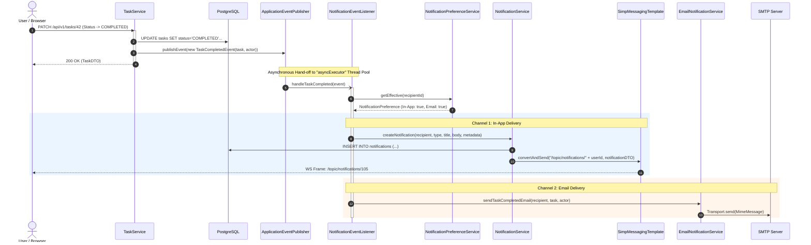
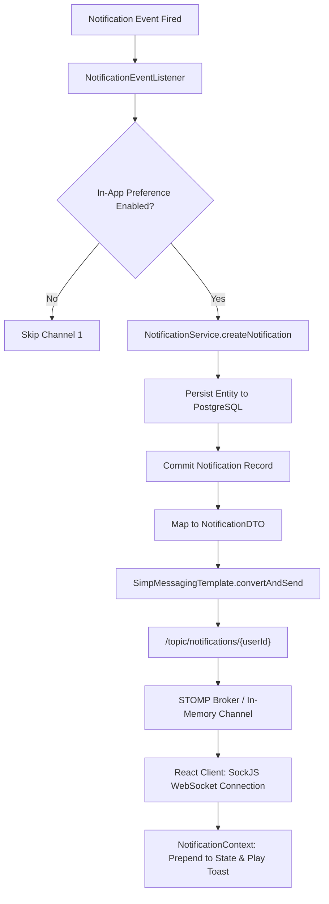
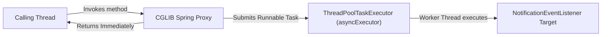
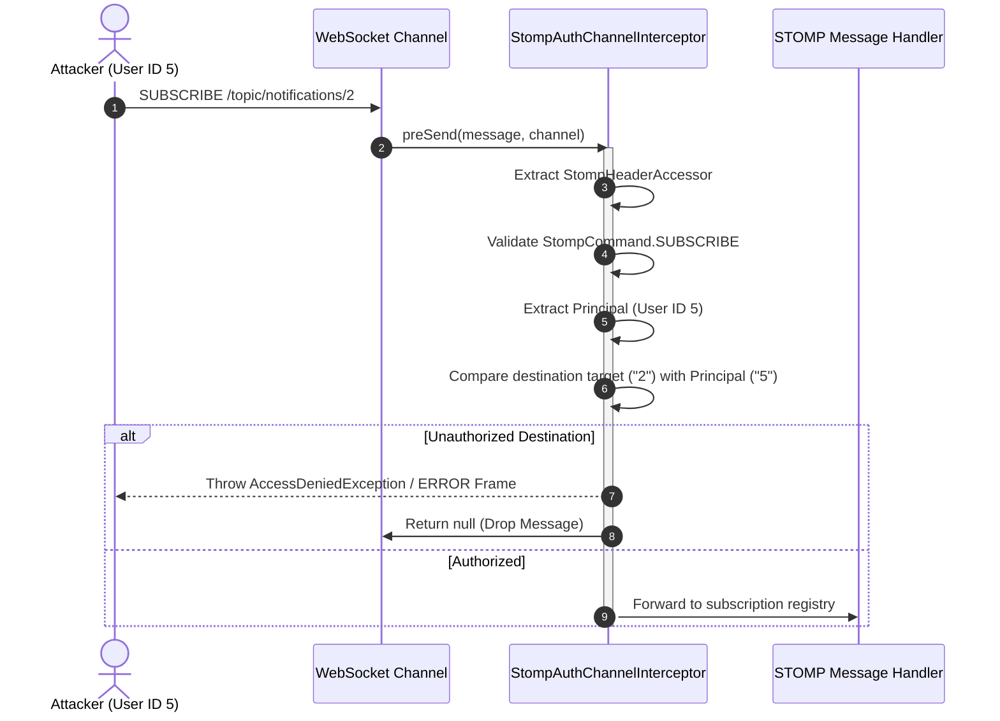
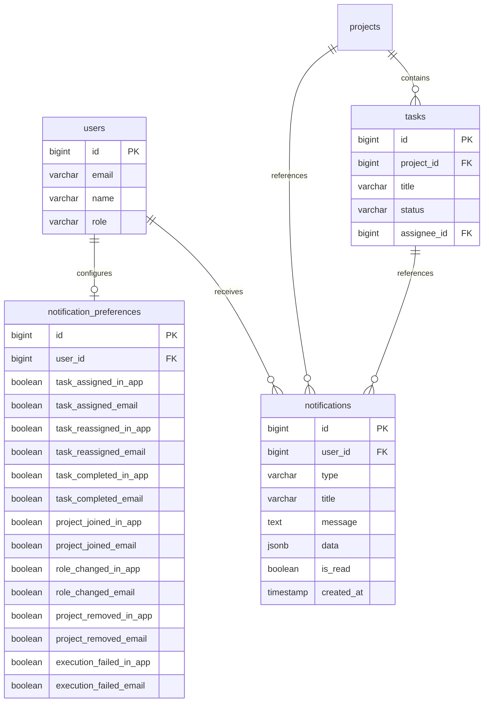

# Notification System & Real-Time Event Architecture — DevOps Suite

## 1. Overview & System Context

The **DevOps Suite Notification System** is an event-driven, dual-channel communication engine that alerts team members to critical project changes, Kanban task movements, role adjustments, and asynchronous Docker execution outcomes. 

In traditional distributed enterprise architectures, message delivery is frequently offloaded to external brokers like Apache Kafka or RabbitMQ. However, for a high-performance modular monolith like DevOps Suite, introducing an external multi-broker cluster creates operational toil, network hop serialization latency, and deployment complexity. Instead, DevOps Suite utilizes an **in-memory event-driven architecture** centered around Spring Framework's `ApplicationEventPublisher` decoupled from consumers via asynchronous thread pooling (`@Async` and `@EventListener`).

```
+---------------------------------------------------------------------------------------------------------+
|                                        APPLICATION TIER (SPRING BOOT)                                   |
|                                                                                                         |
|  [ Domain Services ]                  [ In-JVM Event Bus ]               [ Asynchronous Consumer ]      |
|  - TaskService                         ApplicationEventPublisher          NotificationEventListener     |
|  - ProjectService         ========>       .publishEvent(event)     =====>       @Async("asyncExecutor") |
|  - ExecutionQueueWorker   (Synchronous)       (Decoupled)          (Thread Pool) @EventListener         |
|                                                                                 |                       |
+---------------------------------------------------------------------------------|-----------------------+
                                                                                  |
                                     +--------------------------------------------+
                                     | Dispatches to Channels based on NotificationPreference
                                     |
                +--------------------+---------------------+
                |                                          |
                v Channel 1: In-App                        v Channel 2: Email
   +--------------------------+               +--------------------------+
   | NotificationService      |               | EmailNotificationService |
   | - Persist to PostgreSQL  |               | - Evaluate User Prefs    |
   | - SimpMessagingTemplate  |               | - JavaMailSender (MIME)  |
   |   -> STOMP over SockJS   |               | - Async SMTP Delivery    |
   |   -> /topic/notifications|               +-------------+------------+
   |      /{userId}           |                             |
   +------------+-------------+                             v
                |                                      External SMTP
                v                                      (Recipient Inbox)
      Connected Client Browser
   (React 18 NotificationContext)
```

The system delivers alerts across two distinct communication channels:
1. **Channel 1 (In-App Real-Time):** Direct in-memory broadcast through STOMP over SockJS via `SimpMessagingTemplate` directly to user-specific topics (`/topic/notifications/{userId}`) backed by ACID relational persistence in PostgreSQL.
2. **Channel 2 (Transactional Email):** Asynchronous HTML email notifications rendered via Spring Mail (`JavaMailSender`) for critical events like task assignments, project invites, and execution failures, conditional upon user preferences and SMTP availability.

---

## 2. Event-Driven Notification Architecture

### 2.1 Core Architectural Principles
The notification system is decoupled from core domain services using Spring's native `ApplicationEventPublisher`. Domain services execute their primary business logic inside an active transactional boundary, emit a domain event, and return immediately without waiting for notification persistence, WebSocket socket pushes, or external SMTP transactions.



### 2.2 Event Publishers in the Codebase
Events are dispatched across three primary system boundaries:

1. **`TaskService.java`**:
   - Dispatches `TaskAssignedEvent` when a task is first created with an assignee or assigned to a new user.
   - Dispatches `TaskReassignedEvent` when a task's assignee changes from one team member to another (notifying both prior and new assignees).
   - Dispatches `TaskCompletedEvent` when a task status transitions to `DONE` / `COMPLETED`, notifying the project owner and task creator.
2. **`ProjectService.java`**:
   - Dispatches `MemberAddedEvent` (`PROJECT_JOINED`) when a collaborator joins or is added to a project.
   - Dispatches `MemberRoleChangedEvent` (`ROLE_CHANGED`) when an administrator upgrades or downgrades a member's RBAC tier (`ADMIN`, `MEMBER`, `VIEWER`).
   - Dispatches `MemberRemovedEvent` (`PROJECT_REMOVED`) when a user's membership is revoked.
3. **`ExecutionQueueWorker.java`**:
   - Dispatches `ExecutionFailedEvent` (`EXECUTION_FAILED`) when a Docker sandbox code run fails, exceeds the 30-second execution quota (`TIMED_OUT`), or terminates due to Out-Of-Memory (`OOM_KILLED`).

### 2.3 Decoupled Asynchronous Processing (`@Async` & `@EventListener`)
The consumer side is encapsulated in `NotificationEventListener.java`. By annotating listener methods with both `@Async("asyncExecutor")` and `@EventListener`, Spring executes the handler method in a worker thread supplied by the configured `ThreadPoolTaskExecutor`.

```java
@Component
@Slf4j
@RequiredArgsConstructor
public class NotificationEventListener {

    private final NotificationService notificationService;
    private final NotificationPreferenceService preferenceService;
    private final EmailNotificationService emailNotificationService;

    @Async("asyncExecutor")
    @EventListener
    public void handleTaskAssigned(TaskAssignedEvent event) {
        Long recipientId = event.getAssignee().getId();
        log.debug("Processing TaskAssignedEvent for user {}", recipientId);

        NotificationPreference pref = preferenceService.getEffective(recipientId);

        // Channel 1: In-App Notification (Real-Time WebSocket + DB)
        if (pref.isTaskAssignedInApp()) {
            notificationService.createNotification(
                event.getAssignee(),
                NotificationType.TASK_ASSIGNED,
                "New Task Assigned",
                String.format("You have been assigned to task '%s' in project '%s'", 
                    event.getTask().getTitle(), event.getTask().getProject().getName()),
                Map.of(
                    "taskId", event.getTask().getId(),
                    "projectId", event.getTask().getProject().getId()
                )
            );
        }

        // Channel 2: Email Notification
        if (pref.isTaskAssignedEmail()) {
            emailNotificationService.sendTaskAssignedEmail(
                event.getAssignee(),
                event.getTask(),
                event.getActor()
            );
        }
    }
}
```

---

## 3. Notification Event Catalog

DevOps Suite defines 7 standard notification events representing critical domain state transitions.

| Notification Type | Triggering Service | Payload Key Attributes | Default In-App | Default Email | Recipient(s) |
|---|---|---|---|---|---|
| `TASK_ASSIGNED` | `TaskService` | `taskId`, `projectId`, `taskTitle`, `actorId` | ✅ Enabled | ✅ Enabled | New Assignee |
| `TASK_REASSIGNED` | `TaskService` | `taskId`, `projectId`, `taskTitle`, `oldAssigneeId`, `newAssigneeId` | ✅ Enabled | ✅ Enabled | Previous & New Assignees |
| `TASK_COMPLETED` | `TaskService` | `taskId`, `projectId`, `taskTitle`, `completedBy` | ✅ Enabled | ❌ Disabled | Project Owner & Task Creator |
| `PROJECT_JOINED` | `ProjectService` | `projectId`, `projectName`, `addedUserId`, `role` | ✅ Enabled | ✅ Enabled | Added User |
| `ROLE_CHANGED` | `ProjectService` | `projectId`, `projectName`, `oldRole`, `newRole` | ✅ Enabled | ✅ Enabled | Impacted Member |
| `PROJECT_REMOVED` | `ProjectService` | `projectId`, `projectName`, `removedUserId` | ✅ Enabled | ❌ Disabled | Removed User |
| `EXECUTION_FAILED` | `ExecutionQueueWorker` | `executionId`, `language`, `exitCode`, `errorReason` | ✅ Enabled | ❌ Disabled | Code Run Initiator |

### Event Lifecycle Details
1. **`ExecutionFailedEvent`:** Unlike user-triggered project actions, this event originates from the asynchronous container monitor. When `DockerSandbox` inspects a completed container and finds `timedOut == true`, exit code `137` (SIGKILL / OOM), or a non-zero exit code on compilation, `ExecutionQueueWorker` publishes this event. It ensures developers authoring long-running scripts receive instant desktop alerts even if they navigated away from the Cloud IDE page.
2. **`TaskReassignedEvent`:** Involves dual notification delivery. The previously assigned member is notified that they have been unassigned, while the incoming member receives a task claim alert with direct deep-linking metadata.
3. **Actor Suppression:** When a user completes their own task or modifies their own assignment, the system evaluates `actor.getId().equals(recipient.getId())` to avoid spamming the triggering user with self-inflicted alerts.

---

## 4. Dual-Channel Delivery Pipeline

### 4.1 Channel 1: In-App Real-Time WebSocket Delivery
When an in-app notification is permitted by the recipient's preference matrix, `NotificationService.createNotification()` performs a two-stage delivery:



1. **Relational Persistence:**
   The notification is saved to the `notifications` table in PostgreSQL with fields `id`, `user_id`, `type`, `title`, `message`, `data` (JSONB metadata for frontend routing), `is_read=false`, and `created_at=NOW()`. This guarantees history retention across reloads.
2. **STOMP Broadcast:**
   Using Spring's `SimpMessagingTemplate`, the notification payload is pushed to the user's private destination:
   ```java
   String destination = "/topic/notifications/" + recipient.getId();
   messagingTemplate.convertAndSend(destination, notificationDTO);
   ```
3. **Frontend Ingestion:**
   The browser establishes a persistent STOMP over SockJS connection on client load. In `NotificationContext.jsx`, the client subscribes to `/topic/notifications/${currentUser.id}`. When a frame arrives:
   - The unread badge counter increments atomically (`unreadCount + 1`).
   - The notification object is prepended to the dropdown list.
   - An active floating toast is displayed on the screen.

### 4.2 Channel 2: Asynchronous Transactional Email Delivery
For events marked for email dispatch (e.g., project invites, high-priority assignments), `EmailNotificationService` prepares a multipart MIME message using `JavaMailSender`.

1. **Thymeleaf / HTML Templating:**
   The service injects event variables (`projectName`, `actorName`, `taskTitle`, `actionUrl`) into responsive HTML templates.
2. **Graceful Degradation:**
   If the SMTP server is down, unreachable, or unconfigured (`spring.mail.host` is blank or throws `MailAuthenticationException`), the failure is caught, logged with warning severity, and isolated:
   ```java
   try {
       mailSender.send(mimeMessage);
       log.info("Notification email successfully dispatched to {}", recipient.getEmail());
   } catch (MailException ex) {
       log.warn("Failed to deliver notification email to {}: {}", recipient.getEmail(), ex.getMessage());
       // Non-blocking: Do NOT rethrow or fail the calling listener
   }
   ```
   This ensures that an external SMTP timeout never breaks WebSocket alerts or transaction rollbacks.

---

## 5. User Notification Preferences

### 5.1 Schema Design (`NotificationPreference` & Flyway V14)
To give users granular autonomy over their alert channels, DevOps Suite introduced the `notification_preferences` table in Flyway migration `V14__add_notification_preferences.sql`.

```sql
-- V14__add_notification_preferences.sql
CREATE TABLE notification_preferences (
    id BIGSERIAL PRIMARY KEY,
    user_id BIGINT NOT NULL UNIQUE REFERENCES users(id) ON DELETE CASCADE,
    task_assigned_in_app BOOLEAN NOT NULL DEFAULT TRUE,
    task_assigned_email BOOLEAN NOT NULL DEFAULT TRUE,
    task_reassigned_in_app BOOLEAN NOT NULL DEFAULT TRUE,
    task_reassigned_email BOOLEAN NOT NULL DEFAULT TRUE,
    task_completed_in_app BOOLEAN NOT NULL DEFAULT TRUE,
    task_completed_email BOOLEAN NOT NULL DEFAULT FALSE,
    project_joined_in_app BOOLEAN NOT NULL DEFAULT TRUE,
    project_joined_email BOOLEAN NOT NULL DEFAULT TRUE,
    role_changed_in_app BOOLEAN NOT NULL DEFAULT TRUE,
    role_changed_email BOOLEAN NOT NULL DEFAULT TRUE,
    project_removed_in_app BOOLEAN NOT NULL DEFAULT TRUE,
    project_removed_email BOOLEAN NOT NULL DEFAULT FALSE,
    execution_failed_in_app BOOLEAN NOT NULL DEFAULT TRUE,
    execution_failed_email BOOLEAN NOT NULL DEFAULT FALSE,
    created_at TIMESTAMP WITH TIME ZONE NOT NULL DEFAULT NOW(),
    updated_at TIMESTAMP WITH TIME ZONE NOT NULL DEFAULT NOW()
);

CREATE INDEX idx_notification_preferences_user ON notification_preferences(user_id);
```

### 5.2 Dynamic Unsaved Defaults (`getEffective()`)
A critical software design pattern used in `NotificationPreferenceService` is the **Virtual Default Entity** pattern implemented via `getEffective(Long userId)`.

#### The Problem:
When new users register or existing users from older migrations browse the app, eagerly inserting default preference rows for millions of records creates write amplification and database bloat. Furthermore, if the system adds a new notification type in a future release, migrating millions of default rows requires table locks.

#### The Solution:
`NotificationPreferenceService.getEffective(userId)` attempts to fetch a persisted preference record. If absent, it instantiates and returns a transient, unsaved `NotificationPreference` populated with system defaults:

```java
@Service
@RequiredArgsConstructor
public class NotificationPreferenceService {

    private final NotificationPreferenceRepository preferenceRepository;
    private final UserRepository userRepository;

    @Transactional(readOnly = true)
    public NotificationPreference getEffective(Long userId) {
        return preferenceRepository.findByUserId(userId)
            .orElseGet(() -> buildDefaultPreferences(userId));
    }

    private NotificationPreference buildDefaultPreferences(Long userId) {
        return NotificationPreference.builder()
            .userId(userId)
            .taskAssignedInApp(true)
            .taskAssignedEmail(true)
            .taskReassignedInApp(true)
            .taskReassignedEmail(true)
            .taskCompletedInApp(true)
            .taskCompletedEmail(false)
            .projectJoinedInApp(true)
            .projectJoinedEmail(true)
            .roleChangedInApp(true)
            .roleChangedEmail(true)
            .projectRemovedInApp(true)
            .projectRemovedEmail(false)
            .executionFailedInApp(true)
            .executionFailedEmail(false)
            .build();
    }
}
```

Only when a user explicitly alters a toggle in their UI settings profile is a record written to the PostgreSQL database via `upsert`.

---

## 6. Comprehensive Interview Q&A

### 🟢 Basic Concepts

#### Q1: What is the primary architectural purpose of the notification system in DevOps Suite?
**Answer:**
The notification system provides real-time and transactional situational awareness across collaborative workflows. In DevOps Suite, multiple developers work on shared Kanban boards, edit code in the browser IDE, and trigger Docker code executions. The notification system alerts users when:
1. Tasks are assigned, reassigned, or marked completed.
2. Team memberships and project authorization roles change.
3. Asynchronous, background Docker code runs fail or exceed operational limits (OOM/timeout).

It delivers these alerts instantaneously via in-app WebSockets if the user is active, while persisting historical records in PostgreSQL and sending transactional emails for high-importance actions.

---

#### Q2: Why did you use Spring's `ApplicationEventPublisher` instead of Apache Kafka or RabbitMQ?
**Answer:**
DevOps Suite is intentionally designed as a high-performance **modular monolith**. Introducing an external broker like Kafka or RabbitMQ would introduce:
- **Operational Complexity:** Managing ZooKeeper/KRaft, Kafka brokers, consumer offset storage, and partition balancing.
- **Infrastructure Overhead:** Substantial memory and CPU footprint unnecessary for a single-deployment container stack.
- **Latency & Serialization Costs:** Serializing POJOs to JSON/Avro over network sockets when publisher and consumer live inside the exact same JVM memory space.

Spring's `ApplicationEventPublisher` combined with `@Async` provides a completely decoupled, in-memory event bus. It requires zero external dependencies, utilizes Java heap reference passing (nanosecond publish latency), and can be swapped for a distributed message bus later if the monolith is decomposed into microservices.

---

#### Q3: How do clients subscribe to real-time notifications in the frontend?
**Answer:**
The frontend utilizes **STOMP over SockJS**. During app initialization in `WebSocketContext.jsx` and `NotificationContext.jsx`:
1. The React app opens a SockJS connection to the backend endpoint `/ws` with the user's JWT bearer token attached to the connection headers.
2. The `StompAuthChannelInterceptor` on the backend validates the JWT and associates the user's principal identity with the STOMP session.
3. The client subscribes to the user-scoped destination:
   ```javascript
   stompClient.subscribe(`/topic/notifications/${currentUser.id}`, (frame) => {
       const notification = JSON.parse(frame.body);
       dispatch({ type: 'NOTIFICATION_RECEIVED', payload: notification });
   });
   ```
4. Whenever a backend domain event fires, `SimpMessagingTemplate` routes the message exclusively to that user's destination.

---

### 🟡 Intermediate Scenarios

#### Q4: How does Spring's `@Async` annotation work under the hood, and what happens if an unhandled exception occurs in a listener?
**Answer:**
When a method is annotated with `@Async("asyncExecutor")`, Spring wraps the target bean in a **CGLIB dynamic proxy**. When callers invoke the method:
1. The proxy intercepts the call and verifies the method return type (`void` or `CompletableFuture`).
2. Instead of running on the caller's thread, the proxy submits a `Runnable`/`Callable` task to the configured `TaskExecutor` (`asyncExecutor` thread pool).
3. The original caller thread returns immediately without blocking.



**Exception Handling in `void` `@Async` methods:**
Because `@Async` listener methods typically return `void`, an unhandled exception cannot bubble up to the caller thread. If an uncaught exception is thrown:
- It terminates the asynchronous worker thread execution for that specific task.
- Spring intercepts it using the configured `AsyncUncaughtExceptionHandler`.
- If custom handling is absent, Spring logs the stack trace via `SimpleAsyncUncaughtExceptionHandler` at `ERROR` level, but the original HTTP request thread never knows it failed.

In DevOps Suite, we handle exceptions explicitly inside `NotificationEventListener` using `try-catch` blocks and structured SLF4J logging to ensure channel failures (such as a downstream SMTP network drop) never crash worker threads or poison the thread pool.

---

#### Q5: How do you prevent self-notifications (e.g., user completing their own task)?
**Answer:**
In `TaskService` and `ProjectService`, domain operations capture the current authenticated user (`actor`). When the corresponding domain event is instantiated, both the `actor` and target recipient(s) are stored in the event payload.

Inside `NotificationEventListener`:
```java
if (event.getActor() != null && event.getActor().getId().equals(recipient.getId())) {
    log.debug("Skipping notification for user {} as they triggered the action", recipient.getId());
    return;
}
```
This check guarantees that when a developer marks their own task completed or claims an unassigned task, they do not receive redundant notifications.

---

#### Q6: How does the system handle notifications for Docker code execution failures?
**Answer:**
Code execution in DevOps Suite runs asynchronously through `DockerSandbox` and `ExecutionQueueWorker`. When a user clicks "Run" in Monaco Editor:
1. `ExecutionService` persists an `Execution` record with status `QUEUED` and pushes it to an in-memory queue.
2. `ExecutionQueueWorker` picks up the job and spawns an ephemeral Docker container with `--memory=256m --cpus=1 --network=none`.
3. If the container exceeds 30 seconds, returns an exit code of `137` (SIGKILL / OOM), or fails compilation, `ExecutionQueueWorker` marks the execution as `FAILED` or `TIMED_OUT`.
4. It immediately invokes:
   ```java
   eventPublisher.publishEvent(new ExecutionFailedEvent(execution, user, failureReason));
   ```
5. `NotificationEventListener` processes this event asynchronously, persisting an in-app notification with metadata linking to the exact execution logs, and pushes a STOMP packet to `/topic/notifications/{userId}`. The user receives a floating desktop alert even if they navigated away to the Kanban board.

---

### 🔴 Advanced Architecture & Edge Cases

#### Q7: What was the "snake_case vs camelCase" bug that silenced WebSocket notifications, and how did you debug it?
**Answer:**
During end-to-end integration testing, database records for notifications were properly created, but the React frontend toast and unread badge never updated upon WebSocket frame arrival.

**Root Cause:**
1. The backend PostgreSQL entity used JPA with default Jackson serialization, serializing the payload into camelCase (e.g., `userId`, `isRead`, `createdAt`).
2. However, some frontend REST endpoints had previously adopted snake_case DTO mappings (`user_id`, `is_read`, `created_at`).
3. In `NotificationContext.jsx`, the real-time STOMP listener was expecting:
   ```javascript
   if (!notification.is_read) {
       setUnreadCount(prev => prev + 1);
   }
   ```
   Because Jackson sent `{ "isRead": false }`, `notification.is_read` evaluated to `undefined`, causing the boolean check `!undefined` to evaluate to `true` initially, but deep payload access like `notification.user_id` failed routing checks:
   ```javascript
   if (notification.user_id !== currentUserId) return; // undefined !== 105 -> DROPPED!
   ```
   The client-side filter discarded the incoming notification because `undefined !== 105`.

**Debugging & Fix:**
1. Inspected browser DevTools Network tab under WS (Frames). Discovered frames were arriving with `userId` and `projectId` in camelCase.
2. Standardized the backend DTO using explicit `@JsonProperty` annotations or global Jackson naming strategy `PropertyNamingStrategies.SNAKE_CASE` for consistent API and WebSocket JSON serialization across all channels.
3. Updated the frontend TypeScript/React models to defensively support normalized properties:
   ```javascript
   const targetUser = notification.userId ?? notification.user_id;
   ```

---

#### Q8: How is STOMP topic security enforced to prevent User A from eavesdropping on User B's notifications?
**Answer:**
WebSocket connections bypass traditional per-request HTTP servlet filters like `JwtRequestFilter` once the initial HTTP handshake completes. If an attacker knows another user's ID, they could theoretically subscribe to `/topic/notifications/2`.

DevOps Suite secures STOMP subscriptions via `StompAuthChannelInterceptor.java`:



1. **Connection Authentication:** During the `CONNECT` frame, the interceptor extracts the Bearer JWT from `nativeHeaders`, validates its signature via `JwtTokenProvider`, and sets the security context `accessor.setUser(authentication)`.
2. **Subscription Authorization:** During the `SUBSCRIBE` frame, the interceptor intercepts the destination:
   ```java
   String destination = accessor.getDestination();
   if (destination != null && destination.startsWith("/topic/notifications/")) {
       String targetUserId = destination.substring("/topic/notifications/".length());
       String authenticatedUserId = accessor.getUser().getName();
       if (!targetUserId.equals(authenticatedUserId)) {
           throw new AccessDeniedException("Unauthorized subscription to private user channel");
       }
   }
   ```
If the IDs do not match, an unauthorized subscription exception is thrown and the STOMP connection is terminated.

---

#### Q9: What happens if an event is published inside a `@Transactional` method that subsequently rolls back?
**Answer:**
By default, `ApplicationEventPublisher.publishEvent()` publishes events **synchronously and immediately** at the moment the method is called, regardless of whether the surrounding database transaction commits or aborts.

If `TaskService.updateTask()` publishes `TaskCompletedEvent` and later in the same method an exception occurs (e.g., database constraint violation or optimistic lock exception):
- The database transaction rolls back.
- **Problem:** If using standard `@EventListener`, the notification listener may have already fired, persisted a notification record, sent an email, and pushed a WebSocket frame for a task that was never actually completed in the database (a phantom alert).

**The Solution:**
DevOps Suite uses `@TransactionalEventListener(phase = TransactionPhase.AFTER_COMMIT)` for transactional domain events:
```java
@Async("asyncExecutor")
@TransactionalEventListener(phase = TransactionPhase.AFTER_COMMIT)
public void handleTaskCompleted(TaskCompletedEvent event) {
    // Executes ONLY if the database transaction committed successfully
}
```
If the transaction rolls back, Spring discards the event, guaranteeing strict consistency between database state and dispatched alerts.

---

#### Q10: How does the system handle backpressure and thread pool exhaustion in `asyncExecutor`?
**Answer:**
Asynchronous notification listeners execute on the `asyncExecutor` bean defined in `AsyncConfig.java`. 

```java
@Configuration
@EnableAsync
public class AsyncConfig {

    @Bean(name = "asyncExecutor")
    public Executor asyncExecutor() {
        ThreadPoolTaskExecutor executor = new ThreadPoolTaskExecutor();
        executor.setCorePoolSize(5);
        executor.setMaxPoolSize(20);
        executor.setQueueCapacity(500);
        executor.setThreadNamePrefix("NotificationAsync-");
        executor.setRejectedExecutionHandler(new ThreadPoolExecutor.CallerRunsPolicy());
        executor.initialize();
        return executor;
    }
}
```

**Backpressure & Rejection Strategy:**
1. **Core / Max Sizing:** The pool handles standard workloads with 5 core threads and scales up to 20 threads under burst conditions.
2. **Queue Capacity:** An internal `LinkedBlockingQueue` holds up to 500 pending event tasks.
3. **Rejection Policy (`CallerRunsPolicy`):** If all 20 threads are busy and the 500-slot queue fills up:
   - Rather than dropping notifications (`DiscardPolicy`) or crashing the application with an unhandled `RejectedExecutionException` (`AbortPolicy`), the system applies **`CallerRunsPolicy`**.
   - The calling thread (e.g., the HTTP request thread) executes the listener logic itself.
   - This naturally throttles the incoming HTTP request throughput, applying organic backpressure on callers until the asynchronous queue drains.

---

### ⚫ Expert Design & Scaling

#### Q11: How would you scale this in-JVM notification system if DevOps Suite moves from a single monolith instance to a multi-instance clustered deployment?
**Answer:**
In a clustered multi-instance deployment (e.g., 5 Spring Boot pods behind an AWS ALB), the current architecture encounters two fundamental bottlenecks:

```
+------------------------------------------------------------------------------------+
|                               THE MULTI-NODE PROBLEM                               |
|                                                                                    |
|   User A (Browser)                                         User B (Browser)        |
|          |                                                        |                |
|     WebSocket                                                 WebSocket            |
|          v                                                        v                |
|    +------------+                                           +------------+         |
|    | Instance 1 |                                           | Instance 2 |         |
|    +------------+                                           +------------+         |
|          ^                                                        ^                |
|          | Local publishEvent()                                   |                |
|   User A updates task                                       NEVER RECEIVES         |
|   assigned to User B                                        NOTIFICATION!          |
|                                                                                    |
+------------------------------------------------------------------------------------+
```

1. **In-JVM Event Bus Isolation:** An event published on Instance 1 is only seen by listeners running on Instance 1.
2. **WebSocket Session Pinning:** User A may be connected to Instance 1 via WebSocket, while User B is connected to Instance 2. If Instance 1 creates a notification for User B, its local `SimpMessagingTemplate` has no WebSocket connection to User B.

#### Step-by-Step Evolution to Distributed Scale:

```mermaid
flowchart TD
    subgraph Pod1 [Spring Boot Pod 1]
        Svc1[TaskService] --> Pub1[Event Publisher]
        Pub1 --> RPub[Redis Pub/Sub Client]
        Sub1[Redis Message Listener] --> WSTemplate1[SimpMessagingTemplate]
    end

    subgraph Pod2 [Spring Boot Pod 2]
        Sub2[Redis Message Listener] --> WSTemplate2[SimpMessagingTemplate]
    end

    RPub -->|PUBLISH notif-channel| RedisCluster[(Redis 7 Pub/Sub or Kafka)]
    RedisCluster -->|Broadcast| Sub1
    RedisCluster -->|Broadcast| Sub2

    WSTemplate1 -->|WS Frame| ClientA[Client A on Pod 1]
    WSTemplate2 -->|WS Frame| ClientB[Client B on Pod 2]
```



1. **Distributed Event Bus via Redis Pub/Sub:**
   Since DevOps Suite already runs Redis 7, replace local Spring events for cross-pod notifications with **Redis Pub/Sub** or **Redis Streams**. When an event fires on any pod, serialize the payload to JSON and publish to `devopssuite:notifications:broadcast`.
2. **Distributed STOMP Broker Relay:**
   Replace Spring's simple in-memory message broker with a dedicated message broker relay (such as **RabbitMQ STOMP Plugin** or external broker backing). All Spring Boot instances connect to the broker relay. When Pod 1 pushes to `/topic/notifications/105`, the broker routes the frame to Pod 2 where User 105's WebSocket session is actively anchored.
3. **Transactional Outbox Pattern:**
   To guarantee that notifications are never lost if a pod crashes between the DB commit and the Redis publish, implement the **Transactional Outbox Pattern**:
   - Write the notification to an `outbox` table within the same PostgreSQL ACID transaction as the task/project change.
   - Use Debezium (CDC) or a high-throughput polling worker to stream outbox records to Kafka/Redis.

---

#### Q12: How do you design notification rate limiting to prevent spamming users during batch operations?
**Answer:**
If an administrator bulk-imports 50 tasks or reassigns an entire sprint board to a single engineer, firing 50 consecutive WebSockets and 50 transactional emails within 2 seconds results in terrible UX and potential email provider rate-limiting (e.g., SendGrid/AWS SES throttling).

**Design Implementation:**
1. **Sliding-Window Debouncing in Redis:**
   Before dispatching an email notification, evaluate a Redis rate-limiting key:
   ```
   rate:notif:email:{userId}:{eventType}
   ```
   Allow a maximum of 3 emails per user per 5-minute window for identical event types.
2. **Notification Digesting / Aggregation Worker:**
   For high-volume, non-urgent events (`TASK_COMPLETED`), do not dispatch individual emails immediately. Instead:
   - Buffer notifications in a Redis Sorted Set `user:digest:{userId}` scored by epoch timestamp.
   - Schedule a cron worker `@Scheduled(cron = "0 */15 * * * *")` that checks for pending digests.
   - If a user has > 1 pending notification in the digest window, collapse them into a single consolidated email: *"5 tasks were completed in Project Titan in the last 15 minutes."*
3. **WebSocket Batching:**
   In-app notifications still persist to PostgreSQL immediately, but WebSocket emissions can be debounced over a 200ms window to minimize DOM reflow overhead in the client React application.

---

## 7. Deep-Dive Code Artifacts

### 7.1 Entity Relationship Model



---

## 8. Quick Reference Card

| Component | Technology / Implementation | Key Responsibility / Location |
|---|---|---|
| **Event Bus** | `ApplicationEventPublisher` | In-memory synchronous decoupled publishing within the monolith. |
| **Async Execution** | `@Async("asyncExecutor")` | Offloads notification handling to a dedicated `ThreadPoolTaskExecutor`. |
| **Event Listener** | `NotificationEventListener.java` | Subscribes to 7 domain events via `@EventListener`. |
| **Real-Time Channel** | `SimpMessagingTemplate` | Sends STOMP frames to `/topic/notifications/{userId}` over SockJS. |
| **Email Channel** | `EmailNotificationService.java` | Sends HTML MIME messages via Spring Mail (`JavaMailSender`). |
| **Preferences** | `NotificationPreference` (Flyway V14) | Granular opt-in/opt-out matrix for in-app and email channels. |
| **Virtual Defaults** | `NotificationPreferenceService.getEffective()` | Avoids DB bloat by returning unsaved default preferences for new users. |
| **STOMP Security** | `StompAuthChannelInterceptor.java` | Enforces JWT validation and blocks cross-user destination hijacking. |
| **Event Consistency** | `@TransactionalEventListener(AFTER_COMMIT)` | Prevents sending notifications for transactions that roll back. |
| **Sandbox Alerts** | `ExecutionQueueWorker.java` | Fires `ExecutionFailedEvent` on Docker timeouts (`30s`) or OOM kills. |
