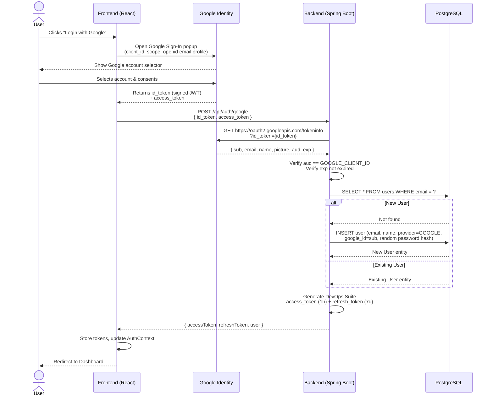
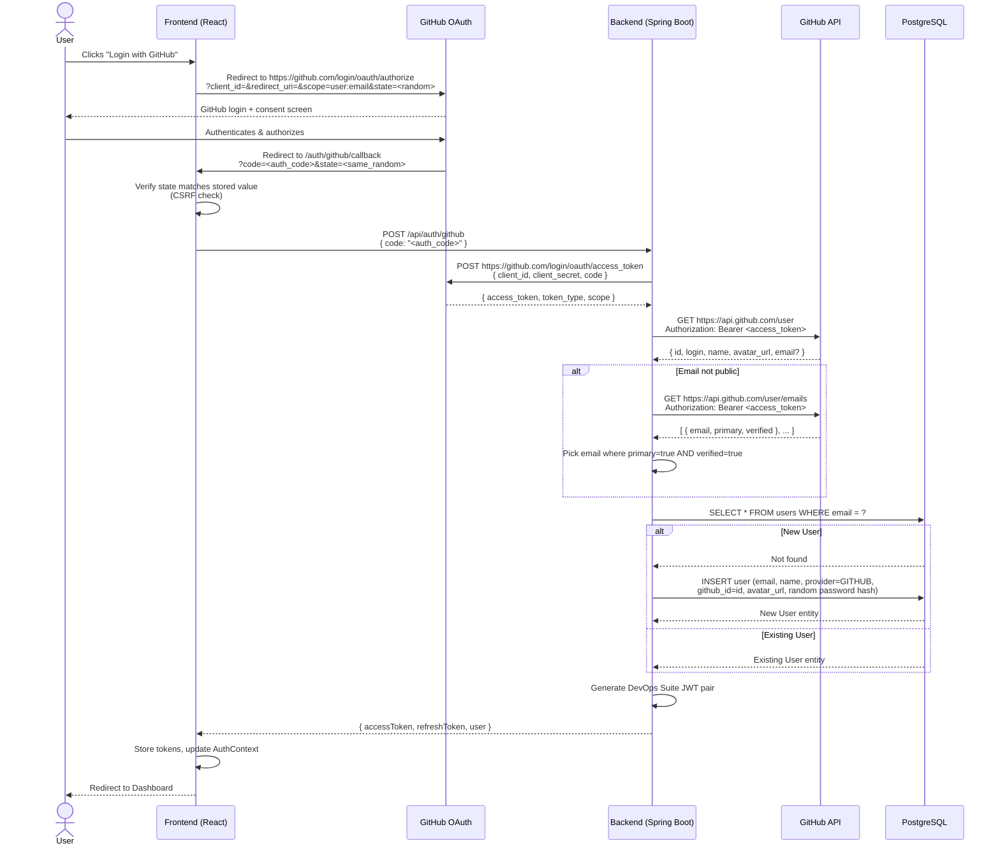
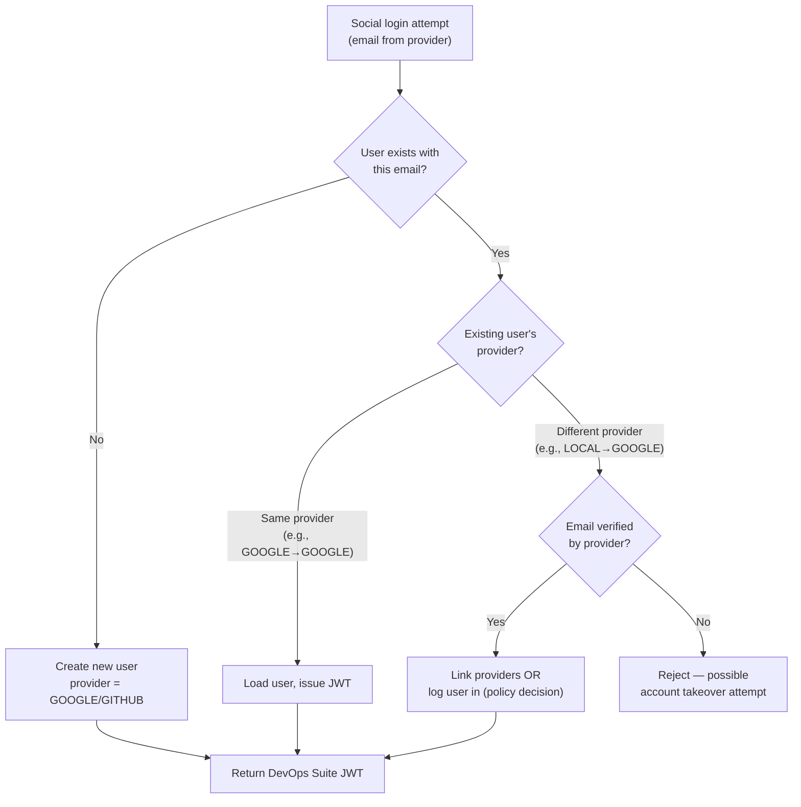
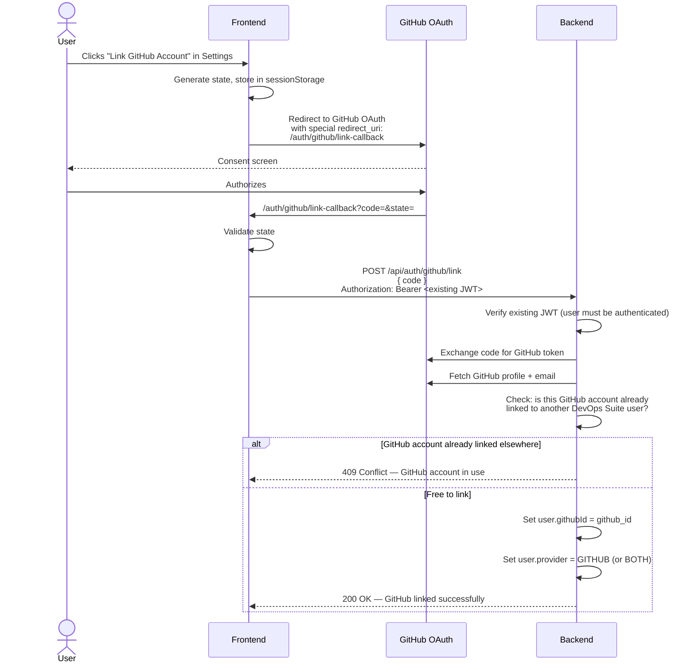

# OAuth2 & Social Login — Interview Q&A

> **DevOps Suite** integrates **Google OAuth2 (OIDC)** and **GitHub OAuth2 (Authorization Code)** to allow users to authenticate without managing passwords. Both flows ultimately issue the same DevOps Suite JWT pair (access + refresh), letting the rest of the system remain auth-provider-agnostic.

---

## Table of Contents
1. [OAuth2 Fundamentals](#1-oauth2-fundamentals)
2. [Google OAuth2 Integration](#2-google-oauth2-integration)
3. [GitHub OAuth2 Integration](#3-github-oauth2-integration)
4. [Account Linking & Provider Merging](#4-account-linking--provider-merging)
5. [Security Deep-Dive](#5-security-deep-dive)
6. [Interview Q&A — Graded by Difficulty](#6-interview-qa--graded-by-difficulty)
7. [Quick Reference](#7-quick-reference)

---

## 1. OAuth2 Fundamentals

### What is OAuth2?

**OAuth2** (RFC 6749) is an **authorization framework** — not an authentication protocol. It allows a third-party application (the *client*) to obtain limited access to a user's resources on another service (the *resource server*) **without ever seeing the user's credentials**.

> [!IMPORTANT]
> OAuth2 answers *"Can this app access my data?"* — **not** *"Who is this user?"*. Authentication (proving identity) is layered on top via **OpenID Connect (OIDC)**.

### Key Roles

| Role | In DevOps Suite (Google) | In DevOps Suite (GitHub) |
|---|---|---|
| **Resource Owner** | The human user | The human user |
| **Client** | DevOps Suite frontend/backend | DevOps Suite frontend/backend |
| **Authorization Server** | Google Identity (accounts.google.com) | GitHub (github.com/login/oauth) |
| **Resource Server** | Google APIs (tokeninfo, userinfo) | GitHub API (api.github.com) |

### OAuth2 Grant Types (Flows)

| Flow | Use Case | Tokens Returned | Used in DevOps Suite? |
|---|---|---|---|
| **Authorization Code** | Server-side web apps | Code → exchange → access token | ✅ GitHub |
| **Authorization Code + PKCE** | SPAs / mobile apps | Code + verifier → access token | ⬜ Recommended upgrade |
| **Implicit** | Legacy SPAs (deprecated) | Access token directly in URL | ❌ Never used |
| **Client Credentials** | Machine-to-machine | Access token, no user | ❌ |
| **Resource Owner Password** | Legacy / trusted apps | Access + refresh token | ❌ Security anti-pattern |

### What is OpenID Connect (OIDC)?

**OIDC** (OpenID Connect) is a thin identity layer on top of OAuth2. It adds:

- An **ID Token** — a signed JWT containing the user's identity claims (`sub`, `email`, `name`, `picture`)
- A **UserInfo endpoint** — to fetch additional profile data
- Standard scopes: `openid`, `profile`, `email`

```
OAuth2  →  "You may access these resources"
OIDC    →  "Here is who the user IS (identity)"
```

Google uses OIDC; GitHub does **not** fully support OIDC — it only provides an access token that you then use to call the GitHub API for profile data.

---

## 2. Google OAuth2 Integration

### Overview

DevOps Suite uses the **client-side OIDC flow** for Google:

1. The frontend triggers a Google Sign-In popup using the Google Identity Services library.
2. Google returns an **ID token** (a signed JWT) directly to the browser.
3. The frontend **POSTs the ID token** to the DevOps Suite backend.
4. The backend **validates the ID token** against Google's public certificates.
5. User is created or loaded; DevOps Suite JWTs are issued.

### Sequence Diagram — Google OAuth2 Flow



### Configuration

**Environment variables (`.env` / Docker Compose):**

```properties
GOOGLE_CLIENT_ID=your-google-client-id.apps.googleusercontent.com
GOOGLE_CLIENT_SECRET=your-google-client-secret
```

**Frontend usage:**

The frontend initializes the Google Identity Services library with `GOOGLE_CLIENT_ID` to render the One Tap or popup sign-in button. On success, it receives an object containing `credential` (the ID token) and `access_token`.

**Backend endpoint:**

```http
POST /api/auth/google
Content-Type: application/json

{
  "idToken": "eyJhbGciOiJSUzI1NiJ9...",
  "accessToken": "ya29.a0..."
}
```

### ID Token Validation (Backend)

The backend (`AuthService`) validates the Google ID token by calling Google's **tokeninfo endpoint**:

```
GET https://oauth2.googleapis.com/tokeninfo?id_token=<id_token>
```

Google validates the JWT signature internally and returns the decoded claims if valid. The backend then:

1. **Verifies `aud`** — must equal `GOOGLE_CLIENT_ID` (prevents token reuse from other apps)
2. **Verifies `exp`** — token must not be expired
3. **Extracts claims** — `sub` (Google user ID), `email`, `name`, `picture`

> [!TIP]
> A more robust (and offline) alternative is to verify the ID token locally using Google's public JWKS endpoint (`https://www.googleapis.com/oauth2/v3/certs`). The `google-auth-library` or Spring Security's `NimbusJwtDecoder` can do this without a network call per request.

### User Entity — Social Login Fields

```java
// User.java (relevant fields)
@Column(name = "provider")
@Enumerated(EnumType.STRING)
private AuthProvider provider;          // LOCAL, GOOGLE, GITHUB

@Column(name = "google_id")
private String googleId;                // Google 'sub' claim

@Column(name = "github_id")
private Long githubId;                  // GitHub numeric user ID

@Column(name = "avatar_url")
private String avatarUrl;               // Populated from Google picture / GitHub avatar
```

```java
// AuthProvider.java
public enum AuthProvider {
    LOCAL,    // email + password
    GOOGLE,   // Google OIDC
    GITHUB    // GitHub OAuth2
}
```

---

## 3. GitHub OAuth2 Integration

### Overview

GitHub uses the standard **Authorization Code flow** (server-side). Unlike Google, GitHub does **not** issue an ID token — it issues an opaque access token that you use to call the GitHub REST API.

1. Frontend redirects user to GitHub's authorization URL.
2. User authenticates on GitHub and grants consent.
3. GitHub redirects to `GitHubCallbackPage.jsx` with a temporary `code`.
4. Frontend extracts the `code` and POSTs it to the DevOps Suite backend.
5. Backend exchanges `code` for a GitHub access token (server-to-server, keeping `client_secret` safe).
6. Backend calls GitHub API to fetch user profile and primary email.
7. User is created or loaded; DevOps Suite JWTs are issued.

### Sequence Diagram — GitHub OAuth2 Flow



### GitHub Callback Page

`GitHubCallbackPage.jsx` handles the redirect from GitHub. Its responsibilities:

1. Read `code` and `state` from the URL query parameters.
2. Validate the `state` parameter against what was stored in `sessionStorage` before the redirect (CSRF protection).
3. POST the `code` to `/api/auth/github`.
4. On success, store the returned JWT pair and navigate to the dashboard.
5. On failure, redirect to the login page with an error message.

```jsx
// GitHubCallbackPage.jsx (simplified logic)
useEffect(() => {
  const params = new URLSearchParams(window.location.search);
  const code = params.get('code');
  const state = params.get('state');
  const storedState = sessionStorage.getItem('github_oauth_state');

  if (!code || state !== storedState) {
    navigate('/login?error=oauth_state_mismatch');
    return;
  }

  sessionStorage.removeItem('github_oauth_state');

  authService.githubLogin(code)
    .then(({ accessToken, refreshToken, user }) => {
      login(accessToken, refreshToken, user);
      navigate('/dashboard');
    })
    .catch(() => navigate('/login?error=github_auth_failed'));
}, []);
```

### Backend — Code Exchange

```java
// AuthService.java (GitHub flow)
public AuthResponse githubLogin(String code) {
    // 1. Exchange code for access token
    String githubAccessToken = exchangeCodeForToken(code);

    // 2. Fetch GitHub profile
    GitHubUser githubUser = fetchGitHubProfile(githubAccessToken);

    // 3. Resolve email (may require separate API call)
    String email = resolveGitHubEmail(githubUser, githubAccessToken);

    // 4. Find or create user in DB
    User user = userRepository.findByEmail(email)
        .orElseGet(() -> createGitHubUser(email, githubUser));

    // 5. Issue DevOps Suite JWT
    return generateAuthResponse(user);
}

private String exchangeCodeForToken(String code) {
    // POST to https://github.com/login/oauth/access_token
    // Headers: Accept: application/json
    // Body: { client_id, client_secret, code }
}

private String resolveGitHubEmail(GitHubUser profile, String token) {
    if (profile.getEmail() != null) return profile.getEmail();

    // Email is private — fetch /user/emails
    List<GitHubEmail> emails = fetchGitHubEmails(token);
    return emails.stream()
        .filter(e -> e.isPrimary() && e.isVerified())
        .map(GitHubEmail::getEmail)
        .findFirst()
        .orElseThrow(() -> new OAuth2Exception("No verified primary GitHub email"));
}
```

### Configuration

```properties
GITHUB_CLIENT_ID=your-github-oauth-app-client-id
GITHUB_CLIENT_SECRET=your-github-oauth-app-client-secret
```

The `redirect_uri` registered in the GitHub OAuth App settings must exactly match what the frontend sends:
```
https://yourdomain.com/auth/github/callback
```

---

## 4. Account Linking & Provider Merging

### The Problem

A user registers with `alice@example.com` and a password. Later, she clicks **"Login with GitHub"** using the same email. What should happen?

This is a real design decision with security implications.

### DevOps Suite's Approach



### Security Risk: Account Takeover via Social Login

**Scenario:** Attacker knows Alice's email. They create a Google account with `alice@example.com`. If the backend naively looks up users by email without checking provider, the attacker logs in as Alice.

**Mitigations:**

| Mitigation | Implementation |
|---|---|
| **Only trust verified emails** | Google always verifies emails. GitHub: check `verified: true` in `/user/emails` response |
| **Check `email_verified` claim** | For Google OIDC, the `email_verified` claim must be `true` |
| **Separate provider records** | Store `provider` + `providerId` together as the unique key, not just email |
| **Require password re-entry for linking** | If merging accounts, prompt for the existing password to prove ownership |
| **Notify on new provider link** | Send email: *"A new login method was linked to your account"* |

### Random Password for Social Users

When creating a social login user, DevOps Suite stores a **BCrypt hash of a random UUID** as the password. This ensures:

- The `password` column is never `NULL` (avoiding nullable constraint issues).
- The user **cannot** log in with a password (since the raw password is never revealed).
- If the user later wants to set a password, a "Set Password" flow (via email link) can be added.

```java
// In AuthService.createGitHubUser / createGoogleUser
String randomPassword = BCrypt.hashpw(UUID.randomUUID().toString(), BCrypt.gensalt());
user.setPasswordHash(randomPassword);
user.setProvider(AuthProvider.GITHUB);
```

---

## 5. Security Deep-Dive

### 5.1 State Parameter (CSRF Prevention)

**Problem:** Without a `state` parameter, an attacker can trick a user into completing an OAuth flow initiated by the attacker, then inject the attacker's `code` into the victim's session (CSRF attack).

**Solution:**

```javascript
// Before redirect to GitHub:
const state = crypto.randomUUID(); // or nanoid()
sessionStorage.setItem('github_oauth_state', state);

const authUrl = new URL('https://github.com/login/oauth/authorize');
authUrl.searchParams.set('client_id', GITHUB_CLIENT_ID);
authUrl.searchParams.set('redirect_uri', REDIRECT_URI);
authUrl.searchParams.set('scope', 'user:email');
authUrl.searchParams.set('state', state);      // ← include state

window.location.href = authUrl.toString();

// In GitHubCallbackPage.jsx:
const returnedState = params.get('state');
const storedState = sessionStorage.getItem('github_oauth_state');
if (returnedState !== storedState) throw new Error('State mismatch — possible CSRF');
```

### 5.2 Redirect URI Validation

GitHub and Google **strictly validate** the `redirect_uri`. If the URI sent during authorization doesn't exactly match the registered URI (including path, protocol, and trailing slashes), the authorization server rejects the request.

This prevents **open redirect attacks** where an attacker manipulates the `redirect_uri` to steal the authorization code.

### 5.3 ID Token vs Access Token

| Property | ID Token (Google) | Access Token (GitHub) |
|---|---|---|
| **Format** | JWT (signed, readable) | Opaque string (`gho_...`) |
| **Purpose** | Prove user's identity | Authorize API calls |
| **Validation** | Verify JWT signature + claims | Use it; GitHub validates server-side |
| **Store in frontend?** | No — send to backend once | No — backend uses it, discards |
| **Expiry** | Short (1h typical) | Variable (GitHub: no default expiry) |
| **Contains PII?** | Yes (email, name) | No |

> [!CAUTION]
> Never store a Google access token or GitHub access token in `localStorage` or return it to the frontend. These are third-party tokens that could grant broad access to the user's Google/GitHub account. The backend should use them once to fetch user data, then discard them.

### 5.4 Verifying Google ID Token Locally (Advanced)

Instead of calling Google's tokeninfo endpoint (a network round-trip per login), the backend can verify the JWT locally:

```java
// Using Google's auth library or Spring's NimbusJwtDecoder
JwkSetUriJwtDecoderBuilder decoder = NimbusJwtDecoder
    .withJwkSetUri("https://www.googleapis.com/oauth2/v3/certs");

Jwt jwt = decoder.build().decode(idToken);

// Then validate claims manually:
String aud = jwt.getAudience().get(0);
if (!aud.equals(googleClientId)) throw new OAuth2Exception("Invalid audience");
if (jwt.getExpiresAt().isBefore(Instant.now())) throw new OAuth2Exception("Token expired");
```

**Tradeoff:** Local verification is faster but requires caching and rotating Google's public keys (they rotate periodically). The tokeninfo endpoint is simpler but adds latency.

### 5.5 Authorization Code Security

**Q: What prevents someone from stealing a GitHub authorization code?**

- Codes are **single-use** — GitHub invalidates the code after the first exchange.
- Codes are **short-lived** — typically 10 minutes on GitHub.
- Codes require the `client_secret` to exchange — an attacker who intercepts the code cannot exchange it without the secret (which only the backend holds).
- `redirect_uri` must match — the code is bound to the registered redirect URI.

### 5.6 PKCE (Proof Key for Code Exchange)

Although DevOps Suite doesn't currently implement PKCE, it's the recommended enhancement for the Authorization Code flow when used with SPAs:

```
1. Frontend generates code_verifier (random 43-128 char string)
2. Frontend computes code_challenge = BASE64URL(SHA256(code_verifier))
3. Frontend sends code_challenge in the authorization request
4. Backend sends code_verifier in the token exchange request
5. Auth server verifies SHA256(code_verifier) == code_challenge
```

This ensures that even if the authorization code is intercepted, it's useless without the `code_verifier` — which never leaves the client.

---

## 6. Interview Q&A — Graded by Difficulty

---

### 🟢 Basic

#### Q1: Explain OAuth2 in simple terms.

**A:** OAuth2 is a protocol that lets you grant a third-party app limited access to your account on another service — without giving the third-party app your password.

Think of it like a hotel key card: the hotel (authorization server) gives you a key card (access token) that opens only your room (limited scope). You don't give the hotel your house keys — just a scoped, temporary credential.

In DevOps Suite: when you click "Login with GitHub," you're not giving DevOps Suite your GitHub password. GitHub issues a temporary token that DevOps Suite uses only to read your profile. DevOps Suite then discards that token and issues its own JWT.

---

#### Q2: What is the difference between authentication and authorization?

**A:**

| Concept | Definition | Example |
|---|---|---|
| **Authentication** | *"Who are you?"* — Verifying identity | Logging in with Google proves you are `alice@example.com` |
| **Authorization** | *"What can you do?"* — Granting permissions | RBAC roles (OWNER, ADMIN, MEMBER, VIEWER) control what Alice can do |

OAuth2 is primarily an **authorization** framework. OpenID Connect (OIDC) adds the **authentication** layer on top by introducing the ID token, which proves who the user is.

In DevOps Suite: Google OIDC *authenticates* the user (proves identity). The RBAC system then *authorizes* what they can access.

---

#### Q3: Why use Google/GitHub OAuth2 instead of just passwords?

**A:** Several reasons:

1. **Security** — Users don't create weak passwords for every site. Google/GitHub have strong MFA and security teams protecting their auth systems.
2. **No password storage burden** — DevOps Suite doesn't need to store, salt, hash, and protect passwords for social login users. Breach impact is reduced.
3. **Better UX** — One-click sign-in, no email verification step needed (Google/GitHub already verified the email).
4. **Trusted identity** — A GitHub account is a meaningful identity signal for a developer platform — users likely already have one.
5. **Reduced support burden** — Fewer "forgot password" requests for social login users.

**Trade-off:** DevOps Suite still supports local password auth (`AuthProvider.LOCAL`) for users who prefer it or don't have a Google/GitHub account.

---

#### Q4: What happens to the Google/GitHub access token after login?

**A:** It's **discarded** after use. The backend uses the GitHub access token to call `GET /user` and `GET /user/emails`, extracts the needed information (name, email, GitHub ID), then the token is no longer needed and is not persisted anywhere. DevOps Suite issues its own JWT pair (`accessToken` + `refreshToken`) to the frontend. The third-party tokens never reach the frontend and are never stored in the database.

---

### 🟡 Intermediate

#### Q5: What is a JWT ID token, and how does it differ from an access token?

**A:**

**ID Token** (Google OIDC):
- A **JWT** (JSON Web Token) — base64-encoded header, payload, signature
- Contains **identity claims**: `sub` (unique user ID), `email`, `name`, `picture`, `email_verified`
- Signed by Google's private key — the backend can verify the signature using Google's public JWKS
- Intended for the **client/relying party** to learn who the user is
- Short-lived (typically 1 hour)

**Access Token** (GitHub):
- An **opaque string** (not a JWT on GitHub) — starts with `gho_`
- Authorizes API calls to GitHub — the bearer has whatever permissions the OAuth scope grants
- Intended for the **resource server** (GitHub API) — it validates the token server-side
- Not meant to be decoded; you can't extract claims from it client-side

**In DevOps Suite:**

```
Google ID token  →  backend validates JWT signature + claims  →  extract email/name/sub
GitHub access token  →  backend calls /user and /user/emails  →  extract email/name/id
```

Both paths ultimately create the same DevOps Suite JWT output, but the *validation mechanism* differs fundamentally.

---

#### Q6: How does the backend verify a Google ID token?

**A:** Two approaches:

**Option 1 — Google's tokeninfo endpoint (what DevOps Suite uses):**

```http
GET https://oauth2.googleapis.com/tokeninfo?id_token=<token>
```

Google validates the JWT signature, checks expiry, and returns the decoded claims:

```json
{
  "sub": "110169484474386276334",
  "email": "alice@gmail.com",
  "email_verified": "true",
  "name": "Alice Smith",
  "picture": "https://...",
  "aud": "YOUR_CLIENT_ID.apps.googleusercontent.com",
  "exp": "1700000000"
}
```

The backend then checks:
- `aud` equals its configured `GOOGLE_CLIENT_ID`
- `email_verified` is `"true"`
- `exp` has not passed

**Option 2 — Local JWT verification:**

Fetch Google's public JWKS from `https://www.googleapis.com/oauth2/v3/certs`, cache them, and verify the JWT signature locally using a library like `com.nimbusds:nimbus-jose-jwt`. This avoids the network call per login but requires key rotation handling.

---

#### Q7: How did you handle the case where a user's GitHub email is private?

**A:** GitHub allows users to hide their email address from their public profile. When the backend calls `GET /api.github.com/user`, the `email` field in the response is `null` for users with private emails.

**Solution:** DevOps Suite falls back to `GET /api.github.com/user/emails` (requires `user:email` scope):

```json
[
  { "email": "alice@example.com", "primary": true, "verified": true, "visibility": "private" },
  { "email": "12345+alice@users.noreply.github.com", "primary": false, "verified": true }
]
```

The backend selects the email where `primary: true` AND `verified: true`. If no such email exists (rare edge case where the user has no verified primary email), registration fails with a clear error.

```java
private String resolveGitHubEmail(GitHubProfile profile, String token) {
    if (profile.getEmail() != null && !profile.getEmail().isBlank()) {
        return profile.getEmail();
    }
    return fetchGitHubEmails(token).stream()
        .filter(e -> e.isPrimary() && e.isVerified())
        .map(GitHubEmail::getEmail)
        .findFirst()
        .orElseThrow(() -> new OAuth2AuthenticationException(
            "No verified primary email found on GitHub account"));
}
```

> [!NOTE]
> The `user:email` scope must be requested during authorization: `scope=user:email`. Without this scope, `/user/emails` returns a 403. DevOps Suite always requests this scope in the GitHub authorization URL.

---

#### Q8: What is the Authorization Code flow, and why is it preferred over the Implicit flow?

**A:**

**Authorization Code Flow:**

```
1. Client redirects user to auth server with client_id, scope, redirect_uri, state
2. User authenticates and consents
3. Auth server redirects to redirect_uri with a short-lived `code`
4. Client's **backend** exchanges code + client_secret → access token (server-to-server)
5. Access token is never exposed in the browser
```

**Implicit Flow (deprecated):**

```
1. Same redirect
2. Auth server redirects with access_token directly in the URL fragment (#access_token=...)
3. Token is exposed in browser history, server logs, Referer headers
```

**Why Authorization Code is better:**

| Concern | Authorization Code | Implicit |
|---|---|---|
| **Token exposure** | Token stays server-side | Token in URL fragment (browser history, logs) |
| **Client secret** | Used server-side for token exchange | Not used (SPAs can't keep secrets) |
| **Token refresh** | Supports refresh tokens | No refresh tokens |
| **PKCE support** | Yes — adds protection for SPAs | Not applicable |
| **Security** | Industry standard | Deprecated by OAuth 2.0 Security BCP |

In DevOps Suite: the GitHub flow uses Authorization Code. The `code` arrives at `GitHubCallbackPage.jsx`, but the actual token exchange happens **on the backend** (`POST /api/auth/github`) using the `client_secret` — the token never touches the browser.

---

### 🔴 Advanced

#### Q9: What prevents someone from fabricating a GitHub authorization code?

**A:** Multiple layers of protection make code fabrication effectively impossible:

1. **Cryptographic randomness** — GitHub generates codes using a CSPRNG (cryptographically secure random number generator). The code space is astronomically large.

2. **Bound to client_id** — Even if an attacker guesses a valid code, the exchange requires the matching `client_secret`, which only DevOps Suite's backend possesses. Without it, the exchange fails with `400 Bad Request`.

3. **Single-use** — GitHub invalidates the code immediately after the first successful exchange. Replay attacks are impossible.

4. **Short-lived** — GitHub codes expire after 10 minutes. Even a stolen code becomes useless quickly.

5. **redirect_uri binding** — The code is bound to the exact `redirect_uri` used during authorization. Intercepting a code and trying to use it with a different URI fails validation.

6. **State parameter** — The `state` value generated by DevOps Suite's frontend is validated in `GitHubCallbackPage.jsx`. An attacker cannot inject a code into a legitimate user's session without knowing the state value (stored in `sessionStorage`, not accessible cross-origin).

**In summary:** A fabricated code would need to be cryptographically valid, bound to `GITHUB_CLIENT_ID`, and exchangeable with `GITHUB_CLIENT_SECRET` — the last of which the attacker doesn't have.

---

#### Q10: How would you implement PKCE for the GitHub OAuth2 flow to improve security?

**A:** PKCE (Proof Key for Code Exchange) is designed for public clients (SPAs, mobile apps) that cannot safely store a `client_secret`. Here's how to add it to the DevOps Suite GitHub flow:

**Frontend changes:**

```javascript
// Before redirect:
const codeVerifier = generateSecureRandom(64); // 43-128 characters
const codeChallenge = base64url(await sha256(codeVerifier));

sessionStorage.setItem('pkce_code_verifier', codeVerifier);

authUrl.searchParams.set('code_challenge', codeChallenge);
authUrl.searchParams.set('code_challenge_method', 'S256');
```

**In GitHubCallbackPage.jsx:**

```javascript
const codeVerifier = sessionStorage.getItem('pkce_code_verifier');
sessionStorage.removeItem('pkce_code_verifier');

// Send code_verifier to backend along with the code
await authService.githubLogin(code, codeVerifier);
```

**Backend changes:**

```java
// Include code_verifier in the token exchange request
MultiValueMap<String, String> body = new LinkedMultiValueMap<>();
body.add("client_id", githubClientId);
body.add("client_secret", githubClientSecret);
body.add("code", code);
body.add("code_verifier", codeVerifier); // ← PKCE addition
```

GitHub then verifies that `SHA256(code_verifier)` equals the `code_challenge` sent originally. Even without PKCE, DevOps Suite's server-side secret provides strong security — PKCE becomes critical when there is no `client_secret`.

---

#### Q11: How do you prevent the backend from being overwhelmed with social login token validation requests?

**A:** Several strategies:

1. **Cache Google's JWKS** — Instead of fetching `https://www.googleapis.com/oauth2/v3/certs` on every login, cache the key set in memory (or Redis) with a TTL matching the `Cache-Control` header (typically 6 hours). Spring Security's `NimbusJwtDecoder` does this automatically.

2. **Rate-limit the social login endpoints** — Apply the same `RateLimitFilter` used for other endpoints to `/api/auth/google` and `/api/auth/github`. Sliding-window per IP prevents brute-force token submissions.

3. **Validate expiry before any network call** — For Google ID tokens (JWTs), extract the `exp` claim and check it locally before calling tokeninfo. Expired tokens fail immediately.

4. **Circuit breaker** — Wrap calls to `https://oauth2.googleapis.com/tokeninfo` and `https://api.github.com` with a Resilience4j circuit breaker to handle upstream outages gracefully.

5. **Token deduplication** — If the same ID token is submitted multiple times (e.g., from a repeated frontend bug), a short-lived Redis key `google:token:{hash}` can prevent re-validation of already-validated tokens.

---

#### Q12: If a GitHub user changes their primary email, what happens when they log in to DevOps Suite?

**A:** This is an edge case requiring careful handling.

**Current behavior (naive):** The backend fetches the new primary email from `/user/emails`. It searches the DB for `WHERE email = 'new@example.com'` — not found. It creates a **new user account**, losing all data (projects, tasks, settings) from the old account.

**Better approach:**

1. **Index by `github_id`** (the user's numeric GitHub ID, which never changes) instead of email as the primary lookup key for GitHub users:

```java
// First try to find by stable provider ID
Optional<User> user = userRepository.findByGithubId(githubProfile.getId());

if (user.isEmpty()) {
    // Fall back to email (handles existing users who haven't linked github_id)
    user = userRepository.findByEmail(email);
}

if (user.isPresent()) {
    // Update email if it changed
    if (!user.get().getEmail().equals(email)) {
        user.get().setEmail(email);
        // Optionally: send notification email about the change
    }
}
```

2. **Track `github_id` in the user record** — The `github_id` column stores the stable numeric ID. Lookups are by `github_id` first, email second.

3. **Handle email conflicts** — If the new email matches an existing `LOCAL` account, don't silently merge. Prompt the user to link accounts explicitly.

---

### ⚫ Expert

#### Q13: Describe a complete threat model for the DevOps Suite OAuth2 implementation and what mitigations exist.

**A:**

| Threat | Attack Vector | Mitigation in DevOps Suite |
|---|---|---|
| **CSRF on callback** | Attacker initiates OAuth flow; tricks victim's browser into completing it | `state` parameter generated per-request, stored in `sessionStorage`, validated in callback |
| **Authorization code interception** | Code stolen from URL in logs/history | HTTPS only; code exchanged server-side; single-use |
| **Account takeover via email matching** | Attacker creates Google/GitHub account with victim's email | `email_verified` checked; option to require existing password for account linking |
| **Open redirect** | `redirect_uri` manipulated to attacker's server | Google/GitHub validate exact URI match against registered OAuth app settings |
| **Token leakage** | GitHub/Google token returned to frontend | Tokens used only server-side and discarded — never returned in API response |
| **Replay attack** | Reuse of a previously valid authorization code | Codes are single-use; GitHub/Google reject second use |
| **Client secret exposure** | `GITHUB_CLIENT_SECRET` / `GOOGLE_CLIENT_SECRET` leaked | Stored in environment variables / Docker secrets, never in source code |
| **Upstream provider outage** | GitHub down during login | Graceful error message; local email/password auth still available as fallback |
| **Social login brute force** | Many fabricated codes submitted rapidly | `RateLimitFilter` applies sliding-window rate limiting to `/api/auth/github` |
| **JWT replay post-logout** | Stolen DevOps Suite JWT used after logout | Redis blacklist checked on every request in `JwtRequestFilter` |

---

#### Q14: How would you add a "Link GitHub Account" feature to an existing user who signed up with a password?

**A:** This is an account linking flow distinct from the initial login flow. The user is already authenticated with a DevOps Suite JWT.

**Flow:**



**Key implementation points:**

- The endpoint `/api/auth/github/link` requires a valid DevOps Suite JWT — it's an authenticated operation.
- Check uniqueness: `SELECT * FROM users WHERE github_id = ?` must return empty (or the current user) before linking.
- Consider a multi-provider model: store `user_providers` as a separate table rather than a single `provider` enum, to support users with multiple linked accounts.
- Audit log the linking event for security purposes.

---

## 7. Quick Reference

### OAuth2 Flow Comparison

| | Google | GitHub |
|---|---|---|
| **Protocol** | OIDC (OpenID Connect) | OAuth2 Authorization Code |
| **What backend receives** | `id_token` (signed JWT) | `code` (opaque) |
| **How identity is proved** | JWT signature verification | Code → token → API call |
| **Email verification** | `email_verified: true` in claims | `verified: true` in `/user/emails` |
| **Stable user identifier** | `sub` claim | Numeric `id` field |
| **Backend env var** | `GOOGLE_CLIENT_ID`, `GOOGLE_CLIENT_SECRET` | `GITHUB_CLIENT_ID`, `GITHUB_CLIENT_SECRET` |
| **Callback page** | Handled in-page (popup) | `GitHubCallbackPage.jsx` |
| **Backend endpoint** | `POST /api/auth/google` | `POST /api/auth/github` |

### Security Checklist

```
✅ state parameter generated and validated (CSRF)
✅ redirect_uri registered with provider, validated server-side
✅ email_verified checked for Google tokens
✅ verified + primary email selected for GitHub
✅ client_secret never exposed to frontend
✅ third-party tokens discarded after use, never returned to client
✅ authorization codes are single-use (enforced by providers)
✅ HTTPS enforced (codes/tokens never travel in plaintext)
✅ Random BCrypt password hash for social users (no null passwords)
✅ Rate limiting on /api/auth/google and /api/auth/github
```

### Key Files

| File | Role |
|---|---|
| `AuthService.java` | Core logic: token validation, user creation, JWT issuance |
| `AuthController.java` | REST endpoints: `/api/auth/google`, `/api/auth/github` |
| `GitHubCallbackPage.jsx` | Handles GitHub redirect, validates state, POSTs code to backend |
| `AuthContext.jsx` | Frontend state management: stores JWT, exposes `login()`/`logout()` |
| `SecurityConfig.java` | Permits `/api/auth/**` without authentication |
| `User.java` | Entity: `provider`, `googleId`, `githubId`, `avatarUrl` fields |

### Common Interview Pitfalls

> [!WARNING]
> **Don't say:** "We use OAuth2 for authentication" — OAuth2 is an *authorization* framework.
> **Say instead:** "We use OIDC (via Google) for authentication and OAuth2 (via GitHub) for authorized profile access."

> [!WARNING]
> **Don't say:** "We store the GitHub access token in Redis for later use" — third-party tokens should not be persisted.
> **Say instead:** "We use the GitHub access token only during the login request to fetch the user's profile, then discard it. We store our own DevOps Suite JWTs."

> [!TIP]
> If asked about improvements, mention **PKCE** (for public clients) and **local JWKS validation** (for Google, avoiding tokeninfo round-trips) as concrete, production-grade enhancements.
