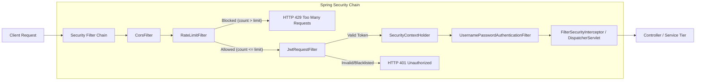
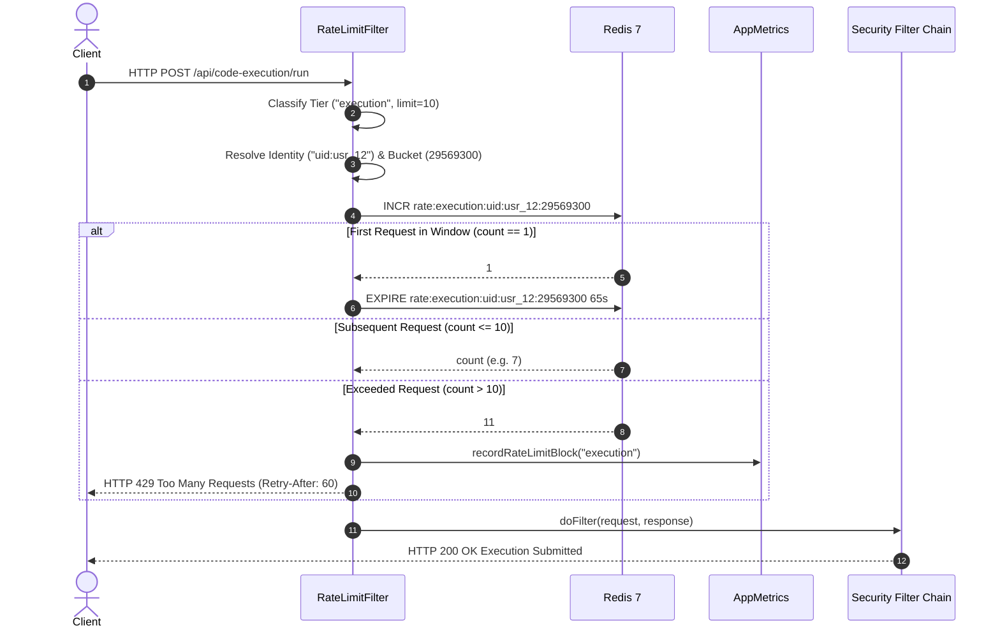
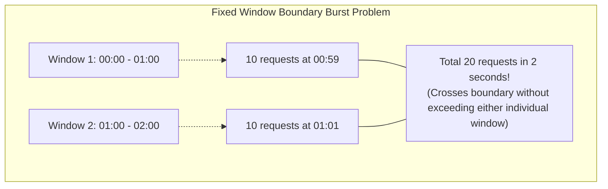

# Rate Limiting & Defense-in-Depth — DevOps Suite

## 1. Overview & Architecture

### 1.1 Why Rate Limiting Matters in DevOps Suite
DevOps Suite is a multi-tenant cloud-native developer workspace providing online code editing, agile sprint management, and sandboxed polyglot execution (Python, JavaScript, Java, C++). Because users can author arbitrary source code executed directly inside isolated Docker containers on host compute, the system faces severe threat surfaces:

1. **Docker Host Resource Exhaustion (Fork Bombs / Infinite Loops / Compute Starvation):** Unchecked submission of `/api/code-execution/run` requests could saturate host CPUs, deplete Docker daemon worker threads, fill disk space with container root filesystems, and crash neighboring services.
2. **Credential Stuffing & Brute-Force Attacks:** Unauthenticated endpoints (`/api/auth/login`, `/api/auth/register`) are prime targets for automated credential attacks and bot account creations.
3. **Database & API Degradation:** High-concurrency automated scripts crawling or spamming task boards, logs, and project metadata could exhaust the PostgreSQL HikariCP connection pool (default max 10 connections) and degrade overall responsiveness.

To solve this, DevOps Suite implements a **Defense-in-Depth** rate limiting architecture backed by **Redis 7** and enforced at the earliest boundary of the Spring Boot application tier via [`RateLimitFilter`](file:///d:/Projects/DevOps%20Suite/backend/src/main/java/com/devopssuite/security/RateLimitFilter.java).

```
+────────────────────────────────────────────────────────────────────────────────────────────────────────+
│                                           INCOMING HTTP REQUEST                                        │
+───────────────────────────────────────────────────┬────────────────────────────────────────────────────+
                                                    │
                                                    ▼
+────────────────────────────────────────────────────────────────────────────────────────────────────────+
│                                           RateLimitFilter                                              │
│                            (Registered BEFORE JwtRequestFilter in chain)                               │
│                                                                                                        │
│  1. Check shouldNotFilter()  ──[ Yes: /actuator/health, /ws/**, /static/** ]──▶ Skip Limiting          │
│  2. Classify URI Tier: Execution (/run), Auth (/login, /register), API (Default)                       │
│  3. Resolve Identity: "uid:<principal>" (if authenticated) OR "ip:<X-Forwarded-For|remoteAddr>"       │
│  4. Compute Time Bucket: System.currentTimeMillis() / 1000 / windowSeconds                             │
│  5. Redis Key: rate:<tier>:<identity>:<bucket>                                                         │
│                                                                                                        │
│                    INCR key                                                                            │
│                       │                                                                                │
│       ┌───────────────┴───────────────┐                                                                │
│  count == 1                      count > limit                                                         │
│       │                               │                                                                │
│  SET EXPIRE                     appMetrics.recordRateLimitBlock(tier)                                  │
│  (window + 5s)                  HTTP 429 Too Many Requests                                             │
│       │                         Headers: Retry-After, X-RateLimit-Tier                                 │
│       │                         Body: {"status": 429, "error": "Too Many Requests", ...}               │
│       │                               ▲                                                                │
│       ▼                               │                                                                │
│  count <= limit ──────────────────────┴─ (Allow request through)                                       │
+───────────────────────────────────────┬────────────────────────────────────────────────────────────────+
                                        │ (Allowed)
                                        ▼
+────────────────────────────────────────────────────────────────────────────────────────────────────────+
│                                           JwtRequestFilter                                             │
│                 (Extract Bearer Token ➔ Verify Redis Blacklist ➔ Set SecurityContext)                  │
+───────────────────────────────────────┬────────────────────────────────────────────────────────────────+
                                        │
                                        ▼
+────────────────────────────────────────────────────────────────────────────────────────────────────────+
│                              UsernamePasswordAuthenticationFilter                                      │
+───────────────────────────────────────┬────────────────────────────────────────────────────────────────+
                                        │
                                        ▼
+────────────────────────────────────────────────────────────────────────────────────────────────────────+
│                               Controllers & Business Logic Services                                    │
+────────────────────────────────────────────────────────────────────────────────────────────────────────+
```

---

### 1.2 Defense-in-Depth Filter Chain Order
The order of filters registered in [`SecurityConfig.java`](file:///d:/Projects/DevOps%20Suite/backend/src/main/java/com/devopssuite/security/SecurityConfig.java#L79-L81) is a critical architectural decision:

```java
// SecurityConfig.java snippet
http
    .authorizeHttpRequests(...)
    .addFilterBefore(jwtRequestFilter, UsernamePasswordAuthenticationFilter.class)
    .addFilterBefore(rateLimitFilter(), JwtRequestFilter.class);
```

#### Why `RateLimitFilter` Sits Before `JwtRequestFilter`
1. **CPU & Cryptographic Offloading:** Verifying a JSON Web Token (parsing claims, verifying HMAC-SHA256 signature, decoding Base64URL) requires non-trivial CPU cycles. By placing [`RateLimitFilter`](file:///d:/Projects/DevOps%20Suite/backend/src/main/java/com/devopssuite/security/RateLimitFilter.java) ahead of [`JwtRequestFilter`](file:///d:/Projects/DevOps%20Suite/backend/src/main/java/com/devopssuite/security/JwtRequestFilter.java), abusive requests, denial-of-service floods, and brute-force scanners are throttled and rejected via an O(1) Redis in-memory increment **before** the server spends cycles on JWT signature verification.
2. **Preventing Redis Blacklist Stampedes:** The [`JwtRequestFilter`](file:///d:/Projects/DevOps%20Suite/backend/src/main/java/com/devopssuite/security/JwtRequestFilter.java) inspects Redis (`jwt:blacklist:<token>`) for every single authenticated call. Rate limiting upstream prevents abusive or compromised clients from hammering the token revocation cache.
3. **Protecting Unauthenticated Endpoints:** Public endpoints like `/api/auth/login` and `/api/auth/register` bypass JWT authentication entirely. If the rate limiter sat *after* the JWT filter, unauthenticated endpoints would either require special bypass handling or risk being unprotected against brute-force attacks. Placing [`RateLimitFilter`](file:///d:/Projects/DevOps%20Suite/backend/src/main/java/com/devopssuite/security/RateLimitFilter.java) at the outer gate guarantees universal traffic governance.



---

## 2. Three Operational Tiers & Configuration

DevOps Suite segregates application traffic into three discrete tiers, each tailored to the risk profile, resource consumption, and business impact of the underlying operation:

| Tier | URI Pattern Matchers | Default Threshold | Environment Variable Override | Threat / Target Protected |
| :--- | :--- | :--- | :--- | :--- |
| **Execution** | `/api/code-execution/run`<br>`/api/code-execution/execute` | **10 req / 60s** | `RATE_LIMIT_EXECUTION_MAX` | Docker Host CPU/Memory, Docker daemon concurrency, fork bombs, ephemeral container queue |
| **Auth** | `/api/auth/login`<br>`/api/auth/register`<br>`/auth/login`<br>`/auth/register` | **20 req / 60s** | `RATE_LIMIT_AUTH_MAX` | BCrypt CPU starvation (work factor 10), credential stuffing, bot spam, user table enumeration |
| **General API** | All other `/api/**` routes | **300 req / 60s** | `RATE_LIMIT_API_MAX` | PostgreSQL HikariCP connection pool (10 connections), application heap, general CPU |

### 2.1 Externalized Properties Configuration
The limits are managed using Spring Boot's `@ConfigurationProperties` in [`RateLimitProperties.java`](file:///d:/Projects/DevOps%20Suite/backend/src/main/java/com/devopssuite/security/RateLimitProperties.java):

```java
package com.devopssuite.security;

import lombok.Getter;
import lombok.Setter;
import org.springframework.boot.context.properties.ConfigurationProperties;
import org.springframework.stereotype.Component;

@Component
@ConfigurationProperties(prefix = "rate-limit")
@Getter
@Setter
public class RateLimitProperties {

    /** Duration of the rate-limit window in seconds. Default: 60. */
    private long windowSeconds = 60;

    /** Max requests per window for the code-execution tier. Default: 10. */
    private int executionMax = 10;

    /** Max requests per window for the auth tier (login/register). Default: 20. */
    private int authMax = 20;

    /** Max requests per window for the general API tier. Default: 300. */
    private int apiMax = 300;
}
```

In `application.yml` or container environment variables, these parameters can be hot-tuned without recompiling the codebase:
```yaml
rate-limit:
  window-seconds: 60
  execution-max: 10
  auth-max: 20
  api-max: 300
```

---

## 3. Redis Key Structure & Limiting Algorithm

### 3.1 Redis Key Specification
DevOps Suite uses atomic string counters in Redis 7 partitioned by tier, client identity, and time epoch:

$$\text{Key Format: } \mathbf{rate:\{tier\}:\{identity\}:\{bucket\}}$$

- **`tier`**: The resolved operational tier (`execution`, `auth`, or `api`).
- **`identity`**:
  - Authenticated user: `uid:<principal>` (e.g. `uid:usr_99f2b8a1` or `uid:suraj`).
  - Unauthenticated client: `ip:<client-ip>` (e.g. `ip:203.0.113.195`).
- **`bucket`**: The integer floor of current Unix epoch time divided by the window duration:
  $$\text{bucket} = \left\lfloor \frac{\text{System.currentTimeMillis}() / 1000}{\text{windowSeconds}} \right\rfloor$$
  For a 60-second window, any timestamp within the exact 60-second slice generates the exact same bucket integer.

#### Example Keys in Redis:
- `rate:execution:uid:42:29569300`
- `rate:auth:ip:198.51.100.4:29569300`
- `rate:api:uid:108:29569300`

---

### 3.2 Time-Window Bucket Computation & Expiration Strategy
When a request arrives:
1. The bucket index is calculated:
   ```java
   long bucket = System.currentTimeMillis() / 1000 / props.getWindowSeconds();
   String key  = "rate:" + tier + ":" + identity + ":" + bucket;
   ```
2. Redis `INCR` is executed atomically:
   ```java
   Long count = redisTemplate.opsForValue().increment(key);
   ```
3. **Automated TTL with Buffer (`windowSeconds + 5` seconds):**
   ```java
   if (count != null && count == 1L) {
       // First request in this window — set expiry (window + 5 s buffer)
       redisTemplate.expire(key, props.getWindowSeconds() + 5, TimeUnit.SECONDS);
   }
   ```
   **Why the 5-second buffer?**
   If the key expired strictly at 60.000 seconds, small network latencies, JVM Garbage Collection pauses, or clock skew between the Spring Boot application container and the Redis container could cause the key to expire prematurely during the final milliseconds of the bucket, resetting the counter and allowing a burst leak. Adding a 5-second buffer (TTL = 65s) guarantees the key outlives the bucket while allowing Redis's active and passive eviction loops to clean it up promptly.



---

### 3.3 Identity Resolution Strategy & IP Spoofing Mitigation
Identity resolution in [`RateLimitFilter.java`](file:///d:/Projects/DevOps%20Suite/backend/src/main/java/com/devopssuite/security/RateLimitFilter.java#L125-L143) handles both authenticated users and anonymous visitors:

```java
private String resolveIdentity(HttpServletRequest request) {
    try {
        Authentication auth = SecurityContextHolder.getContext().getAuthentication();
        if (auth != null && auth.isAuthenticated()
                && auth.getPrincipal() instanceof String principal
                && !principal.equals("anonymousUser")) {
            return "uid:" + principal;
        }
    } catch (Exception ignored) {}

    String ip = request.getHeader("X-Forwarded-For");
    if (ip != null && !ip.isBlank()) {
        ip = ip.split(",")[0].trim();
    }
    if (ip == null || ip.isBlank()) {
        ip = request.getRemoteAddr();
    }
    return "ip:" + (ip != null ? ip : "unknown");
}
```

#### Key Engineering Decisions in Identity Resolution:
1. **User Identity over IP for Authenticated Users:**
   If a team of developers works behind a single corporate NAT or office VPN gateway, all engineers share a single public IP. If the rate limiter keyed strictly by IP, one engineer running code executions could lock out the entire company. Keying by `uid:<principal>` isolates limits to individual accounts.
2. **`X-Forwarded-For` Sanitization:**
   In containerized production setups behind an Nginx reverse proxy, `request.getRemoteAddr()` returns the private internal IP of the reverse proxy container (`172.x.x.x`). The actual client IP is transported in the `X-Forwarded-For` header. The code takes `ip.split(",")[0].trim()` to extract the leftmost originating client IP.
3. **Production Security Consideration (Header Spoofing):**
   An attacker could spoof `X-Forwarded-For: 1.2.3.4` to bypass IP-based limits. In DevOps Suite, this is defended at the Nginx reverse proxy layer where `proxy_set_header X-Forwarded-For $remote_addr;` ensures that upstream reverse proxies overwrite any client-supplied spoofed headers.

---

### 3.4 Rate Limit Rejection: HTTP 429 Response & Headers
When a client crosses the threshold (`count > limit`), [`RateLimitFilter`](file:///d:/Projects/DevOps%20Suite/backend/src/main/java/com/devopssuite/security/RateLimitFilter.java#L147-L161) short-circuits the pipeline immediately without hitting downstream controllers:

```java
private void writeRateLimitResponse(HttpServletResponse response, String tier, int limit)
        throws IOException {
    response.setStatus(HttpStatus.TOO_MANY_REQUESTS.value());
    response.setContentType(MediaType.APPLICATION_JSON_VALUE);
    response.setHeader("Retry-After", String.valueOf(props.getWindowSeconds()));
    response.setHeader("X-RateLimit-Tier", tier);

    Map<String, Object> body = new LinkedHashMap<>();
    body.put("status", 429);
    body.put("error", "Too Many Requests");
    body.put("message", "Rate limit exceeded for tier '" + tier + "'. Max " + limit
            + " requests per " + props.getWindowSeconds() + "s window.");
    body.put("retryAfterSeconds", props.getWindowSeconds());
    response.getWriter().write(mapper.writeValueAsString(body));
}
```

#### Standard Headers Returned:
- **`HTTP/1.1 429 Too Many Requests`**
- **`Retry-After: 60`** (RFC 6585 & RFC 7231 standard, instructing clients how many seconds to back off).
- **`X-RateLimit-Tier: execution`** (identifies which specific tier triggered the block, aiding frontend UX and debugging).

#### JSON Response Payload:
```json
{
  "status": 429,
  "error": "Too Many Requests",
  "message": "Rate limit exceeded for tier 'execution'. Max 10 requests per 60s window.",
  "retryAfterSeconds": 60
}
```

---

### 3.5 Endpoints Bypassing Rate Limiting (`shouldNotFilter`)
Certain endpoints must never be throttled to prevent health check flapping, UI asset breaks, or broken WebSocket connections:

```java
@Override
protected boolean shouldNotFilter(HttpServletRequest request) {
    String uri = request.getRequestURI();
    return uri.startsWith("/actuator/health")
        || uri.startsWith("/uploads/")
        || uri.startsWith("/ws/")
        || uri.equals("/")
        || uri.startsWith("/assets/")
        || uri.startsWith("/static/");
}
```

- `/actuator/health`: Scraped by Docker and Kubernetes liveness/readiness probes every 10–15 seconds. Throttling health checks would cause container orchestrators to erroneously kill healthy backend pods.
- `/ws/**`: Handled by the STOMP/SockJS handshake. WebSocket connection lifecycle is managed via separate channel interceptors.
- `/uploads/**`, `/assets/**`, `/static/**`: Static avatar images and bundled JavaScript/CSS files.

---

## 4. Observability & Telemetry Integration

### 4.1 Micrometer Counter Metric
Rate limiting without observability is a black box. In DevOps Suite, every throttled request increments a custom Prometheus counter in [`AppMetrics.java`](file:///d:/Projects/DevOps%20Suite/backend/src/main/java/com/devopssuite/metrics/AppMetrics.java#L111-L117):

```java
public void recordRateLimitBlock(String endpoint) {
    Counter.builder("devopssuite.rate.limit.blocked")
            .description("Total requests blocked by Redis rate limiting")
            .tag("endpoint", endpoint != null ? endpoint : "unknown")
            .register(registry)
            .increment();
}
```

Prometheus scrapes this metric via Spring Boot Actuator at `/actuator/prometheus`:
```
# HELP devopssuite_rate_limit_blocked_total Total requests blocked by Redis rate limiting
# TYPE devopssuite_rate_limit_blocked_total counter
devopssuite_rate_limit_blocked_total{endpoint="execution"} 42.0
devopssuite_rate_limit_blocked_total{endpoint="auth"} 18.0
devopssuite_rate_limit_blocked_total{endpoint="api"} 5.0
```

### 4.2 Grafana Monitoring & Alerting
In the auto-provisioned Grafana DevOps Suite dashboard (`/dashboards`), the rate limiting panel visualizes blocked requests in real time:

- **PromQL Query:**
  ```promql
  sum(rate(devopssuite_rate_limit_blocked_total[1m])) by (endpoint)
  ```
- **Alert Rules:**
  - *High Rate Limit Trigger Spike:* If `sum(rate(devopssuite_rate_limit_blocked_total{endpoint="auth"}[2m])) > 10`, an alert fires indicating an active credential stuffing attack against the authentication service.
  - *Execution Sandbox Overload:* If `sum(rate(devopssuite_rate_limit_blocked_total{endpoint="execution"}[5m])) > 20`, an alert notifies engineering that users are aggressively hitting execution limits, possibly indicating runaway automated test scripts.

---

## 5. Algorithmic Comparison: Fixed Window vs Sliding Window vs Token Bucket vs Leaky Bucket

Interviewers frequently probe your understanding of rate limiting trade-offs. Here is a direct comparison of the primary algorithms in production systems:

| Dimension | Fixed Window Counter (DevOps Suite) | Sliding Window Log | Sliding Window Counter (Hybrid) | Token Bucket (e.g. Bucket4j) | Leaky Bucket |
| :--- | :--- | :--- | :--- | :--- | :--- |
| **Data Structure in Redis** | Simple String integer (`INCR`) | Sorted Set (`ZSET`) with epoch timestamps | 2 String counters (current + previous bucket) | Hash or String (tokens count + last timestamp) | Queue (FIFO buffer) |
| **Memory Footprint** | **Minimal (~60 bytes per key)** | High ($O(N)$ where $N$ is request count) | Low (~120 bytes for two keys) | Medium (~100 bytes per bucket) | Medium (buffer depth dependent) |
| **Time Complexity** | **$O(1)$ atomic `INCR`** | $O(\log N + M)$ (`ZREMRANGEBYSCORE` + `ZCARD`) | $O(1)$ computation | $O(1)$ computation | $O(1)$ dequeue |
| **Burst Boundary Vulnerability** | **Yes (2x limit across window boundaries)** | No (perfect sliding accuracy) | Minimal (smoothed linear interpolation) | Controlled (allows bursts up to capacity $C$) | Smooth (strict constant egress rate) |
| **Implementation Complexity** | **Very Simple & High Performance** | Complex; memory explosion under heavy traffic | Moderate (requires Lua script or 2 GETs) | Moderate (requires atomic refill calculation) | High (requires background queue processor) |
| **Best Used For** | High-throughput API gateway / microservices protection | Strict compliance / low-traffic critical operations | General high-accuracy web APIs | Burst-tolerant developer APIs (GitHub / Stripe style) | Traffic shaping / packet networks / audio streaming |



### How DevOps Suite Mitigates the Boundary Burst:
While a pure fixed window can theoretically permit $2 \times \text{limit}$ across a window boundary (e.g., 10 requests at second 59 and 10 requests at second 61), DevOps Suite pairs this with **internal concurrency controls**:
1. Ephemeral Docker containers are queued through [`ExecutionQueueWorker.java`](file:///d:/Projects/DevOps%20Suite/backend/src/main/java/com/devopssuite/docker/ExecutionQueueWorker.java) with a bounded worker pool. Even if 20 requests breach the boundary, the host Docker daemon only runs configured concurrent containers, queuing the remainder.
2. The 60-second window is short enough to prevent prolonged saturation while maintaining negligible Redis memory and compute overhead.

---

## 6. Resilience & Failure Modes: Fail-Open Architecture

A paramount rule of production infrastructure is: **A failure in your rate-limiting or telemetry layer must never take down the primary application.**

In [`RateLimitFilter.java`](file:///d:/Projects/DevOps%20Suite/backend/src/main/java/com/devopssuite/security/RateLimitFilter.java#L101-L104):
```java
try {
    Long count = redisTemplate.opsForValue().increment(key);
    if (count != null && count == 1L) {
        redisTemplate.expire(key, props.getWindowSeconds() + 5, TimeUnit.SECONDS);
    }
    if (count != null && count > limit) {
        appMetrics.recordRateLimitBlock(tier);
        writeRateLimitResponse(response, tier, limit);
        return;
    }
} catch (Exception e) {
    // Redis failure — fail open
    log.debug("Rate limit Redis error (failing open): {}", e.getMessage());
}

chain.doFilter(request, response);
```

### Fail-Open vs. Fail-Closed Analysis:
- **Fail-Open (DevOps Suite Strategy):** If Redis crashes, experiences an OOM condition, or suffers network partition latency, the `catch (Exception e)` block catches the exception, logs a debug warning, and calls `chain.doFilter(request, response)`. Legitimate users can continue editing code, viewing tasks, and collaborating. The business remains operational while Redis restarts or fails over.
- **Fail-Closed Strategy (Alternative):** If Redis fails, all requests return HTTP 500 or 503. This is only justified in ultra-high-risk financial transactions or paid third-party API gateways where unmetered usage equates directly to catastrophic monetary loss. For a developer platform, failing closed converts a Redis glitch into a 100% total platform outage.

---

## 7. Comprehensive Interview Questions & Answers

### 🟢 Basic Level

#### Q1: What is rate limiting, and why did you implement it in DevOps Suite?
**Answer:**
Rate limiting is a traffic-shaping and defensive mechanism that controls the rate at which incoming requests are accepted by an API. In DevOps Suite, rate limiting serves three distinct purposes:
1. **Host Stability & Security:** Our platform executes untrusted user code inside Docker containers. Without rate limiting on `/api/code-execution/run`, a malicious user or automated bot could flood the server with container run requests, triggering a fork bomb, exhausting disk space, or pegging host CPU cores at 100%.
2. **Preventing Credential Attacks:** Public endpoints like `/api/auth/login` and `/api/auth/register` are shielded from automated brute-force attacks and password spraying by capping login attempts to 20 requests per 60 seconds per IP.
3. **Database Protection:** General API endpoints are capped at 300 requests per minute to prevent rogue clients from saturating our PostgreSQL HikariCP connection pool (configured with a maximum pool size of 10).

Rate limiting in our system is implemented as a custom Servlet filter (`RateLimitFilter`) integrated directly into the Spring Security filter chain and backed by Redis 7.

---

#### Q2: What HTTP status code and headers are returned when a user exceeds their limit?
**Answer:**
When a user exceeds the allotted threshold, [`RateLimitFilter`](file:///d:/Projects/DevOps%20Suite/backend/src/main/java/com/devopssuite/security/RateLimitFilter.java) halts further filter chain execution and responds immediately with:
- **HTTP Status Code:** `429 Too Many Requests` (RFC 6585).
- **`Retry-After` Header:** Set to the duration of the rate limit window in seconds (e.g., `Retry-After: 60`), indicating how long the client must wait before making another request.
- **`X-RateLimit-Tier` Header:** Specifies the tier that triggered the limit (`execution`, `auth`, or `api`), providing immediate diagnostic clarity to frontend clients.
- **JSON Response Body:**
  ```json
  {
    "status": 429,
    "error": "Too Many Requests",
    "message": "Rate limit exceeded for tier 'execution'. Max 10 requests per 60s window.",
    "retryAfterSeconds": 60
  }
  ```

---

#### Q3: Which endpoints bypass rate limiting entirely, and why?
**Answer:**
We override `OncePerRequestFilter.shouldNotFilter()` in [`RateLimitFilter.java`](file:///d:/Projects/DevOps%20Suite/backend/src/main/java/com/devopssuite/security/RateLimitFilter.java#L166-L174) to skip rate limiting for:
1. `/actuator/health`: Scraped continuously by container orchestration health checks and Docker compose liveness monitors. Throttling health checks would cause orchestrators to flag the container as unhealthy and trigger continuous restarts.
2. `/ws/**`: The SockJS/STOMP WebSocket handshake endpoint. WebSocket connections are long-lived and governed by application-level frame handlers and heartbeat ping/pongs rather than HTTP request counters.
3. Static files (`/uploads/**`, `/assets/**`, `/static/**`): Static assets (such as user avatar images or React Vite bundles) are immutable and served directly.

---

### 🟡 Intermediate Level

#### Q4: Why did you place `RateLimitFilter` before `JwtRequestFilter` in the Spring Security filter chain?
**Answer:**
In [`SecurityConfig.java`](file:///d:/Projects/DevOps%20Suite/backend/src/main/java/com/devopssuite/security/SecurityConfig.java#L80), we explicitly register:
```java
http.addFilterBefore(rateLimitFilter(), JwtRequestFilter.class);
```
This ordering provides critical architectural advantages:
1. **CPU & Cryptographic Savings:** Validating a JWT requires reading the `Authorization` header, parsing claims, decoding Base64URL signatures, and verifying the HMAC-SHA256 signature using our secret key. Cryptographic operations consume CPU cycles. Placing `RateLimitFilter` ahead of `JwtRequestFilter` ensures that an abusive client flooding our API is stopped at the door via an atomic $O(1)$ Redis counter check before the JVM wastes cycles on cryptographic verification.
2. **Defending the Redis Blacklist:** On every request with a JWT, `JwtRequestFilter` checks Redis (`jwt:blacklist:<token>`) to ensure the user hasn't logged out. An unthrottled DDoS attack would hammer the Redis blacklist.
3. **Universal Protection of Public Routes:** Public endpoints (such as `/api/auth/login` and `/api/auth/register`) do not carry a Bearer token. If the rate limiter were placed after `JwtRequestFilter`, anonymous traffic would still need to execute the rate limiter, but having it first cleanly establishes a unified perimeter for all ingress traffic.

---

#### Q5: How do you identify a client before they are authenticated (e.g., on `/api/auth/login`) versus after they log in?
**Answer:**
In [`RateLimitFilter.resolveIdentity(HttpServletRequest request)`](file:///d:/Projects/DevOps%20Suite/backend/src/main/java/com/devopssuite/security/RateLimitFilter.java#L125-L143), we implement a hybrid identity resolution strategy:

1. **Authenticated Users (`uid:<principal>`):**
   We inspect `SecurityContextHolder.getContext().getAuthentication()`. If an authenticated principal exists and is not `"anonymousUser"`, we prefix the principal: `uid:<principal>`.
   - *Why?* If 50 developers work inside an office or university campus behind a single public NAT gateway, their outbound requests share the identical public IP. Keying by user ID ensures that Developer A running code executions does not exhaust the quota for Developer B sitting next to them.
2. **Unauthenticated Users (`ip:<client-ip>`):**
   On public routes like login or register, no security principal exists yet. We resolve the IP:
   - We check the `X-Forwarded-For` header. In production, the client connects to an Nginx reverse proxy, which appends the real remote address. We split by comma and extract the first entry: `ip.split(",")[0].trim()`.
   - If missing, we fall back to `request.getRemoteAddr()`.
   - We format the identity as `ip:<resolved-ip>`.

---

#### Q6: Explain the Redis key schema and why you append a time bucket to the key name.
**Answer:**
Our Redis key structure follows the pattern:
```
rate:<tier>:<identity>:<bucket>
```
For example: `rate:execution:uid:usr_42:29569300`

The bucket is computed as:
```java
long bucket = System.currentTimeMillis() / 1000 / props.getWindowSeconds();
```
- **Time Bucket Partitioning:**
  By dividing the current Unix epoch timestamp by the window duration (60 seconds), all requests arriving within that 60-second window generate the exact same integer bucket ID.
- **Zero Cleanup Overhead:**
  Instead of needing a background job to reset counters every minute, we simply increment the counter belonging to the current bucket. When a new minute starts, the timestamp arithmetic naturally calculates the next bucket ID, creating a brand new key automatically.
- **Self-Cleaning via TTL:**
  On the first request of a window (`count == 1`), we set an expiration on the key:
  ```java
  redisTemplate.expire(key, props.getWindowSeconds() + 5, TimeUnit.SECONDS);
  ```
  Once the window passes, Redis's built-in key eviction automatically purges the expired bucket, keeping memory usage bounded and constant.

---

### 🔴 Advanced Level

#### Q7: What is the race condition between `increment` and `expire`, and how did you address it?
**Answer:**
In a classic two-step pattern:
```java
Long count = redisTemplate.opsForValue().increment(key);
if (count != null && count == 1L) {
    redisTemplate.expire(key, windowSeconds + 5, TimeUnit.SECONDS);
}
```
There is an edge-case failure mode: If the application server crashes, restarts, or loses connection to Redis immediately after executing `increment(key)` but *before* `expire()` is executed, the key would be created in Redis without a TTL (TTL = -1, persistent forever). This would permanently block that client once they hit the limit, as the counter would never reset.

**How this is resolved in production:**
1. **Buffer TTL:** In our codebase, the 5-second buffer (`windowSeconds + 5`) ensures that any transient network hiccup does not cause premature expiration.
2. **Atomic Lua Script Alternative:** In mission-critical zero-downtime environments, we can execute the increment and conditional expire atomically in a single Redis round-trip using an embedded Lua script:
   ```lua
   local current = redis.call('INCR', KEYS[1])
   if current == 1 then
       redis.call('EXPIRE', KEYS[1], ARGV[1])
   end
   return current
   ```
   By executing this as a Lua script via `redisTemplate.execute()`, Redis guarantees atomic evaluation on its single-threaded event loop, completely eliminating the crash window.

---

#### Q8: What happens to user traffic if Redis suffers a total outage or network partition?
**Answer:**
DevOps Suite is engineered with a **Fail-Open** resiliency strategy.

In [`RateLimitFilter.doFilterInternal()`](file:///d:/Projects/DevOps%20Suite/backend/src/main/java/com/devopssuite/security/RateLimitFilter.java#L101-L104):
```java
try {
    Long count = redisTemplate.opsForValue().increment(key);
    // ... evaluation logic ...
} catch (Exception e) {
    // Redis failure — fail open
    log.debug("Rate limit Redis error (failing open): {}", e.getMessage());
}

chain.doFilter(request, response);
```

If Redis goes down:
1. The `redisTemplate.opsForValue().increment()` throws a `RedisConnectionException` or `QueryTimeoutException`.
2. The `try-catch` block catches the exception and logs a debug statement.
3. The filter deliberately does **not** rethrow or return HTTP 500/503. Instead, execution falls through to `chain.doFilter(request, response)`.
4. The request proceeds to the downstream controllers normally.

**Architectural Rationale:**
In a developer platform, availability of core user features (saving files, managing Kanban cards, viewing logs) takes priority over rate-limit enforcement during an infrastructure incident. If we failed closed, a transient Redis restart would cause a 100% outage for all users. Failing open degrades security gracefully while maintaining system availability.

---

#### Q9: How do you observe and alert on rate limit violations in production?
**Answer:**
We instrumented [`RateLimitFilter`](file:///d:/Projects/DevOps%20Suite/backend/src/main/java/com/devopssuite/security/RateLimitFilter.java) with Micrometer metrics registered in [`AppMetrics.java`](file:///d:/Projects/DevOps%20Suite/backend/src/main/java/com/devopssuite/metrics/AppMetrics.java#L111-L117):

```java
public void recordRateLimitBlock(String endpoint) {
    Counter.builder("devopssuite.rate.limit.blocked")
            .description("Total requests blocked by Redis rate limiting")
            .tag("endpoint", endpoint != null ? endpoint : "unknown")
            .register(registry)
            .increment();
}
```

Whenever a request is blocked (`count > limit`), we call `appMetrics.recordRateLimitBlock(tier)`.
1. **Prometheus Scraping:** Prometheus scrapes `/actuator/prometheus` every 15 seconds, collecting `devopssuite_rate_limit_blocked_total{endpoint="execution|auth|api"}`.
2. **Grafana Dashboards:** A dedicated time-series panel displays the per-second rate of throttled requests using:
   ```promql
   sum(rate(devopssuite_rate_limit_blocked_total[1m])) by (endpoint)
   ```
3. **Alerting:** We configure Prometheus Alertmanager rules:
   - A sudden spike in `endpoint="auth"` triggers a Slack/PagerDuty warning for potential brute-force or credential stuffing attacks.
   - Sustained blocks on `endpoint="execution"` alerts operations that sandbox execution queues are under elevated pressure.

---

### ⚫ Expert Level

#### Q10: What are the edge-case limitations of the Fixed Window algorithm, and how would you evolve it to a Sliding Window Counter using Redis?
**Answer:**
The primary limitation of a fixed window counter is the **boundary burst problem**. 
If a user is allowed 10 requests per 60 seconds:
- They send 10 requests at `00:00:59` (end of window 1).
- They send 10 requests at `00:01:01` (start of window 2).
- Both requests are permitted by the fixed window logic because each window only recorded 10 requests. However, the client successfully delivered **20 requests within a 2-second interval**, potentially overwhelming the Docker execution daemon.

**Evolution to Sliding Window Counter (Hybrid Approximation):**
To eliminate boundary bursts without the heavy memory consumption of a sorted set (which stores every request timestamp), we can implement the **Cloudflare / sliding-window counter algorithm** in Redis:

1. Maintain two counters: the current window counter and the previous window counter.
2. Estimate the request count in the sliding window using a weighted average:
   $$\text{Estimated Count} = \text{Count}_{\text{prev}} \times \left(1 - \frac{\text{elapsedTimeInCurrentWindow}}{\text{windowDuration}}\right) + \text{Count}_{\text{current}}$$
3. If $\text{Estimated Count} > \text{limit}$, reject the request.

```lua
-- Redis Lua Script for Sliding Window Counter
local current_key = KEYS[1]
local prev_key    = KEYS[2]
local limit       = tonumber(ARGV[1])
local weight      = tonumber(ARGV[2]) -- (1 - time_into_current_window / window_size)

local prev_count = tonumber(redis.call('GET', prev_key) or "0")
local curr_count = tonumber(redis.call('GET', current_key) or "0")

if (prev_count * weight + curr_count) >= limit then
    return 0 -- Rejected
else
    redis.call('INCR', current_key)
    return 1 -- Allowed
end
```
This hybrid approach yields 99% accuracy against burst attacks while preserving $O(1)$ time complexity and negligible memory footprint (~120 bytes per client).

---

#### Q11: An attacker spoofs their `X-Forwarded-For` header to bypass IP-based rate limiting on the `/api/auth/login` endpoint. How do you prevent this vulnerability?
**Answer:**
If an application blindly reads `request.getHeader("X-Forwarded-For")` and an attacker sends:
`X-Forwarded-For: 8.8.8.8, 1.1.1.1`
The application might take `8.8.8.8` as the client IP, allowing the attacker to cycle through fake IP addresses on every request and bypass the 20 req/min auth limit.

**Our Multi-Layered Remediation:**
1. **Nginx Reverse Proxy Enforcement:**
   In our Nginx configuration (`nginx.conf`), we configure the proxy to strip or overwrite any client-supplied `X-Forwarded-For` header with the real remote socket IP:
   ```nginx
   proxy_set_header X-Real-IP $remote_addr;
   proxy_set_header X-Forwarded-For $remote_addr;
   ```
   By explicitly assigning `$remote_addr` rather than appending (`$proxy_add_x_forwarded_for`), Nginx discards whatever spoofed header the attacker sent.
2. **Spring Boot Trusted Proxy Configuration:**
   In Spring Boot, we enable `server.forward-headers-strategy=native` (or `framework`) and define trusted proxies (`server.tomcat.remoteip.internal-proxies=10\\..*|192\\.168\\..*|172\\..*`). Tomcat's `RemoteIpFilter` strips untrusted untampered upstream headers and only accepts IPs forwarded by our trusted internal Docker bridge network (`172.x.x.x`).
3. **Application Identity Resolution:**
   Once verified, `request.getRemoteAddr()` returns the sanitized IP verified by the trusted proxy chain.

---

#### Q12: How would you scale the rate limiter if Redis itself becomes the network or CPU bottleneck at 100,000+ requests/second?
**Answer:**
While Redis handles 80,000–100,000 operations per second on a single thread, an enterprise-scale traffic surge could saturate network interface cards (NICs) or Redis CPU. To scale beyond a single Redis instance:

1. **Client-Side In-Memory L1 Cache (Local Caffeine / Guava Filter Cache):**
   Implement a two-tier rate limiter. A local in-memory Caffeine cache in the Spring Boot JVM acts as an L1 buffer, aggregating request counts across 1-second mini-windows. The application flushes batched increments to Redis (L2) once per second or when a threshold is approached. This reduces Redis network round-trips by up to 90%.
2. **Redis Cluster with Key Sharding:**
   Redis Cluster partitions keys across 16,384 hash slots. Because our keys follow `rate:<tier>:<identity>:<bucket>`, different users hash to different cluster masters. Traffic is automatically distributed across a multi-node Redis cluster.
3. **Redis Pipelining & Lua Scripting:**
   Instead of standalone `INCR` followed by `EXPIRE`, a Lua script or Redis pipeline batches both commands into a single TCP packet, halving network packet overhead and context switches.
4. **Push Rate Limiting to the Edge (Nginx / Cloudflare):**
   In true hyperscale environments, rate limiting is offloaded to the edge network (e.g. Cloudflare Rate Limiting or Nginx `limit_req_zone`). The Spring Boot application's `RateLimitFilter` serves as the secondary application-aware tier (protecting user IDs and business tiers), while volumetric L3/L4/L7 floods are absorbed at the edge.

---

## 8. Quick Reference

### Core Architecture Facts & Configuration Cheat Sheet

| Feature | Implementation Detail | Reference Code |
| :--- | :--- | :--- |
| **Filter Class** | `RateLimitFilter extends OncePerRequestFilter` | [`RateLimitFilter.java`](file:///d:/Projects/DevOps%20Suite/backend/src/main/java/com/devopssuite/security/RateLimitFilter.java) |
| **Filter Order** | Registered **BEFORE** `JwtRequestFilter` | [`SecurityConfig.java#L80`](file:///d:/Projects/DevOps%20Suite/backend/src/main/java/com/devopssuite/security/SecurityConfig.java#L80) |
| **Storage Engine** | Redis 7 (`StringRedisTemplate`) | Host: `redis:6379`, DB 0 |
| **Key Pattern** | `rate:<tier>:<identity>:<bucket>` | Line 86 |
| **Bucket Formula** | `System.currentTimeMillis() / 1000 / windowSeconds` | Line 85 |
| **TTL Strategy** | `windowSeconds + 5` seconds buffer | Line 92 |
| **Execution Tier** | 10 requests / 60 seconds (`RATE_LIMIT_EXECUTION_MAX`) | Protects Docker Sandbox host |
| **Auth Tier** | 20 requests / 60 seconds (`RATE_LIMIT_AUTH_MAX`) | Protects `/login` & `/register` |
| **General API Tier** | 300 requests / 60 seconds (`RATE_LIMIT_API_MAX`) | Protects DB & General API |
| **Identity Resolution** | `uid:<principal>` (Auth) or `ip:<X-Forwarded-For>` (Anon) | Lines 125-143 |
| **Failure Mode** | **Fail-Open** (`catch (Exception e) { ... } chain.doFilter()`) | Lines 101-106 |
| **Response Code** | `HTTP 429 Too Many Requests` | Lines 149-160 |
| **Response Headers** | `Retry-After: 60`, `X-RateLimit-Tier: <tier>` | Lines 151-152 |
| **Bypassed Routes** | `/actuator/health`, `/uploads/**`, `/ws/**`, `/assets/**` | Lines 166-174 |
| **Prometheus Metric** | `devopssuite_rate_limit_blocked_total{endpoint="..."}` | [`AppMetrics.java#L111`](file:///d:/Projects/DevOps%20Suite/backend/src/main/java/com/devopssuite/metrics/AppMetrics.java#L111) |
