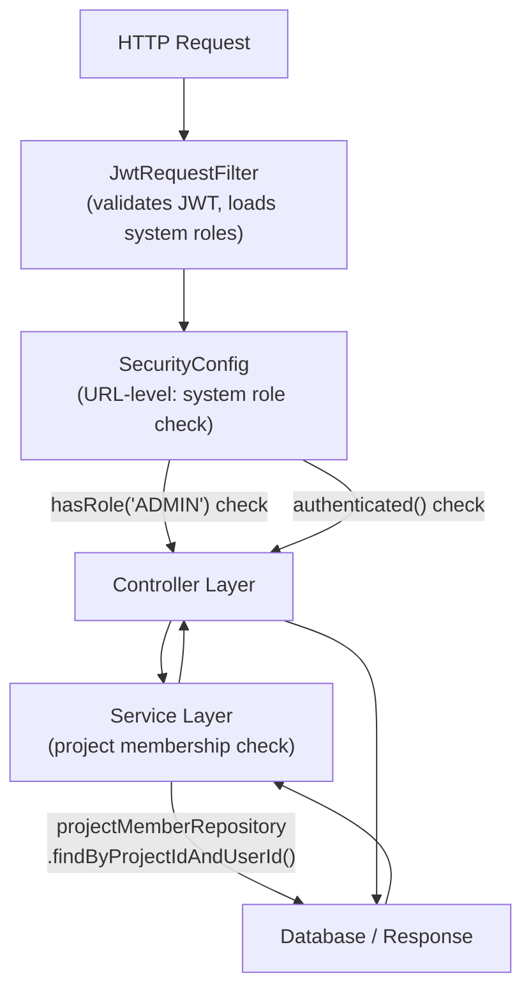
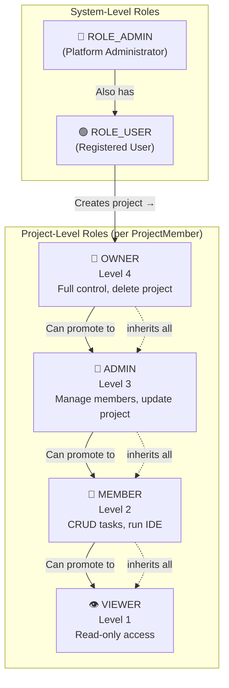
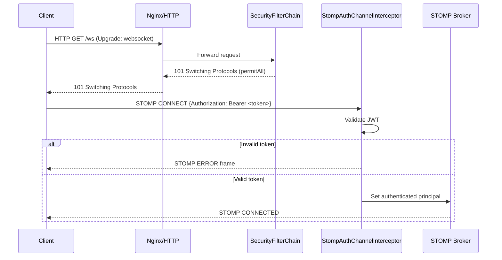
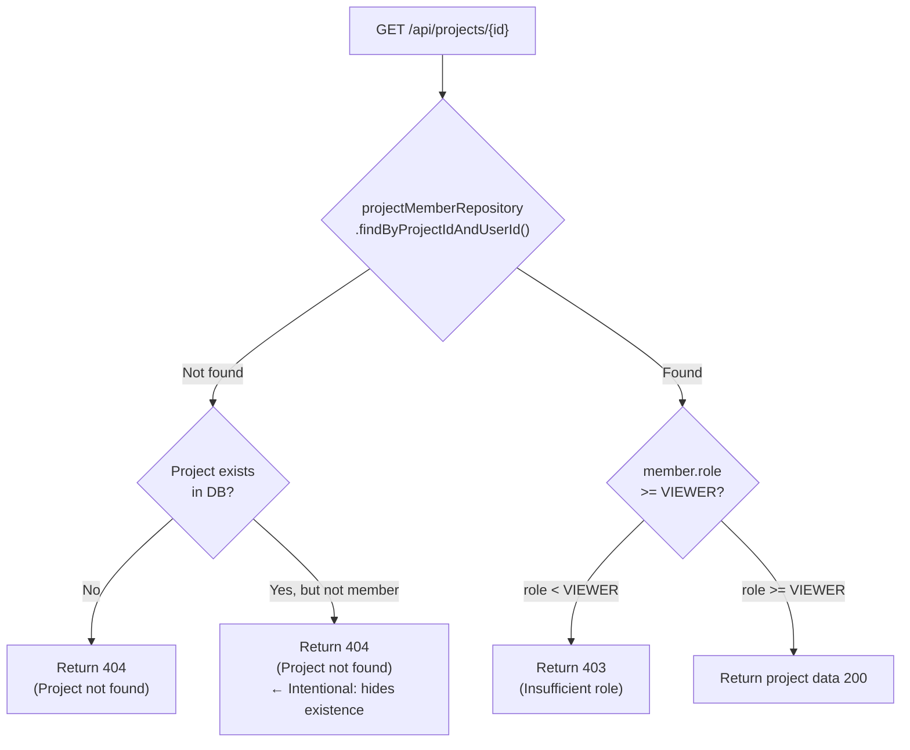

# RBAC & Spring Security — Interview Q&A

> **File:** `interview/03-backend/rbac-and-security.md`
> **Topic:** Role-Based Access Control, Spring Security configuration, permission enforcement, and security hardening in DevOps Suite.
> **Difficulty range:** 🟢 Basic → ⚫ Expert

---

## Table of Contents
1. [Role System Architecture](#1-role-system-architecture)
2. [Permission Matrix](#2-permission-matrix)
3. [SecurityConfig Deep Dive](#3-securityconfig-deep-dive)
4. [Service-Layer Permission Enforcement](#4-service-layer-permission-enforcement)
5. [Security Best Practices Applied](#5-security-best-practices-applied)
6. [OWASP Top 10 Coverage](#6-owasp-top-10-coverage)
7. [Interview Q&A](#7-interview-qa)
8. [Quick Reference](#8-quick-reference)

---

## 1. Role System Architecture

DevOps Suite uses a **two-tier RBAC model**: system-level roles control platform-wide access, while project-level roles control fine-grained access within each project. These two tiers are entirely orthogonal — a system ADMIN is not automatically a project OWNER, and a project OWNER is not a system ADMIN.

### 1.1 System-Level Roles

System roles are stored in the `User.roles` field (a `Set<String>` persisted as a separate join table). Spring Security reads these roles during authentication and populates the `SecurityContext`.

| System Role | Who Has It | What It Unlocks |
|---|---|---|
| `ROLE_USER` | All registered users (default) | Create projects, run code, use IDE |
| `ROLE_ADMIN` | Platform administrators only | `/api/admin/**`, metrics dashboard, user management |

> **Key file:** [`SecurityConfig.java`](file:///d:/Projects/DevOps%20Suite/src/main/java/com/devopssuite/config/SecurityConfig.java) — configures which system roles can access which URL patterns.

```java
// User entity — system roles stored as a Set
@ElementCollection(fetch = FetchType.EAGER)
@CollectionTable(name = "user_roles", joinColumns = @JoinColumn(name = "user_id"))
@Column(name = "role")
private Set<String> roles = new HashSet<>(Set.of("ROLE_USER")); // default
```

### 1.2 Project-Level Roles

Project roles are stored in the `ProjectMember` join entity (table `project_members`), which maps a `User` to a `Project` with a specific `ProjectRole` enum.

```
OWNER > ADMIN > MEMBER > VIEWER
```

| Project Role | Numeric Level | Typical Holder |
|---|---|---|
| `OWNER` | 4 | Project creator; can delete project, transfer ownership |
| `ADMIN` | 3 | Trusted team lead; can add/remove members |
| `MEMBER` | 2 | Standard developer; can create and resolve tasks |
| `VIEWER` | 1 | Read-only stakeholder; can view tasks, logs |

```java
// ProjectRole enum with hierarchy comparison support
public enum ProjectRole {
    VIEWER(1), MEMBER(2), ADMIN(3), OWNER(4);

    private final int level;
    ProjectRole(int level) { this.level = level; }

    public boolean isAtLeast(ProjectRole required) {
        return this.level >= required.level;
    }
}
```

### 1.3 How the Two Tiers Interact

The two tiers work **independently** and are checked at different layers:



**Rules:**
1. A request must first pass **system role checks** (Spring Security filter chain).
2. If it passes, the service layer then runs **project role checks** (custom Java logic).
3. Both checks must pass — a `ROLE_ADMIN` user still cannot modify a project they're not a member of unless the admin endpoint specifically bypasses the membership check.

### 1.4 Role Storage Locations

| Role Type | Entity | Field | Table | Who Assigns |
|---|---|---|---|---|
| System role | `User` | `roles: Set<String>` | `user_roles` | Admin via `/api/admin/users/{id}/roles` |
| Project role | `ProjectMember` | `role: ProjectRole` | `project_members` | Project OWNER/ADMIN via `/api/projects/{id}/members` |

---

## 2. Permission Matrix

### 2.1 Full Operation Permission Table

| Operation | Endpoint | System Role | Project Role | Notes |
|---|---|---|---|---|
| Register / Login | `POST /api/auth/**` | None (public) | N/A | No auth required |
| Create project | `POST /api/projects` | `ROLE_USER` | N/A → becomes OWNER | Creator auto-assigned OWNER |
| List own projects | `GET /api/projects` | `ROLE_USER` | N/A | Returns only member projects |
| View project detail | `GET /api/projects/{id}` | Authenticated | `VIEWER+` | 404 if non-member |
| Update project | `PUT /api/projects/{id}` | Authenticated | `ADMIN+` | 403 if MEMBER or VIEWER |
| Delete project | `DELETE /api/projects/{id}` | Authenticated | `OWNER` only | Hard delete + cascade |
| Add member | `POST /api/projects/{id}/members` | Authenticated | `ADMIN+` | Cannot assign role > own role |
| Remove member | `DELETE /api/projects/{id}/members/{uid}` | Authenticated | `ADMIN+` | Cannot remove OWNER |
| Assign OWNER role | `PUT /api/projects/{id}/members/{uid}` | Authenticated | `OWNER` only | Only current OWNER can promote |
| Create task | `POST /api/projects/{id}/tasks` | Authenticated | `MEMBER+` | |
| Update task | `PUT /api/projects/{id}/tasks/{tid}` | Authenticated | `MEMBER+` | |
| Delete task | `DELETE /api/projects/{id}/tasks/{tid}` | Authenticated | `MEMBER+` (own) or `ADMIN+` | |
| View logs | `GET /api/projects/{id}/logs` | Authenticated | `VIEWER+` | Elasticsearch query |
| Run code execution | `POST /api/execute` | `ROLE_USER` | N/A | No project scope |
| View metrics dashboard | `GET /api/metrics/dashboard` | `ROLE_ADMIN` | N/A | System-wide stats |
| List all users | `GET /api/admin/users` | `ROLE_ADMIN` | N/A | Admin only |
| Change user system role | `PUT /api/admin/users/{id}/roles` | `ROLE_ADMIN` | N/A | Admin only |
| Actuator health | `GET /actuator/health` | None (public) | N/A | For load balancer probes |
| Actuator prometheus | `GET /actuator/prometheus` | `ROLE_ADMIN` | N/A | Scraped by Prometheus internally |

### 2.2 RBAC Hierarchy Diagram



### 2.3 Role Escalation Prevention

A critical security rule: **a user cannot grant a role higher than or equal to their own**.

```java
// In ProjectService.addMember()
ProjectRole requestingUserRole = getProjectRole(projectId, requestingUserId);
if (!requestingUserRole.isAtLeast(ProjectRole.ADMIN)) {
    throw new ForbiddenException("Insufficient project role");
}
// Prevent privilege escalation: ADMIN cannot assign OWNER
if (newRole.level >= requestingUserRole.level
        && requestingUserRole != ProjectRole.OWNER) {
    throw new ForbiddenException("Cannot assign a role equal to or higher than your own");
}
```

---

## 3. SecurityConfig Deep Dive

### Q: Walk me through the complete Spring Security configuration.

> **Key file:** [`SecurityConfig.java`](file:///d:/Projects/DevOps%20Suite/src/main/java/com/devopssuite/config/SecurityConfig.java)

The `SecurityConfig` class is annotated with `@Configuration` and `@EnableWebSecurity`. It defines a `SecurityFilterChain` bean that wires together all security concerns:

```java
@Configuration
@EnableWebSecurity
public class SecurityConfig {

    @Bean
    public SecurityFilterChain securityFilterChain(HttpSecurity http,
            JwtRequestFilter jwtRequestFilter,
            CustomAuthenticationEntryPoint authEntryPoint) throws Exception {
        http
            // 1. Disable CSRF (stateless JWT API)
            .csrf(AbstractHttpConfigurer::disable)

            // 2. Stateless sessions — no HttpSession created
            .sessionManagement(sm ->
                sm.sessionCreationPolicy(SessionCreationPolicy.STATELESS))

            // 3. Custom 401 JSON response
            .exceptionHandling(ex ->
                ex.authenticationEntryPoint(authEntryPoint))

            // 4. URL-level authorization rules
            .authorizeHttpRequests(auth -> auth
                // Public paths — no token required
                .requestMatchers("/auth/**", "/api/auth/**").permitAll()
                .requestMatchers("/actuator/health").permitAll()
                .requestMatchers("/ws/**").permitAll()  // STOMP handshake
                // Admin-only paths
                .requestMatchers("/api/admin/**").hasRole("ADMIN")
                .requestMatchers("/api/metrics/dashboard").hasRole("ADMIN")
                // Everything else must be authenticated
                .anyRequest().authenticated()
            )

            // 5. Add JWT filter before Spring's username/password filter
            .addFilterBefore(jwtRequestFilter,
                UsernamePasswordAuthenticationFilter.class)

            // 6. OAuth2 login support (Google, GitHub)
            .oauth2Login(oauth2 -> oauth2
                .successHandler(oAuth2SuccessHandler));

        return http.build();
    }
}
```

**Key decisions explained:**

| Config | Value | Why |
|---|---|---|
| CSRF | Disabled | REST API with JWT — no browser cookie session to protect |
| Session | STATELESS | JWT is self-contained; no server-side state needed |
| `/ws/**` | Permitted | WebSocket upgrade happens before JWT is validated; STOMP auth is done separately via `StompAuthChannelInterceptor` |
| `/actuator/health` | Public | Load balancer health probes must not require auth |

### Q: Why is `/ws/**` permitted at the HTTP level if WebSocket connections require auth?

The HTTP-level `permitAll()` for `/ws/**` only allows the **initial HTTP upgrade handshake** to succeed. The actual STOMP subscription authorization happens inside [`StompAuthChannelInterceptor`](file:///d:/Projects/DevOps%20Suite/src/main/java/com/devopssuite/websocket/StompAuthChannelInterceptor.java), which intercepts every `CONNECT` frame, extracts the JWT from the STOMP `Authorization` header, validates it, and sets the authenticated principal in the STOMP session.



### Q: What does the custom `AuthenticationEntryPoint` do?

Spring's default `AuthenticationEntryPoint` redirects to a login page — unusable for a REST API. The custom implementation returns a structured JSON 401 response:

```java
@Component
public class CustomAuthenticationEntryPoint implements AuthenticationEntryPoint {
    @Override
    public void commence(HttpServletRequest request,
                         HttpServletResponse response,
                         AuthenticationException authException) throws IOException {
        response.setStatus(HttpServletResponse.SC_UNAUTHORIZED);
        response.setContentType(MediaType.APPLICATION_JSON_VALUE);
        response.getWriter().write("""
            {
              "status": 401,
              "error": "Unauthorized",
              "message": "Authentication required. Please provide a valid JWT token.",
              "path": "%s"
            }
            """.formatted(request.getRequestURI()));
    }
}
```

---

## 4. Service-Layer Permission Enforcement

### Q: Why isn't URL-level security enough? Why do you need service-layer checks?

URL-level Spring Security (in `SecurityConfig`) can only check **system roles**. It cannot check project membership because:

1. Project membership is **dynamic data in the database** — it changes at runtime.
2. The URL pattern `/api/projects/{id}/**` doesn't reveal whether the requesting user is a member of project `{id}`.
3. Spring Security EL expressions (`@PreAuthorize`) can't efficiently query the database per-request without custom method security.

**Solution:** Every `ProjectService` method that accesses project-scoped data first calls a membership resolution helper:

```java
// Helper called at the top of every project operation
private ProjectMember requireProjectMember(Long projectId, Long userId) {
    return projectMemberRepository
        .findByProjectIdAndUserId(projectId, userId)
        .orElseThrow(() ->
            // Intentional 404 — don't reveal project existence to non-members
            new ResourceNotFoundException("Project not found: " + projectId)
        );
}

private ProjectMember requireProjectRole(Long projectId, Long userId,
                                          ProjectRole minimumRole) {
    ProjectMember member = requireProjectMember(projectId, userId);
    if (!member.getRole().isAtLeast(minimumRole)) {
        throw new ForbiddenException(
            "Requires project role: " + minimumRole.name());
    }
    return member;
}
```

### Q: Why return 404 instead of 403 when a non-member accesses a project?

This is a deliberate **information leakage prevention** strategy. If we return 403, an attacker learns:
- The project **exists** (otherwise it would be 404).
- They are **not authorized** (implying it's worth trying to gain access).

By returning 404 uniformly for both "project doesn't exist" and "you're not a member," we prevent **project enumeration attacks** — an attacker cannot distinguish between a project that doesn't exist and one they simply don't have access to.



> **Note:** 403 is still returned when the user **is** a member but lacks the required role — in that case, leaking the existence of the project is acceptable.

### Q: How does the permission decision flow for deleting a task?

Task deletion has two valid paths: the task owner (MEMBER+) can delete their own task, or a project ADMIN+ can delete any task.

```java
public void deleteTask(Long projectId, Long taskId, Long requestingUserId) {
    ProjectMember member = requireProjectMember(projectId, requestingUserId);
    Task task = taskRepository.findByIdAndProjectId(taskId, projectId)
        .orElseThrow(() -> new ResourceNotFoundException("Task not found"));

    boolean isTaskOwner = task.getAssignedTo() != null
        && task.getAssignedTo().getId().equals(requestingUserId);
    boolean isAdmin = member.getRole().isAtLeast(ProjectRole.ADMIN);

    // MEMBER+ can delete their own task, ADMIN+ can delete any
    if (!isTaskOwner && !isAdmin) {
        throw new ForbiddenException(
            "Only the task assignee or a project admin can delete this task");
    }

    taskRepository.delete(task);
    applicationEventPublisher.publishEvent(
        new TaskDeletedEvent(this, task, requestingUserId));
}
```

### Q: How do you prevent a MEMBER from escalating themselves to OWNER?

Three layers of protection:

1. **Endpoint protection:** `PUT /api/projects/{id}/members/{uid}` requires OWNER role — enforced at service layer.
2. **Caller role cap:** The `ProjectService.updateMemberRole()` method verifies the calling user's role is `OWNER` before allowing any role change to `OWNER`.
3. **Self-modification guard:** A member cannot update their own role, preventing any attempt to self-escalate through a bug.

```java
public void updateMemberRole(Long projectId, Long targetUserId,
                              ProjectRole newRole, Long requestingUserId) {
    // Guard: caller must be OWNER
    requireProjectRole(projectId, requestingUserId, ProjectRole.OWNER);

    // Guard: cannot modify own role
    if (targetUserId.equals(requestingUserId)) {
        throw new ForbiddenException("Cannot modify your own project role");
    }

    // Guard: OWNER role can only be assigned by OWNER (already checked above)
    ProjectMember target = requireProjectMember(projectId, targetUserId);
    target.setRole(newRole);
    projectMemberRepository.save(target);
}
```

---

## 5. Security Best Practices Applied

### 5.1 Secret Management

All sensitive credentials are externalized to a `.env` file (not committed to git) and injected via Docker Compose environment variables. The Spring application reads them via `application.yml` with `${ENV_VAR}` substitution.

```yaml
# application.yml (safe — no actual secrets)
spring:
  datasource:
    url: jdbc:postgresql://${DB_HOST:localhost}:5432/devopssuite
    username: ${DB_USERNAME}
    password: ${DB_PASSWORD}
  security:
    jwt:
      secret: ${JWT_SECRET}
      access-expiration: 3600000   # 1 hour
      refresh-expiration: 604800000 # 7 days
```

```bash
# .env (gitignored)
JWT_SECRET=<256-bit-random-base64>
DB_PASSWORD=<strong-password>
REDIS_PASSWORD=<strong-password>
```

### 5.2 Password Security

- **BCrypt** with cost factor **12** — ~300ms per hash on modern hardware, making brute-force attacks expensive.
- Passwords are validated on registration: minimum 8 chars, at least one uppercase, one lowercase, one digit, one special character.
- Password never returned in API responses (field annotated with `@JsonIgnore` on `User.password`).

```java
@Bean
public PasswordEncoder passwordEncoder() {
    return new BCryptPasswordEncoder(12); // cost factor 12
}
```

```java
// Custom password validator
@Component
public class PasswordValidator {
    private static final Pattern PATTERN = Pattern.compile(
        "^(?=.*[a-z])(?=.*[A-Z])(?=.*\\d)(?=.*[@$!%*?&])[A-Za-z\\d@$!%*?&]{8,}$"
    );
    public boolean isValid(String password) {
        return password != null && PATTERN.matcher(password).matches();
    }
}
```

### 5.3 Input Validation

All request bodies are validated with Bean Validation (`@Valid`) at the controller layer. Invalid input returns 400 before reaching service logic.

```java
@PostMapping("/api/projects")
public ResponseEntity<ProjectResponse> createProject(
        @Valid @RequestBody CreateProjectRequest request,
        @AuthenticationPrincipal UserDetails user) {
    // Validation already passed if we're here
}

public record CreateProjectRequest(
    @NotBlank(message = "Project name is required")
    @Size(min = 2, max = 100)
    String name,

    @Size(max = 500)
    String description
) {}
```

### 5.4 SQL Injection Prevention

JPA + Hibernate with parameterized queries prevents SQL injection by design. Raw queries use `@Query` with `:param` binding — never string concatenation.

```java
// Safe — parameterized
@Query("SELECT m FROM ProjectMember m WHERE m.project.id = :projectId AND m.user.id = :userId")
Optional<ProjectMember> findByProjectIdAndUserId(
    @Param("projectId") Long projectId,
    @Param("userId") Long userId
);

// NEVER do this (not present in codebase):
// entityManager.createQuery("SELECT ... WHERE id = " + userId);
```

### 5.5 XSS Prevention

The API is JSON-only — no server-side HTML rendering. The React frontend handles all rendering. React's JSX escapes values by default, preventing reflected/stored XSS. Additionally:
- `Content-Type: application/json` headers prevent browsers from treating responses as HTML.
- No `innerHTML` usage in the frontend; React's virtual DOM is used exclusively.

### 5.6 Rate Limiting as Brute Force Defense

[`RateLimitFilter`](file:///d:/Projects/DevOps%20Suite/src/main/java/com/devopssuite/security/RateLimitFilter.java) uses Redis sliding-window counters. Auth endpoints are more strictly limited to prevent credential stuffing:

| Endpoint Pattern | Tier | Limit | Window |
|---|---|---|---|
| `/api/auth/login` | `AUTH` | 10 requests | 1 minute |
| `/api/auth/register` | `AUTH` | 5 requests | 1 minute |
| `/api/execute` | `EXECUTION` | 20 requests | 1 minute |
| General API | `API` | 200 requests | 1 minute |

```java
// Redis key pattern for rate limiting
// rate:{tier}:{identity}:{bucket}
// e.g. rate:AUTH:192.168.1.1:1696150800
String key = String.format("rate:%s:%s:%d",
    tier.name(), identity, currentBucket);
```

### 5.7 HTTPS and Transport Security

In production, Nginx terminates TLS and enforces HTTPS:
- `Strict-Transport-Security` (HSTS) header set by Nginx.
- All HTTP traffic redirected to HTTPS.
- Backend never exposed directly to the internet — only through Nginx.

---

## 6. OWASP Top 10 Coverage

| OWASP Category | Risk | Mitigation in DevOps Suite |
|---|---|---|
| **A01 — Broken Access Control** | Users accessing others' data | Two-tier RBAC (system + project roles), JWT blacklist on logout, 404 for non-member access |
| **A02 — Cryptographic Failures** | Exposed credentials/secrets | BCrypt cost-12 passwords, HTTPS TLS, secrets in `.env` (not in code), JWT signed with HS512 |
| **A03 — Injection** | SQL/command injection | JPA parameterized queries; Docker sandbox `--network=none` prevents code execution attacks |
| **A04 — Insecure Design** | Architectural weaknesses | Project role hierarchy with `isAtLeast()`, cannot self-escalate roles |
| **A05 — Security Misconfiguration** | Default/exposed configs | Explicit `SecurityConfig`, actuator endpoints locked (only `/health` public), admin proxy with HTTP Basic Auth |
| **A07 — Auth & Session Failures** | Brute force, stolen tokens | Rate limiting on auth endpoints, 1h JWT expiry, Redis blacklist, refresh token rotation |
| **A08 — Software & Data Integrity** | Tampered JWTs | HS512 HMAC signature; secret never exposed; all JWTs verified on every request |
| **A09 — Logging Failures** | No audit trail | `RequestLoggingFilter` logs all requests, Elasticsearch audit trail with 180-day retention |
| **A10 — SSRF** | Forged server-side requests | Docker sandbox runs with `--network=none`; no user-controlled URL fetching in backend |

### 6.1 Docker Sandbox Security (A03 Extended)

The code execution sandbox addresses a unique threat vector — running untrusted code:

```
docker run \
  --rm \                        # auto-remove after execution
  --network=none \              # no network access
  --read-only \                 # immutable filesystem
  --memory=256m \               # OOM prevention
  --cpus=1 \                    # CPU DoS prevention
  --pids-limit=64 \             # fork bomb prevention
  --user=1000:1000 \            # non-root execution
  --timeout=30 \                # infinite loop prevention
  devopssuite/runner-python:latest
```

---

## 7. Interview Q&A

### Section 7.1 — Role System

---

#### 🟢 Q1: How is authorization implemented in DevOps Suite?

**A:** DevOps Suite uses a **two-tier RBAC model**:

1. **System-level roles** (`ROLE_USER`, `ROLE_ADMIN`) stored in the `user_roles` database table. These are loaded by Spring Security during JWT authentication and govern platform-wide access — admin-only endpoints use `hasRole('ADMIN')` in `SecurityConfig`.

2. **Project-level roles** (`OWNER`, `ADMIN`, `MEMBER`, `VIEWER`) stored in the `project_members` table. These are checked at the service layer in [`ProjectService`](file:///d:/Projects/DevOps%20Suite/src/main/java/com/devopssuite/service/ProjectService.java) using a `requireProjectRole()` helper that queries `projectMemberRepository.findByProjectIdAndUserId()`.

Both checks must pass. URL-level Spring Security filters handle the first tier; custom service logic handles the second.

---

#### 🟢 Q2: What happens when a user creates a project?

**A:** When a user creates a project:
1. `ProjectService.createProject()` creates the `Project` entity.
2. It immediately creates a `ProjectMember` record linking the creator's `User` to the project with role `OWNER`.
3. Both are saved in a single transaction.

The creator is always the first OWNER. There is always exactly one OWNER per project (enforced by service logic that prevents OWNER removal unless another user is promoted first).

```java
@Transactional
public ProjectResponse createProject(CreateProjectRequest request, Long creatorId) {
    User creator = userRepository.findById(creatorId)
        .orElseThrow(() -> new ResourceNotFoundException("User not found"));
    Project project = new Project(request.name(), request.description(), creator);
    project = projectRepository.save(project);

    // Auto-assign creator as OWNER
    ProjectMember ownerMembership = new ProjectMember(project, creator, ProjectRole.OWNER);
    projectMemberRepository.save(ownerMembership);
    return ProjectResponse.from(project);
}
```

---

#### 🟡 Q3: Why did you disable CSRF protection?

**A:** CSRF (Cross-Site Request Forgery) protection is necessary when authentication relies on **browser-managed cookies**, because a malicious site can trigger cookie-authenticated requests. DevOps Suite uses **JWT tokens in `Authorization: Bearer` headers** — these are explicitly set by JavaScript and cannot be sent automatically by a cross-site form submission or `` tag. Therefore:

- No cookie = No CSRF risk = No need for CSRF tokens.
- Enabling CSRF would require all API clients to manage a CSRF token, adding complexity for zero security benefit in a stateless JWT architecture.

The official Spring Security documentation confirms this rationale: *"If you are using JWT or another stateless authentication mechanism, CSRF protection may not be needed."*

**Follow-up:** What if you added cookie-based auth later?
> You'd need to re-enable CSRF or use `SameSite=Strict` cookie attribute plus custom headers to mitigate the risk.

---

#### 🟡 Q4: How do you prevent horizontal privilege escalation between projects?

**A:** "Horizontal privilege escalation" means user A accessing user B's resources at the same privilege level. In DevOps Suite:

1. Every project operation calls `requireProjectMember(projectId, requestingUserId)` — if the user has no `ProjectMember` record for that project, a `ResourceNotFoundException` is thrown.
2. Non-members receive a **404 response** (not 403) — preventing them from even confirming the project exists.
3. Project IDs are **sequential database integers** (not GUIDs), so the 404-for-non-members policy is critical — without it, users could enumerate project IDs.

**Follow-up:** Would you ever use UUIDs for project IDs?
> Yes, using UUIDs (v4) for public-facing IDs would reduce the risk of enumeration even if the 404 policy were inconsistently applied. It's a defense-in-depth measure.

---

#### 🟡 Q5: What happens if someone replays a stolen JWT after the user logs out?

**A:** On logout, the JWT's `jti` (JWT ID) claim is stored in Redis with key pattern `jwt:blacklist:{token}` and TTL equal to the token's remaining validity.

[`JwtRequestFilter`](file:///d:/Projects/DevOps%20Suite/src/main/java/com/devopssuite/security/JwtRequestFilter.java) checks the Redis blacklist on **every request**:

```java
// In JwtRequestFilter.doFilterInternal()
String jti = jwtService.extractJti(token);
if (redisTemplate.hasKey("jwt:blacklist:" + jti)) {
    // Token has been revoked — reject request
    response.sendError(HttpServletResponse.SC_UNAUTHORIZED, "Token revoked");
    return;
}
```

**Trade-offs:**
- ✅ Revoked tokens cannot be replayed.
- ✅ Redis TTL auto-cleans expired blacklist entries (no manual cleanup).
- ⚠️ Every request incurs one Redis lookup (~1ms). Acceptable for the security benefit.
- ⚠️ If Redis is down, the blacklist check fails. A `try-catch` around the Redis check either fails open (allows requests, security risk) or fails closed (blocks all requests, availability risk). The current implementation **fails closed** — if Redis is unavailable, 503 is returned.

---

#### 🔴 Q6: How are admin endpoints protected differently from regular endpoints?

**A:** Admin endpoints (`/api/admin/**`, `/api/metrics/dashboard`) have **double-layer protection**:

1. **`SecurityConfig` URL matching** — `hasRole("ADMIN")` requires `ROLE_ADMIN` in the JWT's authorities. Spring Security rejects with 403 if the system role is absent.
2. **`JwtRequestFilter` role verification** — The filter loads `UserDetails` from the database (or Redis cache) on every request, ensuring the role in the JWT reflects the current database state (in case an admin was demoted after their token was issued).

Additionally, at the infrastructure level:
- The admin Nginx proxy (Grafana at `:8080`, Kibana at `:8083`) is protected by **HTTP Basic Auth** configured in Nginx, adding a second authentication layer for observability tools.
- Admin endpoints are not exposed in the public-facing Nginx virtual host — they are only reachable on the internal Docker `observability` network or through the admin proxy.

---

#### 🔴 Q7: How do you handle the case where a user's system role changes while they have an active JWT?

**A:** This is a classic **stale token** problem. If an admin is demoted to a regular user, their existing JWT still contains `ROLE_ADMIN` — it would remain valid until expiry (up to 1 hour).

Mitigation strategies in DevOps Suite:

1. **Short access token TTL (1 hour):** The damage window is limited.
2. **Database role re-verification in `JwtRequestFilter`:** After validating the JWT signature, the filter reloads `UserDetails` from the database (checking Redis cache `user:{userId}` first, 30min TTL) and uses the **live roles from the database**, not the roles embedded in the JWT.

```java
// JwtRequestFilter — loads live UserDetails, not JWT claims for roles
UserDetails userDetails = userDetailsService.loadUserByUsername(username);
// userDetails.getAuthorities() comes from DB, not JWT
UsernamePasswordAuthenticationToken auth =
    new UsernamePasswordAuthenticationToken(
        userDetails, null, userDetails.getAuthorities());
```

3. **Force logout via JWT blacklist:** Admins managing the platform can blacklist a user's token immediately upon demotion.

**Follow-up:** Why not put roles in the JWT and skip the DB lookup?
> Roles in JWT avoid the DB lookup (better performance) but create stale role problems. The hybrid approach — JWT for identity, DB for roles — gives freshness at the cost of one Redis/DB lookup per request.

---

#### 🔴 Q8: How do you prevent a VIEWER from creating tasks via a crafted HTTP request?

**A:** Even if a VIEWER knows the exact API shape (`POST /api/projects/{id}/tasks`), they cannot bypass the service-layer check:

```java
// TaskService.createTask()
public TaskResponse createTask(Long projectId, CreateTaskRequest request, Long userId) {
    // requireProjectRole throws ForbiddenException if role < MEMBER
    requireProjectRole(projectId, userId, ProjectRole.MEMBER);
    // ... task creation logic
}
```

The check `requireProjectRole(projectId, userId, ProjectRole.MEMBER)` queries the database. A VIEWER's `ProjectMember.role` is `VIEWER` (level 1), which fails `isAtLeast(MEMBER)` (level 2), and a `ForbiddenException` (HTTP 403) is thrown before any task creation occurs.

There is **no client-side trust** — the backend enforces all role checks independently of what the frontend shows or hides.

---

#### ⚫ Q9: If you were to scale this to 100 microservices, how would you rethink the RBAC model?

**A:** The current monolith embeds role-checking in service-layer Java code, which is fine for a single service. At scale:

1. **Centralize auth in an API Gateway:** A gateway (Kong, AWS API Gateway) validates JWTs and forwards user identity + system roles as headers (`X-User-Id`, `X-User-Roles`) to downstream services. System-level checks move entirely to the gateway.

2. **Dedicated Authorization Service (OPA or Casbin):** Project-level roles become policy decisions evaluated by an **Open Policy Agent (OPA)** sidecar or a dedicated AuthZ service. Each microservice calls the OPA endpoint: *"Can user X perform action Y on resource Z?"*

3. **Role claims in JWT (carefully):** For system roles (which change rarely), embedding them in the JWT reduces the per-request auth service call. Project roles (which change frequently) stay in the database/OPA policy store.

4. **Eventual consistency trade-offs:** A distributed system must accept brief windows of stale authorization. Role changes propagate with some latency. Mitigate with short JWT TTL + cache invalidation events (Kafka/Redis pub-sub).

5. **Project role caching:** Redis already caches project membership. At scale, this cache would need **distributed invalidation** (Redis pub/sub or event-driven) when roles change.

---

#### ⚫ Q10: Describe a security vulnerability that could exist in the current architecture and how you'd fix it.

**A:** **Insecure Direct Object Reference (IDOR) on task assignments.**

**Scenario:** A MEMBER of Project A submits `PUT /api/projects/1/tasks/99` where task 99 actually belongs to Project B. If `TaskService.updateTask()` fetches the task by ID alone (without cross-referencing the project), the MEMBER could modify another project's task.

**Current defense:** All task queries use `findByIdAndProjectId()` — the task must belong to the specified project:

```java
Task task = taskRepository.findByIdAndProjectId(taskId, projectId)
    .orElseThrow(() -> new ResourceNotFoundException("Task not found"));
```

**Potential gap:** If a developer accidentally used `findById()` instead of `findByIdAndProjectId()`, the vulnerability would exist. Mitigation:

1. **Code review policy:** Repository methods that fetch by ID alone are flagged in PR review.
2. **Integration tests:** Test suite includes cases where a member of Project A attempts to modify resources of Project B — asserted to return 404.
3. **Naming convention:** Repository methods are named to make cross-project access obvious (or obviously absent).

---

## 8. Quick Reference

### 🔑 Most Important Facts

| Fact | Detail |
|---|---|
| System roles | `ROLE_USER` (all), `ROLE_ADMIN` (admins) |
| Project roles | `OWNER(4) > ADMIN(3) > MEMBER(2) > VIEWER(1)` |
| Role comparison | `ProjectRole.isAtLeast(required)` |
| Non-member access | Returns **404** (not 403) to prevent enumeration |
| JWT blacklist | Redis key `jwt:blacklist:{jti}`, TTL = remaining token lifetime |
| BCrypt cost | **12** (~300ms per hash) |
| CSRF | **Disabled** — JWT in `Authorization` header, not cookie |
| WebSocket auth | HTTP level: `permitAll` → STOMP level: `StompAuthChannelInterceptor` |
| Role freshness | Live roles loaded from DB/Redis cache per request, not from JWT claims |
| Self-escalation | Blocked: cannot modify own role; cannot assign role ≥ your own |
| Admin proxy | Grafana + Kibana behind HTTP Basic Auth in Nginx |

### 🔑 Key Classes

| Class | Responsibility |
|---|---|
| [`SecurityConfig`](file:///d:/Projects/DevOps%20Suite/src/main/java/com/devopssuite/config/SecurityConfig.java) | URL-level auth rules, filter chain assembly |
| [`JwtRequestFilter`](file:///d:/Projects/DevOps%20Suite/src/main/java/com/devopssuite/security/JwtRequestFilter.java) | JWT validation, Redis blacklist check, SecurityContext population |
| [`RateLimitFilter`](file:///d:/Projects/DevOps%20Suite/src/main/java/com/devopssuite/security/RateLimitFilter.java) | Sliding-window Redis rate limiting |
| [`StompAuthChannelInterceptor`](file:///d:/Projects/DevOps%20Suite/src/main/java/com/devopssuite/websocket/StompAuthChannelInterceptor.java) | WebSocket STOMP-level JWT auth |
| `ProjectService.requireProjectRole()` | Project membership + minimum role enforcement |
| `ProjectRole` (enum) | Role hierarchy with `isAtLeast()` comparison |

### 🔑 Common Interview Traps

| Trap | Correct Answer |
|---|---|
| "CSRF is disabled — isn't that insecure?" | No — CSRF only applies to cookie-based auth. JWT in `Authorization` header is not vulnerable. |
| "A ROLE_ADMIN can do anything in any project?" | No — system ADMIN and project ADMIN are independent. A system ADMIN must still be a project member to access project data. |
| "JWT roles are always fresh?" | No — without DB re-verification, JWT roles can be stale up to token expiry. DevOps Suite reloads from DB/cache per request. |
| "404 for unauthorized access is a mistake?" | No — it's intentional information leakage prevention (project enumeration defense). |
| "WebSocket is unprotected because it's permitted at HTTP level?" | No — `StompAuthChannelInterceptor` enforces JWT auth at the STOMP protocol level. |
