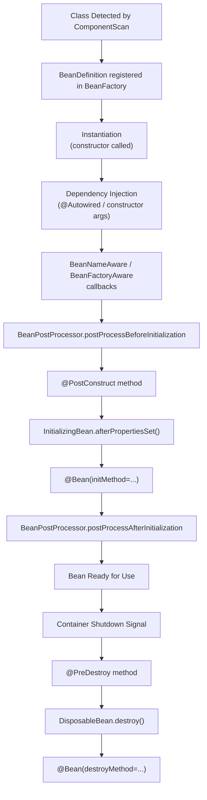
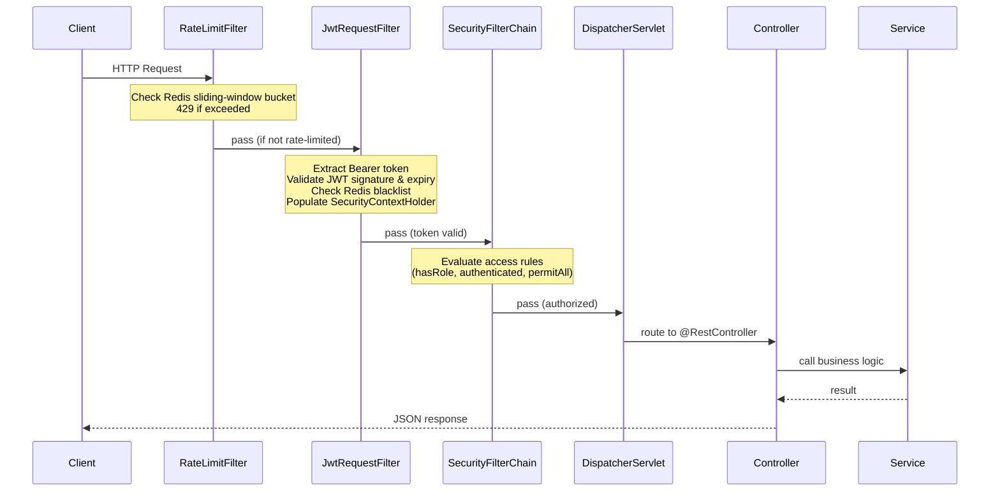

# Spring Boot Core — Interview Q&A

> **DevOps Suite context:** Spring Boot 3.x monolith, Java 21, package `com.devopssuite`.  
> All answers reference real classes and patterns from the codebase.

---

## Table of Contents
1. [Framework Fundamentals](#1-framework-fundamentals)
2. [Filter Chain & Request Pipeline](#2-filter-chain--request-pipeline)
3. [Spring Security](#3-spring-security)
4. [Spring Data JPA](#4-spring-data-jpa)
5. [Spring Events & Async](#5-spring-events--async)
6. [Spring Actuator & Micrometer](#6-spring-actuator--micrometer)
7. [Configuration](#7-configuration)
8. [Quick Reference](#quick-reference)

---

## 1. Framework Fundamentals

### Q1 — What does `@SpringBootApplication` do? 🟢

**Answer:**

`@SpringBootApplication` is a **convenience meta-annotation** that combines three annotations into one:

| Annotation | Role |
|---|---|
| `@Configuration` | Marks the class as a source of bean definitions (Java config) |
| `@EnableAutoConfiguration` | Activates Spring Boot's auto-configuration mechanism |
| `@ComponentScan` | Scans the package (and sub-packages) for `@Component`, `@Service`, `@Repository`, etc. |

```java
@SpringBootApplication   // ← all three in one
public class DevOpsSuiteApplication {
    public static void main(String[] args) {
        SpringApplication.run(DevOpsSuiteApplication.class, args);
    }
}
```

In DevOps Suite the root package is `com.devopssuite`, so every class annotated with a stereotype annotation under that package is auto-detected.

> [!NOTE]
> `@SpringBootApplication(exclude = {DataSourceAutoConfiguration.class})` can disable specific auto-configs without touching `application.yml`.

**Follow-up:** *What happens if two packages sit at the same level but outside the root?*  
They are **not** scanned by default. You must add `@ComponentScan(basePackages = {...})` or restructure the packages.

---

### Q2 — How does Spring Boot auto-configuration work? 🟡

**Answer:**

Auto-configuration is driven by `META-INF/spring/org.springframework.boot.autoconfigure.AutoConfiguration.imports` (Spring Boot 3.x; previously `spring.factories` in 2.x).

**Mechanism:**

```
ApplicationContext starts
        ↓
@EnableAutoConfiguration reads AutoConfiguration.imports
        ↓
Loads ~150 AutoConfiguration classes (e.g., DataSourceAutoConfiguration)
        ↓
Each class is guarded by conditional annotations
        ↓
Only those whose conditions pass are applied
```

**Key conditional annotations:**

| Annotation | Meaning |
|---|---|
| `@ConditionalOnClass` | Bean created only if a class is on the classpath |
| `@ConditionalOnMissingBean` | Bean created only if you haven't defined your own |
| `@ConditionalOnProperty` | Activated by a specific property value |
| `@ConditionalOnWebApplication` | Only in a web context |

**Example (Redis):** Because `spring-data-redis` is on the DevOps Suite classpath, `RedisAutoConfiguration` fires and creates a `RedisTemplate` — unless the project defines its own `RedisConfig`, which it does, making Spring's default back off via `@ConditionalOnMissingBean`.

> [!TIP]
> Run with `--debug` or set `logging.level.org.springframework.boot.autoconfigure=DEBUG` to see the "CONDITIONS EVALUATION REPORT" showing every passed/failed condition.

---

### Q3 — What is the Spring bean lifecycle? 🟡

**Answer:**



**DevOps Suite example — `ExecutionQueueWorker`:**
- **Constructor injection:** `DockerSandbox`, `ExecutionRepository` injected at instantiation.
- **`@PostConstruct`:** Starts the background polling thread (queue worker begins consuming jobs).
- **`@PreDestroy`:** Signals the worker thread to stop gracefully, draining in-flight executions.

```java
@Service
public class ExecutionQueueWorker {

    private final DockerSandbox dockerSandbox;
    private volatile boolean running = false;

    public ExecutionQueueWorker(DockerSandbox dockerSandbox) {
        this.dockerSandbox = dockerSandbox;   // constructor injection
    }

    @PostConstruct
    public void startWorker() {
        running = true;
        // start background thread
    }

    @PreDestroy
    public void stopWorker() {
        running = false;  // graceful shutdown
    }
}
```

---

### Q4 — Difference between `@Component`, `@Service`, `@Repository`, `@Controller`, `@RestController` 🟢

**Answer:**

All are specializations of `@Component` (detected by component scan), but each carries semantic meaning and some add extra behavior:

| Annotation | Semantic Role | Extra Behavior |
|---|---|---|
| `@Component` | Generic Spring-managed bean | None |
| `@Service` | Business logic layer | None (semantic only) |
| `@Repository` | Data access layer | **Exception translation** — converts JDBC/JPA exceptions to Spring `DataAccessException` hierarchy |
| `@Controller` | MVC web controller | Marks methods for `DispatcherServlet` routing |
| `@RestController` | REST API controller | `@Controller` + `@ResponseBody` on every method — serializes return values to JSON automatically |

**DevOps Suite mapping:**

```
NotificationEventListener  → @Component  (event-driven, not a service)
ExecutionService            → @Service    (orchestrates Docker runs)
ProjectRepository           → @Repository (JPA interface — Spring Data)
TaskController              → @RestController (REST API)
```

> [!NOTE]
> `@Repository` exception translation requires a `PersistenceExceptionTranslationPostProcessor` bean, which Spring Boot auto-registers.

---

### Q5 — Constructor injection vs field injection — why prefer constructor? 🟡

**Answer:**

**Field injection (`@Autowired` on field):**
```java
@Service
public class ExecutionService {
    @Autowired
    private DockerSandbox dockerSandbox;  // ❌ avoid
}
```

**Constructor injection (preferred):**
```java
@Service
public class ExecutionService {
    private final DockerSandbox dockerSandbox;  // ✅ final!

    public ExecutionService(DockerSandbox dockerSandbox) {
        this.dockerSandbox = dockerSandbox;
    }
}
```

**Why constructor injection is preferred:**

| Reason | Explanation |
|---|---|
| **Immutability** | Fields can be `final`; state cannot change post-construction |
| **Testability** | Dependencies can be injected directly in unit tests — no Spring context needed |
| **Fail-fast** | Missing dependency causes startup failure, not a runtime `NullPointerException` |
| **Circular dependency detection** | Spring detects cycles at startup instead of silently creating a proxy |
| **No reflection required** | Field injection uses reflection to set private fields, bypassing encapsulation |

In DevOps Suite, Spring Boot 3.x (with Lombok's `@RequiredArgsConstructor` or explicit constructors) uses constructor injection throughout.

---

### Q6 — What is `@Autowired(required=false)`? 🟡

**Answer:**

When `required=false`, Spring will **not throw** `NoSuchBeanDefinitionException` if the dependency cannot be found. The field is simply left `null`.

**Real usage in DevOps Suite — `EmailNotificationService`:**

```java
@Service
public class EmailNotificationService {

    @Autowired(required = false)
    private JavaMailSender mailSender;   // null if mail is not configured

    public void sendEmail(String to, String subject, String body) {
        if (mailSender == null) {
            log.warn("Mail sender not configured; skipping email to {}", to);
            return;
        }
        // send email
    }
}
```

`JavaMailSender` is only auto-configured when `spring.mail.*` properties are present. Without them, the bean doesn't exist and `required=false` prevents a startup crash — making email an **optional feature**.

> [!TIP]
> A cleaner modern alternative is `Optional<JavaMailSender>` injection or `@ConditionalOnBean` on the service itself.

---

## 2. Filter Chain & Request Pipeline

### Q7 — Filter vs Interceptor vs AOP — when to use each? 🟡

**Answer:**

| Aspect | Servlet Filter | Spring Interceptor | Spring AOP |
|---|---|---|---|
| **Layer** | Servlet container (pre-Spring) | Spring MVC DispatcherServlet | Spring proxy layer |
| **Scope** | All requests, including static | Only requests reaching `DispatcherServlet` | Method calls on Spring beans |
| **Access to** | Raw `HttpServletRequest/Response` | `HandlerMethod`, `ModelAndView` | Method args, return value, exceptions |
| **Use cases** | Auth, rate limiting, CORS, logging | Auth checks, locale, audit | Transactions, caching, metrics, security |
| **DevOps Suite use** | `RateLimitFilter`, `JwtRequestFilter` | — | `@Transactional`, `@PreAuthorize` |

**Key distinction:** Filters run **before** Spring knows which controller will handle the request; AOP runs **on bean method calls** after dispatch.

---

### Q8 — What is the full request processing order in DevOps Suite? 🔴

**Answer:**



**Filter ordering is explicit in DevOps Suite:**

```java
// RateLimitFilter — lowest order number = runs first
@Component
@Order(1)
public class RateLimitFilter extends OncePerRequestFilter { ... }

// JwtRequestFilter — runs second
@Component
@Order(2)
public class JwtRequestFilter extends OncePerRequestFilter { ... }
```

> [!IMPORTANT]
> Rate limiting must run **before** JWT validation. If an attacker floods the endpoint, we want to reject them cheaply at the Redis check — before spending CPU on JWT cryptographic verification.

---

### Q9 — What is `OncePerRequestFilter` and why extend it? 🟡

**Answer:**

`OncePerRequestFilter` is a Spring base class that guarantees `doFilterInternal()` is called **exactly once per request** — even in dispatcher scenarios where the request is forwarded internally (e.g., error dispatch, async dispatch).

**Without it (raw `Filter`):**
```
Client request → Filter.doFilter()
  → Internal forward (error page) → Filter.doFilter() AGAIN ← bug!
```

**With `OncePerRequestFilter`:**
```java
public class JwtRequestFilter extends OncePerRequestFilter {
    @Override
    protected void doFilterInternal(HttpServletRequest request,
                                    HttpServletResponse response,
                                    FilterChain filterChain)
            throws ServletException, IOException {
        // guaranteed to run once per logical request
        String token = extractBearer(request);
        if (token != null && jwtUtil.isValid(token)) {
            setAuthentication(token);
        }
        filterChain.doFilter(request, response);
    }
}
```

`OncePerRequestFilter` also provides `shouldNotFilter(HttpServletRequest)` — an override point used in DevOps Suite to skip JWT validation for `/auth/**` and `/ws/**` paths.

---

### Q10 — What is `FilterRegistrationBean`? 🟡

**Answer:**

`FilterRegistrationBean<T>` is a Spring Boot wrapper that registers a servlet filter with explicit configuration: URL patterns, order, and servlet names — without relying solely on `@Order` or `@WebFilter`.

```java
@Bean
public FilterRegistrationBean<RateLimitFilter> rateLimitRegistration(RateLimitFilter filter) {
    FilterRegistrationBean<RateLimitFilter> bean = new FilterRegistrationBean<>(filter);
    bean.setOrder(1);
    bean.addUrlPatterns("/api/*");   // only rate-limit API paths
    return bean;
}
```

> [!NOTE]
> If a filter is declared as a `@Component`, Spring Boot **automatically** registers it for all URLs. Use `FilterRegistrationBean` to restrict the URL pattern or prevent double-registration.

---

### Q11 — Global exception handling: `@RestControllerAdvice` 🟡

**Answer:**

`@RestControllerAdvice` = `@ControllerAdvice` + `@ResponseBody`. It defines a global exception handler visible to all `@RestController` classes.

```java
@RestControllerAdvice
public class GlobalExceptionHandler extends ResponseEntityExceptionHandler {

    @ExceptionHandler(ResourceNotFoundException.class)
    public ResponseEntity<ErrorResponse> handleNotFound(ResourceNotFoundException ex) {
        return ResponseEntity.status(404)
            .body(new ErrorResponse("NOT_FOUND", ex.getMessage()));
    }

    @ExceptionHandler(AccessDeniedException.class)
    public ResponseEntity<ErrorResponse> handleForbidden(AccessDeniedException ex) {
        return ResponseEntity.status(403)
            .body(new ErrorResponse("FORBIDDEN", "Insufficient permissions"));
    }

    @ExceptionHandler(RateLimitExceededException.class)
    public ResponseEntity<ErrorResponse> handleRateLimit(RateLimitExceededException ex) {
        return ResponseEntity.status(429)
            .body(new ErrorResponse("RATE_LIMITED", ex.getMessage()));
    }
}
```

`ResponseEntityExceptionHandler` (the base class) already handles Spring MVC standard exceptions like `MethodArgumentNotValidException` (400), `HttpMessageNotReadableException`, etc.

---

### Q12 — How does CORS work in Spring? 🟡

**Answer:**

CORS (Cross-Origin Resource Sharing) in DevOps Suite is configured at the Spring MVC level via `WebMvcConfigurer`:

```java
@Configuration
public class WebMvcConfig implements WebMvcConfigurer {
    @Override
    public void addCorsMappings(CorsRegistry registry) {
        registry.addMapping("/api/**")
            .allowedOrigins("http://localhost:5173", "http://localhost:80")
            .allowedMethods("GET", "POST", "PUT", "DELETE", "OPTIONS")
            .allowedHeaders("*")
            .allowCredentials(true)
            .maxAge(3600);
    }
}
```

**How it works:**
1. Browser sends a `OPTIONS` preflight request with `Origin` header.
2. Spring's `CorsFilter` (inserted into the filter chain automatically) checks the request against the registry.
3. If origin matches, Spring adds `Access-Control-Allow-Origin` response headers.
4. Browser receives the preflight response and proceeds with the actual request.

> [!IMPORTANT]
> When `allowCredentials(true)` is set, you **cannot** use `allowedOrigins("*")` — a specific origin must be listed. This matters for JWT cookie flows and WebSocket handshakes.

---

## 3. Spring Security

### Q13 — How is `SecurityConfig` structured? 🔴

**Answer:**

```java
@Configuration
@EnableWebSecurity
@EnableMethodSecurity   // enables @PreAuthorize, @PostAuthorize
public class SecurityConfig {

    @Bean
    public SecurityFilterChain filterChain(HttpSecurity http) throws Exception {
        http
            .csrf(csrf -> csrf.disable())          // stateless JWT — no CSRF needed
            .sessionManagement(session -> session
                .sessionCreationPolicy(SessionCreationPolicy.STATELESS))  // no server sessions
            .authorizeHttpRequests(auth -> auth
                .requestMatchers("/auth/**").permitAll()
                .requestMatchers("/actuator/health").permitAll()
                .requestMatchers("/ws/**").permitAll()
                .requestMatchers("/api/metrics/dashboard").hasRole("ADMIN")
                .requestMatchers("/api/admin/users/**").hasRole("ADMIN")
                .anyRequest().authenticated()
            )
            .addFilterBefore(jwtRequestFilter, UsernamePasswordAuthenticationFilter.class)
            .oauth2Login(oauth2 -> oauth2
                .successHandler(oAuth2SuccessHandler));

        return http.build();
    }
}
```

**Key decisions:**

| Decision | Reason |
|---|---|
| `csrf().disable()` | JWT in `Authorization` header is CSRF-safe (not in cookies by default) |
| `STATELESS` session | JWTs carry all auth state; no `HttpSession` needed |
| `addFilterBefore` | JWT filter runs before Spring's default auth filter |
| `@EnableMethodSecurity` | Enables `@PreAuthorize("hasRole('ADMIN')")` on controller methods |

---

### Q14 — What is `SecurityContextHolder` and how does `JwtRequestFilter` populate it? 🔴

**Answer:**

`SecurityContextHolder` is a **thread-local store** that holds the `SecurityContext` for the current thread. Spring Security reads from it throughout the request lifecycle to determine who is authenticated and what roles they have.

**`JwtRequestFilter` population flow:**

```java
@Component
public class JwtRequestFilter extends OncePerRequestFilter {

    @Override
    protected void doFilterInternal(HttpServletRequest request,
                                    HttpServletResponse response,
                                    FilterChain chain) throws ServletException, IOException {

        String header = request.getHeader("Authorization");

        if (header != null && header.startsWith("Bearer ")) {
            String token = header.substring(7);

            // 1. Validate signature & expiry
            if (jwtUtil.isTokenValid(token)) {

                // 2. Check Redis blacklist (logout check)
                if (!redisService.isBlacklisted(token)) {

                    // 3. Extract claims
                    String username = jwtUtil.extractUsername(token);
                    List<String> roles = jwtUtil.extractRoles(token);

                    // 4. Build authentication object
                    UsernamePasswordAuthenticationToken auth =
                        new UsernamePasswordAuthenticationToken(
                            username,
                            null,
                            roles.stream().map(SimpleGrantedAuthority::new).toList()
                        );

                    // 5. Store in SecurityContextHolder
                    SecurityContextHolder.getContext().setAuthentication(auth);
                }
            }
        }

        chain.doFilter(request, response);

        // 6. Clear after request (thread reuse safety)
        SecurityContextHolder.clearContext();
    }
}
```

> [!CAUTION]
> Always call `SecurityContextHolder.clearContext()` after the filter chain — Spring Security does this automatically in `SecurityContextPersistenceFilter` for session-based auth, but for stateless JWT you must ensure no stale auth leaks to the next request if threads are reused.

---

### Q15 — What is `UsernamePasswordAuthenticationToken`? 🟡

**Answer:**

`UsernamePasswordAuthenticationToken` implements the `Authentication` interface. It has **two forms**:

| Form | Constructor | Authenticated? | Use case |
|---|---|---|---|
| **Unauthenticated** | `(principal, credentials)` | `false` | Submitted credentials before verification |
| **Authenticated** | `(principal, credentials, authorities)` | `true` | After successful verification |

In `JwtRequestFilter`, the **3-arg constructor** (authenticated form) is used because the JWT has already been verified — there's no need to run credentials through `AuthenticationManager` again.

```java
// Authenticated form — 3 args, isAuthenticated() == true
new UsernamePasswordAuthenticationToken(username, null, grantedAuthorities);
```

The `null` in the credentials position is intentional — the password is not needed after JWT validation and should not be stored in memory.

---

### Q16 — What paths are permitted vs restricted in DevOps Suite? 🟢

**Answer:**

| Pattern | Access Rule | Reason |
|---|---|---|
| `/auth/**` | `permitAll()` | Login, register, token refresh — must be unauthenticated |
| `/actuator/health` | `permitAll()` | Docker health checks, load balancer probes |
| `/ws/**` | `permitAll()` | WebSocket handshake (auth done in `StompAuthChannelInterceptor`) |
| `/api/metrics/dashboard` | `hasRole("ADMIN")` | Prometheus/Grafana summary — admin only |
| `/api/admin/users/**` | `hasRole("ADMIN")` | User management endpoints |
| Everything else | `authenticated()` | Requires valid JWT |

> [!NOTE]
> WebSocket paths are permitted at the HTTP level because the SockJS handshake is a regular HTTP upgrade. Authentication is enforced **at the STOMP protocol level** inside `StompAuthChannelInterceptor`, which validates the JWT passed in the STOMP `CONNECT` frame headers.

---

### Q17 — How does `@PreAuthorize` / `hasRole()` work? 🔴

**Answer:**

`@PreAuthorize` is powered by **Spring Security's method security AOP**. When `@EnableMethodSecurity` is on, Spring wraps annotated beans with a proxy. Before the method executes, the proxy evaluates the SpEL expression against the current `SecurityContext`.

```java
@RestController
@RequestMapping("/api/projects")
public class ProjectController {

    @PreAuthorize("hasRole('ADMIN') or @projectSecurityService.isMember(#projectId, authentication.name)")
    @GetMapping("/{projectId}")
    public ProjectDTO getProject(@PathVariable Long projectId) { ... }
}
```

**How `hasRole("ADMIN")` differs from `hasAuthority("ROLE_ADMIN")`:**

| Method | Matches |
|---|---|
| `hasRole("ADMIN")` | `ROLE_ADMIN` (auto-prefixes `ROLE_`) |
| `hasAuthority("ROLE_ADMIN")` | Exact string match |

In DevOps Suite, the RBAC system stores roles as `ROLE_OWNER`, `ROLE_ADMIN`, `ROLE_MEMBER`, `ROLE_VIEWER` in the JWT claims, and `hasRole("ADMIN")` matches `ROLE_ADMIN`.

---

## 4. Spring Data JPA

### Q18 — JpaRepository vs CrudRepository vs PagingAndSortingRepository 🟢

**Answer:**

```
CrudRepository<T, ID>
    ↑  (extends)
PagingAndSortingRepository<T, ID>
    ↑  (extends)
JpaRepository<T, ID>
```

| Repository | Adds |
|---|---|
| `CrudRepository` | `save`, `findById`, `findAll`, `delete`, `count`, `existsById` |
| `PagingAndSortingRepository` | `findAll(Pageable)`, `findAll(Sort)` |
| `JpaRepository` | `saveAll`, `flush`, `saveAndFlush`, `deleteAllInBatch`, `getOne`/`getReferenceById` |

**DevOps Suite:** All repositories extend `JpaRepository` — e.g., `ProjectRepository`, `TaskRepository`, `ExecutionRepository` — giving access to pagination for large task lists and batch operations.

```java
public interface TaskRepository extends JpaRepository<Task, Long> {
    List<Task> findByProjectIdAndStatus(Long projectId, TaskStatus status);
    Page<Task> findByProjectId(Long projectId, Pageable pageable);
}
```

---

### Q19 — What are `@Entity`, `@Table`, `@Id`, `@GeneratedValue(strategy=IDENTITY)`? 🟢

**Answer:**

```java
@Entity                          // marks class as a JPA entity (maps to a DB table)
@Table(name = "tasks")           // explicit table name (optional if matches class name)
public class Task {

    @Id                          // marks primary key field
    @GeneratedValue(strategy = GenerationType.IDENTITY)  // DB auto-increment
    private Long id;

    @Column(nullable = false, length = 255)
    private String title;
}
```

**`GenerationType` options:**

| Strategy | Mechanism | Use When |
|---|---|---|
| `IDENTITY` | DB auto-increment column | PostgreSQL SERIAL / BIGSERIAL |
| `SEQUENCE` | DB sequence object | Oracle, PostgreSQL (can batch) |
| `TABLE` | Separate key table | Portable but slow |
| `AUTO` | JPA picks based on DB | Development only |

DevOps Suite uses `IDENTITY` exclusively with PostgreSQL's `BIGSERIAL` type, consistent with Flyway migrations (V1–V16 all use `BIGSERIAL` PKs).

---

### Q20 — `@OneToMany`, `@ManyToOne`, cascade types 🟡

**Answer:**

```java
@Entity
public class Project {

    @OneToMany(mappedBy = "project", cascade = CascadeType.ALL, orphanRemoval = true)
    private List<Task> tasks = new ArrayList<>();
}

@Entity
public class Task {

    @ManyToOne(fetch = FetchType.LAZY)
    @JoinColumn(name = "project_id", nullable = false)
    private Project project;
}
```

**Cascade types:**

| Type | Effect |
|---|---|
| `PERSIST` | Save child when parent is saved |
| `MERGE` | Update child when parent is merged |
| `REMOVE` | Delete child when parent is deleted |
| `REFRESH` | Reload child when parent is refreshed |
| `DETACH` | Detach child when parent is detached |
| `ALL` | All of the above |

`orphanRemoval = true` goes further than `REMOVE` — if a child is **removed from the collection** (not just when the parent is deleted), the child entity is also deleted.

---

### Q21 — Lazy vs Eager loading — `LazyInitializationException` 🔴

**Answer:**

| Fetch Type | Behavior | Default for |
|---|---|---|
| `LAZY` | Loads associated entity on first access | `@OneToMany`, `@ManyToMany` |
| `EAGER` | Loads associated entity in the same query | `@ManyToOne`, `@OneToOne` |

**`LazyInitializationException`** occurs when a lazily-loaded association is accessed **outside** an open Hibernate session (i.e., after the transaction ends).

**Classic pitfall in DevOps Suite:**
```java
@Service
public class ProjectService {
    @Transactional
    public Project getProject(Long id) {
        return projectRepository.findById(id).orElseThrow();
        // transaction ends here when method returns
    }
}

// In controller:
Project project = projectService.getProject(1L);
project.getTasks().size();   // ❌ LazyInitializationException — session already closed
```

**Solutions:**

```java
// Option 1: Access within @Transactional boundary
@Transactional
public ProjectDTO getProjectWithTasks(Long id) {
    Project p = projectRepository.findById(id).orElseThrow();
    p.getTasks().size();   // triggers load while session is open
    return mapper.toDTO(p);
}

// Option 2: JPQL JOIN FETCH
@Query("SELECT p FROM Project p JOIN FETCH p.tasks WHERE p.id = :id")
Optional<Project> findByIdWithTasks(@Param("id") Long id);

// Option 3: @EntityGraph
@EntityGraph(attributePaths = {"tasks"})
Optional<Project> findById(Long id);
```

> [!WARNING]
> **Never** use `spring.jpa.open-in-view=true` (Open Session in View) to "solve" this — it keeps the DB session open for the entire HTTP request, including view rendering, leading to unpredictable transaction behavior and connection pool exhaustion under load. DevOps Suite has it disabled.

---

### Q22 — The N+1 problem 🔴

**Answer:**

N+1 occurs when fetching N parent entities triggers N additional queries to load a child association — instead of a single JOIN.

**Example:**
```java
List<Project> projects = projectRepository.findAll();   // 1 query
for (Project p : projects) {
    System.out.println(p.getTasks().size());   // N queries (one per project)
}
// Total: 1 + N queries
```

**Detection:** Enable SQL logging:
```yaml
spring:
  jpa:
    show-sql: true
    properties:
      hibernate:
        format_sql: true
```

**Solutions in DevOps Suite:**

```java
// JOIN FETCH in JPQL
@Query("SELECT p FROM Project p LEFT JOIN FETCH p.tasks")
List<Project> findAllWithTasks();

// @EntityGraph (Spring Data)
@EntityGraph(attributePaths = {"tasks", "members"})
List<Project> findByOwnerId(Long ownerId);

// @BatchSize (Hibernate-specific — loads in batches of N)
@OneToMany(mappedBy = "project", fetch = FetchType.LAZY)
@BatchSize(size = 25)
private List<Task> tasks;
```

> [!TIP]
> `JOIN FETCH` causes an **in-memory Cartesian product** if multiple collections are fetched simultaneously. Prefer `@EntityGraph` for single collections and `@BatchSize` for multiple.

---

### Q23 — `@Transactional`: proxy-based, self-invocation pitfall 🔴

**Answer:**

Spring's `@Transactional` works via **AOP proxy**. When you call `service.method()` from outside, the call goes through the proxy which opens/commits/rolls back the transaction. When a method calls **another method on the same class** (self-invocation), the proxy is **bypassed** and the inner method's `@Transactional` annotation is **ignored**.

```java
@Service
public class ExecutionService {

    @Transactional
    public void runExecution(Long id) {
        // ... setup
        this.saveResult(id);   // ❌ self-invocation — @Transactional on saveResult is IGNORED
    }

    @Transactional(propagation = Propagation.REQUIRES_NEW)
    public void saveResult(Long id) { ... }
}
```

**Fix options:**

1. **Inject self:** `@Autowired ExecutionService self;` then call `self.saveResult(id)` — ugly but works.
2. **Extract to separate service:** Move `saveResult` to a `ExecutionResultService` — cleanest approach.
3. **AspectJ mode:** Use compile-time or load-time weaving (heavy; rarely used).

**Propagation types:**

| Propagation | Behavior |
|---|---|
| `REQUIRED` (default) | Join existing transaction; create if none |
| `REQUIRES_NEW` | Always create new transaction; suspend existing |
| `NESTED` | Savepoint within existing transaction |
| `NOT_SUPPORTED` | Suspend existing transaction; run non-transactionally |
| `NEVER` | Throw if transaction exists |

---

## 5. Spring Events & Async

### Q24 — `ApplicationEventPublisher` and `@EventListener` 🟡

**Answer:**

Spring's event system is a lightweight **in-process pub/sub** mechanism. Any bean can publish events; any bean can listen.

**Publisher (in DevOps Suite — task assignment):**
```java
@Service
public class TaskService {

    private final ApplicationEventPublisher eventPublisher;

    public TaskService(ApplicationEventPublisher eventPublisher) {
        this.eventPublisher = eventPublisher;
    }

    @Transactional
    public void assignTask(Long taskId, Long userId) {
        Task task = taskRepository.findById(taskId).orElseThrow();
        task.setAssignee(userRepository.getReferenceById(userId));
        taskRepository.save(task);

        // Publish event — listener handles notification asynchronously
        eventPublisher.publishEvent(new TaskAssignedEvent(this, taskId, userId));
    }
}
```

**Listener (`NotificationEventListener.java`):**
```java
@Component
public class NotificationEventListener {

    @EventListener
    @Async
    public void handleTaskAssigned(TaskAssignedEvent event) {
        // Create DB notification record
        notificationRepository.save(new Notification(...));
        // Push via WebSocket
        messagingTemplate.convertAndSend(
            "/topic/notifications/" + event.getUserId(),
            notificationDTO
        );
    }
}
```

---

### Q25 — `@Async` — thread pool, `@EnableAsync`, `CompletableFuture` 🟡

**Answer:**

`@Async` offloads method execution to a **separate thread pool**. Spring Boot auto-configures a `SimpleAsyncTaskExecutor` by default, but DevOps Suite configures a proper `ThreadPoolTaskExecutor`:

```java
@Configuration
@EnableAsync   // required to activate @Async
public class AsyncConfig {

    @Bean("notificationExecutor")
    public Executor notificationExecutor() {
        ThreadPoolTaskExecutor executor = new ThreadPoolTaskExecutor();
        executor.setCorePoolSize(4);
        executor.setMaxPoolSize(10);
        executor.setQueueCapacity(100);
        executor.setThreadNamePrefix("notification-");
        executor.initialize();
        return executor;
    }
}

// Usage:
@Async("notificationExecutor")
public void handleTaskAssigned(TaskAssignedEvent event) { ... }
```

**`CompletableFuture` with `@Async`:**
```java
@Async
public CompletableFuture<ExecutionResult> runCodeAsync(ExecutionRequest req) {
    ExecutionResult result = dockerSandbox.run(req);
    return CompletableFuture.completedFuture(result);
}
```

> [!WARNING]
> `@Async` methods must be in a **different class** than the caller. Self-invocation bypasses the proxy just like `@Transactional`.

---

### Q26 — `@TransactionalEventListener(phase=AFTER_COMMIT)` 🔴

**Answer:**

`@TransactionalEventListener` defers event handling to a specific **transaction phase**:

| Phase | When listener fires |
|---|---|
| `AFTER_COMMIT` | After the publishing transaction commits successfully |
| `AFTER_ROLLBACK` | After rollback |
| `AFTER_COMPLETION` | After commit or rollback |
| `BEFORE_COMMIT` | Just before commit |

**Why it matters for notifications:**

```java
// Without @TransactionalEventListener:
@Transactional
public void assignTask(...) {
    taskRepository.save(task);
    eventPublisher.publishEvent(event);  // fires DURING transaction
    // If the transaction rolls back after this point,
    // the WebSocket notification was already sent — data inconsistency!
}

// With @TransactionalEventListener(phase = AFTER_COMMIT):
@TransactionalEventListener(phase = TransactionPhase.AFTER_COMMIT)
@Async
public void handleTaskAssigned(TaskAssignedEvent event) {
    // Only fires if the task was actually saved and committed
    // Safe to notify users now
    messagingTemplate.convertAndSend("/topic/notifications/...", dto);
}
```

This ensures WebSocket notifications are sent **only when the data is durably persisted** — preventing phantom notifications for rolled-back operations.

---

### Q27 — Why Spring Events instead of Kafka in DevOps Suite? 🟡

**Answer:**

| Dimension | Spring Events | Apache Kafka |
|---|---|---|
| **Complexity** | Zero extra infrastructure | Requires Kafka brokers, Zookeeper/KRaft |
| **Latency** | In-process, microseconds | Network round-trip, milliseconds |
| **Durability** | Ephemeral (lost if app crashes mid-processing) | Durable, replay-able |
| **Scale** | Single JVM only | Multi-service, horizontal |
| **Ordering** | Guaranteed (same thread / `@Async` pool) | Partition-level ordering |
| **Monitoring** | None built-in | Consumer lag, offset tracking |

**DevOps Suite rationale:**
- It's a **monolith** — all components share the same JVM process.
- Notification volume is low (task/project events, not stream data).
- Losing an in-flight notification on crash is acceptable (user can refresh).
- Zero-infrastructure overhead was the right trade-off for a productivity tool.
- Kafka would add operational burden without tangible benefit at current scale.

> [!NOTE]
> If DevOps Suite were decomposed into microservices (e.g., separate notification service), Kafka or RabbitMQ would become necessary to cross service boundaries.

---

## 6. Spring Actuator & Micrometer

### Q28 — What endpoints are exposed and how is access controlled? 🟢

**Answer:**

DevOps Suite exposes a minimal set of Actuator endpoints:

```yaml
management:
  endpoints:
    web:
      exposure:
        include: health, prometheus
  endpoint:
    health:
      show-details: when-authorized
  server:
    port: 8081   # Actuator on internal port only
```

| Endpoint | URL | Access |
|---|---|---|
| `/actuator/health` | Health check | Public (load balancer / Docker healthcheck) |
| `/actuator/prometheus` | Metrics scrape | Internal port 8081 (not exposed to host) |

Prometheus scrapes `http://backend:8081/actuator/prometheus` from within the `observability` Docker network — the host never sees it directly.

---

### Q29 — What is Micrometer and what metric types does it provide? 🟡

**Answer:**

**Micrometer** is a vendor-neutral metrics facade (analogous to SLF4J for logging). Spring Boot auto-configures it; you inject `MeterRegistry` to record metrics that are exported to Prometheus (or any other backend).

**Core metric types:**

| Type | Description | Example |
|---|---|---|
| `Counter` | Monotonically increasing count | Total executions, total errors |
| `Gauge` | Point-in-time value (can go up/down) | Active users, queue depth |
| `Timer` | Latency + throughput distribution | HTTP request duration |
| `DistributionSummary` | Distribution of values | Response payload sizes |

```java
// Counter
Counter.builder("devopssuite.code.executions.total")
    .tag("language", language)
    .tag("status", status)
    .register(meterRegistry)
    .increment();

// Gauge (registered once; Supplier called on each scrape)
Gauge.builder("devopssuite.active.users", userSessionMap, Map::size)
    .register(meterRegistry);
```

---

### Q30 — Custom metrics in `AppMetrics.java` 🔴

**Answer:**

`AppMetrics.java` is a `@Component` that centralises all custom Micrometer metric registrations for DevOps Suite:

| Metric Name | Type | Tags | Meaning |
|---|---|---|---|
| `devopssuite_code_executions_total` | Counter | `language`, `status` (success/failure/timeout) | Total code executions by language and outcome |
| `devopssuite_task_operations_total` | Counter | `operation` (create/update/complete/delete) | Task lifecycle tracking |
| `devopssuite_active_users` | Gauge | — | Current authenticated sessions (from Redis) |
| `devopssuite_cache_hits_total` | Counter | `cache` (user/project) | Redis cache hit count |
| `devopssuite_cache_misses_total` | Counter | `cache` (user/project) | Redis cache miss count — triggers DB fetch |
| `devopssuite_rate_limit_blocked_total` | Counter | `tier` (free/pro/enterprise) | Rate-limited requests blocked by `RateLimitFilter` |

**Cache hit ratio alert logic (Grafana):**
```
(devopssuite_cache_hits_total) /
(devopssuite_cache_hits_total + devopssuite_cache_misses_total) < 0.8
→ alert: "Cache efficiency below 80%"
```

```java
@Component
public class AppMetrics {

    private final MeterRegistry registry;

    public AppMetrics(MeterRegistry registry) {
        this.registry = registry;
    }

    public void recordExecution(String language, String status) {
        registry.counter("devopssuite.code.executions.total",
            "language", language,
            "status", status
        ).increment();
    }

    public void recordRateLimitBlocked(String tier) {
        registry.counter("devopssuite.rate.limit.blocked.total",
            "tier", tier
        ).increment();
    }
}
```

---

## 7. Configuration

### Q31 — `@Value` vs `@ConfigurationProperties` 🟡

**Answer:**

| Feature | `@Value` | `@ConfigurationProperties` |
|---|---|---|
| **Binding style** | Single value per field | Whole prefix to a POJO |
| **Type safety** | Limited (SpEL) | Full (type conversion, validation) |
| **IDE support** | Basic | Full autocompletion with `spring-boot-configuration-processor` |
| **Validation** | Manual | `@Validated` + Bean Validation annotations |
| **Relaxed binding** | No | Yes (camelCase ↔ kebab-case ↔ SCREAMING_SNAKE) |

**`@Value` usage (simple scalars):**
```java
@Value("${jwt.secret}")
private String jwtSecret;

@Value("${rate-limit.execution.max:10}")   // with default
private int maxExecutions;
```

**`@ConfigurationProperties` usage (structured config):**
```java
@ConfigurationProperties(prefix = "rate-limit")
@Validated
public record RateLimitProperties(
    @Min(1) int executionMax,
    @Min(1) int apiMax,
    @Min(1) int windowSeconds
) {}
```

```yaml
rate-limit:
  execution-max: 10    # binds to executionMax
  api-max: 100
  window-seconds: 60
```

---

### Q32 — Environment variable binding (SCREAMING_SNAKE_CASE → camelCase) 🟡

**Answer:**

Spring Boot's **relaxed binding** maps environment variables to property names automatically:

| Environment Variable | Property Key | Field Name |
|---|---|---|
| `JWT_SECRET` | `jwt.secret` | `jwtSecret` |
| `DB_URL` | `db.url` (or `spring.datasource.url`) | — |
| `REDIS_HOST` | `redis.host` | `redisHost` |
| `RATE_LIMIT_EXECUTION_MAX` | `rate-limit.execution-max` | `executionMax` |

**`docker-compose.yml` injection:**
```yaml
services:
  backend:
    environment:
      - JWT_SECRET=${JWT_SECRET}
      - DB_URL=jdbc:postgresql://postgres:5432/devopssuite
      - REDIS_HOST=redis
      - RATE_LIMIT_EXECUTION_MAX=10
```

**Binding precedence (highest → lowest):**
1. Command-line arguments (`--spring.datasource.url=...`)
2. `SPRING_APPLICATION_JSON` environment variable
3. OS environment variables (`DB_URL`)
4. `application.yml` / `application.properties`
5. Default values (`@Value("${x:default}")`)

> [!IMPORTANT]
> For secrets (JWT_SECRET, DB passwords), **never** hardcode in `application.yml`. Use environment variables injected from Docker secrets, Kubernetes Secrets, or a secrets manager.

---

### Q33 — Key environment variables in DevOps Suite 🟢

**Answer:**

| Variable | Used By | Purpose |
|---|---|---|
| `JWT_SECRET` | `JwtUtil` | HMAC-SHA256 signing key for JWT tokens |
| `JWT_ACCESS_EXPIRATION` | `JwtUtil` | Access token TTL (default: 3600s = 1h) |
| `JWT_REFRESH_EXPIRATION` | `JwtUtil` | Refresh token TTL (default: 604800s = 7d) |
| `DB_URL` | `DataSourceAutoConfiguration` | PostgreSQL JDBC URL |
| `DB_USERNAME` | `DataSourceAutoConfiguration` | Database user |
| `DB_PASSWORD` | `DataSourceAutoConfiguration` | Database password |
| `REDIS_HOST` | `RedisConfig` | Redis server hostname |
| `REDIS_PORT` | `RedisConfig` | Redis port (default: 6379) |
| `RATE_LIMIT_EXECUTION_MAX` | `RateLimitFilter` | Max code executions per window per user |
| `ELASTICSEARCH_HOST` | `ElasticsearchConfig` | ES cluster URL for log ingestion |
| `GOOGLE_CLIENT_ID` | `SecurityConfig` (OAuth2) | Google OAuth2 application ID |
| `GITHUB_CLIENT_ID` | `SecurityConfig` (OAuth2) | GitHub OAuth2 application ID |

---

### Q34 — `application.yml` structure overview 🟢

**Answer:**

```yaml
spring:
  datasource:
    url: ${DB_URL}
    username: ${DB_USERNAME}
    password: ${DB_PASSWORD}
    driver-class-name: org.postgresql.Driver
  jpa:
    hibernate:
      ddl-auto: validate          # Flyway manages schema; Hibernate only validates
    open-in-view: false           # disabled — prevent OSIV anti-pattern
    show-sql: false
  flyway:
    enabled: true
    locations: classpath:db/migration
  data:
    redis:
      host: ${REDIS_HOST}
      port: ${REDIS_PORT:6379}
  security:
    oauth2:
      client:
        registration:
          google:
            client-id: ${GOOGLE_CLIENT_ID}
          github:
            client-id: ${GITHUB_CLIENT_ID}

jwt:
  secret: ${JWT_SECRET}
  access-expiration: ${JWT_ACCESS_EXPIRATION:3600}
  refresh-expiration: ${JWT_REFRESH_EXPIRATION:604800}

rate-limit:
  execution-max: ${RATE_LIMIT_EXECUTION_MAX:10}
  api-max: 100
  window-seconds: 60

management:
  endpoints:
    web:
      exposure:
        include: health, prometheus
  server:
    port: 8081

server:
  port: 8081

elasticsearch:
  host: ${ELASTICSEARCH_HOST:http://elasticsearch:9200}
```

---

## Quick Reference

### Bean Lifecycle Cheat Sheet

```
Constructor → @Autowired → @PostConstruct → [use] → @PreDestroy
```

### Filter Chain Order

```
RateLimitFilter (Order=1) → JwtRequestFilter (Order=2) → SecurityFilterChain → Controller
```

### Security Path Rules

| Pattern | Rule |
|---|---|
| `/auth/**`, `/actuator/health`, `/ws/**` | `permitAll()` |
| `/api/metrics/dashboard`, `/api/admin/users/**` | `hasRole("ADMIN")` |
| Everything else | `authenticated()` |

### Transaction Pitfalls

| Pitfall | Fix |
|---|---|
| Self-invocation ignores `@Transactional` | Extract to another bean |
| Lazy access outside session | `JOIN FETCH`, `@EntityGraph`, or access inside `@Transactional` |
| Open Session in View | Keep `open-in-view: false` |

### Custom Metrics Summary

| Metric | Type |
|---|---|
| `devopssuite_code_executions_total` | Counter |
| `devopssuite_task_operations_total` | Counter |
| `devopssuite_active_users` | Gauge |
| `devopssuite_cache_hits_total` / `..._misses_total` | Counter |
| `devopssuite_rate_limit_blocked_total` | Counter |

### `@Value` vs `@ConfigurationProperties`

| Scenario | Use |
|---|---|
| Single scalar property | `@Value("${property}")` |
| Group of related properties | `@ConfigurationProperties(prefix="x")` |
| Need validation | `@ConfigurationProperties` + `@Validated` |

### Key Classes by Concern

| Concern | Class |
|---|---|
| Auth filter | `JwtRequestFilter.java` |
| Rate limiting | `RateLimitFilter.java` |
| Security rules | `SecurityConfig.java` |
| Async notifications | `NotificationEventListener.java` |
| Custom metrics | `AppMetrics.java` |
| Docker code execution | `DockerSandbox.java`, `ExecutionQueueWorker.java` |
| Log ingestion | `ElasticsearchLogService.java` |
| WebSocket auth | `StompAuthChannelInterceptor.java` |
