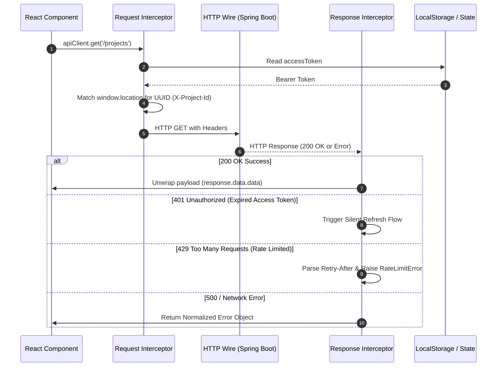
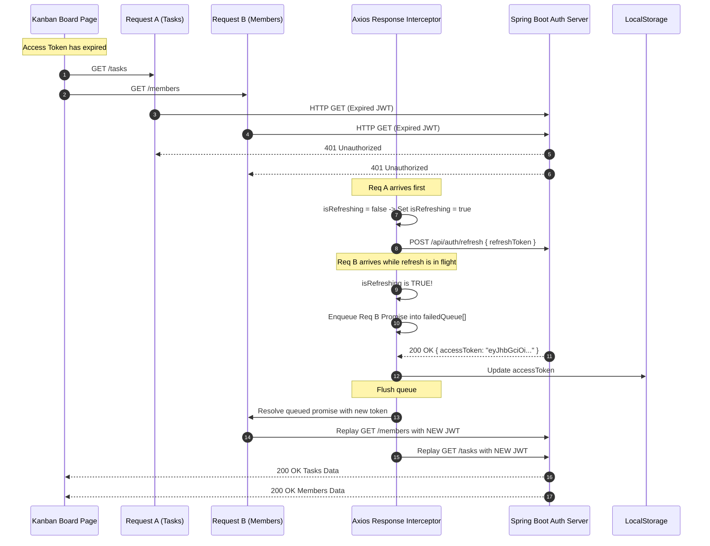

# DevOps Suite — Frontend API Layer Architecture & Interview Knowledge Base

> **Document Scope:** Exhaustive deep dive into Axios client architecture, interceptors pipeline, silent token refresh queues, correlation header injection, error normalization, and real-world system design interview questions for the full-stack **DevOps Suite** platform.

---

## 1. Executive Summary & Architecture Overview

In **DevOps Suite**, frontend network communication is strictly governed through a unified, centralized HTTP abstraction powered by **Axios** (`frontend/src/api/client.js`). Rather than scattering raw `fetch` or uncontrolled `axios` calls across React components, all backend requests traverse a layered pipeline:

```
[ React Components / Custom Hooks ]
                │
                ▼
[ Specialized API Modules (authApi, projectApi, taskApi, etc.) ]
                │
                ▼
[ Centralized Axios Client (client.js) ]
       │                         ▲
       ▼                         │
 [ Request Interceptors ]  [ Response Interceptors ]
   - Bearer Token Auth       - Envelope Unwrapping
   - X-Project-Id Context    - 401 Silent Token Refresh & Request Queue
   - Content-Type Headers    - 429 Rate Limit Backoff Extraction
   - Correlation IDs         - Normalized Standard Error Objects
                │                         ▲
                └───────► Network ────────┘
                             │
                             ▼
                 [ Spring Boot Monolith ]
                 (Port 8081 / Host: 8082)
```

### Architectural Guarantees
1. **Single Source of Truth:** A single configured instance (`apiClient`) with uniform timeouts (30s default, 60s for file uploads/avatars) and base URL configuration.
2. **Context-Aware Correlation:** Injects `X-Project-Id` automatically from URL path matching (`/projects/{uuid}/...`) to maintain log and audit traceability across PostgreSQL, Elasticsearch, and STOMP channels.
3. **Transparent Resilience:** Mid-session JWT expiration is intercepted on HTTP 401, locking parallel requests into a FIFO promise queue while calling `/api/auth/refresh`, and seamlessly retrying blocked operations once new credentials arrive.
4. **Resilient Rate Limit Handling:** HTTP 429 responses from Spring Boot / Redis sliding-window filter are intercepted, inspecting `Retry-After` headers and bubbling structured backoff metadata to the UI.
5. **Decoupled Business Logic:** 13+ domain-specific API clients wrap endpoints with normalized DTO transformations (e.g., camelCase conversion for critical WebSocket topic IDs), shielding UI components from backend schema evolution.

---

## 2. Centralized Axios Architecture

### 2.1 Base Configuration (`frontend/src/api/client.js`)

The core Axios instance is instantiated with environment-aware baseURL fallback:

```javascript
import axios from 'axios';

// Vite environment variable with local container port fallback
const API_BASE_URL = import.meta.env.VITE_API_URL || '/api';

const apiClient = axios.create({
  baseURL: API_BASE_URL,
  timeout: 30000, // 30-second default timeout
  headers: {
    'Content-Type': 'application/json',
  },
});
```

* **Vite Dev Server:** `VITE_API_URL` points directly to `http://localhost:8082/api` during local development or leverages Vite's proxy `/api` pointing to backend `8082`.
* **Production Container:** Nginx serves the static React build on port 80 and reverse-proxies `/api/` directly to `http://backend:8081/api`.

### 2.2 Project UUID Context Matching

DevOps Suite incorporates automated route inspection using a compiled regular expression:

```javascript
// Regex to extract a project UUID from the current page URL path
// Matches /projects/{uuid}/... routes
const PROJECT_UUID_RE = /\/projects\/([0-9a-f]{8}-[0-9a-f]{4}-[0-9a-f]{4}-[0-9a-f]{4}-[0-9a-f]{12})/i;
```

When an engineer navigates to `/projects/e4b95f12-9c12-4e9b-b6d1-81fba69c719e/boards`, any subsequent API call (even global endpoints like notifications or user activity) automatically propagates `X-Project-Id: e4b95f12-9c12-4e9b-b6d1-81fba69c719e`. The backend `MDCFilter` and `RateLimitFilter` extract this header for project-scoped Redis buckets and Elasticsearch log indexing.

### 2.3 The 13 Dedicated API Client Modules

DevOps Suite strictly isolates backend API boundaries into domain modules under `frontend/src/api/`:

| Module | Core Endpoints Handled | Special Responsibilities |
| :--- | :--- | :--- |
| **`authApi.js`** | `/auth/login`, `/auth/register`, `/auth/refresh`, `/auth/logout`, `/auth/me`, `/auth/google`, `/auth/github` | Normalizes backend snake_case (`user_id`, `display_name`) to camelCase (`userId`, `displayName`) for STOMP topic subscriptions; multipart avatar upload. |
| **`adminApi.js`** | `/admin/users`, `/admin/users/{id}/tasks`, `/admin/users/{id}/logs` | Admin portal user management, system audit queries, and operational telemetry. |
| **`projectApi.js`** | `/projects`, `/projects/{id}`, `/projects/{id}/members`, `/projects/{id}/boards` | Project CRUD, membership management, polymorphic role assignments (OWNER, ADMIN, MEMBER, VIEWER). |
| **`taskApi.js`** | `/tasks`, `/tasks/{id}`, `/tasks/{id}/status`, `/tasks/{id}/duplicate`, `/tasks/{id}/history` | Kanban task lifecycle, status transitions, audit history, optimistic drag-and-drop support. |
| **`codeExecutionApi.js`**| `/code-execution/run`, `/code-execution/{id}`, `/code-execution/history`, `/code-execution/activity` | Docker sandbox job submissions (classic vs. IDE mode), execution polling, activity heatmap calculation. |
| **`ideFilesApi.js`** | `/ide/files`, `/ide/files/{id}` | Monaco IDE virtual filesystem, file/folder tree sync, path normalization, cascade deletion. |
| **`notificationApi.js`**| `/notifications`, `/notifications/unread-count`, `/notifications/{id}/read`, `/notifications/read-all` | Bell badge polling, unread counts, pagination, read state synchronizations. |
| **`notificationPreferenceApi.js`** | `/notifications/preferences`, `/notifications/preferences/{type}` | Channel routing configurations (in-app vs email) per notification event type. |
| **`logApi.js`** | `/logs/search`, `/logs/services` | Querying Elasticsearch via backend proxy, log level filtering, multi-service log ingestion. |
| **`metricsApi.js`** | `/metrics/dashboard`, `/metrics/requests`, `/metrics/user-summary`, `/metrics/alerts` | Prometheus actuator proxying, Grafana telemetry ingest, user execution analytics. |
| **`userApi.js`** | `/users/search`, `/users/{id}` | User autocomplete for project invitations and task assignments. |
| **`boardApi.js`** | `/projects/{id}/boards`, `/boards/{id}/columns` | Kanban board columns, WIP limits, ordering metadata. |
| **`healthApi.js`** | `/actuator/health`, `/actuator/prometheus` | Cluster health probes and client-side heartbeat validation. |

---

## 3. Interceptors Pipeline



### 3.1 Request Interceptor Mechanics

Every outgoing request is intercepted to satisfy security and observability requirements:

```javascript
apiClient.interceptors.request.use(
  (config) => {
    // 1. JWT Authentication Injection
    const token = localStorage.getItem('accessToken');
    if (token && config.headers) {
      config.headers.Authorization = `Bearer ${token}`;
    }

    // 2. Correlation Header Injection (X-Project-Id)
    const match = PROJECT_UUID_RE.exec(window.location.pathname);
    if (match && config.headers) {
      config.headers['X-Project-Id'] = match[1];
    }

    // 3. Ensure Content-Type defaults to JSON unless multipart
    if (!config.headers['Content-Type'] && !(config.data instanceof FormData)) {
      config.headers['Content-Type'] = 'application/json';
    }

    return config;
  },
  (error) => Promise.reject(error)
);
```

#### Why inject `X-Project-Id` via interceptor rather than passing it manually?
1. **Developer Velocity:** Eliminates boilerplate across hundreds of service calls.
2. **Zero Leakage:** Guarantees that background polling (e.g., notification badge, telemetry metrics) retains the active project context while the user is viewing that project's route.
3. **Backend Correlation:** Allows Spring Boot's `MDCFilter` to populate Logback's `MDC` with `projectId`, which gets indexed directly into Elasticsearch (`devopssuite-logs-yyyy.MM.dd`).

---

## 4. Silent Token Refresh Flow & Concurrency Locking

One of the most complex challenges in Single Page Applications (SPAs) is handling JWT expiration without disrupting active users. 

### 4.1 The Thundering Herd Problem

When a page mounts (e.g., the Kanban Board), React components may fire 5–10 requests concurrently:
- `projectApi.getById(id)`
- `projectApi.getTasks(id)`
- `notificationApi.getUnreadCount()`
- `metricsApi.getDashboard(id)`

If the access token expires at that instant, **all 10 requests return 401 Unauthorized simultaneously**.
If not controlled, the client would make **10 simultaneous calls** to `/api/auth/refresh`. In an architecture with single-use refresh token rotation or Redis sliding-window rate limits, this causes race conditions, invalidates the session, and forcibly logs out the user!

### 4.2 Queued Concurrency Locking Implementation

To solve this, the Axios response interceptor uses a **Subscriber Queue & In-Flight Lock Pattern**:

```javascript
let isRefreshing = false;
let failedQueue = [];

const processQueue = (error, token = null) => {
  failedQueue.forEach((prom) => {
    if (error) {
      prom.reject(error);
    } else {
      prom.resolve(token);
    }
  });
  failedQueue = [];
};

apiClient.interceptors.response.use(
  (response) => response,
  async (error) => {
    const originalRequest = error.config;

    // Guard: ignore network dropouts or responses without status
    if (!error.response) {
      return Promise.reject(normalizeError(error));
    }

    // Handle 401 Unauthorized
    if (error.response.status === 401 && !originalRequest._retry) {
      const url = originalRequest.url || '';
      
      // Do not attempt refresh on auth endpoints (login, register, refresh itself)
      if (url.includes('/auth/login') || url.includes('/auth/register') || url.includes('/auth/refresh')) {
        return Promise.reject(error);
      }

      if (isRefreshing) {
        // Queue the failed request while refresh is in flight
        return new Promise((resolve, reject) => {
          failedQueue.push({ resolve, reject });
        })
          .then((token) => {
            originalRequest.headers.Authorization = `Bearer ${token}`;
            return apiClient(originalRequest);
          })
          .catch((err) => Promise.reject(err));
      }

      originalRequest._retry = true;
      isRefreshing = true;

      const refreshToken = localStorage.getItem('refreshToken');
      if (!refreshToken) {
        handleForceLogout();
        return Promise.reject(error);
      }

      try {
        // Use a clean axios instance to bypass interceptor recursion
        const response = await axios.post(`${API_BASE_URL}/auth/refresh`, {
          refreshToken,
        });

        const { accessToken, refreshToken: newRefreshToken } = response.data.data;
        localStorage.setItem('accessToken', accessToken);
        if (newRefreshToken) {
          localStorage.setItem('refreshToken', newRefreshToken);
        }

        // Notify and replay queued requests
        processQueue(null, accessToken);

        // Replay original request
        originalRequest.headers.Authorization = `Bearer ${accessToken}`;
        return apiClient(originalRequest);
      } catch (refreshError) {
        // Refresh token invalid or blacklisted in Redis
        processQueue(refreshError, null);
        handleForceLogout();
        return Promise.reject(refreshError);
      } finally {
        isRefreshing = false;
      }
    }

    return Promise.reject(normalizeError(error));
  }
);
```

### 4.3 Sequence Diagram: Queued Refresh Flow



---

## 5. Rate Limiting (HTTP 429) & Error Normalization

### 5.1 Redis Sliding-Window Rate Limit Handling

In DevOps Suite, the backend `RateLimitFilter` enforces tier-based rate limits (e.g., 60 requests/minute for anonymous, 300 for authenticated users, 10 for `/code-execution/run`) backed by Redis sorted sets.

When throttled, Spring Boot emits:
```http
HTTP/1.1 429 Too Many Requests
Content-Type: application/json
Retry-After: 42
X-RateLimit-Limit: 60
X-RateLimit-Remaining: 0
X-RateLimit-Reset: 1728000042

{
  "status": 429,
  "message": "Rate limit exceeded. Please try again in 42 seconds.",
  "data": null
}
```

The frontend interceptor parses and dispatches this data:

```javascript
// Rate Limit Interceptor branch
if (error.response?.status === 429) {
  const retryAfter = error.response.headers['retry-after'] || 60;
  const message = error.response.data?.message || `Rate limit exceeded. Try again in ${retryAfter}s.`;
  
  // Dispatch custom browser event or trigger UI Toast notification
  window.dispatchEvent(
    new CustomEvent('app:rate-limited', {
      detail: { retryAfter: parseInt(retryAfter, 10), message },
    })
  );

  return Promise.reject({
    isRateLimit: true,
    retryAfter: parseInt(retryAfter, 10),
    message,
    status: 429,
  });
}
```

### 5.2 Uniform Error Normalization

Backend responses follow the standard `ApiResponse<T>` envelope:
```json
{
  "status": 400,
  "message": "Task title cannot be blank",
  "data": { "field": "title", "rejectedValue": "" },
  "timestamp": "2026-10-01T14:32:00Z"
}
```

Frontend components must never need to guess whether an error is an Axios network error, a DNS failure, a CORS blockage, or a 400 validation error. The interceptor normalizes errors:

```javascript
const normalizeError = (error) => {
  if (error.response) {
    // Server responded with non-2xx status code
    const serverMessage = error.response.data?.message || error.response.statusText;
    const details = error.response.data?.data || null;
    return {
      message: serverMessage || 'An unexpected server error occurred.',
      status: error.response.status,
      details,
      isNetworkError: false,
    };
  } else if (error.request) {
    // Request made but no response received (CORS, backend down, timeout)
    return {
      message: 'Unable to reach DevOps Suite backend. Please check your network.',
      status: 0,
      details: null,
      isNetworkError: true,
    };
  } else {
    // Client-side programming or setup error
    return {
      message: error.message || 'An error occurred while preparing the request.',
      status: -1,
      details: null,
      isNetworkError: false,
    };
  }
};
```

---

## 6. Interview Questions & Deep Dives

### 🟢 Basic Level

#### Q1: What is the purpose of a centralized Axios client, and what does `frontend/src/api/client.js` configure?
**Answer:**
A centralized Axios client provides a single point of configuration for all outbound HTTP communication across the React application. In `frontend/src/api/client.js`, it configures:
1. `baseURL`: Dynamically resolves via `import.meta.env.VITE_API_URL` (local dev `http://localhost:8082` or containerized reverse-proxy `/api`).
2. `timeout`: Default 30,000ms (30s) to prevent dangling sockets during network interruptions.
3. Default `Content-Type: application/json` headers.
4. Request and response interceptor pipelines that apply cross-cutting security (JWT injection) and operational tracking (`X-Project-Id`).

Without centralization, every component would have to configure authentication headers, base paths, and error handling manually, leading to code duplication, leaking tokens, and unmaintainable refactors when endpoints change.

---

#### Q2: How does the request interceptor inject the JWT access token, and where does it get it?
**Answer:**
The request interceptor intercepts the Axios request configuration object before the HTTP packet is dispatched to the network. It checks `localStorage.getItem('accessToken')`. If a token exists, it mutates the request header:
```javascript
config.headers.Authorization = `Bearer ${token}`;
```
This ensures that protected Spring Boot endpoints secured by `JwtRequestFilter` receive the token in the standard HTTP `Authorization` header. If the user is unauthenticated or the key does not exist in `localStorage`, the header is left unset, allowing public endpoints (such as `/api/auth/login`) to proceed without sending invalid tokens.

---

### 🟡 Intermediate Level

#### Q3: How is project log correlation achieved between frontend and backend using `X-Project-Id`?
**Answer:**
DevOps Suite links frontend page visits with backend application and sandbox execution logs. In `frontend/src/api/client.js`:
```javascript
const PROJECT_UUID_RE = /\/projects\/([0-9a-f]{8}-[0-9a-f]{4}-[0-9a-f]{4}-[0-9a-f]{4}-[0-9a-f]{12})/i;

const match = PROJECT_UUID_RE.exec(window.location.pathname);
if (match && config.headers) {
  config.headers['X-Project-Id'] = match[1];
}
```
**End-to-End Correlation Lifecycle:**
1. **Frontend:** When an engineer navigates to `/projects/7b6f.../tasks`, every subsequent Axios request extracts the project UUID from `window.location.pathname` and adds the `X-Project-Id: 7b6f...` header.
2. **Backend Interception:** Spring Boot's servlet filter (`MDCFilter`) extracts the `X-Project-Id` header and places it into SLF4J's Mapped Diagnostic Context (`MDC.put("projectId", projectId)`).
3. **Log Ingestion:** Logback writes structured JSON logs containing `projectId` to stdout, which Filebeat/Logstash ships to Elasticsearch into the index `devopssuite-logs-yyyy.MM.dd`.
4. **Real-time STOMP & UI Logs:** The log stream can then be queried via `/api/logs/search?projectId=7b6f...` or streamed over WebSocket topic `/topic/logs/7b6f...`, ensuring perfect correlation between the UI view and distributed backend logs.

---

#### Q4: Why have separate API service modules (e.g., `taskApi.js`, `projectApi.js`) instead of calling `apiClient` directly inside React components?
**Answer:**
Separating the API client into domain modules provides key architectural benefits:
1. **Separation of Concerns:** React components focus purely on UI rendering, user interaction, and local state, while API service files encapsulate network transport, HTTP verbs, and URL schemas.
2. **Data Normalization & DTO Transformation:** Backend databases or JSON serializers may produce different casing (e.g., Spring Boot's `@JsonProperty("user_id")` producing snake_case). Files like `authApi.js` normalize `user.user_id` to camelCase `user.userId`. If this normalization were done inside components, duplicate logic would spread across dozens of views.
3. **Testability & Mocking:** In unit testing (e.g., Vitest/Jest and React Testing Library), mocking `taskApi.createTask = vi.fn()` is clean and resilient, compared to mocking raw Axios HTTP paths and URLs.
4. **Endpoint Maintainability:** If an API endpoint changes from `PUT /tasks/{id}` to `PATCH /tasks/{id}/status`, only one line in `taskApi.js` needs to be modified rather than finding every component that calls that endpoint.

---

### 🔴 Advanced Level

#### Q5: How do you prevent multiple simultaneous 401 requests from triggering multiple refresh token calls? (The Thundering Herd Problem)
**Answer:**
When multiple concurrent requests fail with HTTP 401 because the JWT access token expired, a naive interceptor would issue multiple `/auth/refresh` requests. This causes race conditions, token rotation invalidation, and unnecessary database/Redis load.

**The Solution:**
1. **State Flag (`isRefreshing`):** A module-scoped boolean tracks whether a refresh call is currently active.
2. **Promise Queue (`failedQueue`):** An array holds references to the `resolve` and `reject` callbacks of pending requests.
3. **Queuing:** Any subsequent 401 encountered while `isRefreshing === true` creates an unsettled Promise and pushes its resolver into `failedQueue`.
4. **Execution & Flush:**
   - The original failing request sets `isRefreshing = true` and calls `/api/auth/refresh`.
   - Once the refresh call resolves with a new `accessToken`, it iterates through `failedQueue`, resolving each Promise with the new token.
   - Each queued request updates its `Authorization` header and re-executes via `apiClient(originalRequest)`.
   - If the refresh call fails (e.g., refresh token expired or revoked in Redis), `processQueue(error)` rejects every queued promise, clears tokens, and redirects the user to `/login`.
5. **Loop Prevention:** The flag `originalRequest._retry = true` ensures that if a replayed request still returns 401, it is immediately rejected rather than creating an infinite refresh loop.

---

#### Q6: How are snake_case vs camelCase inconsistencies handled between Spring Boot and React?
**Answer:**
In `authApi.js`, DevOps Suite encounters a classic issue: Spring Boot's `UserResponse` DTO serializes properties with `@JsonProperty("user_id")`, `display_name`, and `created_at`.

```javascript
const normalizeUser = (user) => {
  if (!user) return user;
  return {
    ...user,
    // Critical mapping: user_id is sent as snake_case via @JsonProperty("user_id")
    // NotificationContext subscribes to /topic/notifications/{user.userId}
    userId: user.userId ?? user.user_id ?? null,
    displayName: user.displayName ?? user.display_name ?? null,
    avatarUrl: user.avatarUrl ?? user.avatar_url ?? null,
    createdAt: user.createdAt ?? user.created_at ?? null,
    lastLoginAt: user.lastLoginAt ?? user.last_login_at ?? null,
    gender: user.gender ?? null,
  };
};
```
**Why this is mission-critical:**
The application's real-time STOMP notification listener (`NotificationContext.jsx`) connects to the broker and subscribes to:
`/topic/notifications/${user.userId}`
If the API client did not normalize `user_id` to `userId`, `user.userId` would evaluate to `undefined`, causing the STOMP client to subscribe to `/topic/notifications/undefined`. The user would never receive real-time notifications for task assignments or execution alerts! Normalizing at the API boundary guarantees consistency throughout React context and hooks.

---

### ⚫ Expert Level

#### Q7: How does Axios handle file uploads vs JSON payloads, and how is boundary collision avoided in avatar and code file submissions?
**Answer:**
In `authApi.uploadAvatar` and `ideFilesApi.createFile`:

```javascript
uploadAvatar: async (blob) => {
  const formData = new FormData();
  formData.append('file', blob, 'avatar.png');
  const response = await apiClient.post('/auth/me/avatar', formData, {
    headers: { 'Content-Type': undefined }, // Crucial!
    timeout: 60000,
  });
  return normalizeUser(response.data.data);
}
```
**The Multipart Boundary Problem:**
The centralized Axios client defaults to `headers: { 'Content-Type': 'application/json' }`.
If a developer sends a `FormData` object with an explicit `'Content-Type': 'multipart/form-data'` header, the browser's native `XMLHttpRequest` or `fetch` engine cannot append the unique multipart boundary delimiter (e.g., `multipart/form-data; boundary=----WebKitFormBoundaryXYZ123`).

As a result, Spring Boot's `StandardServletMultipartResolver` fails to parse the incoming stream, throwing:
`org.springframework.web.multipart.MultipartException: Current request is not a multipart request`

**The Fix:**
Setting `headers: { 'Content-Type': undefined }` forces Axios to omit the header entirely, allowing the underlying browser engine to automatically set the header with the correct multi-part boundary string. Furthermore, the timeout is overridden from 30s to 60s to accommodate slow mobile uplinks on large binary payloads.

---

#### Q8: How should an enterprise React application handle race conditions with aborted Axios requests on rapid component navigation?
**Answer:**
When users rapidly switch between tabs (e.g., clicking between Project Tasks, Analytics, and IDE Files), requests from the unmounted component continue executing in the background. When they resolve, they consume memory, trigger unnecessary state updates, and may display stale data if an older request finishes after a newer one.

**Solution: `AbortController` Integration:**

```javascript
// Inside a React Custom Hook (e.g., useProjectTasks.js)
useEffect(() => {
  const controller = new AbortController();

  const fetchTasks = async () => {
    try {
      const tasks = await taskApi.getTasks(projectId, {
        signal: controller.signal,
      });
      setTasks(tasks);
    } catch (err) {
      if (axios.isCancel(err)) {
        // Request intentionally aborted; do not show error banner
        console.log('Request canceled:', err.message);
      } else {
        setError(err.message);
      }
    }
  };

  fetchTasks();

  return () => {
    controller.abort(); // Cancel pending network request when component unmounts
  };
}, [projectId]);
```

**Axios Interceptor Awareness:**
The Axios error interceptor must inspect `axios.isCancel(error)`. If true, it skips error toasts and logging, gracefully suppressing false-positive error notifications in the UI.

---

## 7. Quick Reference Cheat Sheet

| Concern | Implementation Detail | Location |
| :--- | :--- | :--- |
| **Base URL** | `import.meta.env.VITE_API_URL \|\| '/api'` (Local: 8082, Prod: 80) | `frontend/src/api/client.js` |
| **Default Timeout** | `30000ms` (30s) / Overridden to `60000ms` for file uploads | `client.js`, `authApi.js` |
| **Auth Header** | `Authorization: Bearer <accessToken>` | `client.js` request interceptor |
| **Log Routing Header**| `X-Project-Id: <UUID>` extracted via `PROJECT_UUID_RE` | `client.js` request interceptor |
| **Token Refresh** | POST `/api/auth/refresh` with `{ refreshToken }` | `client.js` response interceptor |
| **Refresh Race Lock** | Queue failed requests in `failedQueue[]` while `isRefreshing === true` | `client.js` response interceptor |
| **Rate Limiting** | HTTP 429 parses `Retry-After` header and dispatches `app:rate-limited` | `client.js` response interceptor |
| **Avatar Upload** | `FormData` with `'Content-Type': undefined` for automatic boundary | `frontend/src/api/authApi.js` |
| **Snake to Camel** | `normalizeUser()` maps `user_id` -> `userId` for STOMP topic routing | `frontend/src/api/authApi.js` |
| **File Systems** | `ideFilesApi.js` maps `is_folder`, `project_id`, path hierarchy | `frontend/src/api/ideFilesApi.js` |
