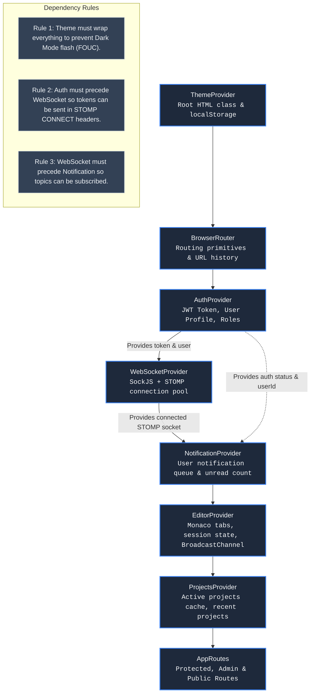
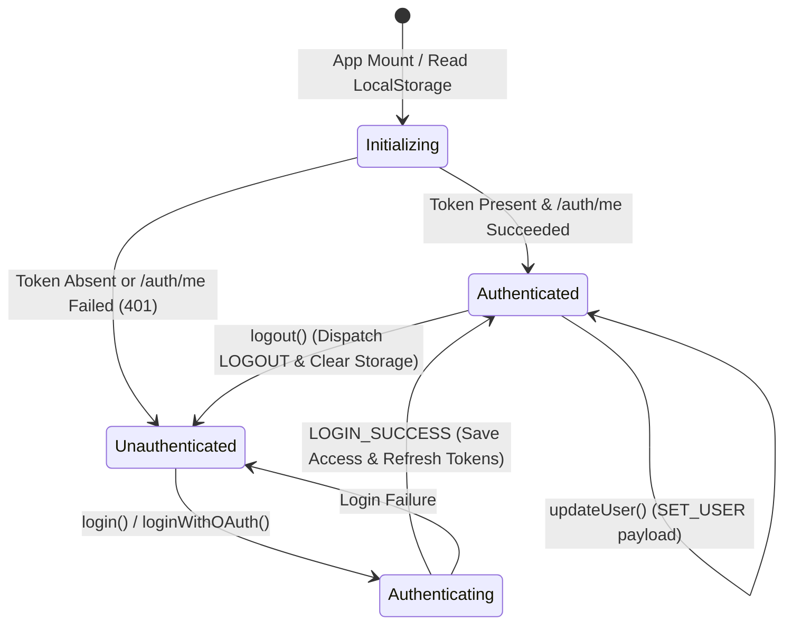
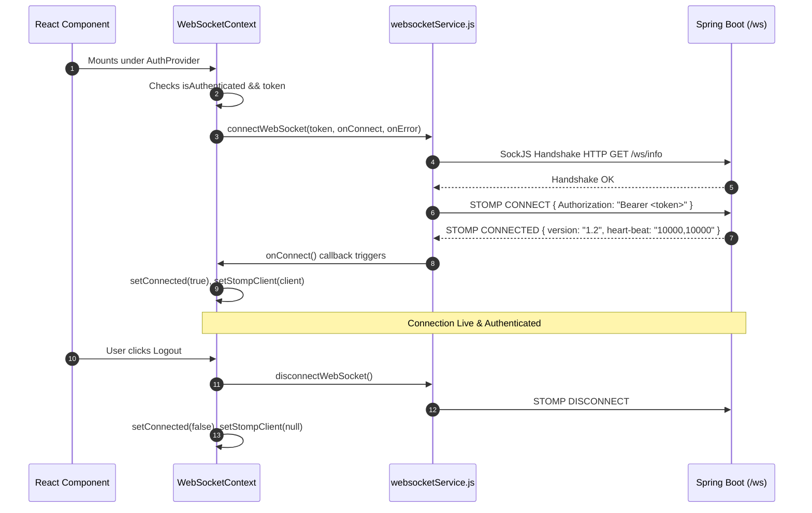
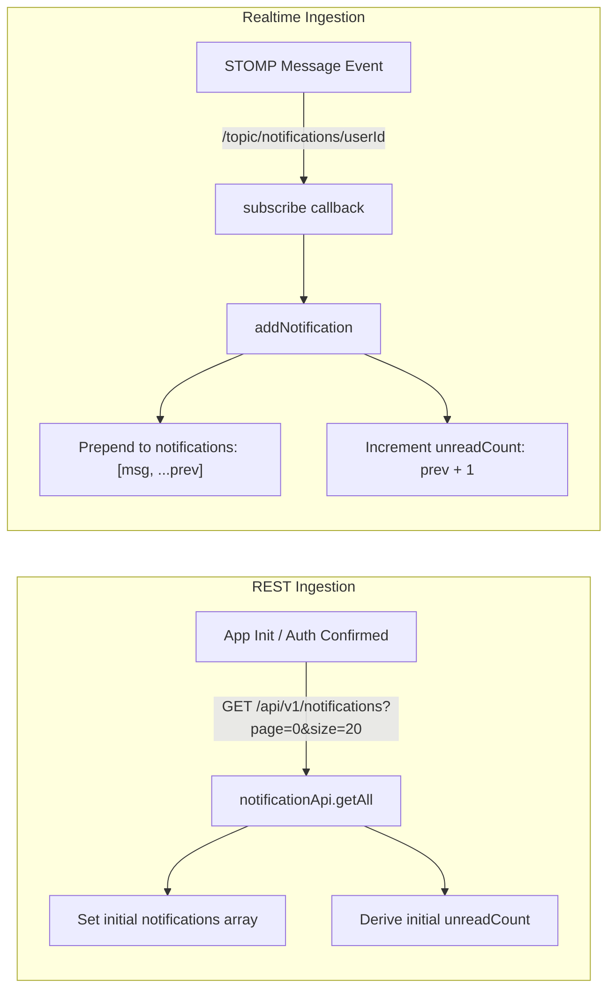
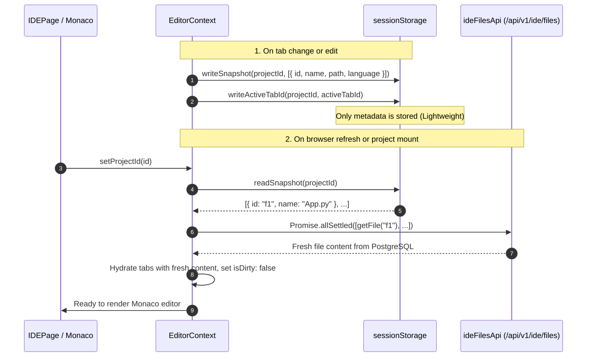
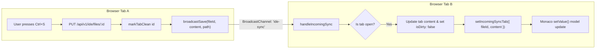
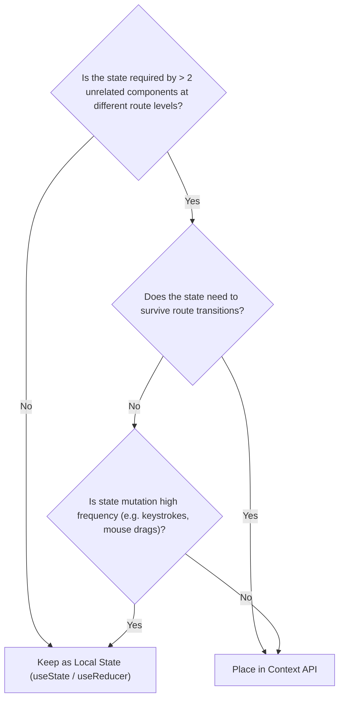
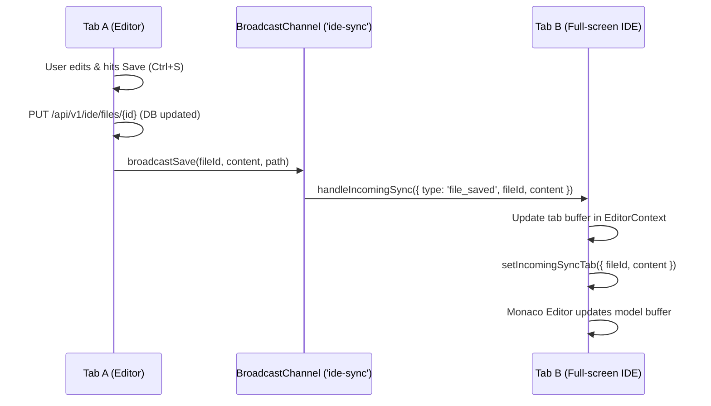

# DevOps Suite Frontend: Context & State Management Interview Guide

> **Module Focus:** React 18 State Architecture, Provider Hierarchy, Custom Contexts, STOMP/WebSocket Lifecycle, Cross-Tab Synchronization, and Re-render Optimization.  
> **Target Roles:** Senior Frontend Engineer, Full-Stack Engineer, Frontend Architect.

---

## 1. Global State Strategy

### 1.1 Architectural Philosophy: Context API vs. External State Stores (Redux / Zustand)

A common interview question for senior candidates is: *"Why did DevOps Suite opt for React's native Context API instead of external global state libraries like Redux Toolkit or Zustand?"*

In enterprise frontends, selecting a state management tool should reflect the data access patterns, domain boundaries, and update frequencies rather than defaulting to Redux or Zustand. In DevOps Suite, state management is structured around **domain-isolated sub-trees**:

```
                       ┌─────────────────────────────────────────┐
                       │          DevOps Suite Frontend          │
                       └────────────────────┬────────────────────┘
                                            │
         ┌──────────────────┬───────────────┴───────────────┬──────────────────┐
         │                  │                               │                  │
         ▼                  ▼                               ▼                  ▼
┌─────────────────┐ ┌────────────────┐             ┌─────────────────┐ ┌────────────────┐
│ UI Appearance   │ │ Authentication │             │ Communications  │ │ Domain Workspaces│
├─────────────────┤ ├────────────────┤             ├─────────────────┤ ├────────────────┤
│ • Theme Mode    │ │ • JWT Tokens   │             │ • STOMP Client  │ │ • IDE Tabs     │
│ • Tailwind CSS  │ │ • User Roles   │             │ • Realtime Logs │ │ • File Tree    │
│ • Dark/Light    │ │ • Profile Data │             │ • Notifications │ │ • Project List │
└─────────────────┘ └────────────────┘             └─────────────────┘ └────────────────┘
```

#### Detailed Comparison Matrix

| Architectural Dimension | Redux Toolkit (RTK) | Zustand | React Context API (DevOps Suite) | Decision Rationale in DevOps Suite |
| :--- | :--- | :--- | :--- | :--- |
| **State Shape** | Single monolithic global store tree | Multiple small decoupled stores | Scoped contextual boundaries wrapped around component trees | DevOps Suite has 6 distinct lifecycle domains; coupling them into one monolithic store creates unnecessary coupling. |
| **Bundle Footprint** | ~11–13 kB minified + gzipped | ~1.2 kB minified + gzipped | **0 kB** (Native React 18 primitive) | Minimizes initial JavaScript payload bundle for fast First Contentful Paint (FCP). |
| **Re-render Granularity** | Selector-based (`useSelector`) with shallow equality checks | Selector-based (`useStore(s => s.foo)`) with fine-grained subscription | Provider-level re-render triggered on value reference change | Context was paired with custom hooks, `useMemo`, `useCallback`, and atomic state splitting, preventing redundant renders. |
| **Boilerplate & Mental Model** | High: slices, actions, reducers, extraReducers, dispatchers | Very low: simple store creators | Moderate: Context definition, Provider wrapper component, consumer hook | Zero external dependencies; uses idiomatic React hooks (`useReducer`, `useState`, `useEffect`). |
| **Cross-Tab / Real-time Sync** | Requires middleware or sync plugins | Requires custom storage event listeners | Uses native browser `BroadcastChannel` and `sessionStorage` alongside custom hooks | `useBroadcastChannel` directly integrates with `EditorContext` without third-party middleware overhead. |

#### Architectural Boundaries
DevOps Suite avoids the "massive nested global state tree" anti-pattern:
1. **No Shared Mutation:** `ThemeContext` has no reason to know about open files in `EditorContext`.
2. **Distinct Lifecycle Lifespans:** Auth state persists for the session/localStorage duration; IDE tab state persists per-project in `sessionStorage`; Notification state resets or loads incrementally via page offsets.
3. **Colocation of Concerns:** Complex domain logic (e.g., re-fetching open file contents on tab hydration or auto-reconnecting STOMP clients) lives directly inside the specialized Provider component.

---

### 1.2 Provider Nesting Architecture & Dependency Hierarchy

The root provider tree in [App.jsx](file:///d:/Projects/DevOps%20Suite/frontend/src/App.jsx) establishes a strict unidirectional dependency graph:



#### Why Provider Nesting Order Is Strict

1. **`ThemeProvider` (Outermost):**
   - Applies the `.dark` class to `document.documentElement` before any DOM nodes or route components mount.
   - Prevents flash of unstyled content (FOUC) when switching tabs or refreshing the browser.
   - Operates independently of user authentication (unauthenticated login/register screens honor theme preferences).

2. **`BrowserRouter`:**
   - Placed outside `AuthProvider` so auth hooks can utilize navigation actions (`useNavigate` or route location listeners) when session timeouts or token expiry occurs.

3. **`AuthProvider`:**
   - Initializes access tokens from `localStorage.getItem('accessToken')` and verifies authentication via `GET /api/v1/auth/me`.
   - Exposes `token`, `user`, `isAuthenticated`, and `loading`.
   - **Crucial Dependency:** All child providers depend on `AuthProvider` to know *who* is logged in and *which token* authorizes outbound communication.

4. **`WebSocketProvider`:**
   - Calls `useAuth()`. Requires `token` and `isAuthenticated` to establish the SockJS STOMP connection to `/ws`.
   - Cannot be placed above `AuthProvider`, because it needs the JWT token for STOMP `CONNECT` headers: `{ Authorization: `Bearer ${token}` }`.

5. **`NotificationProvider`:**
   - Calls both `useWebSocket()` (for `connected`) and `useAuth()` (for `user.userId`).
   - Subscribes to the destination `/topic/notifications/${user.userId}`.
   - Must sit beneath both `AuthProvider` and `WebSocketProvider`.

6. **`EditorProvider` & `ProjectsProvider`:**
   - Wrap the main application screens.
   - `ProjectsProvider` utilizes `useAuth()` to load recent projects once authentication is confirmed.
   - `EditorProvider` maintains Monaco tab state, scoped to the current active project, using `sessionStorage` snapshots and cross-tab `BroadcastChannel` synchronization.

---

## 2. Deep Dive into Each Context

### 2.1 `AuthContext.jsx`

[AuthContext.jsx](file:///d:/Projects/DevOps%20Suite/frontend/src/context/AuthContext.jsx) serves as the security backbone of the single-page application.

#### State & Reducer Architecture
The state is managed using `useReducer` to enforce atomic, predictable state transitions:

```javascript
const initialState = {
  user: null,
  token: AuthService.getToken(),
  isAuthenticated: AuthService.isAuthenticated(),
  loading: true,
};
```



#### Core Action Contracts

| Action | Signature | Responsibility | Side Effects |
| :--- | :--- | :--- | :--- |
| `login` | `async (email, password)` | Authenticates user credentials against `/api/v1/auth/login`. | Dispatches `LOGIN_SUCCESS`, writes `accessToken` & `refreshToken` to `localStorage`. |
| `loginWithGoogle` | `async (tokenOrPayload)` | Exchanges Google OAuth token with backend `/api/v1/auth/google`. | Updates tokens and context user state. |
| `loginWithGithub` | `async (code)` | Sends OAuth authorization code to `/api/v1/auth/github`. | Updates tokens and context user state. |
| `logout` | `async ()` | Posts refresh token to `/api/v1/auth/logout` (Redis blacklisting). | Clears `localStorage`, resets state, disconnects STOMP sockets. |
| `updateUser` | `(updatedUserData) => void` | Updates in-memory profile metadata without network re-authentication. | Synchronizes components like user avatar and status displays. |
| `isAdmin` | *Derived Boolean* | Evaluates `user?.roles` for `ROLE_ADMIN`. | Unlocks Admin navigation, Grafana, Kibana, and Admin routes. |

#### The `user.userId` vs `user.user_id` Bug Fix (`normalizeUser`)

> [!CAUTION]
> **Production Incident / Critical Bug Fix:**
> The Spring Boot backend serializes the `UserResponse` DTO with `@JsonProperty("user_id")` for certain legacy endpoints, while standardizing on camelCase in others. 
> 
> When the React frontend received `user_id`, frontend code expecting `user.userId` evaluated to `undefined`. As a direct consequence, the `NotificationContext` subscription `/topic/notifications/${user.userId}` attempted to subscribe to `/topic/notifications/undefined`, completely breaking real-time push notifications!

To permanently solve this mismatch, [authApi.js](file:///d:/Projects/DevOps%20Suite/frontend/src/api/authApi.js) applies a sanitization layer on every incoming user payload:

```javascript
// File: src/api/authApi.js
const normalizeUser = (user) => {
  if (!user) return user;
  return {
    ...user,
    // Critical: Normalizes snake_case backend IDs to frontend camelCase
    userId: user.userId ?? user.user_id ?? null,
    displayName: user.displayName ?? user.display_name ?? null,
    avatarUrl: user.avatarUrl ?? user.avatar_url ?? null,
    createdAt: user.createdAt ?? user.created_at ?? null,
    lastLoginAt: user.lastLoginAt ?? user.last_login_at ?? null,
    gender: user.gender ?? null,
  };
};
```

---

### 2.2 `WebSocketContext.jsx`

[WebSocketContext.jsx](file:///d:/Projects/DevOps%20Suite/frontend/src/context/WebSocketContext.jsx) manages the lifecycle of the STOMP connection over SockJS.



#### Lifecycle & Reconnection
- **Endpoint:** Connects to `/ws` using the SockJS fallback transport.
- **Security Interception:** The client injects the JWT in the STOMP connect headers. On the Spring Boot side, `StompAuthChannelInterceptor` intercepts `StompCommand.CONNECT`, extracts the token, validates it against the Redis blacklist, and populates Spring's `SecurityContext`.
- **Cleanup & Tear Down:** When `isAuthenticated` flips to `false` or the token is invalidated, the `useEffect` cleanup hook calls `disconnectWebSocket()`, closing the socket cleanly and preventing zombie connections on the backend broker.

---

### 2.3 `NotificationContext.jsx`

[NotificationContext.jsx](file:///d:/Projects/DevOps%20Suite/frontend/src/context/NotificationContext.jsx) bridges STOMP real-time pub/sub messaging with REST-based pagination.

#### State Structure
```javascript
const [notifications, setNotifications] = useState([]);
const [unreadCount, setUnreadCount] = useState(0);
const [hasMore, setHasMore] = useState(true);
const [page, setPage] = useState(0);
```

#### Dual Ingestion Pattern: REST Seed + STOMP Push



#### Key Actions & Optimistic State Updates
- **`addNotification(notification)`:** Prepends incoming event to list, increments unread count.
- **`markAsRead(id)`:** Asynchronously calls `PUT /api/v1/notifications/{id}/read` while immediately updating local state:
  ```javascript
  setNotifications(prev => prev.map(n => n.id === id ? { ...n, read: true } : n));
  setUnreadCount(prev => Math.max(0, prev - 1));
  ```
- **`markAllAsRead()`:** Calls `PUT /api/v1/notifications/read-all`, sets all local notifications to `read: true`, resets `unreadCount = 0`.
- **`deleteNotification(id)`:** Removes notification by ID and decrements `unreadCount` if the deleted item was unread.

---

### 2.4 `ProjectsContext.jsx`

[ProjectsContext.jsx](file:///d:/Projects/DevOps%20Suite/frontend/src/context/ProjectsContext.jsx) caches projects across navigation events so that the sidebar, navigation bars, and dashboards avoid refetching.

#### State & Features
- **`projects`:** Full array of projects accessible to the current user, sorted by `updatedAt` descending.
- **`recent`:** Memoized slice of top 5 projects for instant display in the collapsible sidebar.
- **`loading`:** Indicates whether the initial session fetch is currently inflight.
- **`refresh()`:** Invalidates local cache and re-queries `GET /api/v1/projects?page=0&size=100`. Triggered whenever a user creates, deletes, or renames a project.

#### Lifecycle Handling
```javascript
useEffect(() => {
  if (!authLoading && isAuthenticated) {
    fetchProjects();
  } else if (!authLoading && !isAuthenticated) {
    setProjects([]);
    setLoading(false);
  }
}, [authLoading, isAuthenticated, fetchProjects]);
```
This guard ensures that unauthenticated views never leak previous session data, and prevents `401 Unauthorized` requests during the bootstrap phase.

---

### 2.5 `EditorContext.jsx`

[EditorContext.jsx](file:///d:/Projects/DevOps%20Suite/frontend/src/context/EditorContext.jsx) is the most sophisticated context in DevOps Suite. It coordinates Monaco editor tabs, track dirty states, persists lightweight session snapshots, and synchronizes state across browser tabs.

#### Data Model of a Tab
```typescript
interface EditorTab {
  id: string;        // UUID of IdeFile entity in PostgreSQL
  name: string;      // e.g. "Main.java"
  path: string;      // e.g. "src/main/java/Main.java"
  language: string;  // e.g. "java", "python", "javascript"
  content: string;   // Working text buffer
  isDirty: boolean;  // True if unsaved changes exist
}
```

#### Tab Session Persistence (`sessionStorage`)
To prevent Monaco tab loss during page reloads or route changes (e.g., navigating from `/projects/1/code` to `/projects/1/tasks` and back), `EditorContext` uses a two-tier persistence design:



> [!NOTE]
> **Why tab content is omitted from `sessionStorage`:**
> Storing large file buffers in `sessionStorage` can exceed the standard 5 MB quota and risks displaying stale code if another team member or container process modified the database file in the interim. Only metadata is stored; the canonical file content is re-fetched on mount.

#### Cross-Tab Synchronization (`BroadcastChannel`)
When a developer opens two browser tabs side-by-side (e.g., full-screen `/editor` and regular `/projects/1/code`), saving in Tab A automatically propagates to Tab B without a page refresh:



---

### 2.6 `ThemeContext.jsx`

[ThemeContext.jsx](file:///d:/Projects/DevOps%20Suite/frontend/src/context/ThemeContext.jsx) manages the visual theme of the platform.

#### Key Mechanics:
1. **Lazy State Initialization:** Reads `localStorage.getItem('theme')` first. If null, falls back to `window.matchMedia('(prefers-color-scheme: dark)').matches`.
2. **DOM Synchronization:** A `useEffect` watches `isDark` and synchronously toggles the `.dark` class on `document.documentElement`, activating Tailwind CSS's `dark:` selectors across the application.
3. **Persistence:** Synchronizes the user's manual preference to `localStorage.setItem('theme', isDark ? 'dark' : 'light')`.

---

## 3. Performance & Re-render Optimization

### 3.1 The Context Re-render Trap & Strategic Solutions

By default in React, when a Context value object changes reference, **every component that invokes `useContext(MyContext)` re-renders**, even if that component only accesses an unchanged field.

```
❌ The Common Anti-Pattern:
const Provider = ({ children }) => {
  const [user, setUser] = useState(null);
  const [token, setToken] = useState(null);

  // Un-memoized object literal causes a brand new reference on EVERY render!
  return (
    <AuthContext.Provider value={{ user, token, setUser }}>
      {children}
    </AuthContext.Provider>
  );
};
```

#### Optimization Techniques in DevOps Suite:

1. **`useCallback` for Actions:**
   All mutations (`login`, `logout`, `markAsRead`, `openFile`, `selectTab`) are wrapped in `useCallback` with minimal dependencies.

2. **Functional State Updates:**
   Setters utilize functional updates (`prev => next`) so functions do not need to re-bind when array or counter values change:
   ```javascript
   // Inside NotificationContext.jsx - No external dependencies in useCallback!
   const addNotification = useCallback((notification) => {
     setNotifications((prev) => [notification, ...prev]);
     setUnreadCount((prev) => prev + 1);
   }, []);
   ```

3. **Domain Splitting Instead of a Giant Context:**
   Instead of a single `AppContext` holding `{ theme, user, projects, tabs, notifications }`, splitting into 6 contexts guarantees that toggling dark mode will **not** trigger re-renders in the Monaco Editor or Task Board.

---

### 3.2 Decision Matrix: Local State (`useState`) vs. Context State



| State Entity | Location | Rationale |
| :--- | :--- | :--- |
| **Monaco Cursor Line/Col** | Local Editor State | Updating Context on every cursor movement would trigger app-wide re-renders. |
| **Search Filter in Tasks List** | Local (`TasksPage.jsx`) | Only affects task list filtering; no other screen requires it. |
| **JWT Access Token** | `AuthContext` | Needed by API interceptors, WebSocket connector, and Route guards. |
| **Open IDE Tabs Metadata** | `EditorContext` | Must survive switching between Code Editor and Logs/Task views. |
| **Modal Open/Close (`isOpen`)** | Local Component State | Context-level modals lead to state pollution and focus bugs. |

---

### 3.3 The Modal Focus Loss Bug & State Lifting Resolution

> [!WARNING]
> **Production Defect:**
> When renaming an IDE file, the modal input repeatedly lost focus after typing each character.
> 
> **Root Cause:**
> The `RenameModal` component was initially declared **inside** the render function of the file tree component, or was reading dynamic state passed down through unmemoized intermediate context props. On every keystroke, the parent component re-rendered, creating a new function reference for the modal. React interpreted this as an unmount/mount of the DOM tree, destroying the input element's DOM focus!
> 
> **Resolution:**
> 1. Extracted `RenameModal` into an independent top-level component.
> 2. Lifted the modal's input state locally inside the modal itself (`useState(initialName)`), only notifying the parent on `submit(newName)`.
> 3. Wrapped context actions (`updateTabMeta`) in stable `useCallback` hooks.

---

## 4. Comprehensive Interview Q&A

### 🟢 Basic Level

#### Q1: How did you structure global state management in DevOps Suite without using Redux?
**Answer:**  
In DevOps Suite, we avoided Redux's complexity by designing our state around **six focused domain contexts**:
1. `ThemeContext`: Theme preference and DOM dark mode classes.
2. `AuthContext`: Authentication tokens, user info, roles, and login/logout handlers.
3. `WebSocketContext`: STOMP/SockJS client instance and connection state.
4. `NotificationContext`: Real-time alerts, unread counts, and notification pagination.
5. `ProjectsContext`: Project caching and sidebar quick-access.
6. `EditorContext`: Monaco editor tab management, dirty buffers, and cross-tab synchronization.

Each context encapsulates its own business logic, reducers, and API calls. Components only consume the specific context they need via custom hooks (`useAuth()`, `useEditor()`), isolating re-renders to components that depend on changed data.

```javascript
// Example consumer usage:
const { user, isAdmin } = useAuth();
const { openFile, activeTab } = useEditor();
```

---

#### Q2: How does `ThemeContext` prevent a Flash of Unstyled Content (FOUC)?
**Answer:**  
`ThemeContext` uses **lazy initialization** in `useState`:
```javascript
const [isDark, setIsDark] = useState(() => {
  const saved = localStorage.getItem('theme');
  if (saved) return saved === 'dark';
  return window.matchMedia('(prefers-color-scheme: dark)').matches;
});
```
Because `ThemeProvider` is the outermost provider in `App.jsx`, its initialization runs synchronously before child components render. A `useEffect` immediately toggles the `.dark` class on `document.documentElement`. Tailwind CSS rules keyed on `.dark` evaluate on the first paint, preventing light-to-dark flashes during browser load.

---

#### Q3: Why does `ProjectsContext` cache the project list instead of fetching it on every page navigation?
**Answer:**  
In DevOps Suite, navigating between the Dashboard, Task Board, Code Editor, and Logs occurs frequently within the same project or across favorite projects. Fetching `GET /api/v1/projects` on every navigation would cause UI flickers and generate unnecessary backend queries.

`ProjectsContext` fetches the list once after authentication succeeds and caches it in memory. If a project is created, deleted, or updated, the context exposes a `refresh()` method that triggers a cache revalidation.

---

### 🟡 Intermediate Level

#### Q4: Why does the order of your Context Providers matter in `App.jsx`?
**Answer:**  
Context consumers can only read values from providers that sit higher in the component tree. In DevOps Suite, there is a clear dependency pipeline:

1. **`WebSocketProvider` requires `AuthContext`:**  
   The STOMP client cannot connect without an access token. Placing `WebSocketProvider` above `AuthProvider` would cause `useAuth()` to throw an error or return `undefined`, preventing authentication headers from being added to the STOMP handshake.
2. **`NotificationProvider` requires `WebSocketProvider` and `AuthContext`:**  
   To subscribe to `/topic/notifications/${user.userId}`, the notification service requires both an established socket connection and the normalized `user.userId`.
3. **`ProjectsProvider` & `EditorProvider` require `AuthContext`:**  
   Project files and metadata should only be fetched when the user is authenticated.

Reversing any of these providers breaks the initialization chain.

---

#### Q5: Explain the `normalizeUser` helper in `authApi.js`. What bug did it fix?
**Answer:**  
Our Spring Boot backend sends the user ID field as `user_id` in some endpoints (via `@JsonProperty("user_id")`) and `userId` in others. 

In `NotificationContext.jsx`, real-time alert subscriptions rely on this ID:
```javascript
useEffect(() => {
  if (connected && user?.userId) {
    const unsub = subscribe(`/topic/notifications/${user.userId}`, ...);
    return () => unsub();
  }
}, [connected, user?.userId]);
```

Before implementing `normalizeUser`, `user.userId` evaluated to `undefined` because the raw API payload contained `user_id`. The subscription never completed, and users received no push notifications for assigned tasks or execution results.

We fixed this by adding `normalizeUser` to `authApi.js` to normalize all responses:
```javascript
const normalizeUser = (user) => {
  if (!user) return user;
  return {
    ...user,
    userId: user.userId ?? user.user_id ?? null,
    displayName: user.displayName ?? user.display_name ?? null,
  };
};
```
This sanitizes the user model at the HTTP layer before state dispatchers receive it.

---

#### Q6: How do you handle persistent state across page refreshes in `EditorContext` without filling up `sessionStorage`?
**Answer:**  
In `EditorContext.jsx`, we use a **lightweight metadata snapshot**:

```javascript
function writeSnapshot(projectId, tabs) {
  const snapshot = tabs.map(({ id, name, path, language }) => ({
    id, name, path, language, // Content is intentionally omitted!
  }));
  window.sessionStorage.setItem(`editor_tabs_${projectId}`, JSON.stringify(snapshot));
}
```

1. **Why not `localStorage`?** `sessionStorage` automatically isolates tab sessions per browser tab and clears when the browser closes, preventing stale workspaces.
2. **Why omit `content`?** File contents can be hundreds of kilobytes. Storing full buffers risks exceeding the browser's 5 MB `sessionStorage` limit. Furthermore, storing content locally can lead to stale state if another user or process updated the file on the server.
3. **Hydration on Mount:** When a user refreshes or selects a project, `EditorContext` reads the tab metadata from `sessionStorage` and calls `ideFilesApi.getFile(id)` in parallel via `Promise.allSettled`. This restores the tabs with the latest content from the database.

---

### 🔴 Advanced Level

#### Q7: What happens to WebSocket and STOMP subscriptions when a user logs out or switches accounts?
**Answer:**  
When a user logs out:
1. `AuthContext` calls `AuthService.logout()`, deletes `accessToken` and `refreshToken` from `localStorage`, and dispatches `{ type: 'LOGOUT' }`.
2. This sets `isAuthenticated: false` and `user: null`.
3. In `WebSocketContext.jsx`, the main effect monitors `[isAuthenticated, token]`:
   ```javascript
   useEffect(() => {
     if (isAuthenticated && token) {
       const client = connectWebSocket(...);
       return () => {
         disconnectWebSocket(); // STOMP disconnect frame sent
         setConnected(false);
         setStompClient(null);
       };
     }
   }, [isAuthenticated, token]);
   ```
4. Changing `isAuthenticated` to `false` triggers the cleanup return function:
   - Issues a STOMP `DISCONNECT` frame to the backend broker.
   - Resets `connected = false` and `stompClient = null`.
5. Because `NotificationContext` watches `connected`, its subscription cleanup triggers automatically:
   ```javascript
   return () => unsub();
   ```
This lifecycle teardown prevents socket leaks, cleans up event listeners, and ensures the next user does not receive messages meant for the previous session.

---

#### Q8: How does cross-tab synchronization work in `EditorContext` when multiple browser tabs are open?
**Answer:**  
We use the browser's native `BroadcastChannel` API through a custom hook, `useBroadcastChannel('ide-sync')`:



1. **Broadcasting Changes:** When a file is saved in Tab A, `broadcastSave(fileId, content, path)` sends a message to the `'ide-sync'` channel.
2. **Receiving Changes:** Tab B receives the event and updates the matching tab's buffer in `EditorContext`, marking it clean (`isDirty: false`).
3. **Editor Synchronization:** It sets `incomingSyncTab`, notifying `IDEPage.jsx` to update Monaco's active model (`monaco.editor.getModel().setValue(...)`), keeping both browser tabs in sync without extra server polling.

---

#### Q9: How do you prevent unnecessary re-renders in consumers of `NotificationContext`?
**Answer:**  
`NotificationContext` uses three complementary patterns:

1. **Stable Callbacks via Functional Updates:**  
   Functions like `addNotification`, `markAsRead`, and `deleteNotification` use the functional updater form (`setNotifications(prev => ...)`). This allows their `useCallback` dependency arrays to remain empty (`[]`), giving them stable references across the application's lifetime.
2. **Decoupling Pagination from Unread Badges:**  
   The unread counter (`unreadCount`) is managed as a numeric state primitive alongside the notification array. Components that only need to display a badge count can consume `unreadCount` without re-filtering or scanning the full notification list on every render.
3. **Single Context Value Memoization:**  
   The exposed value object is composed of stable functions and state primitives, avoiding the generation of unneeded references on neutral state changes.

---

### ⚫ Expert Level

#### Q10: How would you scale the current React Context state architecture if DevOps Suite grew to include collaborative real-time code editing (like Google Docs or VS Code Live Share)?
**Answer:**  
While React Context is well-suited for metadata and document tabs, using it for **keystroke-by-keystroke collaborative editing** would degrade performance:

```
Limitations of Context for Keystroke Synchronization:
- React Context triggers updates at the component tree level.
- Typing at 60–120 WPM would push 10–20 updates per second into the Context.
- This forces root-level re-evaluations across the entire editor and sidebar tree.
```

To handle real-time collaborative editing at scale, we would adopt an **External Mutable Model with Targeted Subscriptions**:

```mermaid
flowchart TD
    subgraph Collaborative Engine
        CRDT["CRDT Engine (Yjs / Automerge)"]
        WS_Provider["Y-Websocket / STOMP Provider"]
        WS_Provider <--> CRDT
    end

    subgraph Monaco Integration
        CRDT <--> MonacoBinding["y-monaco Binding"]
        MonacoBinding <--> MonacoEditor["Monaco Editor Instance (Raw DOM)"]
    end

    subgraph React Context (Metadata Only)
        EditorContext["EditorContext (React)"]
        EditorContext -->|Tab metadata, dirty flag, permissions| AppUI["Sidebar & Tab Strip UI"]
    end
```

**Architecture Plan:**
1. **Adopt a CRDT Framework (Yjs or Automerge):**  
   Maintain document state in an external CRDT document (`Y.Doc`) rather than React state.
2. **Direct Monaco Binding:**  
   Use `y-monaco` to bind the Monaco text model directly to the `Y.Text` type. Keystrokes, cursor positions, and remote updates bypass React's render loop entirely, updating the editor canvas with sub-millisecond latency.
3. **Retain Context for Metadata:**  
   Keep `EditorContext` for high-level coordination: managing the active tab ID, file permissions, member presence list, and tab closing logic.

This approach separates high-frequency text mutations from low-frequency UI state.

---

#### Q11: Walk through the architectural decisions behind handling a `401 Unauthorized` token expiry inside an ongoing session. How do `AuthContext`, Axios interceptors, and `WebSocketContext` stay synchronized?
**Answer:**  
Token expiry handling requires careful coordination across three layers:

```mermaid
sequenceDiagram
    autonumber
    participant UI as Component / View
    participant API as Axios client (apiClient)
    participant Auth as AuthContext / AuthService
    participant WS as WebSocketContext
    participant Server as Spring Boot Backend

    UI->>API: GET /api/v1/projects
    API->>Server: HTTP Request + Bearer <expired-access-token>
    Server-->>API: 401 Unauthorized
    
    rect rgb(30, 41, 59)
        Note over API,Auth: Axios Response Interceptor catches 401
        API->>Server: POST /api/v1/auth/refresh { refreshToken }
        alt Refresh Succeeded
            Server-->>API: 200 OK { accessToken: "new-jwt" }
            API->>Auth: Updates localStorage('accessToken', new-jwt)
            API->>Server: Replays original GET /api/v1/projects
            Server-->>UI: 200 OK (User sees uninterrupted workflow)
        else Refresh Failed (Token Expired or Revoked)
            Server-->>API: 403 Forbidden / 401 Unauthorized
            API->>Auth: Dispatches LOGOUT / Clears LocalStorage
            Auth->>WS: isAuthenticated becomes false
            WS->>WS: disconnectWebSocket() terminates STOMP
            Auth->>UI: Redirects to /login
        end
    end
```



1. **The Interceptor Loop:**  
   [client.js](file:///d:/Projects/DevOps%20Suite/frontend/src/api/client.js) catches HTTP 401 errors. It queues incoming requests while using the `refreshToken` to call `/api/v1/auth/refresh`.
2. **Successful Refresh:**  
   New tokens are written to `localStorage`. The queued requests are replayed with the new bearer token. `AuthContext` and `WebSocketContext` remain connected without disrupting the user.
3. **Session Expiry (Refresh Token Invalid):**  
   If the refresh token has expired or been revoked in Redis, the interceptor calls `AuthService.logout()`. This clears `localStorage`, dispatches `LOGOUT` to `AuthContext`, and updates `isAuthenticated: false`.
4. **WebSocket Teardown:**  
   The transition of `isAuthenticated` to `false` triggers the cleanup effect in `WebSocketContext`, immediately disconnecting the socket to ensure no dangling STOMP connections remain.

---

## 5. Quick Reference & Core Facts

### Quick Reference Table
| Context Name | Primary Hook | Core State Members | Storage Persistence | Network Interactions |
| :--- | :--- | :--- | :--- | :--- |
| **`ThemeContext`** | `useTheme()` | `isDark: boolean` | `localStorage ('theme')` | None (pure client DOM) |
| **`AuthContext`** | `useAuth()` | `user, token, isAuthenticated, loading, isAdmin` | `localStorage ('accessToken', 'refreshToken')` | `/api/v1/auth/*` |
| **`WebSocketContext`**| `useWebSocket()`| `connected: boolean, stompClient: Client` | None (ephemeral runtime socket) | SockJS + STOMP over `/ws` |
| **`NotificationContext`**| `useNotifications()`| `notifications[], unreadCount, hasMore` | Memory / State-backed | `/api/v1/notifications/*` + STOMP `/topic/notifications/{id}` |
| **`ProjectsContext`** | `useProjects()` | `projects[], recent[], loading` | Memory / Session cache | `/api/v1/projects` |
| **`EditorContext`** | `useEditor()` | `tabs[], activeTabId, activeTab, projectId` | `sessionStorage ('editor_tabs_projectId')` | `/api/v1/ide/files/*` + `BroadcastChannel ('ide-sync')` |

### Key Takeaways to Memorize
- **Provider Ordering:** `ThemeProvider` ➔ `BrowserRouter` ➔ `AuthProvider` ➔ `WebSocketProvider` ➔ `NotificationProvider` ➔ `EditorProvider` ➔ `ProjectsProvider`.
- **Normalization:** Always mention `normalizeUser()` when discussing auth integration to highlight attention to edge-case bugs (`userId` vs `user_id`).
- **Optimization:** Use `useCallback` with functional state updates (`prev => next`) to provide stable function references across context boundaries.
- **Editor Scalability:** In `EditorContext`, keep tab content out of `sessionStorage`—persist only metadata and rehydrate content on mount using `Promise.allSettled`.
- **Cross-Tab Synchronization:** Use the browser's `BroadcastChannel` API to keep multi-tab IDE sessions synchronized on file saves.
