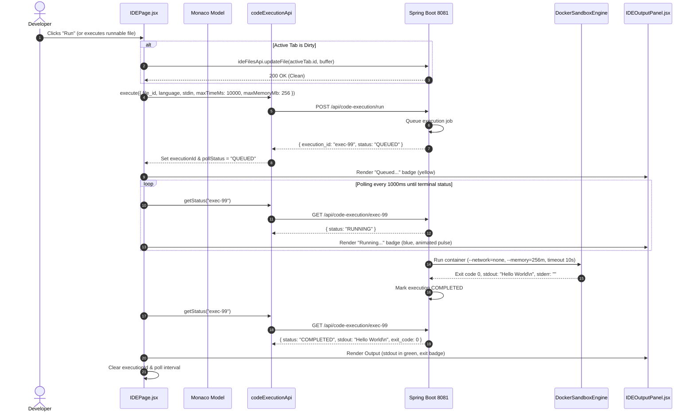

# DevOps Suite — Monaco Editor Integration & IDE Architecture Interview Knowledge Base

> **Document Scope:** Architectural deep dive into the integration of `@monaco-editor/react`, web workers, syntax highlighting, IntelliSense, multi-tab virtual file management via `EditorContext.jsx`, debounced auto-save vs. manual hotkeys, sandboxed code execution bridging via `codeExecutionApi.execute()`, and advanced browser engineering interview Q&A for the **DevOps Suite** platform.

---

## 1. Executive Summary & Architectural Overview

The **DevOps Suite** browser-based IDE delivers a desktop-grade developer workspace inside a React 18 single-page application. Built upon `@monaco-editor/react` (version `^4.6.0`, wrapping Monaco Core `0.52.0`), the system allows software engineers to navigate complex project hierarchies, edit multi-language source code with rich autocomplete and syntax highlighting, preview web layouts, and execute code within isolated Docker sandbox containers.

Rather than treating Monaco as a simple `<textarea>` replacement, DevOps Suite architected an end-to-end virtual file system and editor pipeline:
1. **Explicit Worker & CDN Loading:** Configures `@monaco-editor/react` loader with explicit CDN distribution (`monaco-editor@0.52.0`) ensuring web workers (TypeScript, HTML, CSS, JSON, and editor core) load deterministically without bundler breakage.
2. **Virtual Multi-Tab Session Management (`EditorContext.jsx`):** Decouples file navigation from disk reads. Session tabs survive route switches via lightweight `sessionStorage` serialization (metadata only) and re-hydrate file buffers asynchronously.
3. **Model Caching & Lifecycle Protection:** Maintains an in-memory `modelCache` (`Map<string, monaco.editor.ITextModel>`) keyed by project file paths. Models persist undo/redo history, cursor position, and language services during tab transitions, while explicit disposal hooks prevent severe browser memory leaks.
4. **IntelliSense & Language Providers:** Augments native language services with custom completions, built-ins, and snippet expansions for Python, Java, C++, C, JavaScript, TypeScript, HTML, CSS, and Markdown.
5. **Cross-Tab Synchronization (`BroadcastChannel`):** Uses the `ide-sync` channel to synchronize document saves seamlessly between standard and full-screen IDE browser tabs (`FullScreenIDEPage.jsx`).
6. **Execution Pipeline Integration:** Bridges the editor buffer to `codeExecutionApi.execute()`, auto-flushing dirty buffers to PostgreSQL prior to dispatching sandboxed container runs and streaming output to `IDEOutputPanel.jsx`.

```
┌────────────────────────────────────────────────────────────────────────────────────────────────────────┐
│                                            BROWSER RUNTIME                                             │
│                                                                                                        │
│   ┌────────────────────────────────────────────────────────────────────────────────────────────────┐   │
│   │                                       EditorContext.jsx                                        │   │
│   │   [tabs: Array<Tab>]   [activeTabId]   [sessionStorage snapshot]   [BroadcastChannel 'ide-sync'] │   │
│   └───────────────▲──────────────────────────────────▲─────────────────────────────▲───────────────┘   │
│                   │                                  │                             │                   │
│   ┌───────────────▼────────────────────────┐         │               ┌─────────────▼───────────────┐   │
│   │               IDEPage.jsx              │         │               │     FullScreenIDEPage.jsx   │   │
│   │ ┌────────────────────────────────────┐ │         │               │  (Detached Browser Tab,     │   │
│   │ │          FileExplorer.jsx          │ │         │               │   full-viewport IDEPage)    │   │
│   │ │ - Tree navigation / Context menu   │ │         │               └─────────────────────────────┘   │
│   │ └─────────────────┬──────────────────┘ │         │                                                 │
│   │                   │ (select tab)       │         │                                                 │
│   │ ┌─────────────────▼──────────────────┐ │         │                                                 │
│   │ │          IDEEditor.jsx             │ │         │                                                 │
│   │ │  - MonacoEditor wrapper            │ │         │                                                 │
│   │ │  - modelCache (Map<path, IModel>)  │◄──────────┘                                                 │
│   │ │  - Custom Snippets & Keywords      │                                                             │
│   │ │  - Ctrl/Cmd+S Hotkey Interception  │                                                             │
│   │ └─────────────────┬──────────────────┘                                                             │
│   │                   │                                                                                │
│   │                   ▼                                                                                │
│   │        [Run Button Trigger]                                                                        │
│   │        1. Flush dirty buffer -> ideFilesApi.updateFile()                                           │
│   │        2. Submit job -> codeExecutionApi.execute({ file_id, stdin, ... })                          │
│   │                   │                                                                                │
│   │                   ▼                                                                                │
│   │ ┌────────────────────────────────────┐                                                             │
│   │ │         IDEOutputPanel.jsx         │                                                             │
│   │ │ - Polling status (QUEUED/RUNNING)  │                                                             │
│   │ │ - Terminal result (stdout/stderr)  │                                                             │
│   │ └────────────────────────────────────┘                                                             │
│   └────────────────────────────────────────────────────────────────────────────────────────────────┘   │
│                                           │                      ▲                                     │
└───────────────────────────────────────────┼──────────────────────┼─────────────────────────────────────┘
                                            │ HTTP / REST          │ Polling (1000ms)
                                            ▼                      │
┌────────────────────────────────────────────────────────────────────────────────────────────────────────┐
│                                 SPRING BOOT 3 BACKEND (PORT 8081)                                      │
│                                                                                                        │
│   ┌───────────────────────────────┐                  ┌─────────────────────────────────────────────┐   │
│   │       IdeFileController       │                  │          CodeExecutionController            │   │
│   │   GET/POST/PUT/DELETE         │                  │   POST /api/code-execution/run              │   │
│   │   /api/projects/{id}/files    │                  │   GET  /api/code-execution/{id}             │   │
│   └───────────────┬───────────────┘                  └──────────────────────┬──────────────────────┘   │
│                   │                                                         │                          │
│                   ▼                                                         ▼                          │
│           [PostgreSQL 16]                                        [DockerSandboxEngine]                 │
│         (ide_files table)                                        - Ephemeral Container                 │
│                                                                  - --network=none, --read-only         │
│                                                                  - 256MB RAM, 10s CPU limit            │
└────────────────────────────────────────────────────────────────────────────────────────────────────────┘
```

---

## 2. Monaco Editor Integration Architecture (`IDEEditor.jsx`)

### 2.1 CDN & Web Worker Bootstrapping

Monaco Editor relies extensively on Web Workers to perform syntax parsing, language tokenization, linting, and AST compilation off the main UI thread. In bundlers like Vite, bundling Monaco workers locally requires custom Rollup plugins or explicit Web Worker worker-loader configurations.

DevOps Suite ensures 100% deterministic, zero-configuration worker initialization across local development and Docker production containers by configuring `@monaco-editor/react`'s loader:

```javascript
import MonacoEditor, { loader } from '@monaco-editor/react';

// Configure Monaco loader — explicit CDN ensures all language workers load correctly
loader.config({
  paths: { vs: 'https://cdn.jsdelivr.net/npm/monaco-editor@0.52.0/min/vs' },
});
```

This guarantees:
- Worker scripts (`editor.worker.js`, `ts.worker.js`, `html.worker.js`, `css.worker.js`) are dynamically resolved from standard JSDelivr CDNs.
- Zero local Vite asset bloat: avoids downloading and bundling 40+ megabytes of Monaco language services into the frontend bundle.
- Consistent language feature compatibility between developers and deployed environments.

### 2.2 Monaco Configuration & Ergonomics

The editor is mounted inside `IDEEditor.jsx` using high-performance settings tailored for software engineering productivity:

```jsx
<MonacoEditor
  height="100%"
  defaultLanguage="plaintext"
  defaultValue=""
  onChange={handleChange}
  onMount={handleEditorMount}
  options={{
    readOnly,
    fontSize:                        14,
    fontFamily:                      "'Cascadia Code','Fira Code','JetBrains Mono',Consolas,monospace",
    fontLigatures:                   true,
    minimap:                         { enabled: false },
    scrollBeyondLastLine:            false,
    automaticLayout:                 true,
    tabSize:                         4,
    insertSpaces:                    true,
    wordWrap:                        'off',
    renderWhitespace:                'selection',
    smoothScrolling:                 true,
    cursorBlinking:                  'smooth',
    cursorSmoothCaretAnimation:      'on',
    bracketPairColorization:         { enabled: true },
    'semanticHighlighting.enabled':  true,
    quickSuggestions:                { other: true, comments: false, strings: true },
    quickSuggestionsDelay:           50,
    suggestOnTriggerCharacters:      true,
    acceptSuggestionOnEnter:         'on',
    tabCompletion:                   'on',
    wordBasedSuggestions:            'matchingDocuments',
    suggest: {
      showSnippets:   true,
      showKeywords:   true,
      showWords:      true,
      showFunctions:  true,
      filterGraceful: true,
      localityBonus:  true,
    },
    formatOnPaste:  true,
    formatOnType:   true,
    padding:        { top: 8 },
  }}
/>
```

#### Key Configuration Decisions:
1. `automaticLayout: true`: Automatically observes parent container resize events (e.g. dragging the `FileExplorer` or `IDEOutputPanel` splitters) via `ResizeObserver` internally, preventing canvas clipping without manual window event listeners.
2. `bracketPairColorization: { enabled: true }`: Hardware-accelerated bracket matching rendered directly in the Monaco core canvas rendering engine.
3. `minimap: { enabled: false }`: Disabled to conserve GPU memory, DOM footprint, and layout width on smaller screens or split-view panels.
4. `quickSuggestionsDelay: 50`: Drops the default 300ms autocomplete delay down to 50ms for instantaneous, desktop-IDE feel.

---

## 3. Language Intelligence & Custom Autocompletion Pipeline

Monaco includes native language services for JavaScript, TypeScript, CSS, HTML, and JSON. However, languages like Python, Java, and C++ only have syntax tokenizers (via Monarch lexers) out of the box; they lack semantic snippet completion and keyword triggers. DevOps Suite fills this gap by implementing custom `CompletionItemProvider` registrations for all core supported languages.

### 3.1 Supported Languages Matrix

| Language | Extension | Monaco Language ID | Engine Level | Snippets & Autocomplete Features |
| :--- | :--- | :--- | :--- | :--- |
| **Python** | `.py` | `python` | Monarch + Custom Provider | 35 keywords, 37 builtins (`len`, `zip`, `isinstance`), 22 snippets (`def`, `class`, list comp) |
| **Java** | `.java` | `java` | Monarch + Custom Provider | 53 keywords, 23 snippets (`main`, `sout`, `tryfin`, `ArrayList`, getters/setters) |
| **C++ / C** | `.cpp`, `.cc`, `.c` | `cpp`, `c` | Monarch + Custom Provider | 68 keywords, 30 snippets (`cout`, `vector`, `template`, lambda, `#include`) |
| **JavaScript** | `.js`, `.mjs`, `.jsx` | `javascript` | Native TS Worker + Snippets | Native AST typing + 26 ES6+ snippets (`afn`, `asyncfn`, `promise`, `destruct`) |
| **TypeScript** | `.ts`, `.tsx` | `typescript` | Native TS Worker + Snippets | Full static analysis worker + ES6/TS snippets |
| **HTML** | `.html` | `html` | Native HTML Service + Snippets | Full tag completion + 32 snippets (`doc`, `flex`, `table`, `form`) |
| **CSS** | `.css` | `css` | Native CSS Service + Snippets | Property validation + 27 snippets (flexbox, CSS grid, variables, keyframes) |
| **Markdown** | `.md` | `markdown` | Tokenizer + Custom Provider | Trigger characters (`#`, `-`, ```` ` ````, `[`) + 20 markdown templates |

### 3.2 Completion Item Range Calculation

To prevent autocomplete replacements from mangling already typed prefixes, Monaco requires specifying an exact `IRange` representing the word boundary being typed:

```javascript
function getWordRange(model, position) {
  const word = model.getWordUntilPosition(position);
  return {
    startLineNumber: position.lineNumber,
    endLineNumber:   position.lineNumber,
    startColumn:     word.startColumn,
    endColumn:       word.endColumn,
  };
}
```

When registering a snippet or keyword, the provider assigns this range:

```javascript
function makeSnippet(s, range, monaco) {
  return {
    label:           s.label,
    kind:            monaco.languages.CompletionItemKind.Snippet,
    detail:          s.detail,
    insertText:      s.insert,
    range,
    insertTextRules: monaco.languages.CompletionItemInsertTextRule.InsertAsSnippet,
    filterText:      s.label,
  };
}
```

### 3.3 Provider Registration Idempotency

Because `handleEditorMount` can re-fire if the editor unmounts and remounts, registering providers naively causes duplicate suggestions. DevOps Suite enforces strict registration idempotency using a `useRef`:

```javascript
const providersRegistered = useRef(false);

const registerCompletionProviders = useCallback((monaco) => {
  if (providersRegistered.current) return;
  providersRegistered.current = true;

  // Register Python, Java, C++, JS, HTML, CSS, Markdown completion providers...
}, []);
```

---

## 4. Multi-Tab Virtual File Management (`EditorContext.jsx`)

Tab management in modern web IDEs requires a careful balance between client memory consumption, fast tab switching, and persistence across navigation.

### 4.1 State Hierarchy & Model Cache

DevOps Suite separates tab metadata in React State from heavy document buffers in Monaco Core:

```
┌────────────────────────────────────────────────────────┐
│                   React State (tabs)                   │
│  [                                                     │
│    {                                                   │
│      id: "uuid-1",                                     │
│      name: "Main.java",                                │
│      path: "src/Main.java",                            │
│      language: "java",                                 │
│      content: "public class Main { ... }",             │
│      isDirty: false                                    │
│    },                                                  │
│    ...                                                 │
│  ]                                                     │
└──────────────────────────┬─────────────────────────────┘
                           │ 1:1 Model Sync
                           ▼
┌────────────────────────────────────────────────────────┐
│             monaco.editor Model Cache                  │
│  modelCache: Map<filePath, ITextModel>                 │
│  - "src/Main.java" => ITextModel {                     │
│       URI: file:///src/Main.java,                      │
│       Undo/Redo History Stack,                         │
│       Cursor & Scroll Coordinates,                     │
│       Syntax AST Trees & Markers                       │
│    }                                                   │
└────────────────────────────────────────────────────────┘
```

### 4.2 Tab Switching without Text Flickering (`getOrCreateModel`)

When a user clicks a tab in `EditorTabs.jsx`, React updates `activeTabId`. If the editor simply set `value={tab.content}`, Monaco would destroy the existing model, lose undo/redo history, reset cursor position to line 1, and re-parse the syntax tree from scratch.

DevOps Suite maintains an explicit model cache:

```javascript
const modelCache = new Map();

export function disposeEditorModel(filePath) {
  const model = modelCache.get(filePath);
  if (model && !model.isDisposed()) model.dispose();
  modelCache.delete(filePath);
}

function getOrCreateModel(monaco, tab) {
  const monacoLang = languageToMonaco(tab.language);
  const uriStr = `file:///${tab.path.replace(/\\/g, '/')}`;
  const uri = monaco.Uri.parse(uriStr);

  let model = modelCache.get(tab.path) ?? monaco.editor.getModel(uri);

  if (!model || model.isDisposed()) {
    // Model doesn't exist yet: instantiate with URI and language
    model = monaco.editor.createModel(tab.content, monacoLang, uri);
  } else {
    // Model exists: ensure language and content are aligned
    if (model.getLanguageId() !== monacoLang) {
      monaco.editor.setModelLanguage(model, monacoLang);
    }
    if (model.getValue() !== tab.content) {
      model.setValue(tab.content);
    }
  }

  modelCache.set(tab.path, model);
  return model;
}
```

When `activeTab` changes, `IDEEditor.jsx` switches the active model instantly:

```javascript
useEffect(() => {
  const editor = editorRef.current;
  const monaco = monacoRef.current;
  if (!editor || !monaco || !activeTab) return;
  
  const model = getOrCreateModel(monaco, activeTab);
  editor.setModel(model);
  editor.focus();
}, [activeTab?.path]);
```

### 4.3 Session Rehydration via `sessionStorage`

To ensure users don't lose their workspace layout when refreshing the page or switching routes (e.g. from `/projects/:id/code` to `/projects/:id/tasks` and back), `EditorContext` serializes **lightweight metadata only** to `sessionStorage`:

```javascript
const snapshotKey  = (projectId) => `editor_tabs_${projectId}`;
const activeTabKey = (projectId) => `editor_active_tab_${projectId}`;

function writeSnapshot(projectId, tabs) {
  try {
    const snapshot = tabs.map(({ id, name, path, language }) => ({
      id, name, path, language,
    }));
    window.sessionStorage.setItem(snapshotKey(projectId), JSON.stringify(snapshot));
  } catch {
    // Fails gracefully if storage quota exceeded
  }
}
```

#### Why exclude content from `sessionStorage`?
1. **Quota Limitations:** `sessionStorage` has a strict ~5MB origin limit. Storing full code files would quickly throw `QuotaExceededError`.
2. **Stale Data Prevention:** Other team members or background processes might update files in PostgreSQL while the tab is closed.
3. **Parallel Content Hydration:** On mount, `EditorContext` loads the metadata snapshot and uses `Promise.allSettled` to fetch the freshest buffer directly from `ideFilesApi.getFile(id)`:

```javascript
Promise.allSettled(snapshot.map((meta) => ideFilesApi.getFile(meta.id)))
  .then((results) => {
    const restored = [];
    results.forEach((result, idx) => {
      if (result.status === 'fulfilled') {
        const detail = result.value;
        restored.push({
          id:       detail.id,
          name:     detail.name,
          path:     detail.path,
          language: detail.language || langFromPath(detail.path),
          content:  detail.content ?? '',
          isDirty:  false,
        });
      } else {
        // File was deleted on the server — silently ignore
      }
    });
    if (restored.length > 0) {
      setTabsState(restored);
      setActiveTabIdState(savedActiveTabId ?? restored[0].id);
    }
  });
```

---

## 5. Auto-Save Debouncing vs. Manual Hotkey Architecture

Editing code requires continuous state updates without hammering the backend REST API with every keystroke. DevOps Suite employs a dual-tier persistence strategy: **Debounced Auto-Save** and **Instant Keyboard Interception (`Ctrl+S` / `Cmd+S`)**.

```
                           ┌────────────────────────────────┐
                           │ User Types in Monaco Editor    │
                           └───────────────┬────────────────┘
                                           │ onChange(newValue)
                                           ▼
                           ┌────────────────────────────────┐
                           │ updateTabContent(tabId, val)   │
                           │ - Sets isDirty = true          │
                           └───────────────┬────────────────┘
                                           │
                    ┌──────────────────────┴──────────────────────┐
                    │                                             │
      [Debounce Timer Active]                      [User presses Ctrl+S / Cmd+S]
                    │                                             │
      clearTimeout(timer[tabId])                     Bypasses timer entirely
      setTimeout(1500ms)                                          │
                    │                                             │
                    ▼ (1500ms elapses)                            ▼
        ┌─────────────────────────┐                   ┌─────────────────────────┐
        │   autoSaveCurrentTab()  │                   │    handleManualSave()   │
        └───────────┬─────────────┘                   └───────────┬─────────────┘
                    │                                             │
                    └──────────────────────┬──────────────────────┘
                                           │
                                           ▼
                       ┌───────────────────────────────────────┐
                       │   ideFilesApi.updateFile(id, content) │
                       │   markTabClean(id)                    │
                       │   broadcastSave(syncMessage)          │
                       └───────────────────────────────────────┘
```

### 5.1 Debounced Auto-Save (`AUTOSAVE_DELAY = 1500ms`)

When a user types, `IDEPage.jsx` sets `isDirty = true` in `EditorContext` and sets a 1500ms timer keyed by `tabId`:

```javascript
const autoSaveTimers = useRef({});

const handleEditorChange = useCallback((newContent) => {
  if (!activeTabId) return;

  updateTabContent(activeTabId, newContent);

  // Debounced auto-save
  clearTimeout(autoSaveTimers.current[activeTabId]);
  autoSaveTimers.current[activeTabId] = setTimeout(() => {
    autoSaveCurrentTab(activeTabId);
  }, AUTOSAVE_DELAY);
}, [activeTabId, updateTabContent]);
```

#### Avoiding Stale Closures in Auto-Save
Because the auto-save callback fires 1.5 seconds later, reading `tabs` from a standard React state closure would yield stale content from 1.5 seconds prior. DevOps Suite maintains a synchronous reference using `useRef`:

```javascript
const tabsRef = useRef(tabs);
tabsRef.current = tabs;

const autoSaveCurrentTab = useCallback(async (tabId) => {
  const tab = tabsRef.current.find((t) => t.id === tabId);
  if (!tab?.isDirty) return;
  try {
    await ideFilesApi.updateFile(tab.id, { content: tab.content });
    markTabClean(tab.id);
    broadcastSave({ type: 'file_saved', fileId: tab.id, content: tab.content, path: tab.path });
  } catch (err) {
    console.error('Auto-save failed:', err);
  }
}, [markTabClean, broadcastSave]);
```

### 5.2 Hotkey Interception (`monaco.KeyMod.CtrlCmd | monaco.KeyCode.KeyS`)

Standard browser shortcut handling (`window.addEventListener('keydown')`) often conflicts with Monaco's internal event capture loop. In `IDEEditor.jsx`, the hotkey is bound directly inside Monaco's command registry:

```javascript
editor.addCommand(
  monaco.KeyMod.CtrlCmd | monaco.KeyCode.KeyS,
  () => onSaveRef.current?.()
);
```

This prevents the browser's native "Save Webpage As..." dialog on Windows/Linux (`Ctrl+S`) and macOS (`Cmd+S`), executing `handleManualSave()` immediately.

### 5.3 Tab Close Flush & Cleanup

If a user closes a dirty tab before the 1500ms auto-save timer fires, `handleCloseTab` clears the pending timer, triggers an immediate asynchronous flush to PostgreSQL, and cleans up the Monaco model:

```javascript
const handleCloseTab = useCallback((tabId) => {
  clearTimeout(autoSaveTimers.current[tabId]);

  const tab = tabsRef.current.find((t) => t.id === tabId);
  if (tab?.isDirty) {
    // Flush unsaved content synchronously before closing
    ideFilesApi.updateFile(tabId, { content: tab.content }).catch(console.error);
  }

  disposeEditorModel(tab?.path ?? '');
  ctxCloseTab(tabId);
}, [ctxCloseTab]);
```

---

## 6. Full-Screen IDE & Multi-Tab Synchronization (`BroadcastChannel`)

DevOps Suite supports launching the IDE into a dedicated browser tab via `FullScreenIDEPage.jsx` (`/editor?project=<uuid>`). This allows developers to use multi-monitor workflows with zero navigation chrome.

### 6.1 The State Split Problem

When two browser tabs edit the same project files:
1. Tab A edits `App.jsx` and triggers an auto-save or manual save.
2. Tab B has `App.jsx` open in memory. If Tab B doesn't know about Tab A's save, Tab B will overwrite Tab A's work on its next auto-save.

### 6.2 `BroadcastChannel('ide-sync')` Solution

DevOps Suite establishes cross-tab synchronization using HTML5 `BroadcastChannel`:

```javascript
export const IDE_SYNC_CHANNEL = 'ide-sync';

// In EditorContext.jsx:
const handleIncomingSync = useCallback((msg) => {
  if (msg?.type !== 'file_saved') return;
  const { fileId, content } = msg;

  setTabsState((prev) =>
    prev.map((t) =>
      t.id === fileId ? { ...t, content, isDirty: false } : t
    )
  );

  setIncomingSyncTab({ fileId, content });
}, []);

const { postMessage: broadcastSave } = useBroadcastChannel(
  IDE_SYNC_CHANNEL,
  handleIncomingSync
);
```

### 6.3 Imperative Monaco Buffer Push with Cursor Preservation

When `IDEPage.jsx` observes a new `incomingSyncTab` matching the active file, it avoids a full model rebuild. Instead, it exposes an imperative handle via `forwardRef` and `useImperativeHandle` in `IDEEditor.jsx`:

```javascript
useImperativeHandle(ref, () => ({
  pushContent(content) {
    const editor = editorRef.current;
    if (!editor) return;

    const model = editor.getModel();
    if (!model || model.isDisposed()) return;

    // Guard: ignore if content is identical
    if (model.getValue() === content) return;

    // Preserve cursor position and scroll offsets
    const position   = editor.getPosition();
    const scrollTop  = editor.getScrollTop();
    const scrollLeft = editor.getScrollLeft();

    model.setValue(content);

    if (position) editor.setPosition(position);
    editor.setScrollTop(scrollTop);
    editor.setScrollLeft(scrollLeft);
  },
}), []);
```

---

## 7. Sandboxed Code Execution Pipeline

When a developer clicks "Run" (`playIcon`), the Monaco buffer must be delivered to an isolated backend execution environment.

### 7.1 Sequence of Execution



### 7.2 Safety Check & Pre-Execution Buffer Flush

```javascript
const handleRun = useCallback(async () => {
  if (!activeTab) { toast.error('No file is open.'); return; }
  if (!RUNNABLE_LANGUAGES.has(activeTab.language)) {
    toast.error(`"${activeTab.language}" is not a runnable language.`);
    return;
  }

  // Pre-condition: Flush unsaved changes before container spins up
  if (activeTab.isDirty) {
    try {
      await ideFilesApi.updateFile(activeTab.id, { content: activeTab.content });
      markTabClean(activeTab.id);
      broadcastSave({ type: 'file_saved', fileId: activeTab.id, content: activeTab.content, path: activeTab.path });
    } catch {
      toast.error('Could not save file before running.');
      return;
    }
  }

  setRunning(true);
  setResult(null);
  setPollStatus('QUEUED');

  try {
    const res = await codeExecutionApi.execute({
      file_id:     activeTab.id,
      language:    activeTab.language,
      stdin,
      maxTimeMs:   10000,
      maxMemoryMb: 256,
      project_id:  projectId,
    });
    setExecutionId(res.execution_id);
    toast.success('Queued — running in sandbox…');
  } catch (err) {
    toast.error(err.response?.data?.message ?? 'Failed to submit execution.');
    setRunning(false);
    setPollStatus(null);
  }
}, [activeTab, stdin, markTabClean]);
```

### 7.3 Status Polling & Output Rendering (`IDEOutputPanel.jsx`)

The polling loop watches for terminal statuses (`COMPLETED`, `FAILED`, `TIMEOUT`, `OOM_KILLED`):

```javascript
const TERMINAL_STATUS_CONFIG = {
  QUEUED:    { label: 'Queued…',       colour: 'text-yellow-400' },
  RUNNING:   { label: 'Running…',      colour: 'text-blue-400 animate-pulse' },
  COMPLETED: { label: 'Completed',     colour: 'text-green-400' },
  FAILED:    { label: 'Failed',        colour: 'text-red-400' },
  TIMEOUT:   { label: 'Timed Out',     colour: 'text-orange-400' },
  OOM_KILLED:{ label: 'Out of Memory', colour: 'text-red-500' },
};
```

---

## 8. Deep-Dive Interview Questions & Answers

### 🟢 Q1: How does `@monaco-editor/react` differ from raw `monaco-editor`?
**Difficulty:** 🟢 Basic  
**Answer:**  
Raw `monaco-editor` is a framework-agnostic JavaScript library requiring manual DOM binding, explicit lifecycle cleanup, and complex bundler setup (e.g. configuring Webpack/Vite workers for CSS, HTML, TypeScript). 

`@monaco-editor/react` provides a React wrapper component (`<Editor />` / `<MonacoEditor />`) that abstracts:
1. **Dynamic Asynchronous Loader:** Downloads and bootstraps Monaco's runtime via AMD or CDN loader without bloating initial vendor chunks.
2. **React Lifecycle Integration:** Hooks into `onMount`, `onChange`, and React refs while managing editor container mounting.
3. **Controlled / Uncontrolled Model Handling:** Automatically synchronizes React props with internal Monaco editor instances.
4. **Clean Unmounting:** Disposes Monaco event listeners and view models when components unmount.

---

### 🟡 Q2: Why does DevOps Suite use an explicit CDN path for `loader.config` instead of bundling Monaco locally with Vite?
**Difficulty:** 🟡 Intermediate  
**Answer:**  
Monaco Editor contains over 40MB of language servers, Monarch lexers, and Web Workers. Bundling this with Vite requires:
1. Complex `vite-plugin-monaco-editor` or Rollup worker plugin configurations.
2. Careful handling of Base URL path prefixes in Docker container production builds where Nginx serves assets from `/`.
3. Significant increase in build time and bundle size.

By configuring:
```javascript
loader.config({
  paths: { vs: 'https://cdn.jsdelivr.net/npm/monaco-editor@0.52.0/min/vs' },
});
```
The browser downloads the core and workers asynchronously from global CDN edge caches. The client caches the workers aggressively, Vite build times drop by over 60%, and worker resolution never suffers from relative path bundling errors in containerized reverse-proxy environments.

---

### 🟡 Q3: How do you prevent memory leaks when users open, edit, and close hundreds of files in an IDE session?
**Difficulty:** 🟡 Intermediate  
**Answer:**  
In Monaco Editor, creating models with `monaco.editor.createModel()` allocates memory in Monaco's internal global model registry. If you replace models without disposing them, text buffers, tokenizer states, and undo/redo stacks remain in memory indefinitely, causing a massive JavaScript heap leak.

DevOps Suite solves this by:
1. **Tracking Active Models in a Cache:**
   ```javascript
   const modelCache = new Map(); // Map<string, monaco.editor.ITextModel>
   ```
2. **Explicit Disposal on Tab Close:** When `handleCloseTab` or `handleDelete` is invoked, `disposeEditorModel(filePath)` is called:
   ```javascript
   export function disposeEditorModel(filePath) {
     const model = modelCache.get(filePath);
     if (model && !model.isDisposed()) model.dispose();
     modelCache.delete(filePath);
   }
   ```
3. **Checking `model.isDisposed()`:** Before reusing any cached model in `getOrCreateModel`, the code verifies `!model.isDisposed()` to prevent operations on destroyed references.

---

### 🔴 Q4: Why not pass `value={activeTab.content}` directly to `<MonacoEditor />`? Why use `getOrCreateModel()` and `editor.setModel()`?
**Difficulty:** 🔴 Advanced  
**Answer:**  
Passing `value` directly to `<MonacoEditor />` turns it into a standard controlled React component. When switching between Tab A and Tab B:
1. `@monaco-editor/react` destroys Tab A's model or overwrites its content with Tab B's text.
2. **Loss of Undo/Redo History:** Monaco associates the undo stack with the `ITextModel` instance. Overwriting `value` clears the undo stack; users cannot press `Ctrl+Z` to undo edits made prior to switching tabs.
3. **Loss of Cursor & Scroll Offset:** Monaco resets cursor coordinates to line 1, column 1, and scrolls to top on every text replacement.
4. **Re-tokenization Overhead:** Monaco's worker must tokenize the entire document from scratch on every switch.

By maintaining persistent `ITextModel` instances and swapping them via `editor.setModel(model)`:
- The undo/redo stack is preserved per-file.
- Monaco restores exact cursor position and scroll positions when switching back.
- Autocomplete, diagnostic markers, and syntax trees remain cached in memory.

---

### 🔴 Q5: Explain the stale closure problem in debounced auto-save and how DevOps Suite mitigates it.
**Difficulty:** 🔴 Advanced  
**Answer:**  
When `handleEditorChange` queues an auto-save:
```javascript
autoSaveTimers.current[activeTabId] = setTimeout(() => {
  autoSaveCurrentTab(activeTabId);
}, 1500);
```
If `autoSaveCurrentTab` references `tabs` directly from the React state hook (`const [tabs, setTabs] = useState([])`), the function captures the value of `tabs` at the time the timeout was scheduled (1.5 seconds ago). Any typing during that 1.5-second window would be lost, and the save would write stale content to the database.

**The Solution:**
DevOps Suite uses a mutable ref that updates on every render:
```javascript
const tabsRef = useRef(tabs);
tabsRef.current = tabs;

const autoSaveCurrentTab = useCallback(async (tabId) => {
  // Always resolves the latest buffer synchronously
  const tab = tabsRef.current.find((t) => t.id === tabId);
  if (!tab?.isDirty) return;
  await ideFilesApi.updateFile(tab.id, { content: tab.content });
  markTabClean(tab.id);
}, [markTabClean]);
```
This guarantees the auto-save worker always writes the exact, latest buffer state.

---

### ⚫ Q6: How would you scale Monaco Editor from a single-user in-memory model to a collaborative multi-user editor (like Google Docs or VS Code Live Share)?
**Difficulty:** ⚫ Expert  
**Answer:**  
Scaling Monaco to multi-user collaborative editing requires three primary architectural enhancements:

1. **CRDT / Operational Transformation (OT) Engine:**
   - Instead of transmitting full text buffers (`setValue()`), integrate a Conflict-free Replicated Data Type (CRDT) engine such as **Yjs** or **Automerge**.
   - Bind Monaco to a shared Yjs text type using `y-monaco`:
     ```javascript
     import * as Y from 'yjs';
     import { MonacoBinding } from 'y-monaco';
     const ydoc = new Y.Doc();
     const ytext = ydoc.getText('monaco');
     new MonacoBinding(ytext, editor.getModel(), new Set([editor]), provider.awareness);
     ```
2. **WebSocket & Awareness Synchronization:**
   - Transport binary CRDT update vectors over STOMP / WebSocket (e.g. `/topic/ide/{fileId}/collaborate`).
   - Implement **Awareness** protocols to broadcast remote user presence, selection ranges, and cursor positions rendered as colored Monaco decorations (`editor.deltaDecorations`).
3. **Backend Conflict Resolution & Event Store:**
   - The Spring Boot backend acts as a relay broker and persistence validator, appending CRDT updates to a durable event log in PostgreSQL or Redis.
   - Snapshots are taken periodically (e.g. after every 100 operations) to ensure new joining clients don't have to replay millions of granular character mutations.

---

## 9. Quick Reference Summary Table

| Category | Component / File | Key Responsibility | Implementation Detail |
| :--- | :--- | :--- | :--- |
| **Loader** | `IDEEditor.jsx` | Dynamic runtime loader configuration | Explicit CDN (`jsdelivr` Monaco `0.52.0`) bypassing Vite Rollup worker chunk bloat. |
| **Editor** | `IDEEditor.jsx` | Core Monaco wrapper & keybindings | Dark theme `ide-dark`, `Ctrl/Cmd+S` command registration, `bracketPairColorization`. |
| **Model Cache** | `IDEEditor.jsx` | Multi-tab buffer persistence | `modelCache` (`Map<string, ITextModel>`), `editor.setModel()`, explicit `disposeEditorModel()`. |
| **IntelliSense** | `IDEEditor.jsx` | Custom autocomplete & snippets | `registerCompletionItemProvider` for Python, Java, C++, JS, HTML, CSS, Markdown. |
| **Tab State** | `EditorContext.jsx` | Multi-tab session & project scoping | `tabs`, `activeTabId`, `updateTabContent()`, `markTabClean()`. |
| **Rehydration** | `EditorContext.jsx` | Workspace restoration on route changes | Metadata-only `sessionStorage` snapshot + `Promise.allSettled` parallel file fetch. |
| **Cross-Tab Sync**| `EditorContext.jsx` | Real-time multi-tab browser sync | `useBroadcastChannel('ide-sync')` broadcasting saves to detached full-screen windows. |
| **Auto-Save** | `IDEPage.jsx` | Resilient background persistence | 1500ms debounce timer keyed by `tabId`, stale-closure protection via `tabsRef`. |
| **Full Screen** | `FullScreenIDEPage.jsx` | Detached window IDE view | Standalone route (`/editor?project=<id>`) loading `IDEPage` with `isFullScreen={true}`. |
| **Execution** | `IDEPage.jsx` | Container sandbox dispatch | Pre-run dirty buffer flush -> `codeExecutionApi.execute()` -> 1000ms terminal status polling. |
| **Console** | `IDEOutputPanel.jsx` | Real-time execution output console | Dynamic badges (`QUEUED`, `RUNNING`, `COMPLETED`, `TIMEOUT`, `OOM_KILLED`), `stdout`, `stderr`. |
