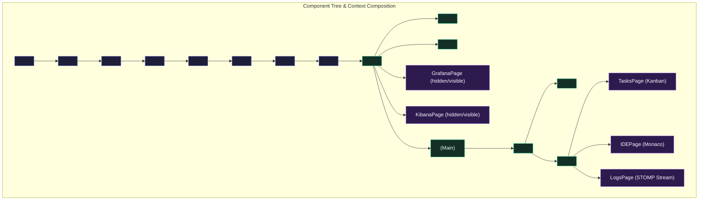

# React Architecture & Frontend System Design

## 1. Architectural Overview & Design Philosophy

The DevOps Suite frontend is a modern, high-performance Single Page Application (SPA) built with **React 18**, compiled and bundled using **Vite**, and styled utility-first via **Tailwind CSS**. Designed to operate in mission-critical developer tooling environments, it delivers sub-second navigation, live operational observability (Prometheus/Grafana, Elasticsearch/Kibana), real-time STOMP-over-WebSocket collaboration (Kanban task updates, execution log streaming), and full Monaco-based in-browser IDE workflows.

```
+---------------------------------------------------------------------------------------------------------+
|                                        Browser Client (React 18 SPA)                                     |
|                                                                                                         |
|  +---------------------------------------------------------------------------------------------------+  |
|  |                                  Context / State Management Hierarchy                             |  |
|  |  [ThemeProvider] -> [Router] -> [AuthProvider] -> [WebSocketProvider] ->                         |  |
|  |  [NotificationProvider] -> [EditorProvider] -> [ProjectsProvider]                                 |  |
|  +---------------------------------------------------------------------------------------------------+  |
|                                                     |                                                   |
|                         +---------------------------+---------------------------+                       |
|                         |                                                       |                       |
|                         v                                                       v                       |
|             +-----------------------+                               +-----------------------+           |
|             |  Public Route Tree    |                               | Protected Route Tree  |           |
|             |  (/login, /register)  |                               | (Guarded Session)     |           |
|             |  - AuthLayout         |                               +-----------------------+           |
|             +-----------------------+                                           |                       |
|                                                         +-----------------------+-----------------------+
|                                                         |                                               |
|                                                         v                                               v
|                                             +-----------------------+                       +-----------------------+
|                                             |      MainLayout       |                       |   Standalone IDE      |
|                                             |  - Sidebar / Header   |                       |  (/editor route)      |
|                                             |  - ProjectLayout      |                       |  - Monaco Engine      |
|                                             |  - Grafana/Kibana Tab |                       |  - Tmpfs Container Ex |
|                                             +-----------------------+                       +-----------------------+
|                                                         |                                               |
+---------------------------------------------------------|-----------------------------------------------|-------+
                                                          | HTTP REST (Axios)                             | STOMP / WSS (SockJS)
                                                          v                                               v
                                            +---------------------------+                   +---------------------------+
                                            | Spring Boot 3 Monolith    |                   | Ephemeral Sandbox Docker  |
                                            | Port 8081 (Docker: 8082)  |                   | Network: none, ReadOnly   |
                                            +---------------------------+                   +---------------------------+
```

### Core Architecture Pillars

1. **Deterministic State Inversion & Context Scoping**: State is separated along lifecycle boundaries. Ephemeral UI states remain local to React components; global authentication, real-time socket connections, and notifications reside in carefully stratified Context providers.
2. **Strict Route Boundaries & Lazy Code Splitting**: Heavy dependencies like Monaco Editor (`@monaco-editor/react`), charting engines (`recharts`), Markdown parser (`marked`/`dompurify`), and operational iframe dashboards are split into on-demand asynchronous chunks using `React.lazy()` and `<Suspense>`.
3. **Multi-Tier Layout Abstractions**: Layouts act as structural view controllers (`MainLayout`, `ProjectLayout`, `AuthLayout`), managing dynamic viewport constraints, responsive sidebar drawers, persistent iframe preservation, and nested tab bars.
4. **Resilient Network Layer**: Axios instance with automated request interception injecting JWT bearer tokens and `X-Project-Id` headers alongside response interceptors coordinating token refreshes with circuit breakers on consecutive `401 Unauthorized` states.
5. **Asset Standardization**: Strictly controlled asset consumption utilizing enumerated SVGs (`NN_name.svg`) styled through CSS variables and SVG mask filters instead of bloated, un-tree-shakable third-party icon packages.

---

## 2. Directory Hierarchy Under `frontend/src/`

The frontend repository enforces a strict, modular separation of concerns. Every directory has an unambiguous responsibility, preventing circular dependencies and isolating side effects.

```
frontend/src/
|-- api/                         # Axios client instances & typed domain API services
|   |-- client.js                # Base Axios instance with request/response interceptors & token refresh
|   |-- authApi.js               # Login, registration, token refresh, OAuth endpoints
|   |-- projectApi.js            # Project CRUD, members, and metadata endpoints
|   |-- taskApi.js               # Kanban tasks, column movements, and assignees
|   |-- codeApi.js               # Code execution triggers and sandbox dispatchers
|   |-- userApi.js               # Profile, avatar, and user management APIs
|   |-- adminApi.js              # Admin metrics, audit log fetching, and role modifications
|   `-- notificationApi.js       # Notification retrieval, mark-as-read endpoints
|-- assets/                      # Raw design assets and enumerated SVGs (NN_name.svg)
|   |-- 07_dashboard.svg         # Primary navigation icons
|   |-- 08_folder.svg
|   |-- 09_notification_bell.svg
|   |-- 10_metrics.svg
|   |-- 12_lightning.svg
|   |-- 39_grafana.svg
|   |-- 40_kibana.svg
|   |-- 41_users.svg
|   |-- 42_logo.svg
|   |-- 45_google.svg
|   `-- 46_github.svg
|-- components/                  # Reusable UI building blocks
|   |-- common/                  # Atomic primitives: Button, Input, Modal, Spinner, Dropdown, Badge
|   |-- layout/                  # Structural layouts: MainLayout, Sidebar, Header, ProjectLayout, ProjectHeaderNav, AuthLayout
|   |-- tasks/                   # Kanban boards, TaskCard, TaskColumn, TaskDetailModal
|   |-- code/                    # Monaco editor wrapper, LanguageSelector, OutputTerminal, ExecutionStats
|   |-- projects/                # ProjectCard, ProjectGrid, MemberModal, CreateProjectDialog
|   `-- notifications/           # NotificationDropdown, NotificationItem, ToastPresenter
|-- context/                     # React Context providers and custom hook accessors
|   |-- AuthContext.jsx          # Auth status, user entity, JWT claims, role checks
|   |-- WebSocketContext.jsx     # SockJS/STOMP client connection, connection status
|   |-- NotificationContext.jsx  # Real-time alert subscriptions, unread badges
|   |-- EditorContext.jsx        # Active file buffer, language mode, terminal outputs
|   |-- ProjectsContext.jsx      # Active project cache, recent project navigation
|   `-- ThemeContext.jsx         # Dark/Light CSS variable injection, system preference sync
|-- hooks/                       # Custom reusable behavioral hooks
|   |-- useAuth.js               # Shortcut accessor for AuthContext
|   |-- useWebSocket.js          # Shortcut accessor for WebSocketContext
|   |-- useDebounce.js           # Debounced input handling (search, Monaco auto-save)
|   |-- useLocalStorage.js       # Type-safe, reactive LocalStorage synchronization
|   `-- useProjectSubscription.js# STOMP destination subscription lifecycle hook
|-- pages/                       # Route-level views loaded lazily via React Router
|   |-- Auth/                    # LoginPage, RegisterPage, ForgotPasswordPage, ResetPasswordPage, GitHubCallbackPage
|   |-- Dashboard/               # Aggregated metrics, recent projects, assigned task shortcuts
|   |-- Projects/                # ProjectsPage (list/grid), ProjectDetailPage (overview)
|   |-- Tasks/                   # TasksPage (full Kanban board view)
|   |-- CodeEditor/              # Standard inline code editor page
|   |-- IDE/                     # IDEPage (project scoped) & FullScreenIDEPage (standalone distraction-free)
|   |-- LogsPage/                # Real-time WebSocket log streaming terminal
|   |-- Notifications/           # Full notification history list
|   |-- Profile/                 # User settings, password reset, security preferences
|   |-- Admin/                   # AdminUsersPage (RBAC user management & activity audits)
|   |-- Grafana/                 # Embedded Grafana iframe wrapper with session persistence
|   `-- Kibana/                  # Embedded Kibana iframe wrapper with session persistence
|-- services/                    # Non-React singleton adapters and helpers
|   |-- authService.js           # LocalStorage token accessors and JWT decoding utilities
|   `-- websocketService.js      # StompJs Client setup, connection heartbeat, reconnect retry loops
|-- utils/                       # General-purpose utility helpers
|   |-- cn.js                    # clsx utility for conditional Tailwind class strings
|   |-- date.js                  # Date formatting, relative timestamps (timeAgo)
|   `-- validation.js            # Input validators (email, passwords, slug formats)
|-- App.jsx                      # Route declarations, route guards, context composition tree
|-- main.jsx                     # Vite entry point executing ReactDOM.createRoot
`-- index.css                    # Tailwind directives and CSS theme variables (--surface-base, etc.)
```

---

## 3. Routing Structure & Route Guards in React Router

The application uses **React Router v6** (`react-router-dom`) with declarative nested routes declared in [App.jsx](file:///d:/Projects/DevOps%20Suite/frontend/src/App.jsx). Routing balances granular accessibility, strict access control, and asynchronous page chunk loading.

### Route Guard Implementations

#### 1. `PublicRoute` Guard
Prevents authenticated users from seeing landing/login screens. If a user already possesses an active session, they are automatically forwarded to `/` (Dashboard).

```jsx
const PublicRoute = ({ children }) => {
  const { isAuthenticated, loading } = useAuth();

  if (loading) {
    return (
      <div className="min-h-screen flex items-center justify-center">
        <Spinner size="lg" />
      </div>
    );
  }

  return !isAuthenticated ? <>{children}</> : <Navigate to="/" replace />;
};
```

#### 2. `ProtectedRoute` Guard
Guarantees that unauthenticated anonymous traffic cannot access internal application layouts, services, or data.

```jsx
const ProtectedRoute = ({ children }) => {
  const { isAuthenticated, loading } = useAuth();

  if (loading) {
    return (
      <div className="min-h-screen flex items-center justify-center">
        <Spinner size="lg" />
      </div>
    );
  }

  return isAuthenticated ? <>{children}</> : <Navigate to="/login" replace />;
};
```

#### 3. `AdminRoute` Guard
Enforces Role-Based Access Control (RBAC). It evaluates the user's role profile (`ROLE_ADMIN`). Non-admin authenticated accounts attempting to reach administrative endpoints are redirected safely to `/` without leaking admin UI controls.

```jsx
const AdminRoute = ({ children }) => {
  const { isAuthenticated, isAdmin, loading } = useAuth();

  if (loading) {
    return (
      <div className="min-h-screen flex items-center justify-center">
        <Spinner size="lg" />
      </div>
    );
  }

  if (!isAuthenticated) return <Navigate to="/login" replace />;
  if (!isAdmin) return <Navigate to="/" replace />;
  return <>{children}</>;
};
```

### Route Hierarchy Mermaid Diagram

```mermaid
flowchart TD
    AppRoot["App.jsx (<Router>)"] --> SuspenseWrapper["<Suspense fallback={<Spinner />}>"]
    SuspenseWrapper --> RoutesRoot["<Routes>"]

    subgraph PublicRoutes ["Public Route Tree (PublicRoute Guard)"]
        RoutesRoot -->|"/login"| Login["LoginPage"]
        RoutesRoot -->|"/register"| Register["RegisterPage"]
        RoutesRoot -->|"/forgot-password"| Forgot["ForgotPasswordPage"]
        RoutesRoot -->|"/reset-password"| Reset["ResetPasswordPage"]
        RoutesRoot -->|"/auth/github/callback"| Github["GitHubCallbackPage"]
    end

    subgraph ProtectedRoot ["Protected Route Tree (ProtectedRoute Guard)"]
        RoutesRoot -->|"MainLayout Wrapper"| MainLayout["<MainLayout />"]
        RoutesRoot -->|"/editor"| StandaloneIDE["FullScreenIDEPage (Standalone)"]
    end

    subgraph AppPages ["Standard App Pages (Nested in MainLayout)"]
        MainLayout -->|"/"| Dashboard["DashboardPage"]
        MainLayout -->|"/projects"| ProjectsList["ProjectsPage"]
        MainLayout -->|"/notifications"| Notifications["NotificationsPage"]
        MainLayout -->|"/profile"| Profile["ProfilePage"]
        MainLayout -->|"/users/:userId"| UserProfile["ProfilePage"]
    end

    subgraph ProjectSubroutes ["Project Subroutes (Nested in ProjectLayout)"]
        MainLayout -->|"/projects/:id"| ProjectLayout["<ProjectLayout />"]
        ProjectLayout -->|"index"| ProjectDetail["ProjectDetailPage (Overview)"]
        ProjectLayout -->|"tasks"| Tasks["TasksPage (Kanban)"]
        ProjectLayout -->|"code"| IDE["IDEPage (Project Workspace)"]
        ProjectLayout -->|"logs"| Logs["LogsPage (STOMP Stream)"]
    end

    subgraph AdminSubroutes ["Admin RBAC Routes (AdminRoute Guard)"]
        MainLayout -->|"/admin/users"| AdminUsers["AdminUsersPage"]
        MainLayout -->|"/grafana"| GrafanaFrame["GrafanaPage (Persistent iframe)"]
        MainLayout -->|"/kibana"| KibanaFrame["KibanaPage (Persistent iframe)"]
    end

    RoutesRoot -->|"*"| CatchAll["<Navigate to='/' replace />"]

    classDef guard fill:#1e293b,stroke:#3b82f6,stroke-width:2px,color:#f8fafc;
    classDef public fill:#064e3b,stroke:#10b981,stroke-width:2px,color:#f8fafc;
    classDef page fill:#312e81,stroke:#6366f1,stroke-width:2px,color:#f8fafc;
    classDef admin fill:#7f1d1d,stroke:#ef4444,stroke-width:2px,color:#f8fafc;

    class ProtectedRoot,PublicRoutes guard;
    class Login,Register,Forgot,Reset,Github public;
    class Dashboard,ProjectsList,ProjectDetail,Tasks,IDE,Logs,Notifications,Profile,UserProfile,StandaloneIDE page;
    class AdminUsers,GrafanaFrame,KibanaFrame admin;
```



---

## 4. Code Splitting, Asynchronous Imports & `<Suspense>`

In standard production builds, shipping large dependencies like Monaco Editor, Recharts, and STOMP clients in a monolithic `index.js` bundle drastically harms Largest Contentful Paint (LCP) and First Input Delay (FID).

DevOps Suite solves this using **dynamic ES module imports** combined with `React.lazy()` and `<Suspense>`.

### Named Export Unwrapping Pattern

Vite produces ES modules that typically export named components rather than default exports. To lazy-load named exports cleanly without modifying component files to export default, DevOps Suite unwraps module promises:

```jsx
// App.jsx
import { Suspense, lazy } from 'react';

// Dynamically import module and project the named export to 'default'
const DashboardPage = lazy(() =>
  import('./pages/Dashboard').then((m) => ({ default: m.DashboardPage }))
);
const IDEPage = lazy(() =>
  import('./pages/IDE').then((m) => ({ default: m.IDEPage }))
);
const FullScreenIDEPage = lazy(() =>
  import('./pages/IDE').then((m) => ({ default: m.FullScreenIDEPage }))
);
const AdminUsersPage = lazy(() =>
  import('./pages/Admin/AdminUsersPage').then((m) => ({ default: m.AdminUsersPage }))
);
```

### Suspense Fallback Strategy
A single top-level `<Suspense>` boundary wraps the `<Routes>` hierarchy:

```jsx
const AppRoutes = () => {
  return (
    <Suspense
      fallback={
        <div className="min-h-screen flex items-center justify-center bg-[var(--surface-base)]">
          <Spinner size="lg" />
        </div>
      }
    >
      <Routes>
        {/* Route Definitions */}
      </Routes>
    </Suspense>
  );
};
```

### Performance & Bundle Size Impact

| Module / Component | Static Import Size (Parsed) | Dynamic Import Chunk (Lazy) | Performance Optimization Reason |
| :--- | :--- | :--- | :--- |
| **Monaco Editor** (`@monaco-editor/react`) | ~2.4 MB | `IDEPage.[hash].js` (~180 KB chunk + CDN workers) | Deferred until user visits `/projects/:id/code` or `/editor` |
| **Recharts & D3** | ~420 KB | `Dashboard.[hash].js` (~85 KB chunk) | Only loaded on metrics views |
| **Markdown Parser** (`marked` + `dompurify`) | ~110 KB | `TasksPage.[hash].js` (~35 KB chunk) | Required exclusively when rendering task descriptions |
| **Admin Panel** | ~140 KB | `AdminUsersPage.[hash].js` (~28 KB chunk) | Never loaded by regular developers without `ROLE_ADMIN` |

---

## 5. Layout Wrappers: `MainLayout`, `ProjectLayout`, `AuthLayout`

Layout wrappers in React act as the orchestrators of page chrome, scrolling containers, viewport constraints, and child injection points via React Router's `<Outlet />`.

### 1. `MainLayout`: Multi-Role Shell & Persistent Iframes

[MainLayout.jsx](file:///d:/Projects/DevOps%20Suite/frontend/src/components/layout/MainLayout.jsx) provides the persistent outer application chrome, including:
- Responsive `Sidebar` with mobile slide-over drawer behavior.
- Top `Header` containing breadcrumbs, active user profile dropdown, and notification badge.
- Dynamic layout modes based on route matching (`isFullHeight`). Normal pages are placed inside a scrollable container (`overflow-y-auto max-w-7xl`), while complex interfaces like the Kanban board and the IDE utilize zero-padding flex containers (`min-h-0 overflow-hidden`).
- **Persistent Iframe Retention for Grafana & Kibana**: Traditional router transitions unmount components, discarding internal iframe state and forcing complete reload and re-authentication loops. `MainLayout` uses conditional visibility (`hidden` class) rather than unmounting for monitoring views:

```jsx
// MainLayout.jsx - Iframe Preservation Pattern
const isGrafana = location.pathname === '/grafana';
const isKibana  = location.pathname === '/kibana';

if (isGrafana && !grafanaVisited) setGrafanaVisited(true);
if (isKibana  && !kibanaVisited)  setKibanaVisited(true);

{/* Persistent Grafana iframe: preserved in DOM once loaded */}
{isAdmin && grafanaVisited && (
  <div className={isGrafana ? 'flex-1 flex flex-col min-h-0 overflow-hidden' : 'hidden'}>
    <GrafanaPage />
  </div>
)}

{/* Normal routes rendered via standard Outlet */}
{!isGrafana && !isKibana && (
  isFullHeight ? (
    <main className="flex-1 flex flex-col min-h-0 overflow-hidden page-enter">
      <Outlet />
    </main>
  ) : (
    <main className="flex-1 overflow-y-auto page-enter">
      <div className="max-w-7xl mx-auto p-4 lg:p-6">
        <Outlet />
      </div>
    </main>
  )
)}
```

### 2. `ProjectLayout`: Context Sharing & Scoped Tab Navigation

[ProjectLayout.jsx](file:///d:/Projects/DevOps%20Suite/frontend/src/components/layout/ProjectLayout.jsx) wraps all route operations beneath `/projects/:id/*`.
- Extracts `projectId` from URL parameters using `useParams()`.
- Fetches project metadata via `projectApi.getById(projectId)`.
- Renders the `ProjectHeaderNav` tab bar (`Overview`, `Task Board`, `Code Editor`, and admin-only `Logs`).
- Shares project state and refetch capabilities down to child routes without prop drilling using `<Outlet context={{ project, refreshProject: fetchProject }} />`.

```jsx
// Child component access inside TasksPage or IDEPage:
import { useOutletContext } from 'react-router-dom';

export const TasksPage = () => {
  const { project, refreshProject } = useOutletContext();
  // Accesses project.name, project.id directly
};
```

### 3. `AuthLayout`: Split-Screen Brand Surface

[AuthLayout.jsx](file:///d:/Projects/DevOps%20Suite/frontend/src/components/layout/AuthLayout.jsx) wraps anonymous authentication pages (`/login`, `/register`, `/forgot-password`, `/reset-password`).
- Features a split-view presentation: a deep dark brand hero panel (`bg-gray-900`) on the left showcasing the platform branding, logo, and core capability highlights.
- Right container hosting user entry forms wrapped in `bg-[var(--surface-base)]`.
- Responsive breakpoint design: collapses to a compact top branding banner on mobile screens (`flex-col lg:flex-row`).

### Component Tree Mermaid Diagram



---

## 6. SVG Icon Standards vs Inline SVGs & Emojis

DevOps Suite adheres to an engineering standard regarding UI iconography to prevent CSS bloat, memory leaks, and visual inconsistencies across client platforms.

### The Problem With Anti-Patterns

1. **Inline SVGs Scattered in JSX**:
   - Bloats JavaScript bundles with hundreds of kilobytes of path string literals (`<path d="M12 2C6.48 2..." />`).
   - Forces the React virtual DOM reconciler to inspect and diff complex SVG DOM subtrees on every component re-render.
2. **Third-Party Heavy Libraries (e.g., FontAwesome, Lucide full imports)**:
   - Accidental tree-shaking failures often pull thousands of unused icons into vendor bundles.
3. **Emojis as Functional UI Glyphs**:
   - Emojis render wildly differently across operating systems (Apple San Francisco vs Windows Segoe UI Emoji vs Android Noto Color Emoji), resulting in broken layouts, misaligned baselines, and unprofessional aesthetics.

### The DevOps Suite Enumerated Asset Standard (`NN_name.svg`)

All icons reside in `frontend/src/assets/` using a zero-padded numerical prefix denoting their catalog identifier:
- `07_dashboard.svg`
- `08_folder.svg`
- `09_notification_bell.svg`
- `10_metrics.svg`
- `12_lightning.svg`
- `39_grafana.svg`
- `40_kibana.svg`
- `41_users.svg`
- `42_logo.svg`
- `45_google.svg`
- `46_github.svg`

#### Asset Consumption & Styling Pattern
Icons are imported as static asset URLs managed by Vite's asset bundler. Vite automatically hashes and serves them with long-term cache headers (`Cache-Control: immutable, max-age=31536000`), or inlines small SVGs as data URIs.

```jsx
// Sidebar.jsx
import dashboardIcon from '../../assets/07_dashboard.svg';
import { cn } from '../../utils';

export const NavLink = ({ link, isActive }) => (
  <Link to={link.path} className={cn(/* Tailwind styles */)}>
    
    <span>{link.label}</span>
  </Link>
);
```

#### Monochromatic Theming via CSS Mask
For icons requiring dynamic color tinting according to theme variables (`--accent`, `--text-primary`), the project uses the CSS `mask-image` technique:

```jsx
export const DynamicMaskIcon = ({ iconUrl, className = 'bg-current w-4 h-4' }) => (
  <span
    aria-hidden="true"
    className={cn('inline-block shrink-0', className)}
    style={{
      maskImage: `url(${iconUrl})`,
      WebkitMaskImage: `url(${iconUrl})`,
      maskRepeat: 'no-repeat',
      WebkitMaskRepeat: 'no-repeat',
      maskPosition: 'center',
      WebkitMaskPosition: 'center',
      maskSize: 'contain',
      WebkitMaskSize: 'contain',
    }}
  />
);
```

---

## 7. Deep-Dive Architectural Interview Questions & Answers

### 🟢 Basic Concepts

#### Q1: Why did DevOps Suite adopt Vite instead of Create React App (CRA)?
**Answer:**
DevOps Suite replaced legacy Webpack-based tooling (CRA) with Vite for four fundamental reasons:
1. **Instant Cold Server Starts via Native ESM**: CRA bundles the entire project graph in memory before serving. Vite serves source code over native ES modules (`<script type="module">`). It only parses and transforms files requested by the browser on demand.
2. **Lightning-Fast Hot Module Replacement (HMR)**: Vite offloads dependency pre-bundling to `esbuild` (written in Go, 10-100x faster than Webpack). As the codebase expanded across dozens of pages and components, HMR updates in Vite remained instantaneous (<50ms), whereas Webpack HMR degraded linearly with bundle size.
3. **Rollup Production Bundling**: Vite uses Rollup under the hood for production builds, providing superior tree-shaking, automated chunk-splitting strategies, and cleaner CSS extraction.
4. **Active Ecosystem & Maintenance**: CRA has been deprecated by the React team and community, lacking support for modern Node versions and modern React features.

#### Q2: How does the application prevent unauthenticated users from accessing protected views?
**Answer:**
Access is gated at the routing boundary using the `ProtectedRoute` component declared in [App.jsx](file:///d:/Projects/DevOps%20Suite/frontend/src/App.jsx). 
1. When a user requests a URL such as `/projects`, the router hits `ProtectedRoute`.
2. `ProtectedRoute` executes `useAuth()`, reading `isAuthenticated` and `loading` states from [AuthContext.jsx](file:///d:/Projects/DevOps%20Suite/frontend/src/context/AuthContext.jsx).
3. If `loading === true` (initial token validation in progress against `/api/auth/me`), it renders a full-page loading spinner.
4. If `isAuthenticated === false`, it renders `<Navigate to="/login" replace />`. The `replace` flag replaces the current history entry rather than appending, preventing the user from getting stuck in an infinite redirect loop when clicking the browser's "Back" button.
5. If `isAuthenticated === true`, it renders the requested route wrapped inside `<MainLayout />`.

---

### 🟡 Intermediate Architecture

#### Q3: How is global state managed in DevOps Suite without introducing heavy Redux stores for every domain?
**Answer:**
DevOps Suite leverages a **Context Composition Pyramid** combined with local state encapsulation:
- **Global Identity (`AuthContext`)**: Managed using `useReducer` to enforce state transitions (`LOGIN_SUCCESS`, `LOGOUT`, `SET_USER`, `SET_LOADING`). Stores JWT tokens in `localStorage` and memory.
- **WebSocket Transport (`WebSocketContext`)**: Owns the active SockJS/STOMP client instance. Exposes connectivity flags and lifecycle connection management tied strictly to authentication status.
- **Project Scope (`ProjectsContext`)**: Maintains the active project ID and recent project cache for navigation.
- **Editor State (`EditorContext`)**: Coordinates active editor file buffers, language selections, and terminal stdout buffers for the Monaco editor.
- **Theme (`ThemeContext`)**: Synchronizes dark/light CSS variables with root document attributes.

```jsx
// Context Composition in App.jsx
<ThemeProvider>
  <Router>
    <AuthProvider>
      <WebSocketProvider>
        <NotificationProvider>
          <EditorProvider>
            <ProjectsProvider>
              <AppRoutes />
            </ProjectsProvider>
          </EditorProvider>
        </NotificationProvider>
      </WebSocketProvider>
    </AuthProvider>
  </Router>
</ThemeProvider>
```

**Why not standard Redux for everything?**
Global state in DevOps Suite consists of transport layers and session metadata. Domain entities like Kanban tasks or log streaming lines undergo high-frequency updates over WebSockets. Funneling ephemeral streaming logs through a global Redux store causes unnecessary root-level selector recalculations and renders. Instead, domain data is localized to the active page (`TasksPage`, `LogsPage`) using local React state and specialized subscription hooks.

#### Q4: Explain the difference between `IDEPage` inside `ProjectLayout` and the standalone `FullScreenIDEPage`.
**Answer:**
DevOps Suite supports two distinct code editing experiences:
1. **Embedded Project IDE (`/projects/:id/code`)**:
   - Renders inside `MainLayout` and `ProjectLayout`.
   - Constrained by the application header, sidebar, and `ProjectHeaderNav` tab bar.
   - Ideal for developers moving between Kanban tasks, project overviews, and quick file adjustments.
   - Accesses project context via `useOutletContext()`.
2. **Standalone Fullscreen IDE (`/editor`)**:
   - Completely bypasses `MainLayout` and `ProjectLayout` in `App.jsx`:
     ```jsx
     <Route
       path="/editor"
       element={
         <ProtectedRoute>
           <FullScreenIDEPage />
         </ProtectedRoute>
       }
     />
     ```
   - Renders directly against the entire viewport (`100vw`, `100vh`) with its own integrated minimalist toolbar, Monaco editor instance, and collapsable terminal pane.
   - Eliminates layout distractions and reclaims vertical and horizontal real estate for extended programming sessions.

---

### 🔴 Advanced Frontend Engineering

#### Q5: How does `MainLayout` keep embedded Grafana and Kibana iframes alive across router transitions?
**Answer:**
**The Challenge**:
In React Router, navigating from `/grafana` to `/projects` normally unmounts the `<GrafanaPage />` component. When the user navigates back to `/grafana`, the component remounts, generating a new `<iframe>` DOM node. This destroys iframe memory, terminates ongoing network requests, causes visual white flashes, and forces Grafana to re-execute reverse-proxy authentication handshakes and dashboard initialization queries.

**The DevOps Suite Solution**:
`MainLayout` utilizes a **DOM Preservation Pattern** using React state flags (`grafanaVisited`, `kibanaVisited`) and CSS display rules:

```jsx
// MainLayout.jsx
const isGrafana = location.pathname === '/grafana';
const isKibana  = location.pathname === '/kibana';

// Latch the visited flag: once visited, the iframe remains mounted
if (isGrafana && !grafanaVisited) setGrafanaVisited(true);
if (isKibana  && !kibanaVisited)  setKibanaVisited(true);

{/* Retain Grafana in the DOM tree; toggle visibility via CSS */}
{isAdmin && grafanaVisited && (
  <div className={isGrafana ? 'flex-1 flex flex-col min-h-0 overflow-hidden' : 'hidden'}>
    <GrafanaPage />
  </div>
)}
```

**Architectural Benefits**:
- When `isGrafana === false`, the container receives the Tailwind class `hidden` (`display: none;`). The iframe stays mounted in the browser's DOM tree, retaining its internal scroll positions, active telemetry filters, and cached metrics.
- Navigation back to `/grafana` is instantaneous (0ms render latency), delivering a native desktop application experience.
- Iframes are strictly guarded by `isAdmin`: non-admin users never trigger iframe initialization.

#### Q6: How do Axios interceptors manage JWT refresh cycles and project-scoped tracing headers?
**Answer:**
The central Axios client in [client.js](file:///d:/Projects/DevOps%20Suite/frontend/src/api/client.js) manages request and response interceptors:

1. **Request Interception**:
   - **Authentication**: Extracts `accessToken` from `localStorage` and injects `Authorization: Bearer <token>`.
   - **Context Tracing Header**: Uses a regular expression against `window.location.pathname` to check if the user is currently browsing within a project route (`/projects/{uuid}`). If matched, it automatically injects `X-Project-Id: {uuid}`:
     ```javascript
     const PROJECT_UUID_RE = /\/projects\/([0-9a-f]{8}-[0-9a-f]{4}-[0-9a-f]{4}-[0-9a-f]{4}-[0-9a-f]{12})/i;
     const match = PROJECT_UUID_RE.exec(window.location.pathname);
     if (match && config.headers) {
       config.headers['X-Project-Id'] = match[1];
     }
     ```
   - This ensures the Spring Boot backend can associate incoming queries directly with project log streams without requiring every UI method to manually pass project IDs.

2. **Response Interception & Token Refresh Circuit Breaker**:
   - Catches HTTP `401 Unauthorized`.
   - Checks if `originalRequest._retry` is already true. If so, it halts immediately to prevent infinite refresh retry loops.
   - Ignores auth endpoints (`/auth/login`, `/auth/register`) to let credential failures pass directly to the form handler.
   - Reads `refreshToken` and dispatches `axios.post('/api/auth/refresh', { refreshToken })`.
   - Upon receiving a fresh access token, updates `localStorage`, attaches the new header to `originalRequest.headers.Authorization`, and replays the original request transparently.
   - If the refresh token has expired or is invalid, it clears `localStorage` and issues a hard redirect to `/login`.

---

### ⚫ Expert System Design & Performance

#### Q7: Detail the end-to-end lifecycle of a real-time log streaming session in `LogsPage`. How do React state, STOMP clients, and DOM virtualization interact?
**Answer:**

```
[Spring Boot Logback Appender] 
             |
             v (Elasticsearch / Redis Event)
[In-JVM Event / SimpMessagingTemplate]
             |
             v STOMP frame: /topic/logs/{projectId}
[WebSocketProvider (SockJS Client)]
             |
             v onMessage callback (LogsPage)
[Batch Buffer: 100ms Debounce Queue]
             |
             v React State Update (setLogs)
[DOM Terminal with Max Buffer Cap (10,000 lines)]
```

1. **Connection Lifecycle**:
   - `LogsPage` extracts `projectId` via `useOutletContext()`.
   - Verifies active STOMP connection via `useWebSocket()`.
   - Executes STOMP subscription on destination `/topic/logs/${projectId}`.
2. **High-Throughput Ingestion & React Re-render Throttling**:
   - **Problem**: When a sandboxed Docker container executes a build script or rapid loop, it can output thousands of log lines per second. Calling React's `setLogs(prev => [...prev, newLog])` for every single WebSocket frame causes severe thread contention, locking the browser UI thread and dropping frame rates to 0 FPS.
   - **Solution (Micro-Batching Buffer)**: Incoming frames are pushed into an in-memory mutable queue (`useRef([])`). A timer (`requestAnimationFrame` or `setInterval` at 100ms intervals) flushes the accumulated chunk into the React state in a single batch.
3. **Memory Bounding & GC Management**:
   - To prevent unbounded memory consumption during massive builds, the log buffer enforces a strict circular cap (e.g., maximum 5,000 lines). Older log lines are sliced off (`logs.slice(-5000)`).
4. **Subscription Teardown**:
   - The `useEffect` cleanup hook calls `subscription.unsubscribe()`. If the user navigates away, the socket subscription is released immediately, preventing zombie memory leaks.

#### Q8: How does the Tailwind CSS configuration interact with runtime theme switching without triggering CSS-in-JS performance bottlenecks?
**Answer:**
DevOps Suite avoids CSS-in-JS libraries (such as `styled-components` or `emotion`), which dynamically inject `<style>` tags at runtime and cause continuous style recalculations during re-renders.

Instead, the application pairs **Tailwind CSS compile-time utility classes** with **CSS Custom Properties (Variables)**:
1. `index.css` defines root semantic color variables under light and dark selectors:
   ```css
   :root {
     --surface-base: #f8fafc;
     --surface-raised: #ffffff;
     --surface-sunken: #f1f5f9;
     --text-primary: #0f172a;
     --accent: #2563eb;
     --accent-subtle: #dbeafe;
     --border-subtle: #e2e8f0;
   }

   .dark {
     --surface-base: #090d16;
     --surface-raised: #0f172a;
     --surface-sunken: #020617;
     --text-primary: #f8fafc;
     --accent: #3b82f6;
     --accent-subtle: #1e293b;
     --border-subtle: #1e293b;
   }
   ```
2. In components, Tailwind accesses these variables directly through arbitrary value syntax or utility mappings:
   ```jsx
   <div className="bg-[var(--surface-base)] text-[var(--text-primary)] border-b border-[var(--border-subtle)]">
   ```
3. [ThemeContext.jsx](file:///d:/Projects/DevOps%20Suite/frontend/src/context/ThemeContext.jsx) toggles the `dark` class on `document.documentElement` (`<html class="dark">`).
4. **Performance Result**: Theme switching executes in **O(1)** time across the entire DOM tree without triggering React component reconciliations, style sheet re-parses, or JavaScript execution.

---

## 8. Quick Reference Summary Table

| Architectural Concern | Implementation Strategy | File / Location Reference | Key Design Rationale |
| :--- | :--- | :--- | :--- |
| **Framework / Engine** | React 18.2 + Vite 8.x | [package.json](file:///d:/Projects/DevOps%20Suite/frontend/package.json), `main.jsx` | Sub-50ms HMR, native ES module compilation, Rollup tree-shaking |
| **Routing** | React Router v6 | [App.jsx](file:///d:/Projects/DevOps%20Suite/frontend/src/App.jsx) | Declarative nested routes, `<Outlet />` layout injection, relative path resolution |
| **Route Guards** | `PublicRoute`, `ProtectedRoute`, `AdminRoute` | [App.jsx](file:///d:/Projects/DevOps%20Suite/frontend/src/App.jsx#L31-L75) | Session loading spinner, login redirection, RBAC (`ROLE_ADMIN`) isolation |
| **Code Splitting** | `React.lazy()` + Dynamic Imports | [App.jsx](file:///d:/Projects/DevOps%20Suite/frontend/src/App.jsx#L13-L30) | Monaco Editor and charting bundles loaded on-demand; named export unwrapping |
| **Suspense Fallback** | `<Suspense fallback={<Spinner size="lg" />}>` | [App.jsx](file:///d:/Projects/DevOps%20Suite/frontend/src/App.jsx#L78-L84) | Prevents blank page flashing during asynchronous chunk downloads |
| **Main App Shell** | `MainLayout` | [MainLayout.jsx](file:///d:/Projects/DevOps%20Suite/frontend/src/components/layout/MainLayout.jsx) | Responsive drawer sidebar, persistent iframe caching, dynamic scroll wrappers |
| **Project Chrome** | `ProjectLayout` + `ProjectHeaderNav` | [ProjectLayout.jsx](file:///d:/Projects/DevOps%20Suite/frontend/src/components/layout/ProjectLayout.jsx) | Scoped project data fetch, tab bar navigation, context passing via `<Outlet context>` |
| **Auth Surface** | `AuthLayout` | [AuthLayout.jsx](file:///d:/Projects/DevOps%20Suite/frontend/src/components/layout/AuthLayout.jsx) | Dark split-screen brand hero, mobile-responsive layout collapse |
| **Icon Standards** | Enumerated SVGs (`NN_name.svg`) | `frontend/src/assets/` | Static hashed caching, dark-mode SVG invert filters, zero icon library bloat |
| **HTTP Interceptor** | Axios Interceptors (Request / Response) | [client.js](file:///d:/Projects/DevOps%20Suite/frontend/src/api/client.js) | JWT bearer token injection, automated `X-Project-Id` tagging, 401 token refresh |
| **Real-Time Layer** | StompJS + SockJS over WebSocket | [WebSocketContext.jsx](file:///d:/Projects/DevOps%20Suite/frontend/src/context/WebSocketContext.jsx) | Auth-coupled connection lifecycle, auto-reconnect, scoped channel subscriptions |
| **Theme System** | CSS Custom Properties + Tailwind CSS | `index.css`, `ThemeContext.jsx` | Instant O(1) dark/light theme switching with zero CSS-in-JS runtime overhead |
