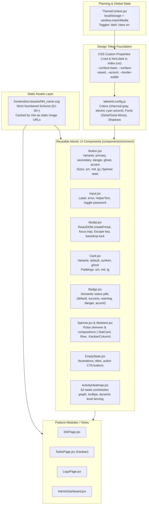
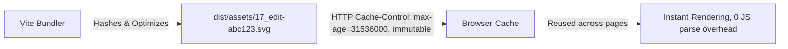
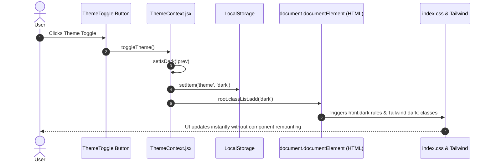
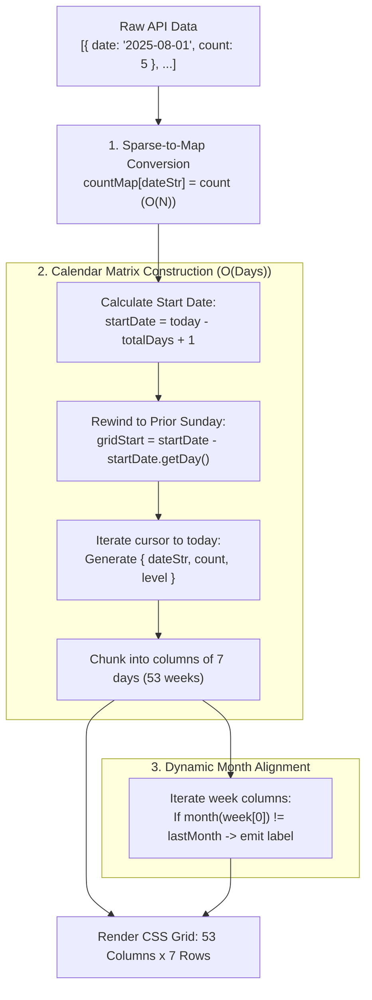

# Frontend UI Components, Tailwind CSS & UX Polish — DevOps Suite

This guide covers the design system, reusable component architecture, styling conventions, accessibility patterns, and interview questions for the **DevOps Suite** frontend.

---

## Architecture Overview & Design System Philosophy

The frontend of DevOps Suite adopts an **atomic design methodology** combined with **Tailwind CSS utility tokens** and **CSS custom properties (variables)**. This architecture ensures strict visual consistency, dark/light theme switching without component remounting, robust accessibility compliance (WCAG 2.1 AA), and zero ad-hoc styling.

### Styling Architecture Diagram



---

## Section 1: Design System & Component Library

All primitive components reside under `frontend/src/components/common/` and are re-exported via an `index.js` barrel file for clean consumer imports.

### Component Catalog Table

| Component | File Path | Key Props | Accessibility & Behaviors | Design Token Usage |
| :--- | :--- | :--- | :--- | :--- |
| **`Button`** | [`Button.jsx`](file:///d:/Projects/DevOps%20Suite/frontend/src/components/common/Button.jsx) | `variant`, `size`, `loading`, `disabled`, `children` | `disabled:cursor-not-allowed`, `focus-visible:ring-2`, `aria-hidden` on internal spinner | `bg-[var(--accent)]`, `hover:bg-[var(--accent-hover)]`, `focus-visible:ring-[var(--accent)]` |
| **`Input`** | [`Input.jsx`](file:///d:/Projects/DevOps%20Suite/frontend/src/components/common/Input.jsx) | `label`, `error`, `helperText`, `type`, `showPasswordToggle`, `id` | Generated deterministic `htmlFor` & `id`, password reveal toggle button with `aria-label`, red border on error | `bg-[var(--surface-sunken)]`, `border-[var(--border-subtle)]`, `focus:border-[var(--accent)]` |
| **`Modal`** | [`Modal.jsx`](file:///d:/Projects/DevOps%20Suite/frontend/src/components/common/Modal.jsx) | `isOpen`, `onClose`, `title`, `children`, `maxWidth` | `createPortal` to `document.body`, `role="dialog"`, `aria-modal="true"`, `aria-labelledby`, focus trapping, Escape key, body scroll lock | `bg-[var(--surface-overlay)]`, `border-[var(--border-subtle)]`, `shadow-dark-lg` |
| **`Card`** | [`Card.jsx`](file:///d:/Projects/DevOps%20Suite/frontend/src/components/common/Card.jsx) | `variant` (default, sunken, ghost), `padding` (none, sm, md, lg) | Structural container, clean semantic nesting | `bg-[var(--surface-raised)]`, `border-[var(--border-subtle)]` |
| **`Badge`** | [`Badge.jsx`](file:///d:/Projects/DevOps%20Suite/frontend/src/components/common/Badge.jsx) | `variant` (default, success, warning, danger, accent) | Compact status badge / pill with high-contrast text | Tailwind semantic colors: `bg-green-100 dark:bg-green-900/30 text-green-800 dark:text-green-300` |
| **`Spinner`** | [`Spinner.jsx`](file:///d:/Projects/DevOps%20Suite/frontend/src/components/common/Spinner.jsx) | `size` (sm, md, lg), `className` | `role="status"`, `aria-label="Loading"`, spinning SVG ring | `text-[var(--accent)]`, `animate-spin` |
| **`Skeleton`** | [`Skeleton.jsx`](file:///d:/Projects/DevOps%20Suite/frontend/src/components/common/Skeleton.jsx) | `className`, subcomponents: `.StatCard`, `.Row`, `.Card`, `.KanbanColumn` | Pure visual skeleton loader, uses CSS keyframe shimmer | Keyframe `skeleton` animation, `bg-[var(--surface-raised)]` |
| **`EmptyState`** | [`EmptyState.jsx`](file:///d:/Projects/DevOps%20Suite/frontend/src/components/common/EmptyState.jsx) | `title`, `description`, `icon`, `action`, `secondaryAction`, `variant` | Decorative icon `aria-hidden="true"`, accessible primary/secondary action buttons | `bg-[var(--surface-sunken)]`, `text-[var(--text-primary)]`, `text-[var(--text-secondary)]` |
| **`ActivityHeatmap`** | [`ActivityHeatmap.jsx`](file:///d:/Projects/DevOps%20Suite/frontend/src/components/common/ActivityHeatmap.jsx) | `data` (sparse array), `loading`, `totalDays` | `role="gridcell"`, `aria-label="YYYY-MM-DD: N runs"`, interactive tooltips | Level classes `bg-gray-100 dark:bg-gray-700` through `bg-green-800` |

---

### Detailed Component Breakdowns

#### 1. Button (`Button.jsx`)
The `Button` component provides standard interaction ergonomics across the platform:
- **Variants:**
  - `primary`: Electric cyan fill with inverted text (`bg-[var(--accent)] text-[var(--surface-base)] dark:text-gray-950`).
  - `secondary`: Neutral raised surface with border (`bg-[var(--surface-raised)] border border-[var(--border-strong)]`).
  - `danger`: High-alert actions (`bg-red-600 hover:bg-red-700 text-white`).
  - `ghost`: Transparent backdrop for subtle inline actions (`hover:bg-[var(--surface-sunken)]`).
  - `accent`: Outlined subtle cyan container.
- **Sizes:** `sm` (height 28px, h-7), `md` (height 36px, h-9), and `lg` (height 44px, h-11).
- **Loading State:** Automatically disables click events, renders an inline spinning SVG, maintains button geometry without layout shift, and preserves accessibility cues.

```jsx
export const Button = ({
  variant = 'primary',
  size = 'md',
  loading = false,
  className,
  disabled,
  children,
  ...props
}) => {
  const base = [
    'inline-flex items-center justify-center font-medium rounded-md',
    'transition-all duration-150',
    'focus:outline-none focus-visible:ring-2 focus-visible:ring-offset-2',
    'focus-visible:ring-[var(--accent)]',
    'active:scale-[0.97]',
    'disabled:opacity-50 disabled:cursor-not-allowed disabled:active:scale-100',
    'select-none',
  ].join(' ');

  return (
    <button
      className={cn(base, variants[variant], sizes[size], className)}
      disabled={disabled || loading}
      {...props}
    >
      {loading && (
        <svg className="animate-spin shrink-0 -ml-0.5 w-4 h-4" fill="none" viewBox="0 0 24 24" aria-hidden="true">
          <circle className="opacity-25" cx="12" cy="12" r="10" stroke="currentColor" strokeWidth="4" />
          <path className="opacity-75" fill="currentColor" d="M4 12a8 8 0 018-8V0C5.373 0 0 5.373 0 12h4z" />
        </svg>
      )}
      {children}
    </button>
  );
};
```

#### 2. Input (`Input.jsx`)
Ensures form inputs meet enterprise standards:
- Auto-generates an accessible `id` and connects it with `label` via `htmlFor`.
- Displays contextual `helperText` or switches to a red error message when validation fails (`error` prop).
- Built-in eye icon toggle for `type="password"`, operating natively with zero external dependencies.

#### 3. Modal (`Modal.jsx`)
A robust modal dialog implementation built on top of `createPortal`:
- **Portal Rendering:** Renders into `document.body` to prevent CSS `overflow: hidden` or `z-index` stacking context clipping from parent elements.
- **Backdrop & Panel:** `bg-black/70` backdrop blur overlay with close-on-click.
- **Focus Management:** Stores `document.activeElement` when opened, shifts focus to the first interactive element inside the modal upon display, and restores focus back to the triggering element when closed.
- **Focus Trapping:** Intercepts `Tab` and `Shift + Tab` events; wraps navigation between the first and last focusable children.
- **Keyboard Navigation:** Listens for `Escape` to trigger `onClose()`.
- **Body Scroll Lock:** Sets `document.body.style.overflow = 'hidden'` while mounted.

#### 4. ActivityHeatmap (`ActivityHeatmap.jsx`)
A 52-week contribution heatmap displaying code run executions:
- Accepts sparse run data: `Array<{ date: "YYYY-MM-DD", count: number }>`.
- Normalizes date ranges into a 53-week matrix (Sunday through Saturday columns).
- Computes month labels dynamically based on week boundaries.
- Assigns 5 activity levels:
  - Level 0: 0 runs (`bg-gray-100 dark:bg-gray-700`)
  - Level 1: 1 run (`bg-green-200`)
  - Level 2: 2–3 runs (`bg-green-400`)
  - Level 3: 4–6 runs (`bg-green-600`)
  - Level 4: 7+ runs (`bg-green-800`)
- Includes an interactive floating tooltip calculating mouse coordinates (`getBoundingClientRect()`).

---

## Section 2: SVG Icon Convention

DevOps Suite enforces a strict convention for vector icons to maintain pristine source code, high runtime performance, and visual uniformity.

### The Strict Rules
1. **NO inline SVGs (`<svg>...</svg>`) in feature components:**
   Inline SVGs bloat JSX files, clutter DOM trees, prevent browser caching, and make diffs hard to review.
2. **NO emojis as UI icons:**
   Emojis render differently across platforms (macOS, Windows, Linux, iOS, Android), lack consistent sizing, and break dark/light contrast rules.
3. **Numbered Asset Directory:**
   All icons reside in `frontend/src/assets/` following a two-digit prefix scheme (`NN_name.svg`).

### Asset Inventory Example

```text
frontend/src/assets/
├── 01_male_user.svg
├── 02_female_user.svg
├── 03_python.svg
├── 04_js.svg
├── 05_java.svg
├── 06_cpp.svg
├── 07_dashboard.svg
├── 08_folder.svg
├── 09_notification_bell.svg
├── 10_metrics.svg
├── 11_terminal.svg
├── 12_play.svg
├── 13_stop.svg
├── 14_settings.svg
├── 15_logout.svg
├── 16_plus.svg
├── 17_edit.svg
├── 18_trash.svg
└── ...
```

### Usage Pattern

```jsx
import editIcon from '../../assets/17_edit.svg';
import trashIcon from '../../assets/18_trash.svg';

export const TaskActions = ({ onEdit, onDelete }) => (
  <div className="flex items-center gap-1">
    <button
      onClick={onEdit}
      className="p-1 rounded hover:bg-[var(--surface-sunken)] text-[var(--text-secondary)]"
      title="Edit Task"
      aria-label="Edit Task"
    >
      
    </button>
    <button
      onClick={onDelete}
      className="p-1 rounded hover:bg-red-500/10 text-red-500"
      title="Delete Task"
      aria-label="Delete Task"
    >
      
    </button>
  </div>
);
```

### Why This Convention?



1. **Browser Caching:** When loaded via ``, SVGs are separate cacheable HTTP assets with long-term cache headers (`immutable`), rather than re-parsed JavaScript AST strings on every bundle execution.
2. **Code Clarity:** Components remain clean JSX representations of UI state, free from 40-line path strings.
3. **Bundle Optimization:** Icons not imported are tree-shaken by Vite; icons reused across 20 components are downloaded only once.
4. **Visual Consistency & Dark Mode Inversion:** SVGs are authored in monochrome. In dark mode, utility classes like `dark:brightness-0 dark:invert` or CSS `mask-image` adapt them cleanly to light/dark themes.

---

## Section 3: Dark Mode & Theming

### Tailwind `darkMode: 'class'` Strategy

In `tailwind.config.js`, the darkMode property is set to `'class'`:
```javascript
export default {
  content: ["./index.html", "./src/**/*.{js,jsx}"],
  darkMode: 'class',
  theme: { ... }
}
```

This ensures Tailwind only activates `dark:...` utility variants when an ancestor element has the `.dark` class. DevOps Suite places this class directly on `document.documentElement` (`<html>`).

### `ThemeContext.jsx` Architecture

```jsx
import { createContext, useContext, useEffect, useState } from 'react';

const ThemeContext = createContext(undefined);

export const ThemeProvider = ({ children }) => {
  const [isDark, setIsDark] = useState(() => {
    const saved = localStorage.getItem('theme');
    if (saved) return saved === 'dark';
    return window.matchMedia('(prefers-color-scheme: dark)').matches;
  });

  useEffect(() => {
    const root = document.documentElement;
    if (isDark) {
      root.classList.add('dark');
    } else {
      root.classList.remove('dark');
    }
    localStorage.setItem('theme', isDark ? 'dark' : 'light');
  }, [isDark]);

  const toggleTheme = () => setIsDark((prev) => !prev);

  return (
    <ThemeContext.Provider value={{ isDark, toggleTheme }}>
      {children}
    </ThemeContext.Provider>
  );
};
```

### CSS Custom Properties & Semantic Tokens

DevOps Suite combines Tailwind utilities with CSS custom properties in `src/index.css`. This hybrid model allows dynamic skinning and avoids hardcoding hexadecimal color literals throughout components.

| Token | Light Mode (`:root`) | Dark Mode (`html.dark`) | Intent / Usage |
| :--- | :--- | :--- | :--- |
| `--surface-base` | `#f8f8f8` | `#0f0f0f` | Main viewport and canvas background |
| `--surface-raised` | `#ffffff` | `#1a1a1a` | Cards, sidebars, panels |
| `--surface-overlay`| `#ffffff` | `#232323` | Modals, popovers, dropdown menus |
| `--surface-sunken` | `#f2f2f2` | `#141414` | Input fields, code block backgrounds, table headers |
| `--border-subtle`  | `#e8e8e8` | `#2a2a2a` | Dividing lines, card borders |
| `--border-strong`  | `#d0d0d0` | `#3d3d3d` | Active borders, input focus states |
| `--text-primary`   | `#111111` | `#f0f0f0` | Headings, primary content (Contrast > 12:1) |
| `--text-secondary` | `#606060` | `#8a8a8a` | Subtext, labels, captions (Contrast > 4.5:1) |
| `--text-muted`     | `#909090` | `#5a5a5a` | Placeholders, disabled states |
| `--accent`         | `#0891b2` (Cyan 600) | `#22d3ee` (Cyan 400) | Interactive accents, buttons, active tabs |
| `--accent-hover`   | `#0e7490` (Cyan 700) | `#06b6d4` (Cyan 500) | Hover feedback |

### Contrast Ratios and Accessibility (WCAG AA)

- **Normal text requirement:** 4.5:1 minimum contrast ratio.
  - Light mode: `#111111` on `#f8f8f8` yields **17.8:1**.
  - Dark mode: `#f0f0f0` on `#0f0f0f` yields **16.2:1**.
- **Large text & UI components:** 3:1 minimum contrast ratio.
  - Borders: `--border-subtle` (`#2a2a2a` on `#0f0f0f`) provides visible boundary demarcation without visual clutter.
- **Focus Rings:** All interactive elements declare `focus-visible:ring-2 focus-visible:ring-[var(--accent)] focus-visible:outline-none`, ensuring users navigating via keyboard can trace focus position.

---

## Section 4: Interview Questions & Answers

### 🟢 Basic Level

#### Q1: How did you design and organize the reusable UI component library in this project?
**Answer:**
We adopted an atomic component model placed under [`frontend/src/components/common/`](file:///d:/Projects/DevOps%20Suite/frontend/src/components/common/). The goal was to provide building blocks that handle common styling, interactions, and accessibility defaults so feature pages (such as [`IDEPage.jsx`](file:///d:/Projects/DevOps%20Suite/frontend/src/pages/IDEPage.jsx) or [`TasksPage.jsx`](file:///d:/Projects/DevOps%20Suite/frontend/src/pages/TasksPage.jsx)) never need to write raw form tags or custom modal backdrops.

Key components include:
1. **`Button`:** Standardizes button variants (`primary`, `secondary`, `danger`, `ghost`, `accent`), 3 standard sizes (`sm`, `md`, `lg`), and an integrated loading state that renders an inline spinner while disabling clicks.
2. **`Input`:** Handles label association, helper captions, error messaging, and password visibility toggling.
3. **`Modal`:** Accessible dialog with portal rendering, backdrop blur, Escape listener, and focus trapping.
4. **`Card`:** Container with surface elevation levels (`default`, `sunken`, `ghost`) and standardized padding tokens.
5. **`Badge`:** Color-coded status pills for task columns (`TODO`, `IN_PROGRESS`, `DONE`) and execution outcomes (`SUCCESS`, `FAILED`, `TIMED_OUT`).
6. **`Spinner` & `Skeleton`:** Dual-tier loading states (inline indicators vs. structural placeholder shimmers).
7. **`EmptyState`:** Standardized zero-state views with icons, headers, and call-to-action handlers.
8. **`ActivityHeatmap`:** GitHub-style 52-week activity calendar for docker code execution tracking.

All components are centralized through [`components/common/index.js`](file:///d:/Projects/DevOps%20Suite/frontend/src/components/common/index.js) and styled using Tailwind utility classes coupled with CSS custom properties (`var(--surface-raised)`, `var(--accent)`).

---

#### Q2: What is the benefit of using `clsx` or a `cn(...)` utility function with Tailwind CSS?
**Answer:**
In standard string concatenation, conditionally combining Tailwind classes can produce conflicting classes. For instance:

```javascript
// Naive concatenation:
const className = `px-4 py-2 ${isSmall ? 'px-2 py-1' : ''} ${className}`;
// Results in: "px-4 py-2 px-2 py-1"
```

In CSS, order of appearance in the generated stylesheet dictates precedence, not the order of class names in the HTML `class` attribute. If `.px-4` is declared after `.px-2` in Tailwind's generated CSS bundle, `.px-4` will win regardless of `isSmall`.

In DevOps Suite, we implement `cn(...)` (using `clsx` and `tailwind-merge`):
```javascript
import { clsx } from 'clsx';
import { twMerge } from 'tailwind-merge';

export function cn(...inputs) {
  return twMerge(clsx(inputs));
}
```
`clsx` handles conditional boolean logic (`isOpen && 'block'`), while `tailwind-merge` resolves conflicting utility classes (`px-4` vs `px-2`) by keeping the last one supplied.

---

### 🟡 Intermediate Level

#### Q3: Why did you choose imported SVG files instead of inline SVGs or third-party icon libraries like FontAwesome or Lucide?
**Answer:**
We enforce a strict convention: **No inline SVGs in feature components, and all icons are imported from `frontend/src/assets/NN_name.svg`**.

**1. Bundle Size & Tree-Shaking vs. Icon Libraries:**
Third-party icon packages (like `@heroicons/react` or `lucide-react`) often bundle hundreds of React component wrappers. Even with tree-shaking, they increase JS AST parsing time. Using static `.svg` files imported as asset URLs ensures the JavaScript bundle size remains minimal.

**2. Browser Cacheability:**
When an SVG is inline (`<svg><path .../></svg>`), it is sent down as part of the React bundle and re-parsed into the DOM virtual tree. When imported via ``:
- The browser downloads the `.svg` once as a static asset.
- Vite adds content hashes in production (`17_edit-C5a8df2.svg`), allowing the server and browser to cache it with `Cache-Control: public, max-age=31536000, immutable`.
- It is reused across multiple components without adding a single byte to the JavaScript memory footprint.

**3. Code Maintainability:**
Feature code stays clean and readable. Components do not have 30 lines of SVG paths obscuring business logic.

**4. The `NN_name.svg` Numbering Scheme:**
Icons are indexed numerically (`01_male_user.svg`, `03_python.svg`, `17_edit.svg`, etc.). This enforces a standardized visual lexicon across the team and prevents duplicate icons with slightly different filenames.

---

#### Q4: How is dark mode implemented using Tailwind CSS and React in DevOps Suite?
**Answer:**
Dark mode is implemented using a **`class` strategy** coordinated through React's [`ThemeContext.jsx`](file:///d:/Projects/DevOps%20Suite/frontend/src/context/ThemeContext.jsx).



1. **Initialization:**
   When the application mounts, `ThemeContext` checks `localStorage.getItem('theme')`. If no setting is stored, it falls back to the system preference via `window.matchMedia('(prefers-color-scheme: dark)').matches`.
2. **DOM Synchronization:**
   An effect synchronizes `isDark` with the root DOM element:
   ```javascript
   const root = document.documentElement;
   if (isDark) {
     root.classList.add('dark');
   } else {
     root.classList.remove('dark');
   }
   ```
3. **CSS Variable & Token Switching:**
   Instead of writing `dark:bg-slate-900 dark:text-slate-100` on every single container, `index.css` defines token layers:
   ```css
   :root {
     --surface-base: #f8f8f8;
     --surface-raised: #ffffff;
     --text-primary: #111111;
     --accent: #0891b2;
   }
   html.dark {
     --surface-base: #0f0f0f;
     --surface-raised: #1a1a1a;
     --text-primary: #f0f0f0;
     --accent: #22d3ee;
   }
   ```
   Components then reference semantic classes like `bg-[var(--surface-raised)] text-[var(--text-primary)]`. When the `.dark` class toggles, the browser swaps CSS variable values instantly without triggering React reconciliation or component re-renders.

---

### 🔴 Advanced Level

#### Q5: How do you build an accessible, production-ready Modal component from scratch in React without libraries like Headless UI or Radix?
**Answer:**
Building an accessible dialog requires solving five distinct UI engineering challenges:

1. **DOM Stacking Context & Portals (`createPortal`):**
   Modals placed inside deeply nested React hierarchies can suffer from CSS `overflow: hidden` clipping or `z-index` stacking context traps created by CSS transforms or opacity filters. We render into `document.body` via `createPortal`:
   ```javascript
   return createPortal(<div className="fixed inset-0 z-[200] ...">...</div>, document.body);
   ```

2. **WAI-ARIA Dialog Semantics:**
   The container has `role="dialog"`, `aria-modal="true"`, and `aria-labelledby={titleId}`. The backdrop is marked `aria-hidden="true"` or `role="presentation"` so screen readers ignore background overlay clicks.

3. **Focus Trapping:**
   When keyboard users press `Tab` or `Shift + Tab`, focus must not escape to elements behind the modal. We query all interactive elements:
   ```javascript
   function getFocusable(container) {
     return Array.from(
       container.querySelectorAll(
         'a[href],button:not([disabled]),textarea,input:not([disabled]),select:not([disabled]),[tabindex]:not([tabindex="-1"])'
       )
     ).filter((el) => !el.closest('[hidden]'));
   }
   ```
   When `Tab` is pressed on the last focusable element, we intercept `e.preventDefault()` and set focus to the first element. When `Shift + Tab` is pressed on the first element, focus wraps to the last.

4. **Focus Restoration:**
   Before the modal opens, we record `prevFocusRef.current = document.activeElement`. When the modal closes or unmounts, we call `prevFocusRef.current?.focus()`, returning keyboard focus back to the button that triggered the dialog.

5. **Scroll Locking:**
   To prevent background document scrolling while the dialog is open, the modal sets `document.body.style.overflow = 'hidden'` on mount and resets it to `''` on cleanup.

---

#### Q6: How do you design and structure skeleton loading screens to eliminate Cumulative Layout Shift (CLS)?
**Answer:**
In DevOps Suite, we avoid generic full-screen loading spinners for complex data views like the Kanban board ([`TasksPage.jsx`](file:///d:/Projects/DevOps%20Suite/frontend/src/pages/TasksPage.jsx)) and Admin Dashboard ([`AdminDashboard.jsx`](file:///d:/Projects/DevOps%20Suite/frontend/src/pages/AdminDashboard.jsx)). Instead, we implement **Compound Skeleton Placeholders** via [`Skeleton.jsx`](file:///d:/Projects/DevOps%20Suite/frontend/src/components/common/Skeleton.jsx).

```jsx
// Specialized Skeleton Compound Patterns
Skeleton.StatCard = () => (
  <div className="bg-[var(--surface-raised)] rounded-lg border border-[var(--border-subtle)] p-5 space-y-3">
    <Skeleton className="h-3 w-24" />
    <Skeleton className="h-8 w-16" />
    <Skeleton className="h-2.5 w-32" />
  </div>
);

Skeleton.KanbanColumn = () => (
  <div className="bg-[var(--surface-sunken)] border border-[var(--border-subtle)] rounded-lg p-4 space-y-3 min-w-[240px]">
    <Skeleton className="h-5 w-24" />
    {[1, 2, 3].map((n) => (
      <div key={n} className="bg-[var(--surface-raised)] rounded-lg border border-[var(--border-subtle)] p-3 space-y-2">
        <Skeleton className="h-3.5 w-full" />
        <Skeleton className="h-2.5 w-2/3" />
      </div>
    ))}
  </div>
);
```

**Eliminating CLS:**
1. **Geometric Parity:** Skeletons replicate the exact padding, border, flex directions, and min-heights of the final rendered data cards.
2. **Predictable Dimensions:** Heights and widths use fixed Tailwind tokens (`h-8 w-16`) that match the rendered typography and icon boundaries.
3. **Smooth Transition:** When the API data arrives, replacing the skeleton with real data causes zero layout shifts, maintaining a CLS score of 0.0.

---

### ⚫ Expert Level

#### Q7: Walk through the algorithmic implementation of the GitHub-style Activity Heatmap (`ActivityHeatmap.jsx`). How do you handle sparse data, date rewinding, and dynamic tooltip positioning?
**Answer:**
The [`ActivityHeatmap.jsx`](file:///d:/Projects/DevOps%20Suite/frontend/src/components/common/ActivityHeatmap.jsx) visualizes code execution runs across 365 days. The implementation addresses three algorithmic problems:



**1. Sparse-to-Map Lookup in $O(1)$:**
The API returns only days that have runs:
```javascript
const countMap = {};
(data ?? []).forEach(({ date, count }) => {
  countMap[date] = count;
});
```

**2. Calendar Grid Construction with Sunday Alignment:**
GitHub contribution graphs arrange days vertically in columns of 7 (Sunday = row 0, Saturday = row 6). To ensure week columns align properly:
- Calculate `startDate = today - totalDays + 1`.
- Rewind `startDate` backwards to the preceding Sunday using `gridStart.setDate(gridStart.getDate() - gridStart.getDay())`.
- Iterate day by day until `today`. Days before `startDate` receive `level: -1` and are rendered as invisible placeholders.
- Chunk the continuous array into columns of 7:
  ```javascript
  const weeks = [];
  for (let i = 0; i < days.length; i += 7) {
    weeks.push(days.slice(i, i + 7));
  }
  ```

**3. Month Header Alignment:**
Months do not start on uniform week boundaries. To prevent month label overlaps:
- Inspect the first valid day of each week column.
- If its month differs from the previous column's month, place the month label string (`'Jan'`, `'Feb'`) on that column index; otherwise, emit `null`.

**4. Floating Tooltip Positioning:**
Rather than rendering 365 hidden tooltip DOM elements inside the SVG/grid, a single tooltip element is mounted conditionally. On `onMouseEnter`:
```javascript
const rect = e.currentTarget.getBoundingClientRect();
setTooltip({
  dateStr: day.dateStr,
  count: day.count,
  x: rect.left + rect.width / 2,
  y: rect.top,
});
```
The tooltip is positioned via CSS fixed coordinates with `transform: translateX(-50%)`, floating precisely above the hovered day cell without triggering parent reflows.

---

#### Q8: How would you prevent CSS file bloat and ensure fast First Contentful Paint (FCP) when using Tailwind CSS in a large monolith like DevOps Suite?
**Answer:**
1. **Purging / Content Configuration:**
   In [`tailwind.config.js`](file:///d:/Projects/DevOps%20Suite/frontend/tailwind.config.js), the `content` array points exclusively to active template files:
   ```javascript
   content: ["./index.html", "./src/**/*.{js,jsx}"]
   ```
   Tailwind's scanner uses static analysis to detect class strings. Unused utilities are stripped from the production build, keeping the output CSS file under ~20KB gzip.

2. **Avoiding Dynamic Class Interpolation:**
   We never write dynamic template string interpolations like `text-${color}-500` because Tailwind's regex-based purge engine cannot execute JavaScript expressions. Instead, we use complete class maps:
   ```javascript
   // Anti-pattern (gets purged):
   const bad = `bg-${variant}-500`;

   // DevOps Suite pattern (safely scanned):
   const variants = {
     success: 'bg-green-100 text-green-800 dark:bg-green-900/30 dark:text-green-300',
     warning: 'bg-amber-100 text-amber-800 dark:bg-amber-900/30 dark:text-amber-300',
     danger:  'bg-red-100 text-red-800 dark:bg-red-900/30 dark:text-red-300',
   };
   ```

3. **Offloading Layout Primitives to CSS Variables:**
   For high-frequency changes (such as theme swaps), we leverage CSS custom properties instead of adding dozens of repetitive utility strings across DOM nodes. The browser recalculates styles in native C++ code without re-running JavaScript layout trees.

4. **Typography & Spacing Scale Locking:**
   We extend font sizes and line heights in `tailwind.config.js` (`2xs`, `xs`, `sm`, `base`, `lg`) rather than using arbitrary values like `text-[13px]`. This ensures deduplication across all compiled CSS rules.

---

## Quick Reference & Fact Sheet

- **Design Philosophy:** Atomic Design (`components/common/`) backed by Tailwind CSS and CSS Custom Properties.
- **Theme Mechanism:** `ThemeContext.jsx` toggles `.dark` on `document.documentElement` based on `localStorage` or `prefers-color-scheme`.
- **Base Color Palette:** Neutral matte charcoal gray (`#0f0f0f` to `#1a1a1a`), electric cyan accent (`#0891b2` in light mode, `#22d3ee` in dark mode).
- **SVG Icon Rule:** Zero inline `<svg>` blocks in features; zero emojis. All icons live in `frontend/src/assets/NN_name.svg` (numbered 01 to 30+) and are imported as static image URLs.
- **Modal Accessibility Checklist:**
  - `role="dialog"` & `aria-modal="true"`.
  - Linked heading via `aria-labelledby`.
  - Rendered at root via `createPortal(..., document.body)`.
  - Focus trapped between first and last focusable child.
  - Focus restored to triggering element on close.
  - `Escape` key listener + `document.body` scroll lock.
- **Contribution Graph:** 53-week Sunday-aligned grid chunking 365 days into 7-row columns, with sparse data lookup and dynamic month label detection.
- **Key Common Components:** `Button.jsx`, `Input.jsx`, `Modal.jsx`, `Card.jsx`, `Badge.jsx`, `Spinner.jsx`, `Skeleton.jsx`, `EmptyState.jsx`, `ActivityHeatmap.jsx`.
