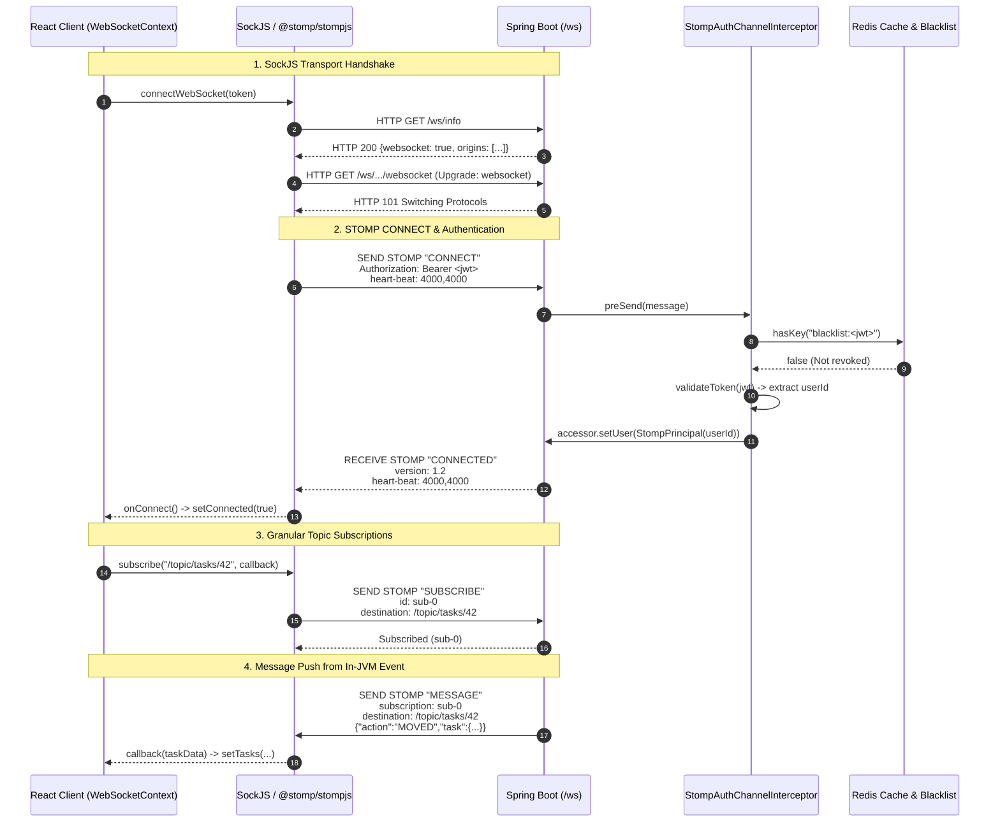
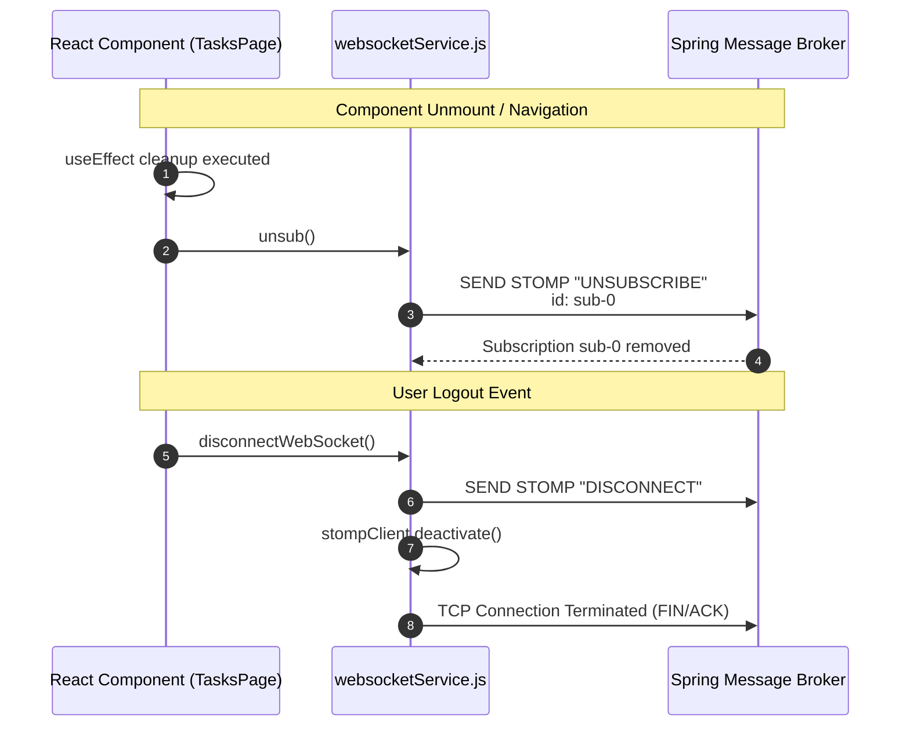

# React WebSocket Client: STOMP over SockJS Architecture & Implementation Guide

## Introduction & Architectural Overview

In **DevOps Suite**, real-time bidirectional communication is essential for live developer operations: streaming container build and runtime logs, real-time Kanban task state synchronization across distributed teams, and instant toast notifications for asynchronous alerts (such as Docker sandboxed execution terminations or security events).

While plain WebSockets provide a low-level, full-duplex TCP communication stream, real-world enterprise web applications require higher-level abstractions:
1. **Fallback Transports**: Corporate firewalls, deep-packet-inspection proxies, and legacy HTTP-only networks routinely block or tear down raw `ws://` / `wss://` connections. DevOps Suite incorporates **SockJS** as an emulation layer that falls back automatically to HTTP long-polling or streaming iframe transports when raw WebSocket handshakes fail.
2. **Sub-protocol & Pub/Sub Semantics**: Plain WebSockets only transmit arbitrary frames (text or binary). They lack message boundaries, routing keys, headers, or subscription concepts. DevOps Suite layers **STOMP (Simple Text Oriented Messaging Protocol v1.2)** on top of SockJS via `@stomp/stompjs`. STOMP introduces formalized frames (`CONNECT`, `CONNECTED`, `SUBSCRIBE`, `UNSUBSCRIBE`, `SEND`, `MESSAGE`, `ERROR`) mirroring HTTP semantics.
3. **Session Lifecycle Management**: Integrating a stateful socket protocol inside React 18's functional architecture requires careful decoupling: centralized connection management, automatic reconnection with exponential backoff, transport heartbeats, and strict subscriber cleanup in `useEffect` hooks to prevent listener leaks and race conditions.

```
+-----------------------------------------------------------------------------------------+
|                                    REACT 18 FRONTEND                                    |
|                                                                                         |
|   +-----------------------+     +-----------------------+     +---------------------+   |
|   |   NotificationContext |     |       TasksPage       |     |      LogsPage       |   |
|   |  /topic/notifications |     |  /topic/tasks/{projId}|     |  /topic/logs/{proj} |   |
|   +-----------+-----------+     +-----------+-----------+     +----------+----------+   |
|               |                             |                            |              |
|               +----------------------+      |      +---------------------+              |
|                                      |      |      |                                    |
|                                      v      v      v                                    |
|                             +-------------------------------+                           |
|                             |    websocketService.js        |                           |
|                             | (Singleton Client Instance)   |                           |
|                             +---------------+---------------+                           |
|                                             |                                           |
|                                             v                                           |
|                             +-------------------------------+                           |
|                             |      @stomp/stompjs Client    |                           |
|                             +---------------+---------------+                           |
|                                             |                                           |
|                                             v                                           |
|                             +-------------------------------+                           |
|                             |         sockjs-client         |                           |
|                             +---------------+---------------+                           |
+---------------------------------------------|-------------------------------------------+
                                              | HTTP Upgrade / Fallback Transports
                                              | SockJS Handshake: GET /ws/info
                                              | STOMP CONNECT (Bearer JWT Header)
                                              v
+-----------------------------------------------------------------------------------------+
|                                SPRING BOOT 3 BACKEND                                    |
|                                                                                         |
|       +-------------------------------------------------------------------------+       |
|       |                 StompEndpointRegistry ("/ws" withSockJS)                |       |
|       +-------------------------------------+-----------------------------------+       |
|                                             |                                           |
|                                             v                                           |
|       +-------------------------------------------------------------------------+       |
|       |             StompAuthChannelInterceptor (preSend ChannelInterceptor)     |       |
|       |         - Validates Bearer Token in native CONNECT header               |       |
|       |         - Queries Redis: 'blacklist:<token>'                            |       |
|       |         - Sets StompPrincipal(userId) on session                       |       |
|       +-------------------------------------+-----------------------------------+       |
|                                             |                                           |
|                                             v                                           |
|       +-------------------------------------------------------------------------+       |
|       |                   Simple In-Memory Broker ("/topic")                    |       |
|       |                                                                         |       |
|       |  [ /topic/notifications/{userId} ] [ /topic/tasks/{pId} ] [ /topic/logs/{pId} ] |
|       +-------------------------------------------------------------------------+       |
+-----------------------------------------------------------------------------------------+
```

---

## 1. Client Stack: SockJS & `@stomp/stompjs`

### The Role of SockJS Client
[`sockjs-client`](file:///d:/Projects/DevOps%20Suite/frontend/src/services/websocketService.js#L2) is a browser JavaScript library that provides a WebSocket-like object. SockJS first contacts the server over standard HTTP via `GET /ws/info` to test network compatibility, verify server capabilities, and negotiate transport protocols.
- If raw WebSockets are supported end-to-end, SockJS upgrades the HTTP connection immediately to RFC 6455 WebSockets (`websocket`).
- If an intermediary proxy terminates or blocks the upgrade (common in enterprise firewalls or mobile cellular networks), SockJS degrades gracefully to **XHR streaming (`xhr_streaming`)**, **HTMLFile**, or **XHR polling (`xhr_polling`)**.

### The Role of `@stomp/stompjs`
[`@stomp/stompjs`](file:///d:/Projects/DevOps%20Suite/frontend/src/services/websocketService.js#L1) (v7.x) implements the STOMP protocol over web sockets. It operates on top of standard WebSocket instances or factory functions returning SockJS instances.
Key responsibilities include:
1. **Frame Serialization & Parsing**: Assembling text commands (`CONNECT\naccept-version:1.2\n\n\0`) and parsing incoming frames into structured objects.
2. **Heartbeat Negotiation**: Transmitting null-byte (`\n` or `\r\n`) heartbeat pings to detect half-open TCP sockets.
3. **Receipts & Transactions**: Tracking receipt headers if confirmation of receipt is requested.
4. **Subscription Tracking**: Mapping server destination paths (e.g., `/topic/tasks/12`) to unique internal subscription IDs (`sub-0`, `sub-1`).

### The Singleton Service Layer (`websocketService.js`)
In DevOps Suite, direct manipulation of `@stomp/stompjs` is isolated within [`frontend/src/services/websocketService.js`](file:///d:/Projects/DevOps%20Suite/frontend/src/services/websocketService.js). This ensures that UI components interact with a clean, decoupled abstraction.

```javascript
import { Client } from '@stomp/stompjs';
import SockJS from 'sockjs-client';
import { WS_URL } from '../utils/constants';

let stompClient = null;

export const connectWebSocket = (token, onConnect, onDisconnect) => {
  stompClient = new Client({
    // Factory delegate providing SockJS fallback capability
    webSocketFactory: () => new SockJS(`${WS_URL}`),
    
    // Transmit JWT authentication inside the initial STOMP CONNECT frame
    connectHeaders: {
      Authorization: `Bearer ${token}`,
    },
    
    // Heartbeats: [incoming, outgoing] in milliseconds
    heartbeatIncoming: 4000,
    heartbeatOutgoing: 4000,
    
    // Reconnection interval
    reconnectDelay: 5000,
    
    onConnect: () => {
      console.log('WebSocket connected');
      if (onConnect) onConnect();
    },
    onDisconnect: () => {
      console.log('WebSocket disconnected');
      if (onDisconnect) onDisconnect();
    },
    onStompError: (frame) => {
      console.error('STOMP error:', frame.headers['message']);
    },
  });

  stompClient.activate();
  return stompClient;
};

export const disconnectWebSocket = () => {
  if (stompClient) {
    stompClient.deactivate();
    stompClient = null;
  }
};

export const getStompClient = () => stompClient;

export const subscribe = (destination, callback) => {
  if (!stompClient || !stompClient.connected) {
    console.warn('WebSocket not connected');
    return () => {};
  }

  const subscription = stompClient.subscribe(destination, (message) => {
    try {
      const body = JSON.parse(message.body);
      callback(body);
    } catch {
      callback(message.body);
    }
  });

  // Return teardown function for clean React hook unmounting
  return () => subscription.unsubscribe();
};

export const send = (destination, body) => {
  if (!stompClient || !stompClient.connected) {
    console.warn('WebSocket not connected');
    return;
  }

  stompClient.publish({
    destination,
    body: JSON.stringify(body),
  });
};
```

---

## 2. Authentication: The Handshake vs Frame Dilemma

A frequent architectural debate in WebSocket security is **where and how to authenticate the user**.

### Why Not HTTP Authorization Headers During WebSocket Handshake?
The standard browser `WebSocket` API (`new WebSocket(url)`) **does not permit custom HTTP headers** to be set during the initial HTTP `101 Switching Protocols` handshake. While browser fetch and XHR allow custom headers like `Authorization: Bearer <token>`, the W3C WebSocket specification intentionally omits header configuration options to prevent CSRF and header injection vulnerabilities.

Common workarounds and their trade-offs:
1. **Query Parameter Token (`/ws?token=eyJ...`)**:
   - *Flaw*: Query parameters are logged in plaintext in reverse proxy access logs (Nginx, Cloudflare), AWS ALB access logs, browser history, and backend server access logs. If a token is captured from server logs, it can be replayed.
2. **Cookie-Based Authentication (`Cookie: SESSIONID=...`)**:
   - *Flaw*: Subject to Cross-Site WebSocket Hijacking (CSWSH) if strict CORS and SameSite attributes are not properly enforced. Cookies are also awkward for multi-platform clients (CLI tools, mobile native apps).
3. **STOMP Frame Authentication (`Authorization` in `CONNECT` frame)** *(Adopted by DevOps Suite)*:
   - The initial HTTP upgrade to `/ws` is permitted anonymously (Spring Security marks `/ws/**` as `permitAll()`).
   - Immediately following the transport handshake, the client emits the STOMP `CONNECT` frame over the established socket.
   - The STOMP frame carries the JWT in its headers: `Authorization: Bearer <token>`.
   - The backend validates the JWT before transitioning the socket into an active messaging state.

### Backend Verification: `StompAuthChannelInterceptor`
On the Spring Boot backend, the channel interceptor inspects the inbound frame channel before delegating to the message broker:

```java
@Component
@RequiredArgsConstructor
@Slf4j
public class StompAuthChannelInterceptor implements ChannelInterceptor {

    private final JwtUtils jwtUtils;
    private final StringRedisTemplate redisTemplate;

    @Override
    public Message<?> preSend(Message<?> message, MessageChannel channel) {
        StompHeaderAccessor accessor = MessageHeaderAccessor.getAccessor(
                message, StompHeaderAccessor.class);

        if (accessor == null || !StompCommand.CONNECT.equals(accessor.getCommand())) {
            return message;
        }

        String token = extractToken(accessor);
        if (token == null) {
            log.warn("STOMP CONNECT rejected: no Authorization header");
            throw new MessagingException("Missing Authorization header on STOMP CONNECT");
        }

        // Check Redis blacklist (matches JwtRequestFilter behavior for logged out tokens)
        if (Boolean.TRUE.equals(redisTemplate.hasKey("blacklist:" + token))) {
            log.warn("STOMP CONNECT rejected: token is blacklisted");
            throw new MessagingException("Token has been revoked");
        }

        if (!jwtUtils.validateToken(token)) {
            log.warn("STOMP CONNECT rejected: invalid or expired token");
            throw new MessagingException("Invalid or expired JWT");
        }

        // Establish session identity: maps to SimpMessagingTemplate user destinations
        String userId = jwtUtils.getUserIdFromToken(token);
        accessor.setUser(new StompPrincipal(userId));
        log.debug("STOMP CONNECT authenticated: userId={}", userId);

        return message;
    }
}
```

If the token is invalid, expired, or present in the Redis blacklist, a `MessagingException` is thrown. Spring's broker immediately sends a STOMP `ERROR` frame to the client and terminates the TCP connection.

---

## 3. React Integration: `WebSocketContext.jsx`

Managing the socket connection within React requires tying the socket lifecycle directly to the authentication state. The [`WebSocketContext`](file:///d:/Projects/DevOps%20Suite/frontend/src/context/WebSocketContext.jsx) serves as the top-level orchestrator.

### Lifecycle Architecture
- When a user logs in, [`AuthContext`](file:///d:/Projects/DevOps%20Suite/frontend/src/context/AuthContext.jsx) exposes `isAuthenticated = true` and the fresh `token`.
- [`WebSocketProvider`](file:///d:/Projects/DevOps%20Suite/frontend/src/context/WebSocketContext.jsx#L10) detects the token and triggers `connectWebSocket()`.
- If the user logs out, `token` becomes null. The cleanup return function of `useEffect` runs `disconnectWebSocket()`, sending a STOMP `DISCONNECT` frame and closing the underlying SockJS socket.
- Exposing `connected` boolean flag allows downstream child components to conditionally subscribe or show offline visual indicators.

```javascript
import { createContext, useContext, useState, useEffect } from 'react';
import { useAuth } from './AuthContext';
import { connectWebSocket, disconnectWebSocket } from '../services/websocketService';

const WebSocketContext = createContext({
  connected: false,
  stompClient: null,
});

export const WebSocketProvider = ({ children }) => {
  const [connected, setConnected] = useState(false);
  const [stompClient, setStompClient] = useState(null);
  const { token, isAuthenticated } = useAuth();

  useEffect(() => {
    if (isAuthenticated && token) {
      const client = connectWebSocket(
        token,
        () => setConnected(true),
        () => setConnected(false)
      );
      setStompClient(client);

      return () => {
        disconnectWebSocket();
        setConnected(false);
        setStompClient(null);
      };
    }
  }, [isAuthenticated, token]);

  return (
    <WebSocketContext.Provider value={{ connected, stompClient }}>
      {children}
    </WebSocketContext.Provider>
  );
};

export const useWebSocket = () => {
  return useContext(WebSocketContext);
};
```

---

## 4. Connection Resilience: Heartbeats & Reconnection

In cloud environments (such as Docker, Kubernetes, or AWS ALB), idle TCP connections are terminated silently by stateful firewalls and NAT gateways after an inactivity timeout (commonly 60 seconds). Without proactive health checks, a client or server can remain unaware that the TCP connection is dead (a "half-open" state).

### Heartbeat Mechanism
The STOMP protocol addresses this using two-way heartbeat negotiation specified in milliseconds within the `CONNECT` and `CONNECTED` frames:
- `heartbeatIncoming`: 4000 ms (The client expects a heartbeat or message from the server at least every 4000 ms).
- `heartbeatOutgoing`: 4000 ms (The client guarantees it will send a heartbeat or message to the server at least every 4000 ms).

```
STOMP Client                                                   Spring Broker
     |                                                               |
     |  CONNECT                                                      |
     |  heart-beat:4000,4000 --------------------------------------> |
     |                                                               |
     |  CONNECTED                                                    |
     |  <-------------------------------------- heart-beat:4000,4000 |
     |                                                               |
     |  [4000ms idle] ---> \n (EOL Ping) --------------------------> |
     |  <----------------- \n (EOL Ping) <--- [4000ms idle]          |
```

If either party fails to receive data or a newline ping within `heartbeat + tolerance` (typically 1.5x to 2x the negotiated interval), the socket is presumed dead, triggering a disconnect event.

### Reconnection Strategy
In `websocketService.js`, `reconnectDelay: 5000` instructs `@stomp/stompjs` to automatically reattempt connection every 5 seconds following an unexpected drop.

#### Advanced Reconnection Enhancement: Exponential Backoff with Jitter
While a fixed 5000ms delay works in development, production microservices experiencing a server reboot can suffer from a **thundering herd problem** where thousands of clients reconnect at the exact same 5000ms interval. An enterprise-grade pattern adds exponential backoff with jitter:

```javascript
// Production Enhancement Pattern
let reconnectAttempts = 0;
const calculateBackoff = () => {
  const baseDelay = 1000;
  const maxDelay = 30000;
  const delay = Math.min(maxDelay, baseDelay * Math.pow(1.5, reconnectAttempts));
  const jitter = delay * 0.2 * Math.random();
  return delay + jitter;
};

// Configured in Client:
client.reconnectDelay = calculateBackoff();
client.onConnect = () => {
  reconnectAttempts = 0; // Reset upon successful handshake
};
client.onWebSocketClose = () => {
  reconnectAttempts++;
};
```

---

## 5. Granular Topic Subscriptions & Teardown Architecture

DevOps Suite separates real-time communications across dedicated destination paths to isolate concerns, minimize broadcast chatter, and adhere to least-privilege scoping.

### Destination Matrix

| Destination | Purpose | Scope | Payload Shape |
| :--- | :--- | :--- | :--- |
| `/topic/notifications/{userId}` | In-app user notifications (task assignments, build completions, alerts) | Unicast / User-scoped | `{ id: Long, title: String, message: String, type: String, read: Boolean, createdAt: String }` |
| `/topic/tasks/{projectId}` | Live Kanban board mutations (task created, moved, updated, deleted) | Multicast / Project-scoped | `{ action: "CREATED"\|"UPDATED"\|"MOVED"\|"DELETED", task: TaskDTO, taskId: Long }` |
| `/topic/logs/{projectId}` | Sandboxed execution & build logs | Multicast / Project-scoped | `{ id: Long, projectId: Long, level: "INFO"\|"ERROR", message: String, timestamp: String }` |

### 1. User Notifications: `NotificationContext.jsx`
[`NotificationContext`](file:///d:/Projects/DevOps%20Suite/frontend/src/context/NotificationContext.jsx#L85-L93) subscribes to the user's personal channel. Notice the dynamic topic path bound to `user.userId`:

```javascript
useEffect(() => {
  if (connected && user?.userId) {
    const unsub = subscribe(`/topic/notifications/${user.userId}`, (message) => {
      addNotification(message);
    });
    // Cleanup ensures unsubscribe frame is transmitted when user logs out or switches
    return () => unsub();
  }
}, [connected, user?.userId, addNotification]);
```

> [!IMPORTANT]
> **Bug Prevention Note**: Earlier iterations mistakenly subscribed to a static `/topic/notifications`. In a multi-tenant environment, this broadcasted private user notifications to every connected client! DevOps Suite binds directly to `/topic/notifications/${user.userId}`.

### 2. Live Kanban Task Synchronization: `TasksPage.jsx`
[`TasksPage`](file:///d:/Projects/DevOps%20Suite/frontend/src/pages/Tasks/TasksPage.jsx#L214-L250) subscribes to project-specific task mutations. When another collaborator drags a card across columns or creates a task, the server broadcasts an event:

```javascript
useEffect(() => {
  if (!connected || !projectId) return;

  const unsub = subscribe(`/topic/tasks/${projectId}`, (update) => {
    const action   = update?.action;
    const incoming = update?.task;
    
    if (!action) { 
      fetchData(); // Fallback to full fetch if payload is malformed
      return; 
    }

    setTasks((prev) => {
      const getId = (t) => t?.id || t?.taskId || t?.task_id;
      switch (action) {
        case 'CREATED': {
          const id = getId(incoming);
          if (!id || prev.some((t) => getId(t) === id)) return prev;
          return [...prev, incoming];
        }
        case 'UPDATED': 
        case 'STATUS_CHANGED': 
        case 'MOVED': {
          const id = getId(incoming);
          if (!id) return prev;
          return prev.map((t) => getId(t) === id ? incoming : t);
        }
        case 'DELETED': {
          const id = update.task_id || update.taskId || getId(incoming);
          if (!id) return prev;
          return prev.filter((t) => getId(t) !== id);
        }
        default: 
          return prev;
      }
    });

    if ((action === 'UPDATED' || action === 'STATUS_CHANGED') && incoming) {
      setDetailTask((prev) => prev?.id === incoming.id ? incoming : prev);
    }
    if (action === 'DELETED') {
      const id = update.task_id || update.taskId;
      setDetailTask((prev) => prev?.id === id ? null : prev);
    }
  });

  return () => unsub();
}, [connected, projectId, fetchData]);
```

### 3. Real-Time Execution Logs: `LogsPage.jsx`
[`LogsPage`](file:///d:/Projects/DevOps%20Suite/frontend/src/pages/Logs/LogsPage.jsx#L38-L44) renders logs output from Docker sandbox executions. It pairs initial REST pagination with live WebSocket appending:

```javascript
useEffect(() => {
  if (!connected || !projectId) return;

  const unsub = subscribe(`/topic/logs/${projectId}`, (event) => {
    setLogs((prev) => [...prev, event]);
  });

  return () => unsub();
}, [connected, projectId]);
```

---

## 6. The Teardown Contract: Preventing Memory Leaks and Duplicate Listeners

A critical source of frontend memory leaks and phantom UI bugs in React SPA applications stems from missing or improper subscription cleanup.

### The Pitfall: React StrictMode & Unmounting
In React 18 development mode, components mount, unmount, and remount immediately (`Mount -> Unmount -> Mount`) to identify side-effect issues. 
- If a component calls `stompClient.subscribe('/topic/tasks/1', callback)` and fails to invoke `subscription.unsubscribe()` inside the `useEffect` cleanup function:
  1. The client maintains two active subscription IDs (`sub-0` and `sub-1`) on the same broker destination.
  2. Every inbound WebSocket message triggers the callback twice.
  3. In a task board, a single task creation results in duplicate items in local state.
  4. The unmounted component's closure retains references to state setters and DOM nodes, causing memory leaks.

```
Without Teardown:
Component Mount 1   ---> SUBSCRIBE /topic/tasks/1  (id: sub-0)
Component Unmount   ---> [LEAK: No UNSUBSCRIBE frame sent]
Component Mount 2   ---> SUBSCRIBE /topic/tasks/1  (id: sub-1)
Incoming Server Msg ---> Triggers sub-0 callback AND sub-1 callback! (DUPLICATE STATE UPDATES)

With Teardown:
Component Mount 1   ---> SUBSCRIBE /topic/tasks/1  (id: sub-0)
Component Unmount   ---> UNSUBSCRIBE id: sub-0
Component Mount 2   ---> SUBSCRIBE /topic/tasks/1  (id: sub-2)
Incoming Server Msg ---> Triggers ONLY sub-2 callback. Clean & predictable.
```

### The Unsubscribe Implementation
In `websocketService.js`:
```javascript
export const subscribe = (destination, callback) => {
  if (!stompClient || !stompClient.connected) {
    return () => {}; // Safe no-op cleanup fallback
  }

  const subscription = stompClient.subscribe(destination, (message) => {
    /* parse and execute callback */
  });

  // Returns a closure that executes the STOMP unregister frame
  return () => {
    try {
      subscription.unsubscribe();
    } catch (err) {
      console.warn('Error unsubscribing:', err);
    }
  };
};
```
In UI components:
```javascript
useEffect(() => {
  const unsub = subscribe(`/topic/...`, handler);
  return () => unsub(); // Strict adherence to React teardown contract
}, [dependencies]);
```

---

## 7. Mermaid Diagrams: Connection Lifecycle & Frame Sequencing

### 1. Connection & Authentication Flow
The following sequence diagram depicts the HTTP upgrade, SockJS info handshake, STOMP frame exchange, JWT verification against Redis, and topic subscription.



### 2. Disconnect & Cleanup Flow
The following sequence illustrates a user logging out or navigating away, triggering clean React teardown and STOMP deactivation.



---

## 8. Comprehensive Interview Questions & Deep-Dive Answers

### 🟢 Basic Level

#### Q1: What is the fundamental difference between standard WebSockets and HTTP/1.1 or HTTP/2?
**Answer:**
- **HTTP/1.1 & HTTP/2**: Strictly request-response protocols initiated by the client. Even in HTTP/2 where server push exists, the push is limited to caching resources associated with a client request; the server cannot push arbitrary application data frames to a client asynchronously. HTTP also incurs significant overhead from redundant header exchange on every transaction.
- **WebSocket (RFC 6455)**: A true bidirectional, full-duplex persistent protocol over a single TCP connection. Once the initial HTTP handshake switches the protocol (`101 Switching Protocols`), both client and server can transmit lightweight binary or text frames (with framing overhead as small as 2 to 10 bytes) at any time without prior requests.

#### Q2: Why does DevOps Suite use STOMP over plain WebSockets?
**Answer:**
A raw WebSocket is equivalent to a raw TCP socket in the browser: it simply transmits chunks of bytes or strings. It has no built-in semantics for:
- Differentiating between a message meant for user A vs user B.
- Subscribing to specific subjects or topics.
- Distinguishing message headers from message payloads.

STOMP (Simple Text Oriented Messaging Protocol) is an application-level wire protocol that runs on top of WebSockets. It defines a standard framing syntax (`COMMAND`, headers, body, null-byte terminator). By adopting STOMP, DevOps Suite gains standard pub/sub routing semantics (`/topic/...`), message broker integration, header-based routing, and built-in heartbeats out of the box without inventing a proprietary framing protocol.

#### Q3: Why is `SockJS` included instead of just using the native browser `WebSocket` constructor?
**Answer:**
Native WebSockets fail in environments with restrictive corporate firewalls, outdated proxy servers, antivirus software, or mobile gateways that inspect and block non-HTTP long-lived TCP upgrades.
SockJS provides an abstraction layer that mimics the WebSocket API:
1. It sends an initial request (`/ws/info`) to determine connectivity.
2. If native WebSockets are functional, it uses them.
3. If WebSockets are blocked, it falls back seamlessly to streaming or polling transports (such as XHR streaming, iframe events, or XHR long-polling) without changing application code.

---

### 🟡 Intermediate Level

#### Q4: Compare WebSockets, Server-Sent Events (SSE), and Short/Long Polling. When should each be chosen?
**Answer:**

| Dimension | Short Polling | Long Polling | Server-Sent Events (SSE) | WebSockets (WS) |
| :--- | :--- | :--- | :--- | :--- |
| **Protocol** | Standard HTTP | Standard HTTP | Standard HTTP (`text/event-stream`) | WS / WSS (TCP upgrade) |
| **Directionality** | Client pull | Client pull | Unidirectional (Server-to-client) | Full-duplex (Bidirectional) |
| **Header Overhead** | Extremely high (headers on every poll) | High (headers on every held request) | Very low (headers sent once at connection) | Minimal (2–10 byte frame header) |
| **Reconnection** | Native (manual loop) | Native (manual loop) | Automatic browser native reconnection | Application-managed or library-managed |
| **HTTP/2 Support** | Yes | Yes | Excellent (multiplexed over single TCP) | RFC 8441 allows WS over H2, but complex |
| **Firewall / Proxy** | Traverses all firewalls | Traverses all firewalls | Traverses all firewalls | Often blocked by restrictive proxies |
| **Best Used For** | Infrequent updates (e.g. status every 5 min) | Legacy systems needing push without WS | Unidirectional live feeds (Stock tickers, build logs) | High-frequency bidirectional collabs, games, chat |

**Why DevOps Suite uses WebSockets over SSE**:
While execution log streaming is primarily unidirectional (server to client), DevOps Suite also supports live Kanban boards where clients both push task movements and receive concurrent collaborator updates over the same persistent channel. Furthermore, STOMP message brokers support user destinations, granular subscriptions, and bidirectional heartbeats seamlessly.

#### Q5: How does `@stomp/stompjs` handle heartbeats, and what happens if a network partition occurs?
**Answer:**
During the STOMP handshake, client and server negotiate heartbeats via the `heart-beat` header:
- Client sends: `heart-beat:cx,cy` (client will send every `cx` ms; client expects every `cy` ms).
- Server responds: `heart-beat:sx,sy` (server will send every `sx` ms; server expects every `sy` ms).
- Negotiated outgoing: `max(cx, sy)` ms.
- Negotiated incoming: `max(cy, sx)` ms.

If no application messages are transmitted during this interval, `@stomp/stompjs` transmits a single newline byte (`\n`). 
If the client receives neither an application frame nor a heartbeat byte within `incoming_heartbeat * 2` ms, it assumes a network partition has occurred (a half-open TCP connection), triggers the `onWebSocketClose` handler, terminates the stale socket, and activates the reconnection timer (`reconnectDelay`).

#### Q6: In React 18, why does a component often receive duplicate WebSocket messages, and how is this resolved?
**Answer:**
This typically occurs due to:
1. **React 18 Strict Mode Remounting**: In development mode, React mounts, unmounts, and remounts components. If `subscribe()` is called in `useEffect` without returning a teardown function:
   ```javascript
   // BUGGY CODE:
   useEffect(() => {
     subscribe('/topic/tasks/1', onUpdate);
     // No cleanup return!
   }, []);
   ```
   The first mount creates subscription `sub-0`. The second mount creates subscription `sub-1`. Both remain active on the STOMP client, causing `onUpdate` to run twice for every message.
2. **Missing Dependencies or Re-running Effects**: If dependencies in `useEffect` change on every render (e.g., an un-memoized object or callback), the effect re-runs, piling up additional subscriptions if the prior subscription is not unsubscribed.

**Resolution:**
Always return a cleanup closure invoking `subscription.unsubscribe()`:
```javascript
useEffect(() => {
  if (!connected) return;
  const unsub = subscribe(`/topic/tasks/${projectId}`, handleUpdate);
  return () => {
    unsub();
  };
}, [connected, projectId, handleUpdate]);
```

---

### 🔴 Advanced Level

#### Q7: Detail the security architecture of STOMP authentication in DevOps Suite. Why is JWT authentication placed in the STOMP `CONNECT` frame rather than the initial HTTP request?
**Answer:**
1. **Browser Limitations**: The browser's native `WebSocket` API does not allow developers to inject custom HTTP headers (such as `Authorization: Bearer <token>`) during the initial HTTP `101 Switching Protocols` handshake.
2. **Risk of Alternatives**:
   - Query string tokens (`/ws?token=...`) leak into access logs, web proxies, and browser histories.
   - Pure cookie authentication requires complex CSWSH (Cross-Site WebSocket Hijacking) mitigations and does not support headless or non-browser clients cleanly.
3. **DevOps Suite Implementation**:
   - The HTTP handshake endpoint `/ws/**` is set to `permitAll()` in Spring Security.
   - Once the raw transport is established, the STOMP client sends the `CONNECT` frame containing:
     ```stomp
     CONNECT
     accept-version:1.2
     Authorization:Bearer eyJhbGciOi...
     heart-beat:4000,4000
     ```
   - In Spring Boot, [`StompAuthChannelInterceptor`](file:///d:/Projects/DevOps%20Suite/backend/src/main/java/com/devopssuite/notification/security/StompAuthChannelInterceptor.java) intercepts inbound frames. It checks:
     a) Is the token present?
     b) Is the token listed in Redis (`blacklist:<token>`) from a prior logout?
     c) Is the cryptographic signature valid and unexpired via `JwtUtils`?
   - If valid, it extracts `userId` and sets a custom `StompPrincipal(userId)` on `StompHeaderAccessor`.
   - If invalid, it throws a `MessagingException`. Spring then transmits a STOMP `ERROR` frame to the client and immediately closes the underlying TCP connection.

#### Q8: How should state updates be handled in React when WebSocket frames arrive at extremely high frequencies (e.g., container execution logs)?
**Answer:**
If a Docker container outputs hundreds of log lines per second, invoking `setLogs(prev => [...prev, newLog])` on every frame causes:
- Hundreds of React re-renders per second.
- Excessive Virtual DOM reconciliation and garbage collection pauses.
- UI thread starvation, causing input lag and browser tab freezing.

**Architectural Solutions**:
1. **Micro-batching / Throttling in Frontend**:
   Buffer incoming messages in a ref (`bufferRef.current.push(log)`) and flush to React state at a controlled interval (e.g., using `requestAnimationFrame` or a 50–100ms `setInterval`):
   ```javascript
   const bufferRef = useRef([]);

   useEffect(() => {
     const unsub = subscribe(`/topic/logs/${projectId}`, (log) => {
       bufferRef.current.push(log);
     });

     const timer = setInterval(() => {
       if (bufferRef.current.length > 0) {
         setLogs((prev) => [...prev, ...bufferRef.current]);
         bufferRef.current = [];
       }
     }, 100);

     return () => {
       unsub();
       clearInterval(timer);
     };
   }, [projectId]);
   ```
2. **Virtualized Rendering**: Use libraries like `@tanstack/react-virtual` to render only the DOM nodes visible in the terminal viewport rather than 10,000 `<p>` elements.
3. **Capped Buffer**: Limit state size (`setLogs(prev => [...prev.slice(-1000), ...incoming])`) to prevent unbounded memory growth in long-running sessions.

#### Q9: What happens when an access token expires while a WebSocket connection is active? How should the client and server handle this?
**Answer:**
Unlike HTTP where every single request carries the token and can receive a `401 Unauthorized`, a WebSocket is a long-lived persistent TCP connection authenticated **once** during the initial STOMP `CONNECT` handshake.

**Scenario**: A JWT has a 15-minute lifespan. The user connects at minute 0 and remains active for 2 hours.
1. **Default Behavior in Simple Brokers**: The socket connection remains active as long as the TCP socket stays open, even if the token expires at minute 15, because the session principal was already registered.
2. **The Security Risk**: If a user's permissions change, or if a user is deleted or banned, an existing connection could theoretically continue receiving messages.
3. **Enterprise Mitigation Patterns**:
   - **Heartbeat Expiry Verification**: A scheduled task or interceptor checks token validity periodically or when critical messages are routed.
   - **Frontend Re-authentication**: Before token expiration, the React client refreshes its token via REST (`/api/auth/refresh`). When the refreshed token is obtained, the frontend can either:
     - Gracefully reconnect the STOMP client with the new token.
     - Send a custom STOMP frame or application-level message to refresh session credentials.
   - **Forced Server-side Disconnect**: When a token is revoked (e.g. user logs out and token is blacklisted in Redis), an in-JVM event or Redis pub/sub listener can locate the active STOMP session by `userId` and disconnect it via `SubProtocolWebSocketHandler`.

---

### ⚫ Expert Level

#### Q10: How would you scale this architecture from a single Spring Boot monolith to a clustered, multi-node backend behind an AWS ALB or Nginx?
**Answer:**
In a multi-node horizontal deployment:
1. **The Core Problem with In-Memory Brokers**:
   If Node A and Node B run behind a load balancer, User 1 connects to Node A, and User 2 connects to Node B. If User 1 updates a task in Project X, Node A's in-memory simple broker (`enableSimpleBroker`) only knows about subscribers connected to Node A. User 2 on Node B will never receive the update!
2. **Step 1: External Dedicated Message Broker (RabbitMQ / ActiveMQ)**:
   Replace Spring's `enableSimpleBroker("/topic")` with `enableStompBrokerRelay("/topic")` pointing to an external message broker cluster (e.g., RabbitMQ with STOMP plugin):
   ```java
   @Override
   public void configureMessageBroker(MessageBrokerRegistry registry) {
       registry.enableStompBrokerRelay("/topic")
               .setRelayHost("rabbitmq")
               .setRelayPort(61613)
               .setClientLogin("guest")
               .setClientPasscode("guest");
       registry.setApplicationDestinationPrefixes("/app");
   }
   ```
   Both Node A and Node B act as STOMP protocol bridges to RabbitMQ. When Node A publishes to `/topic/tasks/42`, RabbitMQ fans out the frame to Node B, which delivers it to User 2.
3. **Step 2: Load Balancer & Sticky Sessions**:
   Configure AWS ALB or Nginx with:
   - WebSocket protocol upgrade support (`proxy_set_header Upgrade $http_upgrade; proxy_set_header Connection "upgrade";`).
   - Extended idle timeouts (ALB defaults to 60s; increase to 300s or ensure client/server heartbeats are set lower, e.g., 25s, to keep NAT tables active).
   - Sticky sessions (session affinity cookies) are **mandatory for SockJS HTTP fallback transports** (XHR polling/streaming), because sequential HTTP requests representing the same SockJS session must hit the exact same backend server instance.
4. **Step 3: Distributed State & Revocation**:
   Use Redis Pub/Sub to propagate token revocation events across nodes so any node holding an active socket for a revoked session can disconnect it immediately.

#### Q11: Explain how you would write unit and integration tests in Vitest / React Testing Library to verify WebSocket connection, message handling, and cleanup in React components.
**Answer:**
Testing WebSocket behavior in React requires mocking the asynchronous, event-driven nature of `@stomp/stompjs` without firing real network calls.

**Test Architecture**:
1. **Mock the Service Layer (`websocketService.js`)**:
   ```javascript
   import { vi, describe, it, expect, beforeEach } from 'vitest';
   import { render, screen, act } from '@testing-library/react';
   import { LogsPage } from './LogsPage';
   import * as wsService from '../../services/websocketService';

   vi.mock('../../services/websocketService', () => ({
     subscribe: vi.fn(),
     connectWebSocket: vi.fn(),
     disconnectWebSocket: vi.fn(),
   }));

   vi.mock('../../context/WebSocketContext', () => ({
     useWebSocket: () => ({ connected: true }),
   }));

   describe('LogsPage WebSocket Integration', () => {
     let triggerWsMessage;
     const mockUnsubscribe = vi.fn();

     beforeEach(() => {
       vi.clearAllMocks();
       wsService.subscribe.mockImplementation((topic, callback) => {
         triggerWsMessage = callback;
         return mockUnsubscribe;
       });
     });

     it('subscribes to correct topic and appends incoming logs', async () => {
       render(<LogsPage />);

       expect(wsService.subscribe).toHaveBeenCalledWith(
         expect.stringContaining('/topic/logs/'),
         expect.any(Function)
       );

       // Simulate incoming real-time STOMP payload
       act(() => {
         triggerWsMessage({
           id: 101,
           level: 'INFO',
           message: 'Build container started successfully',
           timestamp: '2026-10-08T12:00:00Z',
         });
       });

       expect(await screen.findByText(/Build container started successfully/i)).toBeInTheDocument();
     });

     it('calls unsubscribe on component unmount to prevent leaks', () => {
       const { unmount } = render(<LogsPage />);
       unmount();
       expect(mockUnsubscribe).toHaveBeenCalledTimes(1);
     });
   });
   ```

---

## 9. Quick Reference Summary Table

| Category | Concept | DevOps Suite Implementation | Key Interview Rationale |
| :--- | :--- | :--- | :--- |
| **Transport** | SockJS Fallback | `new SockJS('/ws')` in `websocketService.js` | Transparent downgrade to XHR streaming/polling when firewalls block raw WebSockets. |
| **Protocol** | STOMP v1.2 | `@stomp/stompjs` Client v7 | Provides formal pub/sub message semantics, command framing, headers, and destination routing. |
| **Auth** | Frame Header JWT | `connectHeaders: { Authorization: 'Bearer ...' }` | Avoids leaking JWTs into server query-string logs and enables clean header-based token verification. |
| **Backend Interceptor** | `ChannelInterceptor` | [`StompAuthChannelInterceptor`](file:///d:/Projects/DevOps%20Suite/backend/src/main/java/com/devopssuite/notification/security/StompAuthChannelInterceptor.java) | Validates JWT, verifies against Redis revocation list, and sets `StompPrincipal(userId)`. |
| **Heartbeats** | Keep-Alive Check | `4000ms / 4000ms` incoming/outgoing | Detects half-open TCP dead sockets behind NAT gateways; sends raw newline characters. |
| **Reconnection** | Auto Retry | `reconnectDelay: 5000` | Re-establishes dropped connections automatically without requiring manual page reload. |
| **State Bridge** | Context Provider | [`WebSocketContext.jsx`](file:///d:/Projects/DevOps%20Suite/frontend/src/context/WebSocketContext.jsx) | Ties socket connection directly to auth state (`isAuthenticated`, `token`). Exposes `connected`. |
| **Sub Scoping** | Notifications | `/topic/notifications/{userId}` | Unicast isolation ensuring users only receive their own alerts. |
| **Sub Scoping** | Kanban Tasks | `/topic/tasks/{projectId}` | Multicast real-time board mutations (`CREATED`, `MOVED`, `DELETED`). |
| **Sub Scoping** | Runtime Logs | `/topic/logs/{projectId}` | Live log streaming for sandboxed executions and builds. |
| **React Lifecycle** | Teardown Contract | `return () => unsub();` in `useEffect` | Calls `subscription.unsubscribe()`; prevents duplicate listeners and memory leaks. |
| **Performance** | Log Flooding Mitigation | Buffering / Batching (`requestAnimationFrame`) | Prevents UI freezing under high-frequency log bursts. |
