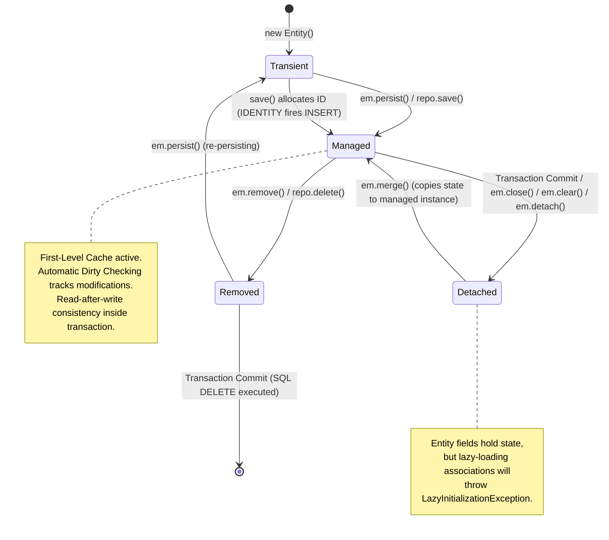
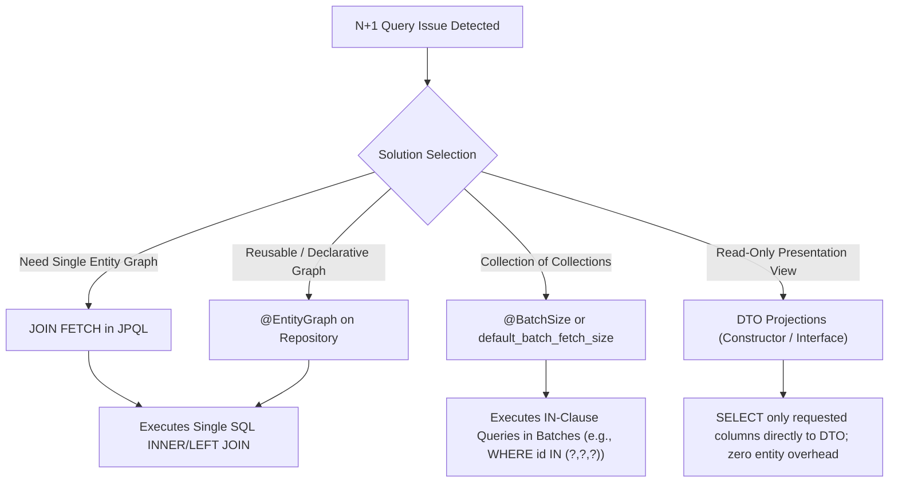
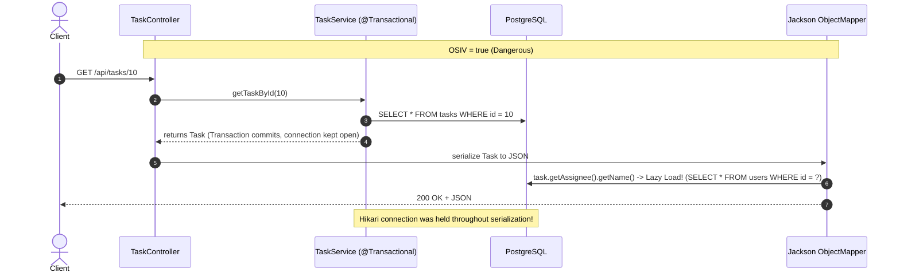
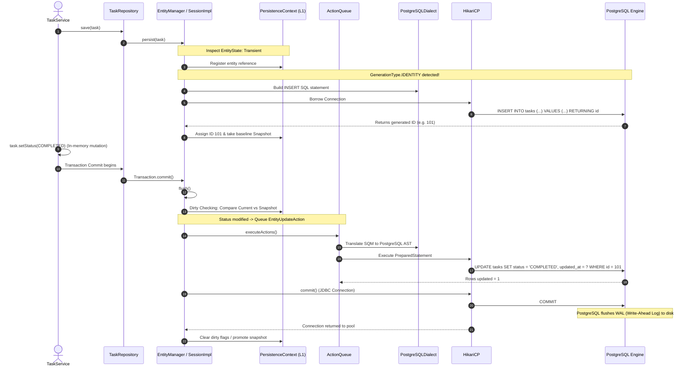

# Spring Data JPA & Hibernate 6 Architecture — Deep-Dive Interview Guide

> **DevOps Suite Technical Reference**  
> Target Project Context: Spring Boot 3.x (Java 21), PostgreSQL 16, Hibernate 6.x, Spring Data JPA, Flyway (V1–V16).  
> Target Component: Persistence Layer, Domain Entities (`Project`, `Task`, `User`, `ExecutionLog`, `BoardColumn`), Transaction Management, and Query Optimization.

---

## 1. Architectural Overview & Context in DevOps Suite

In **DevOps Suite**, the persistence architecture sits at the core of a high-concurrency monolith handling code execution triggers, CI/CD pipeline states, and interactive Kanban boards. Built on **Spring Boot 3 (Java 21)** and **Hibernate 6**, the persistence engine interfaces directly with **PostgreSQL 16**.

Unlike microservice ecosystems with distributed transaction managers, DevOps Suite relies on an ACID-compliant single relational database managed via **Flyway migrations (V1–V16)**. Hibernate operates strictly as an Object-Relational Mapper (ORM), with schema generation set to `validate` in staging/production:

```properties
spring.jpa.hibernate.ddl-auto=validate
spring.jpa.properties.hibernate.dialect=org.hibernate.dialect.PostgreSQLDialect
spring.jpa.open-in-view=false
spring.jpa.properties.hibernate.default_batch_fetch_size=25
spring.jpa.properties.hibernate.jdbc.batch_size=50
spring.jpa.properties.hibernate.order_inserts=true
spring.jpa.properties.hibernate.order_updates=true
```

### High-Level Persistence Stack

```
+---------------------------------------------------------------------------------+
|                                REST Controllers                                 |
|               (ProjectController, TaskController, ExecutionController)          |
+---------------------------------------------------------------------------------+
                                       |
                                       v
+---------------------------------------------------------------------------------+
|                                 Service Layer                                   |
|                (@Transactional Boundaries, Domain Logic, DTO Mapping)           |
+---------------------------------------------------------------------------------+
                                       |
                                       v
+---------------------------------------------------------------------------------+
|                             Spring Data Repositories                            |
|             (JpaRepository, JpaSpecificationExecutor, Custom JPQL)             |
+---------------------------------------------------------------------------------+
                                       |
                                       v
+---------------------------------------------------------------------------------+
|                              Hibernate 6 Core                                   |
|   (PersistenceContext / L1 Cache, Dirty Checking Engine, ActionQueue, SQL AST) |
+---------------------------------------------------------------------------------+
                                       |
                                       v
+---------------------------------------------------------------------------------+
|                               HikariCP Pool                                     |
|             (MaximumPoolSize: 20, MinimumIdle: 10, ConnectionTimeout: 30s)      |
+---------------------------------------------------------------------------------+
                                       |
                                       v
+---------------------------------------------------------------------------------+
|                              PostgreSQL 16 DB                                   |
|      (Flyway Migrations V1-V16, Partial Indexes, Foreign Keys with CASCADE/SET) |
+---------------------------------------------------------------------------------+
```

### Hibernate 6 Architectural Paradigm Shift
Hibernate 6 (the foundation of Spring Boot 3) completely rewrote its query translation engine:
1. **SQM (Semantic Query Model):** Replaced legacy HQL/Criteria parsers with an unified AST representation, allowing identical query execution plans for JPQL and Criteria API.
2. **Positional/Type-safe SQL AST:** Translates directly to optimized SQL for PostgreSQL 16, utilizing modern constructs such as `LATERAL JOIN`, window functions, and native JSON functions (`jsonb`).
3. **Strict Type Safety:** More rigorous validation at application bootstrap, catching illegal type conversions, unresolved entity paths, and mismatched join conditions before runtime execution.

---

## 2. Entity Mappings & Relational Modeling

In DevOps Suite, entities represent domain models like `User`, `Project`, `Task`, `BoardColumn`, and `ExecutionRecord`. 

### Key Annotations & Database Identity Strategy

- `@Entity`: Designates a POJO as a persistent domain model managed by JPA.
- `@Table(name = "tasks", indexes = { ... })`: Explicitly maps the table and documents secondary indexes (composite indexes, lookup indexes).
- `@Id` with `@GeneratedValue(strategy = GenerationType.IDENTITY)`: 
  - DevOps Suite uses PostgreSQL `BIGSERIAL` / identity columns (`GENERATED ALWAYS AS IDENTITY`).
  - **Trade-off Analysis:** `IDENTITY` generates surrogate IDs via PostgreSQL sequences upon insert. However, because Hibernate requires the primary key value to register the entity in the First-Level Cache (`PersistenceContext`), `GenerationType.IDENTITY` disables JDBC batch inserts for new entity creation during standard `persist()` calls unless `saveAll()` or manual JDBC templates are configured. For read-heavy operations and controlled mutations, this trade-off is accepted in favor of native PostgreSQL identity guarantees.

### Task and Project Domain Entity Implementation

```java
package com.devopssuite.entity;

import jakarta.persistence.*;
import lombok.Getter;
import lombok.NoArgsConstructor;
import lombok.Setter;
import org.hibernate.annotations.BatchSize;
import org.hibernate.annotations.CreationTimestamp;
import org.hibernate.annotations.UpdateTimestamp;

import java.time.Instant;
import java.util.ArrayList;
import java.util.List;

@Entity
@Table(name = "tasks", indexes = {
    @Index(name = "idx_task_project_status", columnList = "project_id, status"),
    @Index(name = "idx_task_assignee", columnList = "assignee_id")
})
@Getter
@Setter
@NoArgsConstructor
public class Task {

    @Id
    @GeneratedValue(strategy = GenerationType.IDENTITY)
    private Long id;

    @Column(nullable = false, length = 150)
    private String title;

    @Column(columnDefinition = "TEXT")
    private String description;

    @Enumerated(EnumType.STRING)
    @Column(nullable = false, length = 32)
    private TaskStatus status;

    @Enumerated(EnumType.STRING)
    @Column(nullable = false, length = 32)
    private TaskPriority priority;

    @Column(name = "position_order", nullable = false)
    private Integer positionOrder = 0;

    /**
     * ManyToOne with Project. FetchType.LAZY is mandatory to prevent
     * eager loading of the entire Project graph when querying a task.
     */
    @ManyToOne(fetch = FetchType.LAZY, optional = false)
    @JoinColumn(name = "project_id", nullable = false, foreignKey = @ForeignKey(name = "fk_task_project"))
    private Project project;

    @ManyToOne(fetch = FetchType.LAZY)
    @JoinColumn(name = "assignee_id", foreignKey = @ForeignKey(name = "fk_task_assignee"))
    private User assignee;

    /**
     * OneToMany with ExecutionRecord.
     * orphanRemoval = true guarantees child rows deleted from the collection
     * are deleted from the database.
     */
    @OneToMany(mappedBy = "task", cascade = CascadeType.ALL, orphanRemoval = true)
    @BatchSize(size = 25)
    private List<ExecutionRecord> executionRecords = new ArrayList<>();

    @CreationTimestamp
    @Column(name = "created_at", nullable = false, updatable = false)
    private Instant createdAt;

    @UpdateTimestamp
    @Column(name = "updated_at", nullable = false)
    private Instant updatedAt;

    // Helper synchronization methods to keep bidirectional references coherent
    public void addExecutionRecord(ExecutionRecord record) {
        executionRecords.add(record);
        record.setTask(this);
    }

    public void removeExecutionRecord(ExecutionRecord record) {
        executionRecords.remove(record);
        record.setTask(null);
    }
}
```

```java
package com.devopssuite.entity;

import jakarta.persistence.*;
import lombok.Getter;
import lombok.NoArgsConstructor;
import lombok.Setter;
import org.hibernate.annotations.BatchSize;

import java.time.Instant;
import java.util.ArrayList;
import java.util.List;

@Entity
@Table(name = "projects", indexes = {
    @Index(name = "idx_project_slug", columnList = "slug", unique = true)
})
@Getter
@Setter
@NoArgsConstructor
public class Project {

    @Id
    @GeneratedValue(strategy = GenerationType.IDENTITY)
    private Long id;

    @Column(nullable = false, unique = true, length = 64)
    private String slug;

    @Column(nullable = false, length = 120)
    private String name;

    @ManyToOne(fetch = FetchType.LAZY, optional = false)
    @JoinColumn(name = "owner_id", nullable = false)
    private User owner;

    @OneToMany(mappedBy = "project", cascade = CascadeType.ALL, orphanRemoval = true)
    @OrderBy("positionOrder ASC")
    @BatchSize(size = 30)
    private List<Task> tasks = new ArrayList<>();

    @Version
    private Long version; // Optimistic locking
}
```

---

## 3. Relational Mappings, Cascade Types & Orphan Removal

### Relationship Rules in Enterprise Systems
1. **Always Default to `FetchType.LAZY`**:
   - JPA defaults `@OneToOne` and `@ManyToOne` to `FetchType.EAGER`.
   - In DevOps Suite, **all** `@ManyToOne` and `@OneToOne` associations must be explicitly marked as `fetch = FetchType.LAZY`. Otherwise, fetching a single `Task` cascades eager SQL joins for `Project`, `User`, `Organization`, etc., triggering latency spikes.
2. **Owning Side vs. Inverse Side**:
   - The owning side houses the physical Foreign Key (`@JoinColumn`).
   - The inverse side defines `mappedBy`, referencing the field name on the owning side entity.
3. **Bidirectional Consistency**:
   - Mutating only one side of a bidirectional relationship leaves the in-memory Hibernate First-Level Cache out-of-sync with the SQL updates. Domain methods (e.g., `addExecutionRecord()`) must maintain both sides.

### Cascade Types vs. `orphanRemoval = true`

| Setting | Trigger Behavior | Database Effect |
| :--- | :--- | :--- |
| `CascadeType.PERSIST` | Propagates `em.persist()` to child entities. | `INSERT` statements queued for new children. |
| `CascadeType.MERGE` | Propagates `em.merge()` to detached child entities. | `UPDATE` statements executed for modified children. |
| `CascadeType.REMOVE` | Deleting the parent (`em.remove(project)`) deletes all its tasks. | Executes `DELETE FROM tasks WHERE id = ?`. |
| `CascadeType.ALL` | Propagates all state transitions (`PERSIST`, `MERGE`, `REMOVE`, `REFRESH`, `DETACH`). | Full lifecycle propagation. |
| `orphanRemoval = true` | Removing a child from an in-memory collection (`project.getTasks().remove(0)`) deletes it from DB. | Generates `DELETE FROM tasks WHERE id = ?` during flush. |

> [!WARNING]
> Never use `CascadeType.REMOVE` or `orphanRemoval = true` on `@ManyToOne` or `@ManyToMany`. Doing so deletes shared parent records when a dependent child is mutated.

---

## 4. Entity Lifecycle & State Transitions

An entity in JPA exists in one of four states relative to the `EntityManager` (`PersistenceContext`):

1. **Transient (New)**: Entity instantiated via `new Task()`. No primary key allocated; not associated with any `PersistenceContext`.
2. **Managed (Persistent)**: Associated with an active `PersistenceContext` and has a database identifier. Any changes made to fields are monitored via Hibernate dirty checking and flushed upon commit.
3. **Detached**: Had a `PersistenceContext`, but the transaction completed or `em.clear()` / `em.detach()` was invoked. Changes are no longer tracked.
4. **Removed**: Scheduled for deletion via `em.remove()`. Upon flush, a SQL `DELETE` is issued.



---

## 5. Repository Hierarchy & Query Techniques

DevOps Suite utilizes Spring Data JPA interfaces backed by Hibernate.

### The Spring Data Hierarchy
```
             Repository<T, ID>
                    ^
                    |
          CrudRepository<T, ID>
                    ^
                    |
      ListPagingAndSortingRepository<T, ID>
                    ^
                    |
            JpaRepository<T, ID>
                    ^
                    |
         TaskRepository (Interface)
```

### Derived Query Methods vs. Explicit JPQL vs. Native Queries

```java
package com.devopssuite.repository;

import com.devopssuite.entity.Task;
import com.devopssuite.entity.TaskPriority;
import com.devopssuite.entity.TaskStatus;
import org.springframework.data.domain.Page;
import org.springframework.data.domain.Pageable;
import org.springframework.data.jpa.repository.EntityGraph;
import org.springframework.data.jpa.repository.JpaRepository;
import org.springframework.data.jpa.repository.Modifying;
import org.springframework.data.jpa.repository.Query;
import org.springframework.data.repository.query.Param;
import org.springframework.stereotype.Repository;

import java.time.Instant;
import java.util.List;
import java.util.Optional;

@Repository
public interface TaskRepository extends JpaRepository<Task, Long> {

    // 1. Derived Query Method: Spring Data generates SQL based on method name tokens
    List<Task> findByProjectIdAndStatusOrderByPositionOrderAsc(Long projectId, TaskStatus status);

    // 2. Custom JPQL Query with JOIN FETCH (Mitigating N+1)
    @Query("""
        SELECT t FROM Task t
        JOIN FETCH t.assignee
        JOIN FETCH t.project p
        WHERE p.id = :projectId AND t.status = :status
        ORDER BY t.positionOrder ASC
        """)
    List<Task> findTasksWithAssigneeAndProject(@Param("projectId") Long projectId, 
                                              @Param("status") TaskStatus status);

    // 3. Dynamic Fetching using @EntityGraph
    @EntityGraph(attributePaths = {"assignee", "executionRecords"})
    @Query("SELECT t FROM Task t WHERE t.id = :id")
    Optional<Task> findByIdWithDetails(@Param("id") Long id);

    // 4. Bulk Mutation JPQL (Bypasses dirty checking; requires clearAutomatically)
    @Modifying(clearAutomatically = true, flushAutomatically = true)
    @Query("UPDATE Task t SET t.status = :newStatus WHERE t.project.id = :projectId AND t.status = :oldStatus")
    int bulkUpdateStatus(@Param("projectId") Long projectId, 
                         @Param("oldStatus") TaskStatus oldStatus, 
                         @Param("newStatus") TaskStatus newStatus);

    // 5. Native SQL Query for PostgreSQL specific JSONB / Window Functions
    @Query(value = """
        SELECT t.* FROM tasks t
        WHERE t.project_id = :projectId
        AND t.created_at >= :since
        ORDER BY t.position_order ASC
        FOR UPDATE SKIP LOCKED
        LIMIT :limit
        """, nativeQuery = true)
    List<Task> claimNextPendingTasksNative(@Param("projectId") Long projectId,
                                           @Param("since") Instant since,
                                           @Param("limit") int limit);
}
```

> [!IMPORTANT]
> When executing `@Modifying` queries:
> - Set `flushAutomatically = true` to force pending L1 cache changes to the database before the direct UPDATE/DELETE runs.
> - Set `clearAutomatically = true` to evict stale entities from the `PersistenceContext`, preventing the L1 cache from serving out-of-date state.

---

## 6. The N+1 Query Problem in Kanban Boards & Mitigations

### The Problem Scenario
On the DevOps Suite Kanban Board, displaying a project requires rendering 50 tasks across 4 columns (`TODO`, `IN_PROGRESS`, `REVIEW`, `DONE`), along with the assigned user's avatar and name.

```java
// Anti-pattern: Naive Repository Call
List<Task> tasks = taskRepository.findByProjectId(projectId);
for (Task task : tasks) {
    // Calling getAssignee().getFullName() triggers a separate SELECT query per task!
    System.out.println(task.getTitle() + " -> " + task.getAssignee().getFullName());
}
```

If 50 tasks are returned, the application executes:
- **1 SELECT** query for the list of `Task` records.
- **50 SELECT** queries for the `User` record of each assignee.
- **Total:** 1 + 50 = 51 database round-trips. In a high-concurrency environment, this exhausts HikariCP connection pools and increases latency from 5ms to 120ms+.

### Mitigation Comparison



#### Technique 1: JPQL `JOIN FETCH`
Fetches the associated entity in the primary query using an SQL `JOIN`.
```java
@Query("SELECT t FROM Task t JOIN FETCH t.assignee WHERE t.project.id = :projectId")
List<Task> findTasksWithAssignee(@Param("projectId") Long projectId);
```
*Generated SQL:*
```sql
SELECT t.id, t.title, t.status, u.id, u.email, u.name
FROM tasks t
INNER JOIN users u ON t.assignee_id = u.id
WHERE t.project_id = ?;
```

#### Technique 2: Spring Data `@EntityGraph`
Uses JPA 2.1 FetchGraphs to dynamically specify load graphs without rewriting JPQL.
```java
@EntityGraph(attributePaths = {"assignee", "project"})
List<Task> findByProjectId(Long projectId);
```

#### Technique 3: Batch Fetching (`@BatchSize` / `default_batch_fetch_size`)
If fetching multiple collections simultaneously (which would cause a Cartesian product with `JOIN FETCH`), Hibernate can load associations in batches using SQL `IN` predicates:
```properties
spring.jpa.properties.hibernate.default_batch_fetch_size=25
```
Or on the entity property:
```java
@OneToMany(mappedBy = "task")
@BatchSize(size = 25)
private List<ExecutionRecord> executionRecords = new ArrayList<>();
```
When accessing `task.getExecutionRecords()`, Hibernate executes:
```sql
SELECT er.id, er.task_id, er.status, er.exit_code 
FROM execution_records er 
WHERE er.task_id IN (?, ?, ?, ?, ?, ?, ?, ?, ?, ?, ?, ?, ?, ?, ?, ?, ?, ?, ?, ?, ?, ?, ?, ?, ?);
```
This reduces 50 queries down to 2.

#### Technique 4: DTO Projections (Zero ORM Overhead)
For read-only views like dashboard metrics or Kanban task cards:
```java
public record TaskSummaryDto(Long id, String title, TaskStatus status, String assigneeName) {}

@Query("""
    SELECT new com.devopssuite.dto.TaskSummaryDto(t.id, t.title, t.status, u.name)
    FROM Task t
    LEFT JOIN t.assignee u
    WHERE t.project.id = :projectId
    """)
List<TaskSummaryDto> findTaskSummaries(@Param("projectId") Long projectId);
```

---

## 7. `LazyInitializationException` & Open-Session-in-View (OSIV)

### What Causes `LazyInitializationException`?
Hibernate proxies uninitialized lazy associations with ByteBuddy proxy objects. If code attempts to access a proxy's unloaded properties after the Hibernate `Session` has closed (typically outside `@Transactional`), Hibernate throws:

```
org.hibernate.LazyInitializationException: could not initialize proxy [com.devopssuite.entity.User#42] - no Session
```

### The Anti-Pattern: Open-Session-in-View (OSIV)
Spring Boot enables OSIV (`spring.jpa.open-in-view=true`) by default via `OpenEntityManagerInViewInterceptor`. OSIV keeps the JPA `EntityManager` open throughout the entire HTTP request-response cycle, including view rendering in Jackson JSON serialization.



### Why DevOps Suite Disables OSIV (`spring.jpa.open-in-view=false`)
1. **Connection Pool Starvation:** In DevOps Suite, code execution logs and STOMP notifications may stream data over long-lived HTTP responses. If OSIV holds a database connection open during slow serialization or downstream client transfers, the 20-connection Hikari pool is exhausted rapidly.
2. **Hidden N+1 Queries:** Lazy loading inside JSON serialization silently masks N+1 performance bugs until high traffic causes latency spikes.
3. **Architectural Separation:** Services must return fully initialized DTOs or models across the architectural boundary to Controllers.

---

## 8. PersistenceContext, Dirty Checking & Transaction Boundaries

### First-Level Cache (`PersistenceContext`)
Every `EntityManager` maintains a First-Level Cache. It guarantees:
- **Identity Scope:** Within the same transaction, querying `findById(10L)` twice returns the exact same Java object reference (`task1 == task2` evaluates to `true`).
- **Write-Behind Engine:** SQL statements are not sent immediately to the DB upon calling setters. Instead, Hibernate buffers mutations in its internal `ActionQueue` and flushes them in a single batch before transaction commit or before queries that depend on the dirty state.

### How Dirty Checking Operates
1. When an entity is loaded from the database or persisted, Hibernate creates an internal **snapshot** of its database column values.
2. At transaction commit time (or manual `em.flush()`), Hibernate traverses the persistence context and compares each entity's current in-memory field values with its initial snapshot.
3. If differences are detected, Hibernate generates the minimal required SQL `UPDATE` statement and adds it to the `ActionQueue`.

```java
@Service
public class TaskService {

    private final TaskRepository taskRepository;

    @Transactional
    public void updateTaskStatus(Long taskId, TaskStatus newStatus) {
        // Step 1: Loaded into PersistenceContext (snapshot recorded)
        Task task = taskRepository.findById(taskId)
            .orElseThrow(() -> new EntityNotFoundException("Task not found"));

        // Step 2: Mutating entity field
        task.setStatus(newStatus);

        // Step 3: No explicit repository.save(task) is needed!
        // At transaction commit, Hibernate dirty checking detects status change
        // and emits: UPDATE tasks SET status = ?, updated_at = ? WHERE id = ?
    }
}
```

### Flush Modes and Execution Order
By default, Hibernate uses `FlushModeType.AUTO`. The session flushes:
1. Prior to executing a query that overlaps with tables holding pending dirty entities (to ensure query results reflect recent updates).
2. Prior to transaction commit.

Hibernate executes SQL actions in strict order to maintain relational integrity:
1. `EntityInsertAction`
2. `EntityUpdateAction`
3. `CollectionRemoveAction`
4. `CollectionUpdateAction`
5. `CollectionInsertAction`
6. `EntityDeleteAction`

---

## 9. Comprehensive Interview Questions & Answers

### 🟢 Basic Level

#### Q1: What is the purpose of `@Table(name = "...")` and `@Column(name = "...")` if Hibernate can generate table names automatically?
**Answer:**  
In enterprise systems like DevOps Suite, schema definition is strictly managed by versioned Flyway migrations (V1–V16). Relying on Hibernate's default naming strategies (`PhysicalNamingStrategy`, `ImplicitNamingStrategy`) introduces risks:
1. Different Spring Boot or Hibernate minor versions may alter casing rules (e.g., camelCase to snake_case).
2. Explicit `@Table(name = "tasks")` and `@Column(name = "created_at", nullable = false)` make mappings self-documenting and resilient against property-naming refactorings.
3. It allows declaring table-level composite indexes (`@Index`) and foreign keys directly within the entity metadata, ensuring validation checks match the actual PostgreSQL DDL.

---

#### Q2: What is the difference between `GenerationType.IDENTITY` and `GenerationType.SEQUENCE`? Which one does PostgreSQL prefer?
**Answer:**  
- **`GenerationType.IDENTITY`**: Relies on database-managed identity columns (e.g., PostgreSQL `BIGINT GENERATED ALWAYS AS IDENTITY` or `BIGSERIAL`). The primary key value is generated during the SQL `INSERT` execution. Because Hibernate needs the entity's ID immediately to index it in the First-Level Cache (`PersistenceContext`), it **must execute the SQL INSERT immediately** upon `em.persist()`, which defeats Hibernate's JDBC batch insert optimization for newly created entities.
- **`GenerationType.SEQUENCE`**: Relies on a standalone database sequence object (`CREATE SEQUENCE task_seq`). Hibernate can pre-allocate ID pools (using an allocation size, e.g., 50) with a single query (`SELECT nextval('task_seq')`), allowing it to keep all newly persisted entities in memory and batch their inserts together during transaction commit.
- **PostgreSQL Context**: PostgreSQL supports both. In DevOps Suite, `IDENTITY` is selected for its straightforward alignment with Flyway relational tables and operational simplicity, accepting the trade-off since high-volume inserts (e.g., batch log parsing) bypass entity mapping using batch JDBC templates.

---

#### Q3: Why is `@Transactional(readOnly = true)` recommended for read-only service methods?
**Answer:**  
Applying `@Transactional(readOnly = true)` introduces three significant performance optimizations:
1. **Disables Hibernate Snapshot Creation:** Hibernate skips generating the dirty-checking snapshot for entities loaded inside the transaction. This cuts heap memory allocation in half and eliminates dirty-checking overhead during transaction completion.
2. **JDBC Driver & Connection Optimization:** Many connection pools and JDBC drivers (including PostgreSQL's) optimize read-only connections by disabling auto-commit overhead and routing read queries to read-replicas if a multi-node cluster is configured.
3. **Flushing Bypass:** Hibernate sets the session's flush mode to `FlushModeType.MANUAL`, ensuring no unexpected flushes execute during the query lifecycle.

---

### 🟡 Intermediate Level

#### Q4: Why is using `List` with multiple `@OneToMany` eager/join fetches considered dangerous in Hibernate?
**Answer:**  
Attempting to fetch multiple collections (e.g., fetching a `Project` with its `tasks` list and its `collaborators` list) in a single JPQL query using `JOIN FETCH` triggers a **Cartesian Product Problem**:
```
Rows returned = Count(Project) * Count(Tasks) * Count(Collaborators)
```
If a project has 100 tasks and 20 collaborators, PostgreSQL returns 2,000 rows for a single project record.
- **Memory Overhead:** The JDBC driver and Hibernate must allocate and deduplicate 2,000 joined records in memory.
- **Hibernate Exception:** In Hibernate 6, attempting to fetch multiple `java.util.List` collections in a single query triggers a `MultipleBagFetchException` because Hibernate cannot distinguish true collection indices across cartesian rows without duplicate bag semantics.
- **Solution:** Fetch only one collection via `JOIN FETCH` and use Hibernate's `@BatchSize(size = 25)` or `default_batch_fetch_size` for subsequent collections, or split into two separate queries initialized within the same transaction.

---

#### Q5: Explain the difference between `orphanRemoval = true` and `CascadeType.REMOVE`.
**Answer:**  
While both mechanisms result in the deletion of child records, they are triggered by different actions:
- **`CascadeType.REMOVE`**: Only triggers when the **parent entity is explicitly removed**.
  ```java
  Project project = projectRepository.findById(1L).get();
  projectRepository.delete(project); // Deletes project AND all its associated Tasks
  ```
  If you simply remove a task from the list (`project.getTasks().remove(0)`), `CascadeType.REMOVE` does **nothing**; the child row remains in the database with a foreign key referencing the parent (or orphaned).
- **`orphanRemoval = true`**: Triggers when a child is **dereferenced from the parent collection**, in addition to when the parent is deleted.
  ```java
  Project project = projectRepository.findById(1L).get();
  project.getTasks().remove(0); 
  // During commit, Hibernate detects the removed element and executes:
  // DELETE FROM tasks WHERE id = ?
  ```

---

#### Q6: How does Spring Data JPA execute `save()` under the hood, and why can it be inefficient for existing entities?
**Answer:**  
In `SimpleJpaRepository`, the `save(S entity)` implementation inspects whether the entity is "new":
```java
@Transactional
public <S extends T> S save(S entity) {
    if (entityInformation.isNew(entity)) {
        em.persist(entity);
        return entity;
    } else {
        return em.merge(entity);
    }
}
```
1. **Determining "New":** By default, an entity is considered new if its `@Id` field is `null` or 0.
2. **The Inefficiency of `merge()`:** If an entity has a non-null ID (e.g., an existing `Task` received from a REST PUT request), `save()` calls `em.merge()`. Hibernate must first execute a `SELECT` query to load the existing entity from the database into the `PersistenceContext`, copy the modified fields from the detached entity onto the managed instance, and then execute an `UPDATE` on flush.
3. **Best Practice:** Avoid passing detached entities directly to `save()`. Load the managed entity inside a `@Transactional` service method via `findById()` and modify its fields directly to let dirty checking issue the `UPDATE` without redundant `merge()` overhead.

---

### 🔴 Advanced Level

#### Q7: In the DevOps Suite execution engine, multiple worker threads may try to update task statuses simultaneously. How do you prevent race conditions using Hibernate?
**Answer:**  
Two primary concurrency control strategies are used:

**1. Optimistic Locking (`@Version`):**
Add a version field to the `Task` entity:
```java
@Version
private Long version;
```
When Thread A and Thread B read Task #10 at version 1:
- Thread A updates the status and commits:
  ```sql
  UPDATE tasks SET status = 'IN_PROGRESS', version = 2 WHERE id = 10 AND version = 1;
  ```
  Update succeeds (affected rows = 1).
- Thread B attempts to update:
  ```sql
  UPDATE tasks SET status = 'CANCELLED', version = 2 WHERE id = 10 AND version = 1;
  ```
  PostgreSQL reports 0 affected rows. Hibernate detects this and throws `OptimisticLockException` (wrapped in Spring's `ObjectOptimisticLockingFailureException`). The service can catch this and retry or return a 409 Conflict.

**2. Pessimistic Locking (`PESSIMISTIC_WRITE`):**
For immediate synchronization without retry logic (e.g., worker polling an execution queue):
```java
@Lock(LockModeType.PESSIMISTIC_WRITE)
@Query("SELECT t FROM Task t WHERE t.id = :id")
Optional<Task> findByIdForUpdate(@Param("id") Long id);
```
Generated SQL:
```sql
SELECT * FROM tasks WHERE id = ? FOR UPDATE;
```
PostgreSQL holds an exclusive row-level lock until the transaction completes, forcing other threads to wait. To prevent thread pool starvation, use `PESSIMISTIC_WRITE` with a lock timeout or `SKIP LOCKED` for queue-polling workloads.

---

#### Q8: How do you properly implement `equals()` and `hashCode()` for Hibernate entities? Why is using Lombok's `@Data` or `@EqualsAndHashCode` on entities an anti-pattern?
**Answer:**  
Using Lombok's `@Data` or default `@EqualsAndHashCode` generates methods that include all entity fields, including generated IDs and lazy associations. This introduces two serious issues:
1. **Hash Code Mutation in HashSets:** 
   - A new entity has `id = null`. Adding it to a `HashSet<Task>` indexes it using `hashCode()` computed with `null`.
   - Once saved to PostgreSQL, the database assigns an ID (e.g., `42`). Its `hashCode()` changes.
   - Calling `set.contains(task)` now fails because the bucket lookup uses the new hash code, causing memory leaks and lost entities.
2. **Triggering Unintended Lazy Loads:** Comparing lazy collection fields in `equals()` triggers SQL queries for all associated rows, negating lazy loading.

**The Solution:**  
Implement business key equality or **Consistent ID Equality**:
```java
@Entity
public class Task {
    @Id
    @GeneratedValue(strategy = GenerationType.IDENTITY)
    private Long id;

    @Override
    public boolean equals(Object o) {
        if (this == o) return true;
        if (o == null || getClass() != o.getClass()) return false;
        Task task = (Task) o;
        // If neither ID is assigned yet, they are only equal if they are the exact same instance
        return id != null && id.equals(task.id);
    }

    @Override
    public int hashCode() {
        // Return a constant hash code across all instances.
        // This ensures the hash code never changes across state transitions (Transient -> Managed).
        // Hash collections rely on equals() to resolve collisions within the same bucket.
        return getClass().hashCode();
    }
}
```

---

#### Q9: What happens when an entity with an uninitialized lazy collection is serialized to JSON by Spring Boot? How does DevOps Suite handle this?
**Answer:**  
By default, Jackson introspects entity getters during serialization. When it invokes `getExecutionRecords()`, Hibernate attempts to load the collection:
- If **OSIV is enabled (`true`)**, Jackson triggers additional SQL queries per serialized entity inside the view layer (N+1 queries during serialization).
- If **OSIV is disabled (`false`)** and the transaction has closed, Hibernate throws `LazyInitializationException`.

**DevOps Suite Solution:**
1. **Disable OSIV:** Enforce `spring.jpa.open-in-view=false`.
2. **DTO Layering:** Never expose `@Entity` instances directly across HTTP boundaries. Use Java Records or MapStruct mappers to convert entities to DTOs within the `@Transactional` service boundary:
```java
@Transactional(readOnly = true)
public TaskDetailsResponse getTaskDetails(Long taskId) {
    Task task = taskRepository.findByIdWithDetails(taskId)
        .orElseThrow(() -> new TaskNotFoundException(taskId));
    return taskMapper.toResponse(task); // All fields accessed while Hibernate session is open
}
```
3. **Jackson Hibernate Module (Safety Net):** If an entity is ever exposed directly, `jackson-datatype-hibernate6` can be configured to serialize uninitialized lazy collections as `null` or `[]` instead of throwing an exception.

---

### ⚫ Expert Level

#### Q10: Walk through what happens inside Hibernate 6's internals from the moment a user calls `taskRepository.save(task)` to when the PostgreSQL WAL records the transaction.
**Answer:**  
Below is the execution trace:



1. **Invocation & State Detection:** `SimpleJpaRepository.save()` invokes `em.persist(entity)`. Hibernate checks `EntityState`. If the entity has no ID, it is marked as `TRANSIENT`.
2. **Identity Execution:** Because `GenerationType.IDENTITY` is used, Hibernate cannot defer the insert. It borrows a JDBC connection from HikariCP, renders the `INSERT` statement via `PostgreSQLDialect`, and executes it with `Statement.RETURN_GENERATED_KEYS` or Postgres `RETURNING id`.
3. **Snapshot Registration:** The generated primary key is injected into `task.id`. The entity is registered in the `PersistenceContext` (L1 Cache), and a snapshot of all initial field values is stored.
4. **In-Memory Modification:** The service mutates `task.setStatus(COMPLETED)`. No SQL is issued yet.
5. **Flush & Dirty Checking:** As the Spring `@Transactional` interceptor prepares to commit, it invokes `em.flush()`. Hibernate compares the entity's current in-memory field values against the baseline snapshot. Detecting that `status` has changed, it schedules an `EntityUpdateAction` inside the `ActionQueue`.
6. **SQL Translation (Hibernate 6 SQM):** Hibernate 6 translates the action through its Semantic Query Model (SQM) into PostgreSQL-compatible SQL AST and executes the batch update over the borrowed JDBC connection.
7. **Database Commit & WAL:** The transaction manager invokes `Connection.commit()`. PostgreSQL writes the transaction records to the **WAL (Write-Ahead Log)** on disk, releases row locks, and returns success.
8. **Post-Commit Cleanup:** The connection is returned to HikariCP, and the `PersistenceContext` is closed and cleared.

---

#### Q11: How do you design an audit logging system for Task mutations without causing circular dependencies or polluting domain entities with JPA lifecycle callbacks?
**Answer:**  
While JPA provides `@EntityListeners` (e.g., `@PreUpdate`, `@PostUpdate`), triggering domain events or injecting Spring-managed services directly into JPA listener classes is brittle because JPA listeners are instantiated outside Spring's dependency injection container.

**The DevOps Suite Solution: Spring Data `AbstractAggregateRoot` + In-JVM Application Events**

1. **Domain Entity as Aggregate Root:**
```java
package com.devopssuite.entity;

import com.devopssuite.event.TaskStatusChangedEvent;
import jakarta.persistence.*;
import lombok.Getter;
import org.springframework.data.domain.AbstractAggregateRoot;

@Entity
@Table(name = "tasks")
@Getter
public class Task extends AbstractAggregateRoot<Task> {

    @Id
    @GeneratedValue(strategy = GenerationType.IDENTITY)
    private Long id;

    @Enumerated(EnumType.STRING)
    private TaskStatus status;

    public void updateStatus(TaskStatus newStatus, Long actorId) {
        if (this.status != newStatus) {
            TaskStatus oldStatus = this.status;
            this.status = newStatus;
            // Register domain event to be published by Spring Data on repo.save()
            registerEvent(new TaskStatusChangedEvent(this.id, oldStatus, newStatus, actorId));
        }
    }
}
```

2. **Decoupled Transactional Event Listener:**
```java
package com.devopssuite.listener;

import com.devopssuite.entity.AuditLog;
import com.devopssuite.event.TaskStatusChangedEvent;
import com.devopssuite.repository.AuditLogRepository;
import lombok.RequiredArgsConstructor;
import org.springframework.stereotype.Component;
import org.springframework.transaction.annotation.Propagation;
import org.springframework.transaction.annotation.Transactional;
import org.springframework.transaction.event.TransactionPhase;
import org.springframework.transaction.event.TransactionalEventListener;

@Component
@RequiredArgsConstructor
public class TaskAuditEventListener {

    private final AuditLogRepository auditLogRepository;

    /**
     * Executes AFTER the primary transaction commits.
     * Requires a new transaction (REQUIRES_NEW) to write the audit entry.
     */
    @TransactionalEventListener(phase = TransactionPhase.AFTER_COMMIT)
    @Transactional(propagation = Propagation.REQUIRES_NEW)
    public void onTaskStatusChanged(TaskStatusChangedEvent event) {
        AuditLog log = new AuditLog();
        log.setEntityName("Task");
        log.setEntityId(event.taskId());
        log.setAction("STATUS_CHANGE");
        log.setDetails(String.format("From %s to %s by user %d", 
            event.oldStatus(), event.newStatus(), event.actorId()));
        
        auditLogRepository.save(log);
    }
}
```

**Benefits:**
- **Zero Circular Dependencies:** The `Task` entity knows nothing about the `AuditLogRepository` or Spring application context.
- **Transactional Decoupling:** Using `TransactionPhase.AFTER_COMMIT` guarantees that if the primary transaction fails, no phantom audit logs are written. If writing the audit log fails, it does not roll back the completed task modification.

---

## 10. Quick Reference Summary Table

| Category | Best Practice / Pattern | Anti-Pattern / Pitfall | Operational Reason in DevOps Suite |
| :--- | :--- | :--- | :--- |
| **Association Fetching** | `fetch = FetchType.LAZY` on ALL relations | Default `EAGER` on `@ManyToOne` / `@OneToOne` | Prevents runaway cascade joins when querying simple task metrics. |
| **N+1 Mitigation** | `JOIN FETCH` for single entity, `@BatchSize` for collections | Iterating lazy associations in loops | Eliminates 50+ round-trips to PostgreSQL on Kanban boards. |
| **Open-Session-in-View** | `spring.jpa.open-in-view=false` | Leaving OSIV enabled (`true`) | Prevents HikariCP pool starvation during long REST/SSE requests. |
| **Entity Identity** | Consistent ID equality with class-based constant hash code | Lombok `@Data` or `@EqualsAndHashCode` on entities | Prevents `HashSet` bucket lookup failures when transient entities gain an ID. |
| **Mutation Pattern** | Load managed entity and let dirty checking update | Calling `repo.save()` with detached entity | Eliminates redundant `SELECT` queries triggered by `em.merge()`. |
| **Bulk Updates** | `@Modifying(clearAutomatically = true)` | Bulk JPQL without clearing L1 Cache | Prevents stale in-memory entity state following direct SQL updates. |
| **Read Operations** | `@Transactional(readOnly = true)` | Unannotated read queries | Skips dirty check snapshots and reduces heap allocations. |
| **Concurrency** | `@Version` for optimistic locking | Unsynchronized read-modify-write | Prevents lost updates during simultaneous Kanban task transitions. |
