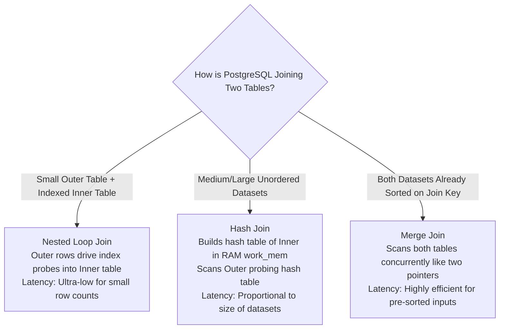
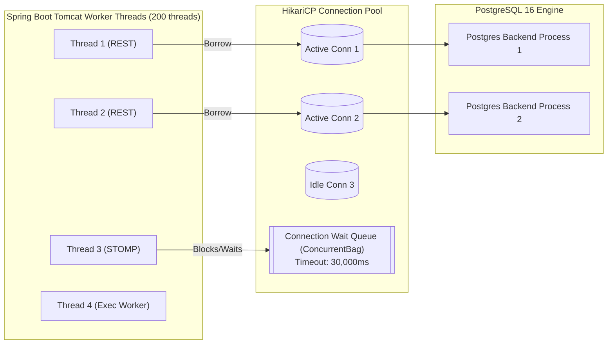
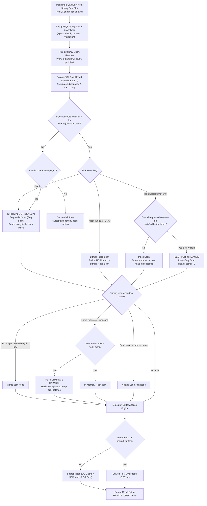
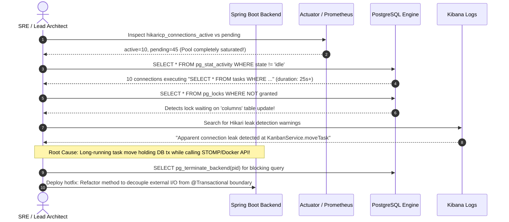

# Database Query Optimization & HikariCP Pooling Guide

> **DevOps Suite Technical Reference**  
> Target Architecture: Spring Boot 3.4.1 (Java 21), PostgreSQL 16 (Flyway V1–V16), Hibernate 6.x, HikariCP, Redis 7.  
> Target Domains: Kanban Core (`projects`, `boards`, `columns`, `tasks`), Auditing (`task_audit_history`), Sandbox Engine (`execution_requests`, `execution_results`), Virtual IDE (`ide_files`).

---

## 1. Executive Summary & Optimization Philosophy

In high-concurrency developer platforms like **DevOps Suite**, database performance directly dictates system responsiveness, throughput, and operational stability. With workloads combining interactive Kanban board updates, real-time STOMP push notifications, background Docker sandbox execution logging, and append-only audit histories, unoptimized queries can quickly saturate database CPU, exhaust connection pools, and induce thread pool starvation.

The persistence architecture in DevOps Suite adheres to five fundamental optimization principles:

1. **Schema-Driven Indexing:** Indexes match real application access paths (composite filtering, foreign key join navigation, and partial state retrieval) while avoiding redundant indexes that degrade `INSERT`/`UPDATE` write throughput.
2. **Deterministic Execution Plans:** Every critical query is profiled and verified using `EXPLAIN (ANALYZE, BUFFERS)` to eliminate accidental sequential scans (`Seq Scan`) and avoid CPU-heavy nested loop joins (`Nested Loop`) over unbounded tables.
3. **Bounded & Scalable Pagination:** Traditional `OFFSET`/`LIMIT` pagination is strictly constrained to shallow user-facing pages, while high-volume audit logs and execution streams enforce keyset (cursor-based) pagination (`WHERE id < :cursor ORDER BY id DESC LIMIT :size`).
4. **Resilient Connection Pooling:** HikariCP connection pools are tuned to the physical core capacity of the PostgreSQL host rather than arbitrarily oversized, with leak detection and Micrometer metrics actively alerting on connection pool contention.
5. **Specialized Storage for Unstructured Data:** Large JSON payloads (such as task change diffs and IDE execution metadata) are persisted in PostgreSQL native `JSONB` columns with GIN indexes and expression indexes, preventing schema bloat while supporting sub-millisecond document lookups.

---

## 2. PostgreSQL 16 Indexing Architecture & Strategies

PostgreSQL 16 provides an advanced indexing subsystem featuring B-tree, Generalized Inverted Index (GIN), BRIN (Block Range Index), and Hash indexes. DevOps Suite strategically utilizes these index architectures based on data cardinality and access patterns.

### 2.1 Primary Keys, Foreign Keys, and the "Missing FK Index" Trap

In relational database systems, a primary key constraint automatically creates a unique B-tree index (e.g., `tasks_pkey` on `tasks(id)`). However, **PostgreSQL does NOT automatically index foreign key columns**.

```
PostgreSQL Table Constraints:
┌─────────────────────────────────┐
│ Primary Key (id)                │ ──> Automatically creates B-Tree Index (Unique)
└─────────────────────────────────┘
┌─────────────────────────────────┐
│ Foreign Key (project_id)        │ ──> NO AUTOMATIC INDEX! Requires explicit CREATE INDEX!
└─────────────────────────────────┘
```

#### Why Unindexed Foreign Keys Cripple Production Systems:
1. **Child Table Scans on Parent Deletions:** When a row in the parent table (`projects`) is deleted or its primary key updated, PostgreSQL must verify referential integrity or cascade deletions (`ON DELETE CASCADE`) to the child table (`boards`). Without an index on `boards(project_id)`, PostgreSQL executes a full sequential scan (`Seq Scan`) on `boards` while acquiring a share lock, severely degrading throughput.
2. **JOIN Degradation:** Standard relational queries navigating the parent-child hierarchy (e.g., fetching all tasks for a column: `SELECT * FROM tasks WHERE column_id = ?`) degrade to sequential scans over hundreds of thousands of rows.

#### Foreign Key Index Layout in DevOps Suite:
Across Flyway migrations `V1__initial_schema.sql` to `V16__Execution_Request_Project_Correlation.sql`, every foreign key used in joins or cascades is explicitly indexed:

```sql
-- Flyway V1 - V4 foreign key index definitions
CREATE INDEX IF NOT EXISTS idx_projects_owner       ON projects(owner_id);
CREATE INDEX IF NOT EXISTS idx_proj_member_user     ON project_members(user_id);
CREATE INDEX IF NOT EXISTS idx_proj_member_project  ON project_members(project_id);
CREATE INDEX IF NOT EXISTS idx_boards_project       ON boards(project_id);
CREATE INDEX IF NOT EXISTS idx_columns_board        ON columns(board_id);
CREATE INDEX IF NOT EXISTS idx_tasks_column         ON tasks(column_id);
CREATE INDEX IF NOT EXISTS idx_tasks_assignee       ON tasks(assignee_id);
CREATE INDEX IF NOT EXISTS idx_exec_user            ON execution_requests(user_id);
CREATE INDEX IF NOT EXISTS idx_exec_project         ON execution_requests(project_id);
CREATE INDEX IF NOT EXISTS idx_ide_files_proj       ON ide_files(project_id);
CREATE INDEX IF NOT EXISTS idx_audit_task           ON task_audit_history(task_id);
```

---

### 2.2 Composite Indexes & Leftmost Prefix Optimization

A composite index spans two or more columns on a single table. In PostgreSQL B-tree composite indexes, order matters significantly due to the **Leftmost Prefix Rule**: an index on `(A, B, C)` can satisfy queries filtering on `(A)`, `(A, B)`, and `(A, B, C)`, but **cannot** efficiently accelerate queries filtering only on `(B)` or `(C)`.

#### Kanban Board Task Filtering Pattern:
In DevOps Suite, users frequently query tasks within a project or column filtered by workflow state, ordered by presentation order:

```sql
SELECT * FROM tasks 
WHERE column_id = '8f3d1b84-6019-4a92-91f2-1b12b591dc01' 
  AND status = 'OPEN' 
ORDER BY sort_order ASC;
```

#### Index Architecture:
```sql
CREATE INDEX idx_tasks_column_status_sort 
ON tasks (column_id, status, sort_order);
```

#### Why Column Ordering Matters:
1. **Equality First (`column_id`, `status`):** Both columns narrow down the search space to a small leaf page range in the B-tree.
2. **Range / Sort Column Last (`sort_order`):** Because the B-tree leaves are physically sorted by `sort_order` within the matched `(column_id, status)` bucket, PostgreSQL reads the rows in pre-sorted order, completely avoiding an in-memory or on-disk `Sort` / `Incremental Sort` operation.

```
Composite B-Tree Leaf Structure: (column_id, status, sort_order)
┌────────────────────────────────────────────────────────┐
│ ('col-A', 'OPEN', 1) ──> Row Pointer (Block 12, Off 1) │
│ ('col-A', 'OPEN', 2) ──> Row Pointer (Block 12, Off 2) │
│ ('col-A', 'DONE', 1) ──> Row Pointer (Block 15, Off 4) │
│ ('col-B', 'OPEN', 1) ──> Row Pointer (Block 18, Off 1) │
└────────────────────────────────────────────────────────┘
Equality matches pinpoint exact slice -> Rows retrieved pre-sorted!
```

---

### 2.3 Partial Indexes & Covering Indexes (`INCLUDE`)

#### Partial Indexes (Filtered Indexes):
Partial indexes index only a subset of table rows satisfying a Boolean predicate (`WHERE condition`). They reduce disk space, maintain a small memory footprint in PostgreSQL `shared_buffers`, and minimize index maintenance overhead during writes.

In DevOps Suite, the notification badge query (`SELECT COUNT(*) FROM notifications WHERE user_id = ? AND is_read = false`) executes on almost every frontend page load. Once read, notifications are rarely queried.

```sql
-- Migration V13: Partial Index for Unread Notifications
CREATE INDEX idx_notif_user_unread 
ON notifications(user_id) 
WHERE is_read = FALSE;
```

**Benefits:**
- **Index Size:** Over 90% of notifications in production are marked `is_read = TRUE`. The partial index consumes less than 10% of the disk and buffer cache space of a standard index on `(user_id, is_read)`.
- **Write Performance:** Marking an unread notification as read (`UPDATE notifications SET is_read = TRUE`) simply removes its entry from the partial index without having to re-insert it elsewhere in the index tree.

#### Covering Indexes with `INCLUDE` Clauses:
PostgreSQL 11+ supports covering indexes where non-key payload columns are included in leaf pages via the `INCLUDE` clause without being part of the B-tree search key. This unlocks **Index-Only Scans**:

```sql
-- Covering index for high-frequency task card rendering
CREATE INDEX idx_tasks_card_covering 
ON tasks (column_id, status) 
INCLUDE (title, priority, assignee_id, sort_order);
```

When executing:
```sql
SELECT title, priority, assignee_id, sort_order 
FROM tasks 
WHERE column_id = :colId AND status = 'IN_PROGRESS';
```
PostgreSQL satisfies the entire query directly from the index leaf pages. If the table's **Visibility Map** indicates the pages are all-visible (maintained by `VACUUM`), the engine bypasses accessing the main table heap entirely (`Heap Fetches: 0`).

---

### 2.4 Indexing JSONB Documents in `task_audit_history` and `tasks`

Modern collaborative applications store schema-flexible metadata, custom task tags, and audit diffs. DevOps Suite uses PostgreSQL `JSONB` (binary JSON) for `tasks.labels` and `task_audit_history.details`.

#### 1. GIN (Generalized Inverted Index) on JSONB Arrays:
Kanban tasks support dynamic labels: `[{"name": "bug", "color": "#f87171"}, {"name": "backend"}]`.

```sql
-- Flyway V7: Task Labels GIN index
ALTER TABLE tasks ADD COLUMN IF NOT EXISTS labels JSONB NOT NULL DEFAULT '[]'::jsonb;

CREATE INDEX idx_tasks_labels_gin ON tasks USING GIN (labels jsonb_path_ops);
```

Using the `jsonb_path_ops` operator class creates a hash of every JSON path and value, reducing the GIN index size compared to the default `jsonb_ops` while delivering ultra-fast containment searches (`@>`):

```sql
-- Fast GIN index lookup:
SELECT * FROM tasks 
WHERE labels @> '[{"name": "bug"}]'::jsonb;
```

#### 2. Expression / Functional B-Tree Indexes on JSONB Fields:
If queries frequently filter or sort on a specific scalar attribute inside a JSONB object (e.g., audit action type or actor role), an expression B-tree index is significantly smaller and faster than a full GIN index:

```sql
-- Expression index on specific JSONB scalar key
CREATE INDEX idx_audit_event_type 
ON task_audit_history ((details->>'event_type'));

-- Query taking advantage of the expression index:
SELECT * FROM task_audit_history 
WHERE details->>'event_type' = 'STATUS_TRANSITION';
```

---

## 3. Query Profiling with `EXPLAIN (ANALYZE, BUFFERS)`

Optimizing database access requires understanding how the PostgreSQL query planner evaluates cost and executes queries.

```sql
EXPLAIN (ANALYZE, BUFFERS, VERBOSE, SETTINGS) 
SELECT ...
```

- `EXPLAIN`: Outputs the optimizer's estimated plan (cost, rows, width) without running the query.
- `ANALYZE`: **Executes** the query, reporting real wall-clock runtimes and actual row counts alongside estimates.
- `BUFFERS`: Discloses buffer cache usage: shared hits (read from RAM `shared_buffers`), shared reads (read from OS filesystem cache or disk), and dirty blocks written.

---

### 3.1 Understanding Scan Types

```
Scan Performance Hierarchy (Fastest to Slowest):
Index-Only Scan ──> Index Scan ──> Bitmap Index/Heap Scan ──> Sequential Scan
```

| Scan Type | How It Works | When the Planner Chooses It | Optimization Trigger |
| :--- | :--- | :--- | :--- |
| **Index-Only Scan** | Reads data directly from the index leaves. If the page is marked all-visible in the visibility map, the table heap is never touched. | All queried columns are in the index (`INCLUDE` or keys); high table selectivity. | Best-case performance. Ensure autovacuum runs regularly so pages remain all-visible. |
| **Index Scan** | Navigates the B-tree to find matching row pointers (TIDs: Block ID + Offset), then accesses the heap tuple-by-tuple. | Highly selective filters (typically < 5–10% of total rows). | Extremely fast for single-row lookups (`WHERE id = ?`). Slower for large row volumes due to random I/O. |
| **Bitmap Index Scan + Bitmap Heap Scan** | Builds an in-memory dynamic bitmap of block locations matching the index criteria, sorts the blocks physically, then reads table heap sequentially. | Intermediate selectivity (5% to 25% of table) or combining multiple indexes via `BitmapAnd` / `BitmapOr`. | Normal for batch range queries. Watch for `lossy` bitmaps caused by insufficient `work_mem`. |
| **Sequential Scan (`Seq Scan`)** | Reads every data block of the table heap from beginning to end, checking row visibility and filter predicates. | High percentage of table returned (> 25–40%), tiny tables (< 10 pages), or missing indexes. | Catastrophic on large tables (`tasks`, `task_audit_history`). Investigate missing or misordered indexes immediately! |

---

### 3.2 Join Algorithms: Nested Loop, Hash Join, and Merge Join



#### 1. Nested Loop Join
- **Mechanism:** For each row in the outer table, PostgreSQL searches the inner table using an index.
- **Ideal For:** Small outer sets (e.g., 1 project) joining with indexed rows of an inner set (e.g., 5 boards).
- **Red Flag:** If the inner table does not have an index on the join column, the planner executes a sequential scan of the inner table **for every row** of the outer table ($O(N \times M)$), locking up the CPU.

#### 2. Hash Join
- **Mechanism:** PostgreSQL reads the inner table into an in-memory hash table keyed by the join attribute (bounded by `work_mem`). It then scans the outer table once, calculating hash keys to find matching records.
- **Ideal For:** Joining medium-to-large datasets where neither table is sorted.
- **Red Flag:** If the inner table hash exceeds `work_mem`, PostgreSQL spills the hash table to temporary disk files (multi-batch hash join), causing severe disk I/O bottlenecks.

#### 3. Merge Join
- **Mechanism:** Both datasets must be pre-sorted on the join key (either via an existing B-tree index or an explicit `Sort` node). PostgreSQL steps through both inputs simultaneously in a single pass.
- **Ideal For:** Large joins where inputs are already indexed in sorted order.

---

### 3.3 Anatomy of a Slow Execution Plan vs. an Optimized Plan

Consider the query retrieving active tasks with their assignee and column details:

#### ❌ The Slow Query Plan (Unindexed, Poor Configuration):
```sql
EXPLAIN (ANALYZE, BUFFERS)
SELECT t.id, t.title, u.email, c.name 
FROM tasks t
JOIN users u ON t.assignee_id = u.id
JOIN columns c ON t.column_id = c.id
WHERE t.status = 'IN_PROGRESS' AND t.priority = 1;
```

```text
Hash Join  (cost=12540.20..28450.80 rows=4520 width=85) (actual time=85.240..342.112 rows=4100 loops=1)
  Hash Cond: (t.column_id = c.id)
  Buffers: shared hit=410 read=18240, temp read=1240 written=1240
  ->  Hash Join  (cost=10200.00..25800.50 rows=4520 width=68) (actual time=62.100..290.410 rows=4100 loops=1)
        Hash Cond: (t.assignee_id = u.id)
        Buffers: shared hit=320 read=16100, temp read=820 written=820
        ->  Seq Scan on tasks t  (cost=0.00..14200.00 rows=4520 width=45) (actual time=0.080..180.200 rows=4100 loops=1)
              Filter: (((status)::text = 'IN_PROGRESS'::text) AND (priority = 1))
              Rows Removed by Filter: 395900
              Buffers: shared hit=120 read=14080
        ->  Hash  (cost=6500.00..6500.00 rows=50000 width=35) (actual time=24.500..24.500 rows=50000 loops=1)
              Buckets: 65536  Batches: 2  Memory Usage: 3200kB
              Buffers: shared hit=200 read=2020, temp written=820
              ->  Seq Scan on users u  (cost=0.00..6500.00 rows=50000 width=35) (actual time=0.040..15.200 rows=50000 loops=1)
  ->  Hash  (cost=150.00..150.00 rows=1200 width=25) (actual time=0.450..0.450 rows=1200 loops=1)
        Buckets: 2048  Batches: 1  Memory Usage: 85kB
        Buffers: shared hit=90 read=120
        ->  Seq Scan on columns c  (cost=0.00..150.00 rows=1200 width=25) (actual time=0.020..0.310 rows=1200 loops=1)
Planning Time: 2.140 ms
Execution Time: 345.820 ms
```

**Diagnosing the Bottlenecks:**
1. `Seq Scan on tasks t`: Read 400,000 rows (`Rows Removed by Filter: 395900`) because no composite index existed on `(status, priority)`. Read 14,080 disk blocks from filesystem!
2. `temp read=1240 written=1240`: `work_mem` was too low (default 4MB), forcing PostgreSQL to spill the hash table to disk (`Batches: 2`).
3. Total Execution Time: **345.8 ms** (unacceptable for an interactive user dashboard).

---

#### ✅ The Optimized Query Plan (Composite Index + Adequate `work_mem`):
We apply the composite index:
```sql
CREATE INDEX idx_tasks_status_priority ON tasks(status, priority) INCLUDE (title, assignee_id, column_id);
```

Re-running `EXPLAIN (ANALYZE, BUFFERS)`:
```text
Nested Loop  (cost=1.28..154.20 rows=4100 width=85) (actual time=0.095..5.420 rows=4100 loops=1)
  Buffers: shared hit=4210 read=0
  ->  Nested Loop  (cost=0.85..98.40 rows=4100 width=68) (actual time=0.075..3.120 rows=4100 loops=1)
        Buffers: shared hit=2840 read=0
        ->  Index Only Scan using idx_tasks_status_priority on tasks t (cost=0.42..35.20 rows=4100 width=45) (actual time=0.045..0.980 rows=4100 loops=1)
              Index Cond: (((status)::text = 'IN_PROGRESS'::text) AND (priority = 1))
              Heap Fetches: 0
              Buffers: shared hit=45 read=0
        ->  Index Scan using users_pkey on users u (cost=0.42..0.85 rows=1 width=35) (actual time=0.003..0.003 rows=1 loops=4100)
              Index Cond: (id = t.assignee_id)
              Buffers: shared hit=2795 read=0
  ->  Index Scan using columns_pkey on columns c (cost=0.42..0.85 rows=1 width=25) (actual time=0.002..0.002 rows=1 loops=4100)
        Index Cond: (id = t.column_id)
        Buffers: shared hit=1370 read=0
Planning Time: 0.380 ms
Execution Time: 5.840 ms
```

**What Changed?**
- **Scan Type:** Switched from `Seq Scan` (180ms) to `Index Only Scan` (`actual time=0.98ms`, `Heap Fetches: 0`).
- **Join Strategy:** Switched from disk-spilling `Hash Join` to memory-resident `Nested Loop` with primary key B-tree index scans.
- **Buffers:** `read=0`, `shared hit=4210` (100% served from RAM cache).
- **Execution Time:** Dropped from **345.8 ms to 5.8 ms** (a **59x speedup**).

---

## 4. HikariCP Connection Pooling Architecture

HikariCP is the default, ultra-fast connection pool in Spring Boot 3. In DevOps Suite, misconfiguring the connection pool can easily cause pool exhaustion, cascading thread stalls, and transaction timeouts.



---

### 4.1 Pool Sizing Formula & The Small Pool Paradox

A common mistake among junior engineers is configuring massive connection pools:
`maximum-pool-size: 100` or `200`.

#### Why Large Pools Destroy Database Performance:
PostgreSQL utilizes a **process-based concurrency model** (each client connection spawns a dedicated OS backend process, e.g., `postgres: devopssuite`). When 100 connections execute queries simultaneously:
1. **CPU Context Switching:** The OS kernel constantly context-switches 100 processes across a limited number of CPU cores (e.g., 4 or 8 cores). The CPU spends more cycles managing context switches than executing SQL.
2. **Cache Thrashing:** Each process competes for CPU L1/L2/L3 cache lines and PostgreSQL `shared_buffers`, causing buffer eviction and thrashing.
3. **Lock Contention:** Concurrent processes queue up on internal PostgreSQL spinlocks and Lightweight Locks (LWLocks).

#### The PostgreSQL Connection Formula (PostgreSQL Wiki & Brett Wooldridge):
$$\text{Pool Size} = (\text{Core Count} \times 2) + \text{Effective Spindle Count}$$

- For a **4-Core CPU server with SSD storage** (spindle count = 1):
  $$\text{Pool Size} = (4 \times 2) + 1 = 9 \approx 10$$
- In DevOps Suite's `application.yml`, the pool is deliberately configured to:
  ```yaml
  spring:
    datasource:
      hikari:
        maximum-pool-size: 10
        minimum-idle: 5
  ```

A pool of 10 connections executing queries in **5ms** each can support:
$$\frac{10 \text{ connections}}{0.005 \text{ seconds}} = 2,000 \text{ queries per second}$$
without causing CPU saturation or disk thrashing.

---

### 4.2 Key HikariCP Configuration Parameters

```yaml
spring:
  datasource:
    hikari:
      pool-name: DevOpsSuiteHikariPool
      maximum-pool-size: 10
      minimum-idle: 5
      connection-timeout: 30000      # 30 seconds: max time thread waits to borrow a connection
      idle-timeout: 600000            # 10 minutes: max time idle connection stays alive
      max-lifetime: 1800000           # 30 minutes: maximum connection lifespan (retires before firewalls drop it)
      leak-detection-threshold: 2000  # 2 seconds: warns if a thread holds a connection longer than 2s!
      auto-commit: false              # Controlled transaction demarcation
```

#### Detailed Breakdown of Parameters:
1. **`connection-timeout` (30,000 ms):**  
   If all 10 connections are active and a new thread requests a connection, it waits up to 30s in HikariCP's `ConcurrentBag`. If no connection becomes free, it throws `SQLTransientConnectionException: Connection is not available, request timed out after 30000ms`.
2. **`leak-detection-threshold` (2,000 ms):**  
   If a thread borrows a connection and does not return it (`close()`) within 2 seconds, HikariCP logs a warning stack trace:
   ```text
   WARN com.zaxxer.hikari.pool.ProxyLeakTask: Connection leak detection triggered for connection org.postgresql.jdbc.PgConnection@5e28a9b, stack trace follows:
   java.lang.Exception: Apparent connection leak detected
       at com.devopssuite.service.TaskService.processLongRunningTask(TaskService.java:142)
   ```
   This immediately pinpoints service methods that perform external HTTP calls or heavy computations while holding an active database transaction.
3. **`max-lifetime` (1,800,000 ms / 30 mins):**  
   Forces gradual connection retirement and recreation. Prevents memory leaks in long-lived JDBC drivers and ensures cloud/Docker network timeouts do not leave dead sockets in the pool.

---

### 4.3 Monitoring Connection Saturation via Spring Actuator & Prometheus

HikariCP registers native Micrometer metrics scraped by Prometheus (`/actuator/prometheus`):

```properties
# Active connections currently in use by transactions
hikaricp_connections_active{pool="DevOpsSuiteHikariPool"}

# Idle connections sitting ready in the pool
hikaricp_connections_idle{pool="DevOpsSuiteHikariPool"}

# Number of threads blocked waiting for an available connection
hikaricp_connections_pending{pool="DevOpsSuiteHikariPool"}

# Total connections managed by the pool
hikaricp_connections_total{pool="DevOpsSuiteHikariPool"}

# Connection acquisition wait time (histogram/summary)
hikaricp_connections_acquire_seconds_max{pool="DevOpsSuiteHikariPool"}
```

#### Production Prometheus Alerting Rules:
```yaml
groups:
  - name: devopssuite-database-alerts
    rules:
      - alert: HikariPoolSaturationHigh
        expr: (hikaricp_connections_active / hikaricp_connections_total) > 0.85
        for: 2m
        labels:
          severity: warning
        annotations:
          summary: "DevOps Suite DB connection pool near saturation (>85% utilized)"

      - alert: HikariThreadsStarvation
        expr: hikaricp_connections_pending > 0
        for: 30s
        labels:
          severity: critical
        annotations:
          summary: "Threads are blocked waiting for DB connections in HikariCP"
```

---

## 5. Pagination Architecture: Offset vs. Keyset (Cursor) Pagination

In enterprise web applications, paginating records is essential. However, naive pagination strategies become severe performance bottlenecks at scale.

### 5.1 The Offset Pagination Anti-Pattern (`Pageable`, `OFFSET / LIMIT`)

Spring Data JPA provides built-in pagination support:
```java
Page<Task> findByProjectId(UUID projectId, Pageable pageable);
```

When a user requests page 1,000 with size 20:
```sql
SELECT * FROM tasks 
WHERE project_id = 'c12d4a5e-9901-44ab-9912-abcdef123456' 
ORDER BY created_at DESC 
LIMIT 20 OFFSET 20000;
```

#### The Cost of `OFFSET 20000`:
PostgreSQL **cannot** jump directly to row 20,000. It must:
1. Scan the index or table heap to evaluate and read **20,020 rows**.
2. Discard the first 20,000 rows.
3. Return only the remaining 20 rows.

As the offset increases, query execution time degrades linearly ($O(N)$), consuming excessive CPU and buffer cache bandwidth.

#### The Second Hidden Cost: `COUNT(*)` Overhead:
Spring Data's `Page<T>` executes **two queries**:
1. The paginated data query (`LIMIT ? OFFSET ?`).
2. A full count query: `SELECT COUNT(*) FROM tasks WHERE project_id = ?`.

In PostgreSQL, `COUNT(*)` must scan the table or index to verify row visibility under MVCC (Multi-Version Concurrency Control). For a table with millions of rows, the `COUNT(*)` query is often 10x slower than the actual data fetch!

```
Offset Pagination (Page 1,000):
┌────────────────────────────────────────────────────────┐
│ PostgreSQL reads & discards 20,000 rows in memory...   │ ──> Discarded!
└────────────────────────────────────────────────────────┘
                                                         │
                                                         ▼
                                       ┌─────────────────────────┐
                                       │ 20 rows returned to app │
                                       └─────────────────────────┘
```

---

### 5.2 Keyset (Cursor-Based) Pagination for Massive Datasets

Keyset pagination replaces `OFFSET` with a seek condition on a monotonically indexed column (e.g., `created_at`, `id`).

```sql
-- Fetch first page:
SELECT id, title, created_at 
FROM task_audit_history 
WHERE task_id = :taskId 
ORDER BY created_at DESC, id DESC 
LIMIT 20;

-- Fetch NEXT page using the last record from previous page as cursor:
SELECT id, title, created_at 
FROM task_audit_history 
WHERE task_id = :taskId 
  AND (created_at, id) < (:lastCreatedAt, :lastId) -- Tuple comparison!
ORDER BY created_at DESC, id DESC 
LIMIT 20;
```

#### Performance Comparison:

```
Keyset Pagination (Any Page Depth):
B-Tree Root ──> Branch ──> Leaf (Jumps directly to cursor position!)
                            │
                            ▼
                ┌─────────────────────────┐
                │ 20 rows returned to app │
                └─────────────────────────┘
Zero rows discarded! O(log N) lookup time regardless of page depth.
```

| Pagination Method | Complexity at Page 1 | Complexity at Page 10,000 | Count Query Required? | Result Stability (under concurrent inserts) |
| :--- | :--- | :--- | :--- | :--- |
| **Offset (`OFFSET / LIMIT`)** | $O(1)$ (Fast) | $O(N)$ (Slow, 500ms+) | **Yes** (Slow `COUNT(*)`) | **Unstable** (Items shift; duplicate/missed rows) |
| **Keyset (Cursor Seek)** | $O(1)$ (Fast) | $O(\log N)$ (Always < 5ms) | **No** (Uses `Slice<T>` / `List<T>`) | **Stable** (Deterministic cursor anchoring) |

#### Spring Data JPA Implementation of Keyset Pagination:
```java
@Repository
public interface TaskAuditHistoryRepository extends JpaRepository<TaskAuditHistory, UUID> {

    @Query("""
        SELECT a FROM TaskAuditHistory a
        WHERE a.task.id = :taskId
          AND (a.createdAt < :cursorTime OR (a.createdAt = :cursorTime AND a.id < :cursorId))
        ORDER BY a.createdAt DESC, a.id DESC
        """)
    List<TaskAuditHistory> findNextPageByCursor(
        @Param("taskId") UUID taskId,
        @Param("cursorTime") Instant cursorTime,
        @Param("cursorId") UUID cursorId,
        Pageable pageable // Use PageRequest.of(0, 20) WITHOUT offset!
    );
}
```

---

## 6. Real-Time Query Execution Plan Architecture

The following flowchart illustrates how PostgreSQL evaluates incoming SQL statements, chooses between sequential and indexed scans, allocates join algorithms based on data volume, and interfaces with the buffer cache.



---

## 7. PostgreSQL Configuration Tuning for High-Concurrency Monoliths

Default PostgreSQL configurations (`postgresql.conf`) are designed to run on minimal hardware (e.g., 512MB RAM). For production developer platforms like DevOps Suite, the following parameters must be configured based on available hardware (e.g., 4 vCPU, 16GB RAM container/VM):

```ini
# Memory Configuration (16GB RAM Host)
shared_buffers = 4GB                  # 25% of total system RAM for PostgreSQL cache
effective_cache_size = 12GB           # 75% of total RAM (assumes shared_buffers + OS page cache)
maintenance_work_mem = 1GB            # For VACUUM, CREATE INDEX, and Flyway migrations
work_mem = 32MB                       # Per query sort/hash operations (prevents temp disk spills!)

# Write-Ahead Logging (WAL) & Checkpoints
wal_buffers = 16MB                    # Memory dedicated to unwritten WAL logs
checkpoint_completion_target = 0.9    # Spreads checkpoint I/O over 90% of checkpoint interval
max_wal_size = 8GB                    # Reduces checkpoint frequency under write bursts
min_wal_size = 1GB

# Query Planner Cost Constants (Tuned for NVMe/SSD Storage)
random_page_cost = 1.1                # Default 4.0 assumes HDDs; SSDs have near-zero random seek penalty!
effective_io_concurrency = 200        # Concurrent read requests issued to storage controller

# Background Worker & Parallelism
max_worker_processes = 4              # Equals available CPU cores
max_parallel_workers_per_gather = 2   # Allows multi-core parallel sequential scans when unavoidable
max_parallel_maintenance_workers = 2  # Speeds up index building
```

> [!TIP]
> Setting `random_page_cost = 1.1` on SSD environments is critical. With the default value of `4.0`, the planner assumes random reads from indexes are 4x more expensive than sequential reads, often leading it to erroneously select a `Seq Scan` over an `Index Scan`.

---

## 8. In-Depth Technical Interview Q&A

### 🟢 Basic Level

#### Q1: What is the fundamental difference between a Sequential Scan (`Seq Scan`) and an Index Scan in PostgreSQL?
**Answer:**  
- **Sequential Scan (`Seq Scan`):** The database engine reads every disk page in the table heap sequentially from beginning to end, inspecting each tuple to verify whether it matches the query's filter conditions and passes transaction visibility rules. It is optimal when a query retrieves a large percentage of the table (> 30–40%) or when the table is small enough to fit within a few disk blocks.
- **Index Scan:** The engine traverses a balanced tree (B-tree) or other index structure using key search values to retrieve specific Tuple Identifiers (TIDs: Block ID + Offset). It then performs targeted, random access reads against only the matching blocks in the table heap. Index scans are optimal for highly selective queries retrieving a small percentage of rows (< 5–10%).

---

#### Q2: Why is `Pageable` offset pagination (`Page<T>`) dangerous on high-volume tables like `task_audit_history`?
**Answer:**  
Offset pagination has two major drawbacks at scale:
1. **Linear Degradation ($O(N)$):** For `OFFSET 50000 LIMIT 20`, PostgreSQL cannot jump directly to row 50,000. It must read all 50,020 rows from the index or table heap, evaluate visibility, discard the first 50,000, and return only the final 20. This causes excessive CPU usage and buffer cache churn.
2. **Mandatory Count Query Overhead:** Spring Data's `Page<T>` executes a secondary `SELECT COUNT(*)` query to calculate `getTotalElements()` and `getTotalPages()`. In PostgreSQL, `COUNT(*)` must inspect row visibility across the entire table or index, making the count query significantly slower than the data query itself.  
*Remedy:* Use keyset/cursor pagination (`WHERE (created_at, id) < (:lastCreatedAt, :lastId) LIMIT 20`) or Spring Data's `Slice<T>` which omits the count query.

---

#### Q3: What is the role of HikariCP in the DevOps Suite application stack?
**Answer:**  
HikariCP is the high-performance JDBC connection pool bridging the Spring Boot backend with the PostgreSQL database. Creating physical database connections is expensive—it requires a TCP handshake, TLS negotiation, authentication exchange, and spawning a dedicated `postgres` backend process. HikariCP maintains a pool of pre-established, validated connections (`maximum-pool-size: 10`, `minimum-idle: 5`). Application threads borrow an existing connection in microseconds, execute transactions, and return them to the pool without incurring connection creation overhead.

---

### 🟡 Intermediate Level

#### Q4: How do you identify whether an index is being used or ignored by a PostgreSQL query?
**Answer:**  
Prefix the SQL query with `EXPLAIN (ANALYZE, BUFFERS)`.
1. Inspect the scan node:
   - If you see `Index Scan using idx_name`, `Index Only Scan using idx_name`, or `Bitmap Index Scan on idx_name`, the index is active.
   - If you see `Seq Scan on table_name`, the index is being bypassed.
2. Review the planner metrics:
   - Check `Rows Removed by Filter`: A large number indicates the engine scanned many rows sequentially before filtering.
   - Check `Heap Fetches`: On an `Index Only Scan`, this indicates whether the engine needed to verify tuple visibility from the heap.
3. System Catalog Inspection:
   You can query `pg_stat_user_indexes` to track cumulative scans:
   ```sql
   SELECT indexrelname, idx_scan, idx_tup_read, idx_tup_fetch 
   FROM pg_stat_user_indexes 
   WHERE relname = 'tasks';
   ```
   An `idx_scan = 0` on an established index indicates dead weight that should be evaluated for removal.

---

#### Q5: What causes a `Nested Loop Join` to perform poorly, and how does PostgreSQL choose between Nested Loop and Hash Join?
**Answer:**  
- **When Nested Loops Fail:** A nested loop iterates through the outer dataset and executes an inner lookup for every outer row. If the inner lookup has no supporting index on the join key, PostgreSQL executes a full table scan on the inner table for *every single row* of the outer table ($O(N \times M)$), leading to severe CPU and I/O bottlenecks.
- **Optimizer Decision Logic:**
  - **Nested Loop:** Selected when the outer dataset is small (e.g., a few rows) and the inner table has a selective index on the join key.
  - **Hash Join:** Selected when joining larger, unsorted datasets. PostgreSQL loads the smaller table into an in-memory hash table in `work_mem` and streams the larger table through it.
  - **Merge Join:** Selected when both inputs are already sorted on the join key (e.g., via B-tree index orders) or can be sorted cost-effectively.

---

#### Q6: What is connection pool leak detection, and why is it set to 2,000ms in DevOps Suite?
**Answer:**  
A connection leak occurs when an application thread borrows a JDBC connection from the pool and fails to return it (by omitting `connection.close()` or executing long-running non-database work within a `@Transactional` method). 

HikariCP's `leak-detection-threshold: 2000` starts a background task whenever a connection is borrowed. If the connection is held for longer than 2 seconds, HikariCP logs a warning stack trace showing where the connection was checked out. This prevents production outages caused by threads holding connections while blocked on external I/O (such as HTTP calls, Docker API invocations, or slow third-party services).

---

### 🔴 Advanced Level

#### Q7: Explain why foreign key columns must always be explicitly indexed in PostgreSQL, and what catastrophic failure occurs during deletes if they are omitted.
**Answer:**  
While primary keys automatically generate a unique B-tree index, PostgreSQL does **not** automatically create indexes on foreign key columns.

**The Catastrophic Failure Mechanism:**  
If table `tasks` has a foreign key `column_id REFERENCES columns(id) ON DELETE CASCADE`:
1. When a user deletes a column (`DELETE FROM columns WHERE id = ?`), PostgreSQL must enforce referential integrity and delete dependent tasks.
2. Without an index on `tasks(column_id)`, PostgreSQL must perform a **full sequential scan** on the `tasks` table to find all referencing rows.
3. Crucially, PostgreSQL acquires a **share lock (`SHARE ROW EXCLUSIVE`)** on the entire `tasks` table during this check, blocking concurrent `INSERT`, `UPDATE`, and `DELETE` operations across the board.
4. On large tables, this lock can persist for seconds or minutes, exhausting the HikariCP connection pool and causing application-wide downtime.

---

#### Q8: How does PostgreSQL 16 evaluate GIN indexes on JSONB columns, and what is the difference between `jsonb_ops` and `jsonb_path_ops`?
**Answer:**  
A GIN (Generalized Inverted Index) decomposes complex documents into individual elements (keys, paths, values) and maps each element to a list of matching Tuple IDs (TIDs).

- **`jsonb_ops` (Default):** Indexes every key, value, and path element separately.
  - *Capabilities:* Supports all JSON operators (`?` key exists, `?|` any key exists, `?&` all keys exist, and `@>` containment).
  - *Trade-off:* Larger index size and slower index updates because an entry is created for every key and value.
- **`jsonb_path_ops` (Optimized for Containment):** Generates a 32-bit hash for each distinct path and value combination (e.g., `hash("labels" -> 0 -> "name" = "bug")`).
  - *Capabilities:* Supports **only** the containment operator (`@>`).
  - *Trade-off:* Up to 60–75% smaller index size on disk and substantially faster lookups for queries like:
    ```sql
    SELECT * FROM tasks WHERE labels @> '[{"name": "bug"}]'::jsonb;
    ```
DevOps Suite uses `jsonb_path_ops` on `tasks(labels)` because queries focus on tag containment rather than arbitrary key existence checks.

---

#### Q9: What happens when PostgreSQL's `work_mem` is exceeded during a query involving `ORDER BY` or `Hash Join`?
**Answer:**  
`work_mem` defines the maximum memory used for internal sort operations and hash tables before writing to temporary disk files.
1. **Sort Operations:** If an `ORDER BY` cannot fit within `work_mem`, PostgreSQL switches from an in-memory `quicksort` to an external on-disk merge sort (`external merge Disk: ...kB`).
2. **Hash Joins:** If the inner hash table exceeds `work_mem`, PostgreSQL divides the hash join into multiple batches (`Batches: > 1`) and spills intermediate hash partitions to temporary disk files.
3. **Performance Impact:** Switching from RAM to temporary disk files introduces disk I/O, serialization overhead, and buffer cache contention, often turning a sub-10ms query into a multi-second bottleneck.  
*Detection:* In `EXPLAIN (ANALYZE, BUFFERS)`, watch for `Sort Method: external merge Disk` or `Batches: 2 (or more)` with `temp read` and `temp written` metrics.

---

### ⚫ Expert Level

#### Q10: Walk through a complete post-mortem scenario: The DevOps Suite backend suddenly reports `SQLTransientConnectionException: Connection is not available, request timed out after 30000ms`. How do you triage, diagnose, and resolve this in production?
**Answer:**  
This is a classic connection pool starvation incident. Here is the structured triage and resolution playbook:



**Step 1: Metric Verification (Confirm Pool Starvation):**
Query Prometheus / Grafana:
- If `hikaricp_connections_active == maximum-pool-size` (10) and `hikaricp_connections_pending > 0`, all pooled connections are checked out and incoming threads are queueing.

**Step 2: Database Activity Inspection (Identify What Is Holding Connections):**
Execute the following diagnostic query in PostgreSQL:
```sql
SELECT pid, now() - query_start AS duration, state, wait_event_type, wait_event, query 
FROM pg_stat_activity 
WHERE state != 'idle' 
ORDER BY duration DESC;
```
- **Scenario A (Slow Query):** If 10 connections are executing long-running queries (> 10s) with `wait_event = 'DataFileRead'`, a missing index or un-tuned query is tying up backend connections.
- **Scenario B (Lock Contention):** If queries have `wait_event_type = 'Lock'`, execute:
  ```sql
  SELECT blocked_locks.pid AS blocked_pid, blocking_locks.pid AS blocking_pid,
         blocked_activity.query AS blocked_statement, blocking_activity.query AS current_statement_in_blocking_process
  FROM pg_catalog.pg_locks blocked_locks
  JOIN pg_catalog.pg_stat_activity blocked_activity ON blocked_activity.pid = blocked_locks.pid
  JOIN pg_catalog.pg_locks blocking_locks 
    ON blocking_locks.locktype = blocked_locks.locktype
   AND blocking_locks.relation = blocked_locks.relation
   AND blocking_locks.page = blocked_locks.page
   AND blocking_locks.tuple = blocked_locks.tuple
   AND blocking_locks.virtualxid = blocked_locks.virtualxid
   AND blocking_locks.transactionid = blocked_locks.transactionid
   AND blocking_locks.classid = blocked_locks.classid
   AND blocking_locks.objid = blocked_locks.objid
   AND blocking_locks.objsubid = blocked_locks.objsubid
   AND blocking_locks.pid != blocked_locks.pid
  JOIN pg_catalog.pg_stat_activity blocking_activity ON blocking_activity.pid = blocking_locks.pid
  WHERE NOT blocked_locks.granted;
  ```
- **Scenario C (Application-Level Leak):** If `pg_stat_activity` shows `state = 'idle in transaction'`, the backend opened a transaction, acquired a lock, and is currently blocked on non-database work (e.g., waiting on a Docker execution response or slow external HTTP API call).

**Step 3: Immediate Mitigation:**
- Terminate the blocking query or runaway backend process:
  ```sql
  SELECT pg_terminate_backend(pid);
  ```
- If an unindexed query is the culprit, create the missing index concurrently:
  ```sql
  CREATE INDEX CONCURRENTLY idx_missing ON ...;
  ```

**Step 4: Permanent Architectural Resolution:**
1. **Decouple External Calls from Transactions:** Ensure external I/O (STOMP broadcasting, Docker client operations, email sending) occurs **outside** `@Transactional` boundaries using Spring `TransactionSynchronizationManager.registerSynchronization` or Spring domain events (`@TransactionalEventListener(phase = TransactionPhase.AFTER_COMMIT)`).
2. **Configure Fail-Safes:**
   - Set PostgreSQL `statement_timeout = '15s'` to prevent any query from running indefinitely.
   - Set `idle_in_transaction_session_timeout = '10s'` to automatically terminate transactions abandoned by application threads.

---

## 9. Quick Reference Summary Table

| Category | Optimization Pattern | Target Configuration / Syntax | Production Impact / Benefit |
| :--- | :--- | :--- | :--- |
| **Foreign Keys** | Explicit FK B-tree Indexes | `CREATE INDEX idx_fk ON child(parent_id);` | Prevents table-level share locks and sequential scans during cascading deletes. |
| **Composite Indexes** | Leftmost Prefix Alignment | `CREATE INDEX idx ON tasks(col_id, status, sort);` | Satisfies multi-column equality filters while retrieving rows pre-sorted without in-memory `Sort`. |
| **Partial Indexes** | Filtered B-tree Indexes | `CREATE INDEX idx ON notif(user_id) WHERE is_read=FALSE;` | 90% smaller index footprint; accelerates unread badge counts; reduces write maintenance overhead. |
| **JSONB Storage** | GIN Path Ops Index | `CREATE INDEX idx ON tasks USING GIN (labels jsonb_path_ops);` | Supports sub-millisecond containment queries (`@>`) with up to 75% smaller index size than default `jsonb_ops`. |
| **Query Profiling** | Execution Plan Analysis | `EXPLAIN (ANALYZE, BUFFERS)` | Exposes actual row counts, scan nodes, join algorithms, and buffer cache hits vs. disk reads. |
| **Scan Hierarchy** | Optimize Toward Index-Only | `Index-Only Scan > Index Scan > Bitmap Scan > Seq Scan` | Eliminates table heap accesses when queried columns are covered and table visibility map is clean. |
| **Connection Pool** | HikariCP Pool Sizing | `max-pool-size = (cores * 2) + spindles` (e.g., 10) | Prevents CPU context switching, OS thread contention, and cache thrashing on the database host. |
| **Leak Detection** | HikariCP Threshold | `leak-detection-threshold = 2000` (2s) | Emits warning stack traces when application threads hold connections across slow operations. |
| **Pagination** | Keyset / Cursor Pagination | `WHERE (created_at, id) < (:cTime, :cId) LIMIT 20` | Guarantees $O(\log N)$ retrieval at any page depth; eliminates slow $O(N)$ `OFFSET` reads and `COUNT(*)` queries. |
| **Database Tuning** | Memory & Storage Tuning | `random_page_cost = 1.1`, `work_mem = 32MB` | Corrects planner bias toward sequential scans on SSDs and prevents hash joins from spilling to disk. |
| **Production Guards**| Timeout Safeguards | `statement_timeout = 15s`, `idle_in_tx = 10s` | Automatically kills rogue queries and abandoned transactions before they exhaust connection pools. |
