# Redis Patterns: Caching, Sliding-Window Rate Limiting, and Session Management

A technical reference and engineering interview guide for the Redis data architecture in **DevOps Suite** — a full-stack developer productivity platform.

---

## 1. Redis Role & Architecture in DevOps Suite

### 1.1 Deployment Topology & Network Isolation

In DevOps Suite, Redis 7 (`redis:7-alpine`) acts as the high-throughput, in-memory backbone for stateless auth revocation, multi-tier API rate limiting, cache-aside entity caching, and ephemeral real-time metric tracking.

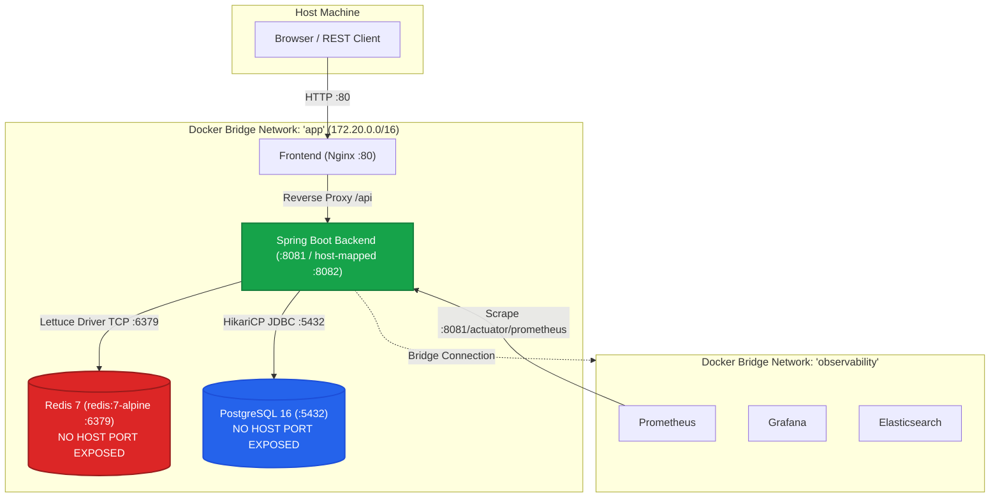

#### Security & Containment Architecture
1. **No Host Port Binding:** As declared in `docker-compose.yml`, the Redis service uses `expose: - "6379"` instead of `ports: - "6379:6379"`. It is reachable exclusively by sibling containers attached to the internal `app` bridge network. This guarantees zero public or local-host port exposure against brute-force or unauthorized memory dump attacks.
2. **Snapshot Persistence (`RDB`):** Launched with flags `redis-server --save 60 1 --loglevel warning`, Redis snapshots its memory dataset to disk if at least 1 write occurred within 60 seconds, persisting state to the named Docker volume `redis_data:/data`.
3. **Container Health Checking:** Docker executes `["CMD", "redis-cli", "ping"]` every 10 seconds. The Spring Boot backend container defines `depends_on: redis: condition: service_healthy`, preventing application startup before Redis accepts socket connections.

---

### 1.2 Spring Data Redis & Lettuce Client Stack

DevOps Suite integrates Spring Boot 3.x with Spring Data Redis via the non-blocking **Lettuce** driver. Lettuce is built on top of **Netty**, allowing multiple threads within the monolith backend to multiplex commands across a single shared thread-safe TCP connection.

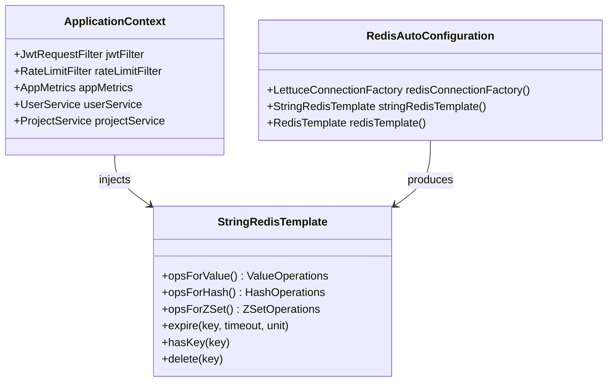

#### Serialization & Template Strategy
DevOps Suite standardizes on `StringRedisTemplate` (which configures `StringRedisSerializer` for keys, values, hash keys, and hash values) and JSON serialization via Jackson:
* **Human-Readable Keys:** Avoids the default Java binary serialization header (`\xac\xed\x00\x05...`), enabling inspection via `redis-cli`.
* **Zero Custom Class Loading Overheads:** Avoids Java deserialization vulnerabilities (RCE via vulnerable deserialization gadgets).
* **Direct Primitive Control:** Commands such as `opsForValue().increment()` operate directly on ASCII numeric strings.

---

### 1.3 Core Use Cases Overview

| # | Use Case | Implementation Class | Redis Data Structure | Primary Mechanism |
|---|---|---|---|---|
| **1** | **JWT Token Revocation** | `JwtRequestFilter.java` | String (`Key-Value`) | O(1) existence check (`hasKey`) before parsing claims |
| **2** | **Cache-Aside Entity Caching** | `UserService.java`, `ProjectService.java` | Hash / String (JSON) | Cache query $\to$ DB fallback $\to$ Cache warm $\to$ Eviction on mutate |
| **3** | **Multi-Tier Rate Limiting** | `RateLimitFilter.java` | String (Atomic Counter) | Fixed/sliding bucket window: `INCR` + conditional `EXPIRE` |
| **4** | **Active User Window Metrics** | `AppMetrics.java` | Sorted Set (`ZSET`) | Member: `userId`, Score: epoch timestamp (`ZREMRANGEBYSCORE` + `ZCARD`) |

---

## 2. Key Schemas & TTL Strategies

All keys follow strict namespacing using colon (`:`) separators, preventing collision between unrelated application domains.

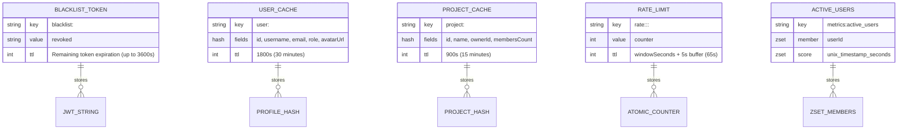

### 2.1 Key Design Table

| Key Pattern | Data Structure | TTL Policy | Size & Memory Impact | Purpose & Justification |
|---|---|---|---|---|
| `blacklist:<token>` | `String` | Remaining token lifetime (`exp - now`) | ~300–500 bytes per active revoked token | Instant invalidation of logged-out or compromised JWTs without maintaining server-side session state for valid tokens. Automatically purged once the token naturally expires. |
| `user:<userId>` | `Hash` (or JSON String) | 30 minutes (`1800s`) | ~500 bytes to 2 KB per active user profile | Caches high-frequency user metadata (name, email, role, bio) accessed on every authenticated API request, eliminating hot-spot queries to PostgreSQL. |
| `project:<projectId>` | `Hash` (or JSON String) | 15 minutes (`900s`) | ~1 KB to 5 KB per active project | Caches workspace context, authorization bounds, and project configurations required across IDE, Kanban tasks, and code execution. |
| `rate:<tier>:<identity>:<bucket>` | `String` (Integer) | Window duration + 5s buffer (`props.getWindowSeconds() + 5`) | ~80–120 bytes per identity window | Atomic request counters for RateLimitFilter tiers (`auth`, `execution`, `api`). 5s TTL buffer absorbs clock drift between app and Redis nodes. |
| `metrics:active_users` | `Sorted Set (ZSET)` | Rolling pruning / 10 min sliding TTL | $O(N)$ where $N$ is count of distinct active users (~64 bytes/user) | Tracks unique authenticated user activity across a sliding 5-minute window for Prometheus metric `devopssuite_active_users`. |

---

## 3. Cache Invalidation Strategy & Patterns

### 3.1 Cache-Aside (Lazy-Loading) Flow

DevOps Suite uses the **Cache-Aside** (Lazy Loading) pattern for read-heavy entities (`User`, `Project`). The application code is responsible for interacting with both the cache and the primary datastore.

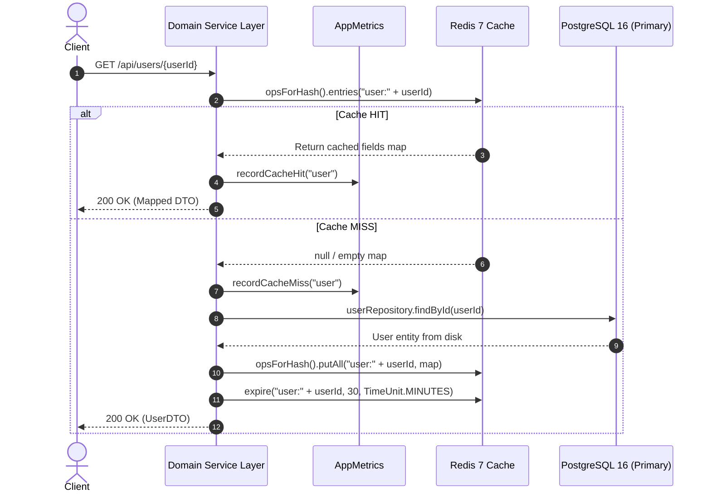

### 3.2 Cache-Aside vs. Write-Through Trade-Offs

| Evaluation Vector | Cache-Aside (DevOps Suite) | Write-Through / Write-Behind | Why DevOps Suite Chose Cache-Aside |
|---|---|---|---|
| **Write Latency** | Low. Mutations write directly to PostgreSQL and evict (`DEL`) from Redis. | High (Write-Through blocks on both DB & cache); or Complex (Write-Behind risks data loss on crash). | Database is the single source of truth; write path stays simple and ACID-compliant. |
| **Cache Freshness** | High consistency on eviction. Stale window is negligible since updates delete keys immediately. | Immediate cache consistency. | Stale reads are eliminated by explicit cache eviction on entity mutations. |
| **Resource Efficiency** | High. Only actively queried users/projects occupy Redis RAM. | Low. Every row written gets cached, polluting memory with idle projects or inactive users. | Developer productivity platforms have high tail-activity (users view only a few projects per day). |
| **Resilience to Failure** | High. If Redis fails, code falls back gracefully to PostgreSQL (fail-open). | Low. If cache layer writes fail, entire transaction fails unless asynchronous fallback is engineered. | Resilience is paramount: code editing, task boards, and container orchestration must continue even if Redis restarts. |

### 3.3 Cache Eviction Triggers & Lifecycle

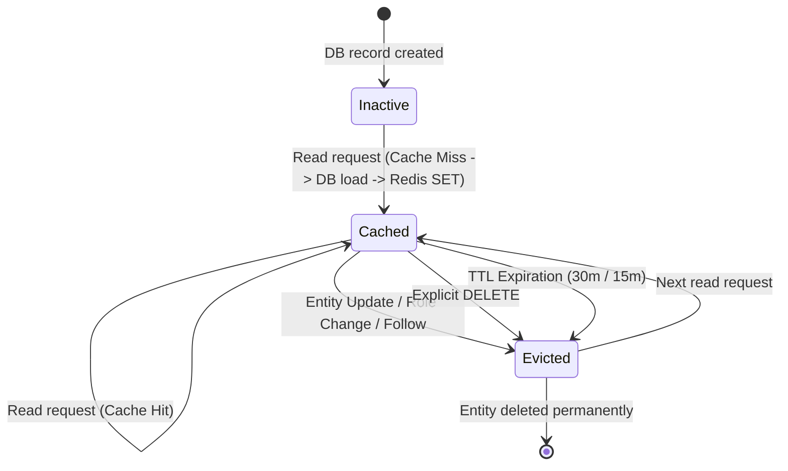

#### Mutation Eviction Triggers in DevOps Suite:
1. **User Profile Invalidation (`user:<userId>`):**
   * Triggered in `UserService.updateProfile(...)`
   * Triggered in `UserService.changeAvatar(...)`
   * Triggered when user follow/unfollow operations alter follower counts.
   * Action: `redisTemplate.delete("user:" + userId)`
2. **Project Cache Invalidation (`project:<projectId>`):**
   * Triggered in `ProjectService.updateProject(...)`
   * Triggered in `ProjectService.deleteProject(...)`
   * Triggered when a collaborator is added, removed, or their RBAC role changes (`ProjectMember` mutations).
   * Action: `redisTemplate.delete("project:" + projectId)`

---

## 4. Comprehensive Technical Interview Q&A

### 🟢 Basic Level

#### Q1: What specific role does Redis play in DevOps Suite, and why isn't PostgreSQL used for everything?
**Answer:**
DevOps Suite leverages Redis 7 for three distinct operational requirements that relational databases handle poorly at scale:
1. **High-Frequency Ephemeral Data:** Rate-limit counters (`rate:api:...`) and sliding-window user activity increment hundreds of times per second. Persisting these in PostgreSQL would cause excessive WAL write amplification, disk I/O churn, and table bloat on disk.
2. **Sub-Millisecond Read Latency for Auth & Caching:** Every incoming HTTP request must check whether a JWT token has been revoked before Spring Security parses claims. Redis performs this in $O(1)$ memory lookup (<0.5ms) via `hasKey()`.
3. **Automatic Expiration (`TTL`):** Redis natively evicts expired keys (e.g., token blacklist expiring after remaining JWT duration, rate limit buckets expiring after 65 seconds). In PostgreSQL, this would require periodic batch cleanup cron jobs that trigger heavy `DELETE` queries, index re-indexing, and `VACUUM` locks.

PostgreSQL remains the durable System of Record for relational entities (Users, Projects, Kanban Tasks, IdeFiles), while Redis acts as a high-speed volatile cache and coordination layer.

```mermaid
flowchart LR
    Request["Incoming Request"] --> Filter["JwtRequestFilter / RateLimitFilter"]
    Filter -->|1. O(1) Check / Incr| Redis[("Redis 7 (RAM)")]
    Filter -->|2. Pass Authenticated| Service["Service Layer"]
    Service -->|3. Cache Hit? Read| Redis
    Service -->|4. Miss? Query & Store| PG[("PostgreSQL (Disk)")]
```

---

#### Q2: How is Redis deployed in DevOps Suite Docker environment, and how is network security enforced?
**Answer:**
Redis is configured in `docker-compose.yml` under the service name `redis` with the lightweight `redis:7-alpine` image:

```yaml
redis:
  image: redis:7-alpine
  container_name: devopssuite-redis
  command: ["redis-server", "--save", "60", "1", "--loglevel", "warning"]
  expose:
    - "6379"
  volumes:
    - redis_data:/data
  healthcheck:
    test: ["CMD", "redis-cli", "ping"]
    interval: 10s
    timeout: 5s
    retries: 5
  networks:
    - app
```

**Security and isolation features:**
1. **No External Port Forwarding:** Notice `expose: - "6379"` instead of `ports: - "6379:6379"`. The Redis port is not accessible from the host OS, public internet, or any other Docker network.
2. **Bridge Network Segregation:** Redis is attached exclusively to the internal bridge network `app`. Only `devopssuite-backend` can resolve `redis:6379` via Docker DNS. Observability tools (`prometheus`, `elasticsearch`, `grafana`) live on the separate `observability` network and cannot talk to Redis directly.
3. **Data Durability:** Even though it is an in-memory cache, the named volume `redis_data` maps `/data` to host storage with `RDB` snapshots (`--save 60 1`), so container restarts do not immediately wipe active rate limits or blacklisted tokens.

---

#### Q3: Which Spring Data Redis template does DevOps Suite use, and why is `StringRedisTemplate` preferred over `RedisTemplate<Object, Object>`?
**Answer:**
DevOps Suite injects `StringRedisTemplate` (seen in [`JwtRequestFilter.java`](file:///d:/Projects/DevOps%20Suite/backend/src/main/java/com/devopssuite/security/JwtRequestFilter.java#L30) and [`RateLimitFilter.java`](file:///d:/Projects/DevOps%20Suite/backend/src/main/java/com/devopssuite/security/RateLimitFilter.java#L49)):

```java
private final StringRedisTemplate redisTemplate;
```

**Reasons for this choice:**
* **String-Only Serialization:** Default `RedisTemplate<Object, Object>` uses `JdkSerializationRedisSerializer`. That serializer prepends binary class metadata bytes (such as `\xac\xed\x00\x05t\x00\x0f...`), rendering keys unreadable in `redis-cli`, inflating RAM usage, and introducing security vulnerabilities if serialized Java classes change between releases.
* **Atomic Counter Compatibility:** Redis commands like `INCR`, `DECR`, `HINCRBY`, and `EXPIRE` strictly expect numeric representations stored as plain ASCII text. Passing serialized Java integers or objects to `INCR` triggers Redis `ERR value is not an integer or out of range`.
* **Interoperability:** JSON payloads serialized with Jackson and stored via `StringRedisTemplate` can be inspected by CLI tools, node.js microservices, or admin scripts without needing JVM class files.

---

### 🟡 Intermediate Level

#### Q4: How does stateless JWT revocation work using Redis in `JwtRequestFilter`?
**Answer:**
Standard JWTs are self-contained and cryptographically signed; by default, they cannot be invalidated before their expiration timestamp (`exp`). DevOps Suite implements a **Hybrid Stateless Revocation Pattern**:

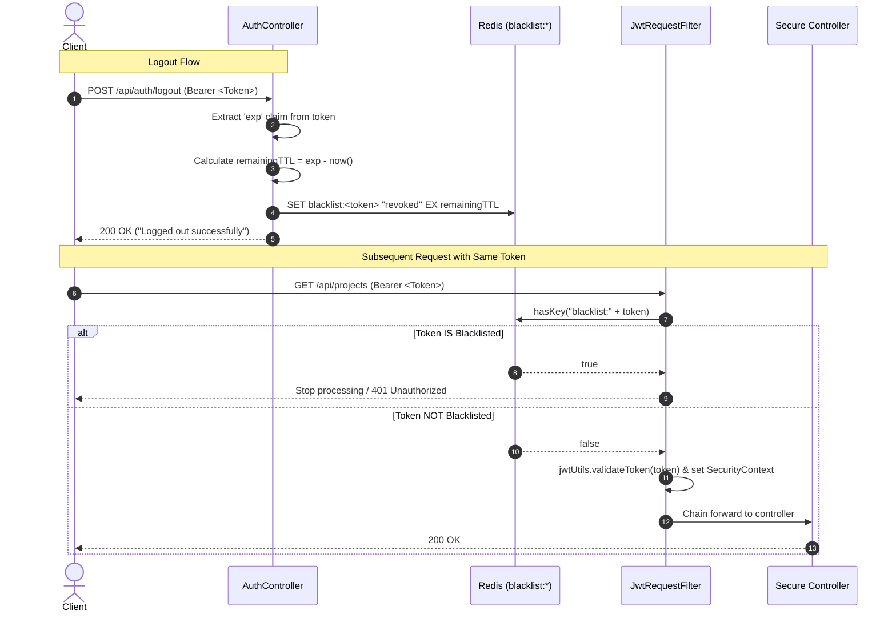

**Implementation in [`JwtRequestFilter.java`](file:///d:/Projects/DevOps%20Suite/backend/src/main/java/com/devopssuite/security/JwtRequestFilter.java#L47-L52):**
```java
String authHeader = request.getHeader(HttpHeaders.AUTHORIZATION);
if (authHeader != null && authHeader.startsWith("Bearer ")) {
    String token = authHeader.substring(7);
    
    // Reject blacklisted tokens immediately in O(1)
    if (Boolean.TRUE.equals(redisTemplate.hasKey("blacklist:" + token))) {
        filterChain.doFilter(request, response); // Context remains unauthenticated
        return;
    }

    if (jwtUtils.validateToken(token)) {
        // Parse claims and establish SecurityContext
    }
}
```

**Key Optimizations:**
1. **Dynamic TTL:** When blacklisting on logout, the TTL is calculated as:
   $$\text{TTL} = \text{Claims.getExpiration().getTime()} - \text{System.currentTimeMillis()}$$
   Once the token naturally expires, Redis removes the key automatically. The blacklist does not grow unbounded.
2. **Storage Efficiency:** Only *revoked* tokens are stored in Redis ($O(\text{revoked})$), rather than storing every active login session ($O(\text{all users})$).

---

#### Q5: How does the sliding/fixed window rate limiter work in `RateLimitFilter.java`? Walk through the code.
**Answer:**
DevOps Suite uses an atomic **bucketed window algorithm** implemented as a Spring `OncePerRequestFilter`.

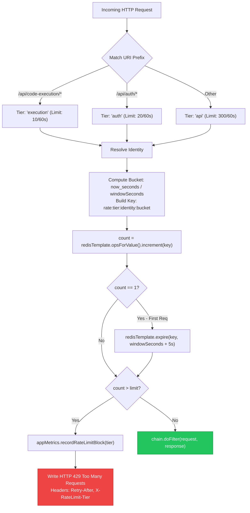

**Code Breakdown from [`RateLimitFilter.java`](file:///d:/Projects/DevOps%20Suite/backend/src/main/java/com/devopssuite/security/RateLimitFilter.java#L70-L106):**
```java
// 1. Resolve Tier & Limits
String tier;
int limit;
if (isExecutionEndpoint(uri)) {
    tier = "execution"; limit = props.getExecutionMax(); // 10
} else if (isAuthEndpoint(uri)) {
    tier = "auth";      limit = props.getAuthMax();      // 20
} else {
    tier = "api";       limit = props.getApiMax();       // 300
}

// 2. Identity Resolution (UserId if authenticated, else IP with X-Forwarded-For)
String identity = resolveIdentity(request);

// 3. Time Bucket & Key Generation
long bucket = System.currentTimeMillis() / 1000 / props.getWindowSeconds(); // 60s
String key = "rate:" + tier + ":" + identity + ":" + bucket;

try {
    // 4. Atomic Increment
    Long count = redisTemplate.opsForValue().increment(key);
    
    // 5. Expiration set only on first request in window
    if (count != null && count == 1L) {
        redisTemplate.expire(key, props.getWindowSeconds() + 5, TimeUnit.SECONDS);
    }

    // 6. Limit Evaluation
    if (count != null && count > limit) {
        appMetrics.recordRateLimitBlock(tier);
        log.warn("Rate limit exceeded: tier={} identity={} count={} limit={}", tier, identity, count, limit);
        writeRateLimitResponse(response, tier, limit);
        return; // Short-circuit pipeline
    }
} catch (Exception e) {
    // Fail-open strategy
    log.debug("Rate limit Redis error (failing open): {}", e.getMessage());
}

chain.doFilter(request, response);
```

**Key Architectural Details:**
* **Identity Determination:** Authenticated requests are scoped to `uid:<UUID>`, so users cannot bypass limits by hopping across Wi-Fi or proxies. Unauthenticated requests fallback to `ip:<IP>` parsed from `X-Forwarded-For` or `remoteAddr`.
* **5-Second Buffer:** Expire is set to `props.getWindowSeconds() + 5` (65 seconds). This safety margin prevents key expiration while a request in the final millisecond is in flight.

---

#### Q6: How does the application implement the Cache-Aside pattern for Users and Projects?
**Answer:**
In Cache-Aside, the application coordinates between Redis and PostgreSQL:

```java
@Service
@RequiredArgsConstructor
@Slf4j
public class UserService {
    private final UserRepository userRepository;
    private final StringRedisTemplate redisTemplate;
    private final ObjectMapper objectMapper;
    private final AppMetrics appMetrics;

    private static final String USER_CACHE_PREFIX = "user:";
    private static final Duration USER_CACHE_TTL = Duration.ofMinutes(30);

    public UserDTO getUserById(UUID userId) {
        String cacheKey = USER_CACHE_PREFIX + userId;

        // 1. Attempt Cache Read
        try {
            String cachedJson = redisTemplate.opsForValue().get(cacheKey);
            if (cachedJson != null && !cachedJson.isBlank()) {
                appMetrics.recordCacheHit("user");
                return objectMapper.readValue(cachedJson, UserDTO.class);
            }
        } catch (Exception e) {
            log.warn("Redis read failed for user {}: {}", userId, e.getMessage());
        }

        // 2. Cache Miss: Fall back to PostgreSQL
        appMetrics.recordCacheMiss("user");
        User user = userRepository.findById(userId)
                .orElseThrow(() -> new ResourceNotFoundException("User not found: " + userId));
        
        UserDTO dto = UserDTO.fromEntity(user);

        // 3. Populate Cache Asynchronously or Inline
        try {
            String json = objectMapper.writeValueAsString(dto);
            redisTemplate.opsForValue().set(cacheKey, json, USER_CACHE_TTL);
        } catch (Exception e) {
            log.warn("Redis write failed for user {}: {}", userId, e.getMessage());
        }

        return dto;
    }

    @Transactional
    public UserDTO updateUserProfile(UUID userId, UpdateProfileRequest request) {
        User user = userRepository.findById(userId)
                .orElseThrow(() -> new ResourceNotFoundException("User not found: " + userId));
        
        user.updateBio(request.getBio());
        user.setName(request.getName());
        userRepository.save(user);

        // 4. Invalidation on Mutation: Delete key
        try {
            redisTemplate.delete(USER_CACHE_PREFIX + userId);
        } catch (Exception e) {
            log.error("Failed to evict user cache {}: {}", userId, e.getMessage());
        }

        return UserDTO.fromEntity(user);
    }
}
```

**Key Invalidation Rules:**
* Never update the cache directly inside a database transaction (`@Transactional`). If the database transaction rolls back due to a constraint violation, the cache would contain dirty data.
* Instead, issue `redisTemplate.delete(cacheKey)` **after** database commit or right at the end of the service method.

---

### 🔴 Advanced Level

#### Q7: What happens if Redis crashes or is temporarily unreachable? Explain the "Fail-Open vs. Fail-Closed" design decision in DevOps Suite.
**Answer:**
DevOps Suite uses a **deliberate split strategy**:

| Layer | Strategy | Behavior on Redis Outage | Security / Business Justification |
|---|---|---|---|
| **RateLimitFilter** | **Fail-Open** | Allows requests through to downstream filters | **Availability over throttling:** A Redis network glitch should never bring down the IDE, code submission pipelines, or Kanban boards for paying developers. |
| **JwtRequestFilter** | **Fail-Closed on Revocation** | Fails open on blacklist lookup errors (logs warning, validates crypto signature) | **Stateless fallback:** The JWT itself contains a cryptographic signature and short 1-hour expiration. If Redis drops offline, previously logged-out tokens might work until their 1-hour `exp` passes, but legitimate users remain unblocked. |
| **Cache-Aside Services** | **Fail-Open** | Falls back directly to PostgreSQL queries | **Data Availability:** Cache misses simply query PostgreSQL. PostgreSQL connection pools (HikariCP) handle the traffic directly. |

**Evidence from `RateLimitFilter.java` (Lines 101–106):**
```java
try {
    Long count = redisTemplate.opsForValue().increment(key);
    // ... rate limit logic ...
} catch (Exception e) {
    // Redis failure — fail open
    log.debug("Rate limit Redis error (failing open): {}", e.getMessage());
}
// Crucial: Request continues even if Redis threw RedisConnectionFailureException!
chain.doFilter(request, response);
```

**Follow-Up: How do you prevent PostgreSQL from being crushed if Redis fails-open during peak load?**
1. **HikariCP Pool Clamping:** PostgreSQL connection pool size is fixed (`maximum-pool-size: 10`, `minimum-idle: 5`). Hikari will queue requests rather than opening thousands of connections and exhausting database memory.
2. **Circuit Breakers (Resilience4j):** In production setups, wrapping Redis cache calls in a CircuitBreaker prevents thread exhaustion. If Redis times out repeatedly, the circuit opens for 30 seconds, immediately routing all reads to the DB without wasting thread pool time waiting for Redis socket timeouts.

---

#### Q8: How are Redis Sorted Sets (`ZSET`) used to calculate the `devopssuite_active_users` metric over a 5-minute sliding window?
**Answer:**
Prometheus needs to expose the number of distinct active users over the trailing 5 minutes via actuator metric `devopssuite_active_users`. Doing this in SQL would require:
```sql
SELECT count(DISTINCT user_id) FROM audit_logs WHERE timestamp > NOW() - INTERVAL '5 minutes';
```
This is a full index scan or sequential scan every Prometheus scrape (every 15 seconds).

**The Redis Sorted Set Solution:**
Redis Sorted Sets (`ZSET`) maintain unique elements ordered by a floating-point `score`. We use the **Unix epoch timestamp (seconds)** as the score and the `userId` as the member string:

```mermaid
flowchart TD
    subgraph ZSET ["ZSET: 'metrics:active_users'"]
        direction LR
        U1["Member: 'user-101'\nScore: 1717200100 (t - 6m)"]
        U2["Member: 'user-204'\nScore: 1717200250 (t - 3.5m)"]
        U3["Member: 'user-305'\nScore: 1717200400 (t - 1m)"]
    end

    Req["User Activity / API Request"] -->|1. ZADD metrics:active_users now() userId| ZSET
    Cron["Scheduled Pruning & Metric Collector (every 30s)"] -->|2. ZREMRANGEBYSCORE metrics:active_users -inf (now - 300)| Prune["Removes Expired (user-101)"]
    Cron -->|3. ZCARD metrics:active_users| Count["Returns Active Count: 2"]
    Count -->|4. Gauge Update| Prom["AppMetrics.activeUserCount.set(count)"]
```

**Implementation Algorithm:**
1. **On Every Authenticated Request (Filter / Interceptor):**
   ```java
   long currentEpochSec = Instant.now().getEpochSecond();
   redisTemplate.opsForZSet().add("metrics:active_users", userId, currentEpochSec);
   ```
   *If the user already exists in the set, `ZADD` simply updates their score to the latest timestamp in $O(\log N)$ time.*

2. **Scheduled Metric Updater (Scheduled Task every 30s):**
   ```java
   @Scheduled(fixedRate = 30000)
   public void updateActiveUserMetrics() {
       long now = Instant.now().getEpochSecond();
       long windowStart = now - 300; // 5 minutes ago (300 seconds)

       // 1. Remove users who haven't made a request in the last 5 minutes
       redisTemplate.opsForZSet().removeRangeByScore("metrics:active_users", Double.NEGATIVE_INFINITY, windowStart);

       // 2. Count distinct members remaining
       Long count = redisTemplate.opsForZSet().zCard("metrics:active_users");

       // 3. Update Micrometer Gauge backing variable
       appMetrics.getActiveUserCount().set(count != null ? count : 0L);
   }
   ```
   This is then scraped seamlessly by Prometheus via `devopssuite.active.users` registered in [`AppMetrics.java`](file:///d:/Projects/DevOps%20Suite/backend/src/main/java/com/devopssuite/metrics/AppMetrics.java#L39-L41).

---

#### Q9: How do you prevent Cache Stampede (Thundering Herd) when a hot key (like a popular project) expires?
**Answer:**
A **Cache Stampede** occurs when a high-traffic cached key (e.g., `project:0000-0000-root`) expires, and 500 concurrent HTTP requests simultaneously find a cache miss. All 500 threads rush to query PostgreSQL simultaneously, spiking CPU and exhausting database connection pools.

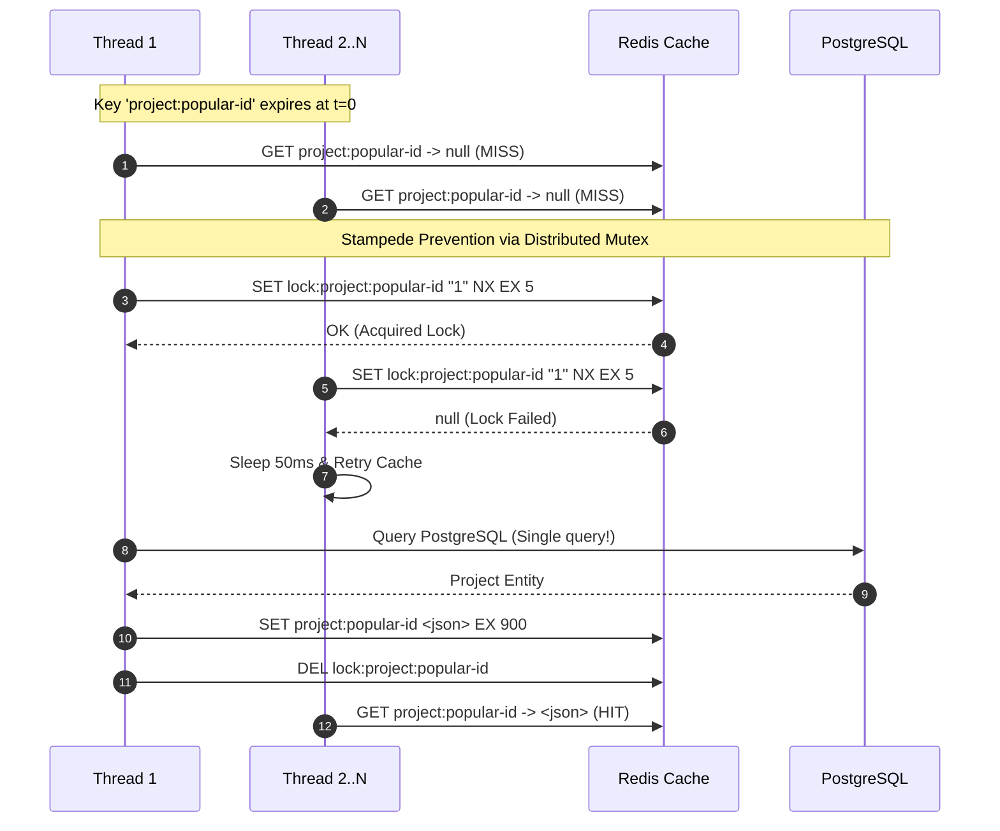

**DevOps Suite Strategies to mitigate stampede:**
1. **Mutual Exclusion Lock (`SETNX`):**
   Only the first thread that misses the cache is permitted to query the database using Redis `SET key value NX EX 5`. All other threads wait 50ms and re-query the cache.
   ```java
   public ProjectDTO getProjectWithMutex(UUID projectId) {
       String cacheKey = "project:" + projectId;
       String lockKey = "lock:" + cacheKey;
       
       String cached = redisTemplate.opsForValue().get(cacheKey);
       if (cached != null) return deserialize(cached);

       // Acquire lock with 5s timeout
       Boolean acquired = redisTemplate.opsForValue().setIfAbsent(lockKey, "1", Duration.ofSeconds(5));
       if (Boolean.TRUE.equals(acquired)) {
           try {
               ProjectDTO dto = loadFromDbAndSerialize(projectId);
               redisTemplate.opsForValue().set(cacheKey, serialize(dto), Duration.ofMinutes(15));
               return dto;
           } finally {
               redisTemplate.delete(lockKey);
           }
       } else {
           // Wait and retry once
           try { Thread.sleep(60); } catch (InterruptedException ignored) {}
           return deserialize(redisTemplate.opsForValue().get(cacheKey));
       }
   }
   ```
2. **TTL Jitter (Probabilistic Expiration):**
   Add random noise (e.g., $\pm 10\%$) to base TTL values when writing to Redis (`Duration.ofSeconds(900 + ThreadLocalRandom.current().nextInt(-60, 60))`). This prevents keys created in the same batch from expiring in unison.

---

### ⚫ Expert Level

#### Q10: Analyze the race conditions in `RateLimitFilter.java`. Why can `count == 1` miss setting an expiry, and how can Lua scripting fix it?
**Answer:**
Let's analyze the current implementation from [`RateLimitFilter.java`](file:///d:/Projects/DevOps%20Suite/backend/src/main/java/com/devopssuite/security/RateLimitFilter.java#L89-L93):

```java
Long count = redisTemplate.opsForValue().increment(key);
if (count != null && count == 1L) {
    // First request in this window — set expiry (window + 5 s buffer)
    redisTemplate.expire(key, props.getWindowSeconds() + 5, TimeUnit.SECONDS);
}
```

**The Critical Failure Modes:**
1. **Process Crash / Restart Between `INCR` and `EXPIRE`:**
   If the Spring Boot JVM crashes, OOMs, or the container is restarted right after `increment(key)` returns `1`, but before `expire(...)` is executed, the key will exist with **NO TTL (infinite retention)**.
   *Consequence:* The counter will accumulate requests forever; the user or IP will remain permanently blocked once the counter hits the ceiling!
2. **Concurrent Requests on Uninitialized Key:**
   If 2 requests from the same user hit two different threads simultaneously when the key does not exist:
   * Thread A executes `INCR` $\to$ gets `1`.
   * Thread B executes `INCR` $\to$ gets `2`.
   * If Thread A crashes or experiences a network partition before `expire()`, Thread B sees `count == 2` and *never* executes `expire()`. The key remains immortal.

**The Production Fix: Atomic Execution via Redis Lua Script**
Redis executes Lua scripts atomically in a single event-loop cycle. By combining increment and expiry into one Redis transaction, we eliminate network roundtrips and guarantee atomic execution:

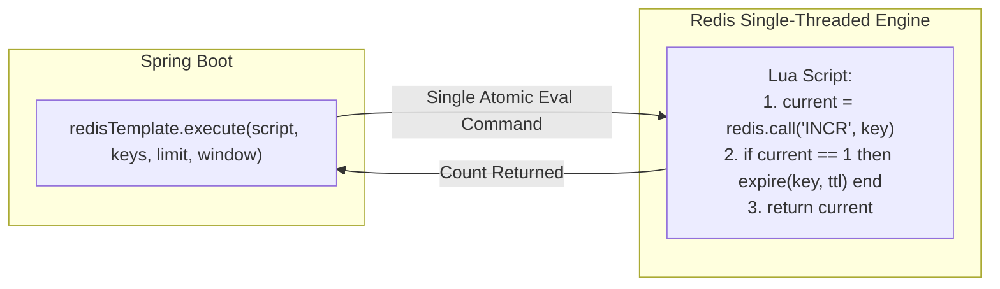

**Production-Grade Redis Lua Script:**
```lua
local current = redis.call('INCR', KEYS[1])
if tonumber(current) == 1 then
    redis.call('EXPIRE', KEYS[1], ARGV[1])
end
return current
```

**Java Integration:**
```java
private static final RedisScript<Long> RATE_LIMIT_SCRIPT = new DefaultRedisScript<>(
    "local current = redis.call('INCR', KEYS[1]); " +
    "if tonumber(current) == 1 then " +
    "    redis.call('EXPIRE', KEYS[1], ARGV[1]); " +
    "end; " +
    "return current;", 
    Long.class
);

// In doFilterInternal:
Long count = redisTemplate.execute(
    RATE_LIMIT_SCRIPT, 
    Collections.singletonList(key), 
    String.valueOf(props.getWindowSeconds() + 5)
);
```

---

#### Q11: Compare the Fixed-Window Rate Limiting used in DevOps Suite with a True Sliding Window Log and Token Bucket algorithm in Redis.
**Answer:**

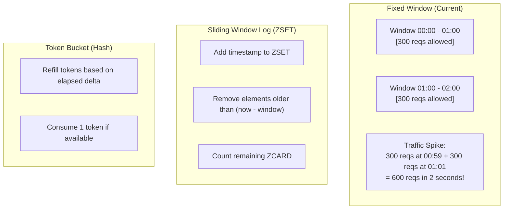

| Algorithm | Mechanism in Redis | Memory Complexity | CPU Overhead | Edge-Case Vulnerabilities |
|---|---|---|---|---|
| **Fixed Window Counter** *(DevOps Suite)* | `INCR rate:tier:id:bucket` + `EXPIRE` | $O(1)$ (~100 bytes per active key) | Extremely low (1 `INCR` command) | **Boundary Burst:** A user can send their maximum allowance at minute 0:59 and another burst at 1:01, effectively delivering $2\times$ the rate limit in a 2-second span. |
| **Sliding Window Log** | `ZADD key now uuid`, `ZREMRANGEBYSCORE key 0 (now-win)`, `ZCARD key` | $O(N)$ where $N$ is total requests in the window | High (Multiple ZSET operations per request) | Eliminates boundary bursts completely, but memory usage explodes under heavy DDoS attack. |
| **Token Bucket** | `Hash` storing `{last_refill, tokens}` evaluated via Lua script | $O(1)$ (~150 bytes per active key) | Moderate (Lua math execution) | Supports smooth bursts up to bucket capacity, but requires floating point math inside Lua script. |

**Verdict for DevOps Suite:**
Fixed Window was chosen because:
1. It is resilient, requiring minimal memory overhead.
2. The code execution sandbox tier already has a tiny limit (10 requests/minute), meaning a boundary burst of 20 executions is capped by Docker queue concurrency workers (`DOCKER_POOL_SIZE: 10`).

---

#### Q12: How would you scale the Redis architecture if DevOps Suite moved from a single monolith instance to a multi-instance cluster?
**Answer:**
Moving from a single-container Redis to a multi-node topology requires addressing connection pooling, data sharding, and script execution:

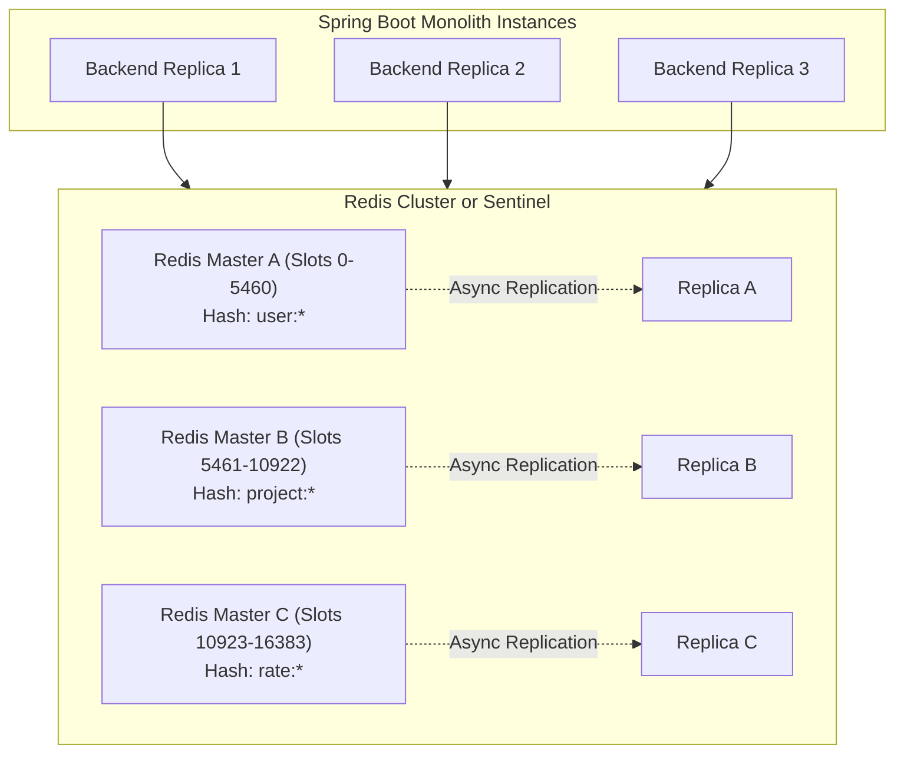

**Required Architectural Modifications:**
1. **Lettuce Connection Pooling:**
   Switch Lettuce from a single shared connection to a pooled configuration via `commons-pool2` to support high thread contention across instances:
   ```yaml
   spring.data.redis.lettuce.pool.max-active: 50
   spring.data.redis.lettuce.pool.max-idle: 20
   spring.data.redis.lettuce.pool.min-idle: 5
   ```
2. **Redis Cluster Hash Tags `{...}` for Multi-Key Operations:**
   In Redis Cluster, keys are partitioned across 16,384 hash slots based on `CRC16(key)`. Multi-key commands or Lua scripts will fail with `CROSSSLOT Keys in request don't hash to the same slot` unless hash tags are used:
   * *Bad:* `rate:api:user1:bucket1` and `rate:api:user1:bucket2` can land on different nodes.
   * *Good:* `rate:api:{user1}:bucket1` forces Redis to calculate the hash slot using only `{user1}`, ensuring all buckets for that user reside on the same cluster node.
3. **High Availability with Redis Sentinel vs. Cluster:**
   For DevOps Suite's memory footprint (< 10 GB), **Redis Sentinel with 1 Master + 2 Replicas** is preferable to Cluster. Sentinel provides automatic failover without the complexity of hash slot partitioning and client-side cluster routing.

---

## 5. Quick Reference & Cheat Sheet

### Key Patterns at a Glance
```
# JWT Revocation
GET blacklist:<raw_jwt_token>           -> "revoked" | null

# Cache-Aside Entities
HGETALL user:<uuid>                    -> User profile fields (30m TTL)
HGETALL project:<uuid>                 -> Project metadata (15m TTL)

# Rate Limiting
GET rate:<tier>:<identity>:<bucket>     -> Request counter integer (65s TTL)
# Identity = "uid:<uuid>" (auth) or "ip:<addr>" (anon)
# Tiers    = execution (10/min), auth (20/min), api (300/min)

# Active User Metrics
ZREMRANGEBYSCORE metrics:active_users -inf (now - 300)
ZCARD metrics:active_users              -> Current active users gauge
```

### Essential Commands
* **Inspect blacklist:** `redis-cli KEYS "blacklist:*"`
* **Check rate limit counter:** `redis-cli GET "rate:execution:uid:00000000-0000-0000-0000-000000000001:2839485"`
* **Check memory usage:** `redis-cli INFO memory`
* **Monitor real-time operations:** `redis-cli MONITOR`

### Core Design Rules
1. **Always set TTL on cache sets:** Never use indefinite `opsForValue().set(k, v)` without explicit `Duration`.
2. **Fail-Open on Throttling:** Let user traffic pass if Redis is down rather than disabling the application.
3. **Evict, Don't Update:** On DB writes, delete the cache key rather than recalculating the cache payload inside the transaction.
