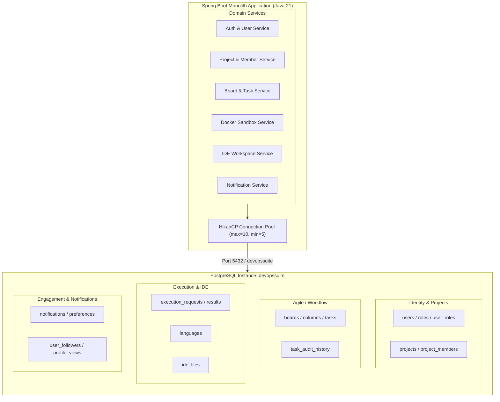
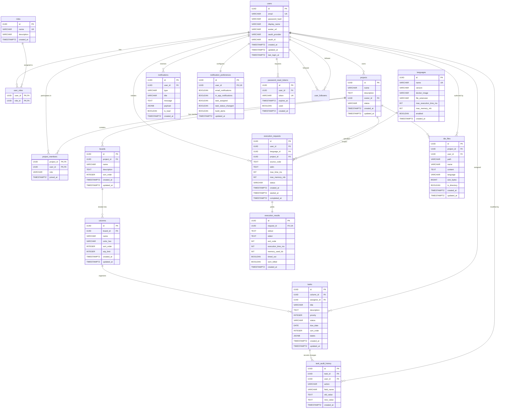
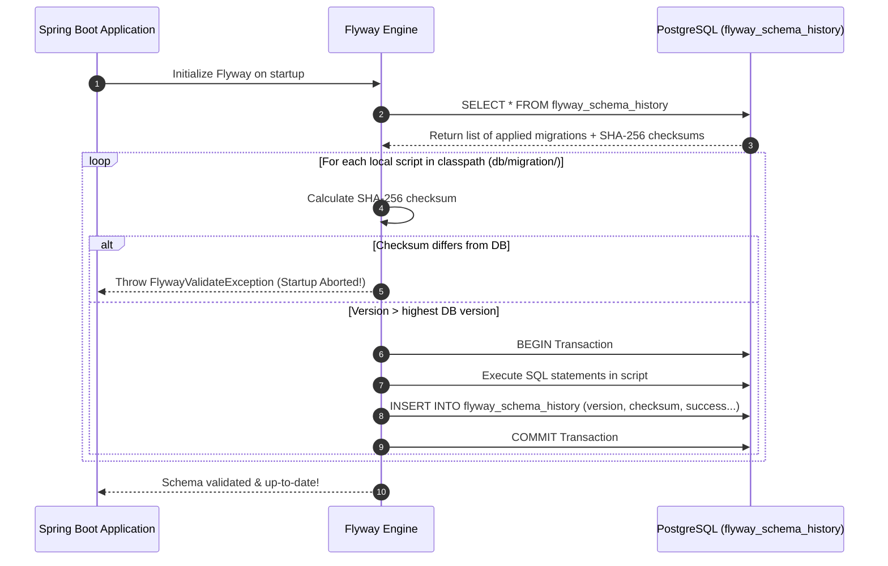
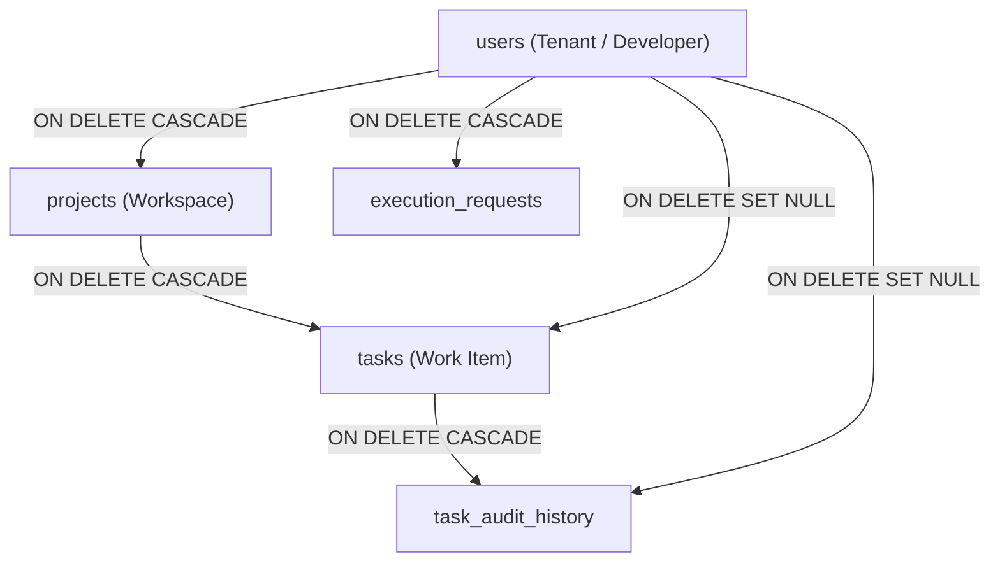
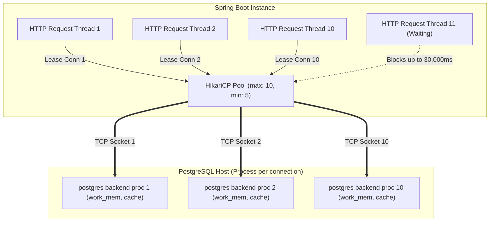

# PostgreSQL Database Schema & Flyway Migration Strategy

An exhaustive, production-grade interview guide on relational database architecture, table schemas, foreign key cascade strategies, index optimization, and the complete 16-migration Flyway evolution pipeline in the **DevOps Suite** full-stack developer productivity platform.

---

## 1. Database Architecture & Design

### 1.1 Single-Database Architecture (`devopssuite`)

The DevOps Suite monolith utilizes a single dedicated PostgreSQL 16/17 database named `devopssuite`. Although the platform delivers distinct functional capabilities—project management, agile Kanban boards, cloud code execution sandboxing, in-browser Monaco IDE virtual workspaces, real-time activity audit logging, and role-based notification dispatching—all domain aggregates reside within the same transactional schema.



#### Why Single Database Over Multi-Database / Microservices DBs

In modern distributed systems, decomposing databases prematurely is one of the most common anti-patterns. DevOps Suite intentionally adopts a unified PostgreSQL database based on four technical pillars:

1. **ACID Transactions Across Domains:**
   Operations such as project deletion require atomic cascading across project members, Kanban boards, columns, tasks, task audit logs, and IDE files. In a single database, this is executed with standard PostgreSQL transactional guarantees (`@Transactional`) without requiring two-phase commits (2PC), distributed saga orchestrators, or eventual consistency hazards.
2. **Declarative Foreign Key Enforcement & Referencing:**
   Enforcing relational integrity at the database engine level prevents orphan rows. When a user is removed, PostgreSQL's `ON DELETE CASCADE` and `ON DELETE SET NULL` constraints guarantee data hygiene instantly, avoiding complex background orphan cleanup jobs.
3. **Optimized Network Roundtrips & Connection Pooling:**
   A single HikariCP connection pool manages pooled JDBC connections (`maximum-pool-size: 10`, `minimum-idle: 5`). Services query cross-domain relations via indexed `JOIN` operations rather than chatty inter-service REST or gRPC calls.
4. **Operational Simplicity & Disaster Recovery:**
   Point-in-time recovery (PITR), PostgreSQL Write-Ahead Logging (WAL) archiving, and automated `pg_dump` snapshots operate over a single cluster and logical database. Backup consistency across cross-domain entities is guaranteed at the exact same log sequence number (LSN).

---

### 1.2 Entity-Relationship Diagram (Complete Database Schema)

The following Mermaid ER diagram illustrates the complete relational topology across all 14 core domain tables and junction tables.



---

### 1.3 Table Inventory & Column Specifications

| Table Name | Primary Key | Foreign Keys | Index Definitions | Design Role & Invariants |
| :--- | :--- | :--- | :--- | :--- |
| `users` | `id` (UUID) | None | `UNIQUE (email)` | Central identity entity; supports internal BCrypt passwords and OAuth2 federation. |
| `roles` | `id` (UUID) | None | `UNIQUE (name)` | Platform system roles (e.g., `ROLE_ADMIN`, `ROLE_USER`). |
| `user_roles` | Composite (`user_id`, `role_id`) | `users(id)`, `roles(id)` | Composite PK | Many-to-many relationship table joining users to roles with cascade deletions. |
| `projects` | `id` (UUID) | `owner_id -> users(id)` | `idx_projects_owner (owner_id)` | Tenant project root aggregate. Cascades deletion to boards, members, files. |
| `project_members` | Composite (`project_id`, `user_id`) | `projects(id)`, `users(id)` | `idx_proj_member_user`, `idx_proj_member_project` | RBAC project membership (`OWNER`, `ADMIN`, `MEMBER`, `VIEWER`). |
| `boards` | `id` (UUID) | `project_id -> projects(id)` | `idx_boards_project (project_id)` | Agile boards belonging to a project; ordered by `sort_order`. |
| `columns` | `id` (UUID) | `board_id -> boards(id)` | `idx_columns_board (board_id)` | Kanban swimlane columns (e.g., Backlog, In Progress, Done) with WIP limits. |
| `tasks` | `id` (UUID) | `column_id -> columns(id)`, `assignee_id -> users(id)` | `idx_tasks_column`, `idx_tasks_assignee`, `idx_tasks_labels_gin` | Work item entity with priority, status, and JSONB tags. |
| `task_audit_history` | `id` (UUID) | `task_id -> tasks(id)`, `user_id -> users(id)` | `idx_audit_task (task_id)`, `idx_audit_created` | Append-only historical log of all attribute transitions and reassignments. |
| `languages` | `id` (UUID) | None | `UNIQUE (name)` | Supported execution runtimes (Python, JS, Java, C++) and Docker image metadata. |
| `execution_requests` | `id` (UUID) | `user_id -> users(id)`, `language_id -> languages(id)`, `project_id -> projects(id)` | `idx_exec_user`, `idx_exec_status`, `idx_exec_created`, `idx_exec_project` | Execution submission metadata, time/memory limits, lifecycle state. |
| `execution_results` | `id` (UUID) | `request_id -> execution_requests(id)` | `UNIQUE (request_id)`, `idx_result_request` | 1-to-1 execution outputs: stdout, stderr, exit code, OOM flags, duration. |
| `ide_files` | `id` (UUID) | `project_id -> projects(id)`, `user_id -> users(id)` | `idx_ide_files_proj_path UNIQUE(project_id, path)` | Virtual in-memory/in-database project filesystem for Monaco IDE workspace. |
| `notifications` | `id` (UUID) | `user_id -> users(id)` | `idx_notif_user_unread (user_id, is_read)` | User notification inbox for task and execution events with JSONB payloads. |
| `notification_preferences` | `id` (UUID) | `user_id -> users(id)` | `UNIQUE (user_id)` | Granular user delivery preferences (email vs web push vs category toggles). |
| `password_reset_tokens`| `id` (UUID) | `user_id -> users(id)` | `UNIQUE (token)`, `idx_prt_user` | Secure random reset tokens with expiration timestamps and usage state. |

---

## 2. All 16 Flyway Migrations (V1 to V16)

All database versioning scripts are strictly managed under `backend/src/main/resources/db/migration/` following standard SQL format: `V{version}__{description}.sql`.

```
backend/src/main/resources/db/migration/
├── V1__Initial_Schema.sql
├── V2__Projects_And_Members.sql
├── V3__Kanban_Boards_And_Columns.sql
├── V4__Tasks_And_Indexes.sql
├── V5__Add_Cpp_Language_Support.sql
├── V6__Task_Audit_History.sql
├── V7__Task_Labels_And_Tags.sql
├── V8__Code_Execution_Requests.sql
├── V9__Code_Execution_Results.sql
├── V10__Languages_Table_And_Seed.sql
├── V11__Ide_Virtual_Files.sql
├── V12__User_Social_Features.sql
├── V13__In_App_Notifications.sql
├── V14__User_Notification_Preferences.sql
├── V15__Password_Reset_Tokens.sql
└── V16__Execution_Request_Project_Correlation.sql
```

---

### Migration V1: Core User Schema, Roles, Initial Seed
- **Filename:** `V1__Initial_Schema.sql`
- **Purpose:** Establishes the foundational authentication and authorization model.
- **DDL & Changes:**
  - Creates tables `roles`, `users`, and junction table `user_roles`.
  - Sets UUID primary keys using standard PostgreSQL UUID types.
  - Adds indices on unique email constraints and timestamp defaults.
  - Seeds baseline system roles: `ROLE_USER` and `ROLE_ADMIN`.

```sql
CREATE TABLE IF NOT EXISTS roles (
    id UUID PRIMARY KEY,
    name VARCHAR(255) NOT NULL UNIQUE,
    description VARCHAR(255),
    created_at TIMESTAMPTZ NOT NULL DEFAULT CURRENT_TIMESTAMP
);

CREATE TABLE IF NOT EXISTS users (
    id UUID PRIMARY KEY,
    email VARCHAR(255) NOT NULL UNIQUE,
    password_hash VARCHAR(255),
    display_name VARCHAR(255),
    avatar_url VARCHAR(255),
    oauth_provider VARCHAR(255),
    oauth_id VARCHAR(255),
    created_at TIMESTAMPTZ NOT NULL DEFAULT CURRENT_TIMESTAMP,
    updated_at TIMESTAMPTZ NOT NULL DEFAULT CURRENT_TIMESTAMP,
    last_login_at TIMESTAMPTZ
);

CREATE TABLE IF NOT EXISTS user_roles (
    user_id UUID NOT NULL REFERENCES users(id) ON DELETE CASCADE,
    role_id UUID NOT NULL REFERENCES roles(id) ON DELETE CASCADE,
    PRIMARY KEY (user_id, role_id)
);

INSERT INTO roles (id, name, description) VALUES
    ('a0000000-0000-0000-0000-000000000001', 'ROLE_USER', 'Standard platform user permissions'),
    ('a0000000-0000-0000-0000-000000000002', 'ROLE_ADMIN', 'Platform administrative permissions')
ON CONFLICT (name) DO NOTHING;
```

---

### Migration V2: Projects & Project Members
- **Filename:** `V2__Projects_And_Members.sql`
- **Purpose:** Introduces the project workspace aggregation root and collaborative multi-tenancy.
- **DDL & Changes:**
  - Creates `projects` with foreign key reference `owner_id -> users(id) ON DELETE CASCADE`.
  - Creates `project_members` composite table enforcing unique `(project_id, user_id)`.
  - Defines indexed lookups for project searches and member lookups.

```sql
CREATE TABLE IF NOT EXISTS projects (
    id UUID PRIMARY KEY,
    name VARCHAR(255) NOT NULL,
    description TEXT,
    owner_id UUID NOT NULL REFERENCES users(id) ON DELETE CASCADE,
    status VARCHAR(50) NOT NULL DEFAULT 'ACTIVE',
    created_at TIMESTAMPTZ NOT NULL DEFAULT CURRENT_TIMESTAMP,
    updated_at TIMESTAMPTZ NOT NULL DEFAULT CURRENT_TIMESTAMP
);

CREATE TABLE IF NOT EXISTS project_members (
    project_id UUID NOT NULL REFERENCES projects(id) ON DELETE CASCADE,
    user_id UUID NOT NULL REFERENCES users(id) ON DELETE CASCADE,
    role VARCHAR(50) NOT NULL,
    joined_at TIMESTAMPTZ NOT NULL DEFAULT CURRENT_TIMESTAMP,
    PRIMARY KEY (project_id, user_id)
);

CREATE INDEX IF NOT EXISTS idx_projects_owner ON projects(owner_id);
CREATE INDEX IF NOT EXISTS idx_proj_member_user ON project_members(user_id);
CREATE INDEX IF NOT EXISTS idx_proj_member_project ON project_members(project_id);
```

---

### Migration V3: Kanban Boards & Columns
- **Filename:** `V3__Kanban_Boards_And_Columns.sql`
- **Purpose:** Adds agile project management structures: Kanban boards and workflow columns.
- **DDL & Changes:**
  - Creates `boards` linked to `projects(id)`.
  - Creates `columns` linked to `boards(id)` with `wip_limit` (work-in-progress limit) and `color_hex` for UI rendering.

```sql
CREATE TABLE IF NOT EXISTS boards (
    id UUID PRIMARY KEY,
    project_id UUID NOT NULL REFERENCES projects(id) ON DELETE CASCADE,
    name VARCHAR(255) NOT NULL,
    description TEXT,
    sort_order INTEGER NOT NULL DEFAULT 0,
    created_at TIMESTAMPTZ NOT NULL DEFAULT CURRENT_TIMESTAMP,
    updated_at TIMESTAMPTZ NOT NULL DEFAULT CURRENT_TIMESTAMP
);

CREATE TABLE IF NOT EXISTS columns (
    id UUID PRIMARY KEY,
    board_id UUID NOT NULL REFERENCES boards(id) ON DELETE CASCADE,
    name VARCHAR(255) NOT NULL,
    color_hex VARCHAR(20) DEFAULT '#6B7280',
    sort_order INTEGER NOT NULL DEFAULT 0,
    wip_limit INTEGER DEFAULT 0,
    created_at TIMESTAMPTZ NOT NULL DEFAULT CURRENT_TIMESTAMP,
    updated_at TIMESTAMPTZ NOT NULL DEFAULT CURRENT_TIMESTAMP
);

CREATE INDEX IF NOT EXISTS idx_boards_project ON boards(project_id);
CREATE INDEX IF NOT EXISTS idx_columns_board ON columns(board_id);
```

---

### Migration V4: Tasks Table & Indexes
- **Filename:** `V4__Tasks_And_Indexes.sql`
- **Purpose:** Defines the primary work item entity: tasks inside board columns.
- **DDL & Changes:**
  - Creates `tasks` table with foreign key to `columns(id)` with cascading deletion.
  - References `users(id)` as `assignee_id` with `ON DELETE SET NULL` (protecting task history when a user account is deleted).
  - High-performance B-tree indexes for assignee queries and column sorting.

```sql
CREATE TABLE IF NOT EXISTS tasks (
    id UUID PRIMARY KEY,
    column_id UUID NOT NULL REFERENCES columns(id) ON DELETE CASCADE,
    assignee_id UUID REFERENCES users(id) ON DELETE SET NULL,
    title VARCHAR(255) NOT NULL,
    description TEXT,
    priority INTEGER NOT NULL DEFAULT 2, -- 1=High, 2=Medium, 3=Low
    status VARCHAR(50) NOT NULL DEFAULT 'OPEN',
    due_date DATE,
    sort_order INTEGER NOT NULL DEFAULT 0,
    created_at TIMESTAMPTZ NOT NULL DEFAULT CURRENT_TIMESTAMP,
    updated_at TIMESTAMPTZ NOT NULL DEFAULT CURRENT_TIMESTAMP
);

CREATE INDEX IF NOT EXISTS idx_tasks_column ON tasks(column_id);
CREATE INDEX IF NOT EXISTS idx_tasks_assignee ON tasks(assignee_id);
CREATE INDEX IF NOT EXISTS idx_tasks_status ON tasks(status);
```

---

### Migration V5: C++ Language Runner Support & Container Configs
- **Filename:** `V5__Add_Cpp_Language_Support.sql`
- **Purpose:** Expands Docker execution sandbox support to compiled C++ (GCC runtime).
- **DDL & Changes:**
  - Adds `cpp` runtime definition into `languages` table if present, or prepares runner parameters.
  - Sets memory ceiling to 512MB and compilation/execution timeout to 10,000ms.

```sql
INSERT INTO languages (id, name, version, docker_image, file_extension, max_execution_time_ms, max_memory_mb, enabled)
VALUES (
    '33333333-3333-3333-3333-333333333333',
    'cpp',
    'gcc-13',
    'gcc:13-bookworm',
    'cpp',
    10000,
    512,
    true
)
ON CONFLICT (name) DO UPDATE SET
    docker_image = EXCLUDED.docker_image,
    version = EXCLUDED.version,
    max_memory_mb = EXCLUDED.max_memory_mb;
```

---

### Migration V6: Task Audit History Table
- **Filename:** `V6__Task_Audit_History.sql`
- **Purpose:** Comprehensive compliance and change tracking for Kanban tasks.
- **DDL & Changes:**
  - Creates append-only `task_audit_history` table.
  - Records field-level changes: old value, new value, actor user ID, action type (`STATUS_CHANGED`, `REASSIGNED`, `PRIORITY_UPDATED`).

```sql
CREATE TABLE IF NOT EXISTS task_audit_history (
    id UUID PRIMARY KEY,
    task_id UUID NOT NULL REFERENCES tasks(id) ON DELETE CASCADE,
    user_id UUID REFERENCES users(id) ON DELETE SET NULL,
    action VARCHAR(50) NOT NULL,
    field_name VARCHAR(100),
    old_value TEXT,
    new_value TEXT,
    created_at TIMESTAMPTZ NOT NULL DEFAULT CURRENT_TIMESTAMP
);

CREATE INDEX IF NOT EXISTS idx_audit_task ON task_audit_history(task_id);
CREATE INDEX IF NOT EXISTS idx_audit_created ON task_audit_history(created_at DESC);
```

---

### Migration V7: Task Labels & Tags Support
- **Filename:** `V7__Task_Labels_And_Tags.sql`
- **Purpose:** Adds flexible tagging and categorization to tasks using PostgreSQL native JSONB.
- **DDL & Changes:**
  - Alters `tasks` table to append `labels JSONB DEFAULT '[]'::jsonb`.
  - Creates a GIN (Generalized Inverted Index) on `labels` for JSON sub-element searching (`@>`).

```sql
ALTER TABLE tasks ADD COLUMN IF NOT EXISTS labels JSONB NOT NULL DEFAULT '[]'::jsonb;

-- GIN index for high-speed containment search: SELECT * FROM tasks WHERE labels @> '[{"name": "bug"}]';
CREATE INDEX IF NOT EXISTS idx_tasks_labels_gin ON tasks USING GIN (labels);
```

---

### Migration V8: Code Execution Requests Table
- **Filename:** `V8__Code_Execution_Requests.sql`
- **Purpose:** Tracks code execution submissions dispatched to Docker sandboxes.
- **DDL & Changes:**
  - Creates `execution_requests` storing source code, standard input, memory bounds, and execution lifecycle status (`QUEUED`, `RUNNING`, `COMPLETED`, `FAILED`, `TIMED_OUT`).

```sql
CREATE TABLE IF NOT EXISTS execution_requests (
    id UUID PRIMARY KEY,
    user_id UUID NOT NULL REFERENCES users(id) ON DELETE CASCADE,
    language_id UUID NOT NULL REFERENCES languages(id) ON DELETE RESTRICT,
    source_code TEXT NOT NULL,
    stdin TEXT,
    max_time_ms INT NOT NULL DEFAULT 5000,
    max_memory_mb INT NOT NULL DEFAULT 256,
    status VARCHAR(30) NOT NULL DEFAULT 'QUEUED',
    created_at TIMESTAMPTZ NOT NULL DEFAULT CURRENT_TIMESTAMP,
    started_at TIMESTAMPTZ,
    completed_at TIMESTAMPTZ
);

CREATE INDEX IF NOT EXISTS idx_exec_user ON execution_requests(user_id);
CREATE INDEX IF NOT EXISTS idx_exec_status ON execution_requests(status);
CREATE INDEX IF NOT EXISTS idx_exec_created ON execution_requests(created_at);
```

---

### Migration V9: Code Execution Results Table
- **Filename:** `V9__Code_Execution_Results.sql`
- **Purpose:** Stores the standard output, error streams, and profiling metrics from isolated Docker containers.
- **DDL & Changes:**
  - Creates `execution_results` with strict 1:1 foreign key reference to `execution_requests(id)`.
  - Stores exit codes, execution duration in milliseconds, memory consumption in kilobytes, and OOM killer flags.

```sql
CREATE TABLE IF NOT EXISTS execution_results (
    id UUID PRIMARY KEY,
    request_id UUID NOT NULL REFERENCES execution_requests(id) ON DELETE CASCADE UNIQUE,
    stdout TEXT,
    stderr TEXT,
    exit_code INT,
    execution_time_ms INT,
    memory_used_kb INT,
    timed_out BOOLEAN NOT NULL DEFAULT FALSE,
    oom_killed BOOLEAN NOT NULL DEFAULT FALSE,
    created_at TIMESTAMPTZ NOT NULL DEFAULT CURRENT_TIMESTAMP
);

CREATE INDEX IF NOT EXISTS idx_result_request ON execution_results(request_id);
```

---

### Migration V10: Supported Languages Table & Seed Data
- **Filename:** `V10__Languages_Table_And_Seed.sql`
- **Purpose:** Formalizes language runner configurations and seeds Python 3.12, Node.js 24, and Java 21 OpenJDK.
- **DDL & Changes:**
  - Ensures `languages` table exists with complete resource quotas.
  - Seeds default supported runtimes with fixed deterministic UUIDs.

```sql
CREATE TABLE IF NOT EXISTS languages (
    id UUID PRIMARY KEY,
    name VARCHAR(50) NOT NULL UNIQUE,
    version VARCHAR(20) NOT NULL,
    docker_image VARCHAR(100) NOT NULL,
    file_extension VARCHAR(10) NOT NULL,
    max_execution_time_ms INT NOT NULL DEFAULT 5000,
    max_memory_mb INT NOT NULL DEFAULT 256,
    enabled BOOLEAN NOT NULL DEFAULT TRUE,
    created_at TIMESTAMPTZ NOT NULL DEFAULT CURRENT_TIMESTAMP
);

INSERT INTO languages (id, name, version, docker_image, file_extension, max_execution_time_ms, max_memory_mb, enabled)
VALUES 
    ('11111111-1111-1111-1111-111111111111', 'python', '3.12', 'python:3.12-alpine', 'py', 5000, 256, true),
    ('22222222-2222-2222-2222-222222222222', 'javascript', '24', 'node:24-alpine', 'js', 5000, 256, true),
    ('44444444-4444-4444-4444-444444444444', 'java', '21', 'eclipse-temurin:21-alpine', 'java', 8000, 512, true)
ON CONFLICT (name) DO NOTHING;
```

---

### Migration V11: IDE Virtual Files Table (`ide_files`)
- **Filename:** `V11__Ide_Virtual_Files.sql`
- **Purpose:** Powers the web-based Monaco IDE by persisting hierarchical file trees and file content directly in PostgreSQL.
- **DDL & Changes:**
  - Creates `ide_files` scoped by `project_id`.
  - Enforces composite uniqueness on `(project_id, path)`.
  - Supports virtual folder structures via `is_directory` boolean flag.

```sql
CREATE TABLE IF NOT EXISTS ide_files (
    id UUID PRIMARY KEY,
    project_id UUID NOT NULL REFERENCES projects(id) ON DELETE CASCADE,
    user_id UUID NOT NULL REFERENCES users(id) ON DELETE CASCADE,
    path VARCHAR(1024) NOT NULL,
    name VARCHAR(255) NOT NULL,
    content TEXT,
    language VARCHAR(50),
    size_bytes BIGINT DEFAULT 0,
    is_directory BOOLEAN NOT NULL DEFAULT FALSE,
    created_at TIMESTAMPTZ NOT NULL DEFAULT CURRENT_TIMESTAMP,
    updated_at TIMESTAMPTZ NOT NULL DEFAULT CURRENT_TIMESTAMP,
    CONSTRAINT uk_ide_files_proj_path UNIQUE (project_id, path)
);

CREATE INDEX IF NOT EXISTS idx_ide_files_proj ON ide_files(project_id);
```

---

### Migration V12: User Social Features
- **Filename:** `V12__User_Social_Features.sql`
- **Purpose:** Adds developer community engagement features: profile follows and view counting.
- **DDL & Changes:**
  - Creates `user_followers` junction table preventing self-following.
  - Adds `profile_view_count BIGINT DEFAULT 0` column to `users`.

```sql
ALTER TABLE users ADD COLUMN IF NOT EXISTS profile_views BIGINT NOT NULL DEFAULT 0;

CREATE TABLE IF NOT EXISTS user_followers (
    follower_id UUID NOT NULL REFERENCES users(id) ON DELETE CASCADE,
    following_id UUID NOT NULL REFERENCES users(id) ON DELETE CASCADE,
    created_at TIMESTAMPTZ NOT NULL DEFAULT CURRENT_TIMESTAMP,
    PRIMARY KEY (follower_id, following_id),
    CONSTRAINT chk_no_self_follow CHECK (follower_id <> following_id)
);

CREATE INDEX IF NOT EXISTS idx_user_followers_following ON user_followers(following_id);
```

---

### Migration V13: In-App Notifications Table
- **Filename:** `V13__In_App_Notifications.sql`
- **Purpose:** Persistent inbox storage for real-time STOMP notifications and asynchronous platform events.
- **DDL & Changes:**
  - Creates `notifications` table containing event types (`TASK_ASSIGNED`, `ROLE_CHANGED`, etc.).
  - Includes `payload JSONB` for arbitrary entity references.
  - Partial index optimization for unread notifications: `WHERE is_read = false`.

```sql
CREATE TABLE IF NOT EXISTS notifications (
    id UUID PRIMARY KEY,
    user_id UUID NOT NULL REFERENCES users(id) ON DELETE CASCADE,
    type VARCHAR(50) NOT NULL,
    title VARCHAR(255) NOT NULL,
    message TEXT NOT NULL,
    payload JSONB DEFAULT '{}'::jsonb,
    is_read BOOLEAN NOT NULL DEFAULT FALSE,
    created_at TIMESTAMPTZ NOT NULL DEFAULT CURRENT_TIMESTAMP
);

-- Partial index for high-speed inbox unread badge queries
CREATE INDEX IF NOT EXISTS idx_notif_user_unread ON notifications(user_id) WHERE is_read = FALSE;
CREATE INDEX IF NOT EXISTS idx_notif_user_created ON notifications(user_id, created_at DESC);
```

---

### Migration V14: User Notification Preferences Table
- **Filename:** `V14__User_Notification_Preferences.sql`
- **Purpose:** Allows users to configure channel dispatch rules (email vs in-app alerts).
- **DDL & Changes:**
  - Creates 1:1 `notification_preferences` table linked to `users(id)` with cascade deletion.

```sql
CREATE TABLE IF NOT EXISTS notification_preferences (
    id UUID PRIMARY KEY,
    user_id UUID NOT NULL REFERENCES users(id) ON DELETE CASCADE UNIQUE,
    email_notifications BOOLEAN NOT NULL DEFAULT TRUE,
    in_app_notifications BOOLEAN NOT NULL DEFAULT TRUE,
    task_assigned BOOLEAN NOT NULL DEFAULT TRUE,
    task_status_changed BOOLEAN NOT NULL DEFAULT TRUE,
    build_alerts BOOLEAN NOT NULL DEFAULT TRUE,
    updated_at TIMESTAMPTZ NOT NULL DEFAULT CURRENT_TIMESTAMP
);

CREATE INDEX IF NOT EXISTS idx_notif_pref_user ON notification_preferences(user_id);
```

---

### Migration V15: Password Reset Tokens Table
- **Filename:** `V15__Password_Reset_Tokens.sql`
- **Purpose:** Self-service password recovery token lifecycle and validation.
- **DDL & Changes:**
  - Creates `password_reset_tokens` table with cryptographic token string.
  - Enforces single-use constraint (`used = false`) and expiration checks (`expires_at > NOW()`).

```sql
CREATE TABLE IF NOT EXISTS password_reset_tokens (
    id UUID PRIMARY KEY,
    user_id UUID NOT NULL REFERENCES users(id) ON DELETE CASCADE,
    token VARCHAR(255) NOT NULL UNIQUE,
    expires_at TIMESTAMPTZ NOT NULL,
    used BOOLEAN NOT NULL DEFAULT FALSE,
    created_at TIMESTAMPTZ NOT NULL DEFAULT CURRENT_TIMESTAMP
);

CREATE INDEX IF NOT EXISTS idx_prt_token ON password_reset_tokens(token);
CREATE INDEX IF NOT EXISTS idx_prt_user ON password_reset_tokens(user_id);
```

---

### Migration V16: Execution Request Project Correlation
- **Filename:** `V16__Execution_Request_Project_Correlation.sql`
- **Purpose:** Associates code execution runs with specific project workspaces for consolidated workspace audit logging.
- **DDL & Changes:**
  - Alters `execution_requests` to add nullable `project_id UUID REFERENCES projects(id) ON DELETE SET NULL`.
  - Adds index for project execution history analytics.

```sql
ALTER TABLE execution_requests 
ADD COLUMN IF NOT EXISTS project_id UUID REFERENCES projects(id) ON DELETE SET NULL;

CREATE INDEX IF NOT EXISTS idx_exec_project ON execution_requests(project_id);
```

---

## 3. Flyway Migration Best Practices

### 3.1 The Immutable Migration Rule

> [!CAUTION]
> Once a migration script has been applied in any shared environment (Staging, Production, or peer local developers), **never alter or delete the file**.

Flyway calculates a SHA-256 checksum of every migration file upon application and records it in `flyway_schema_history`. On every subsequent startup, Flyway re-computes the checksum of all local classpath SQL scripts and compares them against the recorded database values. 

If even a single whitespace or comment has changed in an already-applied file:
```text
org.flywaydb.core.api.exception.FlywayValidateException: Validate failed: 
Migration checksum mismatch for migration version 4
-> Applied to database : -1842918421
-> Resolved locally    : 928374198
```
The application crashes immediately during Spring Boot initialization. Any schema correction must be applied as a **forward-only** new migration (e.g., `V17__Fix_Tasks_Index.sql`).



---

### 3.2 Structure of `flyway_schema_history`

Flyway maintains state inside the metadata table `flyway_schema_history`:

| Column | Type | Example | Description |
| :--- | :--- | :--- | :--- |
| `installed_rank` | INT | `1` | Sequential order of execution. Primary key. |
| `version` | VARCHAR(50) | `16` | Version extracted from script filename. |
| `description` | VARCHAR(200)| `Execution Request Project Correlation` | Extracted from filename underscores. |
| `type` | VARCHAR(20) | `SQL` | Migration type (`SQL`, `JAVA`). |
| `script` | VARCHAR(1000)| `V16__Execution_Request_Project_Correlation.sql` | Exact file name. |
| `checksum` | INT | `142981244` | CRC32 / SHA checksum of file contents. |
| `installed_by` | VARCHAR(100)| `postgres` | Database user that ran the script. |
| `installed_on` | TIMESTAMP | `2026-03-15 10:24:00` | Exact execution timestamp. |
| `execution_time`| INT | `45` | Duration of migration in milliseconds. |
| `success` | BOOLEAN | `true` | Indicates if migration completed without error. |

---

### 3.3 Handling Failed Migrations in Production

When a migration script encounters a syntax error, lock timeout, or constraint violation:
1. In PostgreSQL, DDL is transactional. The statements within the migration roll back if wrapped in a transaction.
2. Flyway records an entry in `flyway_schema_history` with `success = false`.
3. Subsequent application startups fail with:
   `FlywayException: Current version of schema is failed! Please repair manually.`

#### Remediation Workflow:
```mermaid
flowchart TD
    A["Migration Fails in Staging/Production"] --> B["Inspect PostgreSQL Error Logs & flyway_schema_history"]
    B --> C["Identify Root Cause: Syntax error, Lock timeout, Data conflict"]
    C --> D{"Was DDL rolled back by Postgres?"}
    D -->|Yes| E["Run 'flyway repair' via CLI or Maven Plugin"]
    D -->|No (Non-transactional statements)| E2["Manually roll back partially applied tables/columns in DB"]
    E2 --> E
    E --> F["flyway repair removes failed record from flyway_schema_history"]
    F --> G["Commit corrected SQL as new version or fixed script"]
    G --> H["Restart application to re-apply migration"]
```

Command-line fix using Maven:
```bash
./mvnw flyway:repair -Dflyway.configFiles=flyway.conf
```
Or directly executing SQL against PostgreSQL:
```sql
DELETE FROM flyway_schema_history WHERE success = false;
```

---

### 3.4 Rollback Strategy: Forward-Only Migrations

DevOps Suite adheres to **forward-only migrations** rather than "down" rollback migrations.

#### Why "Down" Migrations Fail in High-Velocity Teams:
- **Data Destruction:** A down migration that drops a column immediately destroys live production data entered since the upgrade.
- **Asymmetry:** "Down" scripts are rarely tested with realistic production datasets, leading to unexpected foreign key locking failures during emergency rollbacks.
- **Microservices & API Divergence:** Older frontend clients or cached services cannot handle removed tables.

#### Forward-Only Pattern:
If a migration introduces a bug or improper index:
1. Do not rollback the database version.
2. Keep the system forward: commit `V17__Drop_Unused_Tasks_Index.sql` or `V18__Revert_Column_Type.sql`.
3. Deploy the fix using standard CI/CD deployment pipelines.

---

## 4. Comprehensive Interview Q&A

### Question 1 (🟢 Basic)
**"Why do you use Flyway for database migrations instead of Hibernate's `spring.jpa.hibernate.ddl-auto=update`?"**

#### Answer:
Using `hibernate.ddl-auto=update` in anything beyond local prototyping is hazardous in production environments for several key reasons:
1. **Unpredictable Schema Alterations:** Hibernate inspects Java entity annotations (`@Entity`, `@Column`) and attempts to reconcile differences via reflection. It can generate unpredictable schema mutations, create non-optimal index structures, or lock tables unexpectedly.
2. **Cannot Drop Columns or Restructure Safely:** `ddl-auto=update` never drops columns or constraints, leaving zombie database structures that diverge across environments.
3. **Lack of Auditability and Version Control:** Hibernate generates DDL at runtime inside JVM memory. There is no git-tracked history of when columns were added, who authored them, or what SQL was executed.
4. **Flyway's Determinism:** Flyway executes exact, raw, hand-tuned SQL scripts tracked in Git. Every environment (local development, test containers, staging, production) executes the exact same DDL statements in the exact same sequence.
5. **Configuration in DevOps Suite:** In `application.yml`, we explicitly decouple Hibernate from schema generation:
   ```yaml
   spring:
     jpa:
       hibernate:
         ddl-auto: validate # Ensures entities match DB without altering it
     flyway:
       enabled: true        # Flyway owns all schema state
   ```

---

### Question 2 (🟢 Basic)
**"Walk me through how Flyway tracks and applies migrations during application startup."**

#### Answer:
Flyway operates via a deterministic startup lifecycle embedded in Spring Boot's application context initialization before `EntityManagerFactory` and HikariCP connection pools begin handling HTTP traffic:

```
App Boot ──> FlywayAutoConfiguration ──> Acquire DB Lock ──> Scan Classpath
     │
     └──> Compare flyway_schema_history ──> Execute Pending ──> Release Lock ──> Start JPA
```

1. **Schema History Verification:** Flyway connects to PostgreSQL and checks if `flyway_schema_history` exists. If not, it creates it automatically.
2. **Classpath Scanning:** Flyway scans `classpath:db/migration` for scripts adhering to naming conventions (`V{Version}__{Description}.sql`).
3. **Checksum Validation:** For all previously recorded versions in `flyway_schema_history`, Flyway computes local checksums and asserts they match the database record. If any checksum does not match, startup halts with a `FlywayValidateException`.
4. **Lock Acquisition:** Flyway acquires an exclusive advisory lock in PostgreSQL to prevent race conditions when multiple horizontal backend replicas boot simultaneously.
5. **Execution Loop:** Flyway identifies scripts with versions higher than the current database state, sorts them numerically (e.g., `V1`, `V2` ... `V16`), and executes them sequentially within database transactions.
6. **State Recording:** Upon each script's successful execution, a row is inserted into `flyway_schema_history` with the execution duration, checksum, and status `success=true`.
7. **Advisory Lock Release:** The lock is freed, and Spring Boot completes loading beans.

---

### Question 3 (🟡 Intermediate)
**"What happens if a Flyway migration fails midway during application startup in PostgreSQL?"**

#### Answer:
Because PostgreSQL supports **transactional DDL**, PostgreSQL handles partial failures differently than databases like MySQL or Oracle:
- **PostgreSQL Behavior:** Statements like `CREATE TABLE`, `ALTER TABLE`, and `ADD COLUMN` run inside an explicit transaction block (`BEGIN ... COMMIT`). If statement 3 of a 5-statement script fails (e.g., duplicate index name or invalid foreign key reference), PostgreSQL rolls back the entire transaction. The tables and columns modified in that script revert to their pre-migration state.
- **Flyway Metadata Entry:** Flyway catches the JDBC `SQLException` and writes an entry to `flyway_schema_history` with `success = false`.
- **Subsequent Boot Lockout:** On any subsequent boot attempt, Flyway detects `success = false` on the latest migration and refuses to start to protect database integrity:
  `FlywayException: Current version of schema is failed! Please repair manually.`
- **Resolution Strategy:**
  1. Fix the error in the SQL script or underlying database state.
  2. Execute `flyway repair` (which deletes the failed metadata record or updates the checksum).
  3. Re-run the application so Flyway cleanly applies the script.

---

### Question 4 (🟡 Intermediate)
**"How do you configure foreign keys and cascading deletes across the DevOps Suite domain models?"**

#### Answer:
We balance strict relational integrity with historical preservation:



1. **Hard Cascades (`ON DELETE CASCADE`):** Used when the child entity cannot semantically exist without the parent.
   - `projects` -> `boards` -> `columns` -> `tasks`: If a project or column is deleted, all child boards, columns, and tasks are removed automatically.
   - `tasks` -> `task_audit_history`: If a task is permanently pruned, its specific audit history is purged.
   - `execution_requests` -> `execution_results`: Results are tightly bound 1:1 to their request.
2. **Preserving History with Nullification (`ON DELETE SET NULL`):** Used when an actor is removed, but business data must persist.
   - `tasks.assignee_id -> users(id) ON DELETE SET NULL`: If a developer leaves an organization and their user record is deleted, we never delete the tasks they worked on. The task's `assignee_id` is set to `NULL`, allowing remaining team members to reassign it.
   - `task_audit_history.user_id -> users(id) ON DELETE SET NULL`: The historical log entry describing what changed remains intact; the modifying user is simply recorded as null.
3. **Restricted Deletions (`ON DELETE RESTRICT`):**
   - `execution_requests.language_id -> languages(id) ON DELETE RESTRICT`: Prevents deleting a programming language runner (e.g., Python 3.12) if historical execution records still reference it.

---

### Question 5 (🔴 Advanced)
**"How do you handle zero-downtime database migrations in production when renaming or dropping columns?"**

#### Answer:
Directly renaming or dropping a column (`ALTER TABLE tasks RENAME COLUMN due_date TO target_date;`) causes instantaneous downtime in a running cluster. Older application instances still running during a rolling deploy will execute queries targeting the old column name and throw SQL errors (`column "due_date" does not exist`).

DevOps Suite uses the **Expand and Contract (Parallel Run)** database pattern across multiple deployments:

```mermaid
sequenceDiagram
    autonumber
    participant DB as PostgreSQL
    participant AppOld as Spring Boot (v1.0)
    participant AppNew as Spring Boot (v2.0)

    Note over DB, AppOld: Phase 1: Expand (Add new column, sync writes)
    DB->>DB: V17: Add target_date NULL; Copy due_date values
    AppOld->>DB: Reads/Writes due_date
    AppNew->>DB: Dual-writes to due_date AND target_date; Reads target_date

    Note over DB, AppNew: Phase 2: Transition (All instances on v2.0)
    AppNew->>DB: Reads and writes only to target_date

    Note over DB, AppNew: Phase 3: Contract (Prune old column)
    DB->>DB: V18: ALTER TABLE tasks DROP COLUMN due_date;
```

#### Step-by-Step Zero Downtime Execution:
1. **Phase 1: Expand (Deployment N)**
   - Run migration `V17__Add_Task_Target_Date.sql`: Add `target_date` as nullable.
   - Backfill existing data: `UPDATE tasks SET target_date = due_date WHERE target_date IS NULL;`.
   - Update Java entities to dual-write to both `due_date` and `target_date`, while reading from `due_date`.
2. **Phase 2: Switch Reads (Deployment N+1)**
   - Deploy backend version that reads from `target_date` and writes to `target_date`.
3. **Phase 3: Contract (Deployment N+2)**
   - Once all backend instances are upgraded and stable, run migration `V18__Drop_Task_Due_Date.sql`:
     `ALTER TABLE tasks DROP COLUMN due_date;`.

---

### Question 6 (🔴 Advanced)
**"Why use PostgreSQL JSONB for task labels and notification payloads instead of normalized relational junction tables?"**

#### Answer:
In `V7__Task_Labels_And_Tags.sql` and `V13__In_App_Notifications.sql`, DevOps Suite adopts PostgreSQL `JSONB` columns (`tasks.labels` and `notifications.payload`):

| Evaluation Metric | Normalized Relational Approach (`task_labels`, `labels`) | PostgreSQL `JSONB` Column (`tasks.labels`) |
| :--- | :--- | :--- |
| **Storage Structure** | 3 tables (`tasks`, `task_labels`, `labels`) + 4 indexes | 1 column in `tasks` + 1 GIN index |
| **Query Complexity** | Requires multiple `JOIN`s to fetch tasks for a Kanban board | Zero joins; labels are fetched inside the single task row tuple |
| **Write Performance** | Multiple `INSERT` statements inside a transaction | Single row update; reduced lock contention |
| **Schema Flexibility** | Fixed schema (name, color). Schema changes require DDL | Semi-structured: `{ "name": "bug", "color": "#ef4444", "custom_id": 12 }` |

#### Indexing Strategy:
JSONB is not stored as plain text; it is parsed into decomposed binary format. We index task labels using a **GIN (Generalized Inverted Index)**:
```sql
CREATE INDEX idx_tasks_labels_gin ON tasks USING GIN (labels);
```
This enables sub-millisecond containment queries using the `@>` operator:
```sql
-- Find all tasks tagged with "backend"
SELECT * FROM tasks WHERE labels @> '[{"name": "backend"}]';
```
For notifications, `payload JSONB` allows diverse notification types (`TASK_ASSIGNED` needs `task_id` and `assigner_name`, whereas `EXECUTION_FAILED` needs `exit_code` and `error_snippet`) without bloating the core relational schema with dozens of sparse, nullable columns.

---

### Question 7 (⚫ Expert)
**"How do connection pooling parameters in HikariCP interact with PostgreSQL's process architecture, and what happens during connection exhaustion?"**

#### Answer:
PostgreSQL utilizes a **process-based concurrency model** (unlike MySQL or SQL Server, which use multi-threading). Every active connection spawns a separate OS backend process (`postgres: devopssuite user host [idle]`), consuming virtual memory, socket buffers, and private memory areas (`work_mem`).



#### HikariCP Tuning in DevOps Suite:
In `application.yml`:
```yaml
spring:
  datasource:
    hikari:
      maximum-pool-size: 10
      minimum-idle: 5
      connection-timeout: 30000 # 30 seconds
      idle-timeout: 600000      # 10 minutes
      max-lifetime: 1800000     # 30 minutes
```

#### The Physics of Pool Sizing:
Setting connection pool sizes to large numbers (e.g., 100 or 200) is a known performance anti-pattern. PostgreSQL performance peaks when connection count aligns with CPU cores and disk I/O spindle channels:
$$\text{Pool Size} = (\text{Core Count} \times 2) + \text{Spindle Count}$$
With 4 dedicated CPU cores, a pool of 10 connections maximizes throughput while avoiding CPU context-switching overhead and memory thrashing.

#### Connection Exhaustion Failure Mode:
1. When all 10 pooled connections are leased by long-running transactions (e.g., slow queries or unindexed queries on `task_audit_history`), subsequent incoming HTTP worker threads block at `HikariDataSource.getConnection()`.
2. If no connection is returned within `connection-timeout: 30000` (30 seconds), HikariCP throws:
   `SQLTransientConnectionException: HikariPool-1 - Connection is not available, request timed out after 30000ms.`
3. **Mitigation:**
   - Enforce statement timeouts at the PostgreSQL level: `SET statement_timeout = '5000ms';`.
   - Prevent blocking network calls inside `@Transactional` boundaries.
   - Use Prometheus alerting on the metric `hikaricp_pending_threads > 5`.

---

## 5. Quick Reference & Cheat Sheet

### Key Architectural Takeaways
- **Database Name:** `devopssuite`
- **Driver:** `org.postgresql.Driver` (PostgreSQL 16+)
- **Migration Location:** `classpath:db/migration/`
- **Metadata Table:** `flyway_schema_history`
- **JPA DDL Policy:** `ddl-auto: validate` (Hibernate never mutates production DDL)
- **Cascade Philosophy:** `ON DELETE CASCADE` for parent-child aggregates; `ON DELETE SET NULL` for user-attribute tracking and audits.
- **Index Types:** B-Tree for relational FKs and lookups; GIN for `tasks.labels` JSONB containment searches.

### Complete Flyway Version Map
| Version | Filename | Primary Mutation / Entity |
| :--- | :--- | :--- |
| **V1** | `V1__Initial_Schema.sql` | `users`, `roles`, `user_roles`, default role seed |
| **V2** | `V2__Projects_And_Members.sql` | `projects`, `project_members`, project index |
| **V3** | `V3__Kanban_Boards_And_Columns.sql` | `boards`, `columns`, WIP limits |
| **V4** | `V4__Tasks_And_Indexes.sql` | `tasks`, assignee indexes, status sorting |
| **V5** | `V5__Add_Cpp_Language_Support.sql` | C++ runner seed (`gcc:13-bookworm`) |
| **V6** | `V6__Task_Audit_History.sql` | `task_audit_history` append-only audit trail |
| **V7** | `V7__Task_Labels_And_Tags.sql` | `tasks.labels` JSONB column & GIN index |
| **V8** | `V8__Code_Execution_Requests.sql` | `execution_requests` sandbox state tracking |
| **V9** | `V9__Code_Execution_Results.sql` | `execution_results` container output & metrics |
| **V10** | `V10__Languages_Table_And_Seed.sql` | `languages` table with Python, JS, Java runtimes |
| **V11** | `V11__Ide_Virtual_Files.sql` | `ide_files` project virtual filesystem |
| **V12** | `V12__User_Social_Features.sql` | `user_followers`, `users.profile_views` |
| **V13** | `V13__In_App_Notifications.sql` | `notifications` inbox & partial unread index |
| **V14** | `V14__User_Notification_Preferences.sql` | `notification_preferences` per-user toggles |
| **V15** | `V15__Password_Reset_Tokens.sql` | `password_reset_tokens` recovery tokens |
| **V16** | `V16__Execution_Request_Project_Correlation.sql` | `execution_requests.project_id` foreign key correlation |
