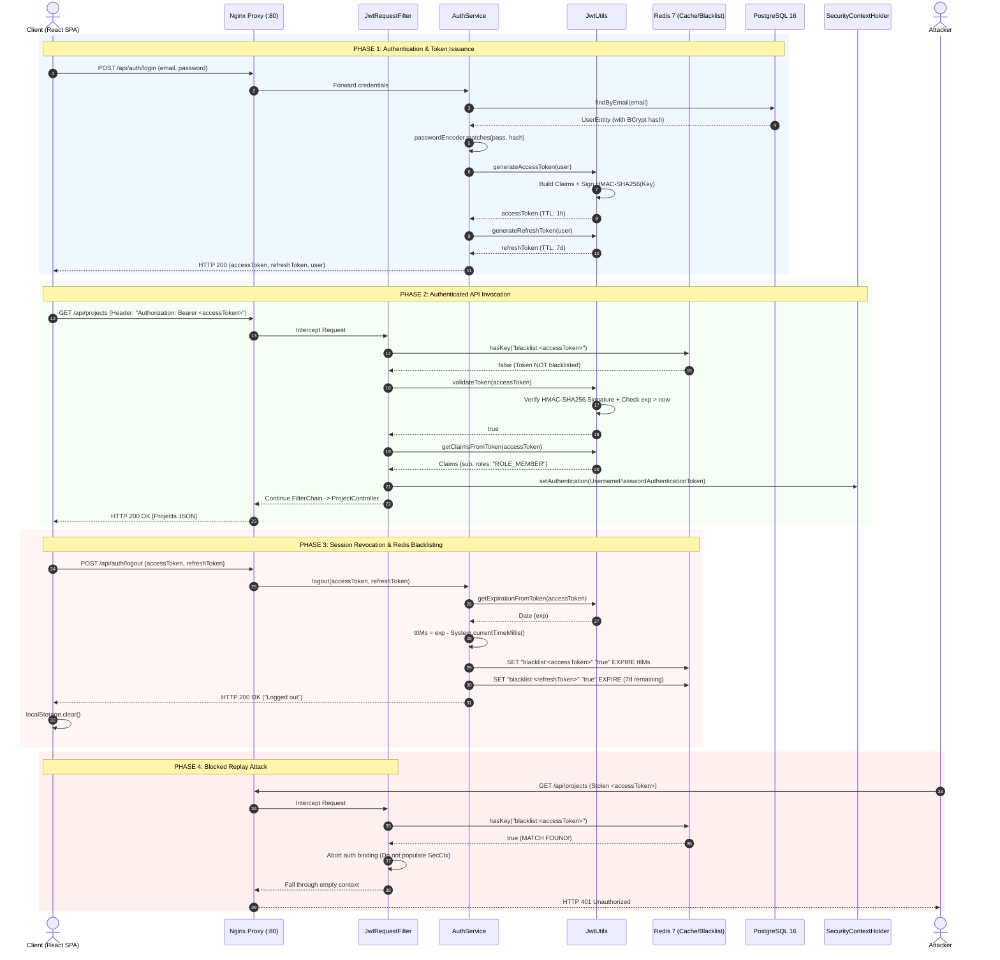

# Cryptographic Engineering & Token Lifecycle: In-Depth JWT Architecture

> **Document Type:** Deep-Dive Security & Cryptographic Architecture Guide  
> **Target Audience:** Principal Systems Architects, Staff Security Engineers, Senior Backend Leads  
> **Relevant Codebases:**
> - [`JwtUtils.java`](file:///d:/Projects/DevOps%20Suite/backend/src/main/java/com/devopssuite/security/JwtUtils.java) — JJWT Token Construction, Claims Extraction, Verification
> - [`JwtRequestFilter.java`](file:///d:/Projects/DevOps%20Suite/backend/src/main/java/com/devopssuite/security/JwtRequestFilter.java) — Per-request interceptor, Redis revocation check, SecurityContext binding
> - [`AuthService.java`](file:///d:/Projects/DevOps%20Suite/backend/src/main/java/com/devopssuite/auth/service/AuthService.java) — Dual token generation, Refresh flow, Redis blacklist mutation
> - [`SecurityConfig.java`](file:///d:/Projects/DevOps%20Suite/backend/src/main/java/com/devopssuite/security/SecurityConfig.java) — Stateless filter chain, anonymous vs authenticated endpoints
> - [`StompAuthChannelInterceptor.java`](file:///d:/Projects/DevOps%20Suite/backend/src/main/java/com/devopssuite/notification/security/StompAuthChannelInterceptor.java) — STOMP CONNECT frame token validation
> - [`client.js`](file:///d:/Projects/DevOps%20Suite/frontend/src/api/client.js) — Axios interceptor, Bearer injection, 401 transparent token refresh
> - [`authService.js`](file:///d:/Projects/DevOps%20Suite/frontend/src/services/authService.js) — Client-side token storage & lifecycle management

---

## 1. Executive Summary & Architectural Overview

In a distributed, cloud-native DevOps platform like **DevOps Suite**, stateless identity propagation is paramount. With decoupled subsystems executing containerized sandboxes, ingesting high-throughput execution logs, and broadcasting low-latency STOMP notifications over WebSockets, the authentication layer cannot introduce persistent database bottlenecks for every inbound HTTP packet or WebSocket frame.

DevOps Suite implements a cryptographically fortified, stateless authentication pipeline centered on **RFC 7519 JSON Web Tokens (JWT)**. Rather than relying on stateful server-side sessions stored in a database (which necessitate centralized round-trips and degrade horizontal scalability), DevOps Suite issues self-contained, digitally signed tokens. 

```
+───────────────────────────────────────────────────────────────────────────────────────────────────+
│                                    DEVOPS SUITE AUTHENTICATION TOPOLOGY                           │
+───────────────────────────────────────────────────────────────────────────────────────────────────+

  [ Browser / SPA ]
         │
         │  1. POST /api/auth/login (Credentials)
         ▼
  [ Nginx Reverse Proxy (:80) ]
         │
         │  Reverse Proxy pass (X-Forwarded-For, X-Real-IP)
         ▼
  [ Spring Boot Monolith (:8081) ] ──────────────► [ PostgreSQL 16 ]
         │   (AuthService.java)                            (BCrypt Password Hash Verification)
         │
         ├──► 2. Generate Access Token (1h) via JwtUtils (HMAC-SHA256)
         ├──► 3. Generate Refresh Token (7d) via JwtUtils (HMAC-SHA256)
         │
         ▼  Returns: { accessToken, refreshToken, user }
  [ Browser Client Storage ]
         │
         ├──► HTTP API Calls: Header "Authorization: Bearer <accessToken>"
         │         │
         │         ▼
         │    [ JwtRequestFilter ] ───► Redis Check ("blacklist:<token>")
         │         │                         │ (Missing = Valid)
         │         ├──► JwtUtils.validateToken()
         │         └──► SecurityContextHolder.setAuthentication()
         │
         └──► WS Handshake / CONNECT: Native Header "Authorization: Bearer <accessToken>"
                   │
                   ▼
              [ StompAuthChannelInterceptor ] ───► Redis Check + JwtUtils Validation
```

### The Inherent Architectural Dilemma: Statelessness vs. Instant Revocation
The foundational strength of JWTs is their self-contained, stateless verification: any node in the cluster possessing the shared secret key can independently verify the token's cryptographic integrity and trust the embedded claims (`sub`, `roles`, `exp`) without querying a datastore.

However, statelessness introduces a critical architectural vulnerability: **revocation impossibility**. Once signed and issued, a JWT is valid until its expiration timestamp (`exp`) elapses. If a user logs out, rotates credentials, changes roles, or has their account compromised, a pure stateless system cannot invalidate the in-flight token.

DevOps Suite resolves this architectural tension through a **Hybrid Dual-Token Lifecycle with Distributed Ephemeral Revocation**:
1. **Short-Lived Ephemeral Access Tokens (1 Hour):** Minimizes the blast radius of token leakage.
2. **Long-Lived Refresh Tokens (7 Days):** Enables seamless user session continuity via Axios interceptors without frequent credential prompts.
3. **Sliding-TTL Redis Blacklist (`blacklist:<token>`):** Leverages an in-memory Redis 7 instance to provide instant, cluster-wide revocation upon logout or token compromise, setting the Redis key TTL exactly to the token's remaining lifespan so that Redis automatically purges expired entries without memory leaks.

---

## 2. RFC 7519 Cryptographic Specification & Wire Format

A JSON Web Token (RFC 7519) is an open industry standard that defines a compact, URL-safe means for representing claims to be transferred between two parties. Structurally, a JWS (JSON Web Signature, RFC 7515) compact serialization consists of three base64url-encoded segments delimited by periods (`.`):

$$\text{JWT} = \text{Base64URL}(\text{Header}) \mathbin{\Vert} \text{"."} \mathbin{\Vert} \text{Base64URL}(\text{Payload}) \mathbin{\Vert} \text{"."} \mathbin{\Vert} \text{Base64URL}(\text{Signature})$$

```
+───────────────────────────────────────────────────────────────────────────────────────────────────+
│                                  ANATOMY OF A DEVOPS SUITE JWT                                    │
+───────────────────────────────────────────────────────────────────────────────────────────────────+

  eyJhbGciOiJIUzI1NiIsInR5cCI6IkpXVCJ9
  .eyJzdWIiOiIxMmUzNGU1Ni1lODliLTEyZDMtYTQ1Ni00MjY2MTQxNzQwMDAiLCJlbWFpbCI6ImFsaWNlQGRldm9wcy5sb2
   NhbCIsImRpc3BsYXlOYW1lIjoiQWxpY2UgU21pdGgiLCJyb2xlcyI6IlJPTEVfREVWRUxPUEVSLFJPTEVfTUVNQkVSIiwi
   aWF0IjoxNzg0ODAwMDAwLCJleHAiOjE3ODQ4MDM2MDB9
  .u0jT7mK0gW6b7f3pB8vN8X-q9gZqW_pZ8yQ6z0X4W8A
  ▲                                    ▲                                      ▲
  │                                    │                                      │
  Header (JWS Protected)               Payload (Registered & Custom Claims)   Cryptographic Signature
  {"alg":"HS256","typ":"JWT"}          {"sub":"...","roles":"..."}            HMACSHA256(H + "." + P)
```

### 2.1 The Header (JOSE Header)
The header declares the cryptographic parameters used to sign the token. In DevOps Suite, this is generated automatically by JJWT:
```json
{
  "alg": "HS256",
  "typ": "JWT"
}
```
- `alg` (Algorithm): Identifies the cryptographic algorithm used for securing the JWS. DevOps Suite specifies `HS256` (HMAC using SHA-256).
- `typ` (Type): Media type of the token, explicitly set to `JWT` as recommended by RFC 7519 Section 5.1.

### 2.2 The Payload (Claims Set)
The payload contains the statement of identity and authorization. RFC 7519 defines three classes of claims:
1. **Registered Claims:** Standardized claims reserved by the specification to provide interoperability.
2. **Public Claims:** Claims defined by collision-resistant namespaces (e.g., IANA JSON Web Token Claims Registry).
3. **Private Claims:** Custom claims agreed upon by the producer and consumer to share application context.

In DevOps Suite's [`JwtUtils.java`](file:///d:/Projects/DevOps%20Suite/backend/src/main/java/com/devopssuite/security/JwtUtils.java#L33-L48), the payload structure is explicitly partitioned:

```json
{
  "sub": "b2c9a184-f3c2-4819-b684-9844c845b102",
  "email": "engineer@devopssuite.io",
  "displayName": "Alex Dev",
  "roles": "ROLE_MEMBER,ROLE_ADMIN",
  "iat": 1784800000,
  "exp": 1784803600
}
```

#### Detailed Claims Breakdown in DevOps Suite:
| Claim | Type | Standard | Purpose & Implementation Details |
| :--- | :--- | :--- | :--- |
| `sub` | String (UUID) | Registered (RFC 7519 §4.1.2) | **Subject:** Uniquely identifies the principal. In DevOps Suite, this is the stringified PostgreSQL `users.id` UUID (`UUID.toString()`). By using immutable surrogate keys rather than mutable emails, database account mutations do not invalidate identity bindings. |
| `iat` | Long (Epoch Sec) | Registered (RFC 7519 §4.1.6) | **Issued At:** The timestamp indicating when the JWT was generated (`new Date()`). Used to prevent replay of pre-rotation credentials. |
| `exp` | Long (Epoch Sec) | Registered (RFC 7519 §4.1.4) | **Expiration Time:** Identifies the expiration time on or after which the JWT MUST NOT be accepted. Set to `now + 3,600,000ms` (1 hour) for access tokens, and `now + 604,800,000ms` (7 days) for refresh tokens. |
| `roles` | String (CSV) | Private Claim | Comma-delimited list of granted authorities (e.g., `"ROLE_MEMBER,ROLE_ADMIN"`). Extracted in [`JwtRequestFilter`](file:///d:/Projects/DevOps%20Suite/backend/src/main/java/com/devopssuite/security/JwtRequestFilter.java#L57-L63) to populate Spring Security's `SimpleGrantedAuthority` objects without hitting PostgreSQL. |
| `email` | String | Private Claim | The user's primary login email address. Included for fast UI hydration and logging attribution. |
| `displayName`| String | Private Claim | Human-readable user name for instantaneous client header rendering. |

### 2.3 The Cryptographic Signature
The signature is generated by computing an HMAC-SHA256 message authentication code over the ASCII representation of the base64url-encoded header and payload:

$$\text{Signature} = \text{HMAC-SHA256}_{\text{Key}}\left( \text{Base64URL}(\text{Header}) \mathbin{\Vert} \text{"."} \mathbin{\Vert} \text{Base64URL}(\text{Payload}) \right)$$

The resulting 256-bit (32-byte) binary digest is then Base64URL-encoded (without padding `=`) and appended as the final segment.

---

## 3. Cryptographic Implementation: JJWT & `JwtUtils.java`

DevOps Suite utilizes **JJWT (Java JWT - `io.jsonwebtoken:jjwt-api:0.12.5`)**, a modern, type-safe cryptographic library compliant with Java 21 and Spring Boot 3.3+.

```
+───────────────────────────────────────────────────────────────────────────────────────────────────+
│                                  JJWT 0.12.x PARSER & BUILDER PIPELINE                            │
+───────────────────────────────────────────────────────────────────────────────────────────────────+

  JWT Creation Pipeline (Jwts.builder()):
  ┌─────────────────┐     ┌──────────────────────┐     ┌─────────────────────┐
  │ Claims Map      │ ──► │ Jwts.builder()       │ ──► │ signWith(SecretKey) │ ──► Base64URL Compact
  │ sub, roles, exp │     │ .claims(claims)      │     │ hmacShaKeyFor()     │     String Token
  └─────────────────┘     └──────────────────────┘     └─────────────────────┘

  JWT Verification Pipeline (Jwts.parser()):
  ┌─────────────────┐     ┌──────────────────────┐     ┌─────────────────────┐
  │ Inbound Bearer  │ ──► │ Jwts.parser()        │ ──► │ parseSignedClaims() │ ──► Jws<Claims>
  │ String Token    │     │ .verifyWith(Key)     │     │ Constant-Time HMAC  │     (Validated &
  └─────────────────┘     │ .build()             │     │ + Clock Expiry      │      Trusted)
                          └──────────────────────┘     └─────────────────────┘
```

### 3.1 Source Code Analysis: `JwtUtils.java`

Examining the actual implementation in [`JwtUtils.java`](file:///d:/Projects/DevOps%20Suite/backend/src/main/java/com/devopssuite/security/JwtUtils.java):

```java
package com.devopssuite.security;

import com.devopssuite.auth.model.User;
import io.jsonwebtoken.Claims;
import io.jsonwebtoken.Jwts;
import io.jsonwebtoken.security.Keys;
import org.springframework.beans.factory.annotation.Value;
import org.springframework.stereotype.Component;

import javax.crypto.SecretKey;
import java.nio.charset.StandardCharsets;
import java.util.Date;
import java.util.HashMap;
import java.util.Map;
import java.util.stream.Collectors;

@Component
public class JwtUtils {

    @Value("${jwt.secret:your-secret-key-minimum-256-bits}")
    private String jwtSecret;

    @Value("${jwt.expiration:86400000}")
    private long jwtExpirationMs; // Overridden to 3600000 in prod config

    @Value("${jwt.refresh-expiration:604800000}")
    private long jwtRefreshExpirationMs; // 7 days (604,800,000 ms)

    private SecretKey getSigningKey() {
        return Keys.hmacShaKeyFor(jwtSecret.getBytes(StandardCharsets.UTF_8));
    }

    public String generateAccessToken(User user) {
        Map<String, Object> claims = new HashMap<>();
        claims.put("email", user.getEmail());
        claims.put("displayName", user.getDisplayName());
        claims.put("roles", user.getRoles().stream()
                .map(role -> role.getName())
                .collect(Collectors.joining(",")));

        return Jwts.builder()
                .claims(claims)
                .subject(user.getId().toString())
                .issuedAt(new Date())
                .expiration(new Date(System.currentTimeMillis() + jwtExpirationMs))
                .signWith(getSigningKey())
                .compact();
    }

    public String generateRefreshToken(User user) {
        return Jwts.builder()
                .subject(user.getId().toString())
                .issuedAt(new Date())
                .expiration(new Date(System.currentTimeMillis() + jwtRefreshExpirationMs))
                .signWith(getSigningKey())
                .compact();
    }

    public boolean validateToken(String token) {
        try {
            Jwts.parser()
                    .verifyWith(getSigningKey())
                    .build()
                    .parseSignedClaims(token);
            return true;
        } catch (Exception e) {
            return false;
        }
    }

    public Claims getClaimsFromToken(String token) {
        return Jwts.parser()
                .verifyWith(getSigningKey())
                .build()
                .parseSignedClaims(token)
                .getPayload();
    }

    public Date getExpirationFromToken(String token) {
        return Jwts.parser()
                .verifyWith(getSigningKey())
                .build()
                .parseSignedClaims(token)
                .getPayload()
                .getExpiration();
    }
}
```

### 3.2 Cryptographic Rigor & JJWT 0.12 API Invariants
1. **`Keys.hmacShaKeyFor(byte[])` Entropy Guard:**  
   Under RFC 7518 Section 3.2, HMAC-SHA256 requires a secret key whose bit length is greater than or equal to the output hash size (256 bits / 32 bytes). JJWT enforces this at runtime: if `jwtSecret.getBytes(StandardCharsets.UTF_8).length < 32`, JJWT immediately throws a `WeakKeyException` during bean initialization, preventing insecure deployments from starting.
2. **Type-Safe Verification API:**  
   Older JJWT versions (0.9.x) used `setSigningKey(key).parseClaimsJws(token)`. The modern 0.12.x API utilizes an explicit builder pattern: `Jwts.parser().verifyWith(SecretKey).build().parseSignedClaims(token)`. This eliminates legacy ambiguities and structurally enforces the distinction between signed claims (`parseSignedClaims`) and encrypted claims (`parseEncryptedClaims`).
3. **Automatic Clock Skew Tolerance:**  
   JJWT’s claims validator automatically verifies `exp` against `System.currentTimeMillis()`. It defaults to strict zero-tolerance clock validation, rejecting expired tokens with `ExpiredJwtException`.

---

## 4. Dual-Token Architecture & Lifecycle Management

A production-grade authentication subsystem cannot rely on a single token type. Single-token architectures face an unresolvable trade-off:
- If the token expiration is short (e.g., 15 minutes), users are aggressively interrupted with login prompts.
- If the token expiration is long (e.g., 30 days), stolen tokens grant attackers a prolonged window of vulnerability.

DevOps Suite implements a **Dual-Token Lifecycle** separating **authorization** from **session continuity**.

```
+───────────────────────────────────────────────────────────────────────────────────────────────────+
│                              DUAL TOKEN LIFECYCLE STATE MACHINE                                   │
+───────────────────────────────────────────────────────────────────────────────────────────────────+

                 [ User Credentials: POST /api/auth/login ]
                                     │
                                     ▼
        ┌─────────────────────────────────────────────────────────┐
        │  Issue Token Pair                                       │
        │  - Access Token:  TTL = 1 Hour   (Cryptographic Proof)  │
        │  - Refresh Token: TTL = 7 Days   (Session Renewal Proof)│
        └────────────────────────────┬────────────────────────────┘
                                     │
           ┌─────────────────────────┴─────────────────────────┐
           ▼                                                   ▼
     [ Access Token ]                                    [ Refresh Token ]
     - Injected in HTTP requests                         - Held dormant in client storage
     - Attached to STOMP CONNECT                         - Used ONLY against /api/auth/refresh
     - Validated statelessly via HMAC                    - Validated via HMAC + Redis Revocation
           │                                                   │
           ├─► Valid (< 1h) ──► HTTP 200 OK                    │
           │                                                   │
           └─► Expired (401) ──────────────────────────────────┤
                                                               ▼
                                                [ POST /api/auth/refresh ]
                                                               │
                                       ┌───────────────────────┴───────────────────────┐
                                       ▼                                               ▼
                                 [ Refresh Valid ]                              [ Revoked / Expired ]
                                       │                                               │
                                       ▼                                               ▼
                         Issue New Access Token (1h)                        Force Redirect to /login
```

### 4.1 Token Property Comparison
| Attribute | Access Token (`accessToken`) | Refresh Token (`refreshToken`) |
| :--- | :--- | :--- |
| **Primary Purpose** | Resource authorization on every API / WS call | Minting new access tokens upon expiry |
| **Lifespan** | **1 Hour** (`jwtExpirationMs = 3,600,000`) | **7 Days** (`jwtRefreshExpirationMs = 604,800,000`) |
| **Scope of Claims** | Broad: `sub`, `email`, `displayName`, `roles` | Minimal: `sub` only |
| **Exposure Surface** | Sent on every outgoing HTTP request header & STOMP frame | Sent *only* to `/api/auth/refresh` |
| **Verification Path** | In-memory signature check + fast Redis blacklist check | In-memory signature check + Redis blacklist check + DB user check |
| **Storage (Frontend)** | LocalStorage / In-memory Axios closure | LocalStorage (or HttpOnly Secure Cookie) |

### 4.2 Transparent Refresh Workflow (Axios Response Interceptors)
To prevent disrupting users mid-workflow (e.g., while compiling code in Monaco Editor or debugging Docker tasks), the frontend [`client.js`](file:///d:/Projects/DevOps%20Suite/frontend/src/api/client.js#L39-L75) implements an interceptor retry loop:

```javascript
// frontend/src/api/client.js
apiClient.interceptors.response.use(
  (response) => response,
  async (error) => {
    const originalRequest = error.config;

    // Detect 401 Unauthorized, ensuring we do not loop infinitely
    if (error.response?.status === 401 && !originalRequest._retry) {
      const url = originalRequest.url || '';
      // Do not intercept auth endpoints — let callers handle login/register failures
      if (url.includes('/auth/login') || url.includes('/auth/register')) {
        return Promise.reject(error);
      }

      originalRequest._retry = true;
      const refreshToken = localStorage.getItem('refreshToken');

      if (refreshToken) {
        try {
          // Exchange refresh token for a newly signed access token
          const response = await axios.post(`${API_BASE_URL}/auth/refresh`, {
            refreshToken,
          });
          const { accessToken } = response.data.data;
          
          localStorage.setItem('accessToken', accessToken);
          
          // Re-arm original request with the fresh token and replay
          if (originalRequest.headers) {
            originalRequest.headers.Authorization = `Bearer ${accessToken}`;
          }
          return apiClient(originalRequest);
        } catch (refreshErr) {
          // Refresh token expired, revoked, or manipulated -> Full session tear-down
          localStorage.removeItem('accessToken');
          localStorage.removeItem('refreshToken');
          window.location.href = '/login';
        }
      }
    }
    return Promise.reject(error);
  }
);
```

---

## 5. Instant Revocation Engine: Distributed Redis Blacklisting

The Achilles' heel of stateless JWT architectures is the inability to revoke tokens on demand. If a user clicks **Logout**, a purely stateless backend cannot invalidate the client's token. If the client retains the token or if an eavesdropper intercepted it, it remains valid until `exp`.

DevOps Suite implements an **Active Invalidation Engine** using **Redis 7**:

```
+───────────────────────────────────────────────────────────────────────────────────────────────────+
│                               REDIS BLACKLIST REVOCATION TIMELINE                                 │
+───────────────────────────────────────────────────────────────────────────────────────────────────+

  T=0: Token Minted (iat)                        T=20m: User Logs Out          T=60m: Token Expiration (exp)
   │                                              │                             │
   ▼                                              ▼                             ▼
   ┌──────────────────────────────────────────────┬─────────────────────────────┐
   │             Token Valid Everywhere           │   Token in Redis Blacklist  │  Token Expired by Crypto
   └──────────────────────────────────────────────┴─────────────────────────────┘
                                                  │                             ▲
                                                  └── TTL = (exp - T) = 40m ────┘
                                                      Redis automatically evicts!
                                                      Zero Memory Leakage!
```

### 5.1 Revocation Mechanics in `AuthService.java`
When a user invokes `POST /api/auth/logout`, [`AuthService.logout()`](file:///d:/Projects/DevOps%20Suite/backend/src/main/java/com/devopssuite/auth/service/AuthService.java#L496-L523) inspects both tokens and populates Redis:

```java
public void logout(String accessToken, String refreshToken) {
    if (accessToken != null && !accessToken.isBlank()) {
        blacklistToken(accessToken);
    }
    if (refreshToken != null && !refreshToken.isBlank()) {
        blacklistToken(refreshToken);
    }
}

private void blacklistToken(String token) {
    try {
        if (jwtUtils.validateToken(token)) {
            Date expiry = jwtUtils.getExpirationFromToken(token);
            long ttlMs = expiry.getTime() - System.currentTimeMillis();
            if (ttlMs > 0) {
                // Key format: "blacklist:<token>"
                // Value: "true"
                // TTL: Milliseconds remaining until cryptographic expiration
                redisTemplate.opsForValue().set(
                        "blacklist:" + token,
                        "true",
                        ttlMs,
                        TimeUnit.MILLISECONDS
                );
            }
        }
    } catch (Exception ignored) {
        // Token already expired or malformed; no blacklisting required
    }
}
```

### 5.2 Mathematical TTL Bounding & Memory Reclamation
Why set the Redis TTL to `expiry.getTime() - System.currentTimeMillis()`?
- If we stored revoked tokens in Redis indefinitely (`TTL = infinity`), Redis memory consumption would grow unboundedly ($O(N)$ with respect to total user logouts), eventually exhausting memory (`OOM-kill`).
- However, once a token's `exp` timestamp is passed, `jwtUtils.validateToken()` fails automatically during cryptographic parsing (`ExpiredJwtException`).
- Therefore, a revoked token only needs to be tracked in Redis for its **remaining lifespan**. Setting the Redis key TTL exactly to $(T_{\text{exp}} - T_{\text{current}})$ guarantees that Redis automatically purges the entry the instant it naturally expires.

### 5.3 Filter Chain Verification in `JwtRequestFilter.java`
Every incoming HTTP request undergoes interceptor evaluation in [`JwtRequestFilter.java`](file:///d:/Projects/DevOps%20Suite/backend/src/main/java/com/devopssuite/security/JwtRequestFilter.java#L43-L72):

```java
String authHeader = request.getHeader(HttpHeaders.AUTHORIZATION);
if (authHeader != null && authHeader.startsWith("Bearer ")) {
    String token = authHeader.substring(7);
    
    // Step 1: Distributed Revocation Check (O(1) in-memory Redis lookup)
    if (Boolean.TRUE.equals(redisTemplate.hasKey("blacklist:" + token))) {
        // Immediately bypass authentication binding -> yields 401 Unauthorized downstream
        filterChain.doFilter(request, response);
        return;
    }

    // Step 2: Cryptographic Signature & Expiration Check
    if (jwtUtils.validateToken(token)) {
        Claims claims = jwtUtils.getClaimsFromToken(token);
        String userId = claims.getSubject();
        String rolesStr = claims.get("roles", String.class);
        
        List<SimpleGrantedAuthority> authorities = ...;
        
        UsernamePasswordAuthenticationToken authentication = 
            new UsernamePasswordAuthenticationToken(userId, null, authorities);
        SecurityContextHolder.getContext().setAuthentication(authentication);
    }
}
```

---

## 6. Comprehensive Sequence Diagram: Signing, Verification & Revocation

The following sequence diagram tracks the entire lifecycle across authentication, standard request processing, token refresh, and logout revocation.



---

## 7. Vulnerability Mitigations & Threat Modeling

Securing JWT implementations requires hardening against well-known cryptographic attack vectors defined in the OWASP API Security Top 10 and RFC 8725 (JSON Web Token Best Current Practices).

```
+───────────────────────────────────────────────────────────────────────────────────────────────────+
│                                  ATTACK VECTORS & HARDENED DEFENSES                               │
+───────────────────────────────────────────────────────────────────────────────────────────────────+

  Attack: "None" Algorithm Exploitation
  [ {"alg":"none"} ] ──► JJWT parser().verifyWith(SecretKey) ──► Strict Cryptographic Rejection!

  Attack: HMAC Secret Brute-Force
  [ Weak Password ]   ──► Keys.hmacShaKeyFor() ──► Throws WeakKeyException if < 256 bits!

  Attack: Signature Stripping (Header.Payload.)
  [ No Signature ]    ──► parseSignedClaims() Expects JWS ──► Throws MalformedJwtException!

  Attack: Replay of Expired Token
  [ Expired Claim ]   ──► System.currentTimeMillis() > exp ──► Throws ExpiredJwtException!
```

### 7.1 The "None" Algorithm Attack
- **Threat Vector:** Early JWT libraries allowed the JOSE header to specify `"alg": "none"`. Attackers modified the payload (elevating roles to `"ROLE_ADMIN"`), stripped the signature, and set `"alg": "none"`. Naive parsers checked the header and skipped cryptographic verification altogether.
- **DevOps Suite Mitigation:** JJWT 0.12.x structurally eliminates this vulnerability. By constructing the parser via `Jwts.parser().verifyWith(getSigningKey()).build()`, the parser **strictly mandates an HMAC signature generated by the configured `SecretKey`**. If an incoming token specifies `"alg": "none"` or any algorithm other than the matching HMAC scheme, JJWT immediately raises an `UnsupportedJwtException` or `SignatureException` and aborts processing.

### 7.2 HMAC Key Entropy & Brute-Force Attacks
- **Threat Vector:** In symmetric signing (`HS256`), the same secret key is used to sign and verify tokens. If the key is a weak passphrase (e.g., `secret123`), an attacker capturing a valid JWT can run offline dictionary attacks using tools like Hashcat or John the Ripper to extract the secret key, allowing them to forge arbitrary tokens.
- **DevOps Suite Mitigation:**
  1. The default secret key in [`application.yml`](file:///d:/Projects/DevOps%20Suite/backend/src/main/resources/application.yml#L65) is a high-entropy string exceeding 256 bits:
     ```yaml
     jwt:
       secret: ${JWT_SECRET:your-secret-key-minimum-256-bits}
     ```
  2. `Keys.hmacShaKeyFor(...)` throws a compile-time or runtime exception if the byte sequence is shorter than 32 bytes (256 bits).
  3. Production environments inject cryptographically random 512-bit secrets generated via `openssl rand -base64 64`.

### 7.3 Signature Stripping & Truncation
- **Threat Vector:** An attacker sends `Header.Payload` without the signature segment or sends an empty signature (`Header.Payload.`).
- **DevOps Suite Mitigation:** In [`JwtUtils.java`](file:///d:/Projects/DevOps%20Suite/backend/src/main/java/com/devopssuite/security/JwtUtils.java#L64), `parseSignedClaims(token)` expects exactly two period delimiters and a non-empty signature. If the signature is omitted, JJWT throws `MalformedJwtException`, and `validateToken()` returns `false`.

### 7.4 Distributed Denial of Service (ReDoS / Parser Exhaustion)
- **Threat Vector:** Attackers transmit gigabyte-sized JWT strings to overwhelm memory or trigger catastrophic backtracking in regex parsers.
- **DevOps Suite Mitigation:**
  1. Nginx restricts the maximum HTTP header buffer size (`large_client_header_buffers 4 8k`).
  2. Rate limiting via [`RateLimitFilter.java`](file:///d:/Projects/DevOps%20Suite/backend/src/main/java/com/devopssuite/security/RateLimitFilter.java) restricts requests to 300 req/min for general APIs and 20 req/min for `/api/auth/**`.

---

## 8. Client Storage Architecture: Memory/LocalStorage vs. HttpOnly Cookies

Choosing the client-side storage mechanism for JWTs is a fundamental architectural decision involving trade-offs between **Cross-Site Scripting (XSS)** and **Cross-Site Request Forgery (CSRF)**.

```
+───────────────────────────────────────────────────────────────────────────────────────────────────+
│                                  TOKEN STORAGE TRADE-OFF MATRIX                                   │
+───────────────────────────────────────────────────────────────────────────────────────────────────+

                                  ┌───────────────────────────────┐
                                  │   Where is the JWT Stored?    │
                                  └───────────────┬───────────────┘
                                                  │
                 ┌────────────────────────────────┴────────────────────────────────┐
                 ▼                                                                 ▼
      [ LocalStorage / Memory ]                                         [ HttpOnly Secure Cookie ]
      - Immune to CSRF attacks                                          - Immune to JavaScript XSS theft
      - Vulnerable to XSS token theft                                   - Vulnerable to CSRF attacks
      - Requires manual Bearer header                                   - Automatically sent by browser
      - Works seamlessly across WebSockets/CORS                         - Requires SameSite / CSRF tokens
```

### 8.1 Architectural Comparison

| Dimension | `localStorage` / In-Memory (DevOps Suite Approach) | `HttpOnly` `SameSite=Strict` Cookies |
| :--- | :--- | :--- |
| **XSS Vulnerability** | **High:** Any script executing in the origin can read `localStorage.getItem('accessToken')`. | **Low:** JavaScript cannot read `document.cookie` if `HttpOnly` is set. |
| **CSRF Vulnerability** | **Zero:** Browsers never attach `localStorage` values to cross-origin requests automatically. | **Medium-High:** Browsers automatically attach cookies to cross-site requests unless mitigated by `SameSite` & anti-CSRF tokens. |
| **Cross-Origin / Subdomain Support** | Trivial: Authorization header can be sent anywhere programmatically. | Complex: Requires matching cookie domains, path restrictions, and CORS credentials (`credentials: 'include'`). |
| **WebSocket / STOMP Interoperability** | **Native:** Easily extracted and attached to STOMP `CONNECT` headers. | **Restricted:** Browsers do not allow custom headers during the native WebSocket HTTP handshake; cookies are sent, but channel isolation is tricky. |
| **Implementation Complexity** | Low (Axios interceptor injection). | High (Requires CSRF token double-submit cookies, SameSite handling). |

### 8.2 Why DevOps Suite Chose Bearer Tokens in LocalStorage
1. **WebSocket Compatibility:** DevOps Suite relies heavily on real-time STOMP messaging for container execution logs and build notifications. Browsers do not permit setting custom HTTP headers on native `WebSocket` handshakes. By managing tokens in JavaScript, the application attaches the token directly to the **application-level STOMP CONNECT frame** (`headers: { Authorization: 'Bearer ...' }`), as seen in [`stomp-auth.md`](file:///d:/Projects/DevOps%20Suite/interview/06-security/stomp-auth.md).
2. **Total CSRF Immunity:** Because the browser does not automatically transmit `Authorization: Bearer` headers on cross-site requests, DevOps Suite is fundamentally immune to CSRF attacks without requiring synchronizer tokens.
3. **Defense-in-Depth Against XSS:** Rather than relying on cookies to mask XSS vulnerabilities, DevOps Suite eliminates XSS risks at the source via:
   - React's JSX automatic string escaping.
   - Monaco Editor sandboxing.
   - Strict Content Security Policy (CSP) headers in Nginx.

---

## 9. In-Depth Technical Interview Q&A

### 🟢 Basic Concepts

#### Q1: What are the three parts of a JSON Web Token, and how are they separated?
**Answer:**  
An RFC 7519 JSON Web Token consists of three base64url-encoded parts separated by period (`.`) characters:
1. **Header:** Contains metadata about the token, such as the signing algorithm (`"alg": "HS256"`) and token type (`"typ": "JWT"`).
2. **Payload:** Contains the claims (statements about an entity and additional data). This includes standard registered claims like `sub` (subject), `iat` (issued at), and `exp` (expiration), alongside custom application claims like `roles` and `email`.
3. **Signature:** The cryptographic proof generated by hashing the base64url-encoded header and payload with a secret key (or private key) using the specified algorithm. It guarantees that the sender is authentic and that the payload has not been tampered with.

```
Format: <Base64URL-Header>.<Base64URL-Payload>.<Base64URL-Signature>
```

---

#### Q2: What is the difference between symmetric and asymmetric signing in JWTs?
**Answer:**  
- **Symmetric Signing (e.g., HMAC-SHA256 / `HS256`):**
  - Uses a **single shared secret key** for both signing the token and verifying the signature.
  - **Pros:** Fast computation, minimal CPU overhead, simple secret management in a monolithic or closely coupled architecture.
  - **Cons:** Any service that needs to verify the token must possess the secret key. If a verification service is compromised, the attacker can forge new tokens for the entire system.
  - *DevOps Suite usage:* Implemented via [`JwtUtils.java`](file:///d:/Projects/DevOps%20Suite/backend/src/main/java/com/devopssuite/security/JwtUtils.java) using `Keys.hmacShaKeyFor(secret)`.
- **Asymmetric Signing (e.g., RSA-SHA256 / `RS256`, ECDSA / `ES256`):**
  - Uses a **cryptographic key pair**: a **private key** to sign tokens, and a **public key** to verify them.
  - **Pros:** The authorization server keeps the private key secret, while downstream microservices only need the public key (often fetched via JWKS - JSON Web Key Sets). Compromise of a verifier does not allow token forgery.
  - **Cons:** Computationally more expensive (RSA/ECDSA math requires significantly more CPU cycles than HMAC).

---

#### Q3: Why is it bad practice to store sensitive data like raw passwords or Social Security Numbers in a JWT payload?
**Answer:**  
A JWT payload is **encoded**, not **encrypted**. The claims are transformed using **Base64URL**, which is a two-way encoding scheme designed for safe URL transit—it provides zero confidentiality. Anyone who intercepts or views the token can decode the payload instantly using `atob()` in a browser or standard CLI utilities (`echo <payload> | base64 -d`).

Storing sensitive credentials, unhashed passwords, or personally identifiable information (PII) exposes that data to anyone with access to client-side storage, network traffic logs, or reverse proxy access logs. If confidentiality is required, the payload must be encrypted using **JWE (JSON Web Encryption, RFC 7516)**.

---

### 🟡 Intermediate Architecture

#### Q4: Walk through the exact request lifecycle of an incoming API request in DevOps Suite's `JwtRequestFilter`.
**Answer:**  
When an HTTP request arrives at the Spring Boot backend:
1. **Header Extraction:** [`JwtRequestFilter.java`](file:///d:/Projects/DevOps%20Suite/backend/src/main/java/com/devopssuite/security/JwtRequestFilter.java#L43-L45) extracts the `Authorization` header. If it is missing or does not start with `"Bearer "`, the filter checks if mock authentication is enabled or delegates immediately down the chain (`filterChain.doFilter()`).
2. **Distributed Blacklist Verification:** The filter queries Redis via `redisTemplate.hasKey("blacklist:" + token)`. If the key exists, the token was revoked upon logout. The filter immediately aborts authentication binding and lets the request pass through with an empty context (resulting in a downstream 401 Unauthorized from Spring Security).
3. **Cryptographic Validation:** The filter calls `jwtUtils.validateToken(token)`. JJWT parses the token, verifies the HMAC-SHA256 signature against the configured secret key, and validates that `exp` is in the future.
4. **Claims Extraction:** Upon successful validation, `jwtUtils.getClaimsFromToken(token)` parses the payload.
5. **Security Context Population:**
   - Extracts the `sub` claim as the `userId`.
   - Parses the comma-separated `roles` claim into a list of `SimpleGrantedAuthority` objects (`ROLE_MEMBER`, `ROLE_ADMIN`).
   - Instantiates a `UsernamePasswordAuthenticationToken(userId, null, authorities)`.
   - Binds the authentication object into thread-local storage: `SecurityContextHolder.getContext().setAuthentication(authentication)`.
6. **Execution:** The request proceeds down the `FilterChain` to the target controller.

---

#### Q5: How does DevOps Suite handle token revocation while maintaining the performance benefits of stateless JWTs?
**Answer:**  
DevOps Suite implements a **hybrid ephemeral revocation pattern**:
1. It keeps access token lifespans short (**1 hour**).
2. Instead of storing every active token in a database (which turns JWTs back into stateful sessions), it only stores **revoked tokens** in Redis.
3. During logout ([`AuthService.java`](file:///d:/Projects/DevOps%20Suite/backend/src/main/java/com/devopssuite/auth/service/AuthService.java#L505-L522)), the token's remaining lifespan is calculated:
   $$\text{TTL}_{\text{remaining}} = T_{\text{exp}} - T_{\text{current}}$$
4. The key `"blacklist:<token>"` is stored in Redis with an expiration equal to $\text{TTL}_{\text{remaining}}$.
5. In [`JwtRequestFilter`](file:///d:/Projects/DevOps%20Suite/backend/src/main/java/com/devopssuite/security/JwtRequestFilter.java#L48), Redis is queried via `hasKey()`. Because Redis operations execute in sub-millisecond in-memory time, this check adds negligible latency to the request.
6. Once a token passes its `exp` time, Redis automatically evicts the blacklist key. By that point, the token is natively rejected by JJWT's cryptographic timestamp validation, ensuring zero Redis memory accumulation.

---

#### Q6: How does the dual-token refresh mechanism in `client.js` prevent infinite loops on authentication failure?
**Answer:**  
In [`client.js`](file:///d:/Projects/DevOps%20Suite/frontend/src/api/client.js#L45-L70), the response interceptor guards against infinite loops using two safeguards:
1. **The `_retry` Boolean Flag:** When an API request encounters a 401 error, the interceptor checks `!originalRequest._retry`. Before initiating the refresh call, it sets `originalRequest._retry = true`. If the retried request fails with a 401 again, the condition evaluates to false, terminating the retry cycle and rejecting the promise.
2. **Endpoint Exclusion:** The interceptor explicitly skips refresh logic if the failing URL is `/auth/login` or `/auth/register`:
   ```javascript
   if (url.includes('/auth/login') || url.includes('/auth/register')) {
     return Promise.reject(error);
   }
   ```
3. **Catch-All Session Tear-Down:** If the refresh request to `/auth/refresh` itself fails (e.g., the refresh token is blacklisted or expired), the `catch` block cleans up the client state:
   ```javascript
   localStorage.removeItem('accessToken');
   localStorage.removeItem('refreshToken');
   window.location.href = '/login';
   ```
   This prevents looping requests by evicting stale credentials and redirecting to the login interface.

---

### 🔴 Advanced Security & Cryptography

#### Q7: An attacker captures a valid JWT access token and alters the payload claim `"roles": "ROLE_MEMBER"` to `"roles": "ROLE_ADMIN"`. Detail the exact cryptographic sequence that detects and prevents this attack.
**Answer:**  
1. **The Nature of HMAC:** The signature of the original token was computed as:
   $$S = \text{HMAC-SHA256}_{K}(\text{Header} \mathbin{\Vert} \text{"."} \mathbin{\Vert} \text{Payload}_{\text{original}})$$
   where $K$ is the private server-side secret key.
2. **The Tampering:** The attacker decodes $\text{Payload}_{\text{original}}$, changes the roles string, base64url-encodes the new payload to create $\text{Payload}_{\text{tampered}}$, and constructs the modified token:
   $$\text{Token}_{\text{forged}} = \text{Header} \mathbin{\Vert} \text{"."} \mathbin{\Vert} \text{Payload}_{\text{tampered}} \mathbin{\Vert} \text{"."} \mathbin{\Vert} S$$
3. **Verification in JJWT:** When [`JwtUtils.validateToken()`](file:///d:/Projects/DevOps%20Suite/backend/src/main/java/com/devopssuite/security/JwtUtils.java#L59) runs:
   - JJWT splits the token at the period delimiters.
   - It independently computes the expected signature over the inbound segments:
     $$S' = \text{HMAC-SHA256}_{K}(\text{Header} \mathbin{\Vert} \text{"."} \mathbin{\Vert} \text{Payload}_{\text{tampered}})$$
   - It performs a **constant-time byte comparison** between the received signature $S$ and the newly computed signature $S'$.
4. **Failure Outcome:** Because the attacker does not possess the secret key $K$, they cannot compute a valid signature for $\text{Payload}_{\text{tampered}}$. By the avalanche effect of SHA-256, even a 1-bit alteration in the payload produces a completely uncorrelated 256-bit hash. Thus, $S \neq S'$, JJWT throws a `SignatureException`, `validateToken()` returns `false`, and the request is rejected with a 401 Unauthorized.

---

#### Q8: What is a timing attack on a MAC verification function, and how does modern cryptographic software like JJWT protect against it?
**Answer:**  
- **Timing Attack Mechanism:** In naive string comparison (such as standard Java `String.equals()` or C `memcmp()`), characters or bytes are compared sequentially from left to right. The comparison terminates early at the first mismatched byte:
  ```java
  // NAIVE VULNERABLE COMPARISON
  for (int i = 0; i < len; i++) {
      if (a[i] != b[i]) return false; // Early exit leaks timing information!
  }
  ```
  An attacker can transmit millions of forged signatures, measuring response times with microsecond precision. When a candidate signature has its first byte correct, the server takes slightly longer to fail than when the first byte is incorrect. By iteratively probing byte by byte, an attacker could deduce the valid signature without knowing the secret key.
- **Protection via Constant-Time Comparison:**  
  Modern libraries like JJWT and Java's `MessageDigest.isEqual()` use constant-time comparisons. They iterate through every byte of the array regardless of whether a mismatch occurs, accumulating differences via a bitwise OR (`diff |= a[i] ^ b[i]`):
  ```java
  public static boolean isEqual(byte[] digesta, byte[] digestb) {
      if (digesta.length != digestb.length) return false;
      int result = 0;
      for (int i = 0; i < digesta.length; i++) {
          result |= digesta[i] ^ digestb[i];
      }
      return result == 0;
  }
  ```
  The execution time remains constant regardless of which byte differs, neutralizing timing side-channel attacks.

---

#### Q9: Contrast the security profile of using JWTs for WebSocket authentication versus traditional HTTP REST requests.
**Answer:**  
1. **Handshake Limitations:** During the initial HTTP-to-WebSocket upgrade handshake (`GET /ws/connect`), the browser's native `WebSocket` API does not allow custom headers (e.g., `Authorization: Bearer <token>`). Consequently, developers are often tempted to pass the JWT in a query parameter (`wss://api/ws?token=...`).
   - *Security Risk:* Query parameters appear in web server access logs, browser history, proxy logs, and `Referer` headers, exposing tokens.
2. **DevOps Suite Solution (Protocol-Level Interception):** As documented in [`stomp-auth.md`](file:///d:/Projects/DevOps%20Suite/interview/06-security/stomp-auth.md), DevOps Suite permits an unauthenticated HTTP upgrade, but defers authentication to the application protocol layer. The client includes the token in the **native STOMP CONNECT frame header**:
   ```
   CONNECT
   accept-version:1.2
   Authorization:Bearer eyJhbGci...
   ```
   [`StompAuthChannelInterceptor.java`](file:///d:/Projects/DevOps%20Suite/backend/src/main/java/com/devopssuite/notification/security/StompAuthChannelInterceptor.java) validates this header before allowing subscriptions.
3. **Session Lifetime Disconnect:** In HTTP, each request evaluates token validity and blacklist state independently. In WebSockets, a connection is persistent and can remain open for hours or days. If an access token expires 30 minutes into a 4-hour WebSocket session, or if the user logs out from another tab, the open WebSocket connection would remain active unless explicitly disconnected.
   - *Mitigation:* Periodic re-authorization heartbeats or server-initiated disconnects upon receiving a Redis logout event.

---

### ⚫ Expert & System Architecture

#### Q10: How would you architect a zero-downtime, distributed secret key rotation strategy for DevOps Suite without invalidating active user sessions?
**Answer:**  
In a production deployment using symmetric keys (`HS256`), suddenly replacing `JWT_SECRET` causes every active token signed with the old secret to fail verification, forcing an immediate logout for all connected users.

A zero-downtime rotation strategy requires **Key ID (`kid`) metadata and multi-key verification**:

```
+───────────────────────────────────────────────────────────────────────────────────────────────────+
│                               DISTRIBUTED KEY ROTATION ARCHITECTURE                               │
+───────────────────────────────────────────────────────────────────────────────────────────────────+

  Key Store / HashiCorp Vault:
  ┌──────────────────────────────────────────────────────────────┐
  │ kid: "key-2026-q1" -> Secret_A (Status: RETIRED / VERIFY ONLY)│
  │ kid: "key-2026-q2" -> Secret_B (Status: ACTIVE / SIGN & VERIFY)│
  └──────────────────────────────────────────────────────────────┘

  Token Verification Workflow:
  Incoming JWT Header: {"alg":"HS256","kid":"key-2026-q1"}
       │
       ▼
  Parser inspects 'kid':
  ├── If "key-2026-q2" ──► Verify using Secret_B
  └── If "key-2026-q1" ──► Verify using Secret_A (Valid until all Q1 tokens expire!)
```

**Implementation Steps:**
1. **Header Enrichment:** Include the Key ID (`kid`) in the JWT header during token creation:
   ```java
   Jwts.builder()
       .header().keyId("key-2026-q2").and()
       .claims(claims)...
   ```
2. **Multi-Key Registry:** Maintain a map of active and retiring keys in memory (backed by HashiCorp Vault, AWS Secrets Manager, or Kubernetes Secrets):
   ```java
   Map<String, SecretKey> keyRing = Map.of(
       "key-2026-q1", loadKey("secret-q1"), // Previous key
       "key-2026-q2", loadKey("secret-q2")  // Current primary signing key
   );
   ```
3. **Dynamic Verification Resolver:** Use JJWT's `SigningKeyResolver` (or `Locator<Key>`) to look up the correct verification key based on the header's `kid`:
   ```java
   Jwts.parser()
       .keyLocator(header -> keyRing.get(header.get("kid")))
       .build()
       .parseSignedClaims(token);
   ```
4. **Phased Rollout Schedule:**
   - **Phase 1 (Deploy Key):** Add `Secret_B` to the key ring as a valid verification key across all nodes. Tokens are still signed with `Secret_A`.
   - **Phase 2 (Promote Primary):** Switch the signer to sign new tokens with `Secret_B`. Verification accepts both `Secret_A` and `Secret_B`.
   - **Phase 3 (Grace Period):** Wait for the maximum token lifespan (7 days for refresh tokens). During this window, all `Secret_A` tokens naturally expire or get replaced.
   - **Phase 4 (Deprecation):** Remove `Secret_A` from the key ring. Rotation complete with zero user disruption.

---

#### Q11: What is OAuth 2.0 Token Binding (DPoP - RFC 9449), and how does it solve the "Bearer Token" vulnerability?
**Answer:**  
- **The Bearer Token Flaw:** Standard JWTs are "bearer tokens"—possession is the sole proof of authority. If an attacker intercepts a token (via XSS, proxy compromise, or compromised logs), they can replay it from any machine in the world. The backend has no mechanism to determine whether the presenter is the legitimate client.
- **Demonstrating Proof-of-Possession (DPoP - RFC 9449):**  
  DPoP cryptographically binds the access token to an asymmetric key pair generated by the client application (browser):
  1. **Client Key Generation:** When initialized, the SPA generates an ephemeral public/private key pair (e.g., using Web Crypto API `ECDSA P-256`) stored securely in non-exportable browser memory.
  2. **DPoP Proof Header:** For each API call, the client signs an ephemeral mini-JWT (a DPoP proof) containing:
     - The HTTP method (`htm`: `"POST"`).
     - The HTTP URI (`htu`: `"https://api.devopssuite.io/api/projects"`).
     - A timestamp (`iat`) and unique nonce (`jti`).
  3. **Token Binding Claim:** When issuing the access token, the auth server embeds the thumbprint of the client's public key into the access token payload under the `cnf` (confirmation) claim:
     ```json
     {
       "sub": "user-uuid",
       "cnf": {
         "jkt": "0ZcOCORZTXDE...public-key-thumbprint..."
       }
     }
     ```
  4. **Backend Verification:** When `JwtRequestFilter` intercepts a request:
     - It verifies the DPoP proof signature using the public key embedded in the DPoP header.
     - It verifies that the DPoP proof's public key matches the `cnf.jkt` claim inside the access token.
     - It confirms that `htm` and `htu` match the incoming request and checks for replay via `jti`.
- **Result:** If an attacker steals the access token, it is completely useless to them because they cannot forge the DPoP proof without the client's non-exportable private key.

---

#### Q12: How does Refresh Token Rotation with Automatic Reuse Detection prevent token replay attacks in single-page applications?
**Answer:**  
In simple refresh implementations, refresh tokens can be reused until their `exp` date. If an attacker steals a refresh token, they can silently maintain persistence.

**Refresh Token Rotation with Reuse Detection** (recommended by RFC 6749 Section 10.4 and OAuth 2.0 Security BCP) eliminates this vulnerability:

```
+───────────────────────────────────────────────────────────────────────────────────────────────────+
│                       REFRESH TOKEN ROTATION WITH REUSE DETECTION                                 │
+───────────────────────────────────────────────────────────────────────────────────────────────────+

  Legitimate Flow:
  POST /auth/refresh (RT-1) ──► Server invalidates RT-1 ──► Issues {AT-2, RT-2} to Client
                                (RT-1 marked used in Redis/DB)

  Replay Attack Scenario:
  Attacker intercepted RT-1 earlier and attempts to call:
  POST /auth/refresh (RT-1) ──► Server detects RT-1 was ALREADY USED!
                                │
                                ▼
                       COMPROMISE DETECTED!
                       Server immediately invalidates the ENTIRE token family
                       (RT-1, RT-2, and all associated Access Tokens)
                       Forces user to re-authenticate from scratch.
```

**Implementation in DevOps Suite Architecture:**
1. **Token Family Tracking:** Each refresh token is stored in the database or Redis associated with a family identifier (`familyId: UUID`) and a generation count.
2. **Single-Use Invalidation:** When `POST /api/auth/refresh` is called with `RT-1`, the server:
   - Validates the signature and checks that `RT-1` has not been used.
   - Marks `RT-1` as revoked/consumed.
   - Issues a newly generated refresh token `RT-2` and returns it alongside `AT-2`.
3. **Reuse Alarm:** If an incoming request presents `RT-1` after it has already been consumed:
   - The server concludes that a race condition or token theft occurred (either the attacker or the victim is presenting the stale token).
   - Rather than returning a generic 401, the server **terminates the entire session family** (`DELETE FROM refresh_tokens WHERE family_id = ...`) and blacklists all active access tokens for that subject in Redis.
   - Both the attacker and the legitimate user are locked out, neutralizing the attacker's persistence and alerting the user to re-authenticate.

---

## 10. Quick Reference Summary Table

| Architectural Concern | DevOps Suite Implementation | Key Class / File Location | Production Standard / RFC |
| :--- | :--- | :--- | :--- |
| **Token Specification** | JSON Web Signature (JWS) Compact Serialization | [`JwtUtils.java`](file:///d:/Projects/DevOps%20Suite/backend/src/main/java/com/devopssuite/security/JwtUtils.java) | RFC 7519, RFC 7515 |
| **Signing Algorithm** | HMAC using SHA-256 (`HS256`) | [`JwtUtils.java`](file:///d:/Projects/DevOps%20Suite/backend/src/main/java/com/devopssuite/security/JwtUtils.java#L30) | RFC 7518 §3.2 |
| **Secret Entropy Guard** | Minimum 256 bits enforced by `Keys.hmacShaKeyFor()` | [`application.yml`](file:///d:/Projects/DevOps%20Suite/backend/src/main/resources/application.yml#L65) | NIST SP 800-131A |
| **Access Token TTL** | 1 Hour (`jwtExpirationMs = 3600000`) | [`JwtUtils.java`](file:///d:/Projects/DevOps%20Suite/backend/src/main/java/com/devopssuite/security/JwtUtils.java#L23) | OWASP Session Mgmt |
| **Refresh Token TTL** | 7 Days (`jwtRefreshExpirationMs = 604800000`) | [`JwtUtils.java`](file:///d:/Projects/DevOps%20Suite/backend/src/main/java/com/devopssuite/security/JwtUtils.java#L26) | OAuth 2.0 Security BCP |
| **Subject Binding** | Immutable User UUID (`user.getId().toString()`) | [`JwtUtils.java`](file:///d:/Projects/DevOps%20Suite/backend/src/main/java/com/devopssuite/security/JwtUtils.java#L43) | RFC 7519 §4.1.2 |
| **Distributed Revocation** | Ephemeral Redis Key (`blacklist:<token>`) with matching TTL | [`AuthService.java`](file:///d:/Projects/DevOps%20Suite/backend/src/main/java/com/devopssuite/auth/service/AuthService.java#L505-L522) | High-throughput Cache Pattern |
| **HTTP Request Interceptor**| `OncePerRequestFilter` checking Redis + JJWT parser | [`JwtRequestFilter.java`](file:///d:/Projects/DevOps%20Suite/backend/src/main/java/com/devopssuite/security/JwtRequestFilter.java) | Spring Security Filter Chain |
| **WebSocket / STOMP Auth** | Native STOMP `CONNECT` header interception | [`StompAuthChannelInterceptor.java`](file:///d:/Projects/DevOps%20Suite/backend/src/main/java/com/devopssuite/notification/security/StompAuthChannelInterceptor.java) | STOMP 1.2 Protocol Spec |
| **Client Storage** | LocalStorage / Memory (Bearer Authorization header) | [`authService.js`](file:///d:/Projects/DevOps%20Suite/frontend/src/services/authService.js#L6-L7) | CSRF-Immune Architecture |
| **Transparent Renewal** | Axios Response Interceptor (401 catch with `_retry` guard) | [`client.js`](file:///d:/Projects/DevOps%20Suite/frontend/src/api/client.js#L40-L75) | Resilience & UX Best Practice |
| **Timing Attack Defense** | Constant-time array comparison | `MessageDigest.isEqual` via JJWT 0.12 | Cryptographic Engineering |
