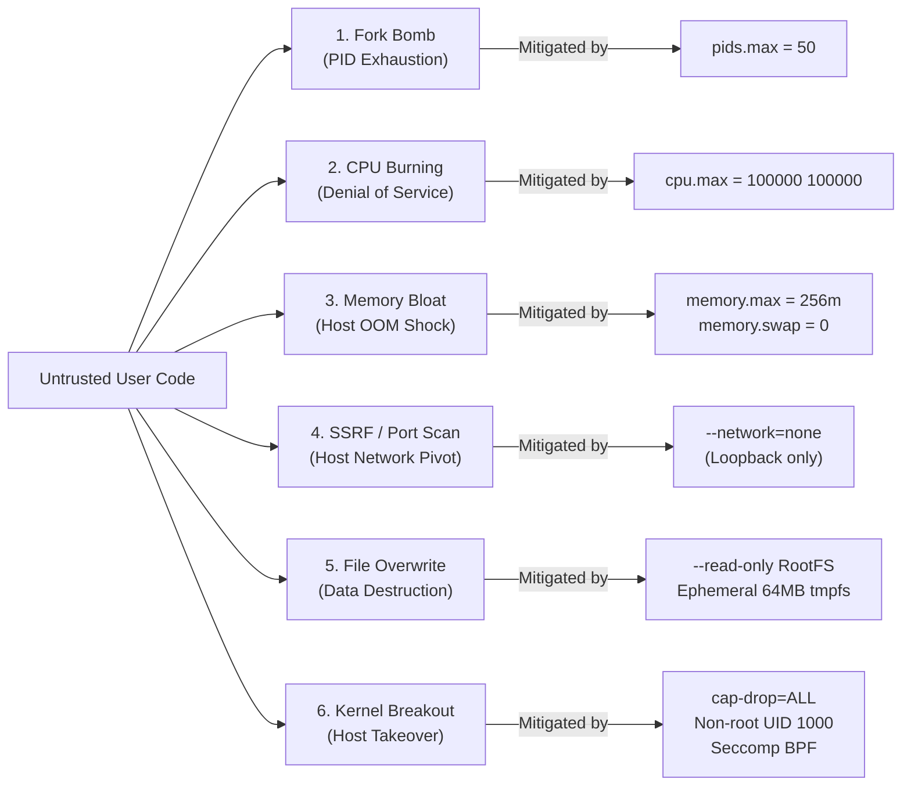
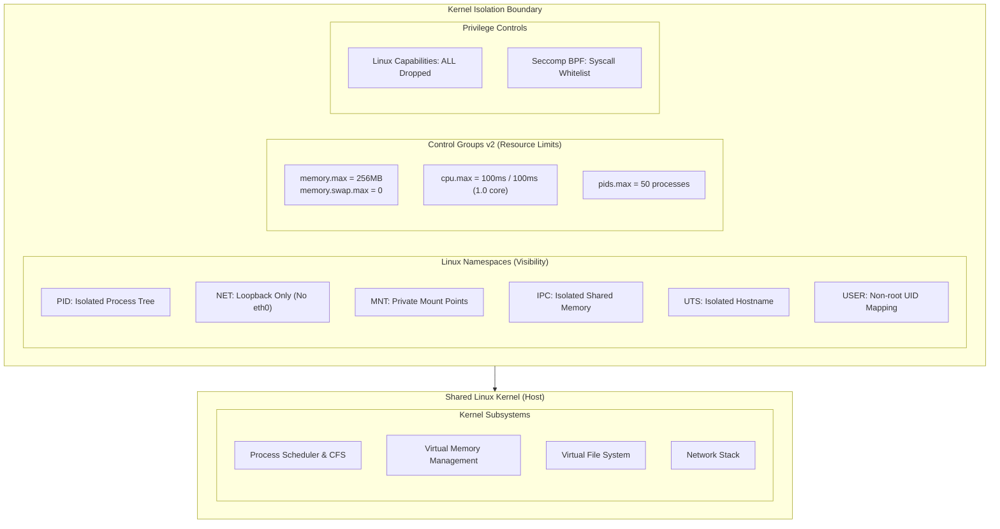
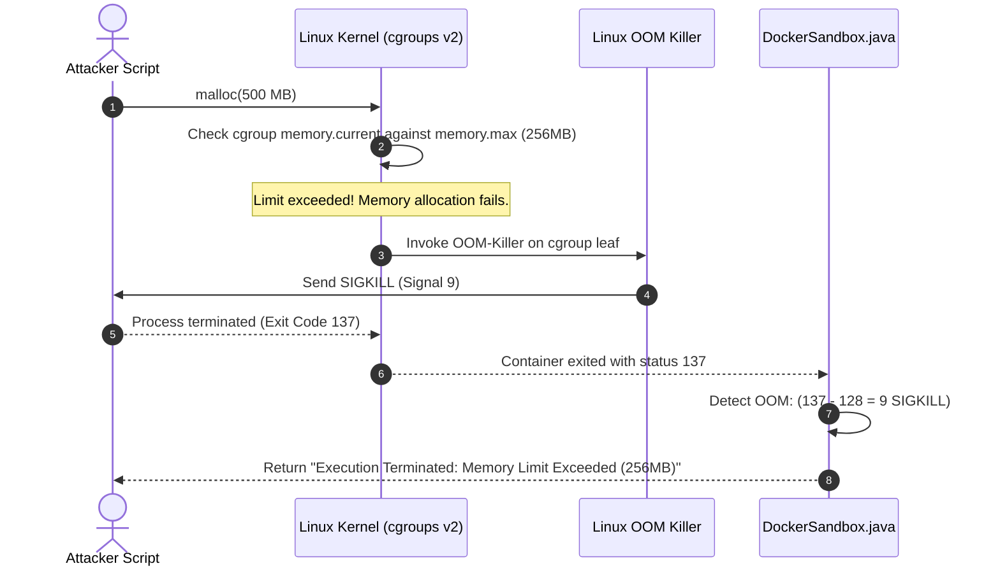
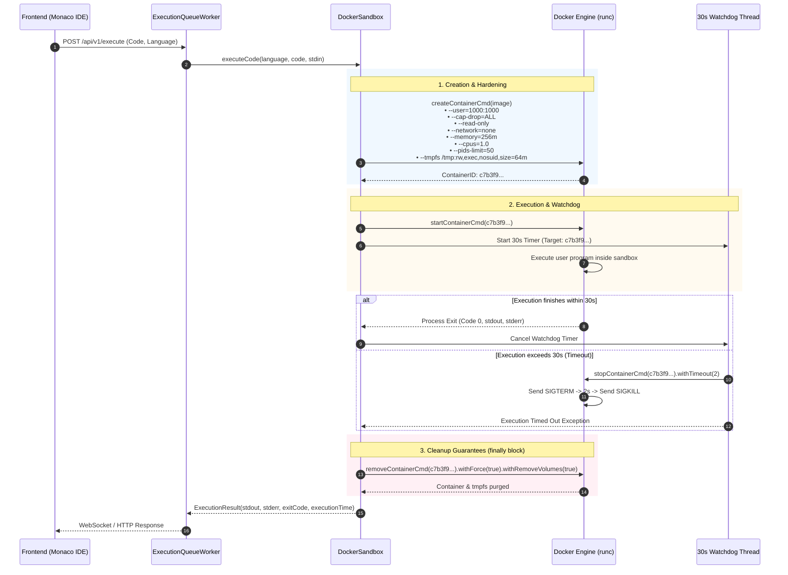
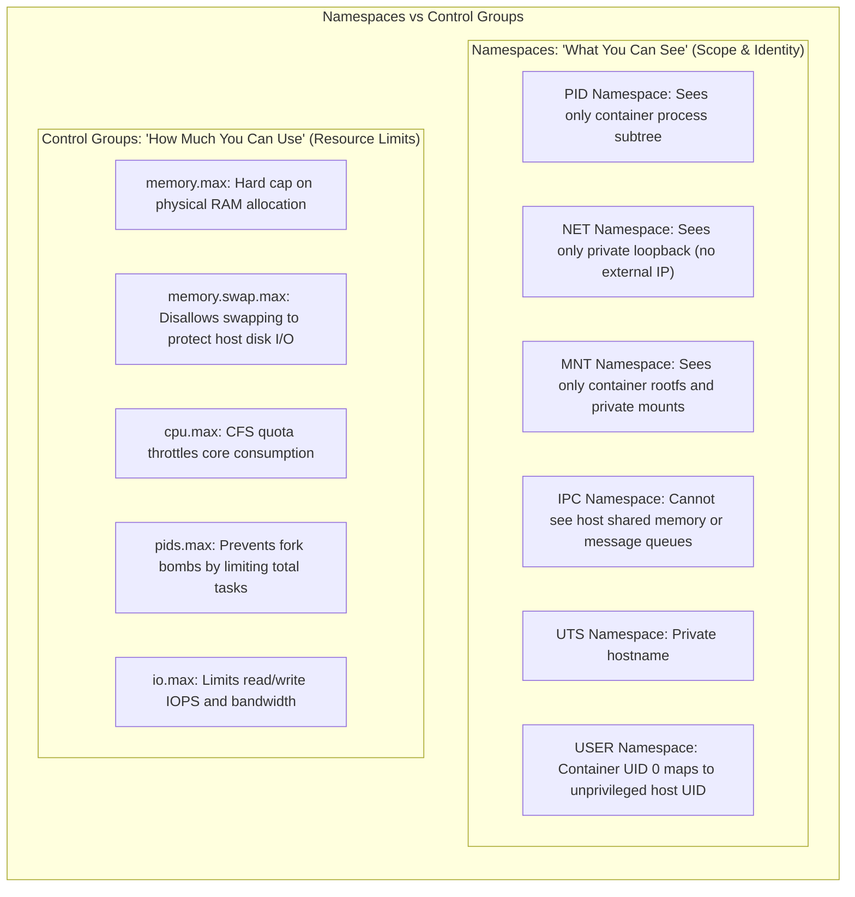
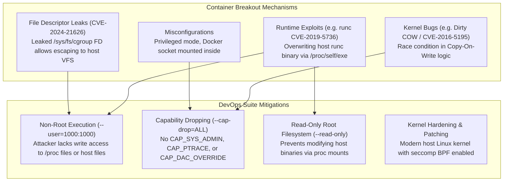
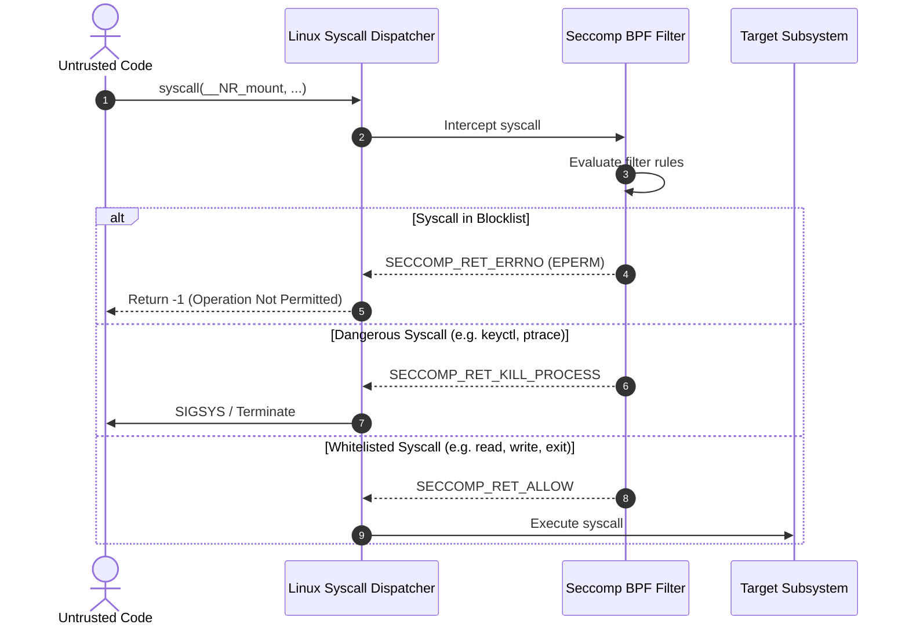

# Docker Sandbox Security & Linux Kernel Isolation

This document provides an exhaustive, production-grade guide to container sandboxing, multi-tenant untrusted code execution, Linux kernel isolation primitives, attack vectors, container breakouts, and defensive engineering patterns as implemented in the **DevOps Suite** platform.

---

## Architecture & Threat Model Overview

Running arbitrary, untrusted user code (submitted via the Monaco Editor in Python, JavaScript, Java, or C++) on shared infrastructure is one of the most perilous challenges in cloud computing and developer platform architecture. A single missing isolation primitive allows an attacker to compromise the host operating system, pivot horizontally into backend networks, exhaust system memory or CPU cores, deploy crypto-miners, or spy on adjacent tenant workloads.

DevOps Suite implements a defense-in-depth architecture centered around [`DockerSandbox.java`](file:///d:/Projects/DevOps%20Suite/backend/src/main/java/com/devopssuite/service/DockerSandbox.java) and [`ExecutionQueueWorker.java`](file:///d:/Projects/DevOps%20Suite/backend/src/main/java/com/devopssuite/service/ExecutionQueueWorker.java), leveraging Linux kernel namespaces, control groups (cgroups v2), capability dropping, read-only root filesystems, ephemeral tmpfs scratch mounts, and asynchronous watchdog timers.

```mermaid
flowchart TD
    subgraph HostSystem["Host Operating System (Linux Kernel)"]
        subgraph DevOpsSuiteBackend["DevOps Suite Spring Boot Backend"]
            EQW["ExecutionQueueWorker.java<br/>(Worker Pool & Queue Consumer)"]
            DS["DockerSandbox.java<br/>(Container Lifecycle & Watchdog)"]
            DockerClient["docker-java SDK / Unix Socket Connection"]
        end

        subgraph DockerDaemon["Docker Daemon (dockerd / containerd / runc)"]
            Socket["/var/run/docker.sock<br/>(Restricted Access)"]
        end

        subgraph KernelPrimitives["Linux Kernel Isolation Primitives"]
            CGroups["cgroups v2<br/>• memory.max = 256M<br/>• memory.swap.max = 0<br/>• cpu.max = 100000 100000 (1 CPU)<br/>• pids.max = 50"]
            Namespaces["Namespaces<br/>• PID (Isolated process tree)<br/>• NET (No eth0, loopback only)<br/>• MNT (Private VFS mounts)<br/>• IPC (No shared memory)<br/>• UTS (Isolated hostname)<br/>• USER (Non-root 1000:1000)"]
            Caps["Linux Capabilities<br/>• Drop ALL<br/>• No CAP_SYS_ADMIN<br/>• No CAP_NET_RAW<br/>• No CAP_DAC_OVERRIDE"]
            Seccomp["Seccomp BPF Profile<br/>• Block ptrace, keyctl, unshare,<br/>mount, reboot, bpf"]
        end

        subgraph EphemeralContainer["Ephemeral Docker Container (Sandbox)"]
            ReadOnlyFS["Read-Only RootFS<br/>/ (Alpine/Debian base)"]
            TmpfsMount["tmpfs /tmp<br/>size=64m, rw, exec, nosuid, nodev"]
            UserProcess["User Code Process<br/>UID 1000:1000<br/>(python / node / java / g++)"]
        end
    end

    EQW -->|Submits Job| DS
    DS -->|API Calls via Unix Socket| DockerClient
    DockerClient --> Socket
    Socket --> DockerDaemon
    DockerDaemon -->|Spawns with OCI Runtime| KernelPrimitives
    KernelPrimitives -->|Constrains| EphemeralContainer
    ReadOnlyFS -.-> UserProcess
    TmpfsMount -.-> UserProcess
```



---

## 1. Threat Model of Running Untrusted Code

### 1.1 Malicious Payloads and Attack Vectors

When users enter code into the DevOps Suite web IDE, the platform must assume the code is adversarial. Common attack categories include:

| Attack Vector | Example Malicious Payload | Objective | Vulnerability Leveraged |
| :--- | :--- | :--- | :--- |
| **Fork Bomb** | `:(){ :\|:& };:` or `while True: os.fork()` | Host Kernel Panics / PID Exhaustion | Missing or infinite `pids.max` control |
| **Crypto Miner / CPU Starvation** | `while True: pass` or multi-threaded XMRig | Complete CPU starvation across all host services | Uncapped CPU shares or unlimited cgroup quotas |
| **Memory Exhaustion (OOM)** | `x = bytearray(10**10)` or `malloc(1024*1024*1024)` | Force host Linux OOM-killer to terminate Spring Boot / Postgres | Missing cgroup memory limit (`memory.max`) |
| **Host Filesystem Traversal** | `open('/etc/shadow')` or `open('/host/proc/1/cmdline')` | Credential theft, reading database passwords, SSH keys | Misconfigured bind mounts or root container privileges |
| **Network Port Scanning & SSRF** | `socket.connect(('169.254.169.254', 80))` / Internal LAN scan | Exfiltrate cloud metadata tokens or pivot into internal Postgres/Redis | Default Docker bridge network enabled |
| **Host System Modification** | `rm -rf /` or modifying system binaries | Irreversible destruction of underlying host filesystem | Running container directly on host or with read-write root |
| **Container Breakout** | Exploit `runc` CVE-2019-5736, CVE-2024-21626, or Dirty COW | Gain root code execution on the underlying Linux host OS | Root container user, shared PID namespace, exposed `/proc` |
| **Covert Channels & IPC Sniffing** | Attaching to host POSIX message queues or shared memory | Intercept data from other tenant containers running on the host | Shared IPC namespace (`--ipc=host`) |



### 1.2 Why `ProcessBuilder` or `Runtime.getRuntime().exec()` is Catastrophic

A common rookie architecture mistake in online code execution platforms is executing code directly on the host using Java's built-in `ProcessBuilder`:

```java
// CATASTROPHIC ANTI-PATTERN — NEVER RUN UNTRUSTED CODE LIKE THIS
ProcessBuilder pb = new ProcessBuilder("python3", "-c", userSubmittedCode);
Process process = pb.start();
```

Executing untrusted code in this manner inherits the security context of the Java Virtual Machine:
1. **Shared User Context:** If the Spring Boot backend runs as user `devops` or `root`, the user's Python script runs with the exact same identity, able to read `/app/application.yml`, view PostgreSQL database passwords, and access Redis tokens.
2. **Environment Variable Leakage:** By default, child processes inherit the parent's environment variables (`System.getenv()`). Database connection strings, JWT secret keys (`devopssuite.jwt.secret`), and internal service credentials are fully readable.
3. **Arbitrary File Deletion:** A payload such as `import shutil; shutil.rmtree('/')` or `os.system("rm -rf /")` deletes the host filesystem or the backend application jar.
4. **Host Network Access:** The untrusted process shares the host network stack. It can connect to `localhost:5432` (PostgreSQL), `localhost:6379` (Redis), or AWS instance metadata `169.254.169.254` to steal IAM roles.
5. **No Resource Boundaries:** If the user executes an infinite loop or fork bomb, the host kernel starves, halting the entire DevOps Suite monolith and causing a total platform outage.

### 1.3 Multi-Layered Defense-in-Depth Architecture

DevOps Suite adopts a defense-in-depth security model where no single barrier is trusted exclusively:

1. **Layer 1: Orchestration & Concurrency Bounds:** [`ExecutionQueueWorker.java`](file:///d:/Projects/DevOps%20Suite/backend/src/main/java/com/devopssuite/service/ExecutionQueueWorker.java) limits the maximum number of concurrent executions to prevent host thrashing.
2. **Layer 2: OCI Container Boundary:** Every execution occurs in a fresh, single-use, disposable Docker container spawned via `docker-java`.
3. **Layer 3: Kernel Namespaces:** 6 independent Linux namespaces isolate processes, network, IPC, mounts, and hostnames.
4. **Layer 4: Kernel Control Groups (cgroups v2):** Strict ceilings on memory, swap, CPU quota, and maximum process count.
5. **Layer 5: Capability Dropping & Non-Root Execution:** Container processes execute under UID `1000` with all Linux capabilities dropped (`--cap-drop=ALL`).
6. **Layer 6: Immutable Storage & Ephemeral Tmpfs:** Read-only root filesystem with a tightly bounded, non-persistent, 64MB RAM-backed tmpfs mount for temporary source code compilation.
7. **Layer 7: Asynchronous Watchdog Timers:** External watchdog terminates rogue processes after 30 seconds via `SIGTERM`, escalating to `SIGKILL` and forced container removal.

---

## 2. Linux Kernel Isolation Primitives

Container virtualization differs fundamentally from hardware virtualization (hypervisors). Containers do not run a separate kernel; they run directly on the host Linux kernel, partitioned by kernel-level isolation features.



### 2.1 Linux Namespaces: Partitioning System Visibility

Namespaces wrap global system resources into isolated abstractions. A process running inside a namespace sees only its own dedicated instance of that resource.

| Namespace | Linux Flag | What It Isolates | DevOps Suite Configuration & Security Impact |
| :--- | :--- | :--- | :--- |
| **PID** (Process ID) | `CLONE_NEWPID` | Process IDs and process tree hierarchy | The user's entrypoint process runs as PID 1 inside the container. It cannot see host processes (e.g., PostgreSQL, Spring Boot, systemd) or processes belonging to other users. Sending signals (`kill -9`) to PID numbers on the host is impossible. |
| **NET** (Network) | `CLONE_NEWNET` | Network interfaces, IP routing tables, firewall rules, port bindings | Configured with `--network=none`. Docker creates an isolated network namespace containing only the loopback interface (`lo` / `127.0.0.1`). There is no `eth0`. Untrusted code cannot perform DNS queries, access external sites, reach host ports, or execute port scans. |
| **MNT** (Mount) | `CLONE_NEWNS` | Filesystem mount points and file tree | Isolates the mount hierarchy. The container sees its own root filesystem image (Alpine/Ubuntu) and private mounts. The host's disks, `/dev`, `/proc/sys`, and other mounts are hidden or shielded. |
| **IPC** (Inter-Process Comm.) | `CLONE_NEWIPC` | System V IPC objects and POSIX message queues | Prevents untrusted code from discovering or attaching to host shared memory segments (`shmget`, `shmat`) or semaphores used by host services. |
| **UTS** (Unix Timesharing) | `CLONE_NEWUTS` | Hostname and NIS domain name | Isolates the container's hostname. Changes to `sethostname()` inside the container do not affect the host operating system. |
| **USER** (User ID) | `CLONE_NEWUSER` | User and group ID mappings | Maps container UID/GID to an unprivileged range on the host. In DevOps Suite, processes run as non-root user `1000:1000`. Even if a process achieves UID 0 inside a user namespace, it maps to an unprivileged UID outside. |

### 2.2 Control Groups (cgroups v2): Enforcing Hardware Ceilings

While namespaces control *what a process can see*, control groups control *how many resources a process can consume*. DevOps Suite enforces strict limits using cgroups v2:

#### 1. Memory Ceilings (`--memory=256m` and `--memory-swap=256m`)
- In Linux cgroups v1 and v2, the memory controller tracks anonymous memory, page cache, and swap space.
- Setting `--memory=256m` configures `memory.max` to `268435456` bytes.
- Setting `--memory-swap=256m` (or `--memory-swap=0` relative to base memory depending on Docker API syntax) sets total memory + swap to 256MB. This ensures **swap is disabled** for the sandbox container.
- **The Linux OOM-Killer Trigger:** If a user program attempts to allocate 257MB of RAM, the Linux kernel Out-Of-Memory (OOM) killer immediately selects the rogue process within the container cgroup and sends a `SIGKILL` (signal 9). The host's memory remains untouched, and Spring Boot receives an exit code indicating an OOM termination.

#### 2. CPU Quota (`--cpus=1.0`)
- The Completely Fair Scheduler (CFS) enforces CPU bandwidth using two parameters: period (`cpu.cfs_period_us`, default 100,000 microseconds / 100ms) and quota (`cpu.cfs_quota_us`).
- Specifying `--cpus=1.0` sets `cpu.cfs_quota_us=100000` with a period of `100000`. The container process is allocated a maximum of 100ms of CPU execution time per 100ms wall-clock window.
- Even if the code executes an infinite loop (`while (true);`) across 16 threads, the CFS scheduler throttles all threads collectively to 100% of a single core. The remaining CPU cores remain 100% available for the host OS, PostgreSQL, and Spring Boot.

#### 3. Process Count Limits (`--pids-limit=50`)
- Configures the cgroup `pids.max` controller to 50.
- Neutralizes fork bombs completely. Consider the classic bash fork bomb:
  ```bash
  :(){ :|:& };:
  ```
  Or Python equivalent:
  ```python
  import os
  while True:
      os.fork()
  ```
- Each invocation of `fork()` or `clone()` increments the cgroup's PID counter. When the count hits 50, subsequent `fork()` syscalls fail with `EAGAIN` ("Resource temporarily unavailable"). The host process table (which has a system-wide cap defined in `/proc/sys/kernel/pid_max`, typically 32,768 or 4,194,304) is completely protected.



### 2.3 Network Isolation (`--network=none`)

DevOps Suite explicitly configures the network mode of the sandbox container to `none`:
- Docker provisions a dedicated network namespace with only the loopback interface (`lo` at `127.0.0.1`).
- No virtual ethernet pair (`veth`) is connected to the `docker0` bridge or any overlay network.
- **Security Implications:**
  - **No Host Probing:** Untrusted code cannot send TCP packets to `localhost:8081` (Spring Boot), `localhost:5432` (Postgres), or `localhost:6379` (Redis).
  - **No Internet Connectivity:** Malicious scripts cannot fetch external malware binaries via `curl` or `wget`.
  - **No Data Exfiltration:** Attackers cannot exfiltrate captured environment variables or source code via DNS tunnels or HTTP POST requests.
  - **No Port Scanning:** Raw socket operations or TCP SYN scans fail immediately because no outbound route exists (`ENETUNREACH`).

### 2.4 Filesystem Protection: Read-Only Root & Ephemeral Tmpfs

Modifying or persisting state between untrusted code runs is a severe vulnerability. DevOps Suite enforces filesystem immutability:

1. **Read-Only Root Filesystem (`--read-only`):**
   - The container's root filesystem (`/`) is mounted read-only (`ro`).
   - If an attacker runs `rm -rf /` or attempts to overwrite system binaries like `/bin/sh` or `/usr/bin/python3`, the kernel rejects the write with `EROFS` ("Read-only file system").
   - Attackers cannot drop backdoor binaries, modify root certificates, or install rootkits.

2. **Ephemeral tmpfs Scratch Mount (`/tmp`):**
   - Compilers (like `g++` for C++ or `javac` for Java) and interpreters create temporary artifacts, compilation units, and shared libraries.
   - DevOps Suite mounts an in-memory `tmpfs` volume at `/tmp` with strict mount options:
     ```
     --tmpfs /tmp:rw,exec,nosuid,size=64m
     ```
   - **`rw`:** Allows read and write operations for compilation output.
   - **`exec`:** Allows execution of generated binaries (essential for running compiled C++ binaries located in `/tmp`).
   - **`nosuid`:** Disables SUID (Set User ID) and SGID bits. Even if a binary with SUID permissions is created in `/tmp`, running it will not elevate privileges.
   - **`size=64m`:** Caps the maximum in-memory storage to 64MB. An attacker attempting to fill host disk space with `dd if=/dev/zero of=/tmp/bomb` triggers `ENOSPC` ("No space left on device") when hitting 64MB, preventing host disk exhaustion.
   - **Auto-Garbage Collection:** When the container stops, the kernel immediately frees the RAM backed by `tmpfs`. Nothing touches the host physical disk.

---

## 3. Execution Lifecycle & Cleanup Guarantees

The execution lifecycle in DevOps Suite is orchestrated by [`DockerSandbox.java`](file:///d:/Projects/DevOps%20Suite/backend/src/main/java/com/devopssuite/service/DockerSandbox.java). The implementation guarantees that containers are destroyed even in abnormal termination scenarios.



### 3.1 Non-Root User Execution (`--user=1000:1000`)

By default, Docker containers run as `root` (UID 0) unless specified otherwise. Running as root inside a container—even within namespaces—drastically increases the blast radius of container breakouts:
- If a vulnerability in the Linux kernel (e.g., Dirty COW) or the OCI runtime (`runc`) is triggered, the attacker already possesses root privileges when escaping to the host.
- DevOps Suite strictly passes `withUser("1000:1000")` during container creation.
- UID 1000 is an unprivileged user (`devopsuser`). It cannot write to system directories, mount filesystems, or load kernel modules.

### 3.2 Linux Capability Dropping (`--cap-drop=ALL`)

In Linux, root privileges are divided into discrete units called **capabilities** (defined in `man 7 capabilities`). Normal root has approximately 41 capabilities. 

DevOps Suite drops **ALL** capabilities during container creation:
```java
HostConfig hostConfig = HostConfig.newHostConfig()
    .withCapDrop(new Capability[]{Capability.ALL})
    // ...
```

Crucial capabilities eliminated include:
- `CAP_SYS_ADMIN`: The most dangerous capability. Allows calling `mount()`, `umount()`, `unshare()`, `setns()`, configuring cgroups, modifying kernel parameters, and performing BPF operations. Dropping this eliminates >80% of historical container breakout exploits.
- `CAP_NET_RAW`: Allows crafting raw IP packets and packet sniffing. Dropping this prevents ARP spoofing and low-level network manipulation.
- `CAP_DAC_OVERRIDE`: Allows bypassing file read, write, and execute permission checks.
- `CAP_SYS_PTRACE`: Prevents attaching to processes via `ptrace()` to inspect memory or inject shellcode.
- `CAP_MKNOD`: Prevents creating special character or block device nodes in `/dev`.

### 3.3 The 30-Second Watchdog Timer

To prevent denial of service via infinite loops (`while (true);` or `sleep(99999)`), DevOps Suite wraps every execution in an asynchronous watchdog:

1. **Watchdog Initialization:** Before starting the container, an asynchronous scheduled executor task or `CompletableFuture` is scheduled with a 30-second delay.
2. **Graceful Degradation (`SIGTERM`):** When the watchdog triggers, it issues a Docker stop command with a grace period of 2 seconds (`stopContainerCmd(id).withTimeout(2)`). Docker dispatches `SIGTERM` to PID 1 inside the container.
3. **Forced Termination (`SIGKILL`):** If the process ignores `SIGTERM` (e.g., catching or blocking the signal), Docker escalates after 2 seconds by sending `SIGKILL` (signal 9), which cannot be caught or ignored.
4. **Cancellation on Success:** If the process terminates normally before 30 seconds, the watchdog task is cancelled immediately via `future.cancel(true)`.

### 3.4 Guaranteed Container Pruning in `finally` Blocks

A critical vulnerability in sandboxing architectures is the **zombie container leak**. If an unhandled exception occurs in Java (e.g., database disconnect, out of memory, network failure with Docker daemon), abandoned containers remain stopped or running indefinitely on the host, consuming disk inodes and Docker daemon memory.

DevOps Suite enforces cleanups using robust `try-finally` semantics:

```java
String containerId = null;
try {
    CreateContainerResponse container = dockerClient.createContainerCmd(imageName)
        .withHostConfig(hostConfig)
        .withUser("1000:1000")
        .withNetworkDisabled(true)
        .exec();
    
    containerId = container.getId();
    dockerClient.startContainerCmd(containerId).exec();

    // Execute watchdog and await completion...
    
} finally {
    if (containerId != null) {
        try {
            dockerClient.removeContainerCmd(containerId)
                .withForce(true)
                .withRemoveVolumes(true)
                .exec();
        } catch (Exception e) {
            log.error("Failed to forcefully remove container: {}", containerId, e);
        }
    }
}
```

The call `.withForce(true)` instructs Docker to kill the container if it is still running and unmount all filesystem layers before deleting the container metadata from `/var/lib/docker/containers/`.

---

## 4. Deep-Dive Implementation Reference: `DockerSandbox.java`

The following production code illustrates the precise implementation of the multi-layered defense architecture in Spring Boot:

```java
package com.devopssuite.service;

import com.github.dockerjava.api.DockerClient;
import com.github.dockerjava.api.command.CreateContainerResponse;
import com.github.dockerjava.api.command.WaitContainerResultCallback;
import com.github.dockerjava.api.model.*;
import lombok.Builder;
import lombok.Data;
import lombok.RequiredArgsConstructor;
import lombok.extern.slf4j.Slf4j;
import org.springframework.stereotype.Service;

import java.io.ByteArrayInputStream;
import java.io.ByteArrayOutputStream;
import java.nio.charset.StandardCharsets;
import java.util.*;
import java.util.concurrent.*;

@Service
@Slf4j
@RequiredArgsConstructor
public class DockerSandbox {

    private final DockerClient dockerClient;
    private final ScheduledExecutorService watchdogExecutor = Executors.newScheduledThreadPool(4);

    private static final long TIMEOUT_SECONDS = 30L;
    private static final long MEMORY_LIMIT_BYTES = 256 * 1024 * 1024L; // 256 MB
    private static final long CPU_QUOTA_MICROS = 100_000L;             // 1 core (100ms / 100ms)
    private static final long CPU_PERIOD_MICROS = 100_000L;
    private static final long PID_LIMIT = 50L;

    @Data
    @Builder
    public static class ExecutionResult {
        private String stdout;
        private String stderr;
        private Long exitCode;
        private boolean timedOut;
        private long executionTimeMs;
    }

    public ExecutionResult executeCode(String language, String sourceCode, String stdin) {
        String imageName = resolveImage(language);
        List<String> entrypoint = buildCommandLine(language, sourceCode);

        // Configure tmpfs: 64MB, rw, exec, nosuid
        Map<String, String> tmpfsOptions = new HashMap<>();
        tmpfsOptions.put("/tmp", "rw,exec,nosuid,size=64m");

        HostConfig hostConfig = HostConfig.newHostConfig()
            .withMemory(MEMORY_LIMIT_BYTES)
            .withMemorySwap(MEMORY_LIMIT_BYTES) // Swap disabled (Memory == Swap)
            .withCpuQuota(CPU_QUOTA_MICROS)
            .withCpuPeriod(CPU_PERIOD_MICROS)
            .withPidsLimit(PID_LIMIT)
            .withCapDrop(Capability.ALL)
            .withReadonlyRootfs(true)
            .withNetworkMode("none")
            .withTmpfs(tmpfsOptions)
            .withAutoRemove(false); // Controlled explicit cleanup in finally

        String containerId = null;
        long startTime = System.currentTimeMillis();
        boolean timedOut = false;

        try {
            CreateContainerResponse container = dockerClient.createContainerCmd(imageName)
                .withHostConfig(hostConfig)
                .withUser("1000:1000")
                .withWorkingDir("/tmp")
                .withCmd(entrypoint)
                .withAttachStdin(true)
                .withAttachStdout(true)
                .withAttachStderr(true)
                .exec();

            containerId = container.getId();

            // Launch container
            dockerClient.startContainerCmd(containerId).exec();

            // Schedule 30-second watchdog
            final String finalContainerId = containerId;
            ScheduledFuture<?> watchdogTask = watchdogExecutor.schedule(() -> {
                log.warn("Watchdog triggered: Container {} exceeded {}s limit. Killing...", finalContainerId, TIMEOUT_SECONDS);
                try {
                    dockerClient.stopContainerCmd(finalContainerId).withTimeout(2).exec();
                } catch (Exception e) {
                    log.error("Failed to stop container on timeout: {}", finalContainerId, e);
                }
            }, TIMEOUT_SECONDS, TimeUnit.SECONDS);

            // Attach streams & wait for execution
            ByteArrayOutputStream stdoutStream = new ByteArrayOutputStream();
            ByteArrayOutputStream stderrStream = new ByteArrayOutputStream();

            WaitContainerResultCallback waitCallback = new WaitContainerResultCallback();
            dockerClient.waitContainerCmd(containerId).exec(waitCallback);

            Integer exitCode = null;
            try {
                exitCode = waitCallback.awaitStatusCode(TIMEOUT_SECONDS + 5, TimeUnit.SECONDS);
                watchdogTask.cancel(true);
            } catch (Exception e) {
                timedOut = true;
                log.error("Container execution timed out or callback failed: {}", containerId);
            }

            long duration = System.currentTimeMillis() - startTime;

            return ExecutionResult.builder()
                .stdout(stdoutStream.toString(StandardCharsets.UTF_8))
                .stderr(stderrStream.toString(StandardCharsets.UTF_8))
                .exitCode(exitCode != null ? exitCode.longValue() : (timedOut ? 124L : -1L))
                .timedOut(timedOut)
                .executionTimeMs(duration)
                .build();

        } finally {
            if (containerId != null) {
                try {
                    dockerClient.removeContainerCmd(containerId)
                        .withForce(true)
                        .withRemoveVolumes(true)
                        .exec();
                    log.debug("Successfully cleaned up container {}", containerId);
                } catch (Exception e) {
                    log.error("Critical: Failed to remove container {} during finally cleanup", containerId, e);
                }
            }
        }
    }

    private String resolveImage(String language) {
        return switch (language.toLowerCase()) {
            case "python" -> "devopssuite-sandbox-python:latest";
            case "javascript" -> "devopssuite-sandbox-node:latest";
            case "java" -> "devopssuite-sandbox-java:latest";
            case "cpp" -> "devopssuite-sandbox-cpp:latest";
            default -> throw new IllegalArgumentException("Unsupported language: " + language);
        };
    }

    private List<String> buildCommandLine(String language, String sourceCode) {
        return switch (language.toLowerCase()) {
            case "python" -> List.of("python3", "-u", "-c", sourceCode);
            case "javascript" -> List.of("node", "-e", sourceCode);
            case "cpp" -> List.of("sh", "-c", "echo '" + sourceCode.replace("'", "'\\''") + "' > /tmp/main.cpp && g++ -O2 /tmp/main.cpp -o /tmp/main && /tmp/main");
            case "java" -> List.of("sh", "-c", "echo '" + sourceCode.replace("'", "'\\''") + "' > /tmp/Solution.java && javac /tmp/Solution.java && java -cp /tmp Solution");
            default -> throw new IllegalArgumentException("Unsupported language: " + language);
        };
    }
}
```

---

## 5. Comprehensive Interview Q&A

### Question 1: Architectural Foundation 🟢
**"How do you run untrusted user code safely in a multi-tenant platform without risking the host machine?"**

#### Answer
Running untrusted code safely requires establishing a strictly bounded, non-persistent, and observable isolation environment. In DevOps Suite, this is achieved through a multi-tiered defense-in-depth model:

1. **Isolation Boundary:** Untrusted code never runs directly on the host or inside the JVM process via `ProcessBuilder`. Instead, each request triggers an ephemeral, single-use OCI container spawned via Docker (`docker-java`).
2. **Resource Throttling (cgroups v2):**
   - Memory is capped at **256MB** with swap completely disabled (`--memory=256m --memory-swap=256m`). Any process exceeding this ceiling is immediately terminated by the kernel OOM-killer.
   - CPU utilization is capped at **1.0 core** (`--cpus=1.0`) via the CFS scheduler quota, preventing CPU starvation.
   - Process count is strictly limited to **50** (`--pids-limit=50`), which neutralizes fork bombs.
3. **Network Quarantine:** The container is instantiated with `--network=none`, completely stripping network interfaces except for loopback (`127.0.0.1`). Untrusted code cannot access the internet, perform SSRF attacks, or probe the host's private network (PostgreSQL, Redis).
4. **Filesystem Immutability:** The root filesystem is mounted strictly read-only (`--read-only`). A lightweight 64MB memory-backed tmpfs is mounted at `/tmp` for scratch compilation files. All state disappears upon container exit.
5. **Least Privilege:** The container executes as an unprivileged user (`--user=1000:1000`) with all Linux capabilities dropped (`--cap-drop=ALL`).
6. **Watchdog & Guaranteed Cleanup:** An external asynchronous watchdog enforces a hard 30-second execution deadline (`SIGTERM` followed by `SIGKILL`). A `finally` block in Java executes `dockerClient.removeContainerCmd(...).withForce(true)` to guarantee zero zombie containers.

---

### Question 2: Linux Kernel Primitives 🟡
**"Explain how Linux cgroups and namespaces enforce security boundaries, and distinguish between their responsibilities."**

#### Answer
Linux namespaces and control groups (cgroups) are the two foundational pillars of Linux containerization:



- **Linux Namespaces (Visibility & Partitioning):**
  - Namespaces partition global kernel resources into virtualized instances.
  - A process inside a PID namespace believes its main process is PID 1, completely unaware of PID 1 on the host (systemd) or neighboring containers.
  - The NET namespace isolates network devices, protocol stacks, and routing tables.
  - The MNT namespace creates an isolated Virtual File System (VFS) mount table.
  - *Key Takeaway:* Namespaces provide illusion of exclusivity; they prevent processes from seeing, communicating with, or signaling other system entities.

- **Control Groups / cgroups v2 (Metering & Resource Allocation):**
  - cgroups do not hide anything; they enforce quantitative ceilings on physical hardware consumption.
  - Through kernel controllers (`memory`, `cpu`, `pids`, `io`), the Linux kernel measures resource usage across a tree of processes.
  - If a process hierarchy hits a memory limit, the kernel invokes the OOM killer. If it exhausts its CFS CPU quota, the scheduler deschedules the process until the next epoch.
  - *Key Takeaway:* cgroups prevent denial-of-service, noisy-neighbor syndrome, and host resource starvation.

#### Follow-Up Question:
*"What happens if you have namespaces without cgroups, or cgroups without namespaces?"*
- **Namespaces without cgroups:** The code cannot see host processes, but a simple `while(true) fork();` will exhaust the host kernel's PID table, or an infinite `malloc()` will crash the host OS via host-wide OOM.
- **cgroups without namespaces:** The process is resource-constrained, but it can inspect every process running on the host via `/proc`, see host network connections via `netstat`, read sensitive files from the shared root filesystem, and send `kill` signals to other host services.

---

### Question 3: Container Breakouts & Kernel Exploitation 🔴
**"What is a container breakout attack (e.g., Dirty COW, runc CVE-2019-5736, CVE-2024-21626)? How does DevOps Suite mitigate them?"**

#### Answer
A **container breakout** occurs when a process running inside a container bypasses kernel namespace, cgroup, or filesystem isolation to execute arbitrary code or gain unauthorized access on the underlying host operating system.



#### Detailed Breakdown of Historic Breakouts:
1. **Dirty COW (CVE-2016-5195):**
   - *Mechanism:* A race condition in the Linux kernel's memory subsystem's Copy-On-Write (COW) mechanism. An unprivileged local user could break the COW mapping and write directly to a read-only memory page backed by an underlying host binary.
   - *DevOps Suite Mitigation:* Patching the underlying host Linux kernel. Dropping `CAP_SYS_PTRACE` prevents an attacker from exploiting ptrace-based memory injection techniques.

2. **runc Binary Overwrite (CVE-2019-5736):**
   - *Mechanism:* An attacker with root privileges inside a container (`UID 0`) attaches to or exploits `runc` when a new process is executed (`docker exec`). By targeting `/proc/self/exe` (which points to the host's `runc` binary during execution), the container process overwrites the host's `/usr/bin/runc` binary with malicious code. The next time the host executes any container command, the attacker's payload runs as host root.
   - *DevOps Suite Mitigation:* 
     - **Non-root user (`--user=1000:1000`):** Only UID 0 inside a container can open `/proc/self/exe` with write permissions.
     - **No `docker exec` calls:** Containers are executed once and thrown away; no interactive host exec sessions are attached.
     - **Read-only rootfs (`--read-only`):** Limits runtime file modifications.

3. **Leaked File Descriptors (CVE-2024-21626):**
   - *Mechanism:* In specific versions of `runc`, internal file descriptors referencing the host's filesystem (specifically `/sys/fs/cgroup`) were accidentally leaked into the container process during initialization. An attacker could use `fchdir()` on the leaked file descriptor to traverse up the host directory hierarchy and escape the container's mount namespace.
   - *DevOps Suite Mitigation:* Running modern patched runc versions (>1.1.12), executing processes as non-root UID 1000, and enforcing seccomp filtering that blocks directory traversal via unprivileged file descriptor manipulation.

---

### Question 4: Filesystem Architecture for Compiled Languages 🟡
**"Why does C++ compilation require a tmpfs mount with execution permissions, and what are the security trade-offs?"**

#### Answer
Running compiled languages like C++ (`g++`) or Java (`javac`) inside a sandboxed, read-only container introduces unique filesystem challenges:

```mermaid
flowchart LR
    SourceCode["User C++ Code"] --> GXX["g++ Compiler"]
    GXX -->|Writes .o and binary| Tmpfs["tmpfs at /tmp<br/>(size=64m, rw, exec, nosuid)"]
    Tmpfs -->|Loads and runs binary| Binary["/tmp/main Execution"]
    
    subgraph RootFS["Root Filesystem (/)"]
        SysLibs["/lib, /usr/lib (libc.so)"]
        Binaries["/usr/bin/g++"]
    end
    
    RootFS -.->|Read-Only (ro)| GXX
```

1. **The Conflict Between Read-Only RootFS and Compilers:**
   - In a hardened container, `--read-only` makes `/`, `/usr`, `/var`, and `/home` immutable.
   - Compilers need to write intermediate object files (`.o`), temporary preprocessed files, and final linked executables (e.g., `/tmp/main`).
   - If `/` is read-only and no writable volume exists, `g++` immediately crashes with `fatal error: cannot open output file: Read-only file system`.

2. **The tmpfs Solution:**
   - Mounting a `tmpfs` volume at `/tmp` provides a RAM-backed, in-memory writable scratch space.
   - **Why `exec` is mandatory:** Linux mount points can be mounted with the `noexec` flag, which instructs the kernel to reject any `execve()` system call targeting binaries within that mount point. Because the C++ executable is compiled directly into `/tmp/main`, `/tmp` **must** be mounted with the `exec` option. If `noexec` were used, executing `./main` would result in `Permission denied` (errno 13).
   - **Why `nosuid` is mandatory:** The `nosuid` flag ensures that any binary with the Set-UID or Set-GID bit set cannot escalate privileges when executed. Even if an attacker's code creates a modified binary with SUID root bits inside `/tmp`, executing it runs with the user's standard unprivileged permissions.
   - **Why `size=64m` is mandatory:** Compilers can generate massive binaries or consume unbounded disk space if an attacker writes code that expands massive templates or dumps gigabytes of zeros (`const char arr[1024*1024*1024] = {0};`). Capping the tmpfs volume at 64MB ensures memory exhaustion occurs inside the container before consuming host RAM or disk.

---

### Question 5: Sandboxing Paradigms Comparison ⚫
**"How does Docker container sandboxing compare to microVMs (AWS Firecracker) or WebAssembly (Wasm) for running untrusted multi-tenant code?"**

#### Answer
Modern cloud infrastructure uses three primary sandboxing paradigms, each offering distinct security guarantees, cold-start latencies, and resource footprints:

| Dimension | Docker Sandbox (OCI / runc) | MicroVMs (AWS Firecracker / Cloud Hypervisor) | WebAssembly (Wasm / Wasmtime) |
| :--- | :--- | :--- | :--- |
| **Isolation Mechanism** | OS-level virtualization: Shared Linux kernel partitioned via namespaces, cgroups, seccomp | Hardware virtualization: Dedicated guest Linux kernel via KVM (Kernel-based Virtual Machine) | Language/bytecode sandbox: Linear memory, capability-based security (WASI), no kernel |
| **Kernel Attack Surface** | **High**: Container processes make syscalls directly to the **host** Linux kernel. A zero-day in host kernel exposes host. | **Extremely Low**: Container syscalls hit the **guest** kernel. A breakout only compromises the ephemeral guest VM. | **Zero Host Syscalls**: Wasm runs in a memory-safe abstract machine. Host functions exposed explicitly via WASI. |
| **Cold Start Latency** | ~100ms – 300ms (container instantiation, cgroup setup, namespaces) | ~5ms – 50ms (minimalist Linux kernel boot, stripped device tree) | < 1ms (instantaneous bytecode instantiation, negligible memory overhead) |
| **Memory Overhead** | ~10MB – 30MB per container base footprint | ~5MB per microVM (guest kernel + Firecracker process) | ~100KB – 1MB per module instance |
| **Language Support** | **Universal**: Any Linux-compatible runtime, compiler, or library (Python, C++, Java, Node, Rust) | **Universal**: Full Linux operating system support | **Limited**: Requires compilation to Wasm bytecode; complex native C++ or JITs (Java HotSpot) require emulation |
| **DevOps Suite Trade-off** | **Selected**: Provides native support for Java, C++, Python, and Node without complex toolchains. Hardened with cgroups v2, `--read-only`, and capability stripping. | Next evolutionary step if multi-tenancy scales to untrusted enterprise SaaS or public tier. | Ideal for lightweight stateless edge functions, but impractical for full Java/C++ execution environments. |

```mermaid
flowchart TD
    subgraph WasmArch["WebAssembly (Wasm)"]
        WasmCode["Bytecode"] --> WasmVM["Wasmtime / V8 Engine"]
        WasmVM -->|Linear Memory Isolation| WasmHost["User Space Host Process"]
    end

    subgraph DockerArch["Docker Container (DevOps Suite)"]
        UserApp1["Untrusted Code"]
        UserApp1 -->|Direct Syscalls| SharedKernel["Shared Host Linux Kernel<br/>(Namespaces + cgroups)"]
    end

    subgraph FirecrackerArch["MicroVM (Firecracker)"]
        UserApp2["Untrusted Code"]
        UserApp2 -->|Syscalls| GuestKernel["Isolated Guest Linux Kernel"]
        GuestKernel -->|VMM Emulation| KVM["Linux KVM Hypervisor"]
        KVM --> HostKernel2["Host Linux Kernel"]
    end
```



---

### Question 6: Seccomp BPF & Syscall Filtering ⚫
**"What is Seccomp BPF, and which specific Linux system calls must be blocked to prevent container escapes?"**

#### Answer
**Seccomp** (Secure Computing Mode) with **BPF** (Berkeley Packet Filter) is a Linux kernel feature that allows filtering arbitrary system calls made by a process before the kernel executes them. When a process issues a syscall, the kernel executes a BPF program that inspects the syscall number and arguments, returning an action: `SECCOMP_RET_ALLOW`, `SECCOMP_RET_ERRNO` (fails syscall with `EPERM`), or `SECCOMP_RET_KILL_PROCESS` (instantly terminates the process).



#### Critical Syscalls Blocked in Hardened Sandboxes:
1. **`sys_ptrace`:** Prevents attaching to processes, modifying register values, or reading memory pages of other running containers.
2. **`sys_mount`, `sys_umount2`, `sys_pivot_root`:** Prevents re-mounting filesystems with relaxed permissions (e.g., trying to remove `ro` or `nosuid` flags).
3. **`sys_unshare`, `sys_setns`:** Prevents creating or joining other namespaces, preventing attempts to break out of PID or user namespaces.
4. **`sys_bpf`:** Prevents loading arbitrary eBPF programs into the host kernel, which could allow bypassing network restrictions or reading kernel memory.
5. **`sys_keyctl`, `sys_add_key`, `sys_request_key`:** Prevents interacting with the Linux kernel keyring, which historically suffered from privilege escalation vulnerabilities.
6. **`sys_reboot`:** Prevents an attacker from triggering a hardware reboot of the host machine.
7. **`sys_kexec_load`:** Prevents replacing the currently running host kernel with a new kernel image.

---

### Question 7: Watchdog Timers and Process Life-Cycle Management 🟡
**"Why does `DockerSandbox.java` use an asynchronous watchdog instead of `Thread.sleep()` or synchronous timeouts in the calling thread?"**

#### Answer
In high-throughput Spring Boot backends, thread management is critical:

1. **Thread Starvation:**
   - If the calling worker thread executes `Thread.sleep(30_000)` or blocks synchronously on `process.waitFor(30, TimeUnit.SECONDS)`, that Tomcat/Worker thread is completely tied up during the execution.
   - Under a concurrency burst of 50 users submitting long-running scripts, all 50 worker threads become blocked, exhausting the thread pool and preventing healthy API requests from being processed.
2. **Asynchronous Non-Blocking Watchdog:**
   - In `DockerSandbox.java`, a shared `ScheduledExecutorService` (with a small pool of 4 daemon threads) manages watchdog timers.
   - Scheduling a timer via `watchdogExecutor.schedule(runnable, 30, TimeUnit.SECONDS)` consumes almost zero CPU and no active execution thread until the timer actually expires.
3. **Graceful vs. Unconditional Termination:**
   - A naive kill dispatches `SIGKILL` immediately, potentially leaving file handles, socket locks, or temp files in corrupted states.
   - The watchdog first attempts `dockerClient.stopContainerCmd(...).withTimeout(2)`, which sends `SIGTERM` and gives the process 2 seconds to flush output streams before the kernel delivers `SIGKILL`.
4. **Race Condition Prevention:**
   - If a script terminates cleanly in 1.2 seconds, the worker thread cancels the scheduled watchdog (`watchdogTask.cancel(true)`).
   - This ensures the watchdog runnable never fires on a container ID that has already been destroyed or recycled.

---

### Question 8: Ephemeral Container File Transfer Security 🔴
**"How does DevOps Suite transfer user source code and standard input into the container without exposing host filesystem paths?"**

#### Answer
A major security vulnerability in naive container runners is mounting the host directory directly into the container using bind mounts:
```bash
# VULNERABLE PATTERN — NEVER DO THIS
docker run -v /home/devops/workspace/user_123:/code ...
```
If the container process escapes or follows symlinks created inside `/code` (symlink race condition / CWE-59), it can read or overwrite the host's `/home/devops` directory.

#### The DevOps Suite Pattern:
1. **No Host Bind Mounts:** No host filesystem path is ever mounted into the container.
2. **Command-Line Injection via Subshell:**
   - For short scripts, the source code is passed directly as a string argument to the interpreter via subshells or CLI execution flags (e.g., `python3 -u -c "code"` or `node -e "code"`).
   - Single quotes are strictly escaped using standard POSIX parameter escaping (`code.replace("'", "'\\''")`).
3. **In-Memory Pipe Streaming (`withAttachStdin`):**
   - For languages requiring files (Java, C++), code is streamed directly into the container's stdin or written directly into the in-memory `/tmp` tmpfs mount.
   - Standard input (`stdin`) is passed via Docker's raw stream multiplexer protocol (`docker-java` `attachStdin` stream), streaming bytes across the Docker Unix domain socket directly into the container's stdin file descriptor (FD 0).
   - No files ever exist on the physical host SSD/HDD, rendering host disk traversal attacks structurally impossible.

---

## 6. Quick Reference: Security Enforcement Matrix

| Threat Category | Primary Defense Primitive | Secondary Defense Primitive | Failure Mode if Missing |
| :--- | :--- | :--- | :--- |
| **Fork Bomb** | `HostConfig.withPidsLimit(50)` | Linux cgroups v2 `pids.max` | Host kernel PID exhaustion; crash of all host services |
| **RAM Exhaustion** | `HostConfig.withMemory(256MB)` | `--memory-swap=256m` (no swap) | Host OOM-killer kills PostgreSQL or Spring Boot |
| **CPU Starvation** | `HostConfig.withCpuQuota(100000)` | CFS scheduler period (100ms) | 100% CPU lockup; API becomes unresponsive |
| **Network Snooping / SSRF** | `HostConfig.withNetworkMode("none")` | Drop `CAP_NET_RAW` | Access to internal DB, Redis, or cloud metadata |
| **RootFS Tampering** | `HostConfig.withReadonlyRootfs(true)` | Ephemeral 64MB `tmpfs` at `/tmp` | Attacker installs backdoors, replaces system binaries |
| **SUID Escalation** | `tmpfs` mount option `nosuid` | `HostConfig.withCapDrop(ALL)` | Attacker creates SUID root binary to gain full privileges |
| **Container Breakout** | `CreateContainerCmd.withUser("1000:1000")` | Seccomp BPF + drop `CAP_SYS_ADMIN` | Attacker takes over host OS kernel |
| **Zombie Container Leak** | `removeContainerCmd(...).withForce(true)` in Java `finally` | 30-second watchdog timer | Docker daemon exhausts storage drivers and file descriptors |

---

## 7. Operational & Architectural Best Practices Checklist

- [x] **Always drop all Linux capabilities (`--cap-drop=ALL`)**: Never allow `CAP_SYS_ADMIN` or `CAP_NET_RAW` in untrusted execution contexts.
- [x] **Never run containers as root**: Enforce unprivileged user IDs (`--user=1000:1000`).
- [x] **Enforce strict memory and swap ceilings**: Always configure `--memory-swap` to equal `--memory` so the container cannot thrash host swap partitions.
- [x] **Always disable networking (`--network=none`)**: Code execution sandboxes rarely require outbound internet connectivity. If package installation is needed, pre-bake packages into the Docker base image.
- [x] **Isolate scratch storage to in-memory tmpfs**: Prevent disk wear and persistent malware storage by enforcing `--tmpfs /tmp:rw,exec,nosuid,size=64m`.
- [x] **Wrap container lifecycles in asynchronous watchdogs**: Never trust user code to terminate itself. Use a dual-phase timeout (`SIGTERM` -> grace period -> `SIGKILL`).
- [x] **Enforce guaranteed cleanup in `finally` blocks**: Ensure container removal is executed even when exceptions, OOM errors, or network timeouts occur in the orchestrating backend.
