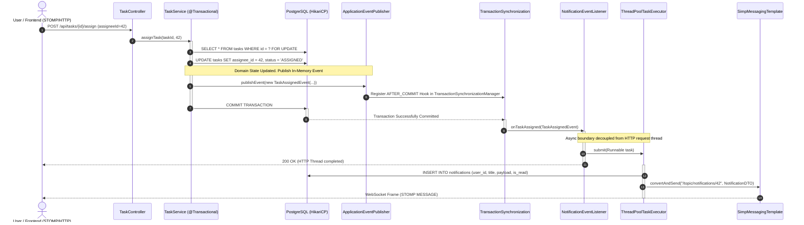
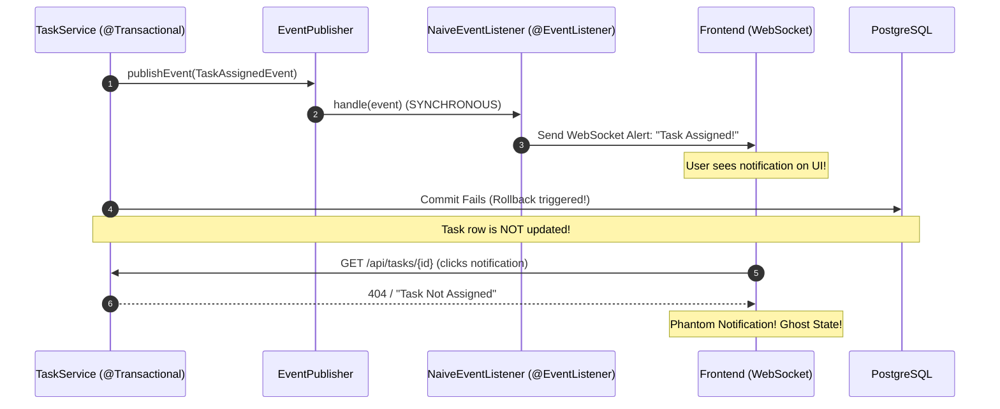
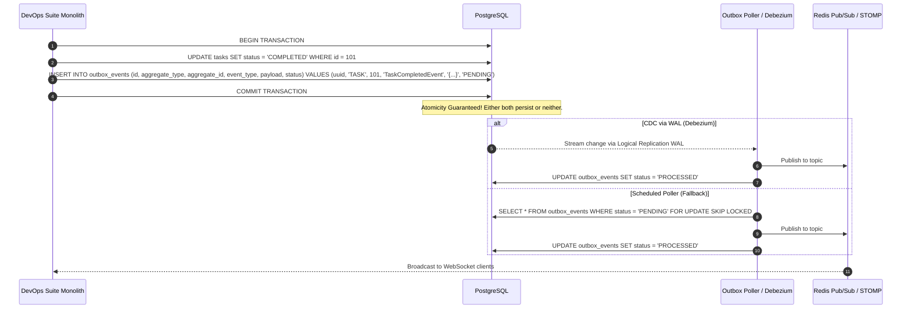

# In-JVM Spring Event Pipeline & Event-Driven Architecture

## 1. Architectural Overview & Context

In **DevOps Suite**, real-time collaboration, notification propagation, and audit recording are vital to providing a seamless developer platform experience. Actions executed within the platform—such as a developer assigning a task, an administrator modifying team permissions, or an ephemeral code execution sandbox timing out or crashing—generate domain events.

Rather than coupling write-heavy transactional operations directly to WebSocket delivery channels, audit log aggregators, or external email services, DevOps Suite employs an **In-JVM Event-Driven Architecture** built upon Spring Framework's `ApplicationEventPublisher`, `@TransactionalEventListener`, and `@Async` thread pools.

```
┌─────────────────────────────────────────────────────────────────────────────────────────────┐
│                                   HTTP REST / STOMP Ingestion                               │
└──────────────────────────────────────────────┬──────────────────────────────────────────────┘
                                               │
                                               ▼
┌─────────────────────────────────────────────────────────────────────────────────────────────┐
│                            Spring Service Layer (@Transactional)                            │
│  e.g., TaskService.assignTask(), ProjectService.addMember(), CodeExecutionService.run()    │
│                                                                                             │
│  1. Business Validation & State Mutation                                                    │
│  2. PostgreSQL Writes (HikariCP Connection Pool)                                            │
│  3. eventPublisher.publishEvent(new TaskAssignedEvent(...))                                 │
└──────────────────────────────────────┬──────────────────────────────────────────────────────┘
                                       │
                         Spring ApplicationContext Event Bus
                                       │
             ┌─────────────────────────┴──────────────────────────┐
             │                                                    │
             ▼ (Transaction Commit Triggered)                     ▼ (Async Sandbox Crash)
┌──────────────────────────────────────────────┐ ┌────────────────────────────────────────────┐
│ @TransactionalEventListener                  │ │ @EventListener                             │
│ phase = TransactionPhase.AFTER_COMMIT        │ │ @Async("eventTaskExecutor")                │
│                                              │ │                                            │
│ NotificationEventListener                    │ │ ExecutionAuditEventListener                │
│ ├─ TaskAssignedEvent                         │ │ └─ ExecutionFailedEvent                    │
│ ├─ MemberRoleChangedEvent                    │ │                                            │
│ └─ TaskCompletedEvent                        │ │                                            │
└──────────────────────┬───────────────────────┘ └─────────────────────┬──────────────────────┘
                       │                                               │
                       ▼                                               ▼
┌──────────────────────────────────────────────┐ ┌────────────────────────────────────────────┐
│              Async Executor Pool             │ │              Async Executor Pool           │
│       ThreadPoolTaskExecutor (eventExecutor) │ │       ThreadPoolTaskExecutor (auditPool)   │
└──────────────────────┬───────────────────────┘ └─────────────────────┬──────────────────────┘
                       │                                               │
         ┌─────────────┴─────────────┐                                 ▼
         │                           │                  Elasticsearch Log Indexer
         ▼                           ▼                  devopssuite-logs-yyyy.MM.dd
┌─────────────────┐         ┌─────────────────┐
│ PostgreSQL DB   │         │ SimpMessaging-  │
│ INSERT INTO     │         │ Template (STOMP)│
│ notifications   │         │ /topic/notif/   │
└─────────────────┘         └─────────────────┘
```

### Strategic Monolith Decision: Why Spring Events over Kafka or RabbitMQ?

Architecting enterprise platforms requires balancing distributed systems sophistication against operational complexity, team cognitive load, and infrastructure costs. For DevOps Suite:

1. **Zero Network Serialization Overhead**: In-JVM event publishing passes Java object references directly through method dispatches and in-memory queue handoffs. This yields sub-millisecond latencies ($<50\,\mu\text{s}$) with zero Jackson/Protobuf serialization or TCP overhead.
2. **Elimination of Distributed State & Split-Brain Risks**: Running an Apache Kafka cluster (or even KRaft mode) requires dedicated memory, ZooKeeper or metadata quorum nodes, persistent disk provisioning, partition rebalancing management, and broker health probes. For an all-in-one developer workspace monolith running on modern cloud hardware, Kafka adds high operational friction without architectural benefit.
3. **Guaranteed Transactional Alignment**: Distributed messaging introduces the dual-write problem: if a relational database commit succeeds but publishing to Kafka fails (or vice versa), the system enters an inconsistent state. Solving this requires distributed 2-Phase Commit (2PC) or an external Transactional Outbox CDC pipeline (such as Debezium). In Spring Boot, `@TransactionalEventListener(phase = TransactionPhase.AFTER_COMMIT)` synchronizes natively with the local Spring `PlatformTransactionManager`, providing zero-cost transactional safety.
4. **Lean Footprint for Single-Node / Ephemeral Deployments**: DevOps Suite ships as a streamlined containerized stack (PostgreSQL, Redis, Elasticsearch, Docker Sandbox Engine). Eliminating message brokers saves at least 1–2 GB of RAM and simplifies local development and CI/CD pipelines.

---

## 2. Event Publishing & Listener Execution Pipeline

The core mechanics of Spring's event bus involve three discrete layers: the **Publisher**, the **Transaction Synchronization Manager**, and the **Listener Dispatcher**.



### Core Execution Semantics

1. **Synchronous vs. Asynchronous Default**: By default, Spring's `ApplicationEventMulticaster` executes listeners **synchronously** within the caller's thread. If a listener throws an unhandled runtime exception, the caller's method aborts and rolls back the active transaction.
2. **Transaction Phase Binding**: Using `@TransactionalEventListener` defers listener invocation until the active database transaction reaches a specified lifecycle phase (`AFTER_COMMIT`, `AFTER_ROLLBACK`, `AFTER_COMPLETION`, or `BEFORE_COMMIT`).
3. **Decoupling with `@Async`**: Placing `@Async("eventTaskExecutor")` alongside `@TransactionalEventListener` ensures that after the transaction successfully commits, execution is offloaded to a dedicated worker thread pool, freeing the HTTP request thread immediately.

---

## 3. Comprehensive Domain Event Catalog

DevOps Suite maintains strongly typed immutable domain events implemented via **Java 21 Records**. Each record captures the precise state mutation and metadata required for downstream consumers.

```
                                  DomainEvent (Interface)
                                             │
         ┌───────────────────────────────────┼──────────────────────────────────┐
         │                                   │                                  │
         ▼                                   ▼                                  ▼
   Task Events                         Member Events                     Sandbox Events
   ├─ TaskAssignedEvent                ├─ MemberAddedEvent               └─ ExecutionFailedEvent
   ├─ TaskReassignedEvent              ├─ MemberRoleChangedEvent
   └─ TaskCompletedEvent               └─ MemberRemovedEvent
```

### 1. `DomainEvent` Base Contract

```java
package com.devopssuite.event.model;

import java.time.Instant;
import java.util.UUID;

/**
 * Marker interface for all domain events across the platform.
 */
public interface DomainEvent {
    UUID eventId();
    Instant timestamp();
    Long triggeredByUserId();
}
```

### 2. Task Lifecycle Events

#### `TaskAssignedEvent`
Triggered when a task transitions from an unassigned state to an assigned user.

```java
package com.devopssuite.event.model;

import java.time.Instant;
import java.util.UUID;

public record TaskAssignedEvent(
    UUID eventId,
    Instant timestamp,
    Long triggeredByUserId,
    Long taskId,
    Long projectId,
    String taskTitle,
    Long assigneeId,
    String assigneeEmail
) implements DomainEvent {
    public TaskAssignedEvent(Long triggeredByUserId, Long taskId, Long projectId, 
                             String taskTitle, Long assigneeId, String assigneeEmail) {
        this(UUID.randomUUID(), Instant.now(), triggeredByUserId, taskId, 
             projectId, taskTitle, assigneeId, assigneeEmail);
    }
}
```

#### `TaskReassignedEvent`
Triggered when a task's ownership changes from one team member to another. Requires notification to both parties.

```java
package com.devopssuite.event.model;

import java.time.Instant;
import java.util.UUID;

public record TaskReassignedEvent(
    UUID eventId,
    Instant timestamp,
    Long triggeredByUserId,
    Long taskId,
    Long projectId,
    String taskTitle,
    Long previousAssigneeId,
    Long newAssigneeId,
    String newAssigneeEmail
) implements DomainEvent {
    public TaskReassignedEvent(Long triggeredByUserId, Long taskId, Long projectId,
                              String taskTitle, Long previousAssigneeId, 
                              Long newAssigneeId, String newAssigneeEmail) {
        this(UUID.randomUUID(), Instant.now(), triggeredByUserId, taskId,
             projectId, taskTitle, previousAssigneeId, newAssigneeId, newAssigneeEmail);
    }
}
```

#### `TaskCompletedEvent`
Triggered when a task moves to `COMPLETED` or `CLOSED` status.

```java
package com.devopssuite.event.model;

import java.time.Instant;
import java.util.UUID;

public record TaskCompletedEvent(
    UUID eventId,
    Instant timestamp,
    Long triggeredByUserId,
    Long taskId,
    Long projectId,
    String taskTitle,
    Long projectOwnerId
) implements DomainEvent {
    public TaskCompletedEvent(Long triggeredByUserId, Long taskId, Long projectId, 
                             String taskTitle, Long projectOwnerId) {
        this(UUID.randomUUID(), Instant.now(), triggeredByUserId, taskId, 
             projectId, taskTitle, projectOwnerId);
    }
}
```

### 3. Workspace Member Events

#### `MemberAddedEvent`
Triggered when an organization or project invites a new collaborator.

```java
package com.devopssuite.event.model;

import java.time.Instant;
import java.util.UUID;

public record MemberAddedEvent(
    UUID eventId,
    Instant timestamp,
    Long triggeredByUserId,
    Long projectId,
    String projectName,
    Long addedUserId,
    String addedUserEmail,
    String assignedRole
) implements DomainEvent {
    public MemberAddedEvent(Long triggeredByUserId, Long projectId, String projectName,
                            Long addedUserId, String addedUserEmail, String assignedRole) {
        this(UUID.randomUUID(), Instant.now(), triggeredByUserId, projectId,
             projectName, addedUserId, addedUserEmail, assignedRole);
    }
}
```

#### `MemberRoleChangedEvent`
Triggered when role-based access control (RBAC) levels mutate (e.g., `VIEWER` to `MAINTAINER`).

```java
package com.devopssuite.event.model;

import java.time.Instant;
import java.util.UUID;

public record MemberRoleChangedEvent(
    UUID eventId,
    Instant timestamp,
    Long triggeredByUserId,
    Long projectId,
    String projectName,
    Long targetUserId,
    String oldRole,
    String newRole
) implements DomainEvent {
    public MemberRoleChangedEvent(Long triggeredByUserId, Long projectId, String projectName,
                                  Long targetUserId, String oldRole, String newRole) {
        this(UUID.randomUUID(), Instant.now(), triggeredByUserId, projectId,
             projectName, targetUserId, oldRole, newRole);
    }
}
```

#### `MemberRemovedEvent`
Triggered when a member is revoked from a workspace.

```java
package com.devopssuite.event.model;

import java.time.Instant;
import java.util.UUID;

public record MemberRemovedEvent(
    UUID eventId,
    Instant timestamp,
    Long triggeredByUserId,
    Long projectId,
    String projectName,
    Long removedUserId
) implements DomainEvent {
    public MemberRemovedEvent(Long triggeredByUserId, Long projectId, 
                              String projectName, Long removedUserId) {
        this(UUID.randomUUID(), Instant.now(), triggeredByUserId, projectId, 
             projectName, removedUserId);
    }
}
```

### 4. Code Execution Sandbox Events

#### `ExecutionFailedEvent`
Triggered by `DockerExecutionService` when container execution fails due to memory exhaustion (OOMKilled), timeout (30s limit), or internal sandbox faults.

```java
package com.devopssuite.event.model;

import java.time.Instant;
import java.util.UUID;

public record ExecutionFailedEvent(
    UUID eventId,
    Instant timestamp,
    Long triggeredByUserId,
    String executionId,
    String language,
    String failureReason,
    Integer exitCode,
    Long durationMs
) implements DomainEvent {
    public ExecutionFailedEvent(Long triggeredByUserId, String executionId, String language,
                                String failureReason, Integer exitCode, Long durationMs) {
        this(UUID.randomUUID(), Instant.now(), triggeredByUserId, executionId,
             language, failureReason, exitCode, durationMs);
    }
}
```

---

## 4. NotificationEventListener: Production-Grade Consumer

The `NotificationEventListener` handles domain events, persists notification entities into PostgreSQL for offline viewing, and broadcasts real-time payload updates over WebSockets using Spring's `SimpMessagingTemplate`.

```java
package com.devopssuite.event.listener;

import com.devopssuite.entity.Notification;
import com.devopssuite.entity.NotificationType;
import com.devopssuite.event.model.*;
import com.devopssuite.repository.NotificationRepository;
import lombok.RequiredArgsConstructor;
import lombok.extern.slf4j.Slf4j;
import org.springframework.messaging.simp.SimpMessagingTemplate;
import org.springframework.scheduling.annotation.Async;
import org.springframework.stereotype.Component;
import org.springframework.transaction.annotation.Propagation;
import org.springframework.transaction.annotation.Transactional;
import org.springframework.transaction.event.TransactionPhase;
import org.springframework.transaction.event.TransactionalEventListener;

import java.time.Instant;
import java.util.Map;

@Slf4j
@Component
@RequiredArgsConstructor
public class NotificationEventListener {

    private final NotificationRepository notificationRepository;
    private final SimpMessagingTemplate messagingTemplate;

    /**
     * Handles task assignments. Persists notification and pushes to user topic.
     */
    @Async("eventTaskExecutor")
    @TransactionalEventListener(phase = TransactionPhase.AFTER_COMMIT)
    @Transactional(propagation = Propagation.REQUIRES_NEW)
    public void handleTaskAssigned(TaskAssignedEvent event) {
        log.info("Processing TaskAssignedEvent for taskId={} to userId={}", 
                 event.taskId(), event.assigneeId());

        String message = String.format("You have been assigned to task: %s", event.taskTitle());
        persistAndBroadcast(
            event.assigneeId(),
            NotificationType.TASK_ASSIGNED,
            "New Task Assignment",
            message,
            Map.of("taskId", event.taskId(), "projectId", event.projectId())
        );
    }

    /**
     * Handles task reassignments. Notifies both new assignee and previous assignee.
     */
    @Async("eventTaskExecutor")
    @TransactionalEventListener(phase = TransactionPhase.AFTER_COMMIT)
    @Transactional(propagation = Propagation.REQUIRES_NEW)
    public void handleTaskReassigned(TaskReassignedEvent event) {
        log.info("Processing TaskReassignedEvent for taskId={} (oldUser={}, newUser={})",
                 event.taskId(), event.previousAssigneeId(), event.newAssigneeId());

        // 1. Notify new assignee
        String newAssigneeMsg = String.format("Task '%s' was reassigned to you", event.taskTitle());
        persistAndBroadcast(
            event.newAssigneeId(),
            NotificationType.TASK_ASSIGNED,
            "Task Reassigned",
            newAssigneeMsg,
            Map.of("taskId", event.taskId(), "projectId", event.projectId())
        );

        // 2. Notify previous assignee if still valid
        if (event.previousAssigneeId() != null) {
            String oldAssigneeMsg = String.format("Task '%s' was reassigned to another team member", event.taskTitle());
            persistAndBroadcast(
                event.previousAssigneeId(),
                NotificationType.TASK_UNASSIGNED,
                "Task Unassigned",
                oldAssigneeMsg,
                Map.of("taskId", event.taskId(), "projectId", event.projectId())
            );
        }
    }

    /**
     * Handles task completion. Alerts the project owner.
     */
    @Async("eventTaskExecutor")
    @TransactionalEventListener(phase = TransactionPhase.AFTER_COMMIT)
    @Transactional(propagation = Propagation.REQUIRES_NEW)
    public void handleTaskCompleted(TaskCompletedEvent event) {
        log.info("Processing TaskCompletedEvent for taskId={} in projectId={}", 
                 event.taskId(), event.projectId());

        String message = String.format("Task '%s' has been marked as COMPLETED", event.taskTitle());
        persistAndBroadcast(
            event.projectOwnerId(),
            NotificationType.TASK_COMPLETED,
            "Task Completed",
            message,
            Map.of("taskId", event.taskId(), "projectId", event.projectId())
        );
    }

    /**
     * Handles RBAC changes for workspace members.
     */
    @Async("eventTaskExecutor")
    @TransactionalEventListener(phase = TransactionPhase.AFTER_COMMIT)
    @Transactional(propagation = Propagation.REQUIRES_NEW)
    public void handleMemberRoleChanged(MemberRoleChangedEvent event) {
        log.info("Processing MemberRoleChangedEvent for userId={} in projectId={} ({} -> {})",
                 event.targetUserId(), event.projectId(), event.oldRole(), event.newRole());

        String message = String.format("Your role in project '%s' was updated to %s", 
                                       event.projectName(), event.newRole());
        persistAndBroadcast(
            event.targetUserId(),
            NotificationType.ROLE_UPDATED,
            "Role Updated",
            message,
            Map.of("projectId", event.projectId(), "newRole", event.newRole())
        );
    }

    /**
     * Persists the notification record to PostgreSQL and pushes real-time STOMP payload.
     */
    private void persistAndBroadcast(Long recipientUserId,
                                     NotificationType type,
                                     String title,
                                     String message,
                                     Map<String, Object> metadata) {
        try {
            // Step 1: Database persistence for unread notification inbox
            Notification entity = Notification.builder()
                .userId(recipientUserId)
                .type(type)
                .title(title)
                .message(message)
                .metadata(metadata)
                .read(false)
                .createdAt(Instant.now())
                .build();
            Notification saved = notificationRepository.save(entity);

            // Step 2: Push over WebSocket topic /topic/notifications/{userId}
            String destination = "/topic/notifications/" + recipientUserId;
            messagingTemplate.convertAndSend(destination, saved);

            log.debug("Successfully broadcast notification id={} to {}", saved.getId(), destination);
        } catch (Exception ex) {
            log.error("Failed to persist/broadcast notification to userId={}: {}", 
                      recipientUserId, ex.getMessage(), ex);
            // Non-blocking fallback: Do not throw exception up to break other event handlers
        }
    }
}
```

---

## 5. Transactional Decoupling & Phantom Notification Prevention

A recurring bug in naive event-driven Spring applications is **Phantom Event Delivery**. 

### The Phantom Notification Anti-Pattern

Consider this vulnerable implementation:

```java
// ANTI-PATTERN: Standard @EventListener
@Service
public class TaskService {
    @Transactional
    public void assignTask(Long taskId, Long userId) {
        Task task = taskRepository.findById(taskId).orElseThrow();
        task.setAssigneeId(userId);
        taskRepository.save(task);

        // Synchronously fired: Listener runs immediately inside this thread
        eventPublisher.publishEvent(new TaskAssignedEvent(task, userId));

        // CRITICAL BUG: Suppose a constraint violation or DB timeout occurs here
        paymentValidationService.deductCredits(task.getProjectId()); 
        // -> Throws InsufficientCreditsException!
        // -> Transaction is ROLLED BACK!
    }
}
```



### The Solution: `@TransactionalEventListener(phase = AFTER_COMMIT)`

With `@TransactionalEventListener(phase = TransactionPhase.AFTER_COMMIT)`:

1. When `publishEvent()` is called, Spring inspects the current thread's `TransactionSynchronizationManager`.
2. The event is wrapped in a `TransactionSynchronizationAdapter` and queued in memory.
3. Only when PostgreSQL executes a successful `2PC/COMMIT` and HikariCP confirms transaction success does Spring trigger the registered callback.
4. If an exception triggers `ROLLBACK`, the registered synchronization actions are discarded, preventing phantom notifications.

### Transaction Propagation Gotcha: Why `Propagation.REQUIRES_NEW` is Required

When `@TransactionalEventListener(phase = AFTER_COMMIT)` fires, **the original database transaction has already been committed and closed**. Its connection has been returned to HikariCP.

If your listener method is annotated with standard `@Transactional` (which defaults to `Propagation.REQUIRED`):
- Spring discovers that no active transaction exists (or finds a closed/read-only transaction synchronization state).
- Any attempt to call `notificationRepository.save(notification)` will either run in autocommit mode without transaction boundary control or fail with:
  ```text
  org.springframework.dao.InvalidDataAccessApiUsageException: 
  no transaction is in progress; nested exception is org.hibernate.TransactionException
  ```
- **Architectural Requirement**: Always annotate the async listener method with `@Transactional(propagation = Propagation.REQUIRES_NEW)` to acquire a fresh, dedicated connection from the HikariCP pool.

---

## 6. Asynchronous Thread Pool Architecture & Backpressure

To prevent slow WebSocket broadcasts, database write latency, or external notification handlers from starving incoming HTTP request threads, the event subsystem runs on an isolated `ThreadPoolTaskExecutor`.

```
Incoming Events
       │
       ▼
┌────────────────────────────────────────────────────────────────────────┐
│                    eventTaskExecutor (ThreadPool)                      │
│                                                                        │
│   Core Pool Size: 8 Workers                                            │
│   Max Pool Size: 32 Workers                                            │
│   Queue Capacity: 500 (LinkedBlockingQueue)                            │
│   Keep Alive: 60s                                                      │
└──────────────────────────────────┬─────────────────────────────────────┘
                                   │
              Queue Capacity Full (500 limit reached)?
                                   │
                    ┌──────────────┴──────────────┐
                    │                             │
                 NO ▼                          YES▼
            Worker Thread               CallerRunsPolicy
           Executes Listener         (Backpressure Enforced)
                                     HTTP Thread executes event
                                     Slows down request ingestion
```

### Thread Pool Configuration

```java
package com.devopssuite.config;

import lombok.extern.slf4j.Slf4j;
import org.springframework.aop.interceptor.AsyncUncaughtExceptionHandler;
import org.springframework.context.annotation.Bean;
import org.springframework.context.annotation.Configuration;
import org.springframework.scheduling.annotation.AsyncConfigurer;
import org.springframework.scheduling.annotation.EnableAsync;
import org.springframework.scheduling.concurrent.ThreadPoolTaskExecutor;

import java.lang.reflect.Method;
import java.util.concurrent.Executor;
import java.util.concurrent.ThreadPoolExecutor;

@Slf4j
@Configuration
@EnableAsync
public class AsyncEventConfig implements AsyncConfigurer {

    @Bean(name = "eventTaskExecutor")
    public ThreadPoolTaskExecutor eventTaskExecutor() {
        ThreadPoolTaskExecutor executor = new ThreadPoolTaskExecutor();
        executor.setCorePoolSize(8);
        executor.setMaxPoolSize(32);
        executor.setQueueCapacity(500);
        executor.setKeepAliveSeconds(60);
        executor.setThreadNamePrefix("event-exec-");
        
        // Critical Backpressure Strategy:
        // When the 500-slot queue is saturated and 32 threads are active,
        // CallerRunsPolicy forces the thread that invoked publishEvent() to execute the job.
        // This throttles high-volume producers naturally.
        executor.setRejectedExecutionHandler(new ThreadPoolExecutor.CallerRunsPolicy());
        
        // Graceful shutdown configuration
        executor.setWaitForTasksToCompleteOnShutdown(true);
        executor.setAwaitTerminationSeconds(30);
        executor.initialize();
        return executor;
    }

    @Override
    public Executor getAsyncExecutor() {
        return eventTaskExecutor();
    }

    @Override
    public AsyncUncaughtExceptionHandler getAsyncUncaughtExceptionHandler() {
        return new CustomAsyncExceptionHandler();
    }

    /**
     * Global catch-all handler for void-returning @Async methods that throw unhandled exceptions.
     */
    static class CustomAsyncExceptionHandler implements AsyncUncaughtExceptionHandler {
        @Override
        public void handleUncaughtException(Throwable ex, Method method, Object... params) {
            log.error("CRITICAL: Uncaught exception in async event listener method: {}", 
                      method.getName(), ex);
            for (Object param : params) {
                log.error("Parameter value: {}", param);
            }
        }
    }
}
```

---

## 7. Scalability Limits & Transitioning to the Transactional Outbox Pattern

While In-JVM Spring Events provide high throughput, sub-millisecond dispatch times, and low operational overhead, they have three distinct architectural boundaries:

1. **In-Memory Volatility**: If the backend process crashes or is restarted while events reside in the `LinkedBlockingQueue`, those events are lost permanently.
2. **Horizontal Scaling Blindspot**: An event published on `Node A` executes listeners on `Node A`. If a target user is connected via WebSocket to `Node B`, `Node A` cannot reach them without a distributed pub/sub layer (such as Redis Pub/Sub).
3. **No Retries or Dead-Letter Queues (DLQ)**: If `persistAndBroadcast` fails due to a transient database deadlock, standard in-memory dispatchers do not natively provide persistent retries or replay capabilities.

### Scaling Path: The Transactional Outbox Pattern

When scaling DevOps Suite across a multi-node cluster, the architecture transitions to the **Transactional Outbox Pattern**:

```
┌──────────────────────────────────────────────────────────────────────────────────┐
│                                 Node A (Backend)                                 │
│                                                                                  │
│   TaskService.assignTask()                                                       │
│   ┌──────────────────────────────────────────────────────────────────────────┐   │
│   │ Transaction Boundary (PostgreSQL)                                        │   │
│   │ 1. UPDATE tasks SET assignee_id = 42;                                    │   │
│   │ 2. INSERT INTO outbox_events (id, event_type, payload, status) VALUES ...│   │
│   └──────────────────────────────────────────────────────────────────────────┘   │
└────────────────────────────────────────┬─────────────────────────────────────────┘
                                         │
                   PostgreSQL Write-Ahead Log (WAL)
                                         │
                                         ▼
┌──────────────────────────────────────────────────────────────────────────────────┐
│             CDC Debezium Engine / Scheduled Polling Worker                       │
│    Reads committed outbox_events and publishes to Redis Pub/Sub / Kafka          │
└────────────────────────────────────────┬─────────────────────────────────────────┘
                                         │
                                         ▼
┌──────────────────────────────────────────────────────────────────────────────────┐
│                   Distributed Pub/Sub (Redis / Kafka)                            │
│                       Channel: devopssuite.events                                │
└───────────────────────┬──────────────────────────────────┬───────────────────────┘
                        │                                  │
                        ▼                                  ▼
             Node A (STOMP Broker)              Node B (STOMP Broker)
            Pushes to local sockets            Pushes to local sockets
```

---

## 8. Deep-Dive Interview Questions & Answers

### 🟢 Basic Concepts

#### Q1: What is the primary difference between Spring's `ApplicationEventPublisher` and standard Java observer patterns?
**Answer:**  
Standard Java observer patterns (such as `java.util.Observer` or manual listener lists) introduce tight coupling: subjects must maintain explicit references to listener interfaces, both sides must share class interfaces, and thread synchronization must be handled manually. 

Spring's `ApplicationEventPublisher` decouples producers and consumers through an inversion-of-control (IoC) event multicaster:
- Producers depend only on the Spring `ApplicationEventPublisher` interface, publishing plain POJOs or Java 21 Records.
- Consumers use declarative annotations (`@EventListener` or `@TransactionalEventListener`) without implementing framework-specific listener interfaces.
- Spring inspects listener method signatures via reflection at startup, routing events by payload type hierarchy.
- It provides built-in conditional routing via SpEL expressions (`@EventListener(condition = "#event.success == false")`) and integrates directly with Spring transactions and asynchronous task executors.

---

#### Q2: How does `@Async` work under the hood when combined with `@EventListener`?
**Answer:**  
When Spring starts and finds `@EnableAsync`, it registers an `AsyncAnnotationBeanPostProcessor`. This post-processor wraps any `@Component` containing `@Async` methods in a CGLIB or Dynamic JDK Proxy.

1. When `publishEvent(event)` is invoked, the `SimpleApplicationEventMulticaster` iterates through matching listener beans.
2. It invokes the listener method on the proxy object.
3. The proxy interceptor (`AnnotationAsyncExecutionInterceptor`) intercepts the invocation:
   - Instead of running the method synchronously, it packages the method call into a `Callable` or `Runnable`.
   - It submits the task to the designated `Executor` (e.g., `eventTaskExecutor`).
   - The original calling thread returns immediately.
4. An available worker thread from the thread pool dequeues the task and executes the target listener method body.

---

### 🟡 Intermediate Architecture

#### Q3: What happens if an unhandled exception is thrown inside an `@Async` listener returning `void` versus `CompletableFuture<T>`?
**Answer:**  
Because the calling thread has already returned, unhandled exceptions cannot propagate up the HTTP call stack.

- **`void` Return Type**: The calling thread cannot catch the exception. Spring forwards the unhandled `Throwable`, method metadata, and parameter arguments to the registered `AsyncUncaughtExceptionHandler` (configured via `AsyncConfigurer.getAsyncUncaughtExceptionHandler()`). If no custom handler is configured, Spring defaults to `SimpleAsyncUncaughtExceptionHandler`, which logs the exception at `ERROR` level and drops it.
- **`CompletableFuture<T>` Return Type**: The proxy captures the exception and stores it in the future using `CompletableFuture.completeExceptionally(throwable)`. The caller (or any downstream consumer chaining `.exceptionally()` or calling `.get()`) will encounter an `ExecutionException` wrapping the root cause.

In DevOps Suite's `NotificationEventListener`, listeners return `void` and rely on a centralized `CustomAsyncExceptionHandler` paired with localized `try-catch` blocks to prevent silent notification delivery failures.

---

#### Q4: Why must an event handler annotated with `@TransactionalEventListener(phase = TransactionPhase.AFTER_COMMIT)` specify `@Transactional(propagation = Propagation.REQUIRES_NEW)` if it performs database operations?
**Answer:**  
When an event listener runs with `phase = AFTER_COMMIT`, the originating database transaction has already been committed and closed:
- The database connection has been released back to HikariCP.
- The `TransactionSynchronizationManager` has unbound the transaction resources from the thread.

If the listener method uses default `@Transactional` (`Propagation.REQUIRED`):
1. Spring checks for an existing active transaction.
2. Since the prior transaction has closed, Spring does not find an active transaction.
3. If running asynchronously on another thread, that worker thread has no active transaction at all.
4. Any writes executed without an explicit transaction context will either run in JDBC autocommit mode (which bypasses Hibernate first-level cache guarantees) or fail if transaction semantics are enforced.

Specifying `Propagation.REQUIRES_NEW` forces Spring to acquire a new, isolated connection from the HikariCP pool, open a fresh transaction boundary, execute the write, and commit cleanly.

---

### 🔴 Advanced Engineering

#### Q5: Under high throughput, how does the thread pool's `CallerRunsPolicy` protect the application from `OutOfMemoryError`? What are the architectural tradeoffs?
**Answer:**  
When task publishing volume outpaces worker processing speed, bounded queues (e.g., `LinkedBlockingQueue(500)`) fill up. Once the queue is full and `maxPoolSize` threads are active, the executor's `RejectedExecutionHandler` is triggered.

- **The Tradeoff of `AbortPolicy`**: Throws `RejectedExecutionException`. This fails the request and drops notifications.
- **The Tradeoff of `DiscardPolicy`**: Silently drops events without notifying monitoring systems.
- **The Mechanics of `CallerRunsPolicy`**: Instead of discarding the task or spawning more threads, the task is handed back to the **calling thread** (e.g., the Tomcat HTTP container thread handling the REST request) to execute synchronously.

**System Protection Dynamics:**
1. **Natural Ingestion Throttling**: Because the Tomcat thread is forced to process the notification write and STOMP message delivery itself, it cannot accept new incoming HTTP requests until that work completes.
2. **Backpressure**: This slows down producers at the edge of the system, allowing downstream workers and PostgreSQL to clear their backlog.
3. **Tradeoff**: Request latency spikes for end users whose threads are forced to run caller tasks. However, this protects the JVM from unbounded memory growth and catastrophic crashes.

---

#### Q6: How does Spring resolve and route events if a listener listens to an interface or superclass (e.g., `DomainEvent`) versus a concrete record (e.g., `TaskAssignedEvent`)?
**Answer:**  
Spring's `AbstractApplicationEventMulticaster` computes type assignability using `ResolvableType`:

1. When a listener is registered, Spring determines its target parameter type (e.g., `DomainEvent` or `TaskAssignedEvent`).
2. When `publishEvent(event)` is called:
   - Spring checks an internal cache (`ConcurrentHashMap<ListenerCacheKey, ListenerRetriever>`) mapping event types and source types to matching listeners.
   - If not cached, it inspects all registered listeners using `listener.supportsEventType(resolvableType)` (or `ClassUtils.isAssignable()`).
3. **Polymorphic Routing**:
   - If a listener is declared as `@EventListener public void onAny(DomainEvent event)`, it matches **all** events implementing `DomainEvent`.
   - If declared as `@EventListener public void onTask(TaskAssignedEvent event)`, it fires **only** for `TaskAssignedEvent`.
4. **Ordering**: If both listeners match, execution order is non-deterministic unless explicit `@Order` annotations are provided (e.g., `@Order(1)` runs before `@Order(2)`).

---

### ⚫ Expert & Production Edge Cases

#### Q7: Describe a scenario where an event published inside a transaction using `@TransactionalEventListener(phase = AFTER_COMMIT)` is lost due to a crash between the commit and listener execution. How do you design an Outbox Pattern to guarantee At-Least-Once delivery?
**Answer:**  

**The Failure Scenario:**
1. The business transaction commits successfully in PostgreSQL at $T_1$.
2. Spring's `TransactionSynchronizationManager` receives the post-commit callback and submits the event task to the async executor queue at $T_2$.
3. At $T_3$, before the worker thread executes the task, the JVM crashes (e.g., `kill -9`, node eviction, or power loss).
4. The event resided only in JVM memory (`LinkedBlockingQueue`). Upon restart, the database contains the mutated task, but the notification was never created or delivered.



**Outbox Pattern Implementation:**
1. **Atomic Outbox Write**: Instead of publishing solely in-memory, the primary business transaction writes an outbox record into an `outbox_events` table within the **same relational database transaction**.
2. **Delivery Guarantee**:
   - **Approach A (Debezium / CDC)**: A Debezium connector reads PostgreSQL WAL logs and streams committed outbox events directly to a message broker (or Redis Pub/Sub).
   - **Approach B (Poller with SKIP LOCKED)**: A background worker polls the outbox table:
     ```sql
     SELECT * FROM outbox_events 
     WHERE status = 'PENDING' 
     ORDER BY created_at ASC 
     LIMIT 100 
     FOR UPDATE SKIP LOCKED;
     ```
3. **Idempotent Consumption**: Consumers track processed event UUIDs to ignore duplicates, ensuring resilient at-least-once processing across node restarts.

---

#### Q8: How can Spring's In-JVM Event pipeline cause transaction connection pool starvation if configured incorrectly?
**Answer:**  
Connection pool starvation occurs when worker threads hold onto scarce database connections while waiting on slow downstream operations:

1. **The Culprit Setup**:
   ```java
   // WRONG: Synchronous listener with external network dependencies
   @EventListener
   @Transactional // Holds the caller's DB connection!
   public void onTaskAssigned(TaskAssignedEvent event) {
       notificationRepository.save(new Notification(...)); // Uses connection
       slackWebHookClient.postMessage(event); // Network I/O to external API!
       emailService.sendSmtp(event);          // SMTP socket blocking for 5 seconds!
   }
   ```
2. **The Mechanism**:
   - The caller's transaction remains open throughout listener execution.
   - The database connection acquired from HikariCP (configured with a default pool size of 10) is held while the thread waits on slow network I/O (Slack/SMTP).
   - 10 concurrent requests to `assignTask` will exhaust the entire HikariCP pool within milliseconds.
   - All subsequent incoming HTTP requests block waiting for a connection until timing out with `SQLTransientConnectionException: Connection is not available, request timed out after 30000ms`.
3. **The Architectural Fix**:
   - Use `@TransactionalEventListener(phase = AFTER_COMMIT)`.
   - Offload the listener via `@Async("eventTaskExecutor")`.
   - Inside the listener, isolate the database write inside a short-lived transaction boundary (`@Transactional(propagation = Propagation.REQUIRES_NEW)`), and run network I/O (WebSockets, emails) **outside** the transaction boundary.

---

## 9. Quick Reference Summary

| Architectural Concern | In-JVM Spring Events Implementation | Alternative / Distributed (Kafka / RabbitMQ) |
| :--- | :--- | :--- |
| **Publishing Latency** | $<50\,\mu\text{s}$ (in-memory object reference passing) | $5–20\,\text{ms}$ (serialization + TCP network hop + broker disk sync) |
| **Infrastructure Footprint** | $0\,\text{MB}$ additional RAM; zero external processes | $1–4\,\text{GB}$ RAM; broker nodes, ZooKeeper/KRaft quorum |
| **Transactional Consistency** | `@TransactionalEventListener(AFTER_COMMIT)` | Requires Transactional Outbox Pattern or 2PC / XA transactions |
| **Backpressure Handling** | `ThreadPoolExecutor.CallerRunsPolicy` | Consumer lag monitoring, partition pause/resume, pull loops |
| **Delivery Guarantee** | At-most-once (volatile in-memory queue upon JVM crash) | At-least-once (persistent write-ahead commit log on disk) |
| **Horizontal Scalability** | Confined to single JVM instance | Distributed across consumer groups and multiple server nodes |
| **Failure Recovery** | `AsyncUncaughtExceptionHandler` + application logs | Dead Letter Queues (DLQ), retry topics, poison pill rerouting |
| **Thread Model** | Decoupled via `ThreadPoolTaskExecutor` (8–32 threads) | Dedicated consumer listener container threads per partition |
