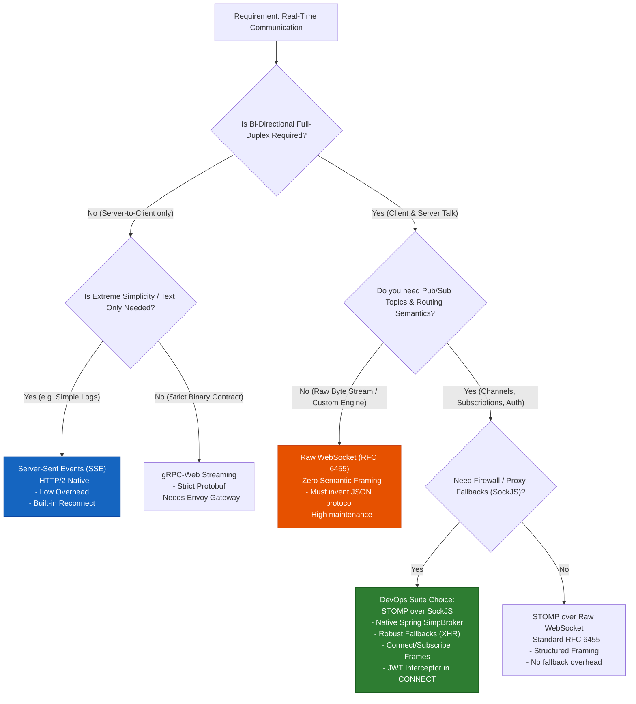
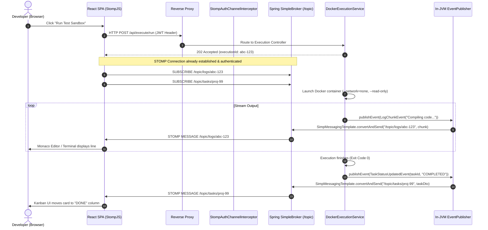
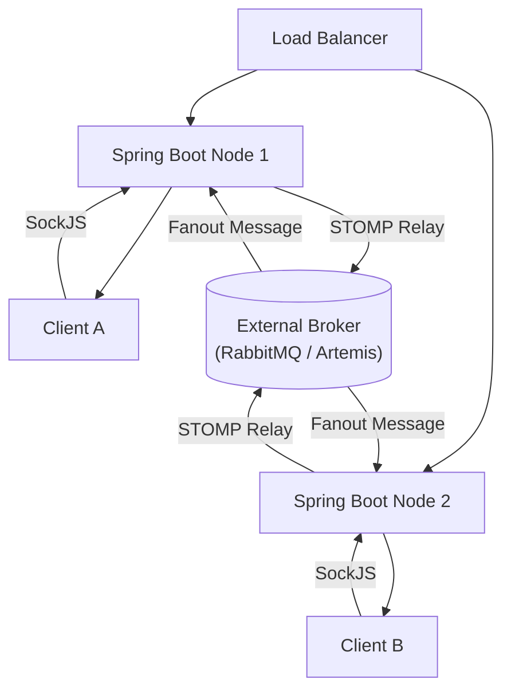

# Real-Time Protocols: STOMP over SockJS vs Alternatives

## Architectural Overview & Protocol Landscape

Real-time, event-driven web communication requires pushing state updates from servers to connected clients with sub-second latencies. In **DevOps Suite**, the system orchestrates asynchronous build executions, ephemeral Docker test sandboxes, multi-user Kanban board collaboration, and real-time container log streaming. 

Architecting the communication layer requires balancing protocol overhead, browser network constraints, intermediary firewall/proxy traversal, operational complexity, and alignment with the backend framework ecosystem (**Spring Boot 3 / Java 21**).

```
+----------------------------------------------------------------------------------------------------+
|                                    Client Tier (React 18 SPA)                                      |
|                       [Monaco Editor]    [Kanban Board]    [Toast Notification]                    |
+----------------------------------------------------------------------------------------------------+
                                      |                    ^
              WebSocket / SockJS Handshake (HTTP Upgrade)  | Real-Time Frames
                                      v                    |
+----------------------------------------------------------------------------------------------------+
|                               Reverse Proxy / Gateway (Nginx / Cloudflare)                         |
|                       HTTP/1.1 Upgrade: websocket | Connection: Upgrade                            |
+----------------------------------------------------------------------------------------------------+
                                      |
                                      v
+----------------------------------------------------------------------------------------------------+
|                                Spring Boot 3 Monolith (:8081)                                      |
|  +----------------------------------------------------------------------------------------------+  |
|  | WebSocket Endpoint: /ws (SockJS Fallbacks: xhr-streaming, xhr-polling)                       |  |
|  +----------------------------------------------------------------------------------------------+  |
|  | StompAuthChannelInterceptor (JWT Bearer Validation on STOMP CONNECT frame)                   |  |
|  +----------------------------------------------------------------------------------------------+  |
|  | In-Memory SimpleBroker (/topic)                                                               |  |
|  |   - /topic/notifications/{userId}  (Toast notifications)                                     |  |
|  |   - /topic/tasks/{projectId}        (Live Kanban task mutations)                              |  |
|  |   - /topic/logs/{projectId}         (Container execution log output)                          |  |
|  +----------------------------------------------------------------------------------------------+  |
|  | SimpMessagingTemplate (In-JVM Event Emitters via ApplicationEventPublisher)                  |  |
+----------------------------------------------------------------------------------------------------+
```

---

## Protocol Deep-Dive & Comparative Mechanics

Choosing the right transport layer dictates how connections are established, how proxies buffer data, and how message boundaries are parsed.

### 1. HTTP Long-Polling
* **Mechanism**: The client issues a standard HTTP request (`GET /poll`). The server holds the request open until new data arrives or a timeout (e.g., 30s) triggers. When data is returned or a timeout occurs, the HTTP connection closes, and the client immediately issues a new HTTP request.
* **Overhead**: High. Every message cycle incurs full HTTP/1.1 header overhead (typically 500–1500 bytes per round-trip for cookies, user-agent, TLS session establishment).
* **Latency**: High relative to persistent streams due to TCP re-handshakes and TLS session resumption overhead when connections drop.
* **Proxy Friendliness**: Excellent. Works through every strict corporate proxy, deep packet inspector (DPI), and HTTP cache since it is vanilla HTTP.

### 2. Server-Sent Events (SSE)
* **Mechanism**: Defined in HTML5 (`EventSource` API). A single persistent HTTP GET connection with `Content-Type: text/event-stream`. The connection remains open indefinitely, allowing the server to stream UTF-8 text lines structured as:
  ```http
  event: log_line
  data: {"projectId":"c9a2","msg":"Container starting..."}
  id: 1042
  retry: 5000

  ```
* **Directionality**: **Unidirectional (Server-to-Client only)**. If the client needs to reply or acknowledge, it must issue separate HTTP POST/PUT requests.
* **Overhead**: Extremely low. 2–8 bytes per chunk delimiter (`data: ...\n\n`).
* **Transport**: Built over HTTP/1.1 or HTTP/2. Under HTTP/2, multiplexing allows hundreds of SSE streams over a single TCP connection, eliminating the browser HTTP/1.1 6-connections-per-domain limit.
* **Reconnection**: Native automatic reconnection and event resumption via the `Last-Event-ID` header.

### 3. Raw WebSockets (RFC 6455)
* **Mechanism**: Initiated via an HTTP/1.1 handshake request containing `Upgrade: websocket` and `Connection: Upgrade`. Once the server responds with `101 Switching Protocols`, the underlying TCP socket remains open as a bi-directional, full-duplex message channel.
* **Framing**: Operates at the transport framing level. Frames feature minimal overhead (2 to 10 bytes framing header plus optional 4-byte client masking key). Supports both text (UTF-8) and raw binary (`0x02`) frames.
* **Semantics**: **Raw byte/text stream**. RFC 6455 provides zero application-level semantics:
  * No concept of channels, topics, or message routing.
  * No standard message headers (no `Authorization`, `content-type`, or `destination`).
  * Developers must invent an ad-hoc JSON framing layer (`{"action":"subscribe","channel":"xyz"}`).

### 4. STOMP over SockJS (Simple Text Oriented Messaging Protocol)
* **Mechanism**: STOMP is a frame-based wire protocol (modeled on HTTP semantics) layered on top of a WebSocket or SockJS transport.
* **Frame Anatomy**:
  ```text
  COMMAND
  header1:value1
  header2:value2

  Body Content^@
  ```
  *(Terminated by a null byte `^@` / `\u0000`)*.
* **SockJS Fallback Engine**: If corporate proxies, antivirus software, or outdated firewalls drop WebSocket handshakes (e.g., stripping `Upgrade` headers), SockJS transparently cascades through fallback transports:
  1. WebSocket (RFC 6455)
  2. XHR-Streaming
  3. XHR-Polling / JSONP-Polling
* **Routing**: Provides native Pub/Sub primitives: `CONNECT`, `SUBSCRIBE`, `UNSUBSCRIBE`, `SEND`, `MESSAGE`, and `ACK`.

### 5. gRPC Web / gRPC Streaming
* **Mechanism**: Binary RPC protocol based on Protocol Buffers (Protobuf) over HTTP/2. While native gRPC supports full duplex client/server streaming, web browsers cannot directly trigger raw HTTP/2 frames via JavaScript `fetch()`. Browsers require **gRPC-Web**, which proxies requests through Envoy or uses special base64-encoded frame wrappers over fetch/XHR streams.
* **Overhead**: Minimum wire payload (binary Protobuf serialization), but requires code generation (`protoc`), gateway proxies (Envoy), and complex client tooling.

---

## Protocol Comparison Matrix

| Feature / Dimension | HTTP Long-Polling | Server-Sent Events (SSE) | Raw WebSocket (RFC 6455) | STOMP over SockJS | gRPC-Web Streaming |
| :--- | :--- | :--- | :--- | :--- | :--- |
| **Directionality** | Simplex (poll-based) | Unidirectional (Server → Client) | Full Duplex (Bi-directional) | Full Duplex (Bi-directional) | Server-Streaming (Duplex requires gRPC-Web proxy) |
| **Wire Protocol Overhead** | Heavy (~500B–1KB per poll) | Minimal (few bytes prefix) | Ultra-light (2–14 bytes frame) | Light (STOMP frame headers) | Minimal (Binary Protobuf) |
| **Framing & Semantics** | HTTP Request / Response | Text lines (`data: \n\n`) | None (Raw payload) | Pub/Sub (`SEND`, `SUBSCRIBE`) | Strongly typed Protobuf contracts |
| **Browser Support** | 100% (Legacy to modern) | 98% (Native `EventSource`) | 98% (RFC 6455) | 100% (via SockJS fallbacks) | Requires gRPC-web runtime client |
| **Proxy / Firewall Traversal**| 100% (Standard HTTP) | Excellent (HTTP/1.1 or H2) | Moderate (DPI / Proxies drop `Upgrade`) | 100% (Graceful downgrade to XHR) | Requires Envoy / H2 reverse proxy |
| **Reconnection Support** | Manual client loop | Built-in (`Last-Event-ID`) | Manual JS reconnect logic | Managed by `@stomp/stompjs` + SockJS | Manual client retry loop |
| **Multiplexing / Topics** | Manual URL endpoints | Client event name matching | Custom JSON protocol required | Native Pub/Sub destination matching | Native RPC method routing |
| **Binary Data Support** | Base64 or Blob | Base64 string encoding only | Native binary frames (`ArrayBuffer`) | Text-oriented (Base64 payload in frame) | Native binary |
| **Spring Boot 3 Support** | DeferredResult / Callable | `SseEmitter` | `WebSocketHandler` | `spring-messaging` + `@MessageMapping` | Requires third-party gRPC starter |

---

## Mermaid Protocol Trade-off Comparison



---

## Architectural Decision Record (ADR): Why DevOps Suite Selected STOMP over SockJS

### Context & Requirements
DevOps Suite is an enterprise-grade platform handling multiple distinct real-time streams:
1. **Toast Notifications** (`/topic/notifications/{userId}`): Targeted per-user alerts triggered by background build completions, failures, or assignment changes.
2. **Kanban Board Sync** (`/topic/tasks/{projectId}`): Multi-user live updates when tasks change columns, priority, or assignees.
3. **Execution Sandbox Logs** (`/topic/logs/{projectId}`): Streaming stdout/stderr output from Docker containers executing untrusted code sandboxes.

### The Trade-off: SSE vs. STOMP
An architectural question often arises: *Why not use Server-Sent Events (SSE) for log streaming and toast notifications, since logs are unidirectional from server to client?*

```
+----------------------------------------------------------------------------------------------------+
|                                    Alternative 1: Hybrid Architecture                              |
|                                                                                                    |
|  [React Client] ----(SSE /api/logs/{id})---------------------> Spring Boot SseEmitter             |
|  [React Client] ----(SSE /api/notifications)-----------------> Spring Boot SseEmitter             |
|  [React Client] <---(Raw WS /ws/tasks/{id})------------------> Spring Boot WebSocketHandler        |
|                                                                                                    |
|  Drawback: Multiple open TCP connections per user; dual authentication implementations;           |
|            inconsistent error handling; browser connection pool saturation under HTTP/1.1.         |
+----------------------------------------------------------------------------------------------------+
                                                vs.
+----------------------------------------------------------------------------------------------------+
|                                DevOps Suite: Unified Multiplexed STOMP                             |
|                                                                                                    |
|  [React Client]                                              Spring Boot SimpleBroker              |
|        |                                                                |                          |
|        +===[ Single WebSocket / SockJS Connection: /ws ]===============>+                          |
|             |-- SUBSCRIBE /topic/notifications/{userId} ------------->  |                          |
|             |-- SUBSCRIBE /topic/tasks/{projectId} ------------------>  |                          |
|             |-- SUBSCRIBE /topic/logs/{projectId} ------------------->  |                          |
|                                                                                                    |
|  Benefit: Exactly ONE persistent connection per client; single auth filter; unified keepalive.     |
+----------------------------------------------------------------------------------------------------+
```

### Architectural Decisions

#### 1. Unified Connection vs. Multi-Socket Contention
Using SSE for logs and WebSockets for Kanban would force the browser to maintain multiple persistent connections. Under HTTP/1.1 proxies, browsers enforce a strict limit of **6 concurrent connections per domain**. If a developer opens three project tabs, running 2 SSE streams plus a WebSocket would completely exhaust available sockets, starving all standard REST API requests (`/api/projects`, `/api/auth`).
*STOMP allows complete multiplexing of multiple topics over a single persistent TCP connection.*

#### 2. Standardized Message Framing & Topic Routing
Raw WebSockets lack routing semantics. If we used raw WebSockets, the engineering team would have to reinvent:
* Message packet formatting: `{"type": "SUBSCRIBE", "destination": "/topic/logs/1"}`.
* Client-side dispatcher loops to route inbound JSON messages to React components.
* Heartbeat/keepalive mechanisms to detect half-open sockets.

STOMP provides standard framing (`CONNECT`, `SUBSCRIBE`, `UNSUBSCRIBE`, `SEND`, `MESSAGE`, `RECEIPT`, `ERROR`). The frontend leverages `@stomp/stompjs` to subscribe cleanly:
```javascript
// frontend/src/services/websocketService.js
export const subscribe = (destination, callback) => {
  return stompClient.subscribe(destination, (message) => {
    callback(JSON.parse(message.body));
  });
};
```

#### 3. Deep Integration with Spring Boot 3 Messaging
Spring Framework provides first-class support for STOMP via `spring-messaging`:
* `SimpMessagingTemplate.convertAndSend("/topic/tasks/" + projectId, updateDto)` broadcasts across the in-memory `SimpleBroker`.
* In-JVM Spring Events (`@EventListener` or `ApplicationEventPublisher`) integrate seamlessly without building custom socket mapping tables (`ConcurrentHashMap<SessionId, WebSocketSession>`).

#### 4. Clean Security Boundary via Channel Interceptors
WebSocket handshakes occur via standard HTTP `GET /ws`, where browsers do not permit adding custom headers like `Authorization: Bearer <jwt>` to native `new WebSocket(url)` constructors. 
Passing JWTs as URL query parameters (`/ws?token=eyJ...`) introduces severe security vulnerabilities (tokens leak into access logs, browser history, reverse proxy access logs, and referrer headers).

With STOMP, the HTTP handshake is allowed unauthenticated (`permitAll`), and the JWT is passed inside the STOMP `CONNECT` frame header:
```javascript
// frontend/src/services/websocketService.js
stompClient = new Client({
  webSocketFactory: () => new SockJS(`${WS_URL}`),
  connectHeaders: {
    Authorization: `Bearer ${token}`,
  },
  reconnectDelay: 5000,
  heartbeatIncoming: 4000,
  heartbeatOutgoing: 4000,
});
```

This is intercepted cleanly in Spring Boot via [`StompAuthChannelInterceptor`](file:///d:/Projects/DevOps%20Suite/backend/src/main/java/com/devopssuite/notification/security/StompAuthChannelInterceptor.java#L43-L85):
```java
// backend/src/main/java/com/devopssuite/notification/security/StompAuthChannelInterceptor.java
@Override
public Message<?> preSend(Message<?> message, MessageChannel channel) {
    StompHeaderAccessor accessor = MessageHeaderAccessor.getAccessor(message, StompHeaderAccessor.class);
    if (accessor != null && StompCommand.CONNECT.equals(accessor.getCommand())) {
        String token = extractToken(accessor);
        if (token == null || !jwtUtils.validateToken(token) || isBlacklisted(token)) {
            throw new MessagingException("Unauthorized STOMP connection");
        }
        accessor.setUser(new StompPrincipal(jwtUtils.getUserIdFromToken(token)));
    }
    return message;
}
```

---

## Detailed Message Flow: End-to-End Execution & Broadcast

The following sequence diagram illustrates how an asynchronous Docker container run pushes log output and task state updates across the STOMP channel to connected React clients.



---

## Real-Time System Interview Questions & Answers

### 🟢 Basic Concepts

#### Q1: What is the fundamental difference between WebSocket and HTTP/1.1?
**Answer:**
HTTP/1.1 is a request-response, half-duplex protocol. The client must always initiate communication, and the server can only respond once per request. While HTTP/1.1 supports persistent TCP connections (`Keep-Alive`), the server cannot push unsolicited messages to the client.

WebSocket (RFC 6455) is an independent, bidirectional, full-duplex protocol initiated over an HTTP handshake (`Upgrade: websocket`). After a `101 Switching Protocols` response, the underlying TCP connection remains open. Both client and server can transmit binary or UTF-8 text frames at any time with minimal header overhead (2 to 14 bytes per frame vs. hundreds of bytes of HTTP headers).

#### Q2: What is STOMP, and why can't you just use plain WebSockets in a large production system?
**Answer:**
WebSocket is a **transport-level** standard. It defines how bytes and text frames travel across a TCP socket, but defines **no application semantics**. It does not specify:
1. Where messages should go (no topic or destination address).
2. What format the payload is in (JSON, Protobuf, XML).
3. How to subscribe or unsubscribe from specific event categories.
4. How to authenticate frames after the connection is opened.

STOMP (Simple Text Oriented Messaging Protocol) is an **application sub-protocol** running on top of WebSockets. It defines frame structures (`CONNECT`, `SUBSCRIBE`, `SEND`, `MESSAGE`, `DISCONNECT`) and destination headers (`destination: /topic/tasks`). Without STOMP, teams must invent their own custom JSON protocol for routing, subscriptions, and heartbeats, leading to fragmented architectures and custom client-server parsing logic.

#### Q3: How does Server-Sent Events (SSE) differ from WebSockets? When would you prefer SSE?
**Answer:**
* **Directionality**: SSE is strictly unidirectional (Server $\rightarrow$ Client). WebSockets are full-duplex bi-directional.
* **Transport**: SSE runs over standard HTTP (`Content-Type: text/event-stream`). WebSockets upgrade out of HTTP into RFC 6455 framing.
* **Multiplexing**: Under HTTP/2, multiple SSE streams can share a single TCP connection natively.
* **Reconnection**: SSE browsers automatically reconnect and send the `Last-Event-ID` header, enabling the server to resume missed events. WebSockets require manual client-side reconnection logic.
* **Best Use Case for SSE**: Read-only event streams like real-time stock tickers, simple CI/CD build log viewers, and LLM text generation streaming.

---

### 🟡 Intermediate Architecture

#### Q4: Why did DevOps Suite adopt SockJS instead of bare WebSockets? What exact problem does SockJS solve?
**Answer:**
While modern browsers support RFC 6455 WebSockets, real-world network paths between clients and servers contain intermediaries:
1. **Corporate Firewalls & Transparent Proxies**: Many corporate packet filters block or strip the `Upgrade: websocket` header, causing handshake failure.
2. **Strict Cloud / Edge Proxies**: Certain edge proxies buffering HTTP/1.1 traffic drop open TCP tunnels that do not emit standard HTTP chunked responses.
3. **SSL/TLS Termination**: Antivirus software inspecting port 80/443 may abort non-HTTP traffic.

**SockJS** acts as an abstraction layer. It tests the connection using an initial HTTP handshake (`GET /ws/info`). If raw WebSocket transport is unavailable or blocked, it transparently falls back through alternate HTTP streaming and polling protocols:
1. `websocket`
2. `xhr-streaming` (chunked HTTP transfer)
3. `xdr-streaming` (cross-domain streaming for legacy engines)
4. `xhr-polling` (periodic short HTTP polls)

In DevOps Suite, `registry.addEndpoint("/ws").withSockJS()` guarantees that enterprise engineers behind restrictive corporate VPNs can still interact with real-time logs and Kanban updates.

#### Q5: How is authentication handled in WebSocket/STOMP applications, and why is sending JWTs in URL query parameters an anti-pattern?
**Answer:**
The standard browser `WebSocket` API does not allow custom headers during the initial HTTP handshake:
```javascript
// Not supported by the browser W3C WebSocket API:
new WebSocket('wss://example.com/ws', { headers: { Authorization: 'Bearer ...' } });
```

**Why URL Query Parameters (`/ws?token=...`) are dangerous:**
1. **Access Log Exposure**: Query strings are written in plaintext to reverse proxy logs (Nginx, HAProxy), AWS CloudWatch, and browser history.
2. **Referrer Leakage**: If the page loads external resources, the URL with the token may be sent in the `Referer` header.
3. **Browser Caching**: URLs can be cached in browser internal state and proxy caches.

**DevOps Suite Solution:**
1. Permit the HTTP handshake endpoint `/ws/**` without authentication in Spring Security.
2. Pass the JWT inside the STOMP `CONNECT` frame header:
   ```text
   CONNECT
   accept-version:1.1,1.2
   heart-beat:4000,4000
   Authorization:Bearer eyJhbGciOi...
   ^@
   ```
3. Intercept the inbound message channel using Spring's `ChannelInterceptor` (`StompAuthChannelInterceptor`), validate the token, check the Redis revocation blacklist (`blacklist:<token>`), and set the authenticated `Principal` on the session.

#### Q6: How do heartbeats work in STOMP, and why are they critical for production WebSocket connections?
**Answer:**
A TCP connection can enter a **half-open state** where one end terminates (e.g., laptop lid closes, Wi-Fi drops, NAT router resets) without sending a TCP `FIN` or `RST` packet. Without application-level heartbeats:
* The server continues holding open socket descriptors, thread state, and memory for a dead client.
* Intermediary NAT gateways and firewalls silently drop idle connections after 30–60 seconds of inactivity.

STOMP solves this during the `CONNECT` negotiation:
```text
heart-beat:<cx>,<cy>
```
* `cx`: Client promises to send heartbeats every $cx$ milliseconds.
* `cy`: Client expects heartbeats from the server every $cy$ milliseconds.

In DevOps Suite's `websocketService.js`:
```javascript
heartbeatIncoming: 4000,
heartbeatOutgoing: 4000,
```
Every 4 seconds, if no message has been sent, the client and server exchange a single newline character (`\n`). If no packet arrives within $2 \times \text{interval}$, the connection is declared dead, the socket is recycled, and auto-reconnect logic kicks in.

---

### 🔴 Advanced Engineering

#### Q7: In DevOps Suite, why was log streaming unified into STOMP rather than separated into an SSE endpoint (`/api/logs/{projectId}`)? Analyze the operational trade-offs.
**Answer:**
**The Case for SSE:**
Container log streaming is strictly unidirectional (Execution engine $\rightarrow$ Browser Monaco viewer). An SSE endpoint using Spring's `SseEmitter` would eliminate STOMP header parsing overhead and leverage HTTP/2 native framing.

**Why Unified STOMP was Chosen:**
1. **Browser Connection Exhaustion (HTTP/1.1 Fallback)**: Under HTTP/1.1 (standard in many on-prem enterprise deployments), browsers limit concurrent connections to 6 per domain. If a user has 3 tabs open, each tab having 1 notification stream, 1 log stream, and 1 Kanban stream would require $3 \times 3 = 9$ persistent connections, causing request blocking. Multiplexing everything over a single STOMP socket uses exactly **1 connection per tab**.
2. **Consolidated Security Architecture**: Instead of maintaining two security pipelines (one for HTTP SSE handling `Last-Event-ID` + Bearer headers in standard filters, and one for STOMP channel interceptors), all real-time events pass through a single, audited `StompAuthChannelInterceptor` with unified Redis blacklist verification.
3. **Symmetric Architecture**: Using a single messaging abstraction (`SimpMessagingTemplate.convertAndSend()`) across notification, project, and execution packages simplifies backend architecture. Developers emit domain events (`LogChunkEvent`, `TaskStatusUpdatedEvent`) handled by a single transport layer.

**Trade-offs Accepted:**
* Higher wire framing overhead (STOMP headers vs. raw SSE `data:` prefix).
* STOMP requires text framing; raw binary container streams must be string-decoded (UTF-8) before framing.

#### Q8: How do you scale Spring Boot STOMP WebSockets horizontally across multiple nodes when using an in-memory SimpleBroker vs. an external message broker?
**Answer:**
In DevOps Suite's baseline configuration, `registry.enableSimpleBroker("/topic")` uses an **in-memory** message broker. 

```
                                  +-------------------+
                                  | Load Balancer     |
                                  | (Sticky Sessions) |
                                  +---------+---------+
                                            |
                       +--------------------+--------------------+
                       |                                         |
                       v                                         v
            +---------------------+                   +---------------------+
            | Spring Boot Node 1  |                   | Spring Boot Node 2  |
            | - Client A (/topic) |                   | - Client B (/topic) |
            | - SimpleBroker (RAM)|                   | - SimpleBroker (RAM)|
            +---------------------+                   +---------------------+
                       |                                         |
                       X -- No communication between brokers --  X
            (Client A never receives events published on Node 2!)
```

**The Multi-Node Problem:**
If Node 1 holds Client A's connection, and a background task runs on Node 2:
Node 2 calls `messagingTemplate.convertAndSend("/topic/tasks/1", dto)`. Because `SimpleBroker` lives solely in Node 2's JVM heap, Client A connected to Node 1 never receives the event.

**The Solution: Full External Message Broker (RabbitMQ / ActiveMQ Artemis)**
Spring provides `enableStompBrokerRelay("/topic")`:
```java
@Override
public void configureMessageBroker(MessageBrokerRegistry registry) {
    registry.enableStompBrokerRelay("/topic")
            .setRelayHost("rabbitmq.internal")
            .setRelayPort(61613)
            .setClientLogin("guest")
            .setClientPasscode("guest");
    registry.setApplicationDestinationPrefixes("/app");
}
```
1. Spring Boot acts as a STOMP relay/proxy.
2. When Client A subscribes to `/topic/tasks/1`, Spring forwards a STOMP `SUBSCRIBE` frame to the shared RabbitMQ cluster.
3. When Node 2 publishes an update, it sends a STOMP `SEND` frame to RabbitMQ.
4. RabbitMQ distributes the message to all Spring nodes holding active subscriptions for `/topic/tasks/1`.



#### Q9: How do you prevent memory leaks and thread exhaustion in Spring Boot when handling high-throughput log streaming over WebSockets?
**Answer:**
High-frequency log output (e.g., a sandbox container emitting 10,000 log lines per second during a maven build) can overwhelm the WebSocket channel and cause OutOfMemoryErrors (OOM).

**Failure Modes:**
1. **Buffer Bloat**: Inbound and outbound message channels in Spring use internal `MessageChannel` queues (`ExecutorSubscribableChannel`). If the client network is slow, unconsumed messages accumulate in memory.
2. **Thread Contention**: If log emitting code calls `convertAndSend()` synchronously on the application worker thread, blocking on slow client writes exhausts thread pools.

**Mitigation Strategies:**
1. **Batching / Throttling**: Instead of sending each log line individually, buffer lines into chunks (e.g., flush every 50ms or every 100 lines) before broadcasting:
   ```java
   // In container log pump
   List<String> buffer = new ArrayList<>();
   if (buffer.size() >= 100 || System.currentTimeMillis() - lastFlush > 50) {
       messagingTemplate.convertAndSend("/topic/logs/" + execId, String.join("\n", buffer));
       buffer.clear();
   }
   ```
2. **Channel Buffer Limits**: Configure outbound channel message limits and disconnect lagging clients:
   ```java
   @Override
   public void configureWebSocketTransport(WebSocketTransportRegistration registration) {
       registration.setSendTimeLimit(15 * 1000)
                   .setSendBufferSizeLimit(512 * 1024) // 512 KB per connection
                   .setMessageSizeLimit(128 * 1024);
   }
   ```
3. **Reactive Backpressure**: Under extreme scale, migrate log streaming to Project Reactor / RSocket, applying reactive backpressure (`Flux.limitRate()`) to pause container stdout reading when downstream consumer buffers fill.

---

### ⚫ Expert & System Architecture

#### Q10: Solve the C10K / C1000K problem for a real-time WebSocket platform. How does the Linux kernel, JVM runtime, and network stack limit concurrent persistent connections, and how do you optimize for 1,000,000 concurrent sockets?
**Answer:**

Scaling persistent connections to 1,000,000 concurrent connections ($C1000K$) shifts bottlenecks from CPU throughput to OS kernel file descriptors, memory per socket, and thread models.

```
+----------------------------------------------------------------------------------------------------+
|                                    1,000,000 Concurrent Connections                                |
|                                                                                                    |
|  1. File Descriptors:     fs.file-max >= 2,000,000; ulimit -n 1,048,576                            |
|  2. TCP Buffer Memory:    net.ipv4.tcp_rmem = "4096 87380 16777216" -> Reduce min to 2048/4096    |
|                           (1M sockets * 16KB min buffer = ~16 GB RAM just for OS network buffers!) |
|  3. Conntrack Table:      net.netfilter.nf_conntrack_max >= 1,500,000                              |
|  4. Threading Model:      EPoll / KQueue Non-Blocking I/O (Netty). Never 1 Thread Per Socket!      |
|  5. JVM Memory:           Off-heap Netty ByteBuf pools + Java 21 Virtual Threads                   |
+----------------------------------------------------------------------------------------------------+
```

##### 1. OS & Kernel Tuning (`/etc/sysctl.conf`):
* **File Descriptors**: Each TCP socket is a file descriptor.
  ```bash
  fs.file-max = 2097152
  # In /etc/security/limits.conf
  * soft nofile 1048576
  * hard nofile 1048576
  ```
* **Ephemeral Ports & Port Exhaustion**: A single client IP to a single server IP/port is bound by 65,535 TCP ports. To handle 1M connections into a cluster, deploy multiple VIPs (Virtual IPs) on load balancers or use multiple listener ports.
* **TCP Window Memory Tuning**:
  ```bash
  net.ipv4.tcp_rmem = 4096 87380 4194304
  net.ipv4.tcp_wmem = 4096 65536 4194304
  net.ipv4.tcp_mem  = 786432 1048576 1572864
  ```
  Lowering the minimum buffer size (`4096` bytes) prevents the kernel from exhausting RAM on idle connections.
* **Connection Tracking**: NAT gateways track connections via `nf_conntrack`. If this table overflows, connections drop silently:
  ```bash
  net.netfilter.nf_conntrack_max = 2000000
  ```

##### 2. JVM & Framework Architecture:
* **Thread Model**: Traditional Tomcat/Servlet threading models assign one thread per request/connection. 1,000,000 threads with 1MB stack size ($Xss$) would require 1TB of RAM just for thread stacks.
* **Netty / Project Reactor (NIO)**: WebSocket connections must terminate on an event-driven, non-blocking I/O loop (`epoll` on Linux). A small thread pool (e.g., $2 \times \text{CPU cores}$) manages all 1,000,000 socket descriptors using I/O multiplexing.
* **Java 21 Virtual Threads**: In Spring Boot 3, configuring virtual threads (`spring.threads.virtual.enabled=true`) allows blocking calls inside message handlers without exhausting OS platform threads, though the underlying WebSocket transport must remain event-loop driven.

#### Q11: Analyze the mobile performance impact (Battery Drainage, Radio State Transitions, and Bandwidth) of real-time protocols. How do STOMP heartbeats impact mobile devices compared to Web Push (FCM/APNs)?
**Answer:**

Maintaining a persistent WebSocket connection on mobile devices has severe battery and radio resource consequences compared to desktop environments.

##### 1. Cellular Radio Power States (RRC State Machine):
A mobile cellular modem (LTE/5G) operates in three Radio Resource Control (RRC) power states:
1. **RRC Idle**: Lowest power state. Zero active radio power consumption.
2. **RRC Connected / Continuous Reception**: Highest power state (~1.2W–2.0W). Maximum battery draw.
3. **RRC Inactive / Short Discontinuous Reception (DRX)**: Intermediate tail state.

```
       [ Packet Sent / Received ]
  +-----------------------------------+
  |                                   v
[RRC Idle] --------> [RRC Connected (High Power: ~1.5W)]
  ^                                   |
  | Inactivity Timer Expires (10-15s) | Tail Drop
  +---------------- [RRC Inactive] <--+
```

##### 2. The Heartbeat Battery Trap:
In DevOps Suite, `websocketService.js` configures:
```javascript
heartbeatIncoming: 4000,
heartbeatOutgoing: 4000
```
* Every 4 seconds, a heartbeat packet traverses the cellular network.
* The mobile radio switches from **Idle** to **Connected** (taking ~100–200ms).
* After transmitting the packet, the radio enters an inactivity tail state for **10 to 15 seconds** before it can return to Idle.
* **Result**: Because the heartbeat interval (4s) is shorter than the radio inactivity tail (10–15s), **the cellular modem never returns to sleep**. The mobile battery drains rapidly within a few hours even if the phone screen is off.

##### 3. Architectural Solution for Mobile Clients:
* **Background Mode vs Foreground Mode**: When the web application or mobile client moves to the background, **immediately sever the WebSocket connection**.
* **Transition to Push Notifications**: Offload real-time background notifications to Apple Push Notification service (APNs) or Firebase Cloud Messaging (FCM). APNs/FCM multiplex all app notifications over a single, OS-managed persistent connection optimized for mobile power states.
* **Dynamic Heartbeat Negotiation**: If WebSockets must stay connected on mobile devices, increase heartbeat intervals to 30–60 seconds, or dynamically adapt heartbeats using cellular network carrier NAT timeout detection.

---

## Quick Reference Summary Table

| Category | Architectural Choice in DevOps Suite | Primary Justification | Failure Mode / Fallback |
| :--- | :--- | :--- | :--- |
| **Transport Protocol** | STOMP over SockJS | Multiplexed Pub/Sub destinations over a single socket; automatic downgrade for restrictive corporate firewalls. | Gracefully degrades from RFC 6455 WebSocket to `xhr-streaming` and `xhr-polling`. |
| **Security Mechanism** | Native STOMP `CONNECT` header (`Authorization: Bearer <token>`) validated via `StompAuthChannelInterceptor`. | Prevents token leakage in URL query parameters and access logs; enforces Redis token blacklist checks. | Frame rejected with `MessagingException`, closing the STOMP session immediately. |
| **Broker Engine** | Spring `SimpleBroker` (In-Memory) | Zero infrastructure overhead for single-node monolith; direct integration with `ApplicationEventPublisher`. | Does not scale multi-node without migration to external broker relay (RabbitMQ / ActiveMQ). |
| **Heartbeat Cadence** | 4000ms incoming / 4000ms outgoing | Rapid detection of half-open TCP connections and proxy timeout mitigation. | High mobile battery consumption if kept active in background tabs. |
| **Destinations** | `/topic/notifications/{userId}`<br>`/topic/tasks/{projectId}`<br>`/topic/logs/{projectId}` | Clear separation of concerns; clean integration with `@stomp/stompjs` client subscriptions. | Client must subscribe explicitly after `onConnect` callback fires. |
