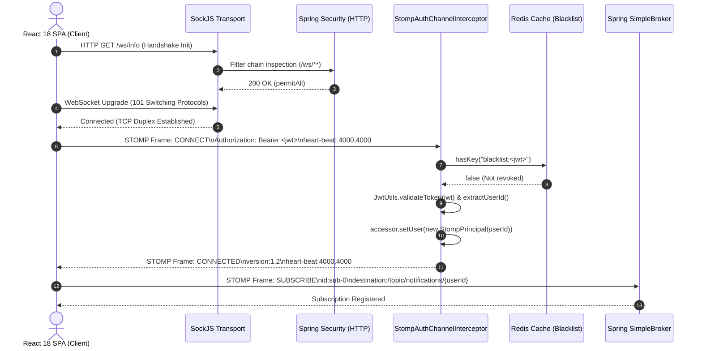
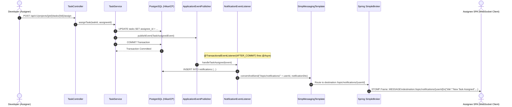

# Real-Time WebSocket & STOMP Architecture: Enterprise Guide

## 1. Executive Architecture Overview

Real-time communication in **DevOps Suite** powers mission-critical interactive features:
1. **Instant User Notifications** (`/topic/notifications/{userId}`): Pipeline status changes, task assignments, role modifications, and system alerts delivered without polling.
2. **Collaborative Kanban Task Updates** (`/topic/tasks/{projectId}`): Multi-user board state synchronization, drag-and-drop column transitions, and task priority alterations.
3. **Live Log Streaming** (`/topic/logs/{projectId}`): Real-time stdout/stderr streams from isolated Docker execution sandboxes and CI/CD build scripts directly into the Monaco Editor and terminal consoles.

The real-time subsystem is implemented using **STOMP (Simple Text Oriented Messaging Protocol)** layered on top of **WebSocket** transport, backed by **SockJS** fallback emulations in Spring Boot 3 (Java 21).

### Architectural Topology

```
+----------------------------------------------------------------------------------------------------+
|                                         CLIENT BROWSER (React 18 SPA)                              |
|                                                                                                    |
|  [ WebSocketContext / useWebSocket ] <----+                                                        |
|                 |                         |                                                        |
|                 v                         |                                                        |
|       [ websocketService.js ]             |                                                        |
|                 |                         |                                                        |
|        STOMP Client (@stomp/stompjs)      | State Sync (connected, reconnecting)                   |
|                 |                         |                                                        |
|                 v                         |                                                        |
|        SockJS Client (Fallback Transport) |                                                        |
+-----------------|-------------------------|--------------------------------------------------------+
                  | HTTP Upgrade / WS Frame |
                  | Headers: Bearer <JWT>   |
                  v                         |
+-------------------------------------------|--------------------------------------------------------+
|                                    SPRING BOOT 3 GATEWAY / BACKEND                                 |
|                                                                                                    |
|  1. HTTP Handshake: /ws (SockJS info, xhr-streaming, or WebSocket upgrade) -> permitAll           |
|                                                                                                    |
|  2. STOMP CONNECT Frame Processing:                                                                |
|     `StompAuthChannelInterceptor` (Client Inbound Channel)                                         |
|      +-- Extract `Authorization: Bearer <token>` from Native Headers                               |
|      +-- Redis Blacklist Verification (`blacklist:<token>`)                                       |
|      +-- JWT Signature & Expiration Validation (`JwtUtils`)                                        |
|      +-- Attach `StompPrincipal(userId)` to Message Session Header                                 |
|                                                                                                    |
|  3. Message Broker Layer:                                                                          |
|     +-------------------------------------------------------------------------------------------+  |
|     |                         Spring SimpleBroker (In-Memory Message Broker)                    |  |
|     |                                                                                           |  |
|     |   Registered Destinations:                                                                |  |
|     |   ├── /topic/notifications/{userId}  --> Filtered / Private Notifications                 |  |
|     |   ├── /topic/tasks/{projectId}        --> Team Board Fanout                               |  |
|     |   └── /topic/logs/{projectId}         --> Live Container Exec Logs                        |  |
|     |                                                                                           |  |
|     |   Application Destination Prefix: /app (Client -> Server RPC/Commands)                    |  |
|     +-------------------------------------------------------------------------------------------+  |
|                                     ^                                                              |
|                                     | SimpMessagingTemplate.convertAndSend()                       |
|                                     |                                                              |
|  4. Internal Services & Domain Events:                                                             |
|     +-------------------------------------------------------------------------------------------+  |
|     |  - NotificationService (In-app alerts)                                                    |  |
|     |  - NotificationEventListener (@TransactionalEventListener(AFTER_COMMIT))                   |  |
|     |  - DockerExecutionEngine / SandboxService (Container stdout/stderr chunk streaming)       |  |
|     |  - TaskService / ProjectService (Kanban board mutation events)                            |  |
|     +-------------------------------------------------------------------------------------------+  |
+----------------------------------------------------------------------------------------------------+
```

---

## 2. Core Architectural Components

### 2.1 Why STOMP Over Pure WebSocket?

A raw WebSocket connection is merely a bidirectional, full-duplex TCP stream without an application-level semantics layer. Sending arbitrary raw text or binary data requires engineering custom framing protocols:
- Determining packet types (`SUBSCRIBE`, `UNSUBSCRIBE`, `MESSAGE`, `HEARTBEAT`).
- Parsing message boundaries, routing headers, and metadata.
- Correlating incoming and outgoing messages with specific user sessions and topics.

**STOMP (Simple Text Oriented Messaging Protocol)** introduces an interoperable frame-based wire protocol directly modeled after HTTP:

```http
COMMAND
header1:value1
header2:value2

Body content^@
```

Key STOMP frames utilized across DevOps Suite:
1. `CONNECT` / `STOMP`: Initiates the STOMP session over an active WebSocket/SockJS transport, transmitting credentials (`Authorization: Bearer <jwt>`).
2. `CONNECTED`: Broker acknowledgment confirming successful authentication, negotiated heartbeat intervals, and protocol version (`1.2`).
3. `SUBSCRIBE`: Client registers interest in a destination topic (e.g., `id:sub-0`, `destination:/topic/notifications/113ee6db...`).
4. `UNSUBSCRIBE`: Cancels an active subscription without closing the underlying WebSocket connection.
5. `SEND`: Client publishes a message to an application destination (`destination:/app/tasks/update`).
6. `MESSAGE`: Broker pushes payload down to subscribed clients matching the destination.
7. `DISCONNECT`: Graceful session termination.

### 2.2 SockJS Fallback Transport

Not all corporate networks, firewalls, and proxy servers permit raw WebSocket (`Upgrade: websocket`) TCP connections. Corporate proxies may inspect HTTP headers, drop long-lived unrecognized TCP connections, or fail to support HTTP/1.1 upgrade semantics.

**SockJS** provides a resilient abstraction:
1. **Initial Probing**: Sends an HTTP `GET /ws/info` request to retrieve server capabilities, WebSocket support flags, and entropy origins.
2. **Transport Hierarchy**:
   - Primary: Native **WebSocket**.
   - First Fallback: **HTTP Streaming** (`xhr-streaming`, `eventsource`).
   - Final Fallback: **HTTP Long Polling** (`xhr-polling`, `jsonp-polling`).
3. **Session Heartbeats**: Transmits raw frame comments (`h` frames) every 25 seconds if no payload is traversing the link to defeat proxy idle-timeout disconnections.

In `WebSocketConfig.java`, SockJS is activated via:
```java
registry.addEndpoint("/ws")
        .setAllowedOriginPatterns("http://localhost:5173", "http://localhost:*")
        .withSockJS();
```

---

## 3. Spring WebSocket Configuration & Broker Topology

### 3.1 Backend Configuration (`WebSocketConfig.java`)

DevOps Suite integrates Spring's messaging abstraction via `WebSocketMessageBrokerConfigurer`:

```java
package com.devopssuite.config;

import com.devopssuite.notification.security.StompAuthChannelInterceptor;
import lombok.RequiredArgsConstructor;
import org.springframework.context.annotation.Configuration;
import org.springframework.messaging.simp.config.ChannelRegistration;
import org.springframework.messaging.simp.config.MessageBrokerRegistry;
import org.springframework.web.socket.config.annotation.EnableWebSocketMessageBroker;
import org.springframework.web.socket.config.annotation.StompEndpointRegistry;
import org.springframework.web.socket.config.annotation.WebSocketMessageBrokerConfigurer;

@Configuration
@EnableWebSocketMessageBroker
@RequiredArgsConstructor
public class WebSocketConfig implements WebSocketMessageBrokerConfigurer {

    private final StompAuthChannelInterceptor stompAuthChannelInterceptor;

    @Override
    public void configureMessageBroker(MessageBrokerRegistry registry) {
        // Simple in-memory message broker routing prefixes
        registry.enableSimpleBroker("/topic");
        
        // Application destination prefix for incoming client-to-server messages
        registry.setApplicationDestinationPrefixes("/app");
    }

    @Override
    public void registerStompEndpoints(StompEndpointRegistry registry) {
        registry.addEndpoint("/ws")
                .setAllowedOriginPatterns("http://localhost:5173", "http://localhost:*")
                .withSockJS();
    }

    @Override
    public void configureClientInboundChannel(ChannelRegistration registration) {
        // Intercept all inbound client messages before passing to message channels
        registration.interceptors(stompAuthChannelInterceptor);
    }
}
```

### 3.2 Channel Architecture in Spring Messaging

Spring's message broker internally operates across distinct `MessageChannel` pipelines:

```
[Client WebSocket Frame]
          |
          v
[clientInboundChannel]  <--- Intercepted by StompAuthChannelInterceptor
          |
          +-----------------------+
          |                       |
          v                       v
[SimpleBrokerMessageHandler]  [SimpAnnotationMethodMessageHandler]
  (Destination: /topic/*)       (Destination: /app/* -> @MessageMapping)
          |                               |
          |                               v
          |                     [Domain Controller / Service]
          |                               |
          +<------------------------------+ (via SimpMessagingTemplate)
          |
          v
[clientOutboundChannel]
          |
          v
[Client WebSocket Frame Emitted]
```

1. **`clientInboundChannel`**: Carries incoming frames from connected browser clients. Interceptors applied here validate authentication, decode tokens, enforce message size limits, and populate `SecurityContext` / `Principal`.
2. **`clientOutboundChannel`**: Emits messages produced by the broker or services outbound to browser sessions.
3. **`brokerChannel`**: Connects server components (like `SimpMessagingTemplate`) to the internal `SimpleBroker`.

### 3.3 Topic Breakdown & Distribution Contracts

| Topic URI Pattern | Purpose | Payload Schema | Security Scope |
| :--- | :--- | :--- | :--- |
| `/topic/notifications/{userId}` | Targeted user alerts (task assignments, mentions, status updates) | `NotificationDto.NotificationResponse` | Strictly scoped to `{userId}`. Checked against session `StompPrincipal`. |
| `/topic/tasks/{projectId}` | Live Kanban board synchronization | `TaskEventDto` (`CREATED`, `UPDATED`, `MOVED`, `DELETED`) | Scoped to members of `{projectId}`. |
| `/topic/logs/{projectId}` | Docker sandbox stdout/stderr stream chunks | `LogChunkDto` (`timestamp`, `stream`, `content`, `exitCode`) | Scoped to authorized team developers on `{projectId}`. |

---

## 4. Handshake & Security Architecture

### 4.1 Two-Stage Authentication Decoupling

DevOps Suite separates standard HTTP transport security from STOMP application session security:

```
+----------------------------------------------------------------------------------+
| Stage 1: HTTP Upgrade Handshake (/ws/**)                                         |
| - Handled by Spring Security: `SecurityFilterChain`                              |
| - Configured as: `.requestMatchers("/ws/**").permitAll()`                        |
| - Rationale: Browsers cannot send custom HTTP headers during native WebSocket     |
|   handshake requests (`new WebSocket(url)` does not support custom headers).     |
+----------------------------------------------------------------------------------+
                                        |
                                        v
+----------------------------------------------------------------------------------+
| Stage 2: STOMP Sub-Protocol CONNECT Frame Authentication                         |
| - Handled by Spring Messaging: `StompAuthChannelInterceptor`                     |
| - Native STOMP Header: `Authorization: Bearer <JWT>`                             |
| - Validates token signature, expiration, and checks Redis blacklist              |
| - Attaches authenticated `StompPrincipal` to the session                         |
+----------------------------------------------------------------------------------+
```

> [!IMPORTANT]
> Putting authentication on the HTTP upgrade request using URL query parameters (e.g., `/ws?token=eyJ...`) is considered an anti-pattern:
> 1. Secrets leak into access logs, reverse-proxy logs (Nginx/Traefik), and browser history.
> 2. STOMP headers are native, encrypted within the TLS tunnel, and standardized across enterprise messaging clients.

### 4.2 Security Interceptor Implementation (`StompAuthChannelInterceptor.java`)

```java
package com.devopssuite.notification.security;

import com.devopssuite.security.JwtUtils;
import lombok.RequiredArgsConstructor;
import lombok.extern.slf4j.Slf4j;
import org.springframework.data.redis.core.StringRedisTemplate;
import org.springframework.messaging.Message;
import org.springframework.messaging.MessageChannel;
import org.springframework.messaging.MessagingException;
import org.springframework.messaging.simp.stomp.StompCommand;
import org.springframework.messaging.simp.stomp.StompHeaderAccessor;
import org.springframework.messaging.support.ChannelInterceptor;
import org.springframework.messaging.support.MessageHeaderAccessor;
import org.springframework.stereotype.Component;

import java.security.Principal;
import java.util.List;

@Component
@RequiredArgsConstructor
@Slf4j
public class StompAuthChannelInterceptor implements ChannelInterceptor {

    private final JwtUtils jwtUtils;
    private final StringRedisTemplate redisTemplate;

    @Override
    public Message<?> preSend(Message<?> message, MessageChannel channel) {
        StompHeaderAccessor accessor = MessageHeaderAccessor.getAccessor(
                message, StompHeaderAccessor.class);

        if (accessor == null) {
            return message;
        }

        // Only authenticate the initial CONNECT command
        if (!StompCommand.CONNECT.equals(accessor.getCommand())) {
            return message;
        }

        String token = extractToken(accessor);

        if (token == null) {
            log.warn("STOMP CONNECT rejected: no Authorization header");
            throw new MessagingException("Missing Authorization header on STOMP CONNECT");
        }

        // Check Redis blacklist — same check as JwtRequestFilter for HTTP
        if (Boolean.TRUE.equals(redisTemplate.hasKey("blacklist:" + token))) {
            log.warn("STOMP CONNECT rejected: token is blacklisted");
            throw new MessagingException("Token has been revoked");
        }

        if (!jwtUtils.validateToken(token)) {
            log.warn("STOMP CONNECT rejected: invalid or expired token");
            throw new MessagingException("Invalid or expired JWT");
        }

        // Extract userId and attach as the STOMP session principal
        String userId = jwtUtils.getUserIdFromToken(token);
        accessor.setUser(new StompPrincipal(userId));
        log.debug("STOMP CONNECT authenticated: userId={}", userId);

        return message;
    }

    private String extractToken(StompHeaderAccessor accessor) {
        List<String> authHeaders = accessor.getNativeHeader("Authorization");
        if (authHeaders == null || authHeaders.isEmpty()) {
            return null;
        }
        String header = authHeaders.get(0);
        if (header != null && header.startsWith("Bearer ")) {
            return header.substring(7);
        }
        return null;
    }

    private record StompPrincipal(String name) implements Principal {
        @Override
        public String getName() {
            return name;
        }
    }
}
```

### 4.3 Transactional Integration with Spring Domain Events

Broadcasting WebSocket messages immediately inside a `@Transactional` business method introduces a severe race condition: **the client receives the WebSocket update before the database commits the transaction**. If the client immediately queries the REST API upon receiving the WebSocket message, it will read stale or non-existent data.

DevOps Suite resolves this using `@TransactionalEventListener(phase = TransactionPhase.AFTER_COMMIT)` combined with `@Async`:

```java
@Async
@TransactionalEventListener(phase = TransactionPhase.AFTER_COMMIT)
public void onTaskAssigned(TaskAssignedEvent event) {
    // Executes ONLY after PostgreSQL transaction commit succeeds
    notificationService.createNotification(
        event.assigneeId(),
        "TASK_ASSIGNED",
        "New Task Assigned",
        "You have been assigned to task: " + event.taskTitle(),
        event.projectId(),
        event.taskId()
    );
}
```

Inside `NotificationService.java`, the message is published directly to the user's private topic:

```java
messagingTemplate.convertAndSend("/topic/notifications/" + userId, response);
```

---

## 5. Frontend Architecture & Connection Lifecycle

The frontend utilizes `@stomp/stompjs` and `sockjs-client` wrapped inside a React 18 Context provider to maintain a resilient single connection across the single-page application lifecycle.

### 5.1 Connection Service (`websocketService.js`)

```javascript
import { Client } from '@stomp/stompjs';
import SockJS from 'sockjs-client';
import { WS_URL } from '../utils/constants';

let stompClient = null;

export const connectWebSocket = (token, onConnect, onDisconnect) => {
  stompClient = new Client({
    // Factory function returning a SockJS instance
    webSocketFactory: () => new SockJS(`${WS_URL}`),
    
    // Connect headers passed inside the STOMP CONNECT frame
    connectHeaders: {
      Authorization: `Bearer ${token}`,
    },
    
    // Automatic exponential/fixed reconnection delay (ms)
    reconnectDelay: 5000,
    
    // Heartbeat configurations (ms)
    heartbeatIncoming: 4000,
    heartbeatOutgoing: 4000,
    
    onConnect: () => {
      console.log('STOMP connected successfully');
      if (onConnect) onConnect();
    },
    
    onDisconnect: () => {
      console.log('STOMP disconnected');
      if (onDisconnect) onDisconnect();
    },
    
    onStompError: (frame) => {
      console.error('STOMP protocol error:', frame.headers['message']);
      console.error('Details:', frame.body);
    },
    
    onWebSocketClose: () => {
      console.warn('Underlying WebSocket/SockJS connection closed');
    }
  });

  stompClient.activate();
  return stompClient;
};

export const disconnectWebSocket = () => {
  if (stompClient) {
    stompClient.deactivate();
    stompClient = null;
  }
};

export const subscribe = (destination, callback) => {
  if (!stompClient || !stompClient.connected) {
    console.warn(`Cannot subscribe to ${destination}: client not connected`);
    return () => {};
  }

  const subscription = stompClient.subscribe(destination, (message) => {
    try {
      const body = JSON.parse(message.body);
      callback(body);
    } catch {
      callback(message.body);
    }
  });

  // Return teardown function for React useEffect cleanups
  return () => subscription.unsubscribe();
};
```

### 5.2 Context Provider Lifecycle (`WebSocketContext.jsx`)

The context coordinates connection initialization with user authentication state, ensuring automatic teardown when the user logs out:

```javascript
import { createContext, useContext, useState, useEffect } from 'react';
import { useAuth } from './AuthContext';
import { connectWebSocket, disconnectWebSocket } from '../services/websocketService';

const WebSocketContext = createContext({
  connected: false,
  stompClient: null,
});

export const WebSocketProvider = ({ children }) => {
  const [connected, setConnected] = useState(false);
  const [stompClient, setStompClient] = useState(null);
  const { token, isAuthenticated } = useAuth();

  useEffect(() => {
    if (isAuthenticated && token) {
      const client = connectWebSocket(
        token,
        () => setConnected(true),
        () => setConnected(false)
      );
      setStompClient(client);

      return () => {
        disconnectWebSocket();
        setConnected(false);
        setStompClient(null);
      };
    } else {
      disconnectWebSocket();
      setConnected(false);
      setStompClient(null);
    }
  }, [isAuthenticated, token]);

  return (
    <WebSocketContext.Provider value={{ connected, stompClient }}>
      {children}
    </WebSocketContext.Provider>
  );
};

export const useWebSocket = () => useContext(WebSocketContext);
```

### 5.3 Resilient Subscription Hook Pattern

To handle reconnection scenarios where subscriptions must be automatically re-established without leaking memory, UI components follow this consumer pattern:

```javascript
import { useEffect, useState } from 'react';
import { useWebSocket } from '../context/WebSocketContext';
import { subscribe } from '../services/websocketService';

export const useProjectTaskUpdates = (projectId) => {
  const { connected } = useWebSocket();
  const [tasks, setTasks] = useState([]);

  useEffect(() => {
    if (!connected || !projectId) return;

    const unsubscribe = subscribe(`/topic/tasks/${projectId}`, (taskEvent) => {
      // Re-hydrate or mutate local Kanban board state
      setTasks((prev) => handleTaskMutation(prev, taskEvent));
    });

    return () => {
      unsubscribe();
    };
  }, [connected, projectId]);

  return tasks;
};
```

---

## 6. End-to-End Sequence & Fanout Diagrams

### 6.1 Handshake, Authentication, and Session Setup



### 6.2 Asynchronous Domain Event Fanout Sequence



---

## 7. Deep-Dive Interview Questions & Answers

### 🟢 Basic Concepts

#### Q1: What is the primary difference between raw WebSockets and STOMP over WebSockets?
**Answer:**
WebSocket (RFC 6455) is a standard protocol providing full-duplex communication channels over a single TCP connection. However, it is a **low-level transport protocol** that only defines data framing (text, binary, ping, pong, close frames). It does not specify:
- How to address messages to specific destinations.
- How clients subscribe to topics or channels.
- How to format headers or routing metadata.

**STOMP (Simple Text Oriented Messaging Protocol)** is an **application-level messaging protocol** that runs over WebSockets (or raw TCP). It introduces standardized frames:
- `CONNECT` and `CONNECTED` for session establishment and credentials.
- `SUBSCRIBE` and `UNSUBSCRIBE` for pub/sub destination routing.
- `SEND` and `MESSAGE` for payload delivery.

Using STOMP avoids re-inventing an ad-hoc JSON framing convention, standardizes client libraries across multiple frontend frameworks (`@stomp/stompjs`), and integrates seamlessly with Spring's message routing architecture (`@MessageMapping`, `SimpMessagingTemplate`).

---

#### Q2: How does SockJS handle environments where native WebSockets are blocked by proxies?
**Answer:**
SockJS is a browser JavaScript library (and server protocol) that provides a WebSocket-like object with transparent fallbacks:
1. **Initial Probing**: On startup, SockJS issues an HTTP `GET /ws/info` request to check server configuration, cookie requirements, and WebSocket support.
2. **Protocol Negotiation**: It attempts a native WebSocket connection first. If blocked by a restrictive corporate proxy, firewall, or antivirus software that drops HTTP `101 Switching Protocols`, SockJS degrades smoothly:
   - **Streaming protocols**: `xhr-streaming`, `eventsource` (Server-Sent Events), or `htmlfile` (ActiveX in legacy IE).
   - **Polling protocols**: `xhr-polling` or `jsonp-polling` as a last resort.
3. **Framing Emulation**: Regardless of the underlying transport, SockJS provides the exact same framing abstraction to the STOMP layer. It transmits periodic heartbeat frames (`h` frames) every 25 seconds over idle connections to prevent proxies from terminating long-lived HTTP streams.

---

#### Q3: Why is the HTTP endpoint `/ws/**` configured as `permitAll` in Spring Security?
**Answer:**
During the initial WebSocket HTTP handshake, standard web browser APIs (`new WebSocket(url)`) **do not allow custom HTTP headers** such as `Authorization: Bearer <token>`. 

If Spring Security's `SecurityFilterChain` enforced standard JWT authentication on `GET /ws`, the HTTP upgrade request would be rejected with a `401 Unauthorized` before the WebSocket connection could even establish.

Therefore:
1. DevOps Suite allows unauthenticated access to the HTTP transport handshake (`/ws/**`).
2. Authentication is strictly enforced on the **first application frame**—the STOMP `CONNECT` frame—using `StompAuthChannelInterceptor`.
3. If the STOMP `CONNECT` frame does not contain a valid, non-blacklisted Bearer JWT, the interceptor throws a `MessagingException`, instantly severing the connection.

---

### 🟡 Intermediate Architecture

#### Q4: Walk through the authentication flow in `StompAuthChannelInterceptor.java`. What happens if a token is blacklisted in Redis?
**Answer:**
The inbound channel interceptor intercepts all incoming frames before they are routed by Spring's message channels:
1. **Frame Filtering**: It checks `accessor.getCommand()`. Non-CONNECT frames (`SUBSCRIBE`, `SEND`, `HEARTBEAT`) pass through, as the session has already been authenticated.
2. **Header Extraction**: It reads the native STOMP header `Authorization`. If absent or not prefixed with `Bearer `, it throws a `MessagingException("Missing Authorization header")`.
3. **Redis Blacklist Check**: It checks `redisTemplate.hasKey("blacklist:" + token)`. If a user recently logged out, their JWT is cached in Redis until its natural expiration. If the key exists, it logs a warning and throws a `MessagingException("Token has been revoked")`.
4. **JWT Cryptographic Verification**: It calls `jwtUtils.validateToken(token)` to verify the HMAC-SHA256 signature and check if `exp < Instant.now()`.
5. **Principal Association**: If valid, it extracts the `userId` from the token subject and creates a new `StompPrincipal(userId)`, calling `accessor.setUser(...)`. This establishes the session identity used for routing.
6. **Exception Termination**: When a `MessagingException` is thrown, Spring's WebSocket engine sends a STOMP `ERROR` frame to the client and terminates the underlying TCP/WebSocket session.

---

#### Q5: How do you prevent race conditions between database transactions and WebSocket broadcasts?
**Answer:**
Consider this buggy flow:
```java
@Transactional
public TaskResponse updateTask(TaskRequest req) {
    Task task = taskRepo.save(updatedTask);
    messagingTemplate.convertAndSend("/topic/tasks/" + req.getProjectId(), task);
    // ... some slow database operations or commit ...
    return toResponse(task);
}
```
If `messagingTemplate.convertAndSend()` fires before the database transaction commits, the client receives the WebSocket event and immediately issues a `GET /api/v1/tasks/{id}` request. Because the server transaction hasn't committed yet, the REST request reads **stale data** or throws a `404 Not Found`.

**The Solution in DevOps Suite**:
1. Business methods publish an in-JVM event: `applicationEventPublisher.publishEvent(new TaskAssignedEvent(...))`.
2. The event listener handles the broadcast using:
   ```java
   @Async
   @TransactionalEventListener(phase = TransactionPhase.AFTER_COMMIT)
   public void onTaskAssigned(TaskAssignedEvent event) {
       messagingTemplate.convertAndSend("/topic/notifications/" + event.userId(), dto);
   }
   ```
3. `TransactionPhase.AFTER_COMMIT` guarantees the database write is committed and durable before any WebSocket frames leave the server.
4. `@Async` offloads the serialization and WebSocket distribution to a background thread pool, preventing WebSocket latency from increasing the HTTP request duration.

---

#### Q6: How does STOMP heartbeat negotiation work, and what happens when network latency causes a missed heartbeat?
**Answer:**
Heartbeats prevent silent connection drops (e.g., intermediate routers terminating dead TCP connections) and detect client crashes.

**Negotiation during `CONNECT`**:
The client sends:
```http
CONNECT
heart-beat:cx,cy
```
where `cx` is what the client can send (outgoing), and `cy` is what the client expects to receive (incoming) in milliseconds.

The server replies:
```http
CONNECTED
heart-beat:sx,sy
```
where `sx` is what the server can send, and `sy` is what the server expects.

**Negotiated Intervals**:
- **Client to Server**: `max(cx, sy)`
- **Server to Client**: `max(cy, sx)`
- If either value is `0`, heartbeats in that direction are disabled.

In DevOps Suite's `websocketService.js`:
```javascript
heartbeatIncoming: 4000,
heartbeatOutgoing: 4000
```
If no data frames traverse the link for 4,000ms, a single newline character (`\n`) is transmitted. If the client or server fails to receive any frame within `interval * 1.5` (typically 6,000ms), the connection is considered dead, the underlying socket is closed, and `@stomp/stompjs` initiates an automatic reconnect sequence.

---

### 🔴 Advanced Engineering

#### Q7: Compare WebSockets vs Server-Sent Events (SSE) vs Long Polling across resource utilization, firewall traversal, and bidirectional capabilities.
**Answer:**

| Dimension | WebSocket (with STOMP) | Server-Sent Events (SSE) | HTTP Long Polling |
| :--- | :--- | :--- | :--- |
| **Communication Model** | Full-duplex bidirectional | Half-duplex (Server -> Client only) | Simulated bidirectional via request cycles |
| **Protocol** | `ws://` / `wss://` (TCP upgrade) | Standard HTTP/1.1 or HTTP/2 (`text/event-stream`) | Standard HTTP (`GET` / `POST`) |
| **Header Overhead** | Minimal (2–14 byte framing per message) | Low (HTTP chunk overhead) | High (Full HTTP request & response headers on every message) |
| **Firewall / Proxy Traversal** | May be blocked by strict enterprise proxies (mitigated by SockJS) | Excellent (Runs over standard HTTPS port 443) | Excellent (Standard HTTP semantics) |
| **Connection Limits** | 1 TCP socket per connection | Limited by browser HTTP/1.1 limits (max 6 per domain), but unlimited over HTTP/2 multiplexing | Heavy socket churn and connection pooling pressure |
| **Reconnection Support** | Handled at application/library layer (`@stomp/stompjs`) | Built into browser `EventSource` standard API | Manual implementation required |
| **Best Used For** | Collaborative editing, gaming, live chats, terminal streaming | Unidirectional dashboards, ticker feeds, stock prices | Legacy fallbacks when all else fails |

**DevOps Suite Decision Rationale**:
While notifications could technically operate over SSE, live log streaming and Kanban collaboration require bidirectional interactive capabilities (e.g., client sending interactive stdin commands to Docker containers and acknowledging task state updates). Standardizing on STOMP over WebSocket across all three domains provides a unified architecture.

---

#### Q8: How would you secure individual topic subscriptions so User A cannot subscribe to `/topic/notifications/{userB}`?
**Answer:**
In a default Spring `SimpleBroker` configuration, any authenticated client can send a `SUBSCRIBE` frame to any `/topic/**` destination unless authorization checks are enforced.

To prevent IDOR (Insecure Direct Object Reference) on topics:
1. **Subscription Channel Interceptor**:
   Register a `ChannelInterceptor` on `clientInboundChannel` and inspect the `StompCommand.SUBSCRIBE` frame:

   ```java
   @Component
   public class StompSubscriptionInterceptor implements ChannelInterceptor {
       @Override
       public Message<?> preSend(Message<?> message, MessageChannel channel) {
           StompHeaderAccessor accessor = MessageHeaderAccessor.getAccessor(
                   message, StompHeaderAccessor.class);
                   
           if (StompCommand.SUBSCRIBE.equals(accessor.getCommand())) {
               String destination = accessor.getDestination();
               Principal principal = accessor.getUser();
               
               if (destination != null && destination.startsWith("/topic/notifications/")) {
                   String targetUserId = destination.substring("/topic/notifications/".length());
                   if (principal == null || !principal.getName().equals(targetUserId)) {
                       throw new AccessDeniedException("Unauthorized subscription to private topic");
                   }
               }
           }
           return message;
       }
   }
   ```

2. **User Destination Alternative (`/user/queue/...`)**:
   Instead of explicit user IDs in the topic string, use Spring's user destinations:
   ```java
   // Server
   messagingTemplate.convertAndSendToUser(userId, "/queue/notifications", payload);
   
   // Client subscribes to:
   client.subscribe('/user/queue/notifications', callback);
   ```
   Spring automatically translates `/user/queue/notifications` into a unique, unguessable internal session queue (e.g., `/queue/notifications-user123-session456`), preventing other users from intercepting the feed.

---

#### Q9: How do you handle Docker container log streaming over WebSockets without overwhelming the browser or exhausting JVM heap?
**Answer:**
Docker execution sandboxes can generate megabytes of output within seconds (e.g., recursive builds or verbose compiler output). Naively sending each line as an individual WebSocket frame causes severe issues:
- CPU saturation in the browser due to DOM/Monaco Editor re-renders.
- Message queue exhaustion in Spring's outbound channel.
- Excessive garbage collection pressure from millions of small string allocations.

**Production-Grade Log Streaming Pipeline**:

```
+-------------------+      Reactive Stream      +------------------------+
| Docker Java Exec  | ------------------------> | Backpressure Buffer    |
| Callback (Stdout) |                           | (RingBuffer / Flux)    |
+-------------------+                           +------------------------+
                                                            |
                                                            | Chunking: 50ms window
                                                            | or 16 KB threshold
                                                            v
+-------------------+     Throttled STOMP Frame  +------------------------+
| Browser / Monaco  | <------------------------ | SimpMessagingTemplate  |
+-------------------+                           +------------------------+
```

1. **Buffering & Chunking**:
   Aggregate stdout/stderr output into fixed-size chunks (e.g., 16 KB) or flush periodically (e.g., every 50ms), whichever threshold is reached first.
2. **Backpressure Enforcing**:
   Use Project Reactor (`Flux.create(...)` or `Sinks.Many`) or a bounded `BlockingQueue`. If the WebSocket outbound channel slows down (slow network client), throttle or pause the Docker container's log reading.
3. **Hard Cap Limits**:
   Enforce a maximum log volume per execution (e.g., 5 MB total). Once exceeded, stream a truncation message (`[Output truncated: Exceeded 5MB limit]`) and stop streaming to preserve server and client memory.
4. **Terminal Throttling in Frontend**:
   Monaco Editor or xterm.js components render incoming chunks using `requestAnimationFrame`, batching updates to maintain a smooth 60 FPS UI.

---

### ⚫ Expert & System Architect

#### Q10: How do you scale Spring WebSockets horizontally across multiple application nodes? Why does `SimpleBroker` fail in a clustered environment?
**Answer:**

**The Problem with `SimpleBroker` in a Cluster**:
Spring's `enableSimpleBroker("/topic")` is an **in-memory, in-JVM message broker**:
- Client A connects to **Node 1** and subscribes to `/topic/tasks/proj-100`.
- Client B connects to **Node 2** and subscribes to `/topic/tasks/proj-100`.
- User C performs a task update on **Node 2**.
- Node 2 executes `messagingTemplate.convertAndSend("/topic/tasks/proj-100", data)`.
- **Failure**: The message is delivered to Client B (on Node 2), but **Client A (on Node 1) never receives it**. `SimpleBroker` has no awareness of other JVM instances.

```
+------------------------------------+       +------------------------------------+
|               NODE 1               |       |               NODE 2               |
|                                    |       |                                    |
| [Client A] <--- [SimpleBroker]     |       | [Client B] <--- [SimpleBroker]     |
|                       ^            |       |                       ^            |
|                       |            |       |                       |            |
|                 NO LINKAGE! =======X=======|=======> convertAndSend() (Triggered|
|                                    |       |                          by User C)|
+------------------------------------+       +------------------------------------+
```

**Architecture Solution: External STOMP Message Broker (RabbitMQ / ActiveMQ)**:

Replace `enableSimpleBroker` with `enableStompBrokerRelay`:

```java
@Override
public void configureMessageBroker(MessageBrokerRegistry registry) {
    registry.enableStompBrokerRelay("/topic", "/queue")
            .setRelayHost("rabbitmq.production.internal")
            .setRelayPort(61613) // STOMP port
            .setClientLogin("devops_guest")
            .setClientPasscode("secret_passcode")
            .setSystemLogin("devops_admin")
            .setSystemPasscode("system_passcode");
            
    registry.setApplicationDestinationPrefixes("/app");
}
```

**How It Works**:
1. When Client A subscribes to `/topic/tasks/proj-100` on Node 1, Node 1 establishes a TCP STOMP connection to RabbitMQ and creates a binding on an exchange.
2. When Node 2 broadcasts a message, it forwards the frame directly to RabbitMQ.
3. RabbitMQ fans out the message to all bound queues across both Node 1 and Node 2.
4. Each node pushes the frame down to its locally connected WebSocket sessions.

```
                 +---------------------------------------------+
                 |    CENTRAL MESSAGE BROKER (RabbitMQ STOMP)  |
                 |      Exchange: /topic/tasks/proj-100        |
                 +---------------------------------------------+
                                  ^              |
             Publishes Frame      |              | Fans out Frame
             (from Node 2)        |              v
           +----------------------+        +----------------------+
           |                                                      |
+--------------------+                                 +--------------------+
|       NODE 2       |                                 |       NODE 1       |
|                    |                                 |                    |
| [Client B Session] |                                 | [Client A Session] |
+--------------------+                                 +--------------------+
```

**Alternative: Redis Pub/Sub**:
If introducing a full RabbitMQ cluster is undesired, an intermediate approach uses Redis Pub/Sub:
1. `messagingTemplate` publishes the message to a Redis Pub/Sub topic (`redisTemplate.convertAndSend("ws-bridge", payload)`).
2. A `MessageListener` running on all Spring Boot nodes receives the message from Redis.
3. Each node then calls its local `SimpleBroker` to deliver the message to local sessions.

---

#### Q11: What are the memory and file descriptor bottlenecks when scaling to 100,000 concurrent WebSocket connections? How do you tune the OS and JVM?
**Answer:**

A production deployment supporting 100,000 concurrent WebSocket connections faces three major architectural bottlenecks:

#### 1. Operating System & File Descriptors
Each TCP connection is represented by a file descriptor (FD).
- **Default Limit**: Linux default `nofile` is typically 1,024.
- **Tuning `/etc/security/limits.conf`**:
  ```ini
  * soft nofile 1048576
  * hard nofile 1048576
  ```
- **TCP Ephemeral Port Exhaustion**: A single client IP connecting to a reverse proxy is limited to ~64k ports. Multiple virtual IPs or client load balancers are required.
- **Kernel Memory Tuning (`/etc/sysctl.conf`)**:
  ```ini
  # Allow up to 1M open files system-wide
  fs.file-max = 2097152
  
  # TCP socket buffer sizes (min, default, max in bytes)
  # Keeping default small (4KB - 8KB) prevents 100k sockets from exhausting RAM
  net.ipv4.tcp_rmem = 4096 87380 4194304
  net.ipv4.tcp_wmem = 4096 65536 4194304
  
  # Max pending connections in TCP backlog queue
  net.core.somaxconn = 65535
  net.ipv4.tcp_max_syn_backlog = 65535
  ```

#### 2. JVM & Threading Model
In traditional Servlet models (Tomcat standard BIO), one thread per connection would require 100,000 threads, which would immediately crash the JVM due to stack memory exhaustion (`100,000 * 1MB = 100GB RAM` for thread stacks alone).
- **Tomcat NIO / Undertow / Netty**: Uses non-blocking I/O (epoll). A pool of a few worker threads multiplexes thousands of idle connections.
- **Undertow Tuning in Spring Boot**:
  ```yaml
  server:
    undertow:
      threads:
        io: 16          # 1-2x CPU cores
        worker: 256     # For request processing
  ```

#### 3. WebSocket Buffer Sizes in Spring
Spring buffers incoming and outgoing WebSocket frames per session:
```java
@Override
public void configureWebSocketTransport(WebSocketTransportRegistration registration) {
    registration.setMessageSizeLimit(64 * 1024)       // 64 KB per message
                .setSendBufferSizeLimit(512 * 1024)    // 512 KB send buffer
                .setSendTimeLimit(20 * 1000);          // 20s send timeout
}
```
If 100,000 connections each buffer 512 KB, that requires **50 GB of JVM heap**. Setting aggressive send buffer limits and promptly disconnecting slow consumers (`setSendTimeLimit`) is essential to prevent OutOfMemoryErrors.

---

## 8. Quick Reference Summary

| Architectural Concern | DevOps Suite Implementation | Key Class / File | Enterprise Production Pattern |
| :--- | :--- | :--- | :--- |
| **Protocol** | STOMP 1.2 over SockJS / WebSocket | `WebSocketConfig.java` | Standardized frame communication, heartbeat negotiation, and fallback support. |
| **HTTP Handshake** | Unauthenticated (`permitAll`) | `SecurityConfig.java` | Decouples HTTP transport from frame authentication. Avoids token leakage in query strings. |
| **Frame Authentication** | STOMP `CONNECT` native header (`Authorization: Bearer <jwt>`) | `StompAuthChannelInterceptor.java` | Validates JWT signature, checks Redis revocation blacklist, and attaches `StompPrincipal`. |
| **Message Broker** | In-Memory `SimpleBroker` (`/topic`) | `WebSocketConfig.java` | High performance for single-instance monoliths; upgraded to RabbitMQ Relay for multi-node clustering. |
| **Private Topics** | `/topic/notifications/{userId}` | `NotificationService.java` | Direct topic targeting validated against session `Principal` to eliminate cross-tenant leakage. |
| **Transaction Safety** | `@TransactionalEventListener(AFTER_COMMIT)` | `NotificationEventListener.java` | Ensures database changes commit to PostgreSQL before broadcasting updates to clients. |
| **Client Management** | React 18 Context + `@stomp/stompjs` | `WebSocketContext.jsx`, `websocketService.js` | Centralized connection lifecycle, auto-reconnect backoff (5s), and automatic subscription cleanup. |
| **Heartbeat Intervals** | 4,000ms client outgoing / 4,000ms incoming | `websocketService.js` | Early detection of dead TCP connections and prevention of proxy idle timeouts. |
