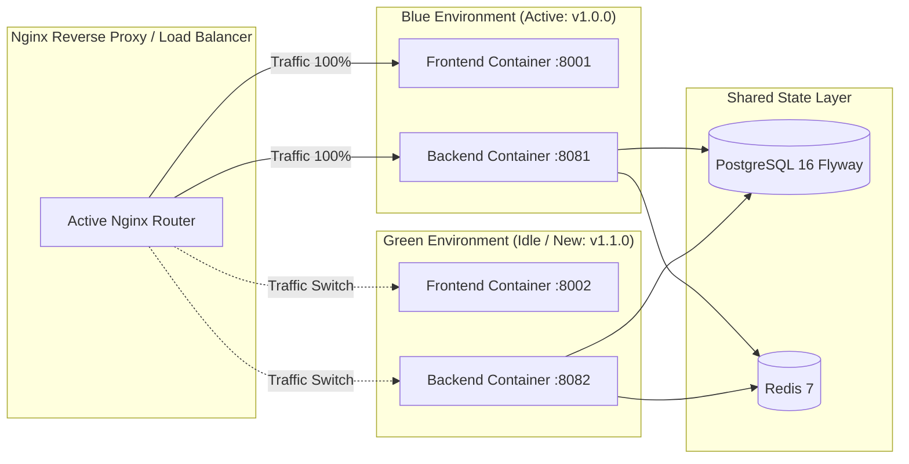

# GitHub Actions CI/CD Pipeline Architecture & Production Guide

This document provides a comprehensive, production-grade architectural guide to the Continuous Integration and Continuous Deployment (CI/CD) pipelines in **DevOps Suite**. It details workflow topologies, build and test optimizations, automated security scanning, container image packaging with Buildx layer caching, cryptographic provenance attestations, release promotion, and deployment strategies.

---

## 1. Architectural Overview & Pipeline Topology

The DevOps Suite CI/CD pipeline is orchestrated through GitHub Actions (`.github/workflows/deploy.yml`). It enforces a strict separation of concerns across continuous integration (validation, testing, linting), security gates, container artifact generation, release promotion, and target infrastructure synchronization.

### Pipeline Philosophy
1. **Fast-Fail Parallelism**: Frontend and Backend CI steps execute in parallel runners (`ubuntu-latest`) to minimize feedback cycles for pull requests.
2. **Immutable Artifacts**: Containers are initially tagged strictly with the immutable Git commit SHA (`ghcr.io/org/repo-backend:sha-<commit>`). Mutable pointer tags (`latest`, `master`) are never updated until all verification tests pass.
3. **Atomic Dual-Component Promotion**: DevOps Suite is composed of a Spring Boot 3 monolith backend and a React 18 SPA frontend. To avoid version skew where a new frontend talks to an incompatible legacy backend API, promotion of the `latest` and `master` tags happens atomically in a dedicated `release` job only after both image builds succeed.
4. **Supply Chain Security**: Docker images are signed and accompanied by build provenance attestations using SLSA-compliant GitHub artifact attestations (`actions/attest-build-provenance@v2`).

```mermaid
flowchart TD
    subgraph Trigger ["Triggers"]
        P[Push to master]
        PR[Pull Request to master]
        WD[Workflow Dispatch]
    end

    subgraph CI_Backend ["CI: Backend Pipeline (JDK 21)"]
        CB1[actions/checkout@v4] --> CB2[actions/setup-java@v4 temurin 21 + cache: maven]
        CB2 --> CB3[Static Analysis & Checkstyle]
        CB3 --> CB4[mvn clean test JaCoCo Coverage]
        CB4 --> CB5[OWASP Dependency-Check]
    end

    subgraph CI_Frontend ["CI: Frontend Pipeline (Node 24)"]
        CF1[actions/checkout@v4] --> CF2[actions/setup-node@v4 24 + cache: npm]
        CF2 --> CF3[npm install --legacy-peer-deps]
        CF3 --> CF4[ESLint src --ext .js,.jsx]
        CF4 --> CF5[Vitest Unit Tests]
        CF5 --> CF6[npm run build Vite Production Bundle]
    end

    subgraph Security_Scan ["Security & Vulnerability Scanning"]
        SEC1[Trivy Vulnerability Scanner]
    end

    subgraph Publish_Backend ["Publish: Backend (GHCR)"]
        PB1[Log in to ghcr.io] --> PB2[Docker Buildx Setup]
        PB2 --> PB3["Build & Push (tag: sha-SHA, cache: buildcache)"]
        PB3 --> PB4[Generate SLSA Provenance Attestation]
    end

    subgraph Publish_Frontend ["Publish: Frontend (GHCR)"]
        PF1[Log in to ghcr.io] --> PF2[Docker Buildx Setup]
        PF2 --> PF3["Build & Push (tag: sha-SHA, cache: buildcache)"]
        PF3 --> PF4[Generate SLSA Provenance Attestation]
    end

    subgraph Release_Promotion ["Atomic Promotion & Housekeeping"]
        REL1[docker buildx imagetools create: tag latest, master, release-SHA]
        REL2[GHCR Retention Policy: Prune releases keeping last 3]
    end

    subgraph CD_Deployment ["Continuous Deployment (Target VM / Cluster)"]
        CD1[SSH or Webhook Runner]
        CD2[Zero-Downtime Blue-Green / Rolling Deploy]
        CD3[Actuator /health Check]
    end

    Trigger --> CI_Backend
    Trigger --> CI_Frontend

    CI_Backend & CI_Frontend --> Security_Scan
    Security_Scan --> Publish_Backend
    Security_Scan --> Publish_Frontend

    Publish_Backend & Publish_Frontend --> Release_Promotion
    Release_Promotion --> CD_Deployment

    style CI_Backend fill:#1e293b,stroke:#38bdf8,stroke-width:2px,color:#fff
    style CI_Frontend fill:#1e293b,stroke:#38bdf8,stroke-width:2px,color:#fff
    style Security_Scan fill:#1e293b,stroke:#f59e0b,stroke-width:2px,color:#fff
    style Publish_Backend fill:#1e293b,stroke:#a855f7,stroke-width:2px,color:#fff
    style Publish_Frontend fill:#1e293b,stroke:#a855f7,stroke-width:2px,color:#fff
    style Release_Promotion fill:#1e293b,stroke:#10b981,stroke-width:2px,color:#fff
    style CD_Deployment fill:#1e293b,stroke:#ec4899,stroke-width:2px,color:#fff
```

---

## 2. Deep Dive: Pipeline Stages

### Stage 1: Linting, Static Analysis & Code Quality
Static analysis catches syntax errors, typing discrepancies, code smells, and style violations before tests run.

* **Frontend (React 18 SPA)**:
  * **ESLint 9**: Executed via `npm run lint` (`eslint src --ext .js,.jsx`). Validates JSX styling, hooks rules (`react-hooks/rules-of-hooks`, `react-hooks/exhaustive-deps`), import ordering, and dead code elimination.
  * **Vite Production Validation**: Executing `npm run build` forces Rollup bundling, verifying TypeScript/JSDoc types, asset references, and tree-shaking efficiency.
* **Backend (Spring Boot 3 / Java 21)**:
  * **Compiler Configuration**: Maven Compiler Plugin `3.13.0` targeting Java 21 with `-Xlint:all` and `-Werror` flags to treat deprecation and raw-type warnings as errors.
  * **Checkstyle Plugin**: Enforces standard Google Java Style guidelines (naming conventions, Javadoc completeness, line lengths, import statements).
  * **Annotation Processing**: Lombok `1.18.38` and MapStruct `1.6.3` processors compile DTO-entity mappers in the annotation processor path before Surefire test compilation.

### Stage 2: Automated Testing & JaCoCo Code Coverage
The test stage guarantees both functional correctness and regression resistance.

* **Backend Test Execution**:
  * Unit tests and Spring integration tests execute via `mvn clean test`.
  * **Surefire Configuration**:
    ```xml
    <plugin>
        <groupId>org.apache.maven.plugins</groupId>
        <artifactId>maven-surefire-plugin</artifactId>
        <configuration>
            <!-- Required for Mockito inline-mock-maker under JDK 21 -->
            <argLine>@{argLine} -XX:+EnableDynamicAgentLoading -Xshare:off</argLine>
        </configuration>
    </plugin>
    ```
    *Note*: JDK 21 introduces warnings and dynamic agent restrictions for Byte Buddy/Mockito. Specifying `-XX:+EnableDynamicAgentLoading` ensures non-blocking mock instrumentation.
  * **JaCoCo 0.8.12**:
    * Prepares agent during `prepare-agent`.
    * Generates coverage matrix (`target/site/jacoco/jacoco.xml`) during `report`.
    * Pipeline enforces minimum threshold (e.g. 80% line and branch coverage) through `jacoco:check`.
* **Frontend Test Execution**:
  * Unit and component testing using `vitest` with `@testing-library/react` and `jsdom`.
  * Cypress E2E binary installation is bypassed during headless CI dependency install (`CYPRESS_INSTALL_BINARY=0 npm install --legacy-peer-deps`) to shave 40+ seconds off runner provisioning, delegating E2E to dedicated nocturnal pipelines.

### Stage 3: Security & Vulnerability Scanning
DevSecOps integration prevents vulnerable dependencies and base images from reaching staging or production:

1. **OWASP Dependency-Check**:
   * Evaluates backend third-party JARs and frontend packages against the National Vulnerability Database (NVD).
   * Generates CVSS score metrics; builds fail on High/Critical (CVSS >= 7.0) vulnerabilities.
2. **Trivy Container Scanner (`aquasecurity/trivy-action`)**:
   * Scans generated container filesystems for OS-level vulnerabilities (e.g., Debian/Alpine packages in `eclipse-temurin:21-jre-jammy` or `nginx:alpine`).
   * Scans container layers for misconfigurations, leaked credentials (`.env`, private keys), and known Common Vulnerabilities and Exposures (CVEs).

```yaml
- name: Run Trivy vulnerability scanner
  uses: aquasecurity/trivy-action@master
  with:
    image-ref: ${{ env.IMAGE }}:sha-${{ github.sha }}
    format: 'sarif'
    output: 'trivy-results.sarif'
    severity: 'CRITICAL,HIGH'
    exit-code: '1' # Fails the pipeline on Critical/High findings
```

### Stage 4: Docker Image Build & Push with Layer Caching
DevOps Suite uses GitHub Container Registry (`ghcr.io`) and `docker/build-push-action@v6` backed by `docker/setup-buildx-action@v3`.

* **BuildKit Layer Caching**:
  * Employs `cache-from: type=registry,ref=${{ env.IMAGE }}:buildcache` and `cache-to: type=registry,ref=${{ env.IMAGE }}:buildcache,mode=max`.
  * `mode=max` caches all intermediate stages of the multi-stage Docker build, not just the final artifact stage. This means unchanged Maven dependencies (`~/.m2`) and Node compilation layers (`node_modules`) are pulled directly from GHCR build cache layers in seconds.
* **SLSA Provenance Attestation**:
  * `actions/attest-build-provenance@v2` cryptographically links the GitHub Actions run ID, repository, commit SHA, and image digest (`sha256:...`).
  * Enables zero-trust admission controllers (e.g., Kyverno or Cosign) in downstream production environments to reject untrusted images.

### Stage 5: Release Promotion & Registry Pruning
Once both images pass verification:

* **Promotion via `docker buildx imagetools create`**:
  * Creates multi-tag references directly in the registry without re-pulling, re-building, or re-pushing container layers.
  * Links `sha-${GITHUB_SHA}` to `latest`, `master`, and `release-${GITHUB_SHA}` in sub-second API calls.
* **Automated Package Retention Cleanup**:
  * GitHub Container Registry accumulates gigabytes of disk space and storage costs over time.
  * An automated step queries the GitHub API using `gh api --paginate` and `jq` to keep only the **3 most recent successful releases** (`release-*` tags), pruning stale untagged blobs and intermediate images.

### Stage 6: Deployment Pipeline (CD)
* Automated deployment synchronizes target hosts via SSH or GitOps:
  * Connects using secure SSH private keys (`AZURE_VM_SSH_KEY`).
  * Pulls designated release images.
  * Replaces running services using Docker Compose with zero-downtime health verification:
    ```bash
    docker compose -f docker-compose.yml -f docker-compose.prod.yml pull
    docker compose -f docker-compose.yml -f docker-compose.prod.yml up -d --remove-orphans
    ```
  * Polls Spring Boot Actuator endpoint (`http://localhost:8081/actuator/health`) until status returns `UP`.

---

## 3. GitHub Secrets Management & Branch Protection Rules

### Secret Management Strategy
Secrets must adhere to the principle of least privilege (PoLP):

| Secret Name | Scope | Description | Rotation Policy |
|:---|:---|:---|:---|
| `GITHUB_TOKEN` | Automatic ephemeral runner secret | Read packages, write packages, attestations, id-token. Automatically scoped per job. | Ephemeral (per-workflow run) |
| `AZURE_VM_SSH_KEY` | Environment / Repository Secret | Ed25519 private SSH key for remote VM provisioning. | 90 days |
| `AZURE_VM_IP` / `AZURE_VM_USER` | Environment Secret | Target host IP and unprivileged deployment user (`deployer`). | Static / On infra change |
| `DOCKERHUB_TOKEN` | Organization Secret | Access token for Docker Hub mirroring (if active). | 180 days |
| `SONAR_TOKEN` | Repository Secret | Token for SonarQube / SonarCloud static code analysis. | Annual |

#### Security Best Practices:
1. **GitHub Environments**: Secrets such as `AZURE_VM_SSH_KEY` should be bound to a `production` environment that requires manual reviewer approval from engineering leads.
2. **OIDC over Long-Lived Credentials**: For AWS/Azure/GCP, use OpenID Connect (OIDC) via `permissions: id-token: write` rather than storing static IAM access keys or VM passwords.
3. **Audit Logging**: Enable secret scanning on the repository to prevent accidental credential commits.

### Branch Protection Rules (`main` / `master` vs `develop`)

To protect production stability, strict branch policies are configured:

```
[Feature / Bugfix Branch]
         │
         ▼  (PR)
   [develop] ──── CI Checks: Lint, Surefire, Vitest, Trivy (Must Pass)
         │       Approvals: Minimum 1 Peer Review
         ▼  (PR)
   [master]  ──── CI Checks: Full Integration Suite + Build Verification
                 Approvals: Minimum 2 Approvals + Code Owner Review
                 Protection: Require linear history, no force-push, signed commits
                 Environment: Protected deployment to Production
```

#### Detailed Branch Rules Matrix:
* **`master` (Production Branch)**:
  * **Require pull request before merging**: Minimum of 2 approvals required.
  * **Require status checks to pass before merging**:
    * `Build & Test Backend`
    * `Build & Test Frontend`
    * `Security Scan / Trivy`
  * **Require branches to be up to date before merging**: Ensures branches pass tests against the latest base.
  * **Require signed commits**: GPG/SSH verified signatures.
  * **Require linear history**: Squash-and-merge or rebase-and-merge only (no merge commits cluttering the tree).
  * **Do not allow bypassing the above settings**: Enforced even for repository administrators.
* **`develop` (Integration Branch)**:
  * Minimum of 1 approval.
  * Requires `build-backend` and `build-frontend` green status checks.
  * Allows developer iterations without triggering production deployment jobs.

---

## 4. Deep-Dive Interview Q&A

### 🟢 Basic Concepts

#### Q1: What is the purpose of `actions/checkout@v4` and `actions/setup-java@v4` in a GitHub Actions workflow?
**Answer:**
`actions/checkout@v4` is the official GitHub Action that checks out your Git repository onto the runner filesystem (`$GITHUB_WORKSPACE`), allowing subsequent workflow steps (like Maven or Node) to access source code. By default, it performs a shallow fetch of depth 1 for the specific commit ref that triggered the workflow.

`actions/setup-java@v4` provisions a specified Java Development Kit (JDK) distribution into the runner's `PATH`. In DevOps Suite, we specify:
```yaml
uses: actions/setup-java@v4
with:
  java-version: '21'
  distribution: 'temurin'
  cache: 'maven'
```
This installs Eclipse Temurin JDK 21 and automatically inspects `backend/pom.xml` to configure caching of the local Maven repository (`~/.m2/repository`). If dependencies have not changed, Maven avoids downloading dependencies across subsequent runs, cutting build times significantly.

---

#### Q2: How does GitHub Actions handle workflow triggers and environment variables?
**Answer:**
Workflow triggers are defined under the `on` block:
* `push`: Fires on direct commits or merged pull requests to specified branches (`master`).
* `pull_request`: Fires when a pull request is opened, synchronized, or reopened against the target branch.
* `workflow_dispatch`: Enables manual triggering from the GitHub UI or REST API with optional custom input parameters.

Environment variables can be defined at the root (`env`), at the job level (`jobs.<job_id>.env`), or at the individual step level (`steps[*].env`). Furthermore, dynamic environment variables can be persisted across subsequent steps within the same job by appending key-value pairs to the special runner file `$GITHUB_ENV`:
```bash
echo "IMAGE_TAG=sha-${{ github.sha }}" >> $GITHUB_ENV
```

---

#### Q3: Why is CYPRESS_INSTALL_BINARY=0 used during frontend CI dependency installation?
**Answer:**
In `build-frontend`, the step executes:
```bash
CYPRESS_INSTALL_BINARY=0 npm install --legacy-peer-deps
```
Cypress includes a precompiled browser automation binary (~150–300 MB). Downloading and unzipping this binary on every standard CI run consumes 30–60 seconds of runner time and substantial network bandwidth. Since the primary CI pipeline focuses on static linting (`npm run lint`), unit testing (`npm test` via Vitest), and bundling (`npm run build`), the full Cypress browser runtime is unnecessary. Setting `CYPRESS_INSTALL_BINARY=0` skips the binary download, dramatically accelerating the workflow. Full E2E testing with Cypress is isolated to dedicated E2E jobs that cache the binary separately.

---

### 🟡 Intermediate Architectures

#### Q4: How does layer caching work in `docker/build-push-action@v6` using `type=registry`?
**Answer:**
Docker images are constructed as a stack of read-only layers corresponding to instructions in the `Dockerfile`. In ephemeral GitHub Actions runners (`ubuntu-latest`), the runner disk is discarded at the end of each job, meaning local Docker cache is lost.

To overcome this, DevOps Suite utilizes registry-based caching:
```yaml
cache-from: type=registry,ref=${{ env.IMAGE }}:buildcache
cache-to: type=registry,ref=${{ env.IMAGE }}:buildcache,mode=max
```
* **`cache-from`**: Instructs BuildKit to pull previously compiled layers and manifest metadata from a remote container registry tag (`:buildcache`).
* **`cache-to`**: Uploads new or updated layers to the registry cache.
* **`mode=max`**: By default (`mode=min`), BuildKit only caches layers belonging to the final exported target stage. With `mode=max`, BuildKit exports cache entries for **all** stages of multi-stage builds. In multi-stage builds where Stage 1 builds the Java JAR or Vite bundle and Stage 2 creates the lightweight runtime container, `mode=max` preserves the heavy build stages, enabling near-instant compilation if source dependencies have not changed.

---

#### Q5: What is the significance of separating CI testing jobs from image publishing jobs using `needs`?
**Answer:**
In `.github/workflows/deploy.yml`:
```yaml
publish-backend:
  needs: [ build-backend, build-frontend ]
  if: github.event_name == 'push' && github.ref == 'refs/heads/master' || github.event_name == 'workflow_dispatch'
```
This architecture provides three critical advantages:
1. **Quality Gating**: Container packaging and registry pushes consume network I/O, registry quota, and compute time. By requiring `needs: [ build-backend, build-frontend ]`, images are never built or published if a single JUnit test or ESLint rule fails.
2. **Coupled Compatibility**: In DevOps Suite, the frontend and backend share contracts (REST endpoints, WebSocket payloads). Requiring both jobs to succeed ensures that a broken frontend build prevents a valid backend from publishing, avoiding client-server incompatibility.
3. **Branch Protection & Pull Requests**: For pull requests (`github.event_name == 'pull_request'`), the `build-*` jobs run to validate code quality, but the `if` condition skips `publish-*`, preventing untrusted PR branches from overwriting production container registries.

---

#### Q6: Explain how the release promotion job promotes images without rebuilding them.
**Answer:**
Building container images twice (e.g., once for testing and once for release) violates artifact immutability and risks introducing subtle build differences. Instead, DevOps Suite compiles and tags images strictly with the commit SHA during `publish-*`:
* `ghcr.io/...-backend:sha-abc1234`

In the subsequent `release` job, it uses Docker BuildKit's `imagetools create`:
```bash
docker buildx imagetools create \
  --tag "${BACKEND_IMAGE}:latest" \
  --tag "${BACKEND_IMAGE}:master" \
  --tag "${BACKEND_IMAGE}:release-${GITHUB_SHA}" \
  "${BACKEND_IMAGE}:sha-${GITHUB_SHA}"
```
`docker buildx imagetools create` operates exclusively on registry metadata and manifests via HTTP API calls. It creates aliases/pointers (`latest`, `master`, `release-<sha>`) targeting the exact same manifest digest (`sha256:...`) without pulling or re-uploading container layer blobs. This operation completes in under 2 seconds and guarantees 100% byte-for-byte fidelity with the tested image.

---

### 🔴 Advanced Pipeline Engineering

#### Q7: What are Artifact Attestations and SLSA Provenance, and how are they implemented in GitHub Actions?
**Answer:**
Supply Chain Levels for Software Artifacts (SLSA) provides a framework to prevent tampering, build spoofing, and unauthorized packages. In our pipeline:
```yaml
- name: Generate artifact attestation
  uses: actions/attest-build-provenance@v2
  with:
    subject-name: ${{ env.IMAGE }}
    subject-digest: ${{ steps.push.outputs.digest }}
    push-to-registry: true
```
**Mechanism:**
1. **OIDC Identity Token**: The job requests a short-lived cryptographically signed OpenID Connect (OIDC) identity token from GitHub's token authority (`permissions: id-token: write`).
2. **Sigstore Integration**: The action creates an in-toto attestation envelope linking the image subject name and SHA-256 digest to the workflow run's trusted identity (repository name, runner environment, commit SHA, triggering user).
3. **Rekor Transparency Log & Fulcio**: GitHub's internal or public Sigstore service signs the attestation certificate and publishes the log entry.
4. **Registry Storage**: The attestation envelope is pushed to GHCR alongside the container image as an OCI artifact (`.attestation`).
5. **Downstream Verification**: Admission controllers or deployment agents can verify the image before execution:
   ```bash
   gh attestation verify oci://ghcr.io/org/repo-backend:sha-xxxx --owner org
   ```
   If an attacker tampers with the registry or pushes an image outside of this authenticated GitHub Actions pipeline, deployment fails immediately.

---

#### Q8: How does the GHCR release pruning script work, and why does it parse explicit `release-*` tags rather than raw package version IDs?
**Answer:**
In GHCR, every artifact push—including layer caches, intermediate multi-stage layers, and OCI attestation manifests—generates a package version ID. Deleting versions blindly based on version creation time can inadvertently delete attestations or currently referenced cache layers.

DevOps Suite implements an intelligent retention policy in Bash using `gh api` and `jq`:
```bash
# Filter versions containing tags starting with "release-"
RELEASES="$(echo "$VERSIONS" | jq -c '
  map(
    select(
      any(
        (.metadata.container.tags // [])[];
        startswith("release-")
      )
    )
  )
  | sort_by(.created_at)
  | reverse
')"
```
**Operational Mechanics:**
1. Fetches all container versions via GitHub API pagination.
2. Filters versions strictly by whether their tag array contains an explicit `release-<sha>` prefix (ignoring `buildcache`, `latest`, `master`, and untagged attestation bundles).
3. Sorts valid releases chronologically in descending order.
4. If release count > 3, it extracts the timestamp of the 3rd newest release as the `CUTOFF`.
5. Iterates through all versions older than `CUTOFF` that carry `release-*` tags and sends HTTP `DELETE` requests (`gh api --method DELETE "$API_PATH/$VERSION_ID"`).
This retains the 3 newest operational release candidates for rollback while reclaiming storage and preventing API bloat.

---

#### Q9: How do you configure and optimize Maven and Node caching across self-hosted and GitHub-hosted runners?
**Answer:**
* **Maven Caching**:
  * With `actions/setup-java@v4`:
    ```yaml
    with:
      distribution: 'temurin'
      java-version: '21'
      cache: 'maven'
    ```
    GitHub Actions generates a cache key hashing `**/pom.xml`. If `pom.xml` does not change, `~/.m2/repository` is restored.
  * **Optimization**: To avoid cache bloat from local snapshot builds or logs, add an explicit pre-cache step or `.gitignore` inside `.m2` to exclude `~/.m2/repository/com/devopssuite/`.
* **npm Caching**:
  * With `actions/setup-node@v4`:
    ```yaml
    with:
      node-version: '24'
      cache: 'npm'
      cache-dependency-path: frontend/package-lock.json
    ```
    Hashes `frontend/package-lock.json`. Restores `~/.npm` (the global npm cache), allowing `npm install` to resolve dependencies offline from local disk without hitting the npmjs registry.
* **Self-Hosted Runner Nuances**:
  * On GitHub-hosted runners, caches are archived to and pulled from GitHub cloud cache storage (10 GB max per repo).
  * On self-hosted runners, network latency to GitHub cache storage can make downloading large archives slower than local compilation. A persistent host volume mounted at `/root/.m2` and `/root/.npm` or a local Nexus/Artifactory repository mirror inside the VPC provides superior performance (cutting warm builds down to sub-10 seconds).

---

### ⚫ Expert & System Architecture

#### Q10: Design a Zero-Downtime Blue-Green Deployment strategy integrated into this CI/CD workflow for the DevOps Suite monolith.
**Answer:**
DevOps Suite consists of a Spring Boot backend, React SPA frontend (Nginx), PostgreSQL 16 database, and Redis 7. A zero-downtime Blue-Green deployment requires coordination between database migrations, container routing, and health verification.



**Architecture & Execution Steps:**
1. **Backward-Compatible Database Migrations (Expand/Contract)**:
   * Blue-Green requires both versions (v1 and v2) to run concurrently against the same PostgreSQL database during the switchover.
   * **Rule**: Database changes must be backward-compatible (Flyway V1 -> V16). Columns cannot be renamed or dropped in Phase 1. Instead, add new nullable columns (Expand), deploy Green, and remove legacy columns in a subsequent migration (Contract).
2. **Deployment Execution**:
   * Deploy Green containers alongside Blue:
     ```bash
     docker compose -f docker-compose.green.yml up -d
     ```
3. **Automated Health Gating & Readiness Checks**:
   * GitHub Actions polls the internal Green Actuator endpoint:
     ```bash
     for i in {1..30}; do
       STATUS=$(curl -s http://127.0.0.1:8082/actuator/health | jq -r .status)
       if [ "$STATUS" = "UP" ]; then echo "Green is healthy"; break; fi
       sleep 2
     done
     ```
   * Runs synthetic smoke tests against Green (verifying `/api/auth`, `/api/health`, and WebSocket handshake).
4. **Instant Traffic Switchover**:
   * Update the upstream configuration of the front-facing Nginx ingress router:
     ```nginx
     # /etc/nginx/conf.d/upstream.conf
     upstream backend_cluster {
         server 127.0.0.1:8082; # Points to Green
     }
     ```
   * Execute reload with zero dropped TCP connections:
     ```bash
     nginx -s reload
     ```
5. **Drain & Teardown**:
   * Blue remains idle for 15 minutes to allow in-flight WebSocket connections and long-polling requests to complete gracefully.
   * If error budgets or 5xx spikes occur, instant rollback is achieved by swapping Nginx upstream back to Blue (`nginx -s reload`).
   * Once validated, Blue containers are stopped.

---

#### Q11: How do you design an automated rollback strategy if an error occurs post-deployment?
**Answer:**
Automated rollbacks require deterministic detection, state protection, and automated execution.

**1. Detection Layer (Observability Feedback Loop)**:
* Prometheus scrapes `/actuator/prometheus` at 5s intervals.
* Alertmanager triggers a GitHub Actions rollback webhook or local deployment agent if:
  * Error rate exceeds 1% of total requests over 3 consecutive minutes:
    `rate(http_server_requests_seconds_count{status=~"5.."}[1m]) / rate(http_server_requests_seconds_count[1m]) > 0.01`
  * Spring Boot Actuator health transitions to `DOWN` or `OUT_OF_SERVICE`.
  * Container restarts exceed 2 within 5 minutes (`restart_count > 2`).

**2. Rollback Execution**:
* Because the release pipeline preserves the previous 3 release tags (`release-<sha>`), the rollback script queries the prior successful release:
  ```bash
  PREVIOUS_TAG=$(docker inspect --format='{{.Config.Image}}' devopssuite-backend | sed 's/latest/rollback/g')
  # Or pull from GHCR release tag history
  docker compose -f docker-compose.prod.yml down
  IMAGE_TAG=${PREV_STABLE_SHA} docker compose -f docker-compose.prod.yml up -d
  ```
* In Blue-Green architectures, rollback is an instant Nginx upstream reconfiguration taking < 100 milliseconds.

**3. State Reconciliation & Data Consistency**:
* If database schema changes occurred during the failed release, Flyway migrations cannot always be rolled back automatically.
* **Design Pattern**: Migrations must follow non-destructive patterns (additive only). Code in the rollback version must safely ignore newly added columns.
* If Redis cache contains serialized models from the new release that break the old release, the rollback script must invalidate specific versioned Redis cache keys (`CACHE_VERSION_KEY`) or execute targeted eviction of domain namespaces without purging user session tokens.

---

#### Q12: How would you secure this pipeline against malicious Pull Request attacks (e.g., secret exfiltration via modified CI scripts)?
**Answer:**
Public or multi-contributor repositories face severe risks when workflows run on `pull_request` triggers. Malicious PRs could inspect environment variables, read repository secrets, or use runners for cryptomining.

**Hardened Security Architecture:**
1. **Separation of Events (`pull_request` vs `pull_request_target`)**:
   * Never run untrusted PR code in `pull_request_target` workflows with access to write tokens or production secrets. `pull_request` runs in the context of the fork/PR branch and has **zero access to repository secrets**.
   * In DevOps Suite, our `deploy.yml` specifies:
     ```yaml
     if: github.event_name == 'push' && github.ref == 'refs/heads/master' || github.event_name == 'workflow_dispatch'
     ```
     This guarantees that secret-bearing publishing and deployment jobs are physically blocked on `pull_request` events.
2. **Minimal Runner Permissions**:
   * Set root permissions to read-only:
     ```yaml
     permissions:
       contents: read
     ```
   * Explicitly declare granular write permissions (`packages: write`, `id-token: write`) **only** inside specific jobs that require them (`publish-backend`, `publish-frontend`).
3. **Step Security & Pinned Dependencies**:
   * Pin all third-party GitHub Actions to immutable full-length commit SHAs rather than mutable branch/release tags:
     ```yaml
     uses: actions/checkout@b4ffde65f46336ab88eb53be808477a3936bae11 # v4.1.1
     ```
     This prevents supply chain hijacking if an action maintainer's account is compromised.
4. **Network Sandboxing**:
   * For executing user-submitted code in tests, utilize hardened ephemeral Docker sandboxes (as DevOps Suite does in its code execution engine: `--network=none`, `--read-only`, `--memory=256m`, `--pids-limit=50`).

---

## 5. Quick Reference & Cheat Sheet

### Essential GitHub Actions Workflow Syntax

| Directive | Purpose | Example |
|:---|:---|:---|
| `concurrency` | Cancels redundant in-flight builds on new commits | `concurrency: { group: '${{ github.ref }}', cancel-in-progress: true }` |
| `needs` | Enforces DAG dependency order between jobs | `needs: [ build-backend, build-frontend ]` |
| `if` condition | Gates job or step execution | `if: github.ref == 'refs/heads/master' && github.event_name == 'push'` |
| `timeout-minutes` | Prevents hanging jobs from burning runner minutes | `timeout-minutes: 15` |
| `permissions` | Restricts GITHUB_TOKEN privileges per job | `permissions: { contents: read, packages: write }` |
| `matrix` | Runs permutations in parallel across OS/runtimes | `strategy: { matrix: { java: [ 21 ], os: [ ubuntu-latest ] } }` |

### Key Docker Buildx & Tooling Commands

| Command | Usage in DevOps Suite Pipeline |
|:---|:---|
| `docker buildx imagetools create` | Creates new tags (`latest`, `release-SHA`) from existing registry digests without re-uploading layers. |
| `docker buildx imagetools inspect` | Inspects multi-architecture manifests, digests, and attestations on remote registries. |
| `gh api --paginate` | Queries paginated GitHub REST APIs to inspect and prune package versions in GHCR. |
| `actions/attest-build-provenance` | Generates SLSA compliant cryptographic build provenance attestations for OCI container images. |
| `appleboy/ssh-action` | Executes remote deployment scripts securely over SSH using Ed25519 authentication keys. |
