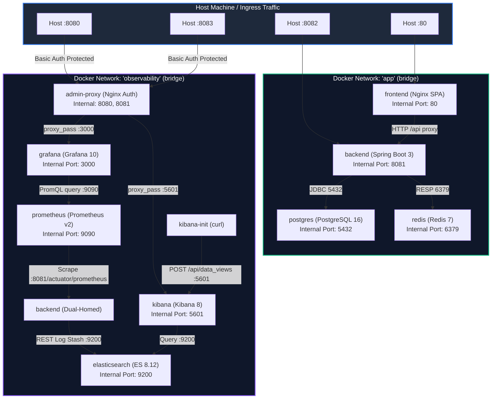
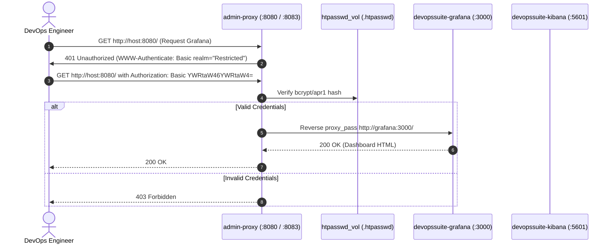
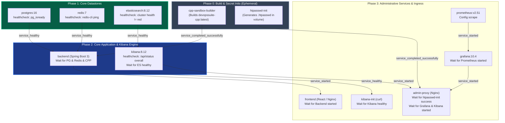
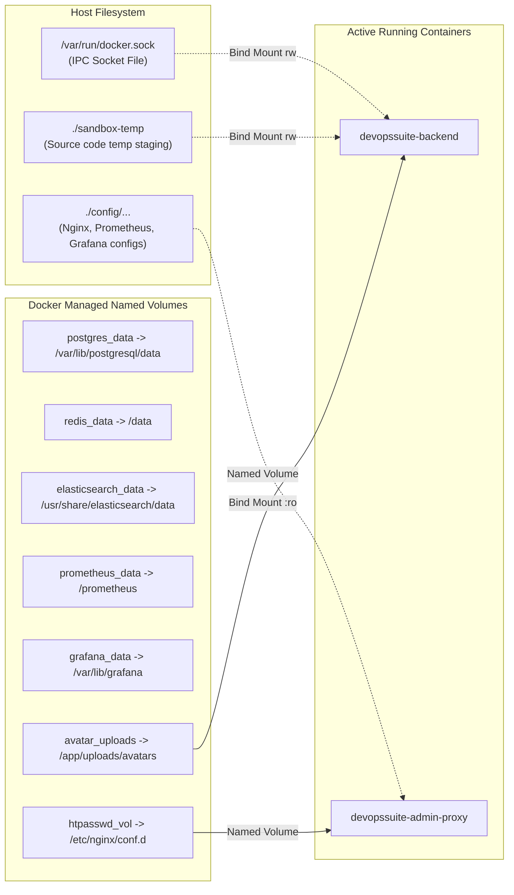
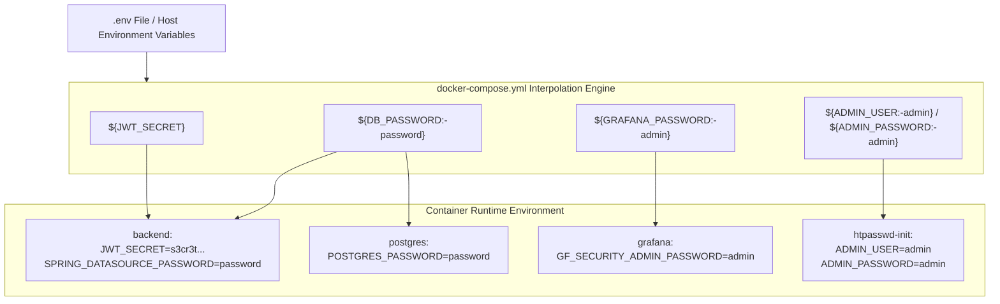

# Docker Compose Architecture & Infrastructure Deep Dive

## Introduction

In modern production-grade cloud architectures, container orchestration must strike a delicate balance between development velocity, operational security, and predictable determinism. In **DevOps Suite**, container orchestration across local development, CI/CD integration pipelines, and staging deployments is powered by Docker Compose.

DevOps Suite does not rely on a naive flat container topology where all services share a single default bridge network with exposed ports. Instead, it implements a **segmented dual-network architecture**, **strict port-isolation boundaries**, **deterministic health-check-driven dependency ordering**, **ephemeral init-containers**, and **reverse-proxy perimeter authentication** protecting administrative tooling.

```
+---------------------------------------------------------------------------------------------------+
|                                            HOST PORTS                                             |
|        :80                      :8082                          :8080                    :8083     |
+---------+-------------------------+------------------------------+------------------------+-------+
          |                         |                              |                        |
          v                         v                              |                        |
+-------------------+     +--------------------+                   |                        |
| devopssuite-      |     | devopssuite-       |                   |                        |
| frontend (Nginx)  |     | backend (Spring)   |                   |                        |
+---------+---------+     +----+----------+----+                   |                        |
          |                    |          |                        |                        |
          |   app bridge       |          |  observability bridge  v                        v
          +--------------------+          |       +---------------------------------------------+
          |                    |          |       | devopssuite-admin-proxy (Nginx + .htpasswd)  |
          v                    v          |       +----------------+--------------------+-------+
  +---------------+    +---------------+  |                        |                    |
  | postgres:16   |    | redis:7       |  |                        v                    v
  | (port 5432)   |    | (port 6379)   |  |               +----------------+   +----------------+
  | [NO HOST PORT]|    | [NO HOST PORT]|  |               | grafana:10     |   | kibana:8       |
  +---------------+    +---------------+  |               | (port 3000)    |   | (port 5601)    |
                                          |               | [NO HOST PORT] |   | [NO HOST PORT] |
                                          |               +--------+-------+   +--------+-------+
                                          |                        |                    |
                                          +-----------------+      v                    v
                                          |                 | +----------+      +---------------+
                                          v                 v |Prometheus|      |Elasticsearch  |
                                    [Actuator /prom] [Logback]|(port 9090|      |(port 9200)    |
                                                              +----------+      +---------------+
```

This guide details the complete Docker Compose architecture defined in [docker-compose.yml](file:///d:/Projects/DevOps%20Suite/docker-compose.yml), covering network segmentation, service orchestration, init containers, storage persistence, environmental security, and senior interview questions spanning basic to principal-architect level.

---

## 1. Multi-Service Architecture Breakdown

The DevOps Suite orchestration stack is composed of 11 distinct services serving application delivery, persistent storage, in-memory caching, observability, and administrative security.

| Service Name | Container Name | Image / Build Context | Network Membership | Host Exposed Ports | Internal Expose Ports | Role in DevOps Suite |
| :--- | :--- | :--- | :--- | :--- | :--- | :--- |
| **`frontend`** | `devopssuite-frontend` | Build `./frontend` (Nginx + React SPA) | `app` | `80:80` | `80` | Serves static React 18 production artifacts; proxies `/api` and `/ws` to backend. |
| **`backend`** | `devopssuite-backend` | Build `./backend` (Java 21 / Spring Boot 3) | `app`, `observability` | `8082:8081` | `8081` | Core REST API, WebSocket/STOMP broker, Docker sandbox manager, metric generator. |
| **`cpp-sandbox-builder`** | `devopssuite-cpp-builder` | Build `Dockerfile.cpp-sandbox` | (Default / host) | None | None | Ephemeral init service. Pre-builds `devopssuite-cpp:latest` so sandbox execution never pulls images at runtime. |
| **`postgres`** | `devopssuite-postgres` | `postgres:16-alpine` | `app` | None | `5432` | Relational datastore for users, projects, tasks, comments, audits. Migrated via Flyway. |
| **`redis`** | `devopssuite-redis` | `redis:7-alpine` | `app` | None | `6379` | Cache-aside queries, sliding-window rate limit counters, revoked JWT blocklist. |
| **`elasticsearch`** | `devopssuite-elasticsearch`| `docker.elastic.co/elasticsearch/elasticsearch:8.12.0` | `observability` | None | `9200` | Structured log ingestion (`devopssuite-logs-yyyy.MM.dd`) from Spring Boot Logback appender. |
| **`kibana`** | `devopssuite-kibana` | `docker.elastic.co/kibana/kibana:8.12.0` | `observability` | None | `5601` | Log visualization and index discovery UI. Accessible strictly via `admin-proxy`. |
| **`kibana-init`** | `devopssuite-kibana-init` | `curlimages/curl:8.7.1` | `observability` | None | None | Ephemeral bootstrap script provisioning Default Data View and index patterns into Kibana API. |
| **`prometheus`** | `devopssuite-prometheus` | `prom/prometheus:v2.51.0` | `observability` | None | `9090` | Pull-based timeseries ingestion engine scraping `/actuator/prometheus` on backend. |
| **`grafana`** | `devopssuite-grafana` | `grafana/grafana:10.4.0` | `observability` | None | `3000` | Metric visualization engine with auto-provisioned Prometheus datasource & dashboards. |
| **`admin-proxy`** | `devopssuite-admin-proxy` | `nginx:1.27-alpine` | `observability` | `8080:8080`, `8083:8081` | `8080`, `8081` | Security perimeter enforcing HTTP Basic Auth before proxying Grafana and Kibana traffic. |
| **`htpasswd-init`** | `devopssuite-htpasswd-init`| `httpd:2.4-alpine` | (None / isolated volume) | None | None | Ephemeral utility generating Apache htpasswd file from env variables onto `htpasswd_vol`. |

---

## 2. Network Topology & Traffic Isolation

A critical tenet of the Principle of Least Privilege in cloud infrastructure is network isolation. Docker Compose defaults to creating a single user-defined bridge network named `<project>_default` where every container can reach every port of every other container. 

In DevOps Suite, two independent custom bridge networks are explicitly configured:



### 2.1 The Two Dedicated Bridge Networks

1. **`app` network (`driver: bridge`)**:
   - Contains: `frontend`, `backend`, `postgres`, `redis`.
   - Purpose: Encapsulates all customer-facing business transactions and state management.
   - Isolation: Neither `elasticsearch`, `prometheus`, nor `admin-proxy` reside on this network. A compromised monitoring tool cannot pivot directly to Postgres or Redis.

2. **`observability` network (`driver: bridge`)**:
   - Contains: `backend`, `elasticsearch`, `kibana`, `kibana-init`, `prometheus`, `grafana`, `admin-proxy`.
   - Purpose: Carries log ingestion, telemetry scraping, dashboard queries, and administrative inspection.
   - Isolation: Databases (`postgres`, `redis`) and user ingress (`frontend`) are not attached to this network.

### 2.2 The Dual-Homed Bridge Node (`backend`)

The `backend` container serves as the architectural nexus between business logic and observability. It is attached to **both** networks:

```yaml
backend:
  # ...
  networks:
    - app
    - observability
```

- When the backend connects to `jdbc:postgresql://postgres:5432/devopssuite` or `redis:6379`, the Docker embedded DNS resolver (`127.0.0.11`) resolves `postgres` and `redis` over `app`'s bridge network interface (`eth0`).
- When Logback ships log batches to `http://elasticsearch:9200`, the DNS resolver matches `elasticsearch` over `observability`'s bridge interface (`eth1`).
- When Prometheus scrapes `http://backend:8081/actuator/prometheus`, it routes through `observability`'s interface.

---

## 3. Port Isolation Matrix & Perimeter Security

Exposing internal ports on `0.0.0.0` of a host is one of the most common and catastrophic Docker misconfigurations in engineering teams.

```
       UNSECURED ARCHITECTURE                        DEVOPS SUITE SECURED ARCHITECTURE
       ----------------------                        ---------------------------------
Internet ---> :5432 ---> PostgreSQL (EXPOSED!)      Internet ---> :5432 (BLOCKED - NO HOST PORT)
Internet ---> :6379 ---> Redis      (EXPOSED!)      Internet ---> :6379 (BLOCKED - NO HOST PORT)
Internet ---> :9200 ---> ES         (EXPOSED!)      Internet ---> :9200 (BLOCKED - NO HOST PORT)
Internet ---> :9090 ---> Prometheus(EXPOSED!)      Internet ---> :9090 (BLOCKED - NO HOST PORT)
Internet ---> :3000 ---> Grafana    (NO AUTH!)      Internet ---> :8080 ---> [admin-proxy Nginx] ---> Grafana
Internet ---> :5601 ---> Kibana     (NO AUTH!)      Internet ---> :8083 ---> [Basic Auth .htpasswd] -> Kibana
```

### 3.1 Host Port Exposure vs. Internal Exposure

Docker Compose provides two distinct directives for container networking:
- `ports`: Binds a host port to a container port (`host:container`). Creates iptables/nftables `DNAT` routing rules that bypass host UFW/firewalls by default.
- `expose`: Documents that a container listens on a port and makes it accessible **only** to containers linked to the **same internal Docker network**. No host iptables rules are created.

### 3.2 Port Security Audit Table

| Service | Configuration Directive | Host Accessibility | Attack Vector Eliminated |
| :--- | :--- | :--- | :--- |
| **`frontend`** | `ports: ["80:80"]` | Public (HTTP) | Intended ingress point for web users. |
| **`backend`** | `ports: ["8082:8081"]` | Public / API client | External access for direct API testing / mobile clients. |
| **`postgres`** | `expose: ["5432"]` | **Completely Blocked** | RCE via PostgreSQL extensions, brute force attacks, credential spraying. |
| **`redis`** | `expose: ["6379"]` | **Completely Blocked** | Unauthenticated Redis RCE (arbitrary file write / SSH key injection). |
| **`elasticsearch`** | `expose: ["9200"]` | **Completely Blocked** | Unauthorized data exfiltration, index deletion, unauthenticated REST manipulation. |
| **`prometheus`** | `expose: ["9090"]` | **Completely Blocked** | System reconnaissance, exposure of internal endpoint topology and health. |
| **`grafana`** | `expose: ["3000"]` | **Blocked from direct host** | Bypasses unauthenticated dashboard viewing; forced through `admin-proxy`. |
| **`kibana`** | `expose: ["5601"]` | **Blocked from direct host** | Bypasses unauthenticated log searching; forced through `admin-proxy`. |
| **`admin-proxy`** | `ports: ["8080:8080", "8083:8081"]` | Public with **HTTP Basic Auth** | Only authenticated administrators with credentials in `.htpasswd` can reach Grafana/Kibana. |

### 3.3 The `admin-proxy` and `htpasswd-init` Pattern

Grafana (port 3000) and Kibana (port 5601) contain rich operational data and configuration dashboards. In the DevOps Suite compose topology, neither service binds to a host port. Instead, access is routed exclusively through `admin-proxy` using an Nginx reverse proxy configured with `auth_basic`.



The credential lifecycle is managed automatically without manual secret provisioning on disk:
1. `htpasswd-init` runs an ephemeral container using `httpd:2.4-alpine`.
2. It executes `htpasswd -cb /etc/nginx/conf.d/.htpasswd "$ADMIN_USER" "$ADMIN_PASSWORD"`.
3. The generated file is stored in a dedicated named volume `htpasswd_vol`.
4. The container exits cleanly with code 0 (`restart: "no"`).
5. `admin-proxy` depends on `htpasswd-init` via `condition: service_completed_successfully` and mounts `htpasswd_vol` as read-only.

---

## 4. Health Checks and Deterministic Bootstrapping

A common failure mode in distributed Docker stacks is the **race condition on startup**:
- The backend starts before Postgres has initialized its database cluster, resulting in `Connection refused` and crash loops.
- Kibana boots before Elasticsearch completes index initialization, causing Kibana to enter a permanent broken state.
- `admin-proxy` boots before `htpasswd-init` generates the `.htpasswd` file, causing Nginx configuration parsing errors.

Docker Compose solves this via `healthcheck` specifications combined with advanced `depends_on` conditions.



### 4.1 Health Check Definitions

DevOps Suite uses native CLI utilities inside containers to evaluate health without relying on external dependencies:

```yaml
# PostgreSQL: Checks if socket accepts connections and database exists
healthcheck:
  test: ["CMD-SHELL", "pg_isready -U postgres"]
  interval: 10s
  timeout: 5s
  retries: 5

# Redis: Executes low-overhead ICMP-like application ping
healthcheck:
  test: ["CMD", "redis-cli", "ping"]
  interval: 10s
  timeout: 5s
  retries: 5

# Elasticsearch: Asserts cluster status is not red (yellow or green acceptable)
healthcheck:
  test: ["CMD-SHELL", "curl -sf http://localhost:9200/_cluster/health | grep -qv '\"status\":\"red\"'"]
  interval: 15s
  timeout: 10s
  retries: 10
  start_period: 30s

# Kibana: Asserts API status endpoint returns valid JSON with overall status
healthcheck:
  test: ["CMD-SHELL", "curl -sf http://localhost:5601/api/status | grep -q '\"overall\"'"]
  interval: 20s
  timeout: 10s
  retries: 12
  start_period: 60s
```

### 4.2 Start Periods & Retry Budgets

Java, Node.js (Kibana), and Elasticsearch take significant time to perform classloading, JIT compilation, or V8 engine optimization.
- **`start_period`**: Tells Docker to ignore failed health check attempts during the warm-up window (e.g., `start_period: 30s` for Elasticsearch, `start_period: 60s` for Kibana). A failing check during this period does **not** count towards the retry limit.
- If the service responds successfully within the start period, Docker immediately promotes it to `healthy`.

---

## 5. Storage Persistence & Docker Socket Volume Management

Container runtimes are ephemeral by default. When a container is recreated (`docker compose up --force-recreate`), all data written to the container's writable layer is permanently discarded. DevOps Suite establishes strict volume management for state retention and host interaction.

### 5.1 Named Volumes vs. Host Bind Mounts



### 5.2 Named Volumes Catalog

1. **`postgres_data`**: Persists PostgreSQL WAL (Write-Ahead Logging), table heap, and indexes across container restarts and engine updates.
2. **`redis_data`**: Backs Redis append-only file (AOF) and snapshot persistence (`--save 60 1`).
3. **`elasticsearch_data`**: Retains Lucene index shards for `devopssuite-logs-*`.
4. **`prometheus_data`**: Stores Prometheus TSDB (Time Series Database) chunks for the configured 15-day retention period (`--storage.tsdb.retention.time=15d`).
5. **`grafana_data`**: Persists dashboard state, plugin installations, and Grafana's internal SQLite database.
6. **`avatar_uploads`**: Persists user profile pictures uploaded through `AvatarController` in the Spring Boot backend.
7. **`htpasswd_vol`**: Ephemeral volume shared exclusively between `htpasswd-init` and `admin-proxy`.

### 5.3 The Docker Socket Mount (`/var/run/docker.sock`)

The backend container mounts the host's Docker daemon socket:
```yaml
volumes:
  - /var/run/docker.sock:/var/run/docker.sock
  - ./sandbox-temp:/tmp/devopssuite-sandbox
```

#### Why it is required:
DevOps Suite includes a secure multi-language code execution sandbox (`DockerCodeExecutionSandbox`). Rather than running Docker-in-Docker (DinD)—which requires nested container virtualization and insecure privileged flags—DevOps Suite uses the **Docker-out-of-Docker (DooD)** pattern:
1. The backend application uses `docker-java` client to communicate with the host's Docker daemon via `/var/run/docker.sock`.
2. When a user submits Python or C++ code, the Spring Boot backend instructs the host Docker daemon to spin up an ephemeral container (`devopssuite-cpp:latest`).
3. Source files written to `/tmp/devopssuite-sandbox` inside the backend are mapped to `./sandbox-temp` on the host, which is mounted into the ephemeral worker container.

---

## 6. Environment Variable Substitution & Configuration Management

Docker Compose parses the `.env` file located in the workspace root and supports shell-style parameter expansion:
- `${VARIABLE}`: Required variable. Warns or errors if unset.
- `${VARIABLE:-default}`: Provides a fallback default value if unset or empty.

### 6.1 Variable Propagation Model



### 6.2 Key Environment Injections in `backend`

```yaml
SPRING_DATASOURCE_URL: jdbc:postgresql://postgres:5432/devopssuite
SPRING_DATASOURCE_PASSWORD: ${DB_PASSWORD:-password}
SPRING_DATA_REDIS_HOST: redis
SPRING_DATA_REDIS_PORT: 6379
JWT_SECRET: ${JWT_SECRET}
ELASTICSEARCH_HOST: elasticsearch
ELASTICSEARCH_PORT: 9200
DOCKER_HOST: unix:///var/run/docker.sock
RATE_LIMIT_EXECUTION_MAX: ${RATE_LIMIT_EXECUTION_MAX:-10}
RATE_LIMIT_AUTH_MAX: ${RATE_LIMIT_AUTH_MAX:-20}
RATE_LIMIT_API_MAX: ${RATE_LIMIT_API_MAX:-300}
```

This setup achieves strict separation of configuration from code (12-Factor App methodology): the backend image contains zero environment-specific credentials or hostnames.

---

## 7. Deep-Dive Interview Questions & Answers

### 🟢 Basic Concepts

#### Q1: What is the primary difference between the `ports` and `expose` directives in Docker Compose?
**Answer:**
- **`ports` (Port Publishing)**: Binds container ports directly to host network interfaces (e.g., `8082:8081`). Docker configures iptables/nftables NAT rules (`DNAT`) on the host machine. Any external client that can reach the host machine on that port can access the container.
- **`expose` (Internal Container Port)**: Merely documents the listening port and makes it accessible **exclusively** to other containers connected to the same Docker bridge network. It does **not** map the port to the host operating system. External network requests to that port are dropped by the host kernel.
- **In DevOps Suite**: Databases (`postgres:5432`, `redis:6379`) and datastores (`elasticsearch:9200`, `prometheus:9090`) use `expose` only, preventing direct internet or external network traversal.

#### Q2: How does Docker Compose resolve hostnames like `postgres` or `redis` between containers?
**Answer:**
Docker provides an embedded DNS resolver located at virtual IP `127.0.0.11` inside every user-defined bridge network.
1. When `backend` issues a connection request to `jdbc:postgresql://postgres:5432/devopssuite`, its internal resolver queries `127.0.0.11`.
2. Docker's daemon looks up the container name or service name `postgres` registered within the `app` network.
3. The DNS server returns the internal IP allocated to the `postgres` container on the `app` bridge (e.g., `172.20.0.3`).
4. Communication occurs over container-to-container virtual Ethernet pairs (`veth`) without leaving the host kernel.

---

### 🟡 Intermediate Scenarios

#### Q3: Why does `backend` depend on `postgres` using `condition: service_healthy` rather than a standard `depends_on: [postgres]`?
**Answer:**
By default, standard `depends_on` only verifies that the container process has **started** (the container is in state `running`).
- When a PostgreSQL container boots, it takes several seconds to allocate shared memory, initialize WAL segments, load configuration files, and accept TCP connections.
- If the backend starts immediately upon PostgreSQL container creation, Spring Boot's HikariCP connection pool attempts to connect, fails with `PSQLException: Connection to localhost:5432 refused`, and throws `ApplicationContextException`, crashing the container.
- Using `condition: service_healthy` forces Docker Compose to delay starting the `backend` container until the PostgreSQL healthcheck test (`pg_isready -U postgres`) returns exit code `0` for consecutive retries.

#### Q4: What is the purpose of `cpp-sandbox-builder` and why does it use `restart: "no"` and `condition: service_completed_successfully`?
**Answer:**
DevOps Suite executes user-submitted C++ code in isolated containers instantiated from `devopssuite-cpp:latest`.
- If a developer or CI/CD runner executes `docker compose up -d` on a clean host machine, the `devopssuite-cpp:latest` image does not exist locally and is not hosted on Docker Hub.
- If the backend were to receive a C++ execution request, `docker-java` would attempt to pull the image and fail.
- `cpp-sandbox-builder` is an **ephemeral init container** that builds the Dockerfile during compose startup.
- `restart: "no"` ensures that once the build command (`echo "C++ sandbox image built successfully."`) finishes with exit code 0, Docker does not continuously restart the container.
- `backend` specifies:
  ```yaml
  cpp-sandbox-builder:
    condition: service_completed_successfully
  ```
  This guarantees the image exists before Spring Boot accepts execution traffic.

---

### 🔴 Advanced Architectural Challenges

#### Q5: Explain the security implications of mounting `/var/run/docker.sock` into the `backend` container. How would you mitigate risks in production?
**Answer:**
Mounting `/var/run/docker.sock` exposes the host Docker daemon's Unix domain socket directly to the container.
- **Root Equivalent Access**: Anyone who can issue commands to `/var/run/docker.sock` effectively has root access on the host operating system. A rogue actor or malicious user code inside `backend` could instruct the Docker daemon to mount the host root filesystem (`/`) into a privileged container and escape isolation entirely.
- **Why DevOps Suite mounts it**: The backend needs to spawn ephemeral sandbox containers (`devopssuite-cpp`) for compilation and execution.
- **Mitigation Strategies in Production**:
  1. **Docker Socket Proxy**: Introduce an intermediary proxy container (such as `tecnativa/docker-socket-proxy`) that grants access **only** to specific POST/GET endpoints (`/containers/create`, `/containers/start`, `/containers/wait`) while strictly blocking volume mounts, exec calls, and privileged flags.
  2. **Rootless Docker**: Run the host Docker daemon in rootless mode, ensuring that even a container breakout lands in an unprivileged user namespace on the host.
  3. **Dedicated Execution Workers**: Move the code execution engine out of the main web backend into a sandboxed, isolated worker pool on an isolated VM or Kubernetes cluster using gVisor or Kata Containers.

#### Q6: Why are Kibana and Grafana hidden behind `admin-proxy` rather than exposing their native ports with built-in authentication?
**Answer:**
1. **Unified Perimeter Enforcement**: Rather than exposing two distinct attack surfaces (Grafana on 3000, Kibana on 5601) with differing patch cadences, authentication models, and potential CVEs, `admin-proxy` presents a single, lightweight, audited Nginx gateway.
2. **Elimination of Anonymous Probing**: Unauthenticated scanners cannot probe Kibana's internal status APIs or exploit potential zero-day vulnerabilities in Grafana's login endpoints because the Nginx reverse proxy rejects requests with `401 Unauthorized` before the packet ever reaches the Grafana or Kibana processes.
3. **Automated Secret Syncing via `htpasswd-init`**: Credentials (`ADMIN_USER` and `ADMIN_PASSWORD`) are consolidated into the root environment. The init container generates the cryptographic password hashes at startup, ensuring that credentials are automatically synchronized without manual file management on the host.
4. **Network Segregation**: Grafana and Kibana have zero host port bindings, meaning they cannot be accessed even if an attacker on the local host attempts to bypass firewall rules.

---

### ⚫ Principal / Expert Architectural Design

#### Q7: Docker Compose uses Linux `iptables` rules that bypass the host's UFW (Uncomplicated Firewall). How does this affect DevOps Suite, and how would you harden the Linux host?
**Answer:**
- **The Docker iptables Bypass Problem**: By default, when Docker publishes a port (e.g., `ports: ["8082:8081"]`), it inserts `DNAT` rules directly into the `PREROUTING` chain of the `nat` table and the `DOCKER` chain of the `filter` table. These rules are evaluated **before** UFW's rules in the `INPUT` chain. Consequently, even if UFW has a policy of `ufw default deny incoming`, published Docker ports remain publicly accessible to the entire internet!
- **Impact on DevOps Suite**: If an engineer were to accidentally change `expose: ["5432"]` to `ports: ["5432:5432"]` on `postgres`, UFW would fail to block external traffic, instantly exposing the database to credential spraying.
- **Production Hardening Options**:
  1. **Explicit Loopback Binding**: Bind ports strictly to localhost:
     ```yaml
     ports:
       - "127.0.0.1:8082:8081"
     ```
     This instructs Docker to create iptables rules only for the loopback interface, requiring access through an SSH tunnel, VPN, or host-level reverse proxy.
  2. **Disable Docker iptables Manipulation**: Configure `/etc/docker/daemon.json` with `{"iptables": false}` and manage forwarding rules manually in `ufw` or `nftables`.
  3. **Use the `DOCKER-USER` iptables Chain**: Docker provides a reserved chain `DOCKER-USER` that is evaluated before any Docker rules. Administrators can inject explicit drop rules (e.g., `iptables -I DOCKER-USER -i eth0 ! -s 10.0.0.0/8 -j DROP`) to enforce firewall policies.

#### Q8: How would you transition this Docker Compose setup into a production Kubernetes architecture while preserving all isolation and init semantics?
**Answer:**
A principal architect would translate each Docker Compose construct into the corresponding Kubernetes primitive:

1. **Network Topology (`app` vs `observability`)**:
   - Translate to **Kubernetes Namespaces** (`devopssuite-app` and `devopssuite-observability`) or use **Cilium / Calico NetworkPolicies**.
   - Define a `NetworkPolicy` on the `postgres` and `redis` pods allowing ingress traffic **only** from pods with label `app.kubernetes.io/name: backend`.
2. **Init Containers (`cpp-sandbox-builder`, `htpasswd-init`, `kibana-init`)**:
   - Convert to native Kubernetes **`initContainers`** in Pod specifications.
   - For example, `kibana-init` becomes an `initContainer` inside the Kibana Pod or a Kubernetes `Job` that executes post-deployment via Helm hooks.
3. **Health Checks (`pg_isready`, `redis-cli ping`, etc.)**:
   - Convert `healthcheck` parameters to Kubernetes **`livenessProbe`**, **`readinessProbe`**, and **`startupProbe`**:
     ```yaml
     startupProbe:
       httpGet:
         path: /api/status
         port: 5601
       failureThreshold: 30
       periodSeconds: 10
     ```
4. **Docker Socket Sandbox (`/var/run/docker.sock`)**:
   - Eliminate Docker socket mounting entirely. In Kubernetes, mounting the underlying node's container runtime socket (`containerd.sock`) is a critical security vulnerability.
   - Replace with **Kata Containers**, **gVisor (runsc)**, or ephemeral **Kubernetes Jobs** scheduled into a dedicated, unprivileged node pool with tight resource quotas.
5. **Storage Management**:
   - Named volumes map to **`PersistentVolumeClaims` (PVCs)** backed by an enterprise CSI driver (e.g., AWS EBS gp3, Ceph, Azure Disk).
   - Read-only config mounts map to **`ConfigMaps`** and **`Secrets`**.

---

## 8. Troubleshooting & Debugging Docker Compose Stacks

When diagnosing failures in a complex multi-container topology, use the following production triage sequence:

### 8.1 Inspection Commands

```bash
# 1. View container state and health status
docker compose ps -a

# 2. Inspect real-time healthcheck failure reasons
docker inspect --format='{{json .State.Health}}' devopssuite-postgres | jq .

# 3. Stream combined logs with timestamps
docker compose logs -f --tail=100 backend postgres

# 4. Inspect container network attachments and allocated IPs
docker network inspect devopssuite_app
docker network inspect devopssuite_observability

# 5. Verify DNS resolution across networks from within a container
docker compose exec backend nslookup postgres
docker compose exec backend nslookup elasticsearch
```

### 8.2 Common Failure Modes & Quick Fixes

| Symptom | Root Cause | Resolution |
| :--- | :--- | :--- |
| `backend` stuck in `waiting on postgres` | PostgreSQL healthcheck failing or taking longer than `retries * interval`. | Check `docker compose logs postgres`. Ensure `pg_isready -U postgres` succeeds. Verify `POSTGRES_USER` matches. |
| `admin-proxy` exits immediately on boot | `htpasswd-init` failed to create `.htpasswd` in `htpasswd_vol`. | Run `docker compose logs htpasswd-init`. Ensure `ADMIN_USER` and `ADMIN_PASSWORD` env vars are populated. |
| Kibana shows red cluster status | Elasticsearch container ran out of memory or heap space. | Increase Docker Desktop memory to at least 4GB. Check `ES_JAVA_OPTS=-Xms512m -Xmx512m`. |
| C++ execution fails with "image not found" | `cpp-sandbox-builder` failed to complete before backend boot. | Re-run `docker compose build cpp-sandbox-builder` manually. Inspect build context. |
| Port collision error on host `:8080` | Local Tomcat, Jenkins, or another container is already using host port 8080. | Change host mapping in compose (e.g., `"18080:8080"` for `admin-proxy`). |

---

## 9. Quick Reference Summary

| Architectural Domain | DevOps Suite Implementation | Security / Operational Benefit |
| :--- | :--- | :--- |
| **Orchestration Tool** | Docker Compose v2 (`docker-compose.yml`) | Declarative local and staging environment reproducibility. |
| **Network Segmentation** | Dual bridge: `app` and `observability` | Prevents lateral movement from monitoring tools to datastores. |
| **Dual-Homed Node** | `backend` (attached to both networks) | Bridges business domain and telemetry ingestion cleanly. |
| **Host Ingress Boundary** | Only ports 80, 8082, 8080, and 8083 published | Protects internal ports (5432, 6379, 9200, 9090, 3000, 5601). |
| **Perimeter Security** | `admin-proxy` (Nginx HTTP Basic Auth) | Enforces authentication before reaching Grafana or Kibana. |
| **Boot Ordering** | `condition: service_healthy` / `service_completed_successfully` | Eliminates initialization race conditions during stack startup. |
| **Init Containers** | `cpp-sandbox-builder`, `htpasswd-init`, `kibana-init` | Pre-builds sandbox images and provisions indexes/secrets deterministically. |
| **Persistence Model** | 7 Named Volumes (`postgres_data`, `redis_data`, etc.) | Data survives container recreation and OS updates. |
| **Sandbox Execution** | DooD via `/var/run/docker.sock` + host temp dir | Avoids privileged nested virtualization (DinD). |
